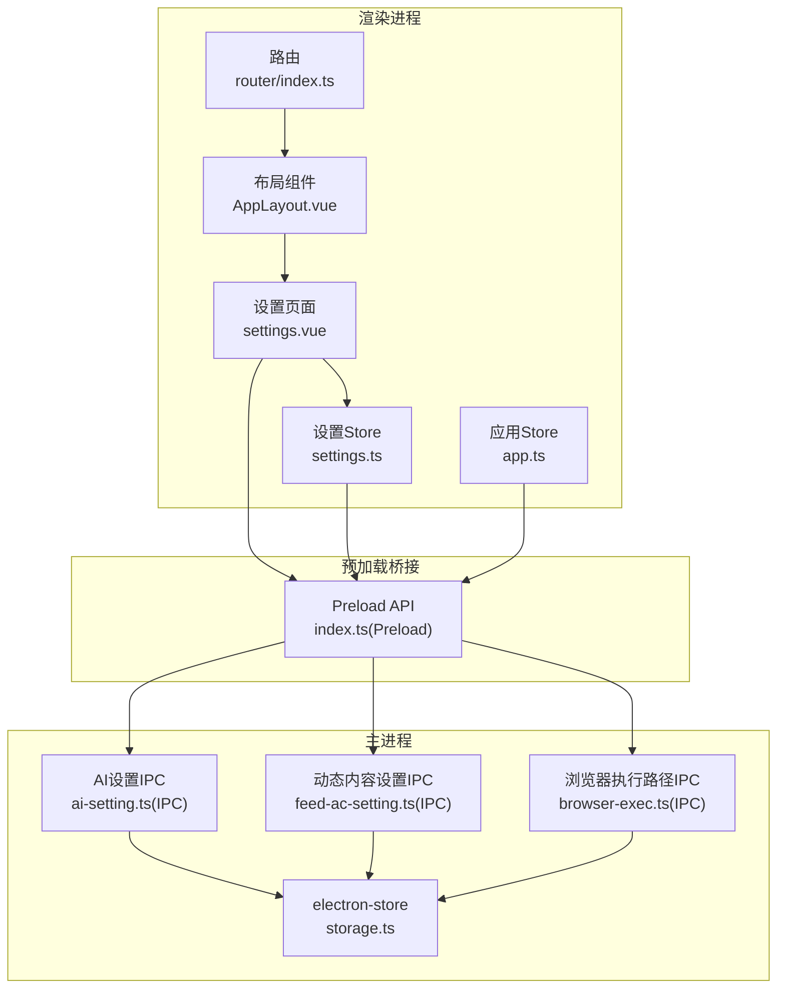
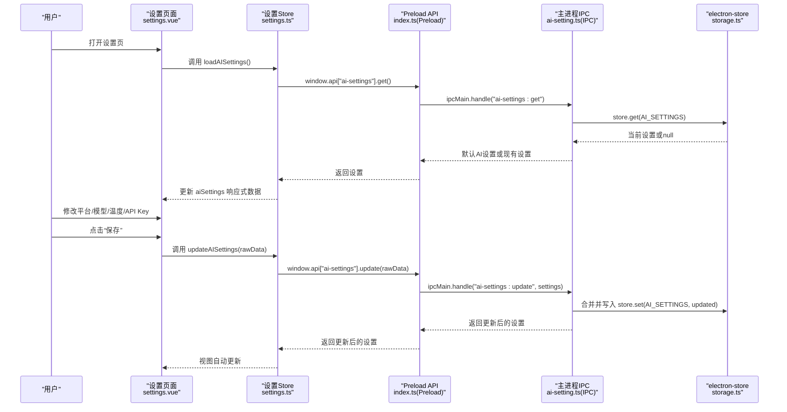
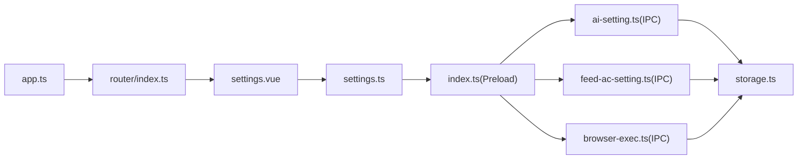

# 设置页面

<cite>
**本文引用的文件**
- [settings.vue](file://src/renderer/src/pages/settings.vue)
- [settings.ts](file://src/renderer/src/stores/settings.ts)
- [ai-setting.ts](file://src/shared/ai-setting.ts)
- [feed-ac-setting.ts](file://src/shared/feed-ac-setting.ts)
- [storage.ts](file://src/main/utils/storage.ts)
- [ai-setting.ts(IPC)](file://src/main/ipc/ai-setting.ts)
- [feed-ac-setting.ts(IPC)](file://src/main/ipc/feed-ac-setting.ts)
- [browser-exec.ts(IPC)](file://src/main/ipc/browser-exec.ts)
- [index.ts(Preload)](file://src/preload/index.ts)
- [index.ts(Main)](file://src/main/index.ts)
- [app.ts](file://src/renderer/src/stores/app.ts)
- [setup.vue](file://src/renderer/src/pages/setup.vue)
- [router/index.ts](file://src/renderer/src/router/index.ts)
- [AppLayout.vue](file://src/renderer/src/components/layout/AppLayout.vue)
</cite>

## 目录
1. [简介](#简介)
2. [项目结构](#项目结构)
3. [核心组件](#核心组件)
4. [架构总览](#架构总览)
5. [详细组件分析](#详细组件分析)
6. [依赖关系分析](#依赖关系分析)
7. [性能与可用性](#性能与可用性)
8. [故障排除指南](#故障排除指南)
9. [结论](#结论)
10. [附录](#附录)

## 简介
本文件面向AutoOps设置页面的开发者与使用者，系统性阐述设置页面的架构设计、数据流、验证与默认值策略、持久化机制、实时生效方式、配置导入导出与重置恢复能力，并给出用户体验、响应式布局与可访问性建议，以及最佳实践与故障排除清单。

## 项目结构
设置页面位于渲染进程，采用Vue单文件组件与Pinia状态管理；设置数据通过Electron IPC与主进程交互，主进程使用electron-store进行本地持久化。整体分层如下：
- 渲染层：设置页面组件、UI组件库、路由守卫、应用布局
- 状态层：Pinia Store（设置Store、应用Store）
- 通信层：Preload桥接API、IPC处理器
- 数据层：electron-store键空间与默认值

图表来源
- [settings.vue:1-165](file://src/renderer/src/pages/settings.vue#L1-L165)
- [settings.ts:1-46](file://src/renderer/src/stores/settings.ts#L1-L46)
- [app.ts:1-71](file://src/renderer/src/stores/app.ts#L1-L71)
- [router/index.ts:1-60](file://src/renderer/src/router/index.ts#L1-L60)
- [index.ts(Preload):130-234](file://src/preload/index.ts#L130-L234)
- [ai-setting.ts(IPC):1-27](file://src/main/ipc/ai-setting.ts#L1-L27)
- [feed-ac-setting.ts(IPC):1-44](file://src/main/ipc/feed-ac-setting.ts#L1-L44)
- [browser-exec.ts(IPC):1-13](file://src/main/ipc/browser-exec.ts#L1-L13)
- [storage.ts:1-53](file://src/main/utils/storage.ts#L1-L53)

章节来源
- [settings.vue:1-165](file://src/renderer/src/pages/settings.vue#L1-L165)
- [settings.ts:1-46](file://src/renderer/src/stores/settings.ts#L1-L46)
- [router/index.ts:1-60](file://src/renderer/src/router/index.ts#L1-L60)
- [AppLayout.vue:1-24](file://src/renderer/src/components/layout/AppLayout.vue#L1-L24)

## 核心组件
- 设置页面组件：负责展示与编辑AI设置、引导进入浏览器设置流程；提供保存与测试按钮。
- 设置Store：封装AI设置与动态内容设置的加载、更新、重置；暴露统一接口供页面调用。
- 应用Store：负责初始化检查（浏览器路径是否存在）、设置浏览器路径。
- IPC处理器：提供设置读取、更新、重置、导出、导入、测试等能力；与electron-store交互。
- 预加载桥接：声明并暴露window.api接口，屏蔽IPC细节。
- electron-store：集中管理键空间与默认值。

章节来源
- [settings.vue:1-165](file://src/renderer/src/pages/settings.vue#L1-L165)
- [settings.ts:1-46](file://src/renderer/src/stores/settings.ts#L1-L46)
- [ai-setting.ts(IPC):1-27](file://src/main/ipc/ai-setting.ts#L1-L27)
- [feed-ac-setting.ts(IPC):1-44](file://src/main/ipc/feed-ac-setting.ts#L1-L44)
- [browser-exec.ts(IPC):1-13](file://src/main/ipc/browser-exec.ts#L1-L13)
- [index.ts(Preload):130-234](file://src/preload/index.ts#L130-L234)
- [storage.ts:1-53](file://src/main/utils/storage.ts#L1-L53)

## 架构总览
设置页面的典型交互流程如下：

图表来源
- [settings.vue:32-48](file://src/renderer/src/pages/settings.vue#L32-L48)
- [settings.ts:24-34](file://src/renderer/src/stores/settings.ts#L24-L34)
- [index.ts(Preload):169-174](file://src/preload/index.ts#L169-L174)
- [ai-setting.ts(IPC):5-22](file://src/main/ipc/ai-setting.ts#L5-L22)
- [storage.ts:46-52](file://src/main/utils/storage.ts#L46-L52)

## 详细组件分析

### 设置页面组件（settings.vue）
- 页面职责
  - 展示并编辑AI设置：平台、API Key、模型、温度。
  - 提供保存与测试按钮；测试结果以提示框形式反馈。
  - 引导至浏览器设置流程（首次启动需要配置浏览器）。
- 数据绑定
  - 使用响应式ref维护aiSettings，双向绑定到表单控件。
  - 平台切换时联动更新可用模型列表，并将模型重置为首个选项。
- 生命周期
  - 组件挂载时从Store加载AI设置，若Store为空则回退到默认值。
- 事件处理
  - 保存：序列化原始对象，调用Store更新，成功后toast提示。
  - 测试：调用window.api["ai-settings"].test，显示成功/失败消息。
- UI与布局
  - 使用Card、Label、Input、Select、Button等组件构建卡片式布局。
  - 采用容器居中与间距控制，保证在不同屏幕下的可读性。

章节来源
- [settings.vue:1-165](file://src/renderer/src/pages/settings.vue#L1-L165)

### 设置Store（settings.ts）
- 职责
  - 封装AI设置与动态内容设置的加载、更新、重置。
  - 通过toRaw确保传给IPC的纯对象，避免Proxy导致的序列化问题。
- 接口
  - loadAISettings / updateAISettings / resetAISettings
  - loadSettings / updateFeedAcSettings / resetFeedAcSettings
- 与IPC交互
  - 通过window.api["ai-settings"]与window.api["feed-ac-settings"]调用主进程处理函数。

章节来源
- [settings.ts:1-46](file://src/renderer/src/stores/settings.ts#L1-L46)

### AI设置模型与默认值（ai-setting.ts）
- 类型与默认值
  - 定义AI平台枚举、AISettings接口与默认值工厂函数。
  - 平台与模型映射表用于根据平台动态填充模型下拉列表。
- 默认值策略
  - 若存储中不存在AI设置，则返回默认值；否则合并部分字段更新。

章节来源
- [ai-setting.ts:1-29](file://src/shared/ai-setting.ts#L1-L29)

### 动态内容设置模型（feed-ac-setting.ts）
- 版本演进
  - 支持v2与v3两种版本；v3引入操作组合、视频分类、跳过策略等增强。
  - 提供从v2迁移到v3的转换函数，确保向后兼容。
- 默认值策略
  - 提供v2与v3默认配置工厂函数；IPC层在读取时确保返回v3形态。
- 导入导出
  - 主进程提供export与import接口，支持跨设备分享与备份。

章节来源
- [feed-ac-setting.ts:1-179](file://src/shared/feed-ac-setting.ts#L1-L179)
- [feed-ac-setting.ts(IPC):16-44](file://src/main/ipc/feed-ac-setting.ts#L16-L44)

### 存储与持久化（storage.ts）
- 键空间
  - 定义了auth、feedAcSettings、aiSettings、browserExecPath、taskHistory、accounts、tasks、taskTemplates、taskConcurrency、taskSchedules等键。
- 默认值
  - 在store.defaults中集中定义各键的默认值，确保首次运行时有合理初始状态。
- 访问方法
  - get(key)与set(key, value)提供统一读写入口。

章节来源
- [storage.ts:1-53](file://src/main/utils/storage.ts#L1-L53)

### IPC处理器（ai-setting.ts(IPC)、feed-ac-setting.ts(IPC)、browser-exec.ts(IPC)）
- AI设置
  - get：读取AI设置，不存在则返回默认值。
  - update：合并当前设置与传入设置，写回存储。
  - reset：写入默认值。
  - test：占位实现，当前返回通用提示信息。
- 动态内容设置
  - get/update/reset：与AI设置一致。
  - export/import：导出完整设置对象，导入时进行版本转换。
- 浏览器执行路径
  - get/set：读取与写入浏览器可执行文件路径。

章节来源
- [ai-setting.ts(IPC):1-27](file://src/main/ipc/ai-setting.ts#L1-L27)
- [feed-ac-setting.ts(IPC):1-44](file://src/main/ipc/feed-ac-setting.ts#L1-L44)
- [browser-exec.ts(IPC):1-13](file://src/main/ipc/browser-exec.ts#L1-L13)

### 预加载桥接（index.ts(Preload)）
- 暴露API
  - 为每个IPC通道提供invoke封装，隐藏底层ipcRenderer细节。
  - 包含feed-ac-settings、ai-settings、browser-exec等通道。
- 事件监听
  - 提供任务进度、动作、状态变化等事件订阅接口（与设置页关联较弱，但属于同一桥接层）。

章节来源
- [index.ts(Preload):130-234](file://src/preload/index.ts#L130-L234)

### 应用初始化与浏览器设置（app.ts、setup.vue、router/index.ts）
- 初始化检查
  - 应用Store在路由守卫前检查浏览器路径，若未配置则重定向至设置向导。
- 设置向导
  - 支持自动检测浏览器、手动选择路径、验证并保存。
- 路由守卫
  - 除setup外，其他页面均要求已完成初始化。

章节来源
- [app.ts:1-71](file://src/renderer/src/stores/app.ts#L1-L71)
- [setup.vue:1-245](file://src/renderer/src/pages/setup.vue#L1-L245)
- [router/index.ts:1-60](file://src/renderer/src/router/index.ts#L1-L60)

## 依赖关系分析
- 组件耦合
  - settings.vue强依赖settings.ts；settings.ts依赖preload桥接与主进程IPC。
  - app.ts与router/index.ts共同决定是否允许进入设置页。
- 外部依赖
  - electron-store作为唯一持久化后端。
  - Pinia提供轻量状态管理。
  - Vue Router提供导航与守卫。

图表来源
- [settings.vue:1-165](file://src/renderer/src/pages/settings.vue#L1-L165)
- [settings.ts:1-46](file://src/renderer/src/stores/settings.ts#L1-L46)
- [index.ts(Preload):130-234](file://src/preload/index.ts#L130-L234)
- [ai-setting.ts(IPC):1-27](file://src/main/ipc/ai-setting.ts#L1-L27)
- [feed-ac-setting.ts(IPC):1-44](file://src/main/ipc/feed-ac-setting.ts#L1-L44)
- [browser-exec.ts(IPC):1-13](file://src/main/ipc/browser-exec.ts#L1-L13)
- [storage.ts:1-53](file://src/main/utils/storage.ts#L1-L53)
- [app.ts:1-71](file://src/renderer/src/stores/app.ts#L1-L71)
- [router/index.ts:1-60](file://src/renderer/src/router/index.ts#L1-L60)

## 性能与可用性
- 性能特性
  - 设置读取与更新均为轻量IPC调用，延迟主要受磁盘IO影响。
  - 使用toRaw避免深层Proxy带来的序列化成本。
- 实时生效
  - 当前实现为“保存即生效”：更新后立即写入存储并在Store中替换引用，视图自动响应。
  - 若未来引入“热重载”，可在Store层增加监听并触发业务模块刷新。
- 用户体验
  - 表单控件具备基础校验（如温度范围），建议在前端补充更严格的格式与必填校验。
  - 测试按钮提供即时反馈，建议在测试失败时提供更具体的错误提示。
- 响应式与可访问性
  - 使用语义化标签与aria-label配合，确保键盘可达与屏幕阅读器友好。
  - 卡片式布局与清晰的标题层级，提升信息密度与可读性。

[本节为通用指导，不直接分析具体文件]

## 故障排除指南
- 无法进入设置页
  - 检查应用Store的初始化状态与路由守卫逻辑，确认浏览器路径是否已配置。
  - 参考：[app.ts:32-37](file://src/renderer/src/stores/app.ts#L32-L37)、[router/index.ts:44-60](file://src/renderer/src/router/index.ts#L44-L60)
- 保存设置无效
  - 确认Store调用updateAISettings是否被触发，检查IPC层update是否写入存储。
  - 参考：[settings.ts:28-30](file://src/renderer/src/stores/settings.ts#L28-L30)、[ai-setting.ts(IPC):11-16](file://src/main/ipc/ai-setting.ts#L11-L16)
- 测试按钮无响应
  - 当前test接口返回占位信息，尚未接入真实AI服务测试逻辑。
  - 参考：[ai-setting.ts(IPC):24-26](file://src/main/ipc/ai-setting.ts#L24-L26)
- 浏览器路径未生效
  - 确认appStore.setBrowserPath是否调用成功，以及router守卫是否更新initialized标志。
  - 参考：[app.ts:39-43](file://src/renderer/src/stores/app.ts#L39-L43)、[browser-exec.ts(IPC):9-12](file://src/main/ipc/browser-exec.ts#L9-L12)
- 动态内容设置导入失败
  - 检查导入数据是否符合v2或v3结构，IPC层会进行版本转换。
  - 参考：[feed-ac-setting.ts(IPC):39-43](file://src/main/ipc/feed-ac-setting.ts#L39-L43)

章节来源
- [app.ts:1-71](file://src/renderer/src/stores/app.ts#L1-L71)
- [router/index.ts:1-60](file://src/renderer/src/router/index.ts#L1-L60)
- [settings.ts:1-46](file://src/renderer/src/stores/settings.ts#L1-L46)
- [ai-setting.ts(IPC):1-27](file://src/main/ipc/ai-setting.ts#L1-L27)
- [browser-exec.ts(IPC):1-13](file://src/main/ipc/browser-exec.ts#L1-L13)
- [feed-ac-setting.ts(IPC):1-44](file://src/main/ipc/feed-ac-setting.ts#L1-L44)

## 结论
设置页面以简洁的卡片式布局承载AI设置与浏览器设置入口，结合Pinia Store与Electron IPC实现了可靠的持久化与实时更新。当前版本重点覆盖AI设置与浏览器路径配置，动态内容设置具备完善的版本迁移与导入导出能力。后续可在以下方面持续优化：
- 增强前端表单校验与错误提示；
- 实现AI设置测试的真实连通性验证；
- 提供设置重置与恢复的批量操作；
- 优化响应式布局与可访问性细节。

[本节为总结性内容，不直接分析具体文件]

## 附录

### 设置项数据绑定与验证
- 数据绑定
  - 使用v-model与v-model.number绑定表单字段，确保类型正确。
  - 平台切换时联动模型列表与默认值。
- 验证规则
  - 温度范围限制在0-2之间，步进0.1。
  - API Key按平台动态绑定，建议在提交前进行非空校验。
- 默认值处理
  - 读取失败时回退到共享模块提供的默认值工厂函数。
- 持久化机制
  - 通过electron-store的统一键空间与默认值策略，确保一致性。

章节来源
- [settings.vue:80-133](file://src/renderer/src/pages/settings.vue#L80-L133)
- [ai-setting.ts:10-22](file://src/shared/ai-setting.ts#L10-L22)
- [storage.ts:16-29](file://src/main/utils/storage.ts#L16-L29)

### 配置导入导出与重置恢复
- 导入导出
  - 动态内容设置提供export与import接口，便于跨设备迁移。
- 重置恢复
  - 提供reset接口，一键恢复到默认配置。
- 版本兼容
  - v2到v3的自动迁移，避免用户手动调整。

章节来源
- [feed-ac-setting.ts(IPC):35-43](file://src/main/ipc/feed-ac-setting.ts#L35-L43)
- [feed-ac-setting.ts:148-174](file://src/shared/feed-ac-setting.ts#L148-L174)

### 实时生效机制
- 保存即生效：更新后立即写入存储并在Store中替换引用，视图自动响应。
- 建议：若存在全局应用状态，可在Store层增加监听并触发业务模块刷新。

章节来源
- [settings.ts:28-30](file://src/renderer/src/stores/settings.ts#L28-L30)
- [ai-setting.ts(IPC):11-16](file://src/main/ipc/ai-setting.ts#L11-L16)

### 用户体验与可访问性
- 布局与交互
  - 卡片式结构清晰，标题层级明确，适合快速定位设置项。
  - 提供“返回首页”与“前往设置”的导航，降低认知负担。
- 可访问性
  - 建议为所有交互元素提供aria-label，确保键盘可达与屏幕阅读器友好。
  - 对提示信息提供颜色与文本双重反馈，避免仅依赖颜色区分。

章节来源
- [settings.vue:67-165](file://src/renderer/src/pages/settings.vue#L67-L165)
- [AppLayout.vue:13-23](file://src/renderer/src/components/layout/AppLayout.vue#L13-L23)