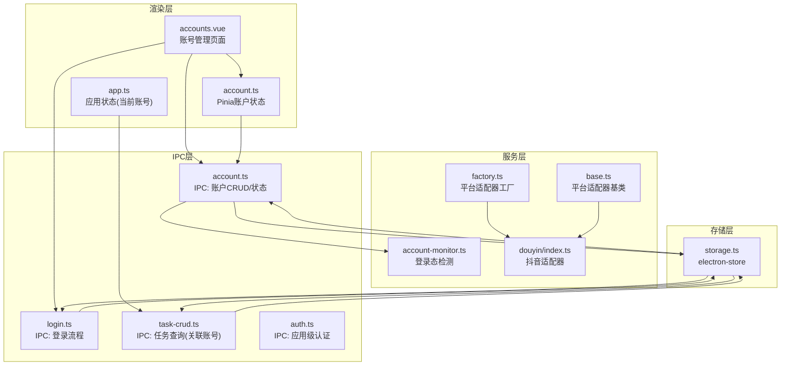
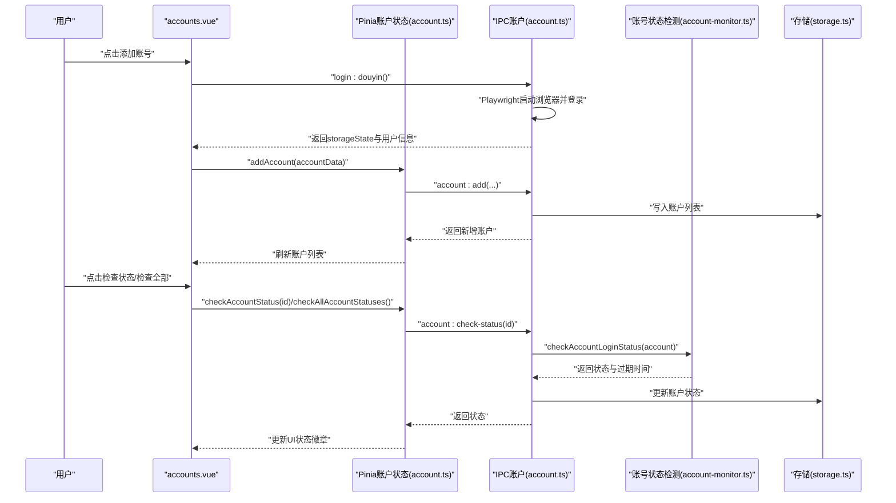
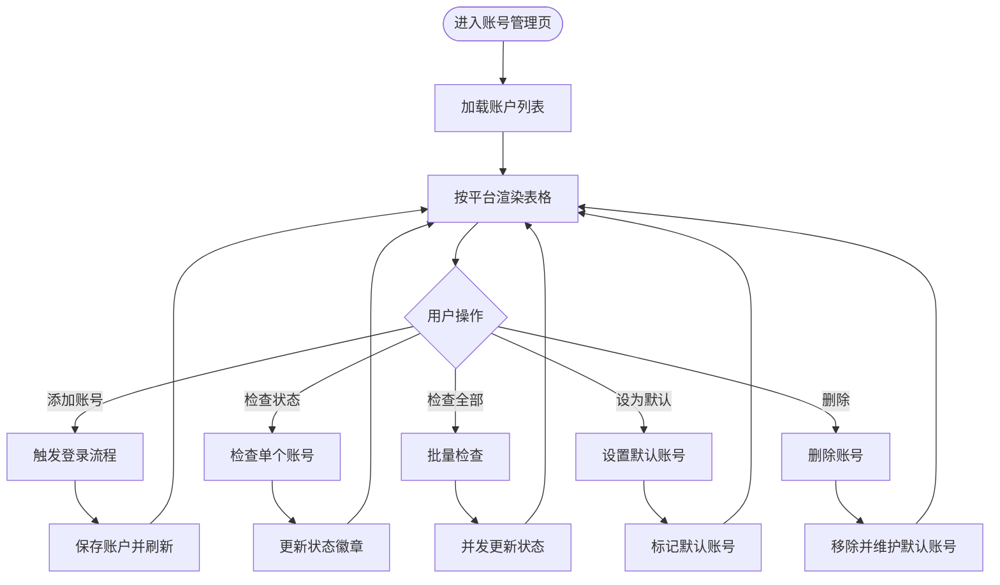
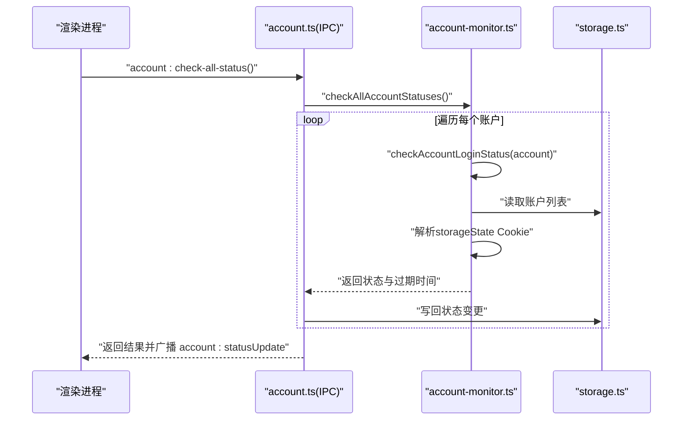
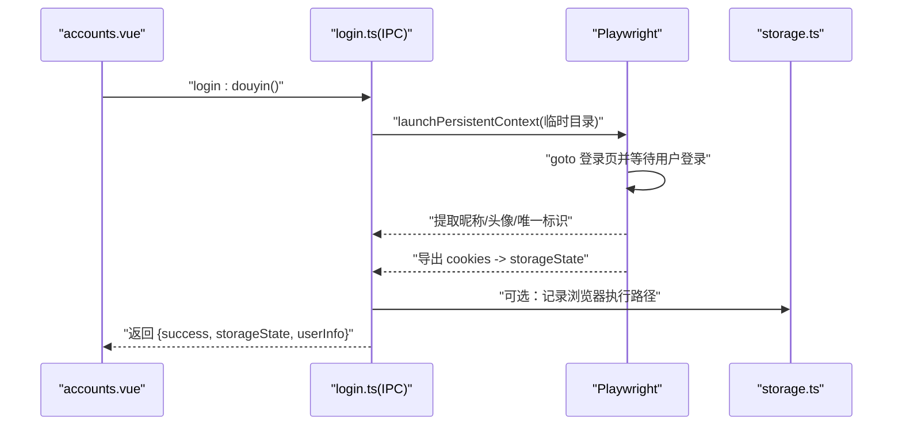
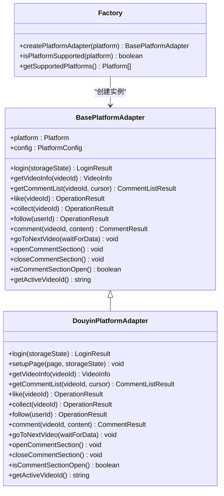
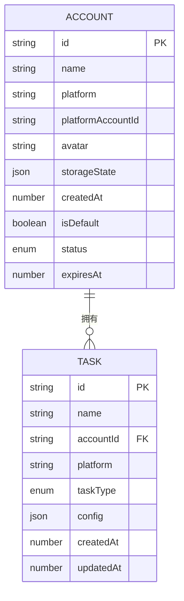
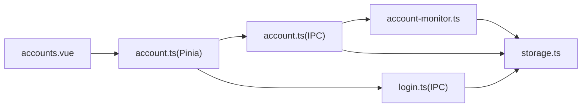

# 账号管理页面

<cite>
**本文引用的文件**
- [src/renderer/src/pages/accounts.vue](file://src/renderer/src/pages/accounts.vue)
- [src/renderer/src/stores/account.ts](file://src/renderer/src/stores/account.ts)
- [src/shared/account.ts](file://src/shared/account.ts)
- [src/main/ipc/account.ts](file://src/main/ipc/account.ts)
- [src/main/service/account-monitor.ts](file://src/main/service/account-monitor.ts)
- [src/main/ipc/login.ts](file://src/main/ipc/login.ts)
- [src/main/utils/storage.ts](file://src/main/utils/storage.ts)
- [src/shared/platform.ts](file://src/shared/platform.ts)
- [src/main/platform/base.ts](file://src/main/platform/base.ts)
- [src/main/platform/factory.ts](file://src/main/platform/factory.ts)
- [src/main/platform/douyin/index.ts](file://src/main/platform/douyin/index.ts)
- [src/renderer/src/stores/app.ts](file://src/renderer/src/stores/app.ts)
- [src/main/ipc/task-crud.ts](file://src/main/ipc/task-crud.ts)
- [src/shared/task.ts](file://src/shared/task.ts)
- [src/main/ipc/auth.ts](file://src/main/ipc/auth.ts)
</cite>

## 目录
1. [简介](#简介)
2. [项目结构](#项目结构)
3. [核心组件](#核心组件)
4. [架构总览](#架构总览)
5. [详细组件分析](#详细组件分析)
6. [依赖关系分析](#依赖关系分析)
7. [性能考量](#性能考量)
8. [故障排除指南](#故障排除指南)
9. [结论](#结论)
10. [附录](#附录)

## 简介
本文件面向AutoOps账号管理页面的开发者与使用者，系统性阐述账号管理功能的实现与使用方法，涵盖多账号支持、账号添加、编辑、删除、登录状态管理、账号配置项设计、账号与任务的关联关系、账号切换机制、批量操作、安全存储与隐私保护、最佳实践与性能优化建议等内容。目标是帮助读者快速理解并高效使用该功能。

## 项目结构
账号管理页面位于渲染进程，通过Pinia状态管理与Electron IPC通信访问主进程服务，主进程负责持久化存储与平台登录态检测。整体采用“渲染层-状态层-IPC层-服务层-存储层”的分层架构。

图表来源
- [src/renderer/src/pages/accounts.vue:1-289](file://src/renderer/src/pages/accounts.vue#L1-L289)
- [src/renderer/src/stores/account.ts:1-128](file://src/renderer/src/stores/account.ts#L1-L128)
- [src/renderer/src/stores/app.ts:1-71](file://src/renderer/src/stores/app.ts#L1-L71)
- [src/main/ipc/account.ts:1-128](file://src/main/ipc/account.ts#L1-L128)
- [src/main/ipc/login.ts:1-193](file://src/main/ipc/login.ts#L1-L193)
- [src/main/ipc/task-crud.ts:1-108](file://src/main/ipc/task-crud.ts#L1-L108)
- [src/main/service/account-monitor.ts:1-110](file://src/main/service/account-monitor.ts#L1-L110)
- [src/main/platform/factory.ts:1-32](file://src/main/platform/factory.ts#L1-L32)
- [src/main/platform/base.ts:1-105](file://src/main/platform/base.ts#L1-L105)
- [src/main/platform/douyin/index.ts:1-494](file://src/main/platform/douyin/index.ts#L1-L494)
- [src/main/utils/storage.ts:1-53](file://src/main/utils/storage.ts#L1-L53)

章节来源
- [src/renderer/src/pages/accounts.vue:1-289](file://src/renderer/src/pages/accounts.vue#L1-L289)
- [src/renderer/src/stores/account.ts:1-128](file://src/renderer/src/stores/account.ts#L1-L128)
- [src/main/ipc/account.ts:1-128](file://src/main/ipc/account.ts#L1-L128)
- [src/main/ipc/login.ts:1-193](file://src/main/ipc/login.ts#L1-L193)
- [src/main/service/account-monitor.ts:1-110](file://src/main/service/account-monitor.ts#L1-L110)
- [src/main/utils/storage.ts:1-53](file://src/main/utils/storage.ts#L1-L53)
- [src/shared/platform.ts:1-260](file://src/shared/platform.ts#L1-L260)
- [src/main/platform/base.ts:1-105](file://src/main/platform/base.ts#L1-L105)
- [src/main/platform/factory.ts:1-32](file://src/main/platform/factory.ts#L1-L32)
- [src/main/platform/douyin/index.ts:1-494](file://src/main/platform/douyin/index.ts#L1-L494)
- [src/renderer/src/stores/app.ts:1-71](file://src/renderer/src/stores/app.ts#L1-L71)
- [src/main/ipc/task-crud.ts:1-108](file://src/main/ipc/task-crud.ts#L1-L108)
- [src/shared/task.ts:1-62](file://src/shared/task.ts#L1-L62)
- [src/main/ipc/auth.ts:1-23](file://src/main/ipc/auth.ts#L1-L23)

## 核心组件
- 渲染页面：负责UI展示、用户交互与提示反馈，调用Pinia store与IPC接口。
- Pinia账户状态：集中管理账户列表、默认账号、当前账号、按平台分组等。
- IPC账户服务：提供账户增删改查、设置默认、检查单个/全部状态等接口。
- 登录IPC：基于Playwright的浏览器自动化登录流程，提取用户信息与登录态。
- 账号状态检测：解析storageState中的Cookie过期时间，判断登录态有效性。
- 存储：electron-store统一存储账户、任务、设置等数据。
- 平台适配器：抽象平台能力，支持多平台扩展；当前支持抖音、快手、小红书等。

章节来源
- [src/renderer/src/pages/accounts.vue:1-289](file://src/renderer/src/pages/accounts.vue#L1-L289)
- [src/renderer/src/stores/account.ts:1-128](file://src/renderer/src/stores/account.ts#L1-L128)
- [src/main/ipc/account.ts:1-128](file://src/main/ipc/account.ts#L1-L128)
- [src/main/ipc/login.ts:1-193](file://src/main/ipc/login.ts#L1-L193)
- [src/main/service/account-monitor.ts:1-110](file://src/main/service/account-monitor.ts#L1-L110)
- [src/main/utils/storage.ts:1-53](file://src/main/utils/storage.ts#L1-L53)
- [src/shared/platform.ts:1-260](file://src/shared/platform.ts#L1-L260)
- [src/main/platform/base.ts:1-105](file://src/main/platform/base.ts#L1-L105)
- [src/main/platform/factory.ts:1-32](file://src/main/platform/factory.ts#L1-L32)
- [src/main/platform/douyin/index.ts:1-494](file://src/main/platform/douyin/index.ts#L1-L494)

## 架构总览
账号管理页面的控制流从用户操作开始，贯穿渲染层、状态层、IPC层、服务层与存储层，最终返回结果并更新UI。

图表来源
- [src/renderer/src/pages/accounts.vue:110-160](file://src/renderer/src/pages/accounts.vue#L110-L160)
- [src/renderer/src/stores/account.ts:41-105](file://src/renderer/src/stores/account.ts#L41-L105)
- [src/main/ipc/account.ts:102-126](file://src/main/ipc/account.ts#L102-L126)
- [src/main/service/account-monitor.ts:17-75](file://src/main/service/account-monitor.ts#L17-L75)
- [src/main/ipc/login.ts:86-187](file://src/main/ipc/login.ts#L86-L187)
- [src/main/utils/storage.ts:16-53](file://src/main/utils/storage.ts#L16-L53)

## 详细组件分析

### 页面与状态：accounts.vue 与 account.ts
- 多平台分组展示：按平台聚合账户，支持抖音、快手、小红书等。
- 功能入口：添加账号、检查全部状态、逐个检查状态、设为默认、删除。
- 状态映射：将登录态映射为“正常/已过期/检查中/未激活/未知”，并以徽章与图标呈现。
- 交互反馈：使用toast进行成功/失败提示；加载与检查状态期间禁用按钮。

图表来源
- [src/renderer/src/pages/accounts.vue:60-160](file://src/renderer/src/pages/accounts.vue#L60-L160)
- [src/renderer/src/stores/account.ts:41-125](file://src/renderer/src/stores/account.ts#L41-L125)

章节来源
- [src/renderer/src/pages/accounts.vue:1-289](file://src/renderer/src/pages/accounts.vue#L1-L289)
- [src/renderer/src/stores/account.ts:1-128](file://src/renderer/src/stores/account.ts#L1-L128)

### IPC与存储：账户CRUD与状态检查
- 列表/新增/更新/删除/设置默认/按平台筛选/活跃账号查询等接口。
- 状态检查：根据storageState中的Cookie过期时间判断登录态，并持久化更新。
- 批量检查：遍历账户并并发检查，完成后向渲染进程广播状态更新事件。

图表来源
- [src/main/ipc/account.ts:124-127](file://src/main/ipc/account.ts#L124-L127)
- [src/main/service/account-monitor.ts:80-109](file://src/main/service/account-monitor.ts#L80-L109)
- [src/main/utils/storage.ts:16-53](file://src/main/utils/storage.ts#L16-L53)

章节来源
- [src/main/ipc/account.ts:1-128](file://src/main/ipc/account.ts#L1-L128)
- [src/main/service/account-monitor.ts:1-110](file://src/main/service/account-monitor.ts#L1-L110)
- [src/main/utils/storage.ts:1-53](file://src/main/utils/storage.ts#L1-L53)

### 登录流程：Playwright自动化登录
- 通过Playwright启动带临时用户目录的浏览器上下文，打开登录页。
- 等待用户完成登录（监听URL变化），提取用户昵称、头像、唯一标识。
- 截取Cookies并序列化为storageState返回给渲染进程，用于后续登录态复用。

图表来源
- [src/main/ipc/login.ts:86-187](file://src/main/ipc/login.ts#L86-L187)
- [src/main/utils/storage.ts:16-53](file://src/main/utils/storage.ts#L16-L53)

章节来源
- [src/main/ipc/login.ts:1-193](file://src/main/ipc/login.ts#L1-L193)
- [src/main/utils/storage.ts:1-53](file://src/main/utils/storage.ts#L1-L53)

### 平台适配与账号切换
- 平台适配器工厂：根据平台类型返回对应适配器实例，支持扩展新平台。
- 基类定义：统一登录、浏览、互动、评论等接口契约。
- 抖音适配器：实现登录、视频缓存、评论发布、键盘快捷键等具体逻辑。
- 账号切换：应用状态store维护当前账号ID，任务执行时据此选择对应账号。

图表来源
- [src/main/platform/base.ts:24-80](file://src/main/platform/base.ts#L24-L80)
- [src/main/platform/douyin/index.ts:60-494](file://src/main/platform/douyin/index.ts#L60-L494)
- [src/main/platform/factory.ts:7-32](file://src/main/platform/factory.ts#L7-L32)

章节来源
- [src/main/platform/base.ts:1-105](file://src/main/platform/base.ts#L1-L105)
- [src/main/platform/douyin/index.ts:1-494](file://src/main/platform/douyin/index.ts#L1-L494)
- [src/main/platform/factory.ts:1-32](file://src/main/platform/factory.ts#L1-L32)
- [src/renderer/src/stores/app.ts:1-71](file://src/renderer/src/stores/app.ts#L1-L71)

### 账号与任务的关联关系
- 任务模型包含accountId字段，表示该任务绑定的账号。
- 任务查询支持按账号过滤，便于在任务列表中筛选某账号的任务。
- 应用状态store维护currentAccountId，用于任务执行时选择当前账号。

图表来源
- [src/shared/account.ts:3-15](file://src/shared/account.ts#L3-L15)
- [src/shared/task.ts:12-22](file://src/shared/task.ts#L12-L22)
- [src/main/ipc/task-crud.ts:19-22](file://src/main/ipc/task-crud.ts#L19-L22)
- [src/renderer/src/stores/app.ts:45-47](file://src/renderer/src/stores/app.ts#L45-L47)

章节来源
- [src/shared/account.ts:1-39](file://src/shared/account.ts#L1-L39)
- [src/shared/task.ts:1-62](file://src/shared/task.ts#L1-L62)
- [src/main/ipc/task-crud.ts:1-108](file://src/main/ipc/task-crud.ts#L1-L108)
- [src/renderer/src/stores/app.ts:1-71](file://src/renderer/src/stores/app.ts#L1-L71)

### 账号配置项设计
- 账号基础字段：id、name、platform、platformAccountId、avatar、storageState、createdAt、isDefault、status、expiresAt。
- 登录凭证管理：storageState中包含cookies数组，用于跨会话复用登录态。
- 平台特定配置：通过平台枚举与平台配置对象，支持不同平台的选择器、API端点与快捷键。
- 账号状态监控：基于Cookie过期时间判断登录态，支持“正常/即将过期/已过期/未激活/检查中”。

章节来源
- [src/shared/account.ts:1-39](file://src/shared/account.ts#L1-L39)
- [src/shared/platform.ts:1-260](file://src/shared/platform.ts#L1-L260)
- [src/main/service/account-monitor.ts:17-75](file://src/main/service/account-monitor.ts#L17-L75)

### 安全存储与隐私保护
- 存储位置：electron-store默认存储于系统用户目录，避免明文泄露。
- 登录态存储：storageState序列化后写入存储，仅包含必要字段（name/value/domain/path/expire等）。
- 浏览器路径校验：登录前检查浏览器执行路径，防止未配置导致异常。
- 敏感信息最小化：仅保存登录态与必要元数据，不保存明文密码。

章节来源
- [src/main/utils/storage.ts:16-53](file://src/main/utils/storage.ts#L16-L53)
- [src/main/ipc/login.ts:86-187](file://src/main/ipc/login.ts#L86-L187)
- [src/main/ipc/account.ts:20-26](file://src/main/ipc/account.ts#L20-L26)

## 依赖关系分析
- 渲染层依赖Pinia状态与IPC接口，UI与业务逻辑解耦。
- IPC层依赖存储与服务层，提供稳定的接口契约。
- 服务层依赖存储与外部库（Playwright），负责登录态检测与平台适配。
- 存储层为全局单一数据源，确保一致性。

图表来源
- [src/renderer/src/pages/accounts.vue:1-289](file://src/renderer/src/pages/accounts.vue#L1-L289)
- [src/renderer/src/stores/account.ts:1-128](file://src/renderer/src/stores/account.ts#L1-L128)
- [src/main/ipc/account.ts:1-128](file://src/main/ipc/account.ts#L1-L128)
- [src/main/ipc/login.ts:1-193](file://src/main/ipc/login.ts#L1-L193)
- [src/main/service/account-monitor.ts:1-110](file://src/main/service/account-monitor.ts#L1-L110)
- [src/main/utils/storage.ts:1-53](file://src/main/utils/storage.ts#L1-L53)

章节来源
- [src/renderer/src/pages/accounts.vue:1-289](file://src/renderer/src/pages/accounts.vue#L1-L289)
- [src/renderer/src/stores/account.ts:1-128](file://src/renderer/src/stores/account.ts#L1-L128)
- [src/main/ipc/account.ts:1-128](file://src/main/ipc/account.ts#L1-L128)
- [src/main/ipc/login.ts:1-193](file://src/main/ipc/login.ts#L1-L193)
- [src/main/service/account-monitor.ts:1-110](file://src/main/service/account-monitor.ts#L1-L110)
- [src/main/utils/storage.ts:1-53](file://src/main/utils/storage.ts#L1-L53)

## 性能考量
- 批量状态检查：使用Promise.all并发检查，减少等待时间。
- 视频数据缓存：平台适配器缓存视频数据，降低重复请求成本。
- UI响应：在检查/登录过程中禁用按钮并显示加载动画，提升用户体验。
- 存储读写：集中使用electron-store，避免频繁I/O。

章节来源
- [src/renderer/src/stores/account.ts:100-105](file://src/renderer/src/stores/account.ts#L100-L105)
- [src/main/platform/douyin/index.ts:131-157](file://src/main/platform/douyin/index.ts#L131-L157)
- [src/renderer/src/pages/accounts.vue:170-179](file://src/renderer/src/pages/accounts.vue#L170-L179)
- [src/main/utils/storage.ts:16-53](file://src/main/utils/storage.ts#L16-L53)

## 故障排除指南
- 登录失败
  - 现象：登录流程报错或无storageState。
  - 排查：确认浏览器执行路径已配置；检查网络与登录页加载；查看日志输出。
  - 参考
    - [src/main/ipc/login.ts:86-187](file://src/main/ipc/login.ts#L86-L187)
    - [src/main/ipc/auth.ts:5-8](file://src/main/ipc/auth.ts#L5-L8)
- 账号状态异常
  - 现象：状态显示“未知/未激活”。
  - 排查：检查storageState是否存在；确认Cookies中存在关键登录Cookie；核对过期时间。
  - 参考
    - [src/main/service/account-monitor.ts:17-75](file://src/main/service/account-monitor.ts#L17-L75)
    - [src/main/ipc/account.ts:102-121](file://src/main/ipc/account.ts#L102-L121)
- 默认账号丢失
  - 现象：删除最后一个账号后无默认账号。
  - 排查：删除逻辑会在剩余账号中自动设置默认；若异常，手动重新设置。
  - 参考
    - [src/main/ipc/account.ts:62-70](file://src/main/ipc/account.ts#L62-L70)
- 任务无法绑定账号
  - 现象：任务列表为空或找不到指定账号的任务。
  - 排查：确认任务创建时传入了正确的accountId；使用按账号查询接口验证。
  - 参考
    - [src/shared/task.ts:12-22](file://src/shared/task.ts#L12-L22)
    - [src/main/ipc/task-crud.ts:19-22](file://src/main/ipc/task-crud.ts#L19-L22)

章节来源
- [src/main/ipc/login.ts:1-193](file://src/main/ipc/login.ts#L1-L193)
- [src/main/service/account-monitor.ts:1-110](file://src/main/service/account-monitor.ts#L1-L110)
- [src/main/ipc/account.ts:1-128](file://src/main/ipc/account.ts#L1-L128)
- [src/shared/task.ts:1-62](file://src/shared/task.ts#L1-L62)
- [src/main/ipc/task-crud.ts:1-108](file://src/main/ipc/task-crud.ts#L1-L108)
- [src/main/ipc/auth.ts:1-23](file://src/main/ipc/auth.ts#L1-L23)

## 结论
账号管理页面通过清晰的分层架构实现了多平台、多账号的统一管理，结合IPC与服务层的协同，提供了完整的登录态检测、批量状态更新与安全存储能力。配合平台适配器的扩展机制，未来可便捷地支持更多平台。建议在生产环境中强化日志与告警、定期清理过期账号、限制并发检查频率以平衡性能与资源消耗。

## 附录
- 最佳实践
  - 使用“检查全部状态”定期维护账号有效性。
  - 新增账号后立即设置为默认，避免任务执行时未选择账号。
  - 对高价值账号启用更严格的过期预警策略。
  - 在任务模板中预置常用配置，减少重复设置。
- 性能优化建议
  - 合理设置批量检查间隔，避免频繁触发浏览器登录态检测。
  - 利用平台适配器的视频缓存机制，减少重复请求。
  - 控制同时运行的任务数量，避免浏览器上下文过多导致资源紧张。
- 隐私与安全
  - storageState仅包含必要字段，不保存明文密码。
  - 临时登录目录与浏览器上下文隔离，降低凭据泄露风险。
  - 定期清理过期账号与临时目录，保持环境整洁。