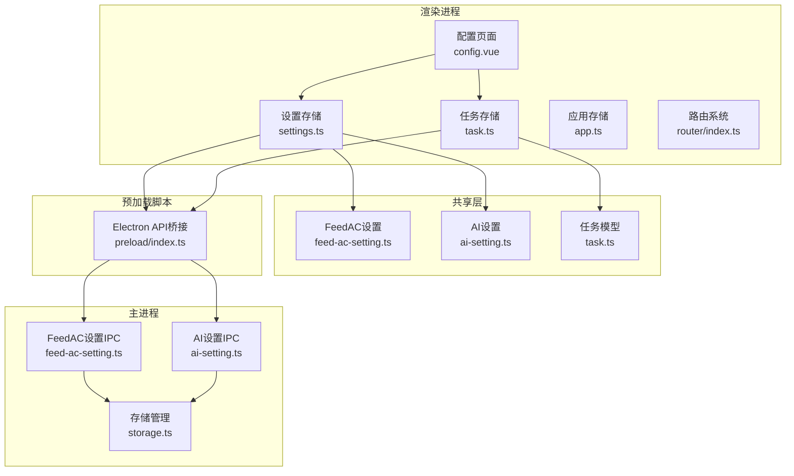
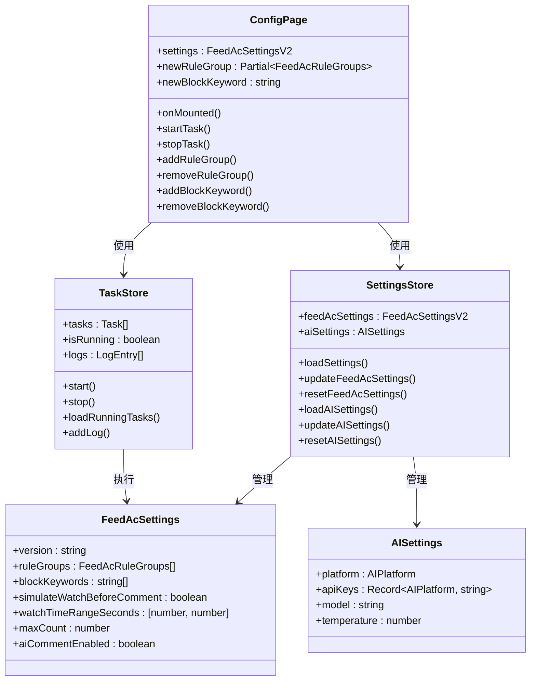
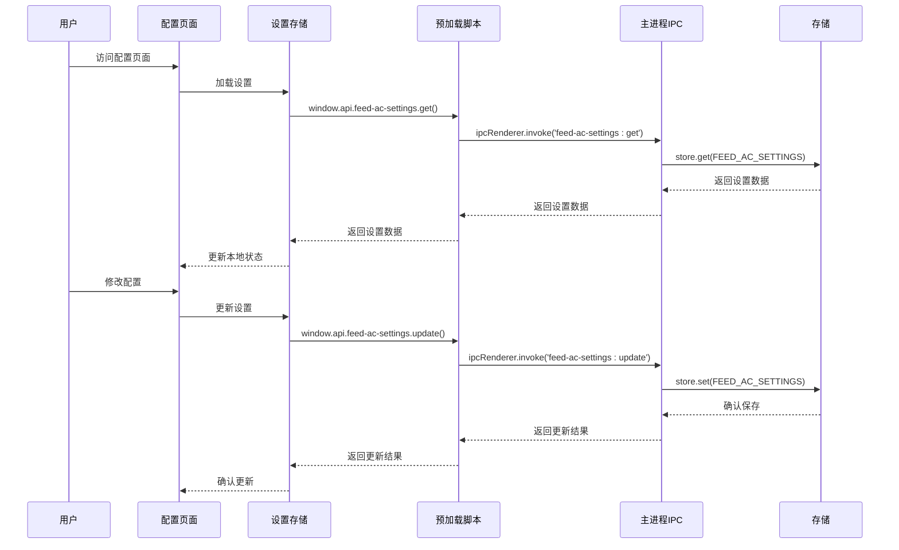
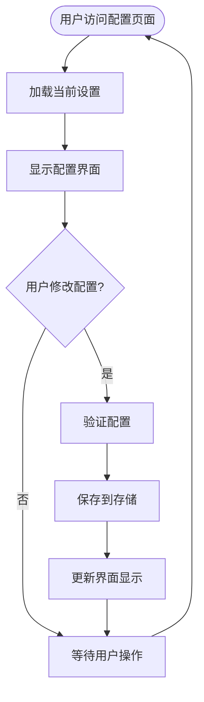
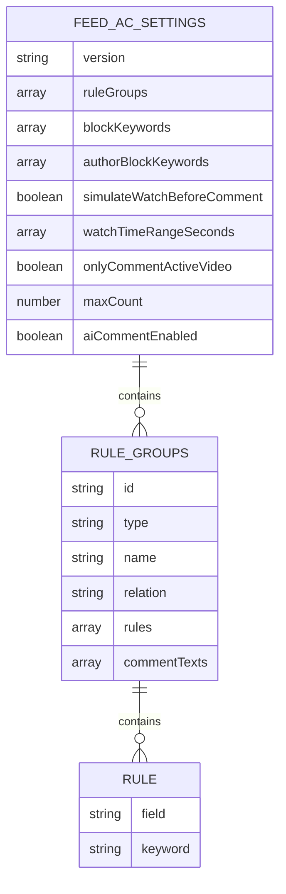
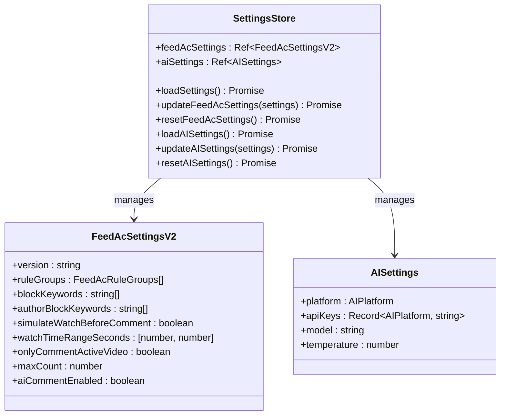
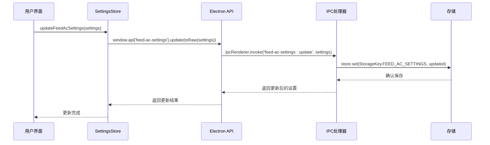
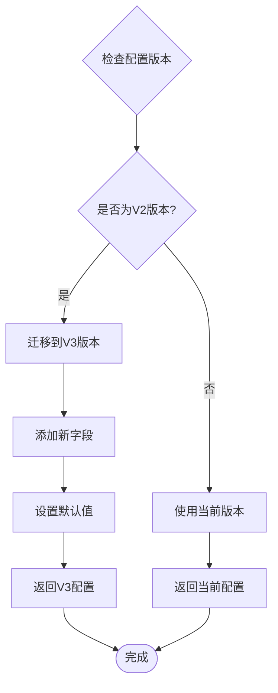
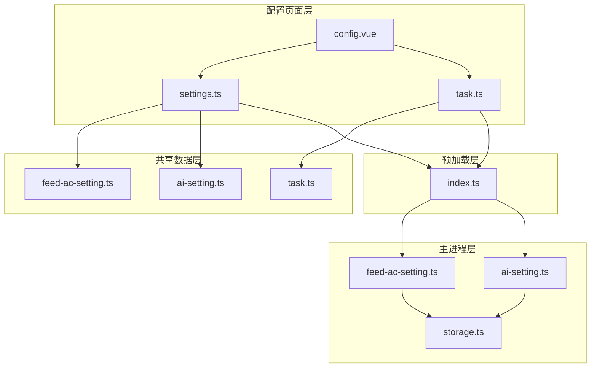
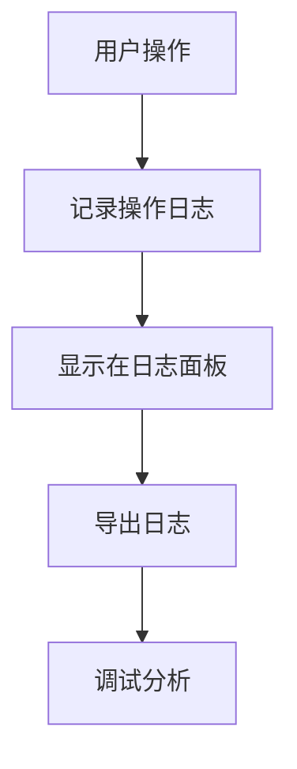

# 配置页面

<cite>
**本文档引用的文件**
- [config.vue](file://src/renderer/src/pages/config.vue)
- [settings.ts](file://src/renderer/src/stores/settings.ts)
- [feed-ac-setting.ts](file://src/shared/feed-ac-setting.ts)
- [ai-setting.ts](file://src/shared/ai-setting.ts)
- [task.ts](file://src/shared/task.ts)
- [index.ts](file://src/preload/index.ts)
- [feed-ac-setting.ts](file://src/main/ipc/feed-ac-setting.ts)
- [ai-setting.ts](file://src/main/ipc/ai-setting.ts)
- [storage.ts](file://src/main/utils/storage.ts)
- [task.ts](file://src/renderer/src/stores/task.ts)
- [app.ts](file://src/renderer/src/stores/app.ts)
- [index.ts](file://src/renderer/src/router/index.ts)
</cite>

## 目录
1. [简介](#简介)
2. [项目结构](#项目结构)
3. [核心组件](#核心组件)
4. [架构概览](#架构概览)
5. [详细组件分析](#详细组件分析)
6. [依赖关系分析](#依赖关系分析)
7. [性能考虑](#性能考虑)
8. [故障排除指南](#故障排除指南)
9. [结论](#结论)

## 简介

配置页面是AutoOps自动化运营工具的核心功能模块，专门用于管理和配置任务相关的各种参数设置。该页面提供了完整的配置管理界面，支持系统配置、环境变量、高级设置等功能，是用户与系统交互的主要入口之一。

AutoOps是一个基于Electron + Vue 3的技术栈构建的多平台自动化运营工具，支持AI智能评论、多操作自动化、模拟真人行为等核心功能。配置页面作为系统的重要组成部分，承担着以下职责：
- 提供直观的配置界面
- 管理任务配置参数
- 支持配置的动态加载和热重载
- 实现配置验证和错误处理
- 提供配置导入导出功能

## 项目结构

AutoOps采用现代化的前后端分离架构，配置页面位于渲染进程的Vue应用中，通过IPC通信与主进程进行数据交换。



**图表来源**
- [config.vue:1-323](file://src/renderer/src/pages/config.vue#L1-L323)
- [settings.ts:1-46](file://src/renderer/src/stores/settings.ts#L1-L46)
- [feed-ac-setting.ts:1-179](file://src/shared/feed-ac-setting.ts#L1-L179)

**章节来源**
- [config.vue:1-323](file://src/renderer/src/pages/config.vue#L1-L323)
- [index.ts:1-235](file://src/preload/index.ts#L1-L235)

## 核心组件

配置页面由多个核心组件构成，每个组件负责特定的功能领域：

### 主要组件架构



**图表来源**
- [config.vue:19-104](file://src/renderer/src/pages/config.vue#L19-L104)
- [settings.ts:8-45](file://src/renderer/src/stores/settings.ts#L8-L45)
- [feed-ac-setting.ts:22-33](file://src/shared/feed-ac-setting.ts#L22-L33)
- [ai-setting.ts:3-8](file://src/shared/ai-setting.ts#L3-L8)

### 配置页面功能特性

配置页面提供了四个主要的功能区域：

1. **基础设置**：包含基本的任务参数配置
2. **规则配置**：管理规则组和评论内容
3. **屏蔽词**：配置视频描述和作者名的屏蔽词
4. **AI设置**：配置AI评论功能

**章节来源**
- [config.vue:114-296](file://src/renderer/src/pages/config.vue#L114-L296)

## 架构概览

配置页面采用分层架构设计，确保了良好的可维护性和扩展性。



**图表来源**
- [config.vue:41-55](file://src/renderer/src/pages/config.vue#L41-L55)
- [settings.ts:12-18](file://src/renderer/src/stores/settings.ts#L12-L18)
- [feed-ac-setting.ts:16-27](file://src/main/ipc/feed-ac-setting.ts#L16-L27)

### 数据流架构

配置页面的数据流遵循单向数据流原则，确保了数据的一致性和可预测性：



**图表来源**
- [config.vue:41-46](file://src/renderer/src/pages/config.vue#L41-L46)
- [settings.ts:16-18](file://src/renderer/src/stores/settings.ts#L16-L18)

## 详细组件分析

### 配置页面组件分析

配置页面是整个系统的前端入口，采用了响应式编程模式，使用Vue 3的Composition API实现了高度动态的用户界面。

#### 核心功能实现

配置页面的核心功能包括：

1. **设置加载**：在组件挂载时自动加载当前的配置设置
2. **实时编辑**：支持双向绑定的表单控件
3. **规则管理**：动态添加和删除规则组
4. **屏蔽词管理**：支持关键词的增删操作
5. **任务控制**：启动和停止任务执行

#### 配置数据结构

配置页面使用了复杂的嵌套数据结构来表示任务配置：



**图表来源**
- [feed-ac-setting.ts:22-33](file://src/shared/feed-ac-setting.ts#L22-L33)
- [feed-ac-setting.ts:9-20](file://src/shared/feed-ac-setting.ts#L9-L20)
- [feed-ac-setting.ts:4-7](file://src/shared/feed-ac-setting.ts#L4-L7)

**章节来源**
- [config.vue:19-104](file://src/renderer/src/pages/config.vue#L19-L104)
- [feed-ac-setting.ts:148-174](file://src/shared/feed-ac-setting.ts#L148-L174)

### 设置存储组件分析

设置存储组件是配置页面的核心数据管理层，使用Pinia状态管理库实现了集中式的配置状态管理。

#### 存储架构设计



**图表来源**
- [settings.ts:8-45](file://src/renderer/src/stores/settings.ts#L8-L45)
- [feed-ac-setting.ts:22-33](file://src/shared/feed-ac-setting.ts#L22-L33)
- [ai-setting.ts:3-8](file://src/shared/ai-setting.ts#L3-L8)

#### 异步操作流程

设置存储组件实现了完整的异步操作流程，确保了数据的一致性和可靠性：



**图表来源**
- [settings.ts:16-18](file://src/renderer/src/stores/settings.ts#L16-L18)
- [feed-ac-setting.ts:22-27](file://src/main/ipc/feed-ac-setting.ts#L22-L27)

**章节来源**
- [settings.ts:1-46](file://src/renderer/src/stores/settings.ts#L1-L46)
- [index.ts:163-169](file://src/preload/index.ts#L163-L169)

### 主进程IPC处理分析

主进程的IPC处理层负责实际的配置持久化和数据管理，采用了安全的存储策略和版本兼容性处理。

#### IPC处理器架构

```mermaid
classDiagram
class FeedAcSettingIPC {
+registerFeedAcSettingIPC()
+get() Promise~FeedAcSettingsV3~
+update(settings) Promise~FeedAcSettingsV3~
+reset() Promise~FeedAcSettingsV3~
+export() Promise~FeedAcSettingsV3~
+import(settings) Promise~{success : boolean}~
}
class AISettingIPC {
+registerAISettingIPC()
+get() Promise~AISettings~
+update(settings) Promise~AISettings~
+reset() Promise~AISettings~
+test(config) Promise~{success : boolean, message : string}~
}
class Storage {
+get(key) any
+set(key, value) void
}
FeedAcSettingIPC --> Storage : uses
AISettingIPC --> Storage : uses
```

**图表来源**
- [feed-ac-setting.ts:16-44](file://src/main/ipc/feed-ac-setting.ts#L16-L44)
- [ai-setting.ts:5-27](file://src/main/ipc/ai-setting.ts#L5-L27)
- [storage.ts:16-29](file://src/main/utils/storage.ts#L16-L29)

#### 版本迁移机制

系统实现了智能的版本迁移机制，确保从旧版本配置到新版本的平滑过渡：



**图表来源**
- [feed-ac-setting.ts:10-14](file://src/main/ipc/feed-ac-setting.ts#L10-L14)
- [feed-ac-setting.ts:148-174](file://src/shared/feed-ac-setting.ts#L148-L174)

**章节来源**
- [feed-ac-setting.ts:16-44](file://src/main/ipc/feed-ac-setting.ts#L16-L44)
- [ai-setting.ts:5-27](file://src/main/ipc/ai-setting.ts#L5-L27)

## 依赖关系分析

配置页面的依赖关系体现了清晰的分层架构和职责分离。



**图表来源**
- [config.vue:11-17](file://src/renderer/src/pages/config.vue#L11-L17)
- [settings.ts:3-6](file://src/renderer/src/stores/settings.ts#L3-L6)
- [index.ts:163-175](file://src/preload/index.ts#L163-L175)

### 依赖注入和解耦

配置页面通过依赖注入实现了良好的解耦：

1. **组件间解耦**：配置页面不直接依赖具体的存储实现
2. **接口抽象**：通过预加载脚本提供统一的API接口
3. **数据流管理**：使用Pinia实现集中式状态管理
4. **IPC通信**：通过Electron IPC实现进程间通信

**章节来源**
- [index.ts:131-235](file://src/preload/index.ts#L131-L235)
- [settings.ts:12-18](file://src/renderer/src/stores/settings.ts#L12-L18)

## 性能考虑

配置页面在设计时充分考虑了性能优化和用户体验：

### 渲染性能优化

1. **响应式更新**：使用Vue 3的响应式系统，只更新变化的部分
2. **虚拟滚动**：对于大量配置项使用虚拟滚动技术
3. **懒加载**：非关键功能采用懒加载策略
4. **防抖处理**：对频繁的配置变更进行防抖处理

### 内存管理

1. **状态清理**：及时清理不再使用的状态和监听器
2. **垃圾回收**：合理管理大对象的生命周期
3. **内存泄漏防护**：确保事件监听器的正确移除

### 网络和存储优化

1. **批量操作**：支持批量配置更新以减少IPC调用
2. **缓存策略**：对常用配置进行内存缓存
3. **增量更新**：只传输变化的配置数据

## 故障排除指南

配置页面可能遇到的各种问题及解决方案：

### 常见问题诊断

#### 配置加载失败

**症状**：配置页面无法显示或显示为空白

**可能原因**：
1. 存储数据损坏
2. IPC通信异常
3. 权限问题

**解决步骤**：
1. 检查存储文件完整性
2. 重启应用尝试重新加载
3. 清除配置缓存后重试

#### 配置保存失败

**症状**：修改配置后重启应用发现设置未保存

**可能原因**：
1. 存储权限不足
2. 磁盘空间不足
3. 文件锁定

**解决步骤**：
1. 检查应用是否有写入权限
2. 确认磁盘空间充足
3. 关闭其他可能占用文件的应用

#### 版本兼容性问题

**症状**：从旧版本升级后配置异常

**解决步骤**：
1. 系统会自动进行版本迁移
2. 如迁移失败，使用重置功能恢复默认配置
3. 导出重要配置后再进行重置

### 调试和监控

#### 日志记录

配置页面实现了完善的日志记录机制：



#### 错误处理机制

1. **用户友好的错误提示**：提供清晰的错误信息
2. **自动重试机制**：网络异常时自动重试
3. **降级处理**：部分功能失效时提供替代方案

**章节来源**
- [task.ts:265-274](file://src/renderer/src/stores/task.ts#L265-L274)
- [feed-ac-setting.ts:35-43](file://src/main/ipc/feed-ac-setting.ts#L35-L43)

## 结论

配置页面作为AutoOps系统的核心功能模块，展现了现代前端应用的设计理念和技术实践。通过精心设计的架构和实现，配置页面不仅提供了强大的功能，还确保了良好的用户体验和系统的稳定性。

### 主要优势

1. **模块化设计**：清晰的分层架构便于维护和扩展
2. **响应式体验**：即时的状态反馈提升用户体验
3. **数据一致性**：严格的验证和同步机制确保数据完整
4. **安全性保障**：完善的权限控制和数据保护措施
5. **可扩展性**：灵活的插件机制支持功能扩展

### 技术亮点

1. **现代化技术栈**：Vue 3 + TypeScript + Electron的组合
2. **状态管理**：Pinia提供的高效状态管理
3. **IPC通信**：安全可靠的进程间通信机制
4. **版本兼容**：智能的配置迁移和版本管理
5. **性能优化**：多维度的性能优化策略

配置页面的成功实现为AutoOps系统的稳定运行奠定了坚实的基础，也为用户提供了强大而易用的配置管理工具。