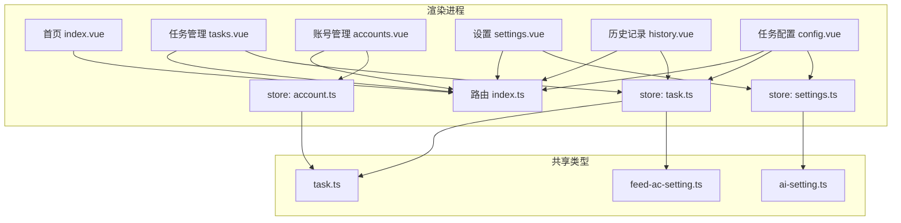
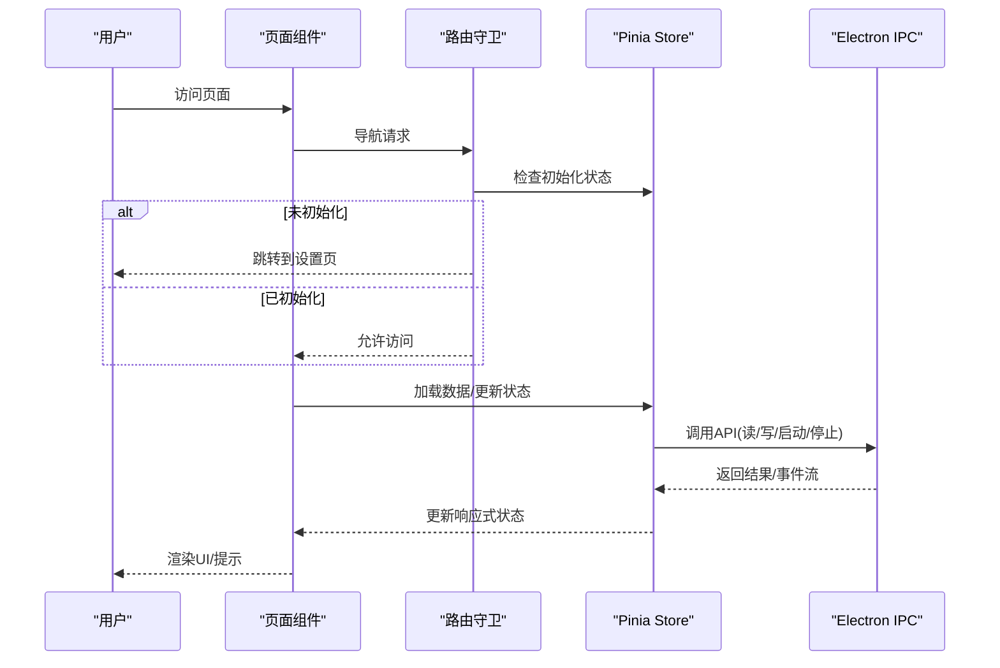
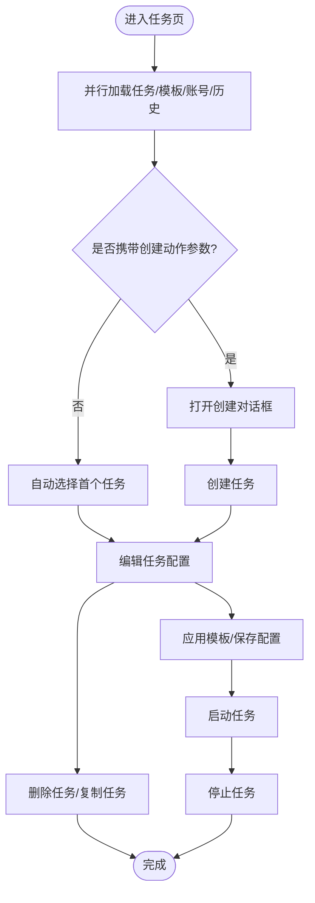
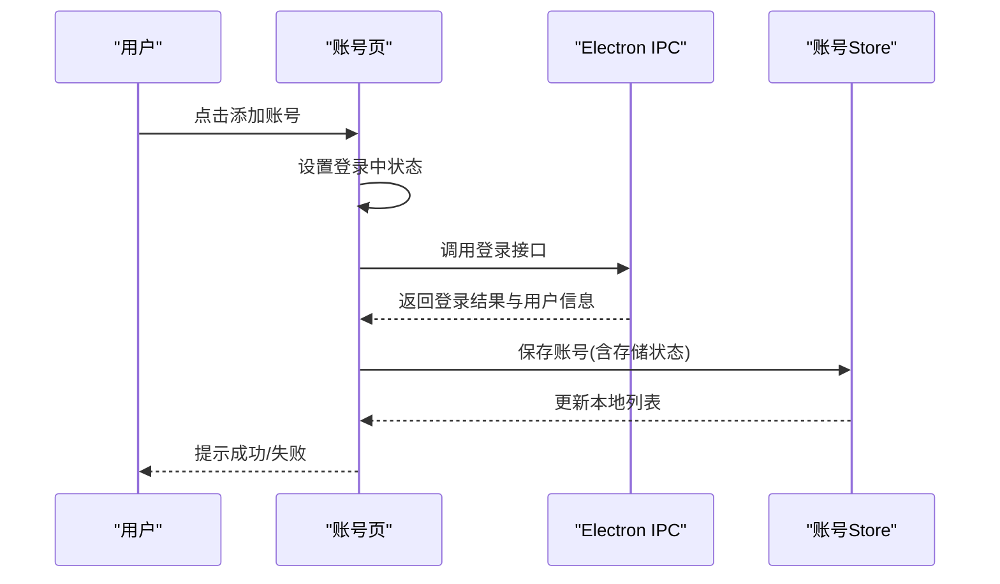
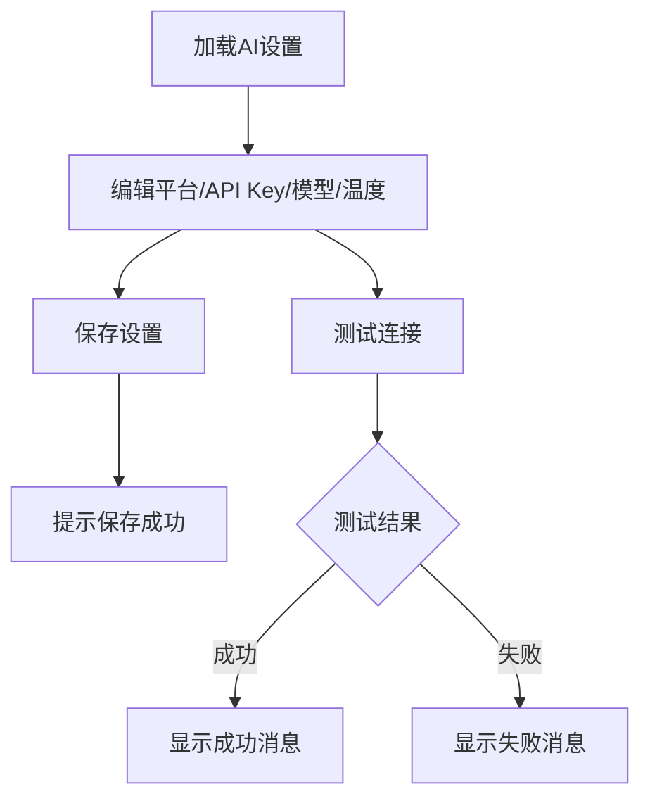
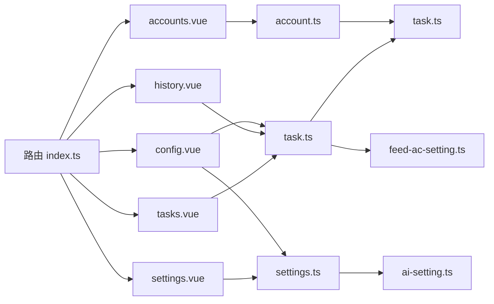

# 页面组件

<cite>
**本文引用的文件**
- [src/renderer/src/pages/tasks.vue](file://src/renderer/src/pages/tasks.vue)
- [src/renderer/src/pages/accounts.vue](file://src/renderer/src/pages/accounts.vue)
- [src/renderer/src/pages/settings.vue](file://src/renderer/src/pages/settings.vue)
- [src/renderer/src/pages/history.vue](file://src/renderer/src/pages/history.vue)
- [src/renderer/src/pages/config.vue](file://src/renderer/src/pages/config.vue)
- [src/renderer/src/router/index.ts](file://src/renderer/src/router/index.ts)
- [src/renderer/src/stores/task.ts](file://src/renderer/src/stores/task.ts)
- [src/renderer/src/stores/account.ts](file://src/renderer/src/stores/account.ts)
- [src/renderer/src/stores/settings.ts](file://src/renderer/src/stores/settings.ts)
- [src/shared/feed-ac-setting.ts](file://src/shared/feed-ac-setting.ts)
- [src/shared/ai-setting.ts](file://src/shared/ai-setting.ts)
- [src/shared/task.ts](file://src/shared/task.ts)
- [src/renderer/src/pages/index.vue](file://src/renderer/src/pages/index.vue)
- [src/renderer/src/App.vue](file://src/renderer/src/App.vue)
- [package.json](file://package.json)
</cite>

## 目录
1. [简介](#简介)
2. [项目结构](#项目结构)
3. [核心组件](#核心组件)
4. [架构总览](#架构总览)
5. [详细组件分析](#详细组件分析)
6. [依赖分析](#依赖分析)
7. [性能考量](#性能考量)
8. [故障排查指南](#故障排查指南)
9. [结论](#结论)
10. [附录](#附录)

## 简介
本文件面向AutoOps页面组件的开发者与使用者，系统化梳理任务管理、账号管理、设置、历史记录等核心页面的职责边界、数据流设计、用户交互逻辑与状态管理。文档同时覆盖页面间导航关系、数据传递方式、权限控制策略、UI组件组合、表单校验与异步处理、测试方法、性能优化与可访问性建议。

## 项目结构
- 页面层：位于渲染进程的页面组件目录，负责视图渲染、用户交互与调用Pinia Store与Electron IPC接口。
- 状态管理层：基于Pinia的store模块，封装任务、账号、设置等业务状态与持久化读写。
- 共享类型层：位于shared目录，统一定义任务、规则、AI设置等数据结构与默认值。
- 路由层：集中定义页面路由与前置守卫，确保初始化流程与页面访问控制。
- 应用入口：App.vue挂载布局与全局通知组件，保证一致的交互体验。

**图表来源**
- [src/renderer/src/pages/index.vue:1-248](file://src/renderer/src/pages/index.vue#L1-L248)
- [src/renderer/src/pages/tasks.vue:1-867](file://src/renderer/src/pages/tasks.vue#L1-L867)
- [src/renderer/src/pages/accounts.vue:1-203](file://src/renderer/src/pages/accounts.vue#L1-L203)
- [src/renderer/src/pages/settings.vue:1-165](file://src/renderer/src/pages/settings.vue#L1-L165)
- [src/renderer/src/pages/history.vue:1-102](file://src/renderer/src/pages/history.vue#L1-L102)
- [src/renderer/src/pages/config.vue:1-323](file://src/renderer/src/pages/config.vue#L1-L323)
- [src/renderer/src/router/index.ts:1-60](file://src/renderer/src/router/index.ts#L1-L60)
- [src/renderer/src/stores/task.ts:1-192](file://src/renderer/src/stores/task.ts#L1-L192)
- [src/renderer/src/stores/account.ts:1-82](file://src/renderer/src/stores/account.ts#L1-L82)
- [src/renderer/src/stores/settings.ts:1-46](file://src/renderer/src/stores/settings.ts#L1-L46)
- [src/shared/task.ts:1-54](file://src/shared/task.ts#L1-L54)
- [src/shared/feed-ac-setting.ts:1-149](file://src/shared/feed-ac-setting.ts#L1-L149)
- [src/shared/ai-setting.ts:1-29](file://src/shared/ai-setting.ts#L1-L29)

**章节来源**
- [src/renderer/src/router/index.ts:1-60](file://src/renderer/src/router/index.ts#L1-L60)
- [src/renderer/src/App.vue:1-11](file://src/renderer/src/App.vue#L1-L11)

## 核心组件
- 任务管理页(tasks.vue)
  - 职责：任务列表展示、创建/复制/删除任务；任务配置编辑（含规则组、屏蔽词、AI评论等）；任务启动/停止；查看执行历史与模板管理。
  - 数据流：读取任务与模板列表，监听任务运行状态与进度事件，持久化更新任务配置。
  - 交互：对话框、下拉菜单、标签页、表格、开关、输入框等UI组合。
- 账号管理页(accounts.vue)
  - 职责：账号列表展示、默认账号设置、删除账号；通过Electron IPC触发浏览器登录并保存账号。
  - 数据流：加载账号列表，调用IPC保存账号，刷新列表。
- 设置页(settings.vue)
  - 职责：AI平台与模型配置、API Key管理、温度参数调整；测试连接；跳转到浏览器设置。
  - 数据流：读取AI设置，保存设置，调用IPC测试。
- 历史记录页(history.vue)
  - 职责：展示所有任务历史记录，格式化时间与状态，支持清空历史。
  - 数据流：读取历史记录，调用IPC清空。
- 配置页(config.vue)
  - 职责：全局任务配置（旧版V2），用于快速启动任务；与任务页的V3配置形成互补。
  - 数据流：读取配置，保存配置，启动/停止任务。
- 首页(index.vue)
  - 职责：概览统计、快捷入口、最近执行记录。
  - 数据流：聚合任务与历史数据，导航到各页面。

**章节来源**
- [src/renderer/src/pages/tasks.vue:1-867](file://src/renderer/src/pages/tasks.vue#L1-L867)
- [src/renderer/src/pages/accounts.vue:1-203](file://src/renderer/src/pages/accounts.vue#L1-L203)
- [src/renderer/src/pages/settings.vue:1-165](file://src/renderer/src/pages/settings.vue#L1-L165)
- [src/renderer/src/pages/history.vue:1-102](file://src/renderer/src/pages/history.vue#L1-L102)
- [src/renderer/src/pages/config.vue:1-323](file://src/renderer/src/pages/config.vue#L1-L323)
- [src/renderer/src/pages/index.vue:1-248](file://src/renderer/src/pages/index.vue#L1-L248)

## 架构总览
- 页面组件通过Vue Router进行导航，路由守卫确保在完成初始化前禁止进入受保护页面。
- 页面组件通过Pinia Store与Electron IPC交互，Store负责状态管理与事件订阅。
- 共享类型定义了任务、规则、AI设置等核心数据结构，保证前后端一致性。

**图表来源**
- [src/renderer/src/router/index.ts:44-60](file://src/renderer/src/router/index.ts#L44-L60)
- [src/renderer/src/stores/task.ts:100-157](file://src/renderer/src/stores/task.ts#L100-L157)
- [src/renderer/src/stores/account.ts:26-63](file://src/renderer/src/stores/account.ts#L26-L63)
- [src/renderer/src/stores/settings.ts:12-44](file://src/renderer/src/stores/settings.ts#L12-L44)

## 详细组件分析

### 任务管理页（tasks.vue）
- 功能职责
  - 任务列表筛选与选中、创建/复制/删除任务、任务启动/停止。
  - 任务配置编辑：基础设置、视频类型过滤、规则组、屏蔽词、AI评论设置。
  - 历史记录查看与模板管理。
- Props与事件
  - 无显式props；通过路由查询参数触发“新建任务”弹窗。
  - 通过事件绑定处理按钮点击、下拉菜单项、输入框变更等。
- 状态管理
  - 使用任务Store与账号Store，维护任务列表、模板、当前任务ID、运行状态与日志。
  - 通过计算属性过滤任务与选择任务详情。
- 生命周期与异步
  - onMounted并行加载任务、模板与账号，并拉取历史记录。
  - watch监听选中任务与任务ID变化，驱动配置重置与迁移。
- 数据结构
  - 任务配置采用V3版本，包含规则组、屏蔽词、AI评论、视频类型跳过、切换等待、连续跳过上限等字段。
- 用户交互
  - 对话框创建任务、模板保存与应用、规则组增删、关键词增删、开关切换、Tab切换。
- 权限与安全
  - 通过路由守卫限制访问；任务启动前检查选中任务与账号。
- 错误处理
  - 统一使用消息提示反馈操作结果；异常捕获并提示。

**图表来源**
- [src/renderer/src/pages/tasks.vue:120-136](file://src/renderer/src/pages/tasks.vue#L120-L136)
- [src/renderer/src/pages/tasks.vue:158-224](file://src/renderer/src/pages/tasks.vue#L158-L224)
- [src/renderer/src/pages/tasks.vue:226-250](file://src/renderer/src/pages/tasks.vue#L226-L250)
- [src/renderer/src/stores/task.ts:23-59](file://src/renderer/src/stores/task.ts#L23-L59)

**章节来源**
- [src/renderer/src/pages/tasks.vue:1-867](file://src/renderer/src/pages/tasks.vue#L1-L867)
- [src/shared/feed-ac-setting.ts:37-118](file://src/shared/feed-ac-setting.ts#L37-L118)
- [src/shared/task.ts:5-23](file://src/shared/task.ts#L5-L23)

### 账号管理页（accounts.vue）
- 功能职责
  - 展示账号列表，支持设置默认账号、删除账号。
  - 通过浏览器登录抖音并保存账号信息。
- 交互与状态
  - 登录过程中禁用按钮并显示加载状态。
  - 成功后刷新账号列表并提示。
- 异步处理
  - 调用IPC登录接口，接收存储状态并保存至Store。
- 错误处理
  - 登录失败或保存失败均提示错误信息。

**图表来源**
- [src/renderer/src/pages/accounts.vue:62-95](file://src/renderer/src/pages/accounts.vue#L62-L95)
- [src/renderer/src/stores/account.ts:35-39](file://src/renderer/src/stores/account.ts#L35-L39)

**章节来源**
- [src/renderer/src/pages/accounts.vue:1-203](file://src/renderer/src/pages/accounts.vue#L1-L203)
- [src/renderer/src/stores/account.ts:1-82](file://src/renderer/src/stores/account.ts#L1-L82)

### 设置页（settings.vue）
- 功能职责
  - 配置AI平台、API Key、模型与温度；测试连接；跳转浏览器设置。
- 数据流
  - 初始化时读取AI设置；保存时写入；测试时调用IPC并展示结果。
- 表单与校验
  - 平台切换时动态更新可用模型；温度输入范围约束。
- 异步与错误
  - 测试过程禁用按钮，结果以颜色区分成功/失败。

**图表来源**
- [src/renderer/src/pages/settings.vue:32-64](file://src/renderer/src/pages/settings.vue#L32-L64)
- [src/shared/ai-setting.ts:24-29](file://src/shared/ai-setting.ts#L24-L29)

**章节来源**
- [src/renderer/src/pages/settings.vue:1-165](file://src/renderer/src/pages/settings.vue#L1-L165)
- [src/shared/ai-setting.ts:1-29](file://src/shared/ai-setting.ts#L1-L29)

### 历史记录页（history.vue）
- 功能职责
  - 展示所有任务历史记录，支持刷新与清空。
- 数据流
  - onMounted加载历史；清空调用IPC并清空本地缓存。
- 可访问性
  - 使用语义化卡片与标题，便于屏幕阅读器识别。

**章节来源**
- [src/renderer/src/pages/history.vue:1-102](file://src/renderer/src/pages/history.vue#L1-L102)

### 配置页（config.vue）
- 功能职责
  - 提供全局任务配置（V2）的快速编辑与启动能力，作为任务页V3配置的补充。
- 数据流
  - 初始化合并默认配置；保存并启动任务；实时日志展示。
- 与任务页的关系
  - 两者配置结构不同，前者用于快速启动，后者用于精细化任务管理。

**章节来源**
- [src/renderer/src/pages/config.vue:1-323](file://src/renderer/src/pages/config.vue#L1-L323)
- [src/shared/feed-ac-setting.ts:22-33](file://src/shared/feed-ac-setting.ts#L22-L33)

### 首页（index.vue）
- 功能职责
  - 统计总任务数、今日执行次数、今日评论数、正在运行任务数。
  - 快捷入口跳转到任务/账号/设置页；展示最近执行记录。
- 数据流
  - 并行加载任务、模板、账号与历史；格式化时间与状态；点击卡片导航。

**章节来源**
- [src/renderer/src/pages/index.vue:1-248](file://src/renderer/src/pages/index.vue#L1-L248)

## 依赖分析
- 页面与路由
  - 所有页面路由均声明于路由表，部分页面带有初始化前置守卫。
- 页面与Store
  - 任务页依赖任务Store；账号页依赖账号Store；设置页依赖设置Store；历史页依赖任务Store。
- Store与IPC
  - Store通过window.api调用Electron IPC，实现数据持久化与任务控制。
- 共享类型
  - 任务、规则、AI设置等类型在shared目录统一定义，避免重复与不一致。

**图表来源**
- [src/renderer/src/router/index.ts:5-35](file://src/renderer/src/router/index.ts#L5-L35)
- [src/renderer/src/stores/task.ts:1-192](file://src/renderer/src/stores/task.ts#L1-L192)
- [src/renderer/src/stores/account.ts:1-82](file://src/renderer/src/stores/account.ts#L1-L82)
- [src/renderer/src/stores/settings.ts:1-46](file://src/renderer/src/stores/settings.ts#L1-L46)
- [src/shared/task.ts:1-54](file://src/shared/task.ts#L1-L54)
- [src/shared/feed-ac-setting.ts:1-149](file://src/shared/feed-ac-setting.ts#L1-L149)
- [src/shared/ai-setting.ts:1-29](file://src/shared/ai-setting.ts#L1-L29)

**章节来源**
- [src/renderer/src/router/index.ts:1-60](file://src/renderer/src/router/index.ts#L1-L60)
- [src/renderer/src/stores/task.ts:1-192](file://src/renderer/src/stores/task.ts#L1-L192)
- [src/renderer/src/stores/account.ts:1-82](file://src/renderer/src/stores/account.ts#L1-L82)
- [src/renderer/src/stores/settings.ts:1-46](file://src/renderer/src/stores/settings.ts#L1-L46)

## 性能考量
- 渲染性能
  - 使用虚拟滚动与分页（若数据量增长）减少DOM节点数量。
  - 对长列表使用key稳定策略，避免不必要的重渲染。
- 状态与计算
  - 合理使用computed与watch，避免在模板中进行复杂计算。
  - 在任务页对大数组切片与节流日志展示。
- 异步与事件
  - 任务运行期间订阅事件流，及时清理监听器，防止内存泄漏。
- IPC调用
  - 批量加载使用Promise.all，减少往返延迟。
- UI反馈
  - 按钮禁用与加载指示提升用户体验，避免重复提交。

[本节为通用指导，无需列出具体文件来源]

## 故障排查指南
- 页面无法访问
  - 检查路由守卫是否正确拦截并跳转到设置页；确认初始化状态。
- 任务启动失败
  - 查看任务Store日志与错误提示；确认账号与任务配置有效。
- 账号登录异常
  - 检查浏览器登录流程与IPC返回结果；确认存储状态正确保存。
- 设置保存失败
  - 检查API Key与平台配置；查看IPC测试返回。
- 历史记录为空
  - 确认IPC历史接口返回；尝试刷新或清空后重建。

**章节来源**
- [src/renderer/src/router/index.ts:44-60](file://src/renderer/src/router/index.ts#L44-L60)
- [src/renderer/src/stores/task.ts:100-157](file://src/renderer/src/stores/task.ts#L100-L157)
- [src/renderer/src/pages/accounts.vue:62-95](file://src/renderer/src/pages/accounts.vue#L62-L95)
- [src/renderer/src/pages/settings.vue:50-64](file://src/renderer/src/pages/settings.vue#L50-L64)
- [src/renderer/src/pages/history.vue:15-41](file://src/renderer/src/pages/history.vue#L15-L41)

## 结论
AutoOps页面组件围绕任务、账号、设置与历史四大主题构建，采用清晰的路由与状态管理分层，结合共享类型保障数据一致性。通过合理的异步处理与UI反馈，提升了可用性与可维护性。后续可在大数据场景下引入虚拟滚动与事件节流，在权限体系上进一步细化角色与页面级鉴权。

[本节为总结性内容，无需列出具体文件来源]

## 附录

### 页面间导航与数据传递
- 首页提供快捷入口，跳转到任务/账号/设置页。
- 任务页支持通过路由查询参数触发创建对话框。
- 历史页与任务页共享历史数据来源。

**章节来源**
- [src/renderer/src/pages/index.vue:73-87](file://src/renderer/src/pages/index.vue#L73-L87)
- [src/renderer/src/pages/tasks.vue:128-131](file://src/renderer/src/pages/tasks.vue#L128-L131)
- [src/renderer/src/pages/history.vue:11-17](file://src/renderer/src/pages/history.vue#L11-L17)

### 权限控制
- 路由守卫对受保护页面进行初始化检查，未完成初始化则强制跳转设置页。
- 页面内对关键操作（如启动任务）进行前置校验（选中任务、账号有效性）。

**章节来源**
- [src/renderer/src/router/index.ts:44-60](file://src/renderer/src/router/index.ts#L44-L60)
- [src/renderer/src/pages/tasks.vue:226-245](file://src/renderer/src/pages/tasks.vue#L226-L245)

### UI组件与表单验证
- 使用统一UI库组件（按钮、输入、开关、下拉、对话框、标签页、表格、徽章等）。
- 表单验证策略：必填字段即时提示；数值范围约束；按键回车快速添加。

**章节来源**
- [src/renderer/src/pages/tasks.vue:158-183](file://src/renderer/src/pages/tasks.vue#L158-L183)
- [src/renderer/src/pages/settings.vue:121-133](file://src/renderer/src/pages/settings.vue#L121-L133)

### 异步操作处理
- 并行加载：onMounted中批量初始化数据。
- 事件订阅：任务运行期间订阅进度与动作事件，完成后清理。
- IPC调用：封装在Store中，统一错误处理与日志记录。

**章节来源**
- [src/renderer/src/pages/tasks.vue:120-126](file://src/renderer/src/pages/tasks.vue#L120-L126)
- [src/renderer/src/stores/task.ts:100-157](file://src/renderer/src/stores/task.ts#L100-L157)

### 测试方法
- 单元测试：针对Store的异步方法（启动/停止/保存）编写测试用例，模拟IPC返回。
- 集成测试：页面组件挂载后验证数据加载、事件绑定与UI渲染。
- 端到端测试：使用Playwright或内置测试框架验证登录流程与任务启动链路。

**章节来源**
- [package.json:19-20](file://package.json#L19-L20)

### 可访问性考虑
- 使用语义化HTML与标题层级。
- 为交互元素提供键盘可达性与焦点管理。
- 为图标与按钮提供文本替代或ARIA标签。
- 保持足够的对比度与字号，确保低视力用户可读。

[本节为通用指导，无需列出具体文件来源]