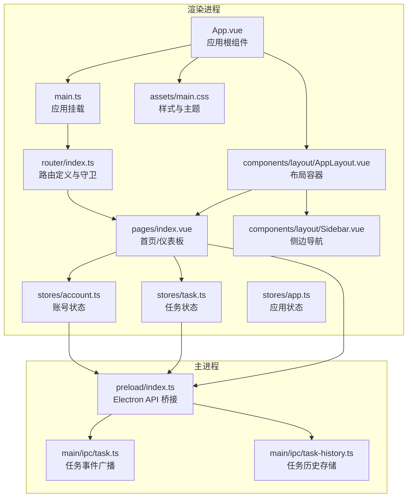
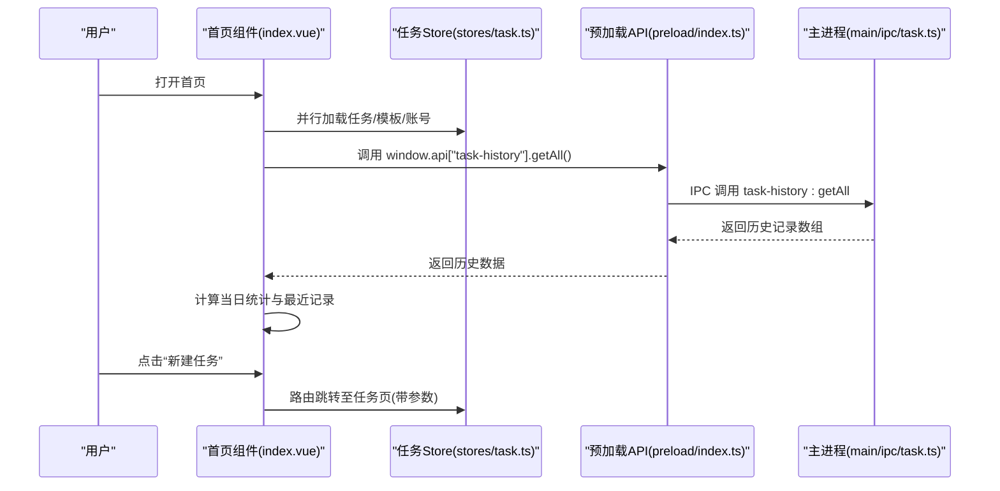
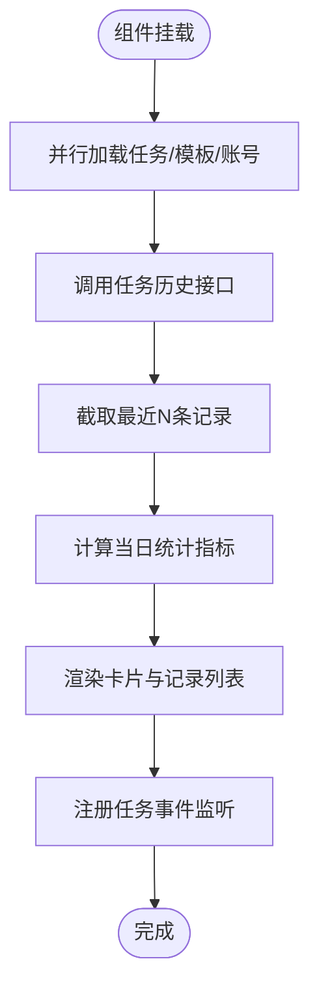
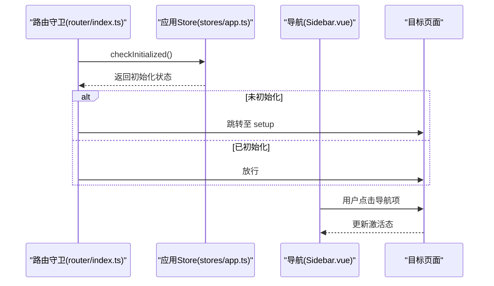
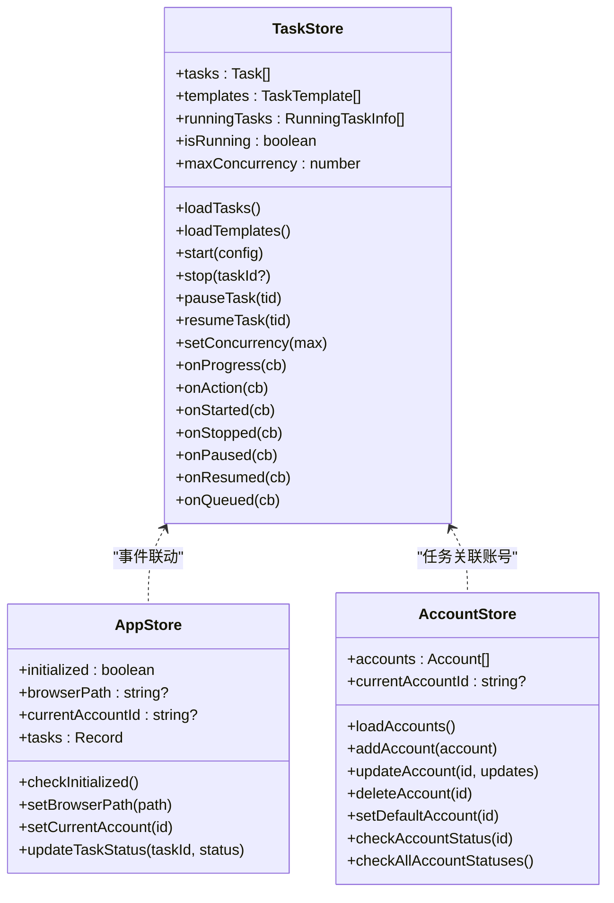
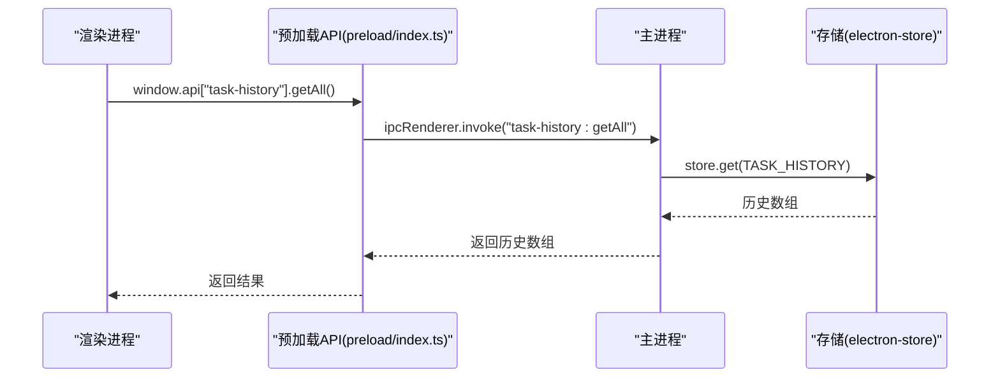
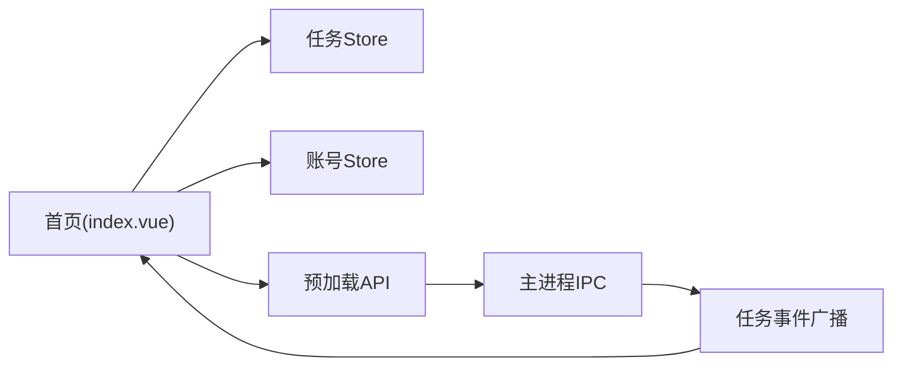

# 首页/仪表板页面

<cite>
**本文引用的文件**
- [index.vue](file://src/renderer/src/pages/index.vue)
- [App.vue](file://src/renderer/src/App.vue)
- [main.ts](file://src/renderer/src/main.ts)
- [router/index.ts](file://src/renderer/src/router/index.ts)
- [stores/task.ts](file://src/renderer/src/stores/task.ts)
- [stores/account.ts](file://src/renderer/src/stores/account.ts)
- [stores/app.ts](file://src/renderer/src/stores/app.ts)
- [shared/task-history.ts](file://src/shared/task-history.ts)
- [main/ipc/task-history.ts](file://src/main/ipc/task-history.ts)
- [main/ipc/task.ts](file://src/main/ipc/task.ts)
- [preload/index.ts](file://src/preload/index.ts)
- [components/layout/AppLayout.vue](file://src/renderer/src/components/layout/AppLayout.vue)
- [components/layout/Sidebar.vue](file://src/renderer/src/components/layout/Sidebar.vue)
- [assets/main.css](file://src/renderer/src/assets/main.css)
- [package.json](file://src/package.json)
</cite>

## 目录
1. [简介](#简介)
2. [项目结构](#项目结构)
3. [核心组件](#核心组件)
4. [架构总览](#架构总览)
5. [详细组件分析](#详细组件分析)
6. [依赖分析](#依赖分析)
7. [性能考量](#性能考量)
8. [故障排查指南](#故障排查指南)
9. [结论](#结论)
10. [附录](#附录)

## 简介
本文件面向AutoOps首页/仪表板页面，提供从设计到实现的完整开发与使用文档。内容涵盖整体布局与功能模块（任务概览、系统状态、快速操作入口、最近执行记录）、数据聚合与实时更新机制、与应用其他页面的导航关系、快捷操作与个性化配置建议、性能优化与缓存策略、响应式设计考虑，以及最佳实践与用户体验提升方案。

## 项目结构
首页位于渲染进程的路由系统中，作为根路径“/”的页面组件，配合全局布局与侧边栏导航，形成统一的桌面端应用体验。核心文件组织如下：
- 页面：首页组件负责统计与展示
- 路由：定义首页路由及初始化校验
- 状态：Pinia Store 提供任务、账号、应用状态
- IPC：预加载桥接与主进程通信，提供任务历史与任务控制接口
- 样式：TailwindCSS与主题变量支撑响应式与暗色模式

**图示来源**
- [App.vue:1-11](file://src/renderer/src/App.vue#L1-L11)
- [main.ts:1-12](file://src/renderer/src/main.ts#L1-L12)
- [router/index.ts:1-60](file://src/renderer/src/router/index.ts#L1-L60)
- [pages/index.vue:1-248](file://src/renderer/src/pages/index.vue#L1-L248)
- [components/layout/AppLayout.vue:1-24](file://src/renderer/src/components/layout/AppLayout.vue#L1-L24)
- [components/layout/Sidebar.vue:1-67](file://src/renderer/src/components/layout/Sidebar.vue#L1-L67)
- [stores/task.ts:1-316](file://src/renderer/src/stores/task.ts#L1-L316)
- [stores/account.ts:1-128](file://src/renderer/src/stores/account.ts#L1-L128)
- [stores/app.ts:1-71](file://src/renderer/src/stores/app.ts#L1-L71)
- [preload/index.ts:1-235](file://src/preload/index.ts#L1-L235)
- [main/ipc/task.ts:32-80](file://src/main/ipc/task.ts#L32-L80)
- [main/ipc/task-history.ts:1-45](file://src/main/ipc/task-history.ts#L1-L45)
- [assets/main.css:1-124](file://src/renderer/src/assets/main.css#L1-L124)

**章节来源**
- [router/index.ts:1-60](file://src/renderer/src/router/index.ts#L1-L60)
- [pages/index.vue:1-248](file://src/renderer/src/pages/index.vue#L1-L248)
- [stores/task.ts:1-316](file://src/renderer/src/stores/task.ts#L1-L316)
- [stores/account.ts:1-128](file://src/renderer/src/stores/account.ts#L1-L128)
- [stores/app.ts:1-71](file://src/renderer/src/stores/app.ts#L1-L71)
- [preload/index.ts:1-235](file://src/preload/index.ts#L1-L235)
- [main/ipc/task.ts:32-80](file://src/main/ipc/task.ts#L32-L80)
- [main/ipc/task-history.ts:1-45](file://src/main/ipc/task-history.ts#L1-L45)
- [components/layout/AppLayout.vue:1-24](file://src/renderer/src/components/layout/AppLayout.vue#L1-L24)
- [components/layout/Sidebar.vue:1-67](file://src/renderer/src/components/layout/Sidebar.vue#L1-L67)
- [assets/main.css:1-124](file://src/renderer/src/assets/main.css#L1-L124)

## 核心组件
- 首页组件（index.vue）：负责统计指标、快速入口、最近执行记录展示；在挂载时并行加载任务、模板与账号数据，并拉取任务历史用于当日统计与列表展示。
- 路由系统（router/index.ts）：首页路由带“requiresInit”元信息，进入前检查应用初始化状态，未完成则跳转至引导页。
- 状态管理（stores/task.ts、stores/account.ts、stores/app.ts）：集中管理任务生命周期、运行状态、并发度、账号列表与默认账号、应用初始化状态等。
- IPC桥接（preload/index.ts）：暴露window.api供渲染进程调用，封装任务控制、任务历史、账号管理、模板管理等能力。
- 主进程IPC（main/ipc/task.ts、main/ipc/task-history.ts）：处理任务事件广播与任务历史持久化。
- 布局与导航（components/layout/AppLayout.vue、components/layout/Sidebar.vue）：提供统一侧边栏导航与内容区容器。
- 样式与主题（assets/main.css）：基于TailwindCSS与oklch颜色空间的主题变量，支持明/暗模式切换。

**章节来源**
- [pages/index.vue:1-248](file://src/renderer/src/pages/index.vue#L1-L248)
- [router/index.ts:1-60](file://src/renderer/src/router/index.ts#L1-L60)
- [stores/task.ts:1-316](file://src/renderer/src/stores/task.ts#L1-L316)
- [stores/account.ts:1-128](file://src/renderer/src/stores/account.ts#L1-L128)
- [stores/app.ts:1-71](file://src/renderer/src/stores/app.ts#L1-L71)
- [preload/index.ts:1-235](file://src/preload/index.ts#L1-L235)
- [main/ipc/task.ts:32-80](file://src/main/ipc/task.ts#L32-L80)
- [main/ipc/task-history.ts:1-45](file://src/main/ipc/task-history.ts#L1-L45)
- [components/layout/AppLayout.vue:1-24](file://src/renderer/src/components/layout/AppLayout.vue#L1-L24)
- [components/layout/Sidebar.vue:1-67](file://src/renderer/src/components/layout/Sidebar.vue#L1-L67)
- [assets/main.css:1-124](file://src/renderer/src/assets/main.css#L1-L124)

## 架构总览
首页采用“渲染进程组件 + Pinia状态 + Electron IPC”的三层架构：
- 视图层：首页组件通过组合式API与计算属性驱动UI，点击事件触发路由跳转或任务创建。
- 状态层：Pinia Store集中管理任务、账号、应用状态，提供方法与getter以供组件消费。
- 通信层：preload桥接window.api，渲染进程通过invoke/on调用主进程能力；主进程通过webContents向所有窗口广播任务事件。

**图示来源**
- [pages/index.vue:42-50](file://src/renderer/src/pages/index.vue#L42-L50)
- [stores/task.ts:42-48](file://src/renderer/src/stores/task.ts#L42-L48)
- [preload/index.ts:202-209](file://src/preload/index.ts#L202-L209)
- [main/ipc/task-history.ts:6-9](file://src/main/ipc/task-history.ts#L6-L9)
- [main/ipc/task.ts:32-80](file://src/main/ipc/task.ts#L32-L80)

## 详细组件分析

### 首页组件（index.vue）
- 数据聚合逻辑
  - 总任务数：来自任务Store的任务列表长度。
  - 今日执行：基于任务历史记录中的开始时间过滤当日数据，统计条目数量。
  - 今日评论：对当日历史记录按评论计数求和。
  - 正在运行：筛选当日历史中状态为“运行中”的条目数量。
- 实时状态更新
  - 通过window.api的事件监听（进度、动作、启动、停止、暂停/恢复、入队等）在任务Store中注册回调，动态更新运行任务列表与日志，首页可结合这些状态进行联动展示。
- 快速操作入口
  - 任务管理、账号管理、设置三个卡片入口，点击后路由跳转。
  - “新建任务”按钮，跳转至任务页并携带创建参数。
- 最近执行记录
  - 展示最近N条任务历史，包含状态点、评论数、视频数、相对时间等；为空时提示暂无记录。

**图示来源**
- [pages/index.vue:42-50](file://src/renderer/src/pages/index.vue#L42-L50)
- [pages/index.vue:26-40](file://src/renderer/src/pages/index.vue#L26-L40)
- [pages/index.vue:212-237](file://src/renderer/src/pages/index.vue#L212-L237)

**章节来源**
- [pages/index.vue:1-248](file://src/renderer/src/pages/index.vue#L1-L248)

### 路由与导航（router/index.ts、components/layout/Sidebar.vue）
- 路由守卫：首页与任务、账号、设置页均标记requiresInit，首次进入时检查应用初始化状态，未完成则重定向至setup页。
- 侧边栏导航：提供首页、任务、账号、设置四个入口，支持图标+文本，点击后路由跳转。

**图示来源**
- [router/index.ts:44-60](file://src/renderer/src/router/index.ts#L44-L60)
- [stores/app.ts:32-37](file://src/renderer/src/stores/app.ts#L32-L37)
- [components/layout/Sidebar.vue:25-39](file://src/renderer/src/components/layout/Sidebar.vue#L25-L39)

**章节来源**
- [router/index.ts:1-60](file://src/renderer/src/router/index.ts#L1-L60)
- [components/layout/Sidebar.vue:1-67](file://src/renderer/src/components/layout/Sidebar.vue#L1-L67)

### 状态管理（stores/task.ts、stores/account.ts、stores/app.ts）
- 任务Store
  - 提供任务CRUD、模板管理、并发度设置、运行任务列表、日志收集、事件监听注册与清理等。
  - 启动任务时注册多种事件回调，便于首页联动显示任务进度与动作。
- 账号Store
  - 维护账号列表、默认账号、按平台分组、状态检查等；首页用于展示账号数量。
- 应用Store
  - 维护初始化状态、浏览器路径、当前账号、任务状态映射等；首页用于判断是否需要初始化。

**图示来源**
- [stores/task.ts:24-316](file://src/renderer/src/stores/task.ts#L24-L316)
- [stores/account.ts:19-128](file://src/renderer/src/stores/account.ts#L19-L128)
- [stores/app.ts:18-71](file://src/renderer/src/stores/app.ts#L18-L71)

**章节来源**
- [stores/task.ts:1-316](file://src/renderer/src/stores/task.ts#L1-L316)
- [stores/account.ts:1-128](file://src/renderer/src/stores/account.ts#L1-L128)
- [stores/app.ts:1-71](file://src/renderer/src/stores/app.ts#L1-L71)

### IPC与数据持久化（preload/index.ts、main/ipc/task-history.ts、main/ipc/task.ts）
- 预加载API
  - 暴露window.api，包含任务控制、任务历史、账号管理、模板管理等通道。
  - 通过ipcRenderer.invoke与webContents.on建立请求-响应与事件订阅。
- 任务历史
  - 主进程读写electron-store中的任务历史键值，提供getAll/getById/add/update/delete/clear。
- 任务事件广播
  - 主进程将任务生命周期事件广播给所有窗口，确保首页与任务详情等页面同步状态。

**图示来源**
- [preload/index.ts:202-209](file://src/preload/index.ts#L202-L209)
- [main/ipc/task-history.ts:6-9](file://src/main/ipc/task-history.ts#L6-L9)

**章节来源**
- [preload/index.ts:1-235](file://src/preload/index.ts#L1-L235)
- [main/ipc/task-history.ts:1-45](file://src/main/ipc/task-history.ts#L1-L45)
- [main/ipc/task.ts:32-80](file://src/main/ipc/task.ts#L32-L80)

### 样式与主题（assets/main.css）
- 使用TailwindCSS与oklch颜色空间，定义明/暗两套主题变量，支持自动切换。
- 通过@theme inline注入变量，全局生效于组件与布局。

**章节来源**
- [assets/main.css:1-124](file://src/renderer/src/assets/main.css#L1-L124)

## 依赖分析
- 外部依赖
  - Vue 3、Vue Router、Pinia：前端框架与状态管理。
  - TailwindCSS、tw-animate-css：样式与动画基础。
  - Electron、@electron-toolkit：桌面应用与预加载桥接。
  - lucide-vue-next：图标库。
- 内部模块耦合
  - 首页高度依赖任务Store与账号Store；通过preload桥接与主进程交互；受路由守卫影响的初始化流程。
  - 任务事件通过主进程广播，渲染进程统一订阅，降低组件间直接耦合。

**图示来源**
- [pages/index.vue:1-248](file://src/renderer/src/pages/index.vue#L1-L248)
- [stores/task.ts:1-316](file://src/renderer/src/stores/task.ts#L1-L316)
- [stores/account.ts:1-128](file://src/renderer/src/stores/account.ts#L1-L128)
- [preload/index.ts:1-235](file://src/preload/index.ts#L1-L235)
- [main/ipc/task.ts:32-80](file://src/main/ipc/task.ts#L32-L80)

**章节来源**
- [package.json:16-34](file://src/package.json#L16-L34)
- [pages/index.vue:1-248](file://src/renderer/src/pages/index.vue#L1-L248)
- [stores/task.ts:1-316](file://src/renderer/src/stores/task.ts#L1-L316)
- [stores/account.ts:1-128](file://src/renderer/src/stores/account.ts#L1-L128)
- [preload/index.ts:1-235](file://src/preload/index.ts#L1-L235)
- [main/ipc/task.ts:32-80](file://src/main/ipc/task.ts#L32-L80)

## 性能考量
- 首页数据加载
  - 使用Promise.all并行加载任务、模板与账号，减少首屏等待时间。
  - 任务历史仅取最近N条，避免大列表渲染与计算开销。
- 状态更新
  - 任务事件通过主进程广播，渲染进程统一订阅，避免重复轮询。
  - 日志列表限制最大长度，防止内存膨胀。
- 样式与主题
  - TailwindCSS按需生成类名，oklch变量减少主题切换成本。
- 缓存策略
  - 任务历史存储在electron-store中，开机即用；任务Store维护运行任务列表，减少重复查询。
- 响应式设计
  - 使用网格布局与响应式断点，适配不同屏幕尺寸；暗色模式自动切换，降低视觉疲劳。

**章节来源**
- [pages/index.vue:42-50](file://src/renderer/src/pages/index.vue#L42-L50)
- [stores/task.ts:265-274](file://src/renderer/src/stores/task.ts#L265-L274)
- [main/ipc/task-history.ts:6-9](file://src/main/ipc/task-history.ts#L6-L9)
- [assets/main.css:1-124](file://src/renderer/src/assets/main.css#L1-L124)

## 故障排查指南
- 首次进入被重定向至setup页
  - 检查应用Store的初始化状态与浏览器路径设置；确认路由守卫逻辑。
  - 参考：[router/index.ts:44-60](file://src/renderer/src/router/index.ts#L44-L60)、[stores/app.ts:32-37](file://src/renderer/src/stores/app.ts#L32-L37)
- 任务历史为空
  - 确认主进程任务历史存储键值是否存在；检查IPC通道是否正确调用。
  - 参考：[main/ipc/task-history.ts:6-9](file://src/main/ipc/task-history.ts#L6-L9)、[preload/index.ts:202-209](file://src/preload/index.ts#L202-L209)
- 任务事件未更新
  - 检查主进程事件广播是否发送；确认渲染进程事件监听是否注册。
  - 参考：[main/ipc/task.ts:32-80](file://src/main/ipc/task.ts#L32-L80)、[stores/task.ts:163-200](file://src/renderer/src/stores/task.ts#L163-L200)
- 样式异常或主题不生效
  - 检查Tailwind配置与oklch变量注入；确认暗色模式切换逻辑。
  - 参考：[assets/main.css:1-124](file://src/renderer/src/assets/main.css#L1-L124)

**章节来源**
- [router/index.ts:44-60](file://src/renderer/src/router/index.ts#L44-L60)
- [stores/app.ts:32-37](file://src/renderer/src/stores/app.ts#L32-L37)
- [main/ipc/task-history.ts:6-9](file://src/main/ipc/task-history.ts#L6-L9)
- [preload/index.ts:202-209](file://src/preload/index.ts#L202-L209)
- [main/ipc/task.ts:32-80](file://src/main/ipc/task.ts#L32-L80)
- [stores/task.ts:163-200](file://src/renderer/src/stores/task.ts#L163-L200)
- [assets/main.css:1-124](file://src/renderer/src/assets/main.css#L1-L124)

## 结论
首页/仪表板页面通过清晰的模块划分与稳定的IPC通信，实现了高效的数据聚合与实时状态展示。结合Pinia状态管理与路由守卫，确保了良好的用户体验与可维护性。建议后续在首页增加图表可视化与个性化配置面板，进一步提升运营效率与可扩展性。

## 附录
- 最佳实践
  - 使用并行加载优化首屏性能；限制列表长度与计算复杂度。
  - 通过主进程统一事件广播，避免组件间紧耦合。
  - 利用TailwindCSS与oklch主题变量，统一风格与暗色模式支持。
- 用户体验提升
  - 在首页增加任务趋势图表与账号健康度指示器。
  - 提供个性化布局与快捷操作面板，支持用户自定义常用入口。
  - 增强错误提示与引导文案，降低上手成本。