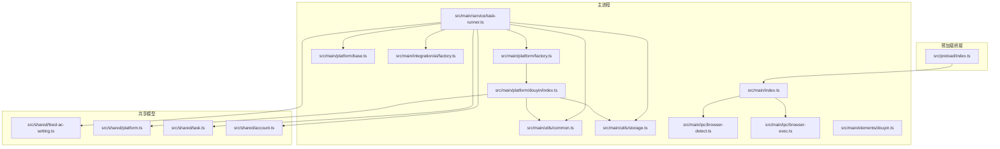
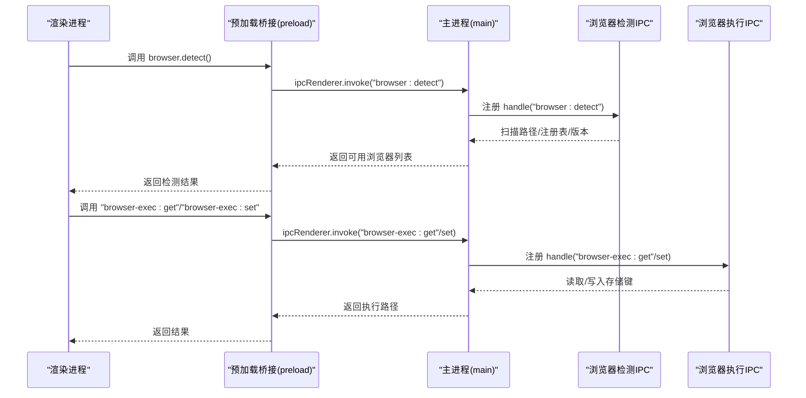
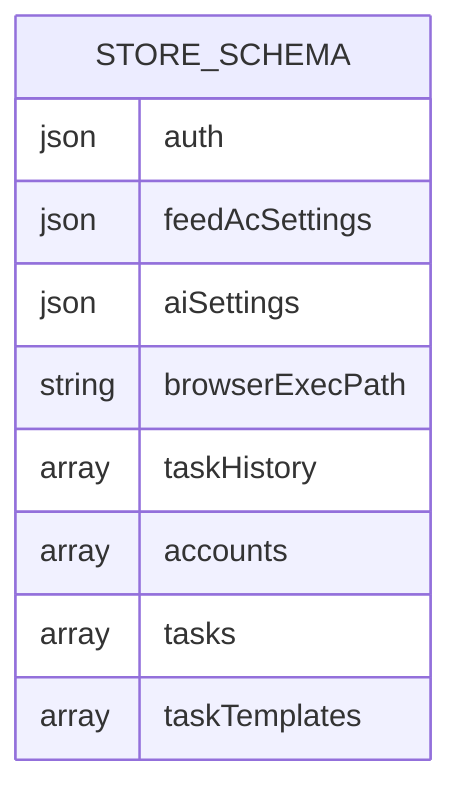
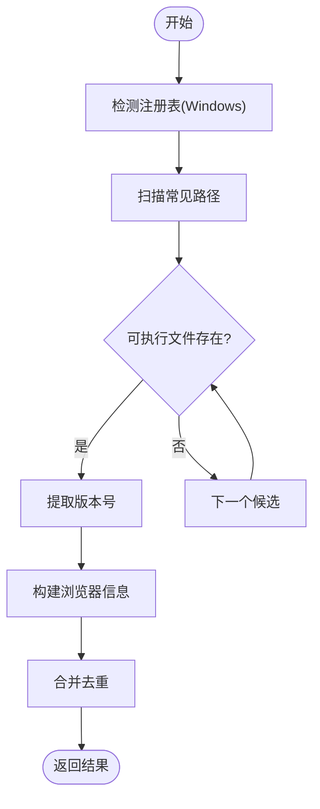
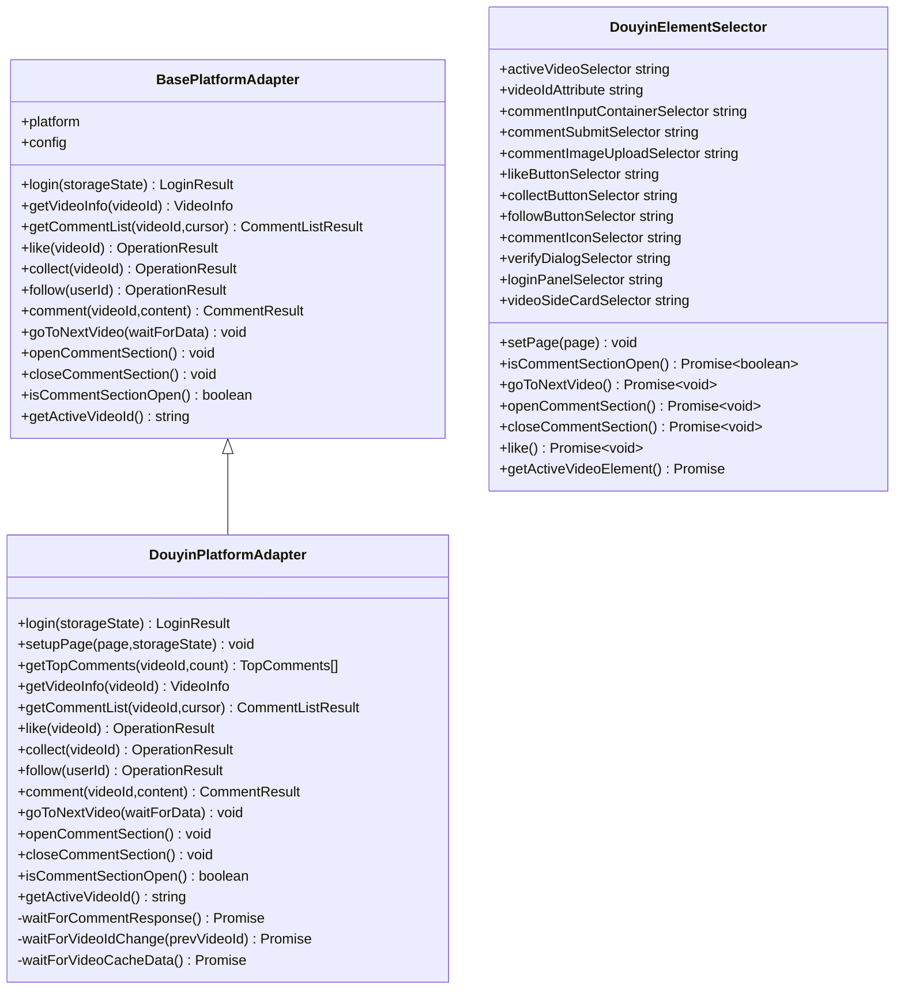
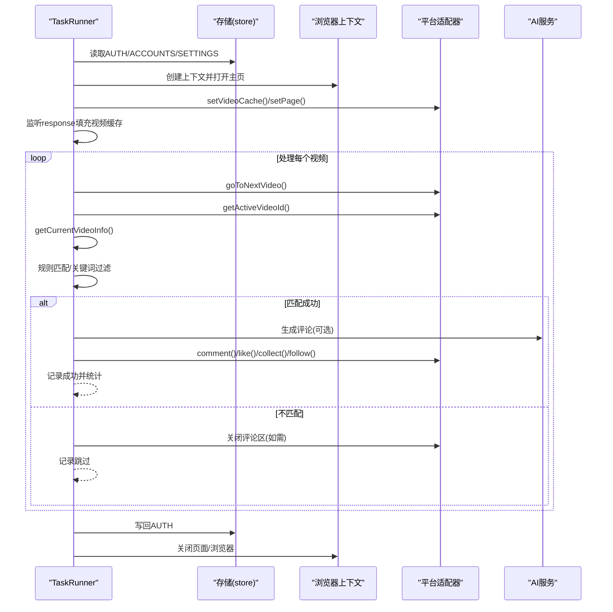
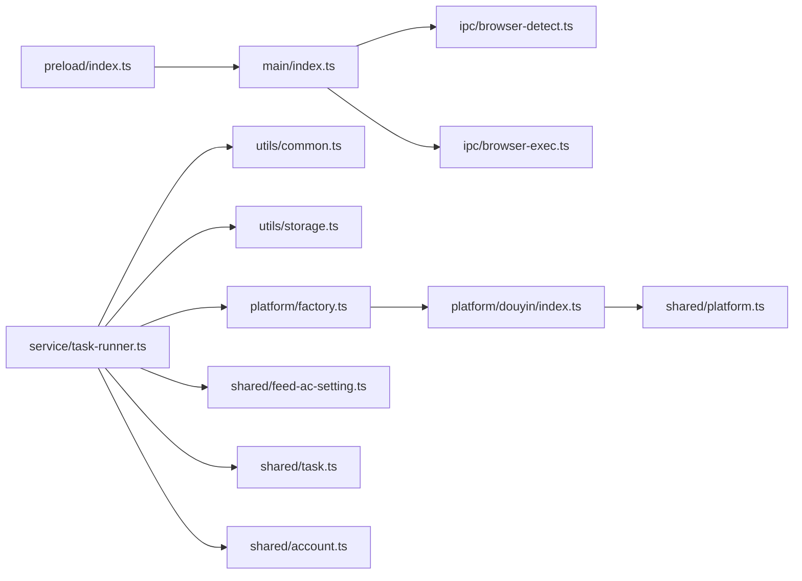

# 工具和实用程序

<cite>
**本文引用的文件**
- [common.ts](file://src/main/utils/common.ts)
- [storage.ts](file://src/main/utils/storage.ts)
- [browser-detect.ts](file://src/main/ipc/browser-detect.ts)
- [browser-exec.ts](file://src/main/ipc/browser-exec.ts)
- [douyin.ts](file://src/main/elements/douyin.ts)
- [main.ts](file://src/main/index.ts)
- [preload.ts](file://src/preload/index.ts)
- [task-runner.ts](file://src/main/service/task-runner.ts)
- [base.ts](file://src/main/platform/base.ts)
- [factory.ts](file://src/main/platform/factory.ts)
- [douyin-platform-index.ts](file://src/main/platform/douyin/index.ts)
- [feed-ac-setting.ts](file://src/shared/feed-ac-setting.ts)
- [platform.ts](file://src/shared/platform.ts)
- [task.ts](file://src/shared/task.ts)
- [account.ts](file://src/shared/account.ts)
- [factory-ai.ts](file://src/main/integration/ai/factory.ts)
- [package.json](file://package.json)
</cite>

## 目录
1. [简介](#简介)
2. [项目结构](#项目结构)
3. [核心组件](#核心组件)
4. [架构总览](#架构总览)
5. [详细组件分析](#详细组件分析)
6. [依赖分析](#依赖分析)
7. [性能考虑](#性能考虑)
8. [故障排查指南](#故障排查指南)
9. [结论](#结论)
10. [附录](#附录)

## 简介
本文件聚焦AutoOps工具与实用程序模块，系统性阐述以下内容：
- 通用工具函数的设计思路与数学计算方法
- 字符串与标识符生成策略
- 本地存储机制与键空间管理
- 浏览器检测与执行路径设置的IPC实现
- 页面元素定位策略与自动化操作封装
- 工具函数的使用示例、性能优化与最佳实践
- 工具模块在系统中的作用与依赖关系
- 扩展新工具函数的指导原则与代码规范

## 项目结构
AutoOps采用Electron主进程+渲染进程架构，工具与实用程序主要分布在主进程的utils、ipc、platform与service目录，并通过preload桥接暴露给渲染端。

**图表来源**
- [main.ts:54-84](file://src/main/index.ts#L54-L84)
- [common.ts:1-11](file://src/main/utils/common.ts#L1-L11)
- [storage.ts:1-46](file://src/main/utils/storage.ts#L1-L46)
- [browser-detect.ts:105-117](file://src/main/ipc/browser-detect.ts#L105-L117)
- [browser-exec.ts:4-12](file://src/main/ipc/browser-exec.ts#L4-L12)
- [douyin.ts:3-106](file://src/main/elements/douyin.ts#L3-L106)
- [task-runner.ts:1-608](file://src/main/service/task-runner.ts#L1-L608)
- [factory.ts:7-18](file://src/main/platform/factory.ts#L7-L18)
- [base.ts:24-80](file://src/main/platform/base.ts#L24-L80)
- [douyin-platform-index.ts:56-105](file://src/main/platform/douyin/index.ts#L56-L105)
- [factory-ai.ts:16-25](file://src/main/integration/ai/factory.ts#L16-L25)
- [feed-ac-setting.ts:37-70](file://src/shared/feed-ac-setting.ts#L37-L70)
- [platform.ts:88-200](file://src/shared/platform.ts#L88-L200)
- [task.ts:34-53](file://src/shared/task.ts#L34-L53)
- [account.ts:28-38](file://src/shared/account.ts#L28-L38)
- [preload.ts:95-187](file://src/preload/index.ts#L95-L187)

**章节来源**
- [main.ts:54-84](file://src/main/index.ts#L54-L84)
- [preload.ts:95-187](file://src/preload/index.ts#L95-L187)

## 核心组件
- 通用工具函数：随机数、延时、ID生成
- 本地存储：electron-store封装的键空间与默认值
- 浏览器检测与执行路径：跨平台路径扫描、注册表读取、版本提取
- 平台适配器与元素选择器：统一抽象与抖音特定实现
- 任务运行器：基于Playwright的自动化流程编排

**章节来源**
- [common.ts:1-11](file://src/main/utils/common.ts#L1-L11)
- [storage.ts:1-46](file://src/main/utils/storage.ts#L1-L46)
- [browser-detect.ts:105-117](file://src/main/ipc/browser-detect.ts#L105-L117)
- [browser-exec.ts:4-12](file://src/main/ipc/browser-exec.ts#L4-L12)
- [douyin.ts:3-106](file://src/main/elements/douyin.ts#L3-L106)
- [task-runner.ts:23-85](file://src/main/service/task-runner.ts#L23-L85)

## 架构总览
工具与实用程序贯穿主进程与平台适配层，通过IPC向渲染端暴露能力，同时被任务运行器消费以驱动自动化行为。

**图表来源**
- [preload.ts:134-136](file://src/preload/index.ts#L134-L136)
- [browser-detect.ts:105-117](file://src/main/ipc/browser-detect.ts#L105-L117)
- [browser-exec.ts:4-12](file://src/main/ipc/browser-exec.ts#L4-L12)
- [main.ts:67-68](file://src/main/index.ts#L67-L68)

## 详细组件分析

### 通用工具函数
- 随机整数：闭区间[min,max]取整，用于概率与等待时间抖动
- 延时函数：基于Promise的sleep，避免阻塞事件循环
- ID生成：结合时间戳与随机字符串，保证短时唯一性

设计要点
- 随机分布：Math.floor(Math.random()*(max-min+1))+min确保边界闭合
- 异步非阻塞：sleep使用setTimeout包装Promise，便于await链式调用
- 标识符可读性：ID由时间戳与随机片段拼接，利于日志追踪

使用场景
- 任务运行器中用于等待、概率决策与抖动控制
- 平台适配器中用于输入模拟与节流

复杂度
- 随机与延时均为O(1)
- ID生成O(1)，字符串拼接受随机片段长度影响

**章节来源**
- [common.ts:1-11](file://src/main/utils/common.ts#L1-L11)
- [task-runner.ts:204-207](file://src/main/service/task-runner.ts#L204-L207)
- [douyin-platform-index.ts:316-322](file://src/main/platform/douyin/index.ts#L316-L322)

### 本地存储机制
- 键空间：定义明确的StorageKey枚举，涵盖认证、账号、任务历史、模板等
- 默认值：集中于defaults，确保首次使用零配置体验
- 类型安全：StoreSchema约束键类型，get/set返回泛型T，减少类型错误

数据模型

**图表来源**
- [storage.ts:3-25](file://src/main/utils/storage.ts#L3-L25)

使用示例
- 设置浏览器执行路径：调用browser-exec:set写入键值
- 读取任务历史：调用store.get(StorageKey.TASK_HISTORY)

最佳实践
- 仅存JSON可序列化对象，避免循环引用
- 对大数组定期清理，防止内存膨胀
- 写入前进行必要校验，避免无效数据污染

**章节来源**
- [storage.ts:29-46](file://src/main/utils/storage.ts#L29-L46)
- [browser-exec.ts:4-12](file://src/main/ipc/browser-exec.ts#L4-L12)

### 浏览器检测与执行工具
- 跨平台路径集合：Windows、macOS、Linux常见安装位置
- 注册表读取：Windows下通过reg查询App Paths，提升发现率
- 版本提取：Windows通过命令行参数--version解析版本号
- 去重合并：合并注册表与路径扫描结果，按名称去重

**图表来源**
- [browser-detect.ts:47-103](file://src/main/ipc/browser-detect.ts#L47-L103)

实现细节
- 超时保护：execSync设置timeout，避免阻塞
- 容错处理：异常捕获与空结果返回，保证健壮性
- IPC注册：通过ipcMain.handle暴露"browser:detect"

**章节来源**
- [browser-detect.ts:105-117](file://src/main/ipc/browser-detect.ts#L105-L117)
- [main.ts:67-68](file://src/main/index.ts#L67-L68)

### 页面元素定位与自动化操作封装
- 抽象适配器：BasePlatformAdapter定义统一接口，隔离平台差异
- 抖音适配器：DouyinPlatformAdapter实现键盘快捷键、选择器、API监听与验证码处理
- 元素选择器类：DouyinElementSelector集中管理选择器常量与交互动作

**图表来源**
- [base.ts:24-80](file://src/main/platform/base.ts#L24-L80)
- [douyin-platform-index.ts:56-105](file://src/main/platform/douyin/index.ts#L56-L105)
- [douyin.ts:3-106](file://src/main/elements/douyin.ts#L3-L106)

使用示例
- 通过适配器打开评论区、输入评论文本、等待发布响应
- 通过元素选择器判断侧栏卡片宽度判断评论区开关状态
- 通过键盘快捷键驱动下一条视频切换

**章节来源**
- [base.ts:24-80](file://src/main/platform/base.ts#L24-L80)
- [douyin-platform-index.ts:301-375](file://src/main/platform/douyin/index.ts#L301-L375)
- [douyin.ts:58-105](file://src/main/elements/douyin.ts#L58-L105)

### 任务运行器与工具协作
- 启动流程：读取浏览器执行路径、登录态、平台配置，建立上下文
- 数据监听：监听feed API响应，填充视频缓存
- 规则匹配：基于规则组与关键词过滤，决定是否执行操作
- 操作执行：根据任务类型与概率，调用适配器执行点赞/收藏/关注/评论
- 统计与收尾：记录成功次数、统计日志、持久化登录态

**图表来源**
- [task-runner.ts:35-85](file://src/main/service/task-runner.ts#L35-L85)
- [task-runner.ts:132-245](file://src/main/service/task-runner.ts#L132-L245)
- [task-runner.ts:408-437](file://src/main/service/task-runner.ts#L408-L437)
- [task-runner.ts:461-527](file://src/main/service/task-runner.ts#L461-L527)

**章节来源**
- [task-runner.ts:35-85](file://src/main/service/task-runner.ts#L35-L85)
- [task-runner.ts:132-245](file://src/main/service/task-runner.ts#L132-L245)
- [task-runner.ts:408-527](file://src/main/service/task-runner.ts#L408-L527)

## 依赖分析
- 主进程入口注册所有IPC处理器，形成稳定的桥接层
- 任务运行器依赖工具函数、存储、平台工厂与AI工厂
- 平台适配器依赖共享平台配置与工具函数
- 预加载桥接将IPC接口暴露为类型安全的api对象

**图表来源**
- [main.ts:63-75](file://src/main/index.ts#L63-L75)
- [task-runner.ts:9-12](file://src/main/service/task-runner.ts#L9-L12)
- [factory.ts:7-18](file://src/main/platform/factory.ts#L7-L18)
- [douyin-platform-index.ts:1-15](file://src/main/platform/douyin/index.ts#L1-L15)
- [feed-ac-setting.ts:37-70](file://src/shared/feed-ac-setting.ts#L37-L70)
- [platform.ts:88-200](file://src/shared/platform.ts#L88-L200)
- [task.ts:34-53](file://src/shared/task.ts#L34-L53)
- [account.ts:28-38](file://src/shared/account.ts#L28-L38)
- [preload.ts:95-187](file://src/preload/index.ts#L95-L187)

**章节来源**
- [main.ts:63-75](file://src/main/index.ts#L63-L75)
- [task-runner.ts:9-12](file://src/main/service/task-runner.ts#L9-L12)
- [factory.ts:7-18](file://src/main/platform/factory.ts#L7-L18)

## 性能考虑
- 异步非阻塞：延时统一使用sleep，避免同步阻塞
- 缓存与去重：视频数据通过Map缓存，减少重复请求
- 超时与降级：网络监听与UI交互均设置超时，超时后降级继续，保障稳定性
- 随机抖动：等待与概率决策引入随机，降低被风控概率
- 存储粒度：键空间划分清晰，避免单键过大导致I/O瓶颈

[本节为通用性能讨论，无需列出具体文件来源]

## 故障排查指南
- 浏览器检测无结果
  - 检查平台路径是否存在与权限
  - Windows确认注册表访问权限
  - 查看日志输出，定位execSync超时或异常
- 评论发布失败
  - 检查验证码弹窗是否阻塞，适配器已等待并处理
  - 确认评论输入框选择器与键盘快捷键正确
  - 监听评论发布API响应，查看状态码
- 登录态丢失
  - 任务结束时会写回AUTH，确认存储键存在
  - 检查账户storageState格式与解析逻辑
- 视频切换卡顿
  - 等待视频ID变化与feed数据到达，必要时增加等待时间
  - 检查平台配置的API端点与选择器

**章节来源**
- [browser-detect.ts:35-44](file://src/main/ipc/browser-detect.ts#L35-L44)
- [douyin-platform-index.ts:335-342](file://src/main/platform/douyin/index.ts#L335-L342)
- [douyin-platform-index.ts:350-375](file://src/main/platform/douyin/index.ts#L350-L375)
- [task-runner.ts:119-130](file://src/main/service/task-runner.ts#L119-L130)

## 结论
工具与实用程序模块通过简洁的通用函数、可靠的本地存储与健壮的浏览器检测，为上层平台适配与任务运行提供了坚实基础。模块间职责清晰、耦合度低，既保证了可维护性，也为后续扩展预留了充足空间。

[本节为总结性内容，无需列出具体文件来源]

## 附录

### 使用示例与最佳实践
- 使用随机与延时
  - 在需要模拟人类行为时，对等待时间与概率进行抖动
  - 示例路径：[task-runner.ts:204-207](file://src/main/service/task-runner.ts#L204-L207)
- 使用ID生成
  - 为任务、模板与账号生成稳定且唯一的标识符
  - 示例路径：[task.ts:34-36](file://src/shared/task.ts#L34-L36)、[account.ts:28-30](file://src/shared/account.ts#L28-L30)
- 使用存储
  - 将浏览器执行路径、认证信息与任务历史持久化
  - 示例路径：[browser-exec.ts:4-12](file://src/main/ipc/browser-exec.ts#L4-L12)、[storage.ts:40-46](file://src/main/utils/storage.ts#L40-L46)
- 使用元素选择器
  - 通过统一的选择器常量与封装方法，减少选择器散落
  - 示例路径：[douyin.ts:10-56](file://src/main/elements/douyin.ts#L10-L56)

### 扩展新工具函数的指导原则
- 单一职责：每个工具函数只做一件事，保持简单可测试
- 类型安全：使用TypeScript泛型与严格类型约束
- 错误处理：对外抛出明确错误，内部捕获并记录日志
- 文档注释：为公共API提供简要说明与使用建议
- 性能优先：避免不必要的同步阻塞与重复计算
- 可观测性：在关键路径输出日志，便于调试与监控

### 代码规范
- 文件命名：小写加下划线或驼峰，与现有utils/ipc保持一致
- 导出策略：优先导出函数而非类，减少耦合
- IPC命名：遵循"模块:动作"的命名约定，与preload桥接一致
- 存储键：新增键时同步更新StorageKey与defaults

**章节来源**
- [common.ts:1-11](file://src/main/utils/common.ts#L1-L11)
- [storage.ts:29-46](file://src/main/utils/storage.ts#L29-L46)
- [browser-exec.ts:4-12](file://src/main/ipc/browser-exec.ts#L4-L12)
- [douyin.ts:3-106](file://src/main/elements/douyin.ts#L3-L106)
- [task.ts:34-53](file://src/shared/task.ts#L34-L53)
- [account.ts:28-38](file://src/shared/account.ts#L28-L38)
- [preload.ts:95-187](file://src/preload/index.ts#L95-L187)