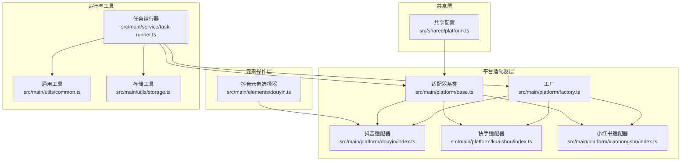
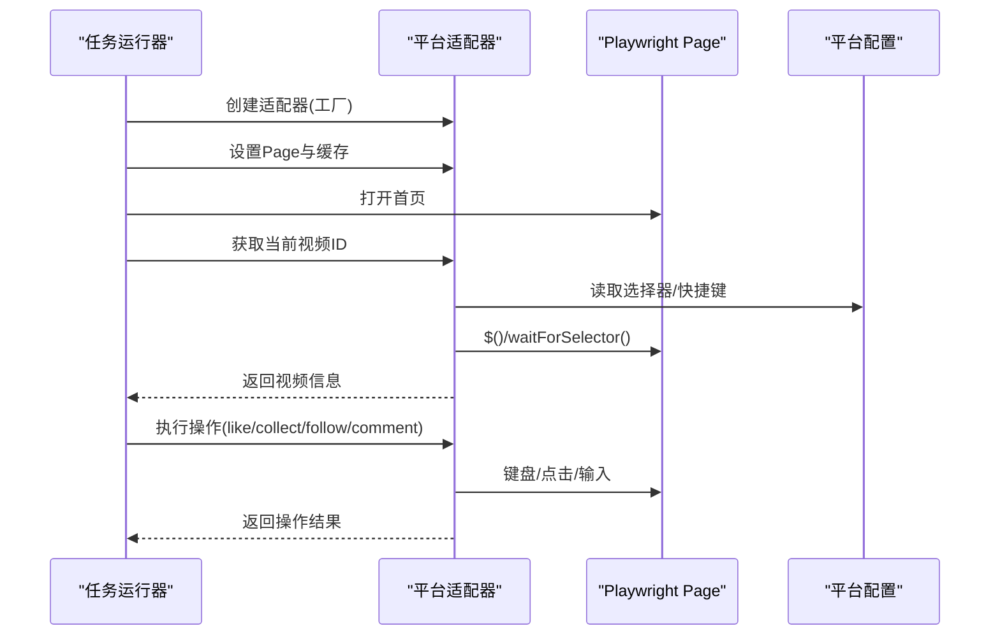
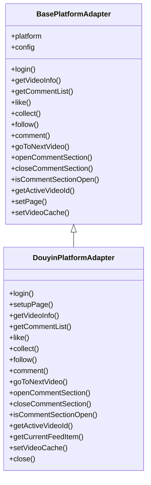
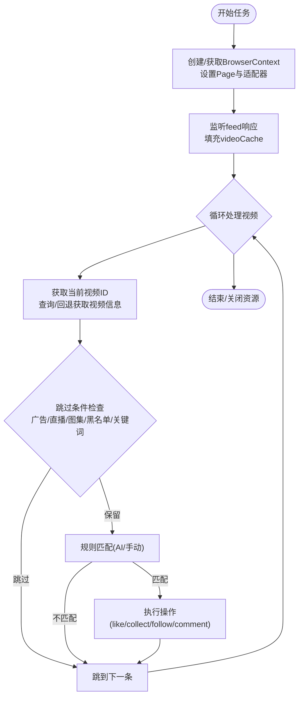
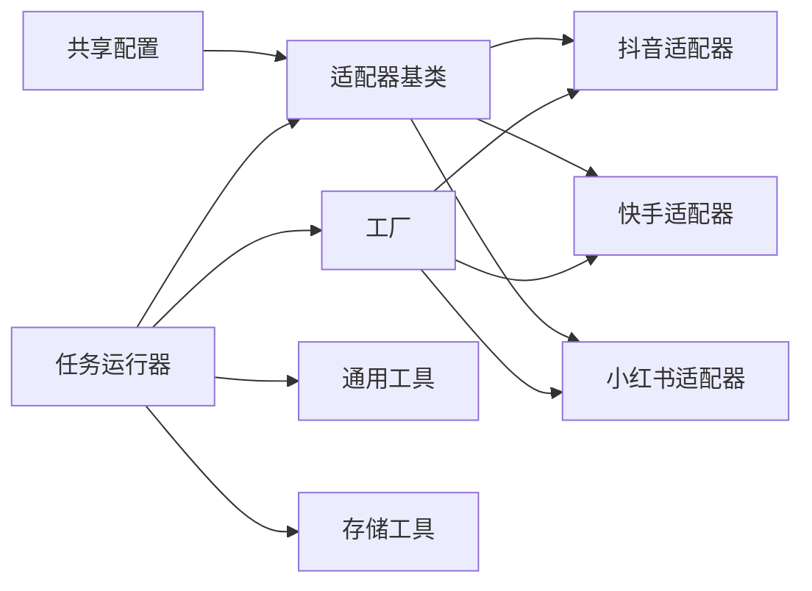

# 平台元素操作

<cite>
**本文引用的文件列表**
- [src/main/elements/douyin.ts](file://src/main/elements/douyin.ts)
- [src/main/platform/base.ts](file://src/main/platform/base.ts)
- [src/main/platform/factory.ts](file://src/main/platform/factory.ts)
- [src/main/platform/douyin/index.ts](file://src/main/platform/douyin/index.ts)
- [src/main/platform/kuaishou/index.ts](file://src/main/platform/kuaishou/index.ts)
- [src/main/platform/xiaohongshu/index.ts](file://src/main/platform/xiaohongshu/index.ts)
- [src/shared/platform.ts](file://src/shared/platform.ts)
- [src/main/service/task-runner.ts](file://src/main/service/task-runner.ts)
- [src/main/utils/common.ts](file://src/main/utils/common.ts)
- [src/main/utils/storage.ts](file://src/main/utils/storage.ts)
</cite>

## 目录
1. [简介](#简介)
2. [项目结构](#项目结构)
3. [核心组件](#核心组件)
4. [架构总览](#架构总览)
5. [详细组件分析](#详细组件分析)
6. [依赖关系分析](#依赖关系分析)
7. [性能考量](#性能考量)
8. [故障排查指南](#故障排查指南)
9. [结论](#结论)
10. [附录](#附录)

## 简介
本文件系统化阐述“平台元素操作”模块的设计与实现，聚焦于：
- 平台特定元素定位策略与选择器策略
- DOM 元素识别与交互封装
- 元素操作 API 的设计原则、流程与兼容性
- 不同平台差异处理与动态元素处理
- 性能优化、稳定性保障与错误恢复机制
- 使用示例、调试方法与最佳实践
- 与平台适配器的集成关系与扩展方式

## 项目结构
该模块围绕“共享配置 + 平台适配器 + 任务运行器”的分层架构组织，元素操作主要由平台适配器统一对外暴露，内部通过 Playwright 的 Page/ElementHandle 进行 DOM 交互，并以键盘快捷键驱动页面行为。

图表来源
- [src/shared/platform.ts:88-200](file://src/shared/platform.ts#L88-L200)
- [src/main/platform/base.ts:24-80](file://src/main/platform/base.ts#L24-L80)
- [src/main/platform/factory.ts:7-26](file://src/main/platform/factory.ts#L7-L26)
- [src/main/platform/douyin/index.ts:60-71](file://src/main/platform/douyin/index.ts#L60-L71)
- [src/main/platform/kuaishou/index.ts:22-33](file://src/main/platform/kuaishou/index.ts#L22-L33)
- [src/main/platform/xiaohongshu/index.ts:23-34](file://src/main/platform/xiaohongshu/index.ts#L23-L34)
- [src/main/elements/douyin.ts:3-106](file://src/main/elements/douyin.ts#L3-L106)
- [src/main/service/task-runner.ts:25-156](file://src/main/service/task-runner.ts#L25-L156)
- [src/main/utils/common.ts:1-11](file://src/main/utils/common.ts#L1-L11)
- [src/main/utils/storage.ts:14-46](file://src/main/utils/storage.ts#L14-L46)

章节来源
- [src/shared/platform.ts:18-200](file://src/shared/platform.ts#L18-L200)
- [src/main/platform/base.ts:24-80](file://src/main/platform/base.ts#L24-L80)
- [src/main/platform/factory.ts:7-26](file://src/main/platform/factory.ts#L7-L26)
- [src/main/platform/douyin/index.ts:60-71](file://src/main/platform/douyin/index.ts#L60-L71)
- [src/main/platform/kuaishou/index.ts:22-33](file://src/main/platform/kuaishou/index.ts#L22-L33)
- [src/main/platform/xiaohongshu/index.ts:23-34](file://src/main/platform/xiaohongshu/index.ts#L23-L34)
- [src/main/elements/douyin.ts:3-106](file://src/main/elements/douyin.ts#L3-L106)
- [src/main/service/task-runner.ts:25-156](file://src/main/service/task-runner.ts#L25-L156)
- [src/main/utils/common.ts:1-11](file://src/main/utils/common.ts#L1-L11)
- [src/main/utils/storage.ts:14-46](file://src/main/utils/storage.ts#L14-L46)

## 核心组件
- 共享配置与平台常量：统一管理平台信息、选择器、API 端点与键盘快捷键，确保跨平台一致性与可扩展性。
- 适配器基类：定义统一的平台操作接口（登录、获取视频/评论、点赞/收藏/关注、评论、导航等），并提供日志、缓存与 Page 生命周期管理。
- 平台适配器实现：分别针对抖音、快手、小红书实现具体逻辑，覆盖 DOM 选择、事件监听、键盘交互、验证码处理等。
- 任务运行器：编排任务流程，负责页面初始化、视频数据监听、规则匹配、AI 评论生成、操作执行与状态上报。
- 工具与存储：提供随机延时、睡眠、ID 生成等通用工具，以及 Electron Store 的持久化存储。

章节来源
- [src/shared/platform.ts:18-200](file://src/shared/platform.ts#L18-L200)
- [src/main/platform/base.ts:24-80](file://src/main/platform/base.ts#L24-L80)
- [src/main/platform/douyin/index.ts:60-494](file://src/main/platform/douyin/index.ts#L60-L494)
- [src/main/platform/kuaishou/index.ts:22-253](file://src/main/platform/kuaishou/index.ts#L22-L253)
- [src/main/platform/xiaohongshu/index.ts:23-264](file://src/main/platform/xiaohongshu/index.ts#L23-L264)
- [src/main/service/task-runner.ts:25-760](file://src/main/service/task-runner.ts#L25-L760)
- [src/main/utils/common.ts:1-11](file://src/main/utils/common.ts#L1-L11)
- [src/main/utils/storage.ts:14-46](file://src/main/utils/storage.ts#L14-L46)

## 架构总览
平台元素操作采用“配置驱动 + 适配器模式”，通过工厂创建对应平台适配器，统一对外暴露一致的操作 API；任务运行器通过适配器完成页面导航、元素识别与交互。

图表来源
- [src/main/service/task-runner.ts:90-135](file://src/main/service/task-runner.ts#L90-L135)
- [src/main/platform/factory.ts:7-18](file://src/main/platform/factory.ts#L7-L18)
- [src/main/platform/base.ts:55-66](file://src/main/platform/base.ts#L55-L66)
- [src/shared/platform.ts:76-86](file://src/shared/platform.ts#L76-L86)

## 详细组件分析

### 平台配置与选择器策略
- 平台信息与登录入口：统一维护各平台的首页与登录页地址，便于任务运行器直接跳转。
- 选择器集合：包含活动视频、视频 ID 属性、点赞/收藏/关注按钮、评论输入/提交、评论面板、验证弹窗、登录面板、侧边卡片等。
- API 端点：定义各平台的 feed、评论列表、评论发布等端点，用于监听与校验。
- 键盘快捷键：统一定义下一条、点赞、收藏、评论、关注等快捷键，减少平台差异带来的改动成本。

章节来源
- [src/shared/platform.ts:18-200](file://src/shared/platform.ts#L18-L200)

### 适配器基类与生命周期
- 统一接口：login、getVideoInfo、getCommentList、like、collect、follow、comment、goToNextVideo、openCommentSection、closeCommentSection、isCommentSectionOpen、getActiveVideoId 等。
- 日志系统：通过事件发射器输出带平台标识的日志，便于追踪。
- 缓存与 Page 管理：提供 videoCache 与 setPage/clearPage，支持跨适配器共享数据。
- DOM 辅助：提供 getActiveVideoElement 等基础方法，供子类复用。

章节来源
- [src/main/platform/base.ts:24-80](file://src/main/platform/base.ts#L24-L80)

### 抖音平台适配器（DouyinPlatformAdapter）
- 登录与用户信息：基于登录面板可见性判断登录状态，提取昵称与头像，保存 storageState。
- 视频数据监听：监听 feed 接口响应，填充 videoCache，支持广告/直播/图集过滤。
- 评论列表与发布：监听评论列表与发布接口，结合验证码弹窗处理。
- 导航与交互：通过键盘快捷键切换视频，打开/关闭评论面板，识别活动视频 ID。
- 数据模型映射：将平台原始数据映射为统一 VideoInfo/CommentInfo 结构。

图表来源
- [src/main/platform/base.ts:24-80](file://src/main/platform/base.ts#L24-L80)
- [src/main/platform/douyin/index.ts:60-494](file://src/main/platform/douyin/index.ts#L60-L494)

章节来源
- [src/main/platform/douyin/index.ts:60-494](file://src/main/platform/douyin/index.ts#L60-L494)

### 快手平台适配器（KuaishouPlatformAdapter）
- 登录状态判断：通过是否存在“登录”按钮判定登录状态。
- 评论流程：打开评论面板后，等待输入框出现再进行输入与提交。
- 导航与交互：与抖音类似，但选择器与快捷键略有差异。

章节来源
- [src/main/platform/kuaishou/index.ts:22-253](file://src/main/platform/kuaishou/index.ts#L22-L253)

### 小红书平台适配器（XiaohongshuPlatformAdapter）
- 登录状态判断：通过是否存在“登录”按钮判定登录状态。
- 评论流程：打开评论面板后，等待输入框出现再进行输入与提交。
- 导航与交互：与快手类似，但选择器与快捷键略有差异。

章节来源
- [src/main/platform/xiaohongshu/index.ts:23-264](file://src/main/platform/xiaohongshu/index.ts#L23-L264)

### 抖音元素选择器（DouyinElementSelector）
- 作用：在抖音场景下对特定元素进行定位与交互（如评论面板开关、活动视频、点赞等）。
- 与适配器的关系：适配器内部也维护了选择器集合，元素选择器更偏向于早期实现或特定场景使用；推荐优先使用适配器提供的统一接口。

章节来源
- [src/main/elements/douyin.ts:3-106](file://src/main/elements/douyin.ts#L3-L106)

### 任务运行器（TaskRunner）
- 页面与上下文管理：支持独立浏览器与共享上下文两种模式，便于多任务并行。
- 视频数据监听：统一监听 feed 端点，填充 videoCache，供适配器查询。
- 规则匹配与分类：支持黑名单/白名单、关键词、AI 分析等规则体系。
- 操作执行：根据任务类型与概率执行点赞/收藏/关注/评论等操作。
- AI 评论：可选使用 AI 服务生成评论内容，支持热门评论参考。
- 稳定性保障：暂停/恢复/停止、连续跳过阈值、验证码弹窗等待、超时控制等。

图表来源
- [src/main/service/task-runner.ts:235-371](file://src/main/service/task-runner.ts#L235-L371)
- [src/main/service/task-runner.ts:160-180](file://src/main/service/task-runner.ts#L160-L180)

章节来源
- [src/main/service/task-runner.ts:25-760](file://src/main/service/task-runner.ts#L25-L760)

## 依赖关系分析
- 适配器依赖共享配置：所有平台适配器均从共享配置读取选择器、端点与快捷键，保证一致性。
- 工厂模式解耦：通过工厂创建适配器，避免上层直接依赖具体实现。
- 任务运行器依赖适配器：任务运行器仅通过适配器接口进行操作，降低平台差异影响。
- 工具与存储：通用工具提供随机延时与 ID 生成；存储工具负责认证状态与设置持久化。

图表来源
- [src/shared/platform.ts:76-200](file://src/shared/platform.ts#L76-L200)
- [src/main/platform/base.ts:24-80](file://src/main/platform/base.ts#L24-L80)
- [src/main/platform/factory.ts:7-26](file://src/main/platform/factory.ts#L7-L26)
- [src/main/service/task-runner.ts:25-156](file://src/main/service/task-runner.ts#L25-L156)
- [src/main/utils/common.ts:1-11](file://src/main/utils/common.ts#L1-L11)
- [src/main/utils/storage.ts:14-46](file://src/main/utils/storage.ts#L14-L46)

章节来源
- [src/shared/platform.ts:76-200](file://src/shared/platform.ts#L76-L200)
- [src/main/platform/base.ts:24-80](file://src/main/platform/base.ts#L24-L80)
- [src/main/platform/factory.ts:7-26](file://src/main/platform/factory.ts#L7-L26)
- [src/main/service/task-runner.ts:25-156](file://src/main/service/task-runner.ts#L25-L156)
- [src/main/utils/common.ts:1-11](file://src/main/utils/common.ts#L1-L11)
- [src/main/utils/storage.ts:14-46](file://src/main/utils/storage.ts#L14-L46)

## 性能考量
- 延时与随机化：通过随机延时与睡眠函数减少被风控概率，提升稳定性。
- 缓存与监听：统一监听 feed 响应填充缓存，减少重复请求与 DOM 查询。
- 超时与重试：对关键 DOM 查询与网络响应设置超时与重试，避免阻塞。
- 并行与共享上下文：支持共享 BrowserContext，降低内存占用与启动成本。
- 操作概率与节流：通过概率与最大次数限制，控制操作频率。

章节来源
- [src/main/utils/common.ts:1-11](file://src/main/utils/common.ts#L1-L11)
- [src/main/service/task-runner.ts:160-180](file://src/main/service/task-runner.ts#L160-L180)
- [src/main/platform/douyin/index.ts:140-157](file://src/main/platform/douyin/index.ts#L140-L157)
- [src/main/service/task-runner.ts:118-156](file://src/main/service/task-runner.ts#L118-L156)

## 故障排查指南
- 登录失败或取消：检查登录面板选择器与可见性判断逻辑，确认 storageState 是否正确保存与加载。
- 无法获取视频信息：确认 feed 监听是否生效，videoCache 是否填充，必要时回退到适配器的 getVideoInfo。
- 评论输入框不可见：确认已打开评论面板，等待输入框出现后再进行交互。
- 验证码弹窗：检测到验证码弹窗时会等待其消失，若长时间未消失需人工干预。
- 平台差异导致的选择器失效：检查共享配置中的选择器与快捷键是否与页面实际一致。
- 超时与阻塞：适当增加等待时间与重试次数，避免过于频繁的键盘操作。

章节来源
- [src/main/platform/douyin/index.ts:73-109](file://src/main/platform/douyin/index.ts#L73-L109)
- [src/main/platform/douyin/index.ts:335-342](file://src/main/platform/douyin/index.ts#L335-L342)
- [src/main/platform/douyin/index.ts:221-261](file://src/main/platform/douyin/index.ts#L221-L261)
- [src/main/service/task-runner.ts:266-274](file://src/main/service/task-runner.ts#L266-L274)

## 结论
该模块通过“配置驱动 + 适配器模式 + 工厂解耦”的架构，实现了对抖音、快手、小红书等平台的统一元素操作能力。共享配置确保跨平台一致性，适配器封装平台差异，任务运行器编排业务流程，工具与存储提供稳定支撑。建议在扩展新平台时遵循现有模式，优先完善共享配置与适配器实现，确保 API 一致性与可维护性。

## 附录

### 使用示例（流程示意）
- 初始化任务：创建任务运行器，选择平台与任务类型，传入设置与账户信息。
- 登录与页面准备：适配器登录并设置 Page，任务运行器监听 feed 数据。
- 视频识别与规则匹配：获取当前视频 ID，查询/回退获取视频信息，匹配规则。
- 执行操作：根据任务类型与概率执行点赞/收藏/关注/评论等操作。
- 结束与清理：保存认证状态，关闭页面与浏览器（或共享上下文）。

章节来源
- [src/main/service/task-runner.ts:55-156](file://src/main/service/task-runner.ts#L55-L156)
- [src/main/platform/factory.ts:7-18](file://src/main/platform/factory.ts#L7-L18)

### 最佳实践
- 优先使用适配器提供的统一 API，避免直接依赖平台选择器。
- 在新增平台时，先完善共享配置，再实现适配器，最后在任务运行器中接入。
- 对关键交互增加超时与重试，合理设置延时与随机化参数。
- 使用验证码弹窗检测与等待机制，避免误判与阻塞。
- 通过规则体系与 AI 分析控制操作范围，减少无效操作。

### 扩展方式
- 新增平台：在共享配置中添加平台信息与选择器，实现新的适配器类，注册到工厂。
- 功能增强：在适配器中增加新的 DOM 识别与交互方法，或引入新的键盘快捷键。
- 配置优化：根据平台特性调整选择器、端点与快捷键，提升稳定性与兼容性。

章节来源
- [src/shared/platform.ts:88-200](file://src/shared/platform.ts#L88-L200)
- [src/main/platform/factory.ts:7-26](file://src/main/platform/factory.ts#L7-L26)
- [src/main/platform/base.ts:24-80](file://src/main/platform/base.ts#L24-L80)