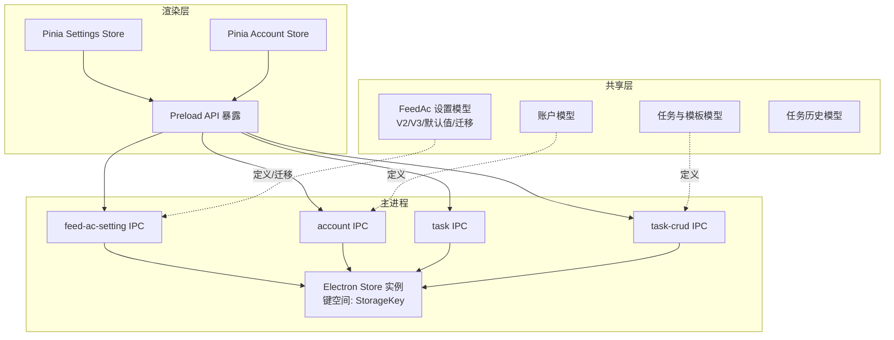
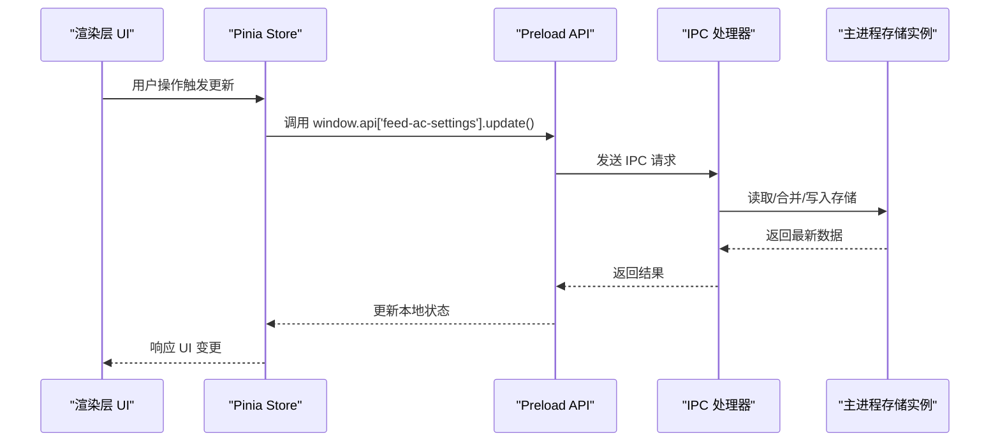
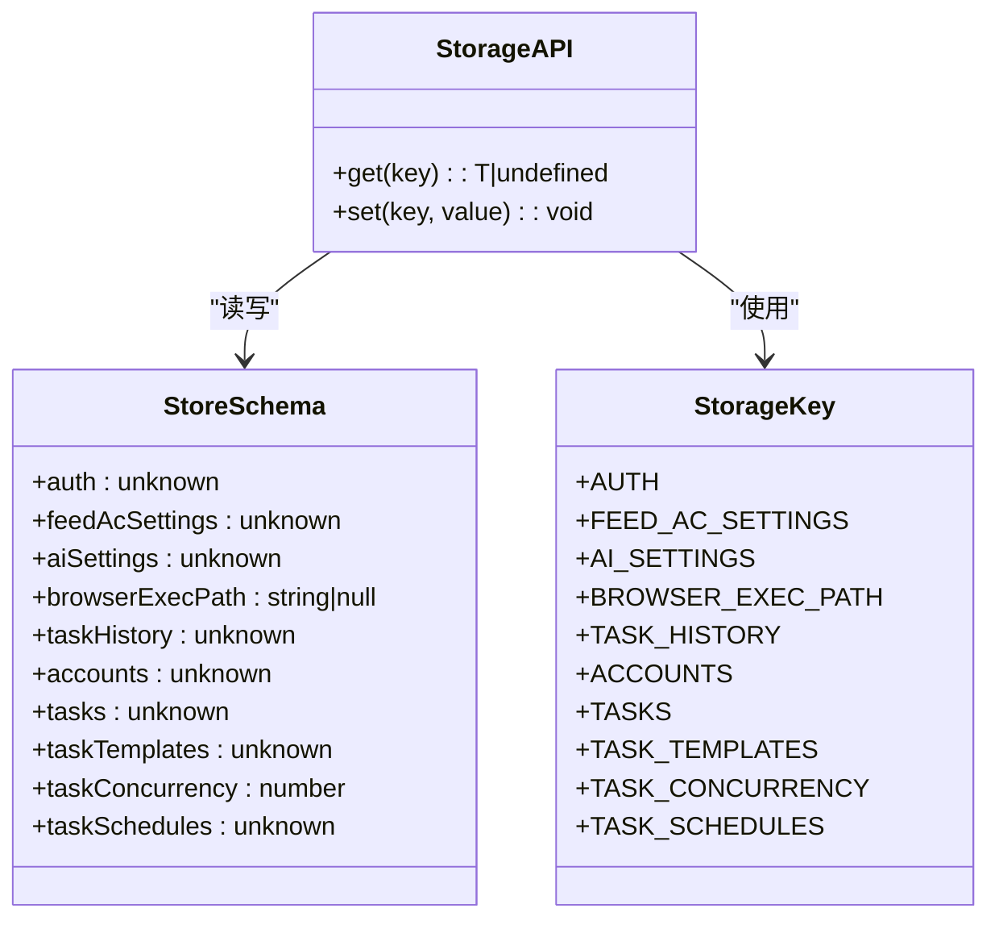
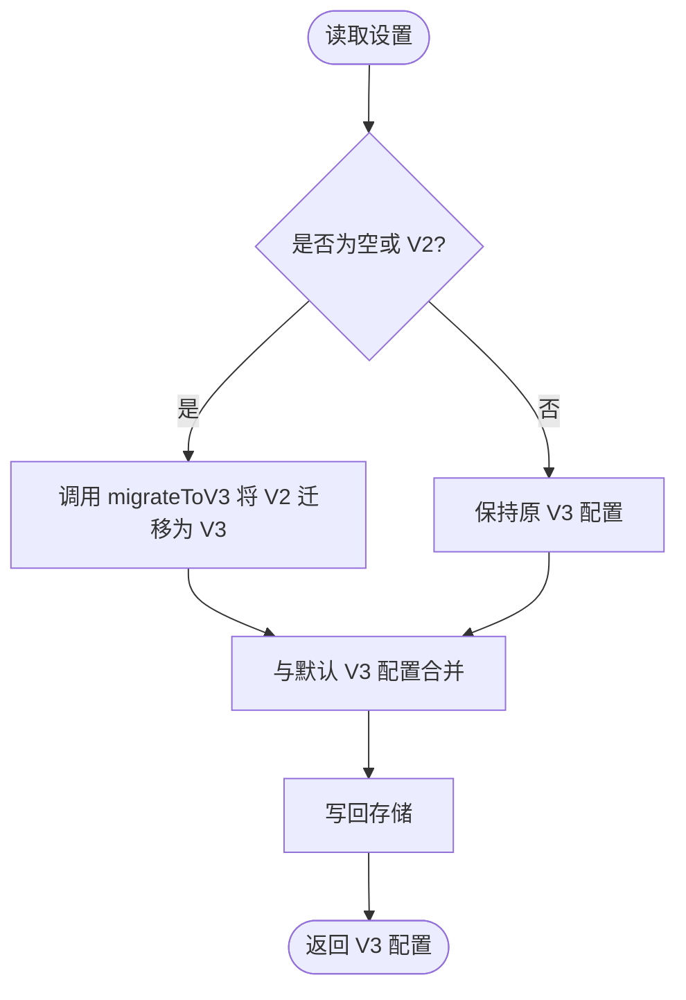
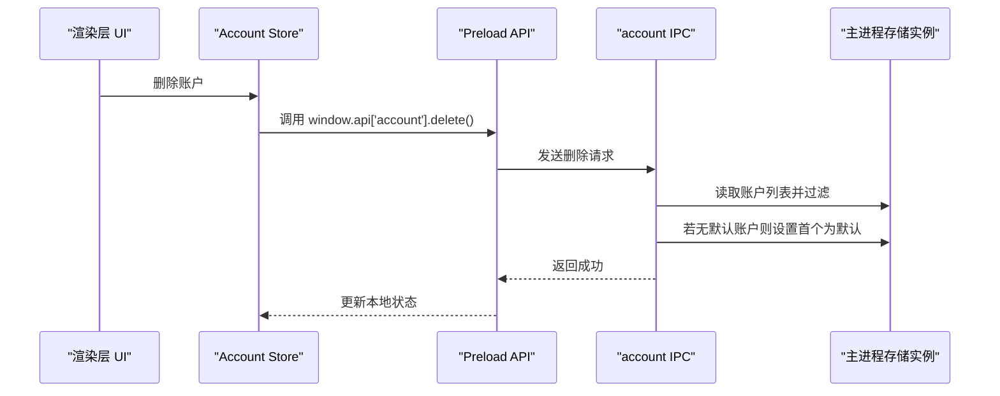
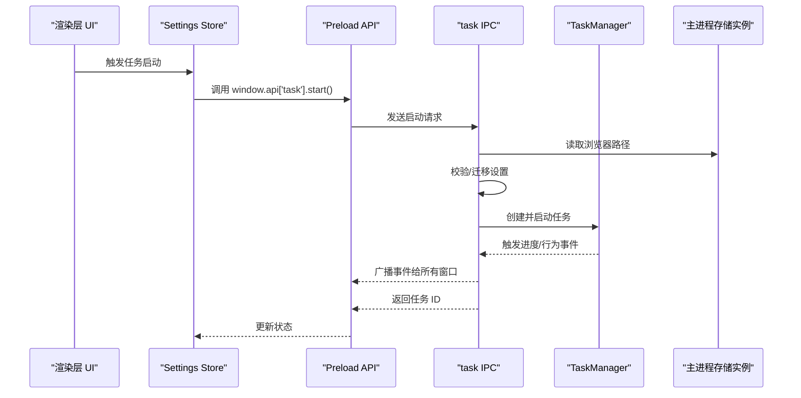
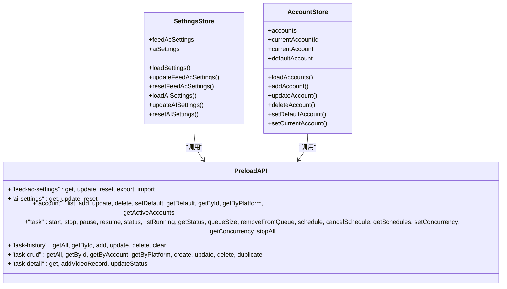
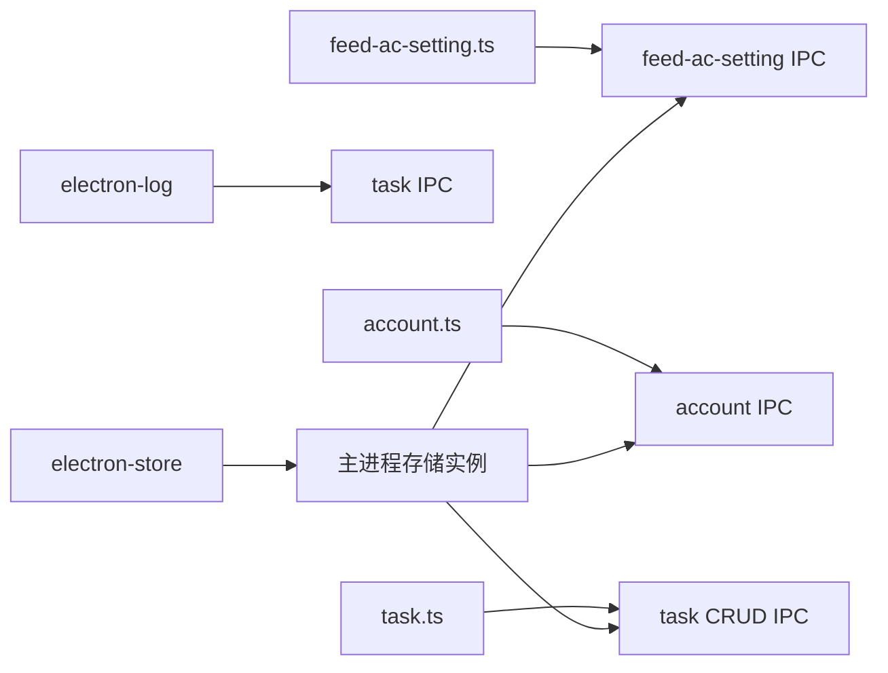

# 本地存储管理

<cite>
**本文引用的文件**
- [storage.ts](file://src/main/utils/storage.ts)
- [feed-ac-setting.ts](file://src/shared/feed-ac-setting.ts)
- [feed-ac-setting IPC](file://src/main/ipc/feed-ac-setting.ts)
- [account.ts](file://src/shared/account.ts)
- [account IPC](file://src/main/ipc/account.ts)
- [task.ts](file://src/shared/task.ts)
- [task CRUD IPC](file://src/main/ipc/task-crud.ts)
- [task IPC](file://src/main/ipc/task.ts)
- [preload API](file://src/preload/index.ts)
- [package.json](file://package.json)
</cite>

## 更新摘要
**所做更改**
- 新增任务并发控制和调度管理功能的文档说明
- 更新存储键空间以包含新的任务并发和调度配置
- 增强IPC通信模式的性能优化说明
- 完善任务管理系统的架构描述
- 新增任务队列管理和状态监控机制

## 目录
1. [简介](#简介)
2. [项目结构](#项目结构)
3. [核心组件](#核心组件)
4. [架构总览](#架构总览)
5. [详细组件分析](#详细组件分析)
6. [依赖关系分析](#依赖关系分析)
7. [性能考量](#性能考量)
8. [故障排查指南](#故障排查指南)
9. [结论](#结论)
10. [附录](#附录)

## 简介
本文件系统性阐述本地存储管理模块的设计与实现，覆盖以下主题：
- 存储架构：基于 Electron Store 的键值存储方案，统一的键空间与类型约束
- 数据持久化策略：以 JSON 文件形式持久化，支持默认值、导入导出与版本迁移
- 缓存机制：渲染层 Pinia Store 与主进程 Store 的协同使用
- 接口实现原理：IPC 桥接、类型安全与错误处理
- 序列化与反序列化：自动 JSON 序列化与类型推断
- 配置项与迁移：Feed 动态内容风控设置的版本演进与兼容
- 性能优化：批量读写、最小化锁粒度、避免阻塞 UI
- 并发控制：单任务运行器与 IPC 请求串行化
- 错误恢复：日志记录、回滚策略与用户提示
- 最佳实践与安全：敏感信息隔离、路径校验、最小权限原则
- 集成方式：与任务执行、账户管理、设置加载等子系统的联动

## 项目结构
本地存储模块围绕主进程的统一存储实例展开，通过 IPC 向渲染层暴露受控的读写接口；共享层定义了跨进程的数据模型与迁移规则。

**图表来源**
- [storage.ts:1-53](file://src/main/utils/storage.ts#L1-L53)
- [feed-ac-setting IPC:1-44](file://src/main/ipc/feed-ac-setting.ts#L1-L44)
- [account IPC:1-128](file://src/main/ipc/account.ts#L1-L128)
- [task IPC:1-252](file://src/main/ipc/task.ts#L1-L252)
- [task CRUD IPC:1-108](file://src/main/ipc/task-crud.ts#L1-L108)
- [preload API:1-237](file://src/preload/index.ts#L1-L237)

**章节来源**
- [storage.ts:1-53](file://src/main/utils/storage.ts#L1-L53)
- [feed-ac-setting.ts:1-179](file://src/shared/feed-ac-setting.ts#L1-L179)
- [feed-ac-setting IPC:1-44](file://src/main/ipc/feed-ac-setting.ts#L1-L44)
- [account.ts:1-39](file://src/shared/account.ts#L1-L39)
- [account IPC:1-128](file://src/main/ipc/account.ts#L1-L128)
- [task.ts:1-62](file://src/shared/task.ts#L1-L62)
- [task CRUD IPC:1-108](file://src/main/ipc/task-crud.ts#L1-L108)
- [task IPC:1-252](file://src/main/ipc/task.ts#L1-L252)
- [preload API:1-237](file://src/preload/index.ts#L1-L237)

## 核心组件
- 统一存储实例与键空间
  - 使用 Electron Store 提供的类型化键值存储，定义键枚举与默认值，确保键名一致性和类型安全
  - 关键键包括：认证信息、动态内容风控设置、AI 设置、浏览器可执行路径、任务历史、账户列表、任务列表、任务模板、任务并发控制、任务调度配置
- 渲染层 Store
  - Settings Store 负责加载/更新 Feed 动态内容风控设置与 AI 设置
  - Account Store 负责账户列表、默认账户、当前账户的读取与变更
- 共享模型与迁移
  - Feed 动态内容风控设置从 V2 升级到 V3，包含默认值、迁移函数与版本字段
  - 任务与模板、任务历史等模型在共享层定义，保证前后端一致性

**章节来源**
- [storage.ts:1-53](file://src/main/utils/storage.ts#L1-L53)
- [feed-ac-setting.ts:62-179](file://src/shared/feed-ac-setting.ts#L62-L179)
- [task.ts:12-62](file://src/shared/task.ts#L12-L62)

## 架构总览
本地存储采用"主进程集中式存储 + 渲染层轻量缓存"的分层架构。渲染层通过 preload 暴露的 API 发起 IPC 请求，主进程的存储实例负责实际读写，并在必要时进行版本迁移与默认值填充。

**图表来源**
- [preload API:165-171](file://src/preload/index.ts#L165-L171)
- [feed-ac-setting IPC:22-27](file://src/main/ipc/feed-ac-setting.ts#L22-L27)
- [storage.ts:46-53](file://src/main/utils/storage.ts#L46-L53)

## 详细组件分析

### 存储接口与键空间
- 键空间定义：通过枚举统一管理所有存储键，避免硬编码与拼写错误
- 默认值策略：为每个键提供合理的默认值，确保首次使用无需手动初始化
- 类型约束：通过泛型 StoreSchema 约束键类型，结合 get/set 函数实现类型安全读写

**图表来源**
- [storage.ts:33-53](file://src/main/utils/storage.ts#L33-L53)

**章节来源**
- [storage.ts:1-53](file://src/main/utils/storage.ts#L1-L53)

### Feed 动态内容风控设置的版本迁移
- 版本演进：V2 -> V3 引入任务类型、组合操作、跳过策略、AI 评论参数等
- 兼容策略：ensureV3 在读取时自动检测并迁移，未配置时返回默认 V3 配置
- 导入导出：支持从 V2/V3 导入到 V3，并导出当前配置

**图表来源**
- [feed-ac-setting.ts:148-174](file://src/shared/feed-ac-setting.ts#L148-L174)
- [feed-ac-setting.ts:101-146](file://src/shared/feed-ac-setting.ts#L101-L146)
- [feed-ac-setting IPC:10-14](file://src/main/ipc/feed-ac-setting.ts#L10-L14)

**章节来源**
- [feed-ac-setting.ts:1-179](file://src/shared/feed-ac-setting.ts#L1-L179)
- [feed-ac-setting IPC:1-44](file://src/main/ipc/feed-ac-setting.ts#L1-L44)

### 账户管理与默认账户策略
- 账户 CRUD：支持列表、新增、更新、删除、设置默认、按平台筛选、获取活跃账户
- 默认账户：当删除账户且无默认账户时，自动将首个账户设为默认，保证始终存在默认账户
- 数据模型：账户包含平台、状态、创建时间、默认标记等字段

**图表来源**
- [account IPC:62-70](file://src/main/ipc/account.ts#L62-L70)
- [account.ts:3-15](file://src/shared/account.ts#L3-L15)

**章节来源**
- [account.ts:1-39](file://src/shared/account.ts#L1-L39)
- [account IPC:1-128](file://src/main/ipc/account.ts#L1-L128)

### 任务系统与历史记录
- 任务启动前置检查：必须配置浏览器可执行路径，否则拒绝启动
- 任务生命周期：启动 -> 进度事件 -> 行为事件 -> 停止回调
- 历史记录：记录任务开始/结束时间、状态、评论计数、视频明细等
- 模板与任务：支持保存模板、复制任务、按账户/平台查询
- 并发控制：支持任务并发数量配置和动态调整
- 调度管理：支持定时任务和任务队列管理

**图表来源**
- [task IPC:88-141](file://src/main/ipc/task.ts#L88-L141)
- [storage.ts:16-29](file://src/main/utils/storage.ts#L16-L29)
- [feed-ac-setting.ts:148-174](file://src/shared/feed-ac-setting.ts#L148-L174)

**章节来源**
- [task.ts:1-62](file://src/shared/task.ts#L1-L62)
- [task CRUD IPC:1-108](file://src/main/ipc/task-crud.ts#L1-L108)
- [task IPC:1-252](file://src/main/ipc/task.ts#L1-L252)

### 渲染层缓存与 IPC 桥接
- Settings Store：封装 feed-ac-settings 与 ai-settings 的加载、更新、重置
- Account Store：封装账户列表、默认账户、当前账户的读取与变更
- Preload API：在 preload 中注册 window.api，将渲染层调用映射到 IPC 处理器

**图表来源**
- [preload API:14-237](file://src/preload/index.ts#L14-L237)

**章节来源**
- [preload API:1-237](file://src/preload/index.ts#L1-L237)

## 依赖关系分析
- 外部依赖
  - electron-store：提供键值存储与默认值、序列化能力
  - electron-log：记录任务启动/停止与错误日志
- 内部依赖
  - 共享层模型驱动主进程 IPC 的数据结构与迁移逻辑
  - 渲染层 Store 通过 preload API 与主进程 IPC 交互

**图表来源**
- [package.json:16-33](file://package.json#L16-L33)
- [storage.ts:1-1](file://src/main/utils/storage.ts#L1-L1)
- [feed-ac-setting.ts:1-8](file://src/shared/feed-ac-setting.ts#L1-L8)
- [account.ts:1-2](file://src/shared/account.ts#L1-L2)
- [task.ts:1-3](file://src/shared/task.ts#L1-L3)

**章节来源**
- [package.json:16-33](file://package.json#L16-L33)

## 性能考量
- 读写路径
  - 批量读取：渲染层优先从本地 Store 获取，减少 IPC 往返
  - 写入合并：主进程在更新设置时先读取再合并，避免部分字段丢失
- 并发控制
  - 任务运行器单实例：防止并发执行导致资源竞争
  - IPC 请求串行化：每个 IPC 处理器内部顺序执行，避免竞态条件
  - 任务并发限制：支持动态调整最大并发数，避免系统资源耗尽
- I/O 优化
  - Electron Store 自动序列化/反序列化，避免手动 JSON 解析开销
  - 默认值与迁移在读取时完成，减少写入压力
- UI 响应
  - 事件广播仅在任务运行期间触发，避免空转事件
  - 任务历史增量更新，避免全量重绘
- 内存使用效率
  - 任务队列管理：支持任务排队和取消，避免内存泄漏
  - 事件监听器管理：动态创建和销毁，减少内存占用

## 故障排查指南
- 任务启动失败
  - 症状：返回"浏览器路径未配置"
  - 排查：确认已设置浏览器可执行路径；检查存储键 BROWSER_EXEC_PATH 是否存在
  - 相关位置
    - [task IPC:106-110](file://src/main/ipc/task.ts#L106-L110)
    - [storage.ts:16-29](file://src/main/utils/storage.ts#L16-L29)
- 账户删除后无默认账户
  - 症状：删除最后一个账户后无法选择默认账户
  - 排查：确认 IPC 删除逻辑会自动设置默认账户
  - 相关位置
    - [account IPC:65-69](file://src/main/ipc/account.ts#L65-L69)
- 设置迁移异常
  - 症状：V2 设置未正确迁移到 V3
  - 排查：确认 ensureV3 逻辑与 migrateToV3 输出
  - 相关位置
    - [feed-ac-setting IPC:10-14](file://src/main/ipc/feed-ac-setting.ts#L10-L14)
    - [feed-ac-setting.ts:148-174](file://src/shared/feed-ac-setting.ts#L148-L174)
- 任务并发问题
  - 症状：任务执行异常或系统响应缓慢
  - 排查：检查任务并发设置和实际执行情况
  - 相关位置
    - [task IPC:229-238](file://src/main/ipc/task.ts#L229-L238)
    - [storage.ts:26](file://src/main/utils/storage.ts#L26)
- 日志定位
  - 使用 electron-log 记录任务启动、停止与错误信息
  - 相关位置
    - [task IPC:8-8](file://src/main/ipc/task.ts#L8-L8)

**章节来源**
- [task IPC:8-8](file://src/main/ipc/task.ts#L8-L8)
- [account IPC:65-69](file://src/main/ipc/account.ts#L65-L69)
- [feed-ac-setting IPC:10-14](file://src/main/ipc/feed-ac-setting.ts#L10-L14)
- [feed-ac-setting.ts:148-174](file://src/shared/feed-ac-setting.ts#L148-L174)

## 结论
该本地存储模块通过统一的键空间与类型约束、清晰的版本迁移策略以及主/渲染双层缓存，实现了稳定可靠的数据持久化与高性能的用户体验。配合严格的错误处理与日志记录，能够有效支撑任务执行、账户管理与设置配置等核心业务场景。新增的任务并发控制和调度管理功能进一步提升了系统的可扩展性和资源利用率。

## 附录
- 最佳实践
  - 使用统一的键枚举与默认值，避免魔法字符串
  - 在主进程进行数据迁移与校验，渲染层只做展示与简单合并
  - 对于大列表（如任务历史）采用增量更新与上限控制
  - 对敏感信息（如 cookies）谨慎存储，必要时加密或外部化
  - 合理配置任务并发数，避免系统资源过度占用
- 安全考虑
  - 浏览器路径与账户凭据需严格校验与最小权限访问
  - 避免在存储中直接存放明文密码或令牌
  - 定期清理过期历史记录，控制文件大小
  - 任务配置中的敏感信息需要适当的保护措施
- 扩展建议
  - 新增键时同步补充默认值与类型约束
  - 对复杂对象引入结构化迁移脚本
  - 引入快照/备份与恢复机制，便于版本升级与灾难恢复
  - 考虑添加存储监控和性能分析功能
  - 实现存储数据的定期清理和维护机制