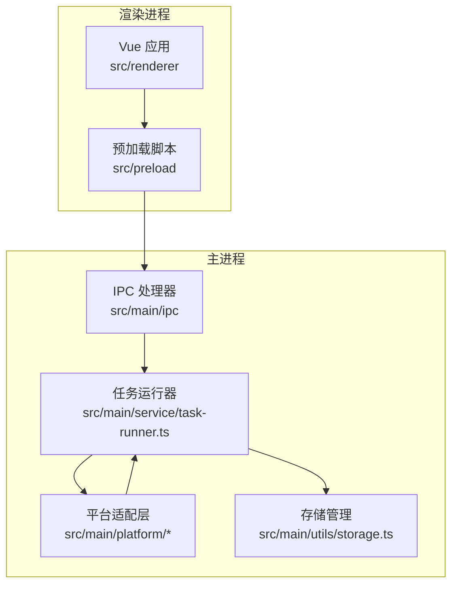
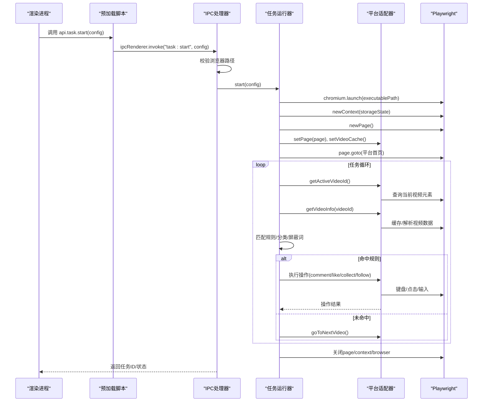
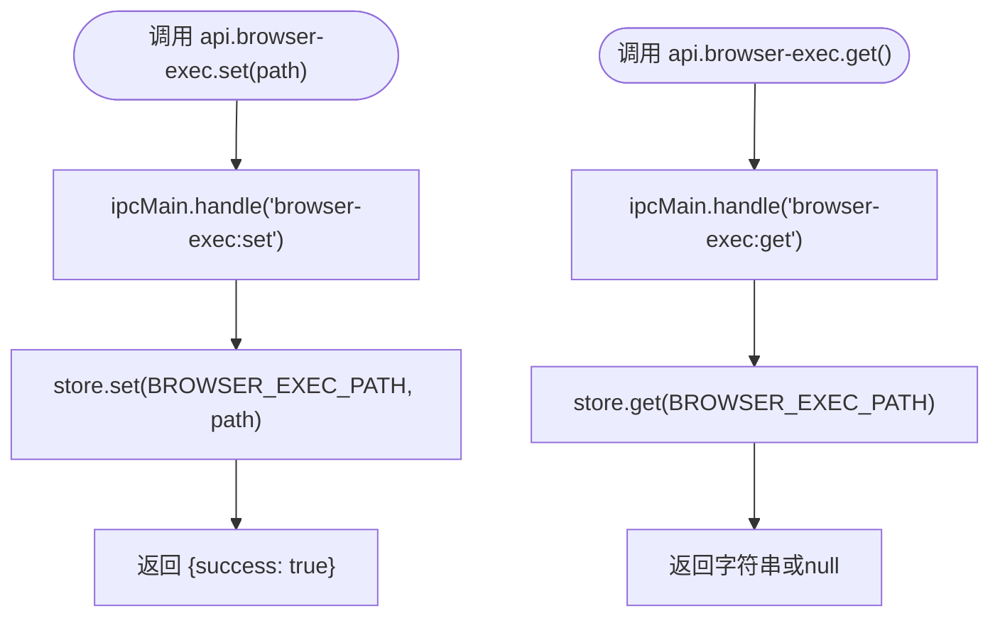
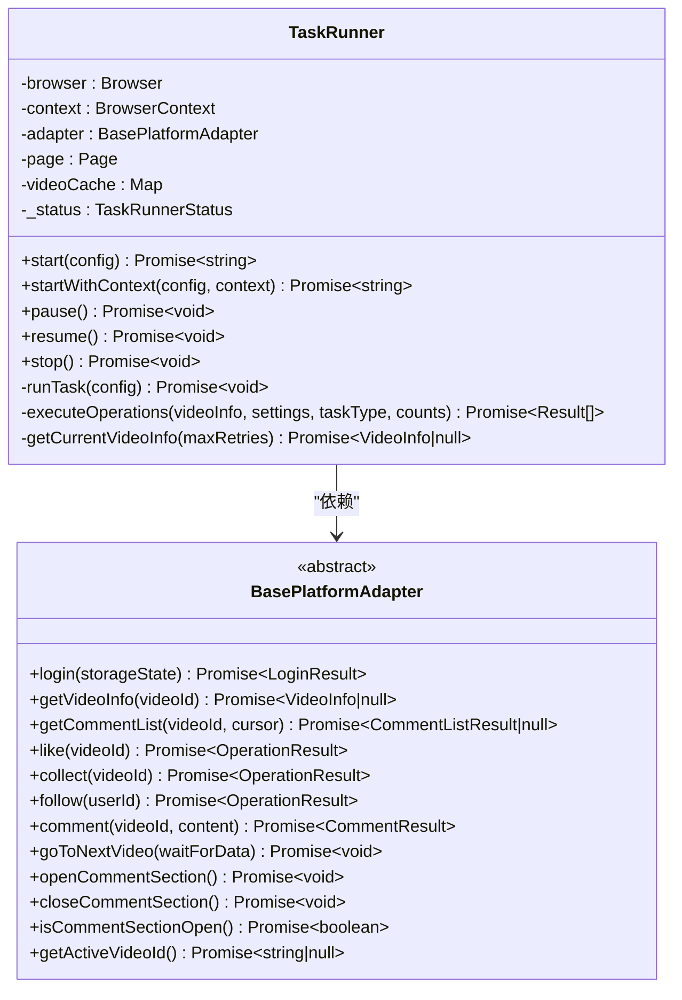
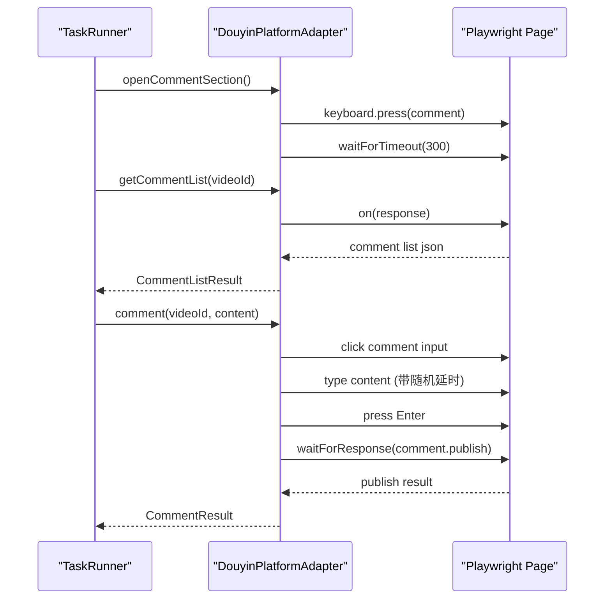
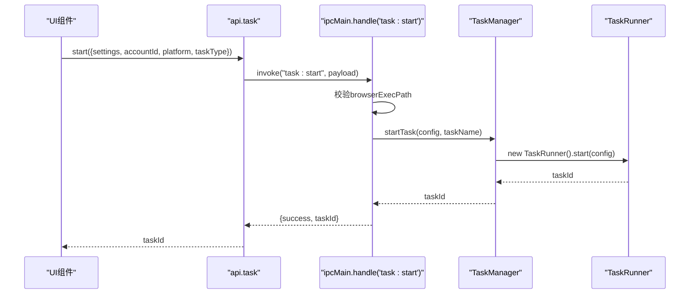
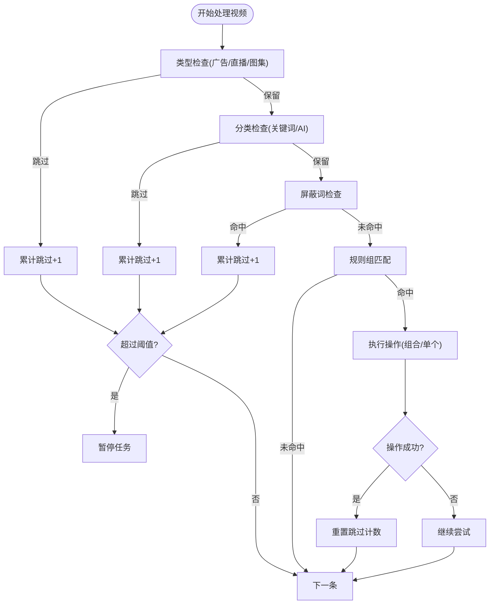
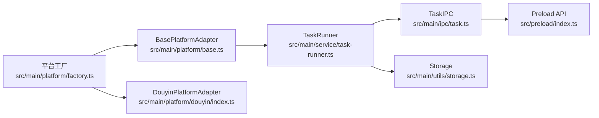

# 浏览器执行工具

<cite>
**本文档引用的文件**
- [README.md](file://README.md)
- [src/main/ipc/browser-exec.ts](file://src/main/ipc/browser-exec.ts)
- [src/main/ipc/task.ts](file://src/main/ipc/task.ts)
- [src/main/service/task-runner.ts](file://src/main/service/task-runner.ts)
- [src/main/platform/base.ts](file://src/main/platform/base.ts)
- [src/main/platform/factory.ts](file://src/main/platform/factory.ts)
- [src/main/platform/douyin/index.ts](file://src/main/platform/douyin/index.ts)
- [src/shared/platform.ts](file://src/shared/platform.ts)
- [src/shared/feed-ac-setting.ts](file://src/shared/feed-ac-setting.ts)
- [src/shared/task.ts](file://src/shared/task.ts)
- [src/shared/task-operation.ts](file://src/shared/task-operation.ts)
- [src/main/utils/storage.ts](file://src/main/utils/storage.ts)
- [src/preload/index.ts](file://src/preload/index.ts)
</cite>

## 目录
1. [简介](#简介)
2. [项目结构](#项目结构)
3. [核心组件](#核心组件)
4. [架构总览](#架构总览)
5. [详细组件分析](#详细组件分析)
6. [依赖关系分析](#依赖关系分析)
7. [性能考虑](#性能考虑)
8. [故障排除指南](#故障排除指南)
9. [结论](#结论)
10. [附录](#附录)

## 简介
本文件系统性阐述浏览器执行工具的设计与实现，重点覆盖：
- 浏览器自动化执行机制与命令执行流程
- 执行API设计原理、参数传递与返回值处理
- 不同操作类型的执行策略、错误重试与超时处理
- 执行性能优化、并发控制与资源管理
- 使用示例、调试技巧与故障排除方法
- 与Playwright框架的集成方式与最佳实践

该工具基于Electron + Vue前端 + Playwright浏览器自动化，支持多平台（抖音、快手、小红书）的自动化任务执行，具备AI智能评论、规则匹配、视频活跃度检测、任务历史记录等功能。

**章节来源**
- [README.md:1-54](file://README.md#L1-L54)

## 项目结构
项目采用主进程-渲染进程分层架构，核心目录与职责如下：
- src/main/ipc：IPC处理器，负责与渲染进程通信
- src/main/service：业务逻辑层，包含任务运行器与任务管理器
- src/main/platform：平台适配层，封装各平台的页面交互细节
- src/shared：共享类型定义与配置模型
- src/preload：预加载脚本，暴露安全的API给渲染进程
- src/renderer：Vue前端应用

**图表来源**
- [src/main/ipc/task.ts:1-243](file://src/main/ipc/task.ts#L1-L243)
- [src/main/service/task-runner.ts:1-760](file://src/main/service/task-runner.ts#L1-L760)
- [src/main/platform/base.ts:1-105](file://src/main/platform/base.ts#L1-L105)
- [src/main/utils/storage.ts:1-46](file://src/main/utils/storage.ts#L1-L46)

**章节来源**
- [README.md:36-54](file://README.md#L36-L54)

## 核心组件
- 浏览器执行路径管理：通过IPC提供浏览器可执行路径的读写能力
- 任务运行器：封装Playwright浏览器生命周期、页面导航、事件监听、任务循环与操作执行
- 平台适配器：抽象各平台的页面元素选择器、键盘快捷键、API端点与具体操作实现
- 存储管理：统一管理认证状态、设置、任务历史等持久化数据
- 配置模型：FeedAC设置、任务模板、操作类型等

**章节来源**
- [src/main/ipc/browser-exec.ts:1-13](file://src/main/ipc/browser-exec.ts#L1-L13)
- [src/main/service/task-runner.ts:15-760](file://src/main/service/task-runner.ts#L15-L760)
- [src/main/platform/base.ts:24-80](file://src/main/platform/base.ts#L24-L80)
- [src/main/utils/storage.ts:29-46](file://src/main/utils/storage.ts#L29-L46)
- [src/shared/feed-ac-setting.ts:62-179](file://src/shared/feed-ac-setting.ts#L62-L179)

## 架构总览
浏览器执行工具的整体架构围绕“IPC -> 任务运行器 -> 平台适配器 -> Playwright”的链路展开。渲染进程通过预加载脚本暴露的安全API调用主进程，主进程根据配置启动浏览器实例，创建上下文与页面，注入平台适配器，监听页面响应以缓存视频数据，并驱动任务循环执行。

**图表来源**
- [src/main/ipc/task.ts:82-132](file://src/main/ipc/task.ts#L82-L132)
- [src/main/service/task-runner.ts:55-113](file://src/main/service/task-runner.ts#L55-L113)
- [src/main/platform/douyin/index.ts:198-261](file://src/main/platform/douyin/index.ts#L198-L261)

**章节来源**
- [src/main/ipc/task.ts:81-240](file://src/main/ipc/task.ts#L81-L240)
- [src/main/service/task-runner.ts:235-371](file://src/main/service/task-runner.ts#L235-L371)

## 详细组件分析

### 浏览器执行路径管理
- 提供IPC接口用于读取/设置浏览器可执行路径
- 存储于本地electron-store，键名固定
- 渲染进程通过预加载脚本暴露api.browser-exec.get/set

**图表来源**
- [src/main/ipc/browser-exec.ts:4-12](file://src/main/ipc/browser-exec.ts#L4-L12)
- [src/main/utils/storage.ts:29-46](file://src/main/utils/storage.ts#L29-L46)
- [src/preload/index.ts:30-33](file://src/preload/index.ts#L30-L33)

**章节来源**
- [src/main/ipc/browser-exec.ts:1-13](file://src/main/ipc/browser-exec.ts#L1-L13)
- [src/main/utils/storage.ts:14-25](file://src/main/utils/storage.ts#L14-L25)
- [src/preload/index.ts:130-133](file://src/preload/index.ts#L130-L133)

### 任务运行器（TaskRunner）
- 生命周期管理：launch -> newContext -> newPage -> goto -> runTask -> close
- 事件驱动：通过EventEmitter发布progress/action/paused/resumed/stopped
- 任务循环：按配置遍历视频，进行类型过滤、分类匹配、屏蔽词检查、规则匹配、AI分析、操作执行
- 并发控制：支持外部共享context的多任务并行模式
- 资源管理：保存storageState、关闭page/context/browser；区分外部context场景

**图表来源**
- [src/main/service/task-runner.ts:25-760](file://src/main/service/task-runner.ts#L25-L760)
- [src/main/platform/base.ts:24-80](file://src/main/platform/base.ts#L24-L80)

**章节来源**
- [src/main/service/task-runner.ts:25-233](file://src/main/service/task-runner.ts#L25-L233)
- [src/main/service/task-runner.ts:235-371](file://src/main/service/task-runner.ts#L235-L371)
- [src/main/service/task-runner.ts:561-612](file://src/main/service/task-runner.ts#L561-L612)

### 平台适配器（DouyinPlatformAdapter）
- 封装抖音平台的页面交互：登录、视频信息获取、评论列表、点赞/收藏/关注、评论发布、视频切换
- 事件监听：订阅feed/comment/publish等API响应，填充videoCache
- 键盘快捷键：nextVideo/like/collect/comment/follow
- 超时与验证：评论发布等待响应，验证码弹窗检测与等待

**图表来源**
- [src/main/platform/douyin/index.ts:221-261](file://src/main/platform/douyin/index.ts#L221-L261)
- [src/main/platform/douyin/index.ts:301-348](file://src/main/platform/douyin/index.ts#L301-L348)
- [src/main/platform/douyin/index.ts:350-375](file://src/main/platform/douyin/index.ts#L350-L375)

**章节来源**
- [src/main/platform/douyin/index.ts:60-494](file://src/main/platform/douyin/index.ts#L60-L494)

### 执行API设计与参数传递
- 渲染进程通过预加载脚本暴露api.task.start/stop/status/onProgress/onAction等接口
- 主进程IPC处理器接收配置，校验浏览器路径，委托TaskManager启动任务
- 配置项包括：平台、任务类型、账户ID、设置（FeedAC Settings V2/V3）

**图表来源**
- [src/preload/index.ts:102-116](file://src/preload/index.ts#L102-L116)
- [src/main/ipc/task.ts:82-132](file://src/main/ipc/task.ts#L82-L132)

**章节来源**
- [src/preload/index.ts:3-93](file://src/preload/index.ts#L3-L93)
- [src/main/ipc/task.ts:81-240](file://src/main/ipc/task.ts#L81-L240)

### 执行策略与规则匹配
- 视频类型过滤：广告、直播、图集自动跳过
- 分类筛选：关键词匹配或AI分析（白名单/黑名单模式）
- 屏蔽词：视频描述/作者昵称命中即跳过
- 规则组：支持手动规则（字段+关键词）与AI规则（自定义提示词）
- 组合操作：按概率与上限执行多种操作，支持命中即停

**图表来源**
- [src/main/service/task-runner.ts:423-448](file://src/main/service/task-runner.ts#L423-L448)
- [src/main/service/task-runner.ts:453-482](file://src/main/service/task-runner.ts#L453-L482)
- [src/main/service/task-runner.ts:489-501](file://src/main/service/task-runner.ts#L489-L501)
- [src/main/service/task-runner.ts:503-559](file://src/main/service/task-runner.ts#L503-L559)
- [src/main/service/task-runner.ts:561-590](file://src/main/service/task-runner.ts#L561-L590)

**章节来源**
- [src/main/service/task-runner.ts:423-590](file://src/main/service/task-runner.ts#L423-L590)

### 错误重试与超时处理
- 视频信息获取：最多重试3次，每次间隔500ms
- 评论列表：监听响应，10秒超时
- 评论发布：等待publish响应，5秒超时；检测验证码弹窗并等待
- 视频切换：等待activeVideo变化与缓存数据可用，超时则继续

**章节来源**
- [src/main/service/task-runner.ts:373-418](file://src/main/service/task-runner.ts#L373-L418)
- [src/main/platform/douyin/index.ts:224-261](file://src/main/platform/douyin/index.ts#L224-L261)
- [src/main/platform/douyin/index.ts:350-375](file://src/main/platform/douyin/index.ts#L350-L375)
- [src/main/platform/douyin/index.ts:379-426](file://src/main/platform/douyin/index.ts#L379-L426)

### 并发控制与资源管理
- 外部共享context：startWithContext允许多个任务共享同一BrowserContext，提升并发效率
- 资源释放：仅关闭page/context；若非外部context则关闭browser
- 认证状态持久化：任务结束时保存storageState，下次启动可复用

**章节来源**
- [src/main/service/task-runner.ts:118-156](file://src/main/service/task-runner.ts#L118-L156)
- [src/main/service/task-runner.ts:212-233](file://src/main/service/task-runner.ts#L212-L233)
- [src/main/platform/douyin/index.ts:480-492](file://src/main/platform/douyin/index.ts#L480-L492)

## 依赖关系分析
- TaskRunner依赖BasePlatformAdapter，不同平台通过工厂创建具体适配器
- 平台适配器依赖Playwright Page与配置常量（选择器、键盘快捷键、API端点）
- IPC层依赖TaskManager与TaskRunner，转发事件到渲染进程
- 存储层统一管理浏览器执行路径、认证状态、设置等

**图表来源**
- [src/main/platform/factory.ts:7-18](file://src/main/platform/factory.ts#L7-L18)
- [src/main/platform/base.ts:24-80](file://src/main/platform/base.ts#L24-L80)
- [src/main/platform/douyin/index.ts:60-61](file://src/main/platform/douyin/index.ts#L60-L61)
- [src/main/service/task-runner.ts:25-42](file://src/main/service/task-runner.ts#L25-L42)
- [src/main/ipc/task.ts:1-8](file://src/main/ipc/task.ts#L1-L8)
- [src/main/utils/storage.ts:14-25](file://src/main/utils/storage.ts#L14-L25)
- [src/preload/index.ts:95-187](file://src/preload/index.ts#L95-L187)

**章节来源**
- [src/main/platform/factory.ts:1-32](file://src/main/platform/factory.ts#L1-L32)
- [src/main/ipc/task.ts:1-8](file://src/main/ipc/task.ts#L1-L8)

## 性能考虑
- 视频缓存：通过监听feed API响应将视频数据缓存至Map，减少重复请求
- 智能等待：切换视频后等待activeVideo变化与缓存数据就绪，避免空数据
- 随机化：模拟真人行为（随机观看时长、输入延迟、操作概率），降低风控风险
- 并发优化：共享context模式提升多任务执行效率
- 资源回收：及时关闭page/context/browser，避免内存泄漏

**章节来源**
- [src/main/platform/douyin/index.ts:140-157](file://src/main/platform/douyin/index.ts#L140-L157)
- [src/main/platform/douyin/index.ts:415-426](file://src/main/platform/douyin/index.ts#L415-L426)
- [src/main/service/task-runner.ts:324-328](file://src/main/service/task-runner.ts#L324-L328)
- [src/main/service/task-runner.ts:118-156](file://src/main/service/task-runner.ts#L118-L156)

## 故障排除指南
- 浏览器路径未配置
  - 现象：启动任务时报错“Browser path not configured”
  - 处理：通过api.browser-exec.set设置可执行路径，或在设置界面配置
- 登录状态异常
  - 现象：无法进入主页或被要求重新登录
  - 处理：检查storageState是否正确保存与加载；必要时重新登录
- 评论发布失败
  - 现象：评论发布接口响应超时或验证码弹窗
  - 处理：等待验证码弹窗消失；适当增加等待时间；检查网络与账号状态
- 视频信息为空
  - 现象：连续跳过达到阈值，任务暂停
  - 处理：检查feed API监听是否生效；确认页面已加载；适当延长等待时间
- 并发冲突
  - 现象：多任务互相影响
  - 处理：使用startWithContext共享context；合理设置并发上限

**章节来源**
- [src/main/ipc/task.ts:98-102](file://src/main/ipc/task.ts#L98-L102)
- [src/main/platform/douyin/index.ts:335-342](file://src/main/platform/douyin/index.ts#L335-L342)
- [src/main/service/task-runner.ts:268-271](file://src/main/service/task-runner.ts#L268-L271)

## 结论
该浏览器执行工具通过清晰的分层架构与平台适配器模式，实现了跨平台的自动化任务执行。结合Playwright的强大能力与完善的错误处理、超时控制、并发管理机制，能够在保证稳定性的同时提升执行效率。建议在生产环境中：
- 明确浏览器路径与登录状态管理
- 合理配置规则与并发策略
- 建立完善的日志与监控体系
- 定期评估平台反爬策略并调整行为模拟

[无需来源：总结性内容]

## 附录

### 执行API参考
- 任务启动：api.task.start(config) -> {success, taskId}
- 任务停止：api.task.stop(taskId?) -> {success}
- 任务状态：api.task.status(taskId?) -> {running, tasks?}
- 进度回调：api.task.onProgress(cb) -> 取消函数
- 操作回调：api.task.onAction(cb) -> 取消函数

**章节来源**
- [src/preload/index.ts:102-116](file://src/preload/index.ts#L102-L116)

### 配置模型要点
- FeedAcSettingsV3：支持多操作配置、视频类型跳过、视频分类筛选、AI评论等
- 任务模板：支持快速复用配置
- 平台配置：选择器、API端点、键盘快捷键

**章节来源**
- [src/shared/feed-ac-setting.ts:62-179](file://src/shared/feed-ac-setting.ts#L62-L179)
- [src/shared/task.ts:24-48](file://src/shared/task.ts#L24-L48)
- [src/shared/platform.ts:88-200](file://src/shared/platform.ts#L88-L200)