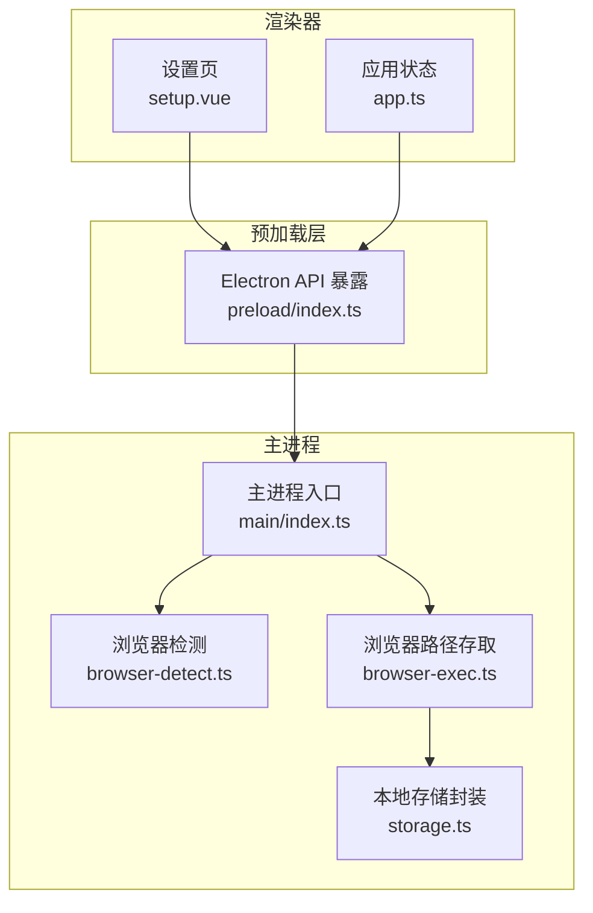
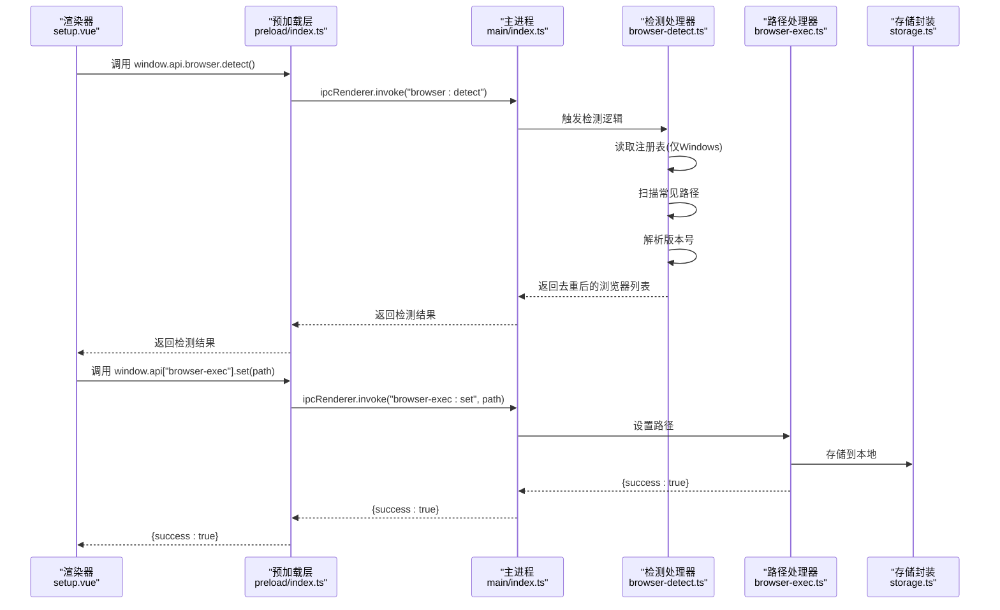
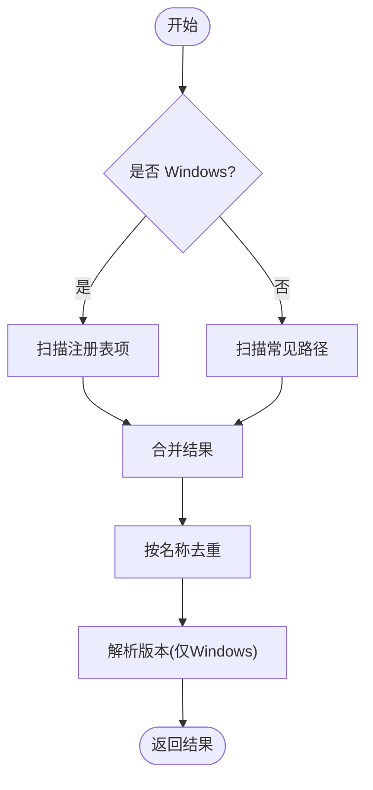
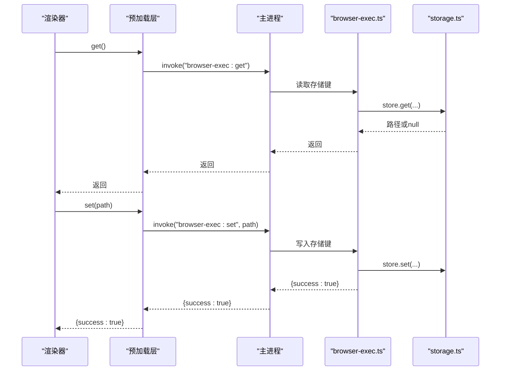
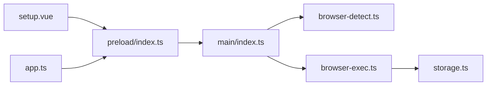

# 浏览器检测工具

<cite>
**本文引用的文件**
- [src/main/ipc/browser-detect.ts](file://src/main/ipc/browser-detect.ts)
- [src/main/ipc/browser-exec.ts](file://src/main/ipc/browser-exec.ts)
- [src/main/utils/storage.ts](file://src/main/utils/storage.ts)
- [src/main/index.ts](file://src/main/index.ts)
- [src/preload/index.ts](file://src/preload/index.ts)
- [src/renderer/src/pages/setup.vue](file://src/renderer/src/pages/setup.vue)
- [src/renderer/src/stores/app.ts](file://src/renderer/src/stores/app.ts)
- [package.json](file://package.json)
</cite>

## 目录
1. [简介](#简介)
2. [项目结构](#项目结构)
3. [核心组件](#核心组件)
4. [架构总览](#架构总览)
5. [详细组件分析](#详细组件分析)
6. [依赖关系分析](#依赖关系分析)
7. [性能考虑](#性能考虑)
8. [故障排除指南](#故障排除指南)
9. [结论](#结论)
10. [附录](#附录)

## 简介
本文件面向开发者，系统化阐述浏览器检测工具的设计与实现，覆盖检测机制、策略与兼容性处理；详解检测 API 的使用方法、返回值语义与错误处理；解释不同浏览器环境下的差异与适配方案；并提供性能优化、缓存策略与实时更新建议，以及在自动化流程中的集成方式与最佳实践。

## 项目结构
该功能位于 Electron 主进程侧，通过 IPC 向渲染器暴露“浏览器检测”和“浏览器可执行路径设置/读取”的能力，并由渲染器在首次配置时调用以完成浏览器选择与持久化。

**图表来源**
- [src/renderer/src/pages/setup.vue:1-245](file://src/renderer/src/pages/setup.vue#L1-L245)
- [src/renderer/src/stores/app.ts:1-71](file://src/renderer/src/stores/app.ts#L1-L71)
- [src/preload/index.ts:1-187](file://src/preload/index.ts#L1-L187)
- [src/main/index.ts:1-106](file://src/main/index.ts#L1-L106)
- [src/main/ipc/browser-detect.ts:1-118](file://src/main/ipc/browser-detect.ts#L1-L118)
- [src/main/ipc/browser-exec.ts:1-13](file://src/main/ipc/browser-exec.ts#L1-L13)
- [src/main/utils/storage.ts:1-46](file://src/main/utils/storage.ts#L1-L46)

**章节来源**
- [src/main/index.ts:54-76](file://src/main/index.ts#L54-L76)
- [src/preload/index.ts:95-187](file://src/preload/index.ts#L95-L187)

## 核心组件
- 浏览器检测 IPC 处理器：负责扫描系统常见路径与 Windows 注册表，解析可执行文件版本，去重后返回浏览器清单。
- 浏览器路径存取 IPC 处理器：提供获取/设置当前使用的浏览器可执行文件路径，并持久化到本地存储。
- 预加载层 API 暴露：将主进程提供的 IPC 能力以类型安全的方式暴露给渲染器。
- 渲染器设置页：触发检测、展示结果、允许用户选择或自定义路径，并调用设置接口保存。
- 应用状态存储：在渲染器侧维护初始化状态与浏览器路径，供后续任务运行时使用。

**章节来源**
- [src/main/ipc/browser-detect.ts:6-118](file://src/main/ipc/browser-detect.ts#L6-L118)
- [src/main/ipc/browser-exec.ts:1-13](file://src/main/ipc/browser-exec.ts#L1-L13)
- [src/preload/index.ts:34-36](file://src/preload/index.ts#L34-L36)
- [src/renderer/src/pages/setup.vue:32-75](file://src/renderer/src/pages/setup.vue#L32-L75)
- [src/renderer/src/stores/app.ts:32-43](file://src/renderer/src/stores/app.ts#L32-L43)

## 架构总览
下图展示了从渲染器发起检测请求，到主进程执行检测与返回结果的完整序列。

**图表来源**
- [src/renderer/src/pages/setup.vue:32-75](file://src/renderer/src/pages/setup.vue#L32-L75)
- [src/preload/index.ts:134-136](file://src/preload/index.ts#L134-L136)
- [src/main/index.ts:67-68](file://src/main/index.ts#L67-L68)
- [src/main/ipc/browser-detect.ts:105-117](file://src/main/ipc/browser-detect.ts#L105-L117)
- [src/main/ipc/browser-exec.ts:4-13](file://src/main/ipc/browser-exec.ts#L4-L13)
- [src/main/utils/storage.ts:14-25](file://src/main/utils/storage.ts#L14-L25)

## 详细组件分析

### 组件一：浏览器检测（browser-detect）
- 功能职责
  - 在 Windows 上查询注册表定位已安装的浏览器可执行文件；
  - 在所有平台扫描常见安装路径；
  - 对可执行文件调用命令行参数获取版本号（Windows）；
  - 去重后返回包含名称、路径、版本的浏览器信息数组。
- 关键策略
  - 平台差异化：仅在 Windows 使用注册表扫描，避免跨平台兼容问题；
  - 路径优先级：先注册表，再常见路径，最后去重合并；
  - 版本解析：Windows 平台通过子进程执行可执行文件并正则提取版本字符串，非 Windows 返回占位符。
- 错误处理
  - 注册表访问异常、权限不足、路径不存在均被吞并并继续处理其他条目；
  - 子进程超时与异常返回占位版本，保证检测流程不中断。
- 兼容性
  - 支持 Chrome、Edge、Chromium 三类主流浏览器的识别与区分；
  - Linux 下对 snap 安装路径进行覆盖，提升发现率。

**图表来源**
- [src/main/ipc/browser-detect.ts:47-117](file://src/main/ipc/browser-detect.ts#L47-L117)

**章节来源**
- [src/main/ipc/browser-detect.ts:6-118](file://src/main/ipc/browser-detect.ts#L6-L118)

### 组件二：浏览器路径存取（browser-exec）
- 功能职责
  - 提供获取当前浏览器可执行路径；
  - 提供设置并持久化浏览器可执行路径。
- 数据持久化
  - 使用本地存储封装，键名固定为浏览器执行路径键；
  - 默认值为空，表示尚未配置。
- 与检测结果的关系
  - 检测结果仅提供候选路径与版本，最终生效的是通过设置接口写入的路径。

**图表来源**
- [src/main/ipc/browser-exec.ts:4-13](file://src/main/ipc/browser-exec.ts#L4-L13)
- [src/main/utils/storage.ts:14-25](file://src/main/utils/storage.ts#L14-L25)

**章节来源**
- [src/main/ipc/browser-exec.ts:1-13](file://src/main/ipc/browser-exec.ts#L1-L13)
- [src/main/utils/storage.ts:29-38](file://src/main/utils/storage.ts#L29-L38)

### 组件三：预加载层 API 暴露（preload）
- 功能职责
  - 将主进程提供的 IPC 接口以类型安全的方式暴露给渲染器；
  - 包含浏览器检测与浏览器路径存取等接口。
- 设计要点
  - 使用接口声明统一暴露签名，便于 TypeScript 类型检查；
  - 通过 contextBridge 暴露至 window.api，渲染器直接调用。

**章节来源**
- [src/preload/index.ts:34-36](file://src/preload/index.ts#L34-L36)
- [src/preload/index.ts:134-136](file://src/preload/index.ts#L134-L136)
- [src/preload/index.ts:95-187](file://src/preload/index.ts#L95-L187)

### 组件四：渲染器设置页（setup.vue）
- 功能职责
  - 提供“检测浏览器”按钮，调用检测接口并展示候选列表；
  - 支持手动浏览选择自定义路径；
  - 选择后调用设置接口保存路径，并进入完成步骤。
- 用户交互
  - 加载时默认不自动检测，避免触发浏览器启动；
  - 检测过程中显示加载动画，失败时提示错误；
  - 成功后跳转到应用首页。

**章节来源**
- [src/renderer/src/pages/setup.vue:27-75](file://src/renderer/src/pages/setup.vue#L27-L75)

### 组件五：应用状态存储（app.ts）
- 功能职责
  - 在渲染器侧维护初始化状态与浏览器路径；
  - 初始化时读取本地存储中的浏览器路径，决定是否已完成配置；
  - 提供设置路径的方法，同时更新内存状态。
- 与检测的关系
  - 检测结果仅作为选择依据，最终生效的是设置接口写入的路径；
  - 初始化检查确保应用启动时能正确识别已配置的浏览器。

**章节来源**
- [src/renderer/src/stores/app.ts:32-43](file://src/renderer/src/stores/app.ts#L32-L43)

## 依赖关系分析
- 主进程入口集中注册所有 IPC 处理器，包括浏览器检测与路径存取；
- 预加载层统一暴露 API，渲染器通过 window.api 调用；
- 浏览器路径存取依赖本地存储封装；
- 渲染器设置页依赖预加载层与应用状态存储。

**图表来源**
- [src/main/index.ts:54-76](file://src/main/index.ts#L54-L76)
- [src/preload/index.ts:95-187](file://src/preload/index.ts#L95-L187)
- [src/main/ipc/browser-exec.ts:1-13](file://src/main/ipc/browser-exec.ts#L1-L13)
- [src/main/utils/storage.ts:1-46](file://src/main/utils/storage.ts#L1-L46)

**章节来源**
- [src/main/index.ts:54-76](file://src/main/index.ts#L54-L76)
- [src/preload/index.ts:95-187](file://src/preload/index.ts#L95-L187)

## 性能考虑
- 检测开销控制
  - 仅在用户主动点击“刷新”时触发检测，避免自动检测导致的 IO 与子进程开销；
  - Windows 注册表查询与文件存在性检查均为 O(n) 操作，n 为预置路径数量，整体开销可控。
- 版本解析
  - 仅在 Windows 平台执行子进程获取版本，其他平台直接返回占位符，减少跨平台差异带来的额外开销。
- 去重策略
  - 按名称去重，避免同一浏览器多次出现，降低渲染器处理负担。
- 缓存与持久化
  - 检测结果仅作为选择参考；最终生效路径来自本地存储，避免重复检测；
  - 可在渲染器侧增加内存缓存：若已存在有效路径且未显式刷新，则不再触发检测。
- 实时更新机制
  - 当用户手动更换浏览器路径或新增浏览器安装时，下次设置或重启应用后生效；
  - 可扩展：在应用启动时读取一次路径，若为空则触发一次检测，提升首次体验。

[本节为通用性能建议，无需特定文件引用]

## 故障排除指南
- 检测不到浏览器
  - 确认操作系统平台：当前实现仅在 Windows 使用注册表扫描，Linux/macOS 依赖常见路径；
  - 检查路径是否存在：常见路径可能因安装位置不同而变化，可使用“浏览”选择自定义路径；
  - 权限问题：Windows 注册表访问可能受限，属正常降级行为。
- 版本号显示为未知
  - 仅 Windows 平台会尝试解析版本号，其他平台返回占位符属预期行为；
  - 若期望获取版本，请在 Windows 环境下使用。
- 设置路径后仍无法使用
  - 确认路径指向正确的可执行文件；
  - 检查目标浏览器是否支持无头模式或自动化所需参数；
  - 查看应用日志，确认设置接口调用成功。
- 跨平台差异
  - Linux 下对 snap 安装路径进行了覆盖，若仍不可用，需手动指定路径；
  - macOS 下常见路径为应用包内容的可执行文件路径，需确保路径正确。
- 错误处理与提示
  - 渲染器在检测失败时会弹出错误提示，可在 UI 层引导用户手动选择路径；
  - 主进程异常会被吞并并返回空结果，保证流程稳定。

**章节来源**
- [src/main/ipc/browser-detect.ts:35-45](file://src/main/ipc/browser-detect.ts#L35-L45)
- [src/renderer/src/pages/setup.vue:40-44](file://src/renderer/src/pages/setup.vue#L40-L44)

## 结论
该浏览器检测工具采用“主进程扫描 + 预加载层暴露 + 渲染器选择 + 本地存储持久化”的分层设计，既保证了跨平台兼容性，又提供了良好的用户体验。通过最小化自动检测频率、按名称去重与占位版本处理，实现了稳定的性能表现。结合本地存储与状态管理，可无缝融入自动化流程并在后续任务中复用已配置的浏览器路径。

[本节为总结性内容，无需特定文件引用]

## 附录

### API 使用说明（渲染器侧）
- 检测浏览器
  - 调用路径：window.api.browser.detect()
  - 返回值：数组，元素包含 path、name、version 字段
  - 用途：展示候选浏览器供用户选择
- 设置浏览器路径
  - 调用路径：window.api["browser-exec"].set(path)
  - 返回值：对象，包含 success 字段
  - 用途：保存用户选择的浏览器可执行文件路径
- 获取浏览器路径
  - 调用路径：window.api["browser-exec"].get()
  - 返回值：字符串或 null
  - 用途：应用启动时判断是否已完成配置

**章节来源**
- [src/preload/index.ts:34-36](file://src/preload/index.ts#L34-L36)
- [src/preload/index.ts:134-136](file://src/preload/index.ts#L134-L136)
- [src/renderer/src/pages/setup.vue:32-75](file://src/renderer/src/pages/setup.vue#L32-L75)
- [src/renderer/src/stores/app.ts:32-43](file://src/renderer/src/stores/app.ts#L32-L43)

### 最佳实践
- 首次使用时，建议用户手动选择浏览器路径，确保路径正确；
- 在 CI 或自动化环境中，建议提前准备并固定浏览器安装路径，避免动态检测不稳定；
- 对于 Linux 用户，优先使用包管理器安装或 snap 安装，以提高路径可发现性；
- 如需版本感知，建议在 Windows 环境下运行并启用版本解析；
- 将检测与设置分离：检测仅用于选择，最终生效以设置接口为准。

[本节为通用最佳实践，无需特定文件引用]