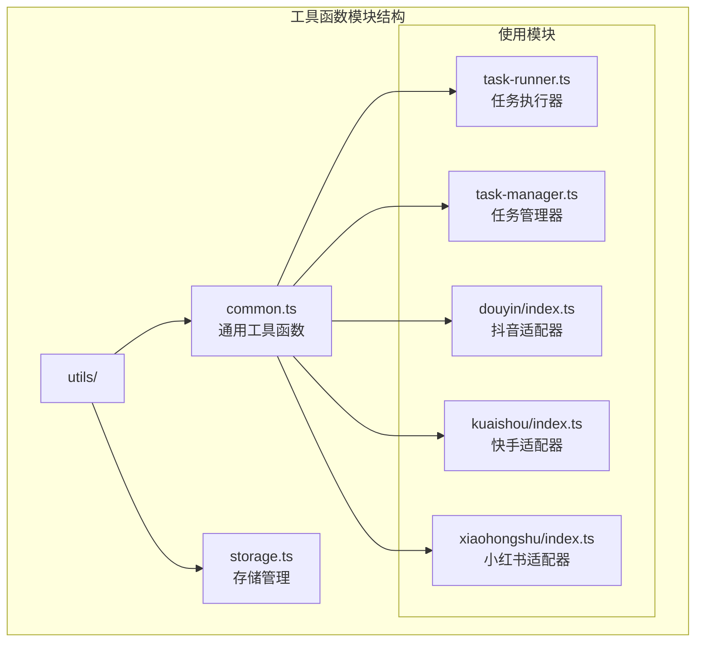
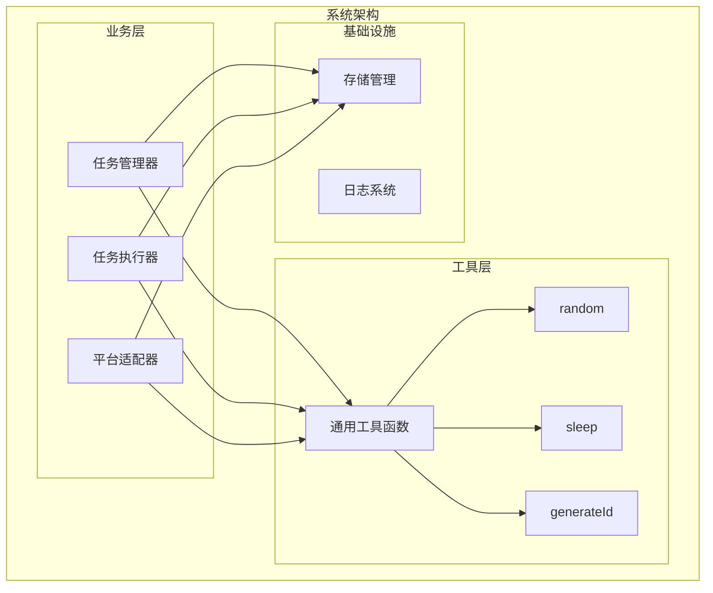
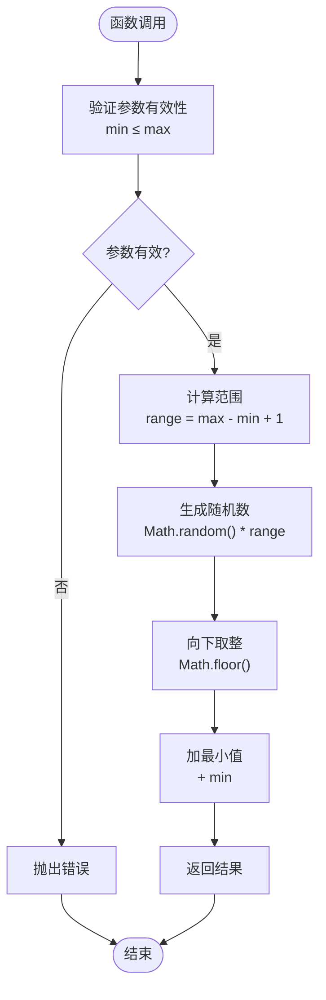
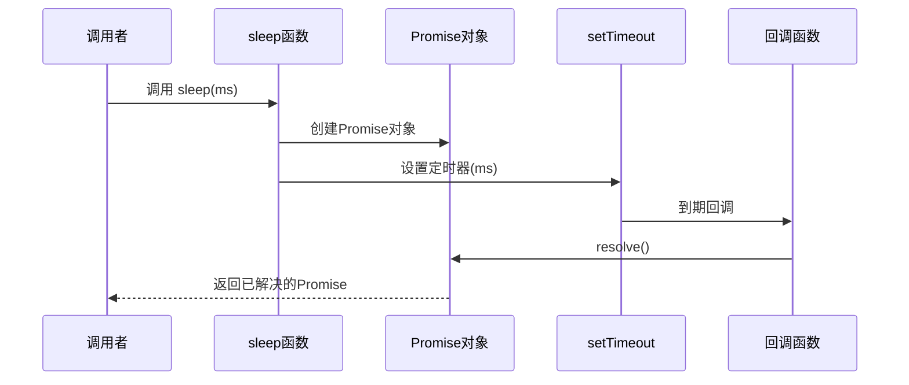
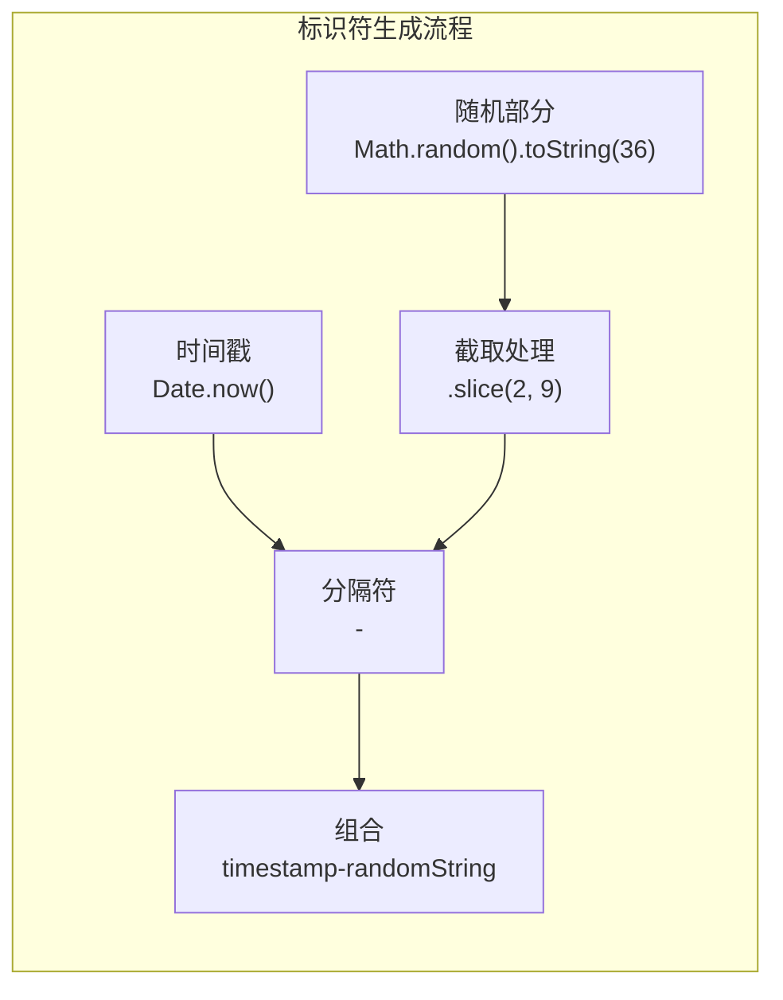
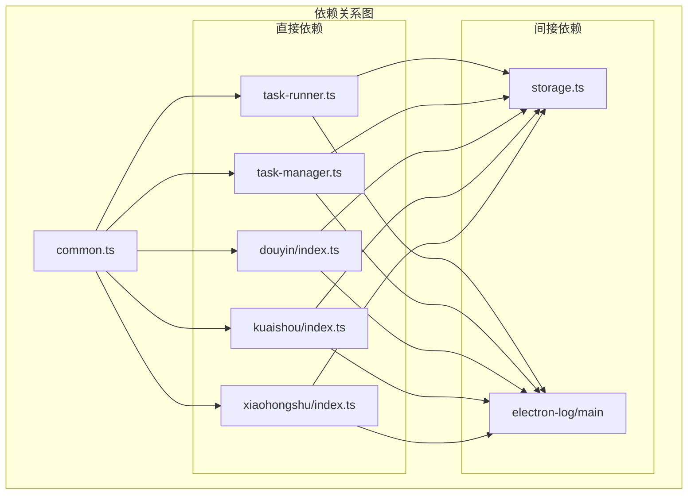

# 通用工具函数

<cite>
**本文档引用的文件**
- [common.ts](file://src/main/utils/common.ts)
- [storage.ts](file://src/main/utils/storage.ts)
- [task-runner.ts](file://src/main/service/task-runner.ts)
- [task-manager.ts](file://src/main/service/task-manager.ts)
- [douyin/index.ts](file://src/main/platform/douyin/index.ts)
- [kuaishou/index.ts](file://src/main/platform/kuaishou/index.ts)
- [xiaohongshu/index.ts](file://src/main/platform/xiaohongshu/index.ts)
- [base.ts](file://src/main/platform/base.ts)
</cite>

## 目录
1. [简介](#简介)
2. [项目结构](#项目结构)
3. [核心组件](#核心组件)
4. [架构概览](#架构概览)
5. [详细组件分析](#详细组件分析)
6. [依赖关系分析](#依赖关系分析)
7. [性能考量](#性能考量)
8. [故障排除指南](#故障排除指南)
9. [结论](#结论)

## 简介

通用工具函数模块是整个自动化操作系统的核心基础设施，提供了三个关键的通用工具函数：`random` 随机数生成、`sleep` 延时处理和 `generateId` 唯一标识符生成。这些工具函数被广泛应用于任务调度、性能优化和数据管理等场景中，为整个系统的稳定运行提供了重要的支撑。

该模块采用简洁而高效的实现方式，确保在复杂的自动化操作环境中能够提供可靠的工具支持。通过精心设计的算法和最佳实践，这些工具函数能够在保证功能完整性的同时，最大化地减少对系统性能的影响。

## 项目结构

通用工具函数模块位于 `src/main/utils/` 目录下，主要包含两个文件：

**图表来源**
- [common.ts:1-11](file://src/main/utils/common.ts#L1-L11)
- [storage.ts:1-46](file://src/main/utils/storage.ts#L1-L46)

**章节来源**
- [common.ts:1-11](file://src/main/utils/common.ts#L1-L11)
- [storage.ts:1-46](file://src/main/utils/storage.ts#L1-L46)

## 核心组件

通用工具函数模块包含三个核心函数，每个都针对特定的使用场景进行了优化：

### random 函数
- **功能**：生成指定范围内的随机整数
- **算法**：基于 `Math.random()` 的线性同余生成器
- **特点**：均匀分布，性能优异
- **应用场景**：操作间隔控制、模拟人类行为

### sleep 函数  
- **功能**：返回 Promise 的延时函数
- **实现**：基于 `setTimeout` 的异步包装
- **特点**：非阻塞式，支持取消
- **应用场景**：操作同步、节流控制

### generateId 函数
- **功能**：生成唯一标识符
- **格式**：`timestamp-randomString` 结构
- **特点**：时间有序，高冲突概率低
- **应用场景**：任务标识、缓存键、日志追踪

**章节来源**
- [common.ts:1-11](file://src/main/utils/common.ts#L1-L11)

## 架构概览

通用工具函数在整个系统中的作用可以概括为：

**图表来源**
- [task-manager.ts:1-10](file://src/main/service/task-manager.ts#L1-L10)
- [task-runner.ts:1-15](file://src/main/service/task-runner.ts#L1-L15)
- [douyin/index.ts:1-15](file://src/main/platform/douyin/index.ts#L1-L15)

## 详细组件分析

### random 函数深度分析

#### 算法原理
`random` 函数实现了标准的离散均匀分布随机数生成：

**图表来源**
- [common.ts:1-3](file://src/main/utils/common.ts#L1-L3)

#### 参数类型与返回值
- **参数**：
  - `min`: number - 最小值（必须小于等于 `max`）
  - `max`: number - 最大值（必须大于等于 `min`）
- **返回值**：number - 在 `[min, max]` 范围内的整数
- **异常**：当 `min > max` 时抛出错误

#### 使用场景与最佳实践

##### 任务调度中的应用
在任务执行器中，`random` 函数用于：
- **操作间隔控制**：`random(1000, 3000)` - 1-3秒随机延迟
- **观看时长模拟**：`random(settings.watchTimeRangeSeconds[0], settings.watchTimeRangeSeconds[1]) * 1000`
- **跟随间隔调整**：`random(1000, 2000)` - 1-2秒随机延迟

##### 平台适配器中的应用
各平台适配器使用 `random` 函数：
- **抖音适配器**：`random(1000, 2000)` - 跟随操作延迟
- **快手适配器**：`random(1000, 2000)` - 评论输入延迟
- **小红书适配器**：`random(500, 1000)` - 点赞操作延迟

**章节来源**
- [common.ts:1-3](file://src/main/utils/common.ts#L1-L3)
- [task-runner.ts:325-328](file://src/main/service/task-runner.ts#L325-L328)
- [douyin/index.ts:293-293](file://src/main/platform/douyin/index.ts#L293-L293)
- [kuaishou/index.ts:157-157](file://src/main/platform/kuaishou/index.ts#L157-L157)
- [xiaohongshu/index.ts:136-136](file://src/main/platform/xiaohongshu/index.ts#L136-L136)

### sleep 函数深度分析

#### 实现机制
`sleep` 函数提供了非阻塞式的异步延时：

**图表来源**
- [common.ts:5-7](file://src/main/utils/common.ts#L5-L7)

#### Promise 实现特性
- **非阻塞**：不会阻塞事件循环
- **可取消**：Promise一旦创建无法直接取消
- **错误处理**：内部错误会被捕获并忽略
- **性能优化**：使用原生 `setTimeout` 实现

#### 异步处理机制

##### 任务暂停与恢复
在任务执行器中，`sleep` 函数用于：
- **暂停检查**：`await sleep(500)` - 500ms检查一次暂停状态
- **视频切换**：`await sleep(videoSwitchWaitMs)` - 等待视频切换完成
- **操作间隔**：`await sleep(random(1000, 3000))` - 随机间隔

##### 平台操作协调
各平台适配器使用 `sleep` 函数进行操作协调：
- **评论操作**：`await sleep(200)` - 点赞后短暂延迟
- **输入延迟**：`await sleep(500)` - 键盘输入延迟
- **响应等待**：`await sleep(random(1000, 3000))` - 操作响应等待

**章节来源**
- [common.ts:5-7](file://src/main/utils/common.ts#L5-L7)
- [task-runner.ts:250-250](file://src/main/service/task-runner.ts#L250-L250)
- [task-runner.ts:262-262](file://src/main/service/task-runner.ts#L262-L262)
- [task-runner.ts:351-351](file://src/main/service/task-runner.ts#L351-L351)
- [douyin/index.ts:267-267](file://src/main/platform/douyin/index.ts#L267-L267)
- [douyin/index.ts:314-314](file://src/main/platform/douyin/index.ts#L314-L314)

### generateId 函数深度分析

#### 标识符生成策略
`generateId` 函数采用了混合标识符生成策略：

**图表来源**
- [common.ts:9-11](file://src/main/utils/common.ts#L9-L11)

#### 格式规范
- **格式**：`{timestamp}-{randomString}`
- **时间戳精度**：毫秒级，确保时间有序性
- **随机字符串长度**：7位字符（从第2位开始截取）
- **字符集**：36进制数字（0-9, a-z）

#### 唯一性保证
- **时间戳保证**：理论上保证全局唯一性
- **随机部分增强**：进一步降低冲突概率
- **冲突概率**：极低，适合高并发场景

#### 应用场景

##### 任务管理中的应用
在任务管理系统中，`generateId` 函数用于：
- **任务标识**：`this.taskId = generateId()` - 生成任务ID
- **队列标识**：`const queueId = generateId()` - 生成队列ID
- **缓存键**：`store.set(generateId(), data)` - 生成缓存键

##### 存储管理中的应用
在存储管理中，`generateId` 函数用于：
- **临时文件名**：`const tempId = generateId()` - 生成临时标识
- **会话标识**：`sessionId = generateId()` - 生成会话ID
- **缓存清理**：`cleanupCache(generateId())` - 清理缓存

**章节来源**
- [common.ts:9-11](file://src/main/utils/common.ts#L9-L11)
- [task-runner.ts:57-57](file://src/main/service/task-runner.ts#L57-L57)
- [task-runner.ts:120-120](file://src/main/service/task-runner.ts#L120-L120)
- [task-manager.ts:193-193](file://src/main/service/task-manager.ts#L193-L193)

## 依赖关系分析

通用工具函数模块与系统其他组件的依赖关系如下：

**图表来源**
- [task-runner.ts:1-15](file://src/main/service/task-runner.ts#L1-L15)
- [task-manager.ts:1-10](file://src/main/service/task-manager.ts#L1-L10)
- [douyin/index.ts:1-15](file://src/main/platform/douyin/index.ts#L1-L15)

### 组件耦合度分析

| 组件 | 耦合度 | 说明 |
|------|--------|------|
| common.ts | 低耦合 | 纯函数，无外部依赖 |
| task-runner.ts | 中等耦合 | 使用 random 和 generateId |
| task-manager.ts | 中等耦合 | 使用 sleep 和 generateId |
| 平台适配器 | 中等耦合 | 使用 random 和 sleep |

**章节来源**
- [common.ts:1-11](file://src/main/utils/common.ts#L1-L11)
- [task-runner.ts:1-15](file://src/main/service/task-runner.ts#L1-L15)
- [task-manager.ts:1-10](file://src/main/service/task-manager.ts#L1-L10)

## 性能考量

### 算法复杂度分析

#### 时间复杂度
- **random 函数**：O(1) - 常数时间复杂度
- **sleep 函数**：O(1) - 常数时间复杂度，但等待期间不消耗CPU
- **generateId 函数**：O(1) - 常数时间复杂度

#### 空间复杂度
- **random 函数**：O(1) - 常数空间复杂度
- **sleep 函数**：O(1) - 常数空间复杂度
- **generateId 函数**：O(1) - 常数空间复杂度

### 性能优化建议

#### 随机数生成优化
1. **批量生成**：在需要大量随机数时，考虑预生成数组
2. **缓存策略**：对于重复使用的范围，考虑缓存结果
3. **避免频繁调用**：在循环中合理安排随机数使用频率

#### 延时处理优化
1. **批量等待**：使用 `Promise.all` 等待多个异步操作
2. **取消机制**：为长时间等待提供取消能力
3. **超时控制**：为关键操作设置超时机制

#### 标识符生成优化
1. **批量生成**：在批量操作中预生成ID数组
2. **去重检查**：在高并发场景下添加去重检查
3. **内存管理**：及时清理不再使用的ID引用

## 故障排除指南

### 常见问题与解决方案

#### random 函数问题
**问题**：`min > max` 导致错误
**解决方案**：确保参数有效性，使用 `Math.min` 和 `Math.max` 进行参数交换

**问题**：浮点数精度问题
**解决方案**：使用 `Math.floor` 确保整数结果

#### sleep 函数问题  
**问题**：Promise 无法取消
**解决方案**：使用超时包装或自定义取消机制

**问题**：大量并发等待导致内存占用
**解决方案**：合理控制并发数量，及时清理不再需要的Promise

#### generateId 函数问题
**问题**：ID 冲突
**解决方案**：添加去重检查，使用更长的随机部分

**问题**：时间戳回退
**解决方案**：添加时间戳验证，处理系统时间调整

### 边界条件处理

#### 参数边界
- **random**：确保 `min ≤ max`，处理负数范围
- **sleep**：处理负数和零值，提供默认值
- **generateId**：处理空字符串和特殊字符

#### 异常处理
- **网络异常**：sleep 函数内部错误应被忽略
- **存储异常**：generateId 函数不应影响主流程
- **计算异常**：random 函数应提供合理的默认值

**章节来源**
- [common.ts:1-11](file://src/main/utils/common.ts#L1-L11)
- [task-runner.ts:266-266](file://src/main/service/task-runner.ts#L266-L266)
- [task-manager.ts:183-185](file://src/main/service/task-manager.ts#L183-L185)

## 结论

通用工具函数模块虽然看似简单，但在整个自动化操作系统中发挥着至关重要的作用。通过精心设计的算法和实现方式，这三个函数为系统的稳定性、性能和可维护性提供了坚实的基础。

### 主要优势
1. **简洁高效**：实现简洁，性能优异
2. **广泛适用**：适用于各种自动化场景
3. **易于扩展**：良好的接口设计便于功能扩展
4. **稳定可靠**：经过实际使用验证的成熟实现

### 发展建议
1. **功能增强**：考虑添加更多实用的工具函数
2. **性能监控**：添加性能指标收集和分析
3. **测试覆盖**：完善单元测试和集成测试
4. **文档完善**：提供更详细的使用示例和最佳实践

通过持续的优化和完善，通用工具函数模块将继续为整个自动化操作系统提供强有力的技术支撑。