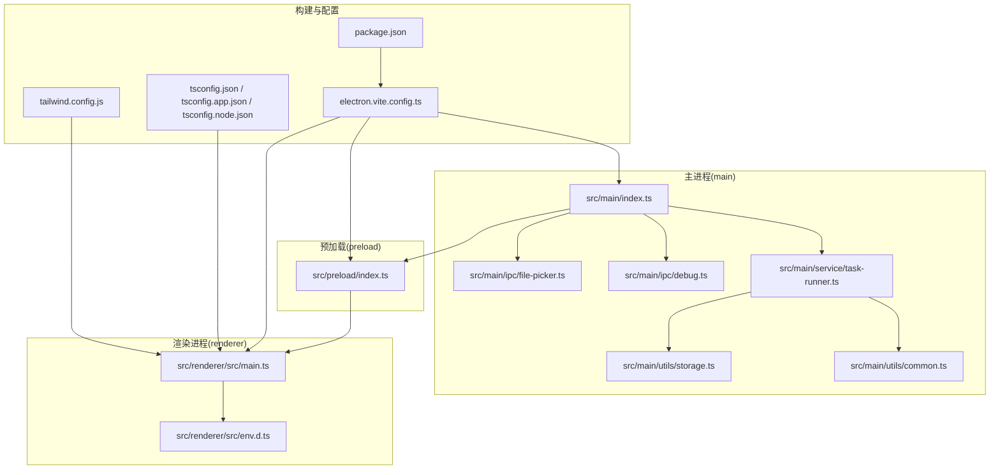
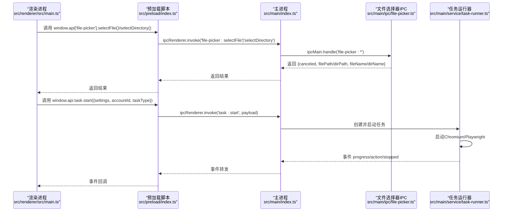
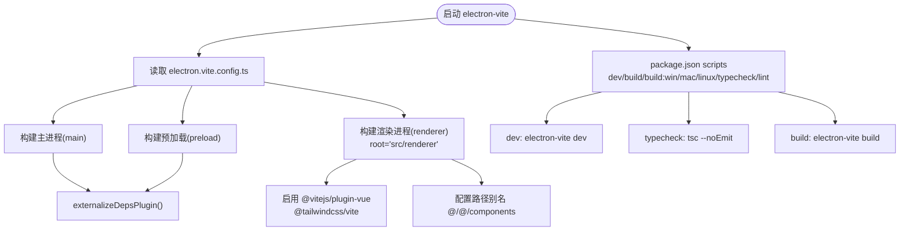
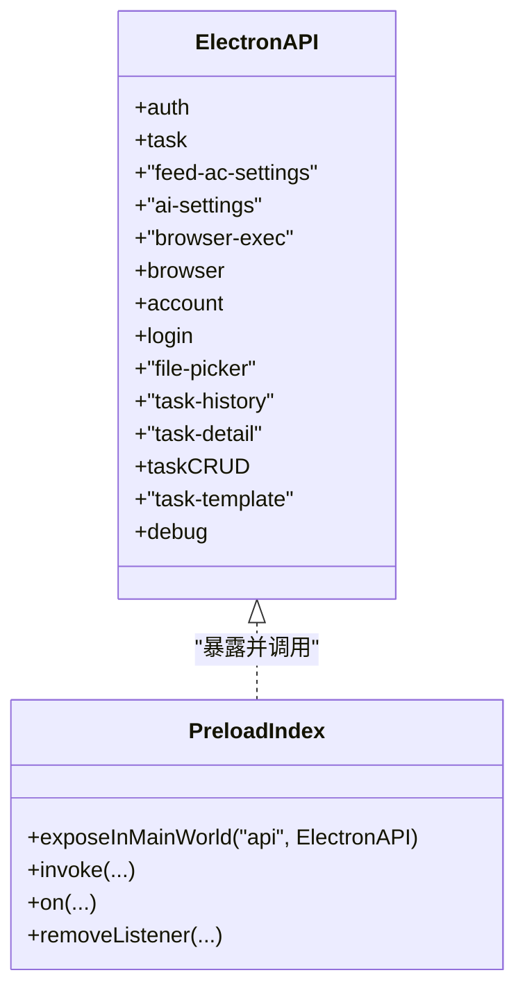
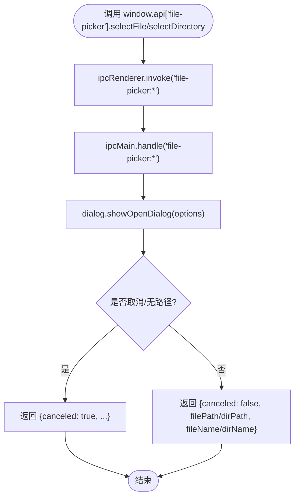
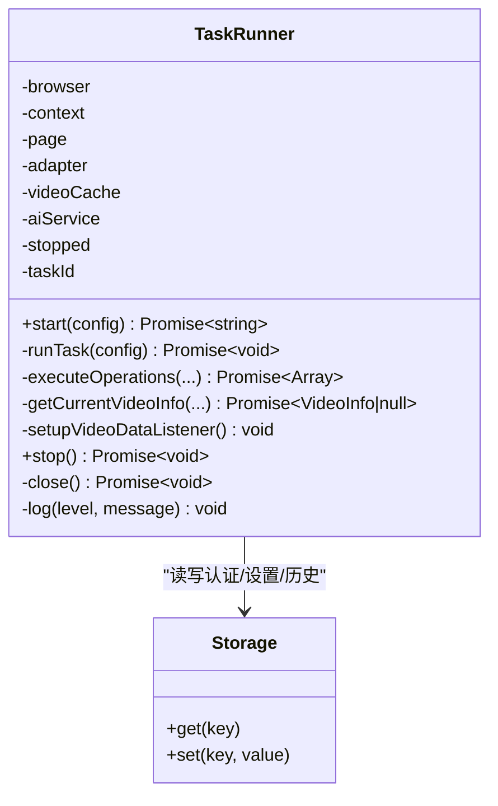
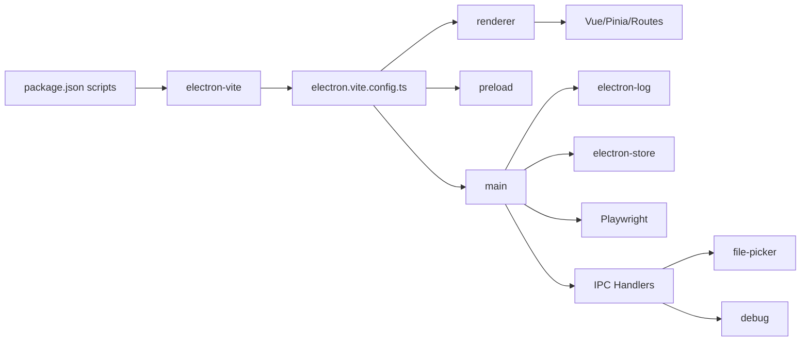

# 开发和调试

<cite>
**本文引用的文件**
- [electron.vite.config.ts](file://electron.vite.config.ts)
- [package.json](file://package.json)
- [tsconfig.json](file://tsconfig.json)
- [tsconfig.app.json](file://tsconfig.app.json)
- [tsconfig.node.json](file://tsconfig.node.json)
- [src/main/index.ts](file://src/main/index.ts)
- [src/preload/index.ts](file://src/preload/index.ts)
- [src/renderer/src/main.ts](file://src/renderer/src/main.ts)
- [src/renderer/src/env.d.ts](file://src/renderer/src/env.d.ts)
- [src/main/ipc/file-picker.ts](file://src/main/ipc/file-picker.ts)
- [src/main/ipc/debug.ts](file://src/main/ipc/debug.ts)
- [src/main/service/task-runner.ts](file://src/main/service/task-runner.ts)
- [src/main/utils/storage.ts](file://src/main/utils/storage.ts)
- [src/main/utils/common.ts](file://src/main/utils/common.ts)
- [tailwind.config.js](file://tailwind.config.js)
- [README.md](file://README.md)
</cite>

## 目录
1. [简介](#简介)
2. [项目结构](#项目结构)
3. [核心组件](#核心组件)
4. [架构总览](#架构总览)
5. [详细组件分析](#详细组件分析)
6. [依赖关系分析](#依赖关系分析)
7. [性能考虑](#性能考虑)
8. [故障排查指南](#故障排查指南)
9. [结论](#结论)
10. [附录](#附录)

## 简介
本指南面向AutoOps的开发与调试，覆盖开发环境搭建、热重载与调试工具使用、Electron-Vite构建系统配置、TypeScript编译设置、开发服务器运行机制、调试技巧与日志系统、错误追踪方法、开发工作流程最佳实践、代码规范与质量保证、文件选择器实现原理与跨平台兼容性、性能分析与内存泄漏检测、以及生产环境优化建议。读者可据此快速上手并稳定迭代。

## 项目结构
AutoOps采用Electron + Vue 3 + Vite + electron-vite的分层架构：主进程负责窗口管理、IPC注册、浏览器控制与业务调度；预加载脚本通过contextBridge暴露受控API；渲染进程为Vue应用，使用Pinia状态管理与路由；共享目录存放跨进程类型定义；构建配置分别针对主进程、预加载与渲染进程进行独立优化。

**图表来源**
- [electron.vite.config.ts:1-34](file://electron.vite.config.ts#L1-L34)
- [package.json:1-85](file://package.json#L1-L85)
- [tsconfig.json:1-18](file://tsconfig.json#L1-L18)
- [tsconfig.app.json:1-18](file://tsconfig.app.json#L1-L18)
- [tsconfig.node.json:1-16](file://tsconfig.node.json#L1-L16)
- [src/main/index.ts:1-106](file://src/main/index.ts#L1-L106)
- [src/preload/index.ts:1-187](file://src/preload/index.ts#L1-L187)
- [src/renderer/src/main.ts:1-12](file://src/renderer/src/main.ts#L1-L12)
- [src/renderer/src/env.d.ts:1-11](file://src/renderer/src/env.d.ts#L1-L11)
- [src/main/ipc/file-picker.ts:1-37](file://src/main/ipc/file-picker.ts#L1-L37)
- [src/main/ipc/debug.ts:1-12](file://src/main/ipc/debug.ts#L1-L12)
- [src/main/service/task-runner.ts:1-608](file://src/main/service/task-runner.ts#L1-L608)
- [src/main/utils/storage.ts:1-46](file://src/main/utils/storage.ts#L1-L46)
- [src/main/utils/common.ts:1-11](file://src/main/utils/common.ts#L1-L11)
- [tailwind.config.js:1-57](file://tailwind.config.js#L1-L57)

**章节来源**
- [README.md:1-54](file://README.md#L1-L54)
- [electron.vite.config.ts:1-34](file://electron.vite.config.ts#L1-L34)
- [package.json:1-85](file://package.json#L1-L85)

## 核心组件
- 主进程入口与窗口生命周期：负责创建BrowserWindow、注册所有IPC处理器、开发环境URL注入、窗口快捷键监听与应用退出策略。
- 预加载脚本与API桥接：通过contextBridge暴露受控API接口给渲染进程，统一封装IPC调用与事件订阅。
- 渲染进程：基于Vue 3 + Pinia + 路由，挂载应用并引入Tailwind样式。
- 文件选择器IPC：封装Electron dialog的文件/目录选择能力，返回标准化结果。
- 调试IPC：提供平台、架构、版本等环境信息查询。
- 任务运行器：基于Playwright驱动浏览器，按规则执行自动化任务，支持AI评论、视频缓存、事件进度与动作上报。
- 存储工具：基于electron-store的键值存储，集中管理认证、设置、任务历史等数据。
- 工具函数：通用随机数、睡眠、ID生成等辅助方法。

**章节来源**
- [src/main/index.ts:1-106](file://src/main/index.ts#L1-L106)
- [src/preload/index.ts:1-187](file://src/preload/index.ts#L1-L187)
- [src/renderer/src/main.ts:1-12](file://src/renderer/src/main.ts#L1-L12)
- [src/main/ipc/file-picker.ts:1-37](file://src/main/ipc/file-picker.ts#L1-L37)
- [src/main/ipc/debug.ts:1-12](file://src/main/ipc/debug.ts#L1-L12)
- [src/main/service/task-runner.ts:1-608](file://src/main/service/task-runner.ts#L1-L608)
- [src/main/utils/storage.ts:1-46](file://src/main/utils/storage.ts#L1-L46)
- [src/main/utils/common.ts:1-11](file://src/main/utils/common.ts#L1-L11)

## 架构总览
下图展示从渲染进程发起调用到主进程处理、再到Playwright浏览器自动化执行的关键路径，以及日志与存储的交互。

**图表来源**
- [src/renderer/src/main.ts:1-12](file://src/renderer/src/main.ts#L1-L12)
- [src/preload/index.ts:1-187](file://src/preload/index.ts#L1-L187)
- [src/main/index.ts:1-106](file://src/main/index.ts#L1-L106)
- [src/main/ipc/file-picker.ts:1-37](file://src/main/ipc/file-picker.ts#L1-L37)
- [src/main/service/task-runner.ts:1-608](file://src/main/service/task-runner.ts#L1-L608)

## 详细组件分析

### Electron-Vite构建系统与开发服务器
- 主进程与预加载：使用externalizeDepsPlugin减少打包体积，主进程别名@指向src根目录。
- 渲染进程：root为src/renderer，Rollup输入为index.html，别名@/components指向组件目录，启用Vue与Tailwind插件。
- 别名与路径映射：全局tsconfig.json与各子配置共同定义@/*与@/components/*路径别名，确保IDE与编译一致。
- 开发脚本：dev命令启动electron-vite开发服务器；build在类型检查之后执行；平台化构建通过--win/--mac/--linux参数触发。

**图表来源**
- [electron.vite.config.ts:1-34](file://electron.vite.config.ts#L1-L34)
- [tsconfig.json:1-18](file://tsconfig.json#L1-L18)
- [tsconfig.app.json:1-18](file://tsconfig.app.json#L1-L18)
- [tsconfig.node.json:1-16](file://tsconfig.node.json#L1-L16)
- [package.json:1-85](file://package.json#L1-L85)

**章节来源**
- [electron.vite.config.ts:1-34](file://electron.vite.config.ts#L1-L34)
- [tsconfig.json:1-18](file://tsconfig.json#L1-L18)
- [tsconfig.app.json:1-18](file://tsconfig.app.json#L1-L18)
- [tsconfig.node.json:1-16](file://tsconfig.node.json#L1-L16)
- [package.json:1-85](file://package.json#L1-L85)

### 预加载脚本与API桥接
- 接口设计：以命名空间形式组织API，如auth、task、account、file-picker、task-history、task-detail、taskCRUD、task-template、debug等。
- 调用方式：渲染进程通过window.api.<namespace>.<method>()发起invoke调用，预加载脚本统一转发至ipcRenderer。
- 事件订阅：task.onProgress与task.onAction提供事件监听与移除，避免内存泄漏。
- 类型安全：env.d.ts声明window.api类型，确保IDE提示与编译期校验。

**图表来源**
- [src/preload/index.ts:1-187](file://src/preload/index.ts#L1-L187)
- [src/renderer/src/env.d.ts:1-11](file://src/renderer/src/env.d.ts#L1-L11)

**章节来源**
- [src/preload/index.ts:1-187](file://src/preload/index.ts#L1-L187)
- [src/renderer/src/env.d.ts:1-11](file://src/renderer/src/env.d.ts#L1-L11)

### 文件选择器实现与跨平台兼容
- 功能：封装dialog.showOpenDialog，支持文件与目录选择，返回标准化结构（canceled、filePath/dirPath、fileName/dirName）。
- 兼容性：使用Electron dialog的原生能力，自动适配不同平台UI风格；filters参数透传，便于扩展。
- 错误处理：当用户取消或未选择路径时，返回canceled=true，调用方需做空值检查。

**图表来源**
- [src/main/ipc/file-picker.ts:1-37](file://src/main/ipc/file-picker.ts#L1-L37)
- [src/preload/index.ts:151-154](file://src/preload/index.ts#L151-L154)

**章节来源**
- [src/main/ipc/file-picker.ts:1-37](file://src/main/ipc/file-picker.ts#L1-L37)
- [src/preload/index.ts:151-154](file://src/preload/index.ts#L151-L154)

### 调试工具与环境信息
- 提供debug:getEnv接口，返回platform、arch、versions、electron等信息，便于诊断运行环境差异。
- 主进程在开发模式下可通过ELECTRON_RENDERER_URL注入开发服务器地址，实现热重载。

**章节来源**
- [src/main/ipc/debug.ts:1-12](file://src/main/ipc/debug.ts#L1-L12)
- [src/main/index.ts:47-51](file://src/main/index.ts#L47-L51)

### 任务运行器与Playwright自动化
- 生命周期：启动时生成任务ID、拉起Chromium、注入storageState、建立页面与适配器、监听feed响应填充视频缓存。
- 规则匹配：支持手动规则（关键词字段匹配）与AI规则（基于配置的提示词），支持父子规则组组合。
- 操作执行：按概率与上限执行like/collect/follow/comment等操作，支持组合任务与首次成功即停。
- 进度与动作：通过EventEmitter发布progress/action事件，供UI与日志同步。
- 资源清理：关闭页面与浏览器前持久化storageState，避免重复登录。

**图表来源**
- [src/main/service/task-runner.ts:1-608](file://src/main/service/task-runner.ts#L1-L608)
- [src/main/utils/storage.ts:1-46](file://src/main/utils/storage.ts#L1-L46)

**章节来源**
- [src/main/service/task-runner.ts:1-608](file://src/main/service/task-runner.ts#L1-L608)
- [src/main/utils/storage.ts:1-46](file://src/main/utils/storage.ts#L1-L46)

### 日志系统与错误追踪
- 主进程日志：electron-log初始化后，主进程与任务运行器均使用log输出info/warn/error等级别，并在渲染侧通过ipc转发统一记录。
- 渲染侧日志：主进程监听'log'事件，按级别写入日志文件，便于问题定位。
- 建议：在关键路径增加日志埋点（开始/结束、异常分支、网络请求状态），结合任务ID与视频ID进行关联。

**章节来源**
- [src/main/index.ts:17-106](file://src/main/index.ts#L17-L106)
- [src/main/service/task-runner.ts:594-606](file://src/main/service/task-runner.ts#L594-L606)

### 开发工作流程与最佳实践
- 环境准备：安装依赖后使用npm run dev进入开发模式；必要时设置ELECTRON_RENDERER_URL指向本地Vite地址。
- 热重载：electron-vite dev提供主进程与渲染进程的热更新；修改主进程代码会触发重启，渲染进程热替换。
- 类型检查：先执行npm run typecheck再build，确保类型安全。
- 代码规范：遵循TypeScript与ESLint配置；组件与模块职责清晰，避免跨层耦合。
- 质量保证：利用单元测试与端到端测试框架（如Playwright）验证自动化流程；对关键分支添加断言与日志。

**章节来源**
- [package.json:6-14](file://package.json#L6-L14)
- [README.md:23-34](file://README.md#L23-L34)

## 依赖关系分析
- 构建链路：electron.vite.config.ts定义三段式构建；package.json scripts串联开发与构建；tsconfig系列配置确保路径别名与复合项目正确解析。
- 运行链路：主进程注册所有IPC处理器；预加载脚本暴露API；渲染进程通过API与主进程通信；任务运行器通过Playwright驱动浏览器。
- 外部依赖：electron-log用于日志；electron-store用于本地存储；Tailwind用于样式；Vue生态与Pinia用于状态管理。

**图表来源**
- [package.json:1-85](file://package.json#L1-L85)
- [electron.vite.config.ts:1-34](file://electron.vite.config.ts#L1-L34)

**章节来源**
- [package.json:1-85](file://package.json#L1-L85)
- [electron.vite.config.ts:1-34](file://electron.vite.config.ts#L1-L34)

## 性能考虑
- 浏览器实例与上下文：任务结束后及时关闭页面与浏览器，持久化storageState减少重复登录成本。
- 视频数据缓存：通过响应拦截收集feed数据，降低二次抓取开销；注意缓存容量与过期策略。
- 随机化与节流：合理设置等待时间与操作概率，避免触发风控；对高频操作加入退避与限速。
- 打包优化：externalizeDepsPlugin减少主进程打包体积；按需加载组件与路由；Tailwind按需扫描提升构建速度。
- 内存监控：定期检查TaskRunner中的videoCache大小与事件监听器数量，避免泄漏。

[本节为通用指导，无需列出具体文件来源]

## 故障排查指南
- 开发无法热重载：确认ELECTRON_RENDERER_URL是否正确指向Vite地址；检查electron.vite.config.ts的renderer.root与入口HTML路径。
- 文件选择器无响应：检查对话框filters参数与properties配置；确认主进程已注册file-picker处理器。
- 任务无法启动：查看主进程日志与TaskRunner启动阶段日志；核对browserExecPath与storageState；检查平台适配器初始化。
- 日志缺失：确认主进程log初始化与渲染侧ipc日志转发；检查日志级别与过滤条件。
- 存储异常：核对electron-store默认值与键名一致性；避免在任务运行期间并发写入同一键。

**章节来源**
- [src/main/index.ts:17-106](file://src/main/index.ts#L17-L106)
- [src/main/ipc/file-picker.ts:1-37](file://src/main/ipc/file-picker.ts#L1-L37)
- [src/main/service/task-runner.ts:1-608](file://src/main/service/task-runner.ts#L1-L608)
- [src/main/utils/storage.ts:1-46](file://src/main/utils/storage.ts#L1-L46)

## 结论
通过electron-vite的三段式构建、严格的TypeScript配置与清晰的模块划分，AutoOps实现了稳定的开发与调试体验。配合预加载API桥接、任务运行器与日志系统，开发者可以高效地迭代功能、定位问题并优化性能。建议在持续集成中加入类型检查与构建校验，确保交付质量。

[本节为总结性内容，无需列出具体文件来源]

## 附录
- 快速命令
  - 安装依赖：npm install
  - 开发模式：npm run dev
  - 类型检查：npm run typecheck
  - 构建：npm run build
  - 平台构建：npm run build:win / build:mac / build:linux
- 关键配置
  - electron.vite.config.ts：主/预加载/渲染进程别名与插件
  - tsconfig*.json：路径别名与复合项目配置
  - tailwind.config.js：暗色模式与内容扫描范围
  - package.json：脚本与构建目标

**章节来源**
- [package.json:1-85](file://package.json#L1-L85)
- [electron.vite.config.ts:1-34](file://electron.vite.config.ts#L1-L34)
- [tsconfig.json:1-18](file://tsconfig.json#L1-L18)
- [tailwind.config.js:1-57](file://tailwind.config.js#L1-L57)