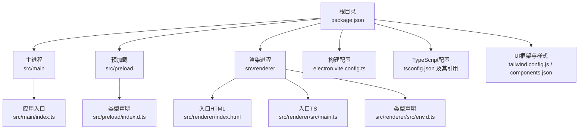
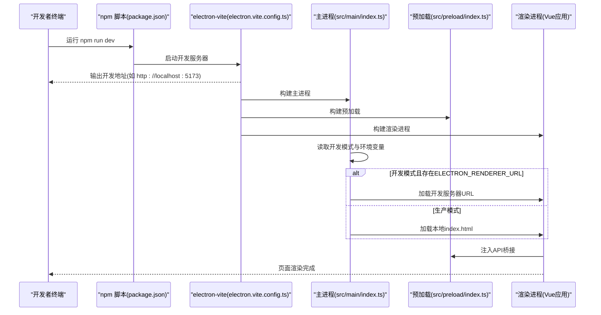
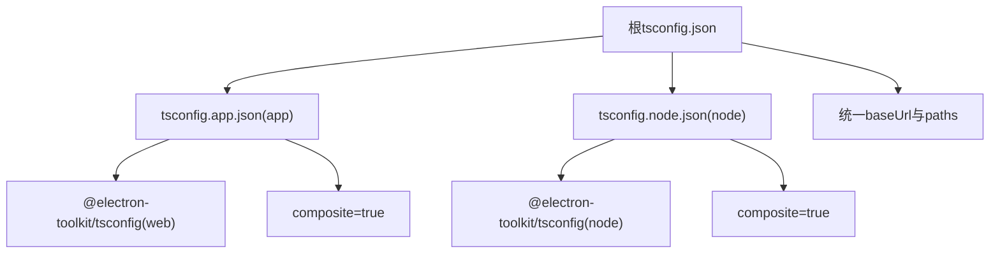
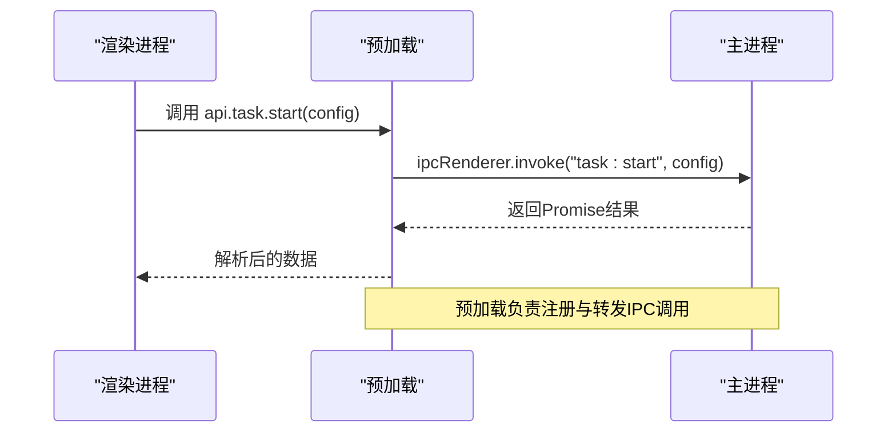
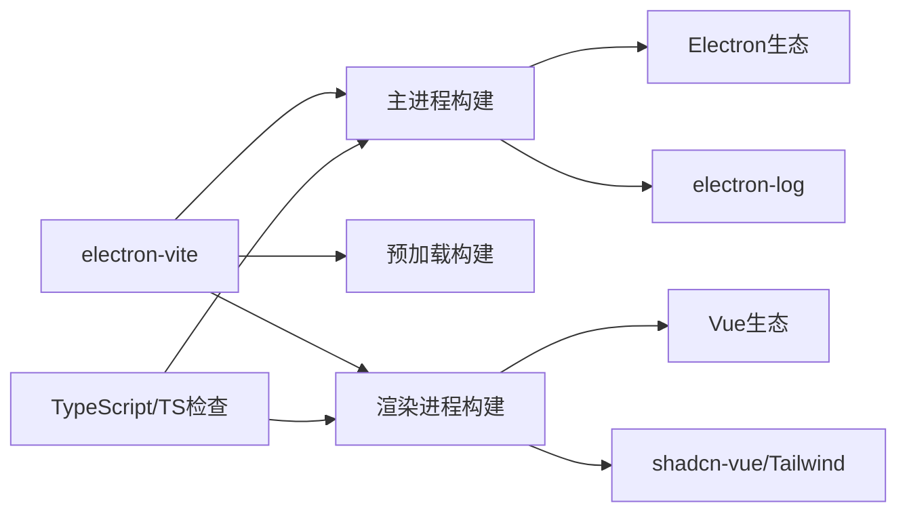

# 开发环境配置

<cite>
**本文引用的文件**
- [package.json](file://package.json)
- [electron.vite.config.ts](file://electron.vite.config.ts)
- [tsconfig.json](file://tsconfig.json)
- [tsconfig.app.json](file://tsconfig.app.json)
- [tsconfig.node.json](file://tsconfig.node.json)
- [src/main/index.ts](file://src/main/index.ts)
- [src/preload/index.ts](file://src/preload/index.ts)
- [src/preload/index.d.ts](file://src/preload/index.d.ts)
- [src/renderer/src/env.d.ts](file://src/renderer/src/env.d.ts)
- [src/renderer/src/main.ts](file://src/renderer/src/main.ts)
- [src/renderer/index.html](file://src/renderer/index.html)
- [tailwind.config.js](file://tailwind.config.js)
- [.npmrc](file://.npmrc)
- [components.json](file://components.json)
</cite>

## 目录
1. [简介](#简介)
2. [项目结构](#项目结构)
3. [核心组件](#核心组件)
4. [架构总览](#架构总览)
5. [详细组件分析](#详细组件分析)
6. [依赖关系分析](#依赖关系分析)
7. [性能考虑](#性能考虑)
8. [故障排除指南](#故障排除指南)
9. [结论](#结论)
10. [附录](#附录)

## 简介
本指南面向AutoOps项目的开发者，系统讲解开发环境的搭建与配置，涵盖以下主题：
- Electron-Vite构建系统的配置项与运行机制
- TypeScript编译配置（tsconfig）在app与node环境下的差异与作用
- package.json脚本命令、依赖管理与版本控制策略
- 开发环境安装步骤、环境变量与IDE建议
- 热重载、开发服务器启动与调试端口设置
- 预加载桥接、渲染进程类型声明与Tailwind集成

## 项目结构
AutoOps采用Electron-Vite多包（multi-package）工作区风格，将主进程、预加载与渲染进程分别置于独立的编译上下文中，通过共享的tsconfig引用实现统一的路径映射与复合编译。

图表来源
- [electron.vite.config.ts:1-34](file://electron.vite.config.ts#L1-L34)
- [tsconfig.json:1-18](file://tsconfig.json#L1-L18)
- [tsconfig.app.json:1-18](file://tsconfig.app.json#L1-L18)
- [tsconfig.node.json:1-16](file://tsconfig.node.json#L1-L16)
- [src/main/index.ts:1-106](file://src/main/index.ts#L1-L106)
- [src/preload/index.ts:1-187](file://src/preload/index.ts#L1-L187)
- [src/preload/index.d.ts:1-7](file://src/preload/index.d.ts#L1-L7)
- [src/renderer/src/env.d.ts:1-11](file://src/renderer/src/env.d.ts#L1-L11)
- [src/renderer/src/main.ts:1-12](file://src/renderer/src/main.ts#L1-L12)
- [src/renderer/index.html:1-12](file://src/renderer/index.html#L1-L12)

章节来源
- [electron.vite.config.ts:1-34](file://electron.vite.config.ts#L1-L34)
- [tsconfig.json:1-18](file://tsconfig.json#L1-L18)
- [tsconfig.app.json:1-18](file://tsconfig.app.json#L1-L18)
- [tsconfig.node.json:1-16](file://tsconfig.node.json#L1-L16)

## 核心组件
- 构建系统：基于electron-vite，分别配置主进程、预加载与渲染进程的别名、插件与输入输出。
- 类型系统：通过根tsconfig引用两个子配置，分别覆盖app（web）与node（主进程/预加载）编译范围与路径映射。
- 渲染进程：Vue 3 + Pinia + Vue Router，入口为index.html与main.ts。
- 预加载层：通过contextBridge暴露受控API到渲染进程，使用类型声明确保安全调用。
- 样式系统：Tailwind 4与动画插件，配合shadcn-vue组件库配置。

章节来源
- [electron.vite.config.ts:1-34](file://electron.vite.config.ts#L1-L34)
- [tsconfig.app.json:1-18](file://tsconfig.app.json#L1-L18)
- [tsconfig.node.json:1-16](file://tsconfig.node.json#L1-L16)
- [src/renderer/src/main.ts:1-12](file://src/renderer/src/main.ts#L1-L12)
- [src/renderer/index.html:1-12](file://src/renderer/index.html#L1-L12)
- [src/preload/index.ts:1-187](file://src/preload/index.ts#L1-L187)
- [tailwind.config.js:1-57](file://tailwind.config.js#L1-L57)
- [components.json:1-19](file://components.json#L1-L19)

## 架构总览
下图展示开发时从命令到页面呈现的关键流程：npm脚本触发electron-vite，Vite分别构建主进程、预加载与渲染进程，主进程根据是否开发模式加载开发服务器或本地HTML；渲染进程通过预加载桥接调用主进程能力。

图表来源
- [package.json:6-14](file://package.json#L6-L14)
- [electron.vite.config.ts:6-33](file://electron.vite.config.ts#L6-L33)
- [src/main/index.ts:47-51](file://src/main/index.ts#L47-L51)
- [src/preload/index.ts:187](file://src/preload/index.ts#L187)
- [src/renderer/index.html:10](file://src/renderer/index.html#L10)

## 详细组件分析

### Electron-Vite配置详解
- 主进程(main)
  - 别名@指向src根目录，便于跨模块导入
  - 使用externalizeDepsPlugin避免打包node_modules依赖，提升开发速度
- 预加载(preload)
  - 同样使用externalizeDepsPlugin，保持与主进程一致的开发体验
- 渲染进程(renderer)
  - root指向src/renderer，构建入口为src/renderer/index.html
  - 别名@、@renderer、@/components分别映射到渲染源码不同层级
  - 插件集成了@vitejs/plugin-vue与@tailwindcss/vite，支持Vue单文件组件与Tailwind按需扫描

章节来源
- [electron.vite.config.ts:6-33](file://electron.vite.config.ts#L6-L33)

### TypeScript编译配置（tsconfig）
- 根tsconfig.json
  - 通过references引入app与node两个子配置，形成复合编译
  - 统一baseUrl与路径映射，保证主进程与渲染进程共享的@别名可用
- tsconfig.app.json（app/web环境）
  - 继承@electron-toolkit/tsconfig的web配置
  - include渲染源码、共享模块与预加载类型声明
  - 设置composite启用增量编译，baseUrl与paths映射渲染侧别名
- tsconfig.node.json（node环境）
  - 继承@electron-toolkit/tsconfig的node配置
  - include主进程、预加载与共享模块
  - 设置composite，baseUrl与paths映射主进程侧别名

图表来源
- [tsconfig.json:1-18](file://tsconfig.json#L1-L18)
- [tsconfig.app.json:1-18](file://tsconfig.app.json#L1-L18)
- [tsconfig.node.json:1-16](file://tsconfig.node.json#L1-L16)

章节来源
- [tsconfig.json:1-18](file://tsconfig.json#L1-L18)
- [tsconfig.app.json:1-18](file://tsconfig.app.json#L1-L18)
- [tsconfig.node.json:1-16](file://tsconfig.node.json#L1-L16)

### 渲染进程入口与类型声明
- 入口HTML与TS
  - index.html定义挂载点与入口脚本
  - main.ts创建Vue应用、注册Pinia与路由后挂载
- 类型声明
  - src/renderer/src/env.d.ts声明Vite环境类型与全局Window.api接口
  - src/preload/index.d.ts声明全局Window.api类型，确保预加载桥接类型安全

章节来源
- [src/renderer/index.html:1-12](file://src/renderer/index.html#L1-L12)
- [src/renderer/src/main.ts:1-12](file://src/renderer/src/main.ts#L1-L12)
- [src/renderer/src/env.d.ts:1-11](file://src/renderer/src/env.d.ts#L1-L11)
- [src/preload/index.d.ts:1-7](file://src/preload/index.d.ts#L1-L7)

### 预加载桥接与IPC
- 预加载导出API对象，封装ipcRenderer.invoke与on事件监听
- 主进程在应用准备阶段注册大量IPC处理函数，预加载通过invoke调用，实现安全的渲染-主进程通信
- 日志通过ipcMain转发到electron-log，便于统一记录

图表来源
- [src/preload/index.ts:95-187](file://src/preload/index.ts#L95-L187)
- [src/main/index.ts:4-17](file://src/main/index.ts#L4-L17)

章节来源
- [src/preload/index.ts:1-187](file://src/preload/index.ts#L1-L187)
- [src/main/index.ts:1-106](file://src/main/index.ts#L1-L106)

### Tailwind与组件库配置
- Tailwind 4配置content扫描渲染侧模板与组件，darkMode使用类名切换
- 动画插件与shadcn-vue组件库配置，统一组件别名与样式入口

章节来源
- [tailwind.config.js:1-57](file://tailwind.config.js#L1-L57)
- [components.json:1-19](file://components.json#L1-L19)

## 依赖关系分析
- 构建与开发
  - electron-vite作为统一入口，协调主/预加载/渲染三套构建
  - Vite插件链路：@vitejs/plugin-vue、@tailwindcss/vite
- 运行时
  - 主进程依赖electron、electron-log、@electron-toolkit/utils等
  - 渲染进程依赖vue、vue-router、pinia、reka-ui、lucide-vue-next等
- 类型与检查
  - TypeScript与vue-tsc用于类型检查与模板类型生成
  - ESLint用于代码规范（脚本中已定义）

图表来源
- [electron.vite.config.ts:1-34](file://electron.vite.config.ts#L1-L34)
- [package.json:16-49](file://package.json#L16-L49)

章节来源
- [package.json:16-49](file://package.json#L16-L49)
- [electron.vite.config.ts:1-34](file://electron.vite.config.ts#L1-L34)

## 性能考虑
- 复合编译（composite=true）可加速增量构建，建议在大型项目中保持开启
- externalizeDepsPlugin减少打包体积与二次编译时间，适合开发期
- 预加载与主进程分离，避免在渲染进程直接使用Node能力，降低复杂度与安全风险
- Tailwind按需扫描content，避免全量CSS导致的构建开销

## 故障排除指南
- 开发服务器无法访问
  - 检查是否正确执行npm run dev，确认终端输出的开发地址
  - 若主进程以开发模式运行，需确保ELECTRON_RENDERER_URL环境变量指向正确的开发服务器地址
- 预加载API类型报错
  - 确认src/preload/index.d.ts与src/renderer/src/env.d.ts中的Window.api声明一致
  - 确保预加载桥接已通过contextBridge.exposeInMainWorld注入
- Tailwind样式未生效
  - 检查tailwind.config.js的content路径是否包含当前使用的组件文件
  - 确认components.json中的aliases与实际导入路径一致
- Electron下载缓慢
  - 使用国内镜像源与Electron镜像，已在.npmrc中配置

章节来源
- [src/main/index.ts:47-51](file://src/main/index.ts#L47-L51)
- [src/preload/index.d.ts:1-7](file://src/preload/index.d.ts#L1-L7)
- [src/renderer/src/env.d.ts:1-11](file://src/renderer/src/env.d.ts#L1-L11)
- [tailwind.config.js:1-57](file://tailwind.config.js#L1-L57)
- [components.json:1-19](file://components.json#L1-L19)
- [.npmrc:1-3](file://.npmrc#L1-L3)

## 结论
本指南梳理了AutoOps的开发环境配置要点：以electron-vite为核心，结合分层的tsconfig与严格的类型声明，确保主进程、预加载与渲染进程的清晰边界与高效开发体验。配合Tailwind与shadcn-vue，项目具备良好的前端工程化基础。建议在团队内统一IDE设置与ESLint规则，以维持一致的开发质量。

## 附录

### 安装与初始化步骤
- 安装依赖
  - 使用npm ci或npm install安装依赖（已内置postinstall钩子）
- 启动开发
  - 执行npm run dev启动开发服务器
  - 如需指定开发服务器地址，请设置ELECTRON_RENDERER_URL环境变量
- 构建产物
  - 执行npm run build进行类型检查与构建
  - 支持多平台构建：npm run build:win / build:mac / build:linux

章节来源
- [package.json:6-14](file://package.json#L6-L14)
- [src/main/index.ts:47-51](file://src/main/index.ts#L47-L51)

### 环境变量与IDE建议
- 环境变量
  - ELECTRON_RENDERER_URL：开发模式下指定渲染进程开发服务器地址
- IDE建议
  - VS Code：启用TypeScript自动导入、ESLint与Prettier扩展
  - 推荐启用“在工作区中打开”以获得最佳路径别名解析体验

### 热重载与调试端口
- 热重载
  - electron-vite默认启用Vite的热重载，修改源码后浏览器自动刷新
- 调试端口
  - 主进程调试：使用VS Code附加Electron主进程进程
  - 渲染进程调试：在浏览器开发者工具中调试
  - 预加载调试：同渲染进程，注意API调用路径