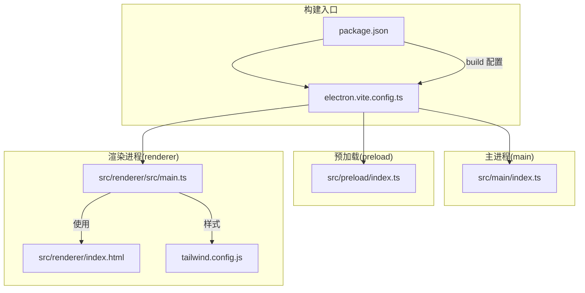
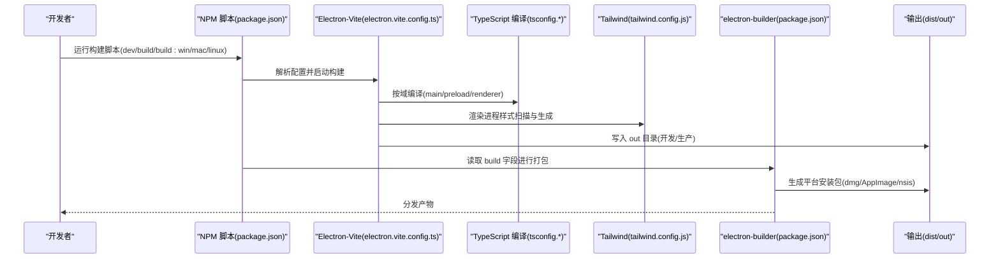
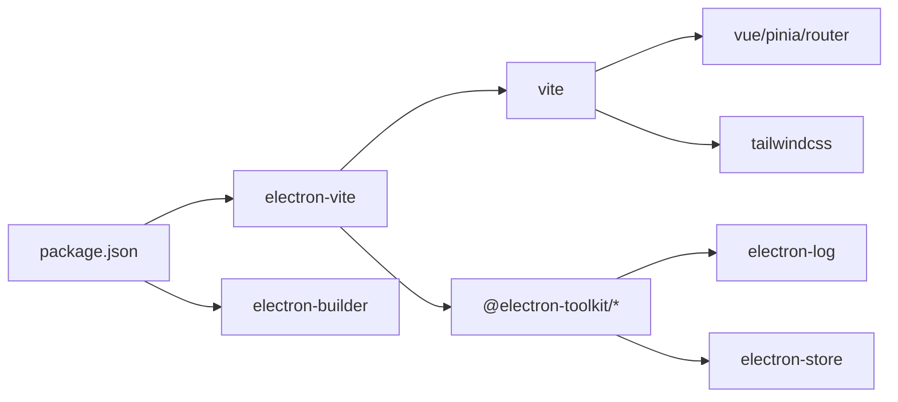

# 构建和打包

<cite>
**本文引用的文件**
- [electron.vite.config.ts](file://electron.vite.config.ts)
- [package.json](file://package.json)
- [tailwind.config.js](file://tailwind.config.js)
- [tsconfig.json](file://tsconfig.json)
- [tsconfig.app.json](file://tsconfig.app.json)
- [tsconfig.node.json](file://tsconfig.node.json)
- [src/main/index.ts](file://src/main/index.ts)
- [src/preload/index.ts](file://src/preload/index.ts)
- [src/renderer/src/main.ts](file://src/renderer/src/main.ts)
</cite>

## 目录
1. [简介](#简介)
2. [项目结构](#项目结构)
3. [核心组件](#核心组件)
4. [架构总览](#架构总览)
5. [详细组件分析](#详细组件分析)
6. [依赖分析](#依赖分析)
7. [性能考虑](#性能考虑)
8. [故障排查指南](#故障排查指南)
9. [结论](#结论)
10. [附录](#附录)

## 简介
本指南面向AutoOps项目的构建与打包，围绕Electron-Vite与electron-builder展开，系统讲解以下内容：
- Electron-Vite构建配置的关键参数与作用域（主进程、预加载、渲染进程）
- 输出目录结构与产物定位
- 多平台打包流程、安装包目标与图标配置
- 开发构建与生产构建差异、代码分割与资源压缩策略
- 构建脚本执行顺序、依赖处理与错误处理机制
- CI/CD集成、自动化测试与发布最佳实践
- 常见问题排查与性能优化建议

## 项目结构
AutoOps采用Electron-Vite作为统一构建入口，主进程、预加载与渲染进程分别在不同配置域内管理，TypeScript通过复合配置分层编译，TailwindCSS用于样式工程化。

图表来源
- [electron.vite.config.ts:1-34](file://electron.vite.config.ts#L1-L34)
- [package.json:1-86](file://package.json#L1-L86)
- [src/main/index.ts:1-106](file://src/main/index.ts#L1-L106)
- [src/preload/index.ts:1-187](file://src/preload/index.ts#L1-L187)
- [src/renderer/src/main.ts:1-12](file://src/renderer/src/main.ts#L1-L12)
- [tailwind.config.js:1-57](file://tailwind.config.js#L1-L57)

章节来源
- [electron.vite.config.ts:1-34](file://electron.vite.config.ts#L1-L34)
- [package.json:1-86](file://package.json#L1-L86)
- [tsconfig.json:1-18](file://tsconfig.json#L1-L18)
- [tsconfig.app.json:1-18](file://tsconfig.app.json#L1-L18)
- [tsconfig.node.json:1-16](file://tsconfig.node.json#L1-L16)
- [tailwind.config.js:1-57](file://tailwind.config.js#L1-L57)

## 核心组件
- Electron-Vite配置：定义主进程、预加载与渲染进程三类构建域，设置路径别名、插件与输入入口。
- TypeScript复合配置：分别针对Web侧与Node侧，统一路径别名与包含范围。
- TailwindCSS：为渲染进程提供样式扫描与按需生成。
- 打包配置：通过package.json中的build字段声明应用元信息、输出目录、各平台目标与安装包选项。

章节来源
- [electron.vite.config.ts:6-33](file://electron.vite.config.ts#L6-L33)
- [tsconfig.app.json:1-18](file://tsconfig.app.json#L1-L18)
- [tsconfig.node.json:1-16](file://tsconfig.node.json#L1-L16)
- [tailwind.config.js:1-57](file://tailwind.config.js#L1-L57)
- [package.json:51-84](file://package.json#L51-L84)

## 架构总览
下图展示从构建脚本到最终产物的总体流程，涵盖开发模式与生产模式的差异、多平台打包与安装包目标。

图表来源
- [package.json:6-14](file://package.json#L6-L14)
- [electron.vite.config.ts:6-33](file://electron.vite.config.ts#L6-L33)
- [tsconfig.app.json:1-18](file://tsconfig.app.json#L1-L18)
- [tsconfig.node.json:1-16](file://tsconfig.node.json#L1-L16)
- [tailwind.config.js:4](file://tailwind.config.js#L4)
- [package.json:51-84](file://package.json#L51-L84)

## 详细组件分析

### Electron-Vite 构建配置详解
- 主进程(main)
  - 路径别名：@ 指向 src 根目录，便于统一导入。
  - 插件：externalizeDepsPlugin，将依赖外置，减少打包体积并提升二次构建速度。
- 预加载(preload)
  - 插件：externalizeDepsPlugin，同上。
- 渲染进程(renderer)
  - 根目录：src/renderer，独立于主进程与预加载。
  - 输入：Rollup输入指向 src/renderer/index.html，确保HTML入口正确。
  - 别名：@renderer、@ 及 @/components 指向渲染侧源码，便于组件与资源组织。
  - 插件：Vue与TailwindCSS插件，支持单文件组件与原子化样式。
- 作用域与隔离
  - 三类配置相互独立，避免跨域污染；类型系统通过复合tsconfig分别约束。

章节来源
- [electron.vite.config.ts:6-33](file://electron.vite.config.ts#L6-L33)

### TypeScript 复合配置
- 根tsconfig.json
  - 使用references聚合子配置，统一baseUrl与路径映射。
  - 定义@/*与@/components/*等路径别名，覆盖渲染侧与共享层。
- tsconfig.app.json
  - 面向Web侧（渲染进程）与共享模块，包含env.d.ts、组件与共享类型。
  - 继承electron官方web配置，确保浏览器环境类型安全。
- tsconfig.node.json
  - 面向Node侧（主进程与预加载），包含main与preload源码及共享类型。
  - 继承electron官方node配置，确保Node/Electron API类型安全。

章节来源
- [tsconfig.json:1-18](file://tsconfig.json#L1-L18)
- [tsconfig.app.json:1-18](file://tsconfig.app.json#L1-L18)
- [tsconfig.node.json:1-16](file://tsconfig.node.json#L1-L16)

### TailwindCSS 集成
- 内容扫描：renderer/index.html与渲染侧源码目录，确保仅生成实际使用的样式。
- 主题扩展：颜色、圆角等变量化，配合暗色模式与动画插件。
- 与Vite/TailwindCSS插件协同，在渲染进程构建时按需生成CSS。

章节来源
- [tailwind.config.js:1-57](file://tailwind.config.js#L1-L57)
- [electron.vite.config.ts:32](file://electron.vite.config.ts#L32)

### 打包与多平台目标
- 应用标识与名称：appId、productName统一管理。
- 输出目录：
  - buildResources：构建期资源目录（如图标）。
  - output：最终安装包输出目录（dist）。
- 文件包含：打包阶段仅包含 out 目录产物。
- 平台目标：
  - Windows：NSIS安装器，支持自定义安装目录与桌面快捷方式。
  - macOS：DMG镜像，使用icns图标。
  - Linux：AppImage，使用png图标。
- 图标与安装选项：可在对应平台块中调整图标路径与安装行为。

章节来源
- [package.json:51-84](file://package.json#L51-L84)

### 开发构建 vs 生产构建
- 开发模式
  - electron-vite dev 启动热更新与调试通道，主进程窗口通过环境变量加载渲染地址。
  - 预加载与主进程保持外置依赖策略，提升增量编译速度。
- 生产模式
  - electron-vite build 先进行类型检查（tsc --noEmit），再执行打包。
  - 渲染进程样式由Tailwind按需生成，资源进入Rollup优化链路。
  - electron-builder读取build字段生成多平台安装包。

章节来源
- [package.json:7-14](file://package.json#L7-L14)
- [src/main/index.ts:47-51](file://src/main/index.ts#L47-L51)
- [electron.vite.config.ts:32](file://electron.vite.config.ts#L32)

### 代码分割与资源压缩
- 代码分割
  - 渲染进程通过Rollup输入与模块化组织实现按需加载。
  - Vue单文件组件天然具备逻辑与样式的边界，利于拆分。
- 资源压缩
  - Vite默认启用压缩与Tree-Shaking；Tailwind按需扫描减少未使用样式。
  - 外置依赖（externalizeDepsPlugin）降低打包体积，加速构建。

章节来源
- [electron.vite.config.ts:20-24](file://electron.vite.config.ts#L20-L24)
- [electron.vite.config.ts:13](file://electron.vite.config.ts#L13)
- [electron.vite.config.ts:16](file://electron.vite.config.ts#L16)
- [tailwind.config.js:4](file://tailwind.config.js#L4)

### 构建脚本执行顺序与依赖处理
- 类型检查前置：生产构建先执行 tsc --noEmit，确保类型安全后再进入打包阶段。
- 依赖外置：主进程与预加载均使用 externalizeDepsPlugin，避免将运行时依赖打入包体。
- 插件链路：渲染进程依次应用Vue与TailwindCSS插件，保证模板与样式处理顺序。
- 产物定位：构建输出位于 out 目录，打包阶段仅包含该目录。

章节来源
- [package.json:8](file://package.json#L8)
- [package.json:12](file://package.json#L12)
- [electron.vite.config.ts:13](file://electron.vite.config.ts#L13)
- [electron.vite.config.ts:16](file://electron.vite.config.ts#L16)
- [electron.vite.config.ts:32](file://electron.vite.config.ts#L32)

### 错误处理机制
- 日志初始化：主进程启动时初始化日志模块，记录应用生命周期事件。
- IPC日志桥接：渲染进程通过IPC上报日志级别与消息，主进程统一落盘。
- 开发期窗口事件：主进程监听ready-to-show与setWindowOpenHandler，保障窗口与外部链接打开的安全性。

章节来源
- [src/main/index.ts:17-20](file://src/main/index.ts#L17-L20)
- [src/main/index.ts:92-106](file://src/main/index.ts#L92-L106)
- [src/main/index.ts:22-51](file://src/main/index.ts#L22-L51)

### CI/CD 集成与自动化发布
- 建议流水线步骤
  - 安装依赖：npm ci 或 npm install
  - 类型检查：npm run typecheck
  - 构建：npm run build
  - 打包：根据平台选择 npm run build:win / build:mac / build:linux
  - 自动化测试：可结合Playwright或Electron内置测试框架在CI中运行
- 发布准备
  - 准备各平台签名证书与权限（Windows签名、macOS公证、Linux打包）
  - 将dist目录产物上传至制品库或发布渠道

章节来源
- [package.json:6-14](file://package.json#L6-L14)
- [package.json:51-84](file://package.json#L51-L84)

## 依赖分析
- 构建工具链
  - electron-vite：统一三域构建入口与配置。
  - vite：底层打包与开发服务器。
  - electron-builder：多平台安装包生成。
- 渲染侧生态
  - Vue 3 + Vue Router + Pinia：前端应用框架与状态管理。
  - TailwindCSS：原子化样式与按需生成。
- 主进程与预加载
  - @electron-toolkit 工具集：日志、优化与通用能力。
  - electron-log：主进程日志。
  - electron-store：本地存储。
  - cron-parser：定时任务解析。

图表来源
- [package.json:16-49](file://package.json#L16-L49)
- [electron.vite.config.ts:2-4](file://electron.vite.config.ts#L2-L4)

章节来源
- [package.json:16-49](file://package.json#L16-L49)
- [electron.vite.config.ts:2-4](file://electron.vite.config.ts#L2-L4)

## 性能考虑
- 外置依赖：主进程与预加载使用externalizeDepsPlugin，显著降低包体与二次构建时间。
- 按需样式：Tailwind按内容扫描生成，避免全量样式。
- 模块化拆分：渲染侧组件与路由按需加载，减少首屏体积。
- 类型检查前置：提前发现类型问题，避免构建期失败重试成本。
- 平台特定优化：NSIS、DMG、AppImage各自优化策略，结合平台特性进行体积与体验平衡。

## 故障排查指南
- 构建失败（类型错误）
  - 现象：npm run build 报错。
  - 排查：先执行 npm run typecheck，修正类型问题；确认 tsconfig.app.json 与 tsconfig.node.json 的包含范围与别名映射。
- 开发模式无法热更新
  - 现象：修改代码后页面不刷新。
  - 排查：确认 electron-vite dev 正常启动；检查渲染入口HTML与Vite插件链是否生效。
- 打包后安装包缺失图标或无法安装
  - 现象：安装包图标异常或安装失败。
  - 排查：核对 package.json 中 build.win/mac/linux 的 icon 路径；确保图标格式与尺寸符合平台要求。
- 预加载API不可用
  - 现象：渲染侧调用 window.api 不存在。
  - 排查：确认主进程已注入上下文桥接；检查预加载导出接口与渲染侧调用命名一致。
- 日志为空或不显示
  - 现象：应用日志未输出。
  - 排查：确认主进程已初始化日志；检查IPC日志桥接是否正确转发。

章节来源
- [package.json:51-84](file://package.json#L51-L84)
- [src/preload/index.ts:187](file://src/preload/index.ts#L187)
- [src/main/index.ts:17-20](file://src/main/index.ts#L17-L20)
- [src/main/index.ts:92-106](file://src/main/index.ts#L92-L106)

## 结论
AutoOps基于Electron-Vite与electron-builder实现了清晰的三域构建体系与多平台打包能力。通过外置依赖、按需样式与类型前置检查，兼顾了开发效率与产物质量。结合CI/CD与平台化签名，可稳定交付高质量安装包。建议在持续集成中加入自动化测试与产物校验，以进一步提升发布可靠性。

## 附录
- 关键配置速览
  - 构建入口：electron.vite.config.ts
  - 类型配置：tsconfig.json、tsconfig.app.json、tsconfig.node.json
  - 样式配置：tailwind.config.js
  - 打包配置：package.json 中 build 字段
- 常用命令
  - 开发：npm run dev
  - 类型检查：npm run typecheck
  - 生产构建：npm run build
  - 平台构建：npm run build:win / build:mac / build:linux