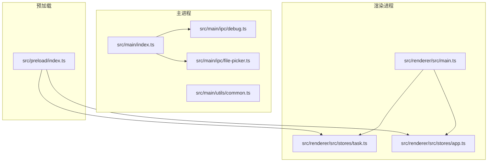
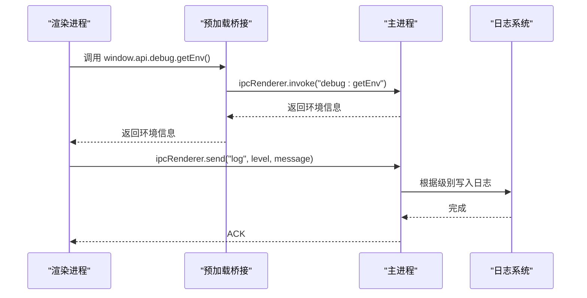
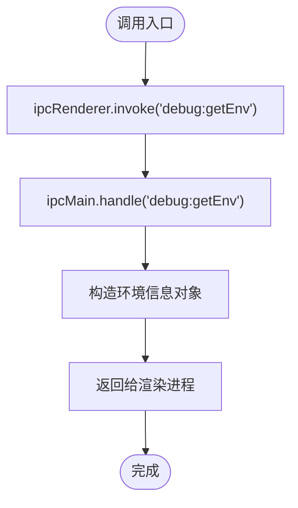
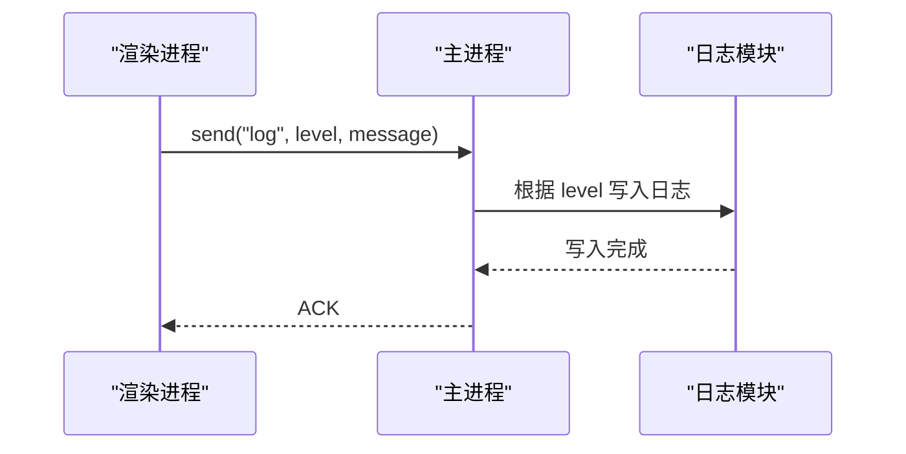
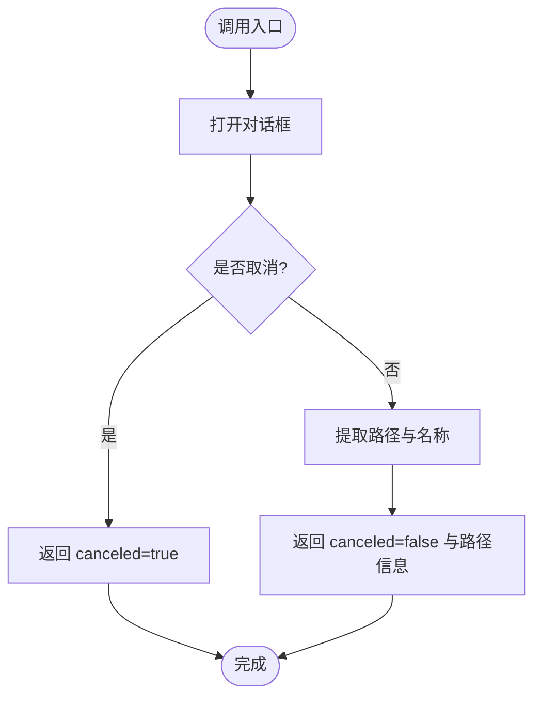
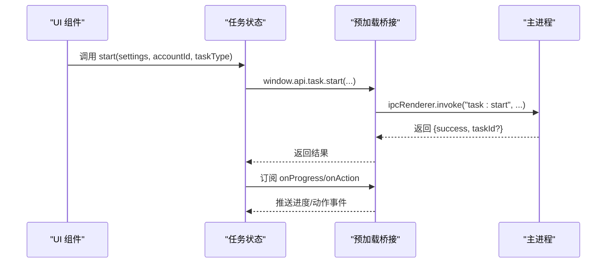
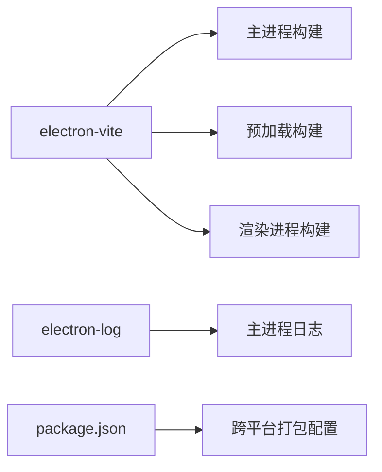

# 调试工具和技巧

<cite>
**本文引用的文件**
- [src/main/ipc/debug.ts](file://src/main/ipc/debug.ts)
- [src/main/index.ts](file://src/main/index.ts)
- [src/preload/index.ts](file://src/preload/index.ts)
- [src/main/ipc/file-picker.ts](file://src/main/ipc/file-picker.ts)
- [src/renderer/src/stores/task.ts](file://src/renderer/src/stores/task.ts)
- [src/renderer/src/stores/app.ts](file://src/renderer/src/stores/app.ts)
- [src/main/utils/common.ts](file://src/main/utils/common.ts)
- [electron.vite.config.ts](file://electron.vite.config.ts)
- [package.json](file://package.json)
</cite>

## 目录
1. [简介](#简介)
2. [项目结构](#项目结构)
3. [核心组件](#核心组件)
4. [架构总览](#架构总览)
5. [详细组件分析](#详细组件分析)
6. [依赖关系分析](#依赖关系分析)
7. [性能考量](#性能考量)
8. [故障排查指南](#故障排查指南)
9. [结论](#结论)
10. [附录](#附录)

## 简介
本指南聚焦于 AutoOps 的调试工具与技巧，覆盖以下主题：
- 内置调试 IPC 接口：环境信息获取与系统状态检查
- 调试日志系统：实现原理与输出格式
- 断点调试、条件断点与异步调试技巧
- Electron 主进程与渲染进程调试方法、IPC 通信调试与错误追踪策略
- 文件选择器调试、跨平台兼容性测试与性能分析工具使用
- 常见调试场景的解决方案与最佳实践

## 项目结构
AutoOps 采用 Electron + Vue 3 的架构，主进程负责窗口管理、IPC 注册与日志初始化；预加载脚本通过 contextBridge 暴露受控 API；渲染进程基于 Vue/Pinia 构建界面与状态管理。

**图表来源**
- [src/main/index.ts:1-106](file://src/main/index.ts#L1-L106)
- [src/main/ipc/debug.ts:1-12](file://src/main/ipc/debug.ts#L1-L12)
- [src/main/ipc/file-picker.ts:1-37](file://src/main/ipc/file-picker.ts#L1-L37)
- [src/preload/index.ts:1-187](file://src/preload/index.ts#L1-L187)
- [src/renderer/src/main.ts:1-12](file://src/renderer/src/main.ts#L1-L12)
- [src/renderer/src/stores/task.ts:100-160](file://src/renderer/src/stores/task.ts#L100-L160)
- [src/renderer/src/stores/app.ts:18-71](file://src/renderer/src/stores/app.ts#L18-L71)

**章节来源**
- [src/main/index.ts:1-106](file://src/main/index.ts#L1-L106)
- [electron.vite.config.ts:1-34](file://electron.vite.config.ts#L1-L34)

## 核心组件
- 调试 IPC：提供环境信息查询能力，便于快速定位平台差异与版本问题
- 日志系统：主进程统一初始化日志，渲染进程通过 IPC 将日志级别映射到主进程日志
- 预加载桥接：集中暴露 API，统一 IPC 调用入口，便于调试与监控
- 文件选择器 IPC：封装原生对话框调用，便于调试文件路径与权限问题
- 渲染状态管理：任务与应用状态在渲染层集中管理，便于观察与断点调试

**章节来源**
- [src/main/ipc/debug.ts:1-12](file://src/main/ipc/debug.ts#L1-L12)
- [src/main/index.ts:17-106](file://src/main/index.ts#L17-L106)
- [src/preload/index.ts:3-93](file://src/preload/index.ts#L3-L93)
- [src/main/ipc/file-picker.ts:1-37](file://src/main/ipc/file-picker.ts#L1-L37)
- [src/renderer/src/stores/task.ts:100-160](file://src/renderer/src/stores/task.ts#L100-L160)
- [src/renderer/src/stores/app.ts:18-71](file://src/renderer/src/stores/app.ts#L18-L71)

## 架构总览
下图展示调试相关的关键交互：渲染进程通过预加载桥接调用主进程 IPC，主进程处理请求并返回结果；同时渲染进程可通过 IPC 将日志转发至主进程日志系统。

**图表来源**
- [src/preload/index.ts:182-184](file://src/preload/index.ts#L182-L184)
- [src/main/ipc/debug.ts:3-12](file://src/main/ipc/debug.ts#L3-L12)
- [src/main/index.ts:92-106](file://src/main/index.ts#L92-L106)

## 详细组件分析

### 调试 IPC 组件（环境信息）
- 功能：提供平台、架构、Electron 版本等运行时信息，用于快速判断环境差异
- 使用方式：渲染进程调用 window.api.debug.getEnv() 获取对象
- 输出字段：platform、arch、versions、electron
- 典型用途：跨平台兼容性测试、版本回归定位、CI 环境诊断

**图表来源**
- [src/preload/index.ts:182-184](file://src/preload/index.ts#L182-L184)
- [src/main/ipc/debug.ts:3-12](file://src/main/ipc/debug.ts#L3-L12)

**章节来源**
- [src/main/ipc/debug.ts:1-12](file://src/main/ipc/debug.ts#L1-L12)
- [src/preload/index.ts:90-92](file://src/preload/index.ts#L90-L92)

### 日志系统与输出格式
- 初始化：主进程在启动时初始化日志模块，并记录应用启动事件
- 渲染日志：渲染进程通过 ipcRenderer.send('log', level, message) 发送日志
- 映射规则：主进程根据级别将消息写入对应日志通道，并在消息前缀中标识来源
- 输出格式：统一以“[Renderer]”作为来源标记，便于区分主/渲染进程日志

**图表来源**
- [src/main/index.ts:17-21](file://src/main/index.ts#L17-L21)
- [src/main/index.ts:92-106](file://src/main/index.ts#L92-L106)

**章节来源**
- [src/main/index.ts:17-21](file://src/main/index.ts#L17-L21)
- [src/main/index.ts:92-106](file://src/main/index.ts#L92-L106)

### 文件选择器 IPC（调试要点）
- 功能：封装原生文件/目录选择对话框，返回用户选择结果与基础元数据
- 调试关注点：
  - canceled 字段用于判断用户取消行为
  - filePath/dirPath 为空表示未选择成功
  - fileName/dirName 可用于校验路径解析与权限
- 典型场景：导入配置、选择缓存目录、定位日志文件

**图表来源**
- [src/main/ipc/file-picker.ts:4-37](file://src/main/ipc/file-picker.ts#L4-L37)

**章节来源**
- [src/main/ipc/file-picker.ts:1-37](file://src/main/ipc/file-picker.ts#L1-L37)

### 渲染状态与任务流程（调试要点）
- 任务状态：渲染层通过 Pinia 管理任务运行状态、进度与动作回调
- 进度与动作监听：通过 window.api.task.onProgress/onAction 订阅事件流
- 异常捕获：在调用 IPC 时进行 try-catch 并记录日志，便于定位失败原因
- 典型调试：观察状态变化、监听事件回调、结合日志定位异常

**图表来源**
- [src/renderer/src/stores/task.ts:100-160](file://src/renderer/src/stores/task.ts#L100-L160)
- [src/preload/index.ts:102-116](file://src/preload/index.ts#L102-L116)

**章节来源**
- [src/renderer/src/stores/task.ts:100-160](file://src/renderer/src/stores/task.ts#L100-L160)
- [src/preload/index.ts:102-116](file://src/preload/index.ts#L102-L116)

### 应用初始化与浏览器路径（调试要点）
- 初始化检查：读取浏览器执行路径，决定初始化状态
- 设置路径：通过 IPC 设置浏览器路径并更新本地状态
- 调试关注：确保路径存在且可执行，避免后续任务启动失败

**章节来源**
- [src/renderer/src/stores/app.ts:32-43](file://src/renderer/src/stores/app.ts#L32-L43)
- [src/preload/index.ts:130-133](file://src/preload/index.ts#L130-L133)

## 依赖关系分析
- 构建工具链：electron-vite 提供主/预加载/渲染三端开发体验
- 日志依赖：electron-log 为主进程日志核心
- 跨平台打包：package.json 的 build 字段定义了 Windows/macOS/Linux 的目标产物

**图表来源**
- [electron.vite.config.ts:1-34](file://electron.vite.config.ts#L1-L34)
- [package.json:16-83](file://package.json#L16-L83)

**章节来源**
- [electron.vite.config.ts:1-34](file://electron.vite.config.ts#L1-L34)
- [package.json:16-83](file://package.json#L16-L83)

## 性能考量
- 异步 IPC：尽量使用 invoke/send 而非阻塞同步调用，避免阻塞 UI
- 事件订阅：及时清理事件监听，防止内存泄漏与重复回调
- 工具函数：合理使用延时与随机数工具，避免过于频繁的轮询
- 日志频率：控制高频日志输出，避免影响性能

**章节来源**
- [src/main/utils/common.ts:1-11](file://src/main/utils/common.ts#L1-L11)
- [src/renderer/src/stores/task.ts:89-98](file://src/renderer/src/stores/task.ts#L89-L98)

## 故障排查指南

### 环境与版本问题
- 快速确认：调用调试 IPC 获取 platform/arch/versions/electron
- 跨平台对比：在不同系统上对比环境信息，定位兼容性问题
- 版本回退：若出现新版本回归，使用该接口快速比对 Electron/Node/V8 版本

**章节来源**
- [src/main/ipc/debug.ts:1-12](file://src/main/ipc/debug.ts#L1-L12)
- [src/preload/index.ts:90-92](file://src/preload/index.ts#L90-L92)

### IPC 通信问题
- 调试步骤：
  - 在主进程注册日志，观察 IPC 请求到达
  - 在渲染进程打印调用参数与返回值
  - 使用事件监听器验证 onProgress/onAction 是否触发
- 常见问题：未正确注册 IPC、类型不匹配、未清理监听导致重复回调

**章节来源**
- [src/main/index.ts:54-84](file://src/main/index.ts#L54-L84)
- [src/preload/index.ts:102-116](file://src/preload/index.ts#L102-L116)
- [src/renderer/src/stores/task.ts:123-160](file://src/renderer/src/stores/task.ts#L123-L160)

### 日志与错误追踪
- 渲染日志：通过 IPC 将日志发送至主进程，统一查看
- 错误分类：按 error/warn/debug/info 分级，便于检索
- 建议：在关键路径增加日志埋点，结合时间戳定位时序问题

**章节来源**
- [src/main/index.ts:92-106](file://src/main/index.ts#L92-L106)

### 文件选择器问题
- 用户取消：检查 canceled 字段，避免误以为失败
- 路径为空：确认对话框返回与路径解析逻辑
- 权限问题：在 macOS/Linux 上验证文件访问权限

**章节来源**
- [src/main/ipc/file-picker.ts:1-37](file://src/main/ipc/file-picker.ts#L1-L37)

### 跨平台兼容性测试
- 打包目标：Windows/macOS/Linux 三端分别构建与测试
- 环境差异：利用调试 IPC 对比各平台环境差异
- 行为一致性：确保对话框、路径分隔符、权限模型一致

**章节来源**
- [package.json:50-83](file://package.json#L50-L83)
- [src/main/ipc/file-picker.ts:1-37](file://src/main/ipc/file-picker.ts#L1-L37)

### 断点与条件断点技巧
- 主进程断点：在 IPC 处理函数入口设置断点，观察传入参数与返回值
- 渲染进程断点：在 store 的 start/onProgress/onAction 回调处设置断点
- 条件断点：针对特定任务 ID 或错误码设置条件断点，缩小排查范围
- 异步调试：利用 Promise 链与事件流，在关键节点设置断点，逐步跟踪

**章节来源**
- [src/main/ipc/debug.ts:3-12](file://src/main/ipc/debug.ts#L3-L12)
- [src/renderer/src/stores/task.ts:100-160](file://src/renderer/src/stores/task.ts#L100-L160)

## 结论
通过调试 IPC、日志系统与预加载桥接，AutoOps 提供了完整的主/渲染双端调试能力。结合文件选择器与跨平台打包配置，可高效定位环境与兼容性问题；配合断点、条件断点与异步调试技巧，能够系统化地解决复杂场景下的问题。

## 附录

### 常用调试命令与脚本
- 开发模式：使用 electron-vite 启动开发服务器
- 构建与打包：分别针对 Windows/macOS/Linux 生成安装包
- 类型检查：确保 TypeScript 类型安全

**章节来源**
- [package.json:6-14](file://package.json#L6-L14)
- [electron.vite.config.ts:1-34](file://electron.vite.config.ts#L1-L34)