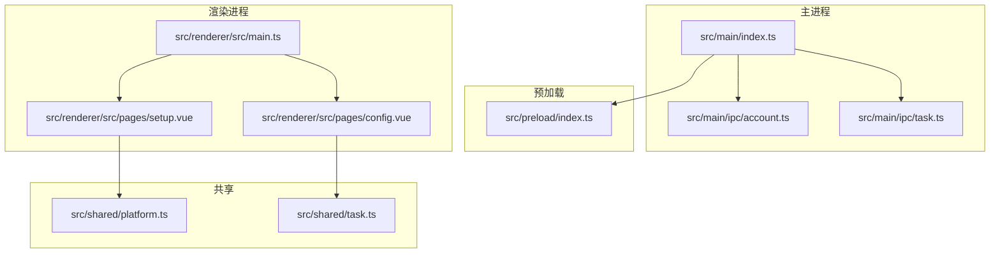
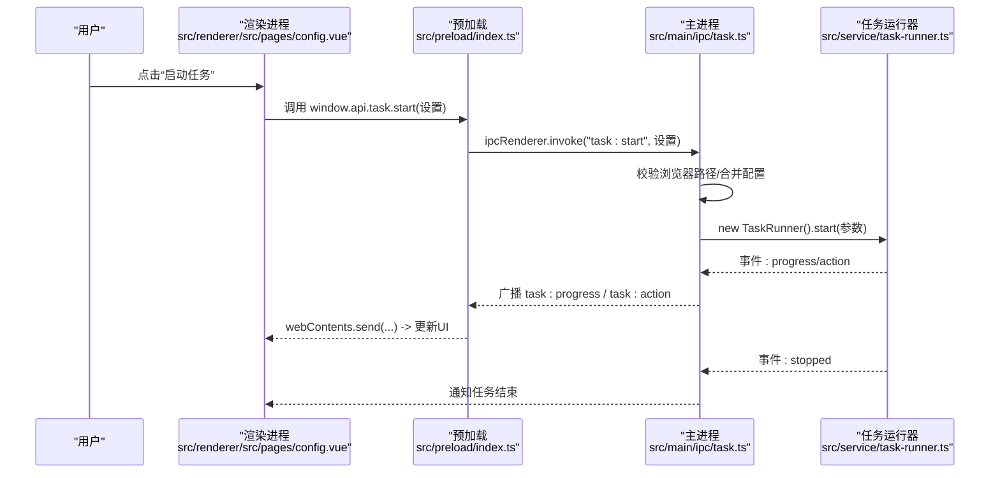
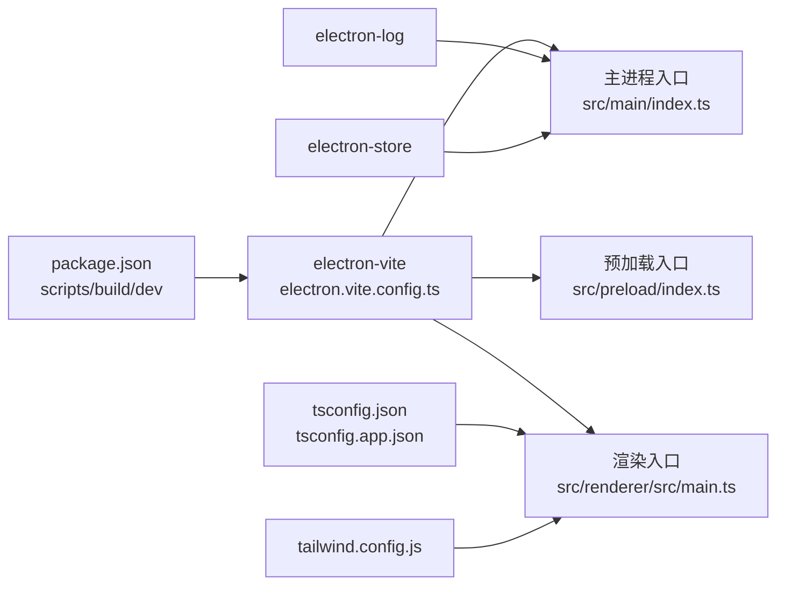

# 快速开始

<cite>
**本文引用的文件**
- [package.json](file://package.json)
- [electron.vite.config.ts](file://electron.vite.config.ts)
- [tsconfig.json](file://tsconfig.json)
- [tsconfig.app.json](file://tsconfig.app.json)
- [tailwind.config.js](file://tailwind.config.js)
- [README.md](file://README.md)
- [src/main/index.ts](file://src/main/index.ts)
- [src/main/ipc/account.ts](file://src/main/ipc/account.ts)
- [src/main/ipc/task.ts](file://src/main/ipc/task.ts)
- [src/renderer/src/main.ts](file://src/renderer/src/main.ts)
- [src/renderer/src/pages/setup.vue](file://src/renderer/src/pages/setup.vue)
- [src/renderer/src/pages/config.vue](file://src/renderer/src/pages/config.vue)
- [src/shared/platform.ts](file://src/shared/platform.ts)
- [src/shared/task.ts](file://src/shared/task.ts)
</cite>

## 目录
1. [简介](#简介)
2. [项目结构](#项目结构)
3. [核心组件](#核心组件)
4. [架构总览](#架构总览)
5. [详细组件分析](#详细组件分析)
6. [依赖关系分析](#依赖关系分析)
7. [性能与运行建议](#性能与运行建议)
8. [故障排查指南](#故障排查指南)
9. [结论](#结论)
10. [附录：命令与配置清单](#附录命令与配置清单)

## 简介
AutoOps 是一款基于 Electron 的桌面自动化运营工具，支持多平台（抖音、快手、小红书、微信视频号）的自动评论、点赞、收藏、关注等操作，并内置 AI 评论生成功能。本指南面向首次使用者，提供从环境准备、安装依赖、构建打包到首次运行配置的完整流程，涵盖开发模式与生产模式差异、常见问题排查与最佳实践。

## 项目结构
项目采用 Electron + Vue 3 + Vite 的分层架构：
- 主进程（Electron 主进程）负责窗口、IPC、系统交互与任务调度
- 渲染进程（Vue 应用）负责页面、状态管理与用户交互
- 共享类型与平台配置在共享目录中统一维护
- 构建通过 electron-vite 配置主/预加载/渲染三段式入口

图表来源
- [src/main/index.ts:1-106](file://src/main/index.ts#L1-L106)
- [src/main/ipc/account.ts:1-101](file://src/main/ipc/account.ts#L1-L101)
- [src/main/ipc/task.ts:1-104](file://src/main/ipc/task.ts#L1-L104)
- [src/renderer/src/main.ts:1-12](file://src/renderer/src/main.ts#L1-L12)
- [src/renderer/src/pages/setup.vue:1-245](file://src/renderer/src/pages/setup.vue#L1-L245)
- [src/renderer/src/pages/config.vue:1-323](file://src/renderer/src/pages/config.vue#L1-L323)
- [src/shared/platform.ts:1-260](file://src/shared/platform.ts#L1-L260)
- [src/shared/task.ts:1-54](file://src/shared/task.ts#L1-L54)

章节来源
- [README.md: 36-54:36-54](file://README.md#L36-L54)
- [electron.vite.config.ts: 6-34:6-34](file://electron.vite.config.ts#L6-L34)

## 核心组件
- 主进程入口与窗口初始化：负责创建主窗口、注册 IPC、日志与生命周期事件
- 账号管理 IPC：提供账号列表、新增、更新、删除、默认账号设置等能力
- 任务控制 IPC：接收前端启动/停止任务请求，校验浏览器路径，驱动任务运行器
- 渲染入口与路由：初始化 Vue 应用、Pinia、路由与全局样式
- 首次配置页：引导用户选择并验证浏览器路径
- 任务配置页：配置规则组、屏蔽词、AI 评论开关与启动/停止任务

章节来源
- [src/main/index.ts: 22-52:22-52](file://src/main/index.ts#L22-L52)
- [src/main/ipc/account.ts: 32-100:32-100](file://src/main/ipc/account.ts#L32-L100)
- [src/main/ipc/task.ts: 11-103:11-103](file://src/main/ipc/task.ts#L11-L103)
- [src/renderer/src/main.ts: 1-12:1-12](file://src/renderer/src/main.ts#L1-L12)
- [src/renderer/src/pages/setup.vue: 32-75:32-75](file://src/renderer/src/pages/setup.vue#L32-L75)
- [src/renderer/src/pages/config.vue: 48-55:48-55](file://src/renderer/src/pages/config.vue#L48-L55)

## 架构总览
下图展示从用户点击“启动任务”到任务执行的关键调用链路，以及主进程对任务运行器的封装与事件广播。

图表来源
- [src/main/ipc/task.ts: 11-103:11-103](file://src/main/ipc/task.ts#L11-L103)
- [src/renderer/src/pages/config.vue: 48-55:48-55](file://src/renderer/src/pages/config.vue#L48-L55)

## 详细组件分析

### 主进程与窗口初始化
- 创建主窗口、最小尺寸限制、沙箱与上下文隔离配置
- 开发模式下加载本地渲染地址，否则加载打包后的 HTML
- 注册所有 IPC 处理器，集中初始化日志与窗口优化

章节来源
- [src/main/index.ts: 22-52:22-52](file://src/main/index.ts#L22-L52)
- [src/main/index.ts: 54-84:54-84](file://src/main/index.ts#L54-L84)

### 账号管理 IPC
- 提供账号增删改查、设置默认账号、按平台筛选、获取活跃账号等接口
- 新增账号时自动生成唯一 ID、时间戳与默认状态；删除账号时保证至少保留一个默认账号

章节来源
- [src/main/ipc/account.ts: 32-100:32-100](file://src/main/ipc/account.ts#L32-L100)

### 任务控制 IPC
- 接收启动/停止/查询任务状态请求
- 启动前校验浏览器可执行路径是否已配置，否则返回错误
- 将进度与动作事件广播给所有窗口，便于前端实时展示

章节来源
- [src/main/ipc/task.ts: 11-103:11-103](file://src/main/ipc/task.ts#L11-L103)

### 渲染入口与路由
- 初始化 Vue 应用、Pinia、路由与全局样式
- 作为页面与状态管理的根节点，承载 setup 与 config 页面

章节来源
- [src/renderer/src/main.ts: 1-12:1-12](file://src/renderer/src/main.ts#L1-L12)

### 首次配置（浏览器选择）
- 支持自动检测系统已安装浏览器，或手动选择可执行文件路径
- 验证通过后写入配置并进入应用首页

章节来源
- [src/renderer/src/pages/setup.vue: 32-75:32-75](file://src/renderer/src/pages/setup.vue#L32-L75)

### 任务配置与启动
- 配置基础参数（模拟观看、观看时长、目标评论数等）
- 管理规则组（手动/AI）、屏蔽词（视频描述/作者名）
- 启动任务前持久化当前设置，随后触发主进程任务执行

章节来源
- [src/renderer/src/pages/config.vue: 48-55:48-55](file://src/renderer/src/pages/config.vue#L48-L55)
- [src/renderer/src/pages/config.vue: 19-46:19-46](file://src/renderer/src/pages/config.vue#L19-L46)

### 平台与任务数据模型
- 平台枚举与配置：包含各平台主页、登录页、元素选择器、API 端点与快捷键
- 任务模型：任务与模板的字段、默认值与 ID 生成策略

章节来源
- [src/shared/platform.ts: 1-L260:1-260](file://src/shared/platform.ts#L1-L260)
- [src/shared/task.ts: 5-L54:5-54](file://src/shared/task.ts#L5-L54)

## 依赖关系分析
- 构建工具链：electron-vite 管理主/预加载/渲染三段式构建与别名
- 类型检查：双 tsconfig 引用，分别覆盖应用与 Node 环境
- UI 框架：Vue 3 + Pinia + Vue Router + Tailwind CSS 4
- 日志与存储：electron-log 记录日志；electron-store 存储配置
- 测试：Playwright

图表来源
- [package.json: 6-14:6-14](file://package.json#L6-L14)
- [electron.vite.config.ts: 6-34:6-34](file://electron.vite.config.ts#L6-L34)
- [tsconfig.json: 1-18:1-18](file://tsconfig.json#L1-L18)
- [tsconfig.app.json: 1-18:1-18](file://tsconfig.app.json#L1-L18)
- [tailwind.config.js: 1-57:1-57](file://tailwind.config.js#L1-L57)

章节来源
- [package.json: 16-49:16-49](file://package.json#L16-L49)
- [package.json: 50-83:50-83](file://package.json#L50-L83)

## 性能与运行建议
- 开发模式优先：使用 npm run dev 快速迭代，热更新提升效率
- 生产构建：使用 npm run build 或按平台构建脚本（build:win/mac/linux），以获得更小体积与更佳稳定性
- 日志与调试：利用主进程日志与渲染侧日志通道，定位任务执行阶段问题
- 资源占用：合理设置“观看时长范围”与“目标评论数”，避免长时间高负载运行

## 故障排查指南
- 启动时报错“浏览器路径未配置”
  - 现象：任务启动被拒绝，提示未配置浏览器路径
  - 处理：先进入“首次配置”页面，选择并验证浏览器路径后再尝试启动
  - 参考：任务 IPC 在启动前会读取存储中的浏览器路径
- 任务无法启动或立即退出
  - 现象：任务启动后很快停止
  - 处理：检查浏览器路径是否正确、账号是否有效、网络连通性；查看实时日志定位错误
  - 参考：任务 IPC 在启动失败时会清理运行器实例并返回错误
- 浏览器检测不到
  - 现象：自动检测为空，需手动选择
  - 处理：点击“浏览”选择浏览器可执行文件，或在系统中确认浏览器安装路径
- 账号相关问题
  - 现象：删除账号后无默认账号
  - 处理：系统会在删除后自动将首个剩余账号设为默认，请重新设置或添加新账号

章节来源
- [src/main/ipc/task.ts: 32-36:32-36](file://src/main/ipc/task.ts#L32-L36)
- [src/main/ipc/task.ts: 79-83:79-83](file://src/main/ipc/task.ts#L79-L83)
- [src/main/ipc/account.ts: 62-79:62-79](file://src/main/ipc/account.ts#L62-L79)
- [src/renderer/src/pages/setup.vue: 32-45:32-45](file://src/renderer/src/pages/setup.vue#L32-L45)

## 结论
通过本快速开始指南，您已完成环境准备、安装依赖、构建与首次配置，并理解了开发与生产模式的差异。建议先在开发模式下完成功能验证，再使用生产构建发布应用。遇到问题时，结合日志与本指南的排查步骤可快速定位并解决。

## 附录：命令与配置清单

- 环境要求
  - Node.js：建议使用长期支持版本（LTS），与项目中 TypeScript、Vite、Electron 版本兼容
  - 操作系统：Windows/macOS/Linux 均可运行 Electron 应用
  - 浏览器：Chrome/Edge 等 Chromium 内核浏览器，用于自动化操作

- 安装与运行
  - 安装依赖：npm install
  - 开发模式：npm run dev
  - 生产构建：npm run build
  - 平台构建：npm run build:win / build:mac / build:linux

- 首次运行配置
  - 打开应用后进入“首次配置”页面，选择并验证浏览器路径
  - 进入“任务配置”页面，完善规则组、屏蔽词与 AI 评论设置
  - 点击“启动任务”开始自动化运营

- 关键配置项
  - 浏览器路径：由“首次配置”页面写入存储，任务启动前校验
  - 任务设置：在“任务配置”页面保存，启动前写入设置并下发至任务运行器
  - 平台与元素：平台配置集中于共享模块，包含选择器与快捷键映射

章节来源
- [README.md: 23-34:23-34](file://README.md#L23-L34)
- [src/renderer/src/pages/setup.vue: 32-75:32-75](file://src/renderer/src/pages/setup.vue#L32-L75)
- [src/renderer/src/pages/config.vue: 48-55:48-55](file://src/renderer/src/pages/config.vue#L48-L55)
- [src/shared/platform.ts: 88-L200:88-200](file://src/shared/platform.ts#L88-L200)