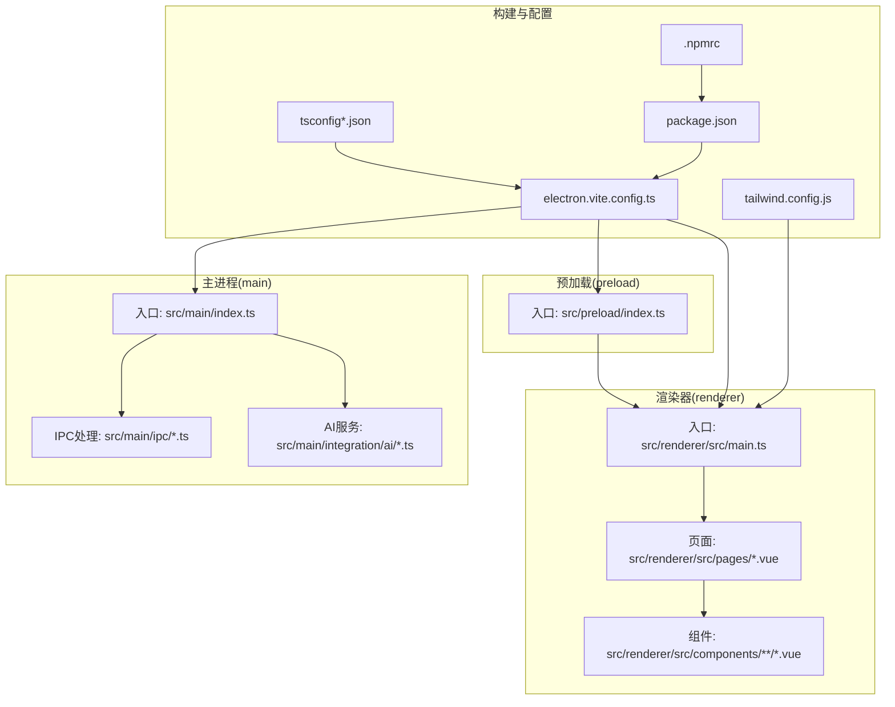
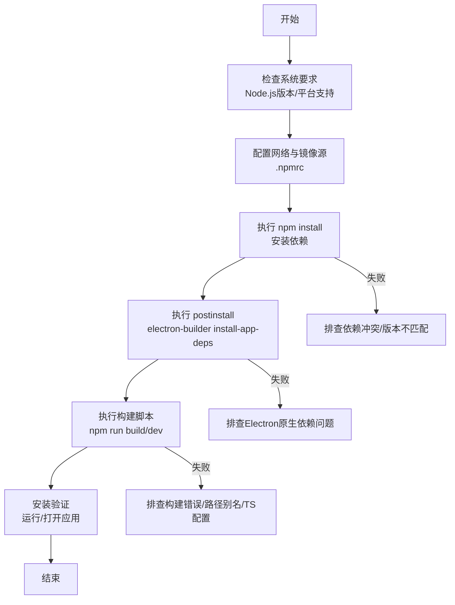
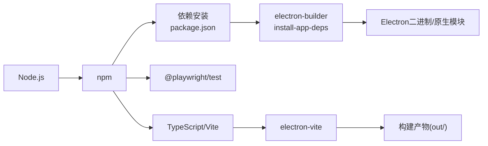
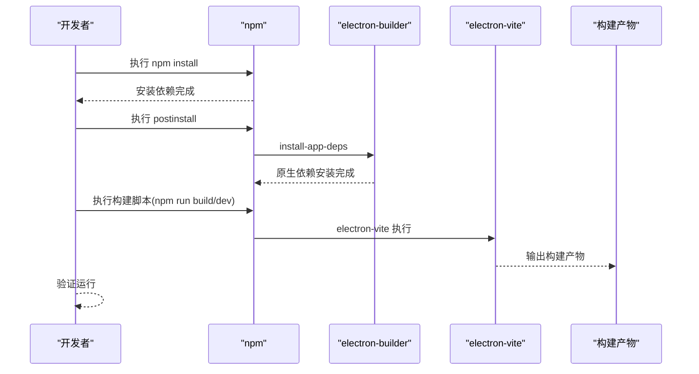

# 安装问题

<cite>
**本文引用的文件**
- [package.json](file://package.json)
- [electron.vite.config.ts](file://electron.vite.config.ts)
- [.npmrc](file://.npmrc)
- [README.md](file://README.md)
- [tsconfig.json](file://tsconfig.json)
- [tsconfig.app.json](file://tsconfig.app.json)
- [tailwind.config.js](file://tailwind.config.js)
- [src/main/ipc/login.ts](file://src/main/ipc/login.ts)
- [src/main/integration/ai/factory.ts](file://src/main/integration/ai/factory.ts)
- [.trae/documents/fix-account-add-issue.md](file://.trae/documents/fix-account-add-issue.md)
- [.trae/documents/autoops-expansion-plan.md](file://.trae/documents/autoops-expansion-plan.md)
</cite>

## 目录
1. [简介](#简介)
2. [项目结构](#项目结构)
3. [核心组件](#核心组件)
4. [架构总览](#架构总览)
5. [详细组件分析](#详细组件分析)
6. [依赖关系分析](#依赖关系分析)
7. [性能考虑](#性能考虑)
8. [故障排除指南](#故障排除指南)
9. [结论](#结论)
10. [附录](#附录)

## 简介
本文件面向首次安装或在安装过程中遇到问题的用户，聚焦AutoOps的安装与构建阶段常见问题，包括但不限于：
- Node.js版本与系统要求不匹配
- npm依赖安装失败（含Electron相关原生依赖）
- Electron构建错误
- 网络与镜像源问题
- 权限与目录访问问题
- 不同操作系统（Windows、macOS、Linux）的差异与注意事项
- 依赖冲突与版本升级策略
- 缓存清理与重试流程
- 安装验证步骤与常见错误代码解释

目标是帮助你在最短时间内定位并解决问题，顺利完成开发与构建。

## 项目结构
AutoOps是一个基于Electron + Vue 3 + TypeScript + Vite + electron-vite的桌面应用。项目采用前后端分离的主进程、预加载脚本与渲染器三层结构，并通过electron-vite进行统一构建配置。

图表来源
- [electron.vite.config.ts:1-34](file://electron.vite.config.ts#L1-L34)
- [tsconfig.json:1-18](file://tsconfig.json#L1-L18)
- [tsconfig.app.json:1-18](file://tsconfig.app.json#L1-L18)
- [tailwind.config.js:1-57](file://tailwind.config.js#L1-L57)
- [package.json:1-85](file://package.json#L1-L85)

章节来源
- [README.md:1-54](file://README.md#L1-L54)
- [electron.vite.config.ts:1-34](file://electron.vite.config.ts#L1-L34)
- [package.json:1-85](file://package.json#L1-L85)

## 核心组件
- 构建与打包
  - 使用electron-vite作为统一构建工具，分别配置主进程、预加载与渲染器的入口与别名。
  - TypeScript配置分层，确保主进程与渲染器分别编译到不同输出目录。
  - Tailwind CSS用于样式工程化，配合Vite插件使用。
- 依赖与版本
  - Electron 38.x、Vue 3、TypeScript 5.x、Vite 6.x、Tailwind CSS 4、Playwright等。
  - 通过.npmrc配置国内镜像源与Electron二进制镜像，加速下载。
- 安装脚本
  - 提供开发(dev)、构建(build)、按平台构建(build:win/mac/linux)、类型检查(typecheck)、lint与postinstall钩子（electron-builder install-app-deps）。

章节来源
- [package.json:1-85](file://package.json#L1-L85)
- [electron.vite.config.ts:1-34](file://electron.vite.config.ts#L1-L34)
- [tsconfig.json:1-18](file://tsconfig.json#L1-L18)
- [tsconfig.app.json:1-18](file://tsconfig.app.json#L1-L18)
- [tailwind.config.js:1-57](file://tailwind.config.js#L1-L57)
- [.npmrc:1-3](file://.npmrc#L1-L3)

## 架构总览
下图展示了安装与构建的关键流程：从系统要求检查、依赖安装、到Electron原生依赖安装、最终完成构建。

图表来源
- [package.json:6-14](file://package.json#L6-L14)
- [.npmrc:1-3](file://.npmrc#L1-L3)

## 详细组件分析

### Node.js与系统要求
- Node.js版本
  - 项目使用Electron 38.x、TypeScript 5.x、Vite 6.x等较新生态，建议使用Node 18 LTS或更高版本以获得最佳兼容性。
  - 构建工具链对Node版本有一定要求，若版本过低可能导致原生模块编译失败或TypeScript/Vite报错。
- 操作系统
  - Windows/macOS/Linux均支持，但原生依赖（如Electron）在不同平台的二进制下载与编译策略不同，需注意平台差异。
- 权限与目录
  - 构建与运行会读取/写入用户目录（如APPDATA/HOME），请确保当前用户具备相应权限。

章节来源
- [package.json:41-48](file://package.json#L41-L48)
- [README.md:14-22](file://README.md#L14-L22)

### npm依赖安装与镜像配置
- 镜像源
  - .npmrc已配置registry与Electron镜像，有助于在中国大陆地区加速下载。
- 常见失败场景
  - 网络不稳定导致下载超时
  - 代理未正确配置
  - 与系统防火墙/安全软件冲突
- 解决方案
  - 使用.npmrc提供的镜像源
  - 在命令行临时指定registry参数
  - 清理缓存后重试

章节来源
- [.npmrc:1-3](file://.npmrc#L1-L3)
- [package.json:6-14](file://package.json#L6-L14)

### Electron原生依赖与postinstall
- postinstall钩子
  - 通过electron-builder install-app-deps安装/重建Electron相关原生依赖，这是安装阶段最关键的一步。
- 常见问题
  - Node版本与Electron ABI不匹配
  - 缺少Python、MSVC（Windows）或Xcode命令行工具（macOS）
  - 磁盘空间不足或权限不足
- 排查要点
  - 确认Node版本满足Electron要求
  - 安装必要构建工具（Python、编译器）
  - 清理缓存并重新执行postinstall

章节来源
- [package.json:14-14](file://package.json#L14-L14)

### Playwright与浏览器路径
- 登录流程依赖Playwright（@playwright/test），用于模拟浏览器登录抖音。
- 常见问题
  - Playwright版本过旧导致兼容性问题
  - 导入模块不匹配（playwright vs @playwright/test）
- 修复参考
  - 升级@playwright/test至推荐版本并安装Chromium
  - 修正导入语句为@playwright/test

章节来源
- [src/main/ipc/login.ts:26-26](file://src/main/ipc/login.ts#L26-L26)
- [.trae/documents/fix-account-add-issue.md:1-41](file://.trae/documents/fix-account-add-issue.md#L1-L41)

### TypeScript与路径别名
- TypeScript配置分层，主进程与渲染器分别编译，避免相互污染。
- 路径别名（@/*、@renderer/*、@/components/*）需与electron-vite配置一致，否则可能出现“找不到模块”或构建失败。
- 常见问题
  - 路径别名未生效
  - 类型检查失败（tsc --noEmit）

章节来源
- [tsconfig.json:1-18](file://tsconfig.json#L1-L18)
- [tsconfig.app.json:1-18](file://tsconfig.app.json#L1-L18)
- [electron.vite.config.ts:8-32](file://electron.vite.config.ts#L8-L32)

### Tailwind CSS与样式构建
- Tailwind CSS 4与Vite插件配合使用，确保渲染器样式正常构建。
- 常见问题
  - content路径未覆盖到Vue文件
  - 主题/动画插件未正确引入

章节来源
- [tailwind.config.js:1-57](file://tailwind.config.js#L1-L57)

### 构建与打包
- 构建脚本
  - 开发：npm run dev
  - 构建：npm run build（先类型检查，再构建）
  - 平台构建：npm run build:win / build:mac / build:linux
- 常见问题
  - 构建失败（TypeScript错误、路径别名解析失败、Electron原生依赖未安装）
  - 打包产物缺失或无法运行

章节来源
- [package.json:6-12](file://package.json#L6-L12)
- [README.md:23-34](file://README.md#L23-L34)

## 依赖关系分析
以下图示展示安装与构建阶段的关键依赖与交互：

图表来源
- [package.json:16-48](file://package.json#L16-L48)
- [package.json:50-83](file://package.json#L50-L83)
- [electron.vite.config.ts:1-34](file://electron.vite.config.ts#L1-L34)

章节来源
- [package.json:1-85](file://package.json#L1-L85)
- [electron.vite.config.ts:1-34](file://electron.vite.config.ts#L1-L34)

## 性能考虑
- 首次安装耗时较长，主要受网络与原生依赖编译影响。
- 使用镜像源可显著降低依赖下载时间。
- 构建阶段开启类型检查会增加时间，可在CI中按需启用。

## 故障排除指南

### 一、系统要求检查
- Node.js版本
  - 建议使用Node 18 LTS或更新版本；过低版本可能导致TypeScript/Vite/Electron原生模块编译失败。
- 操作系统
  - Windows：确保安装Visual Studio Build Tools或同等编译环境。
  - macOS：确保安装Xcode Command Line Tools。
  - Linux：确保安装Python、GCC/G++与libnotify等必要依赖。
- 权限
  - 确保当前用户对用户目录（APPDATA/HOME）具有读写权限。

章节来源
- [package.json:41-48](file://package.json#L41-L48)
- [README.md:14-22](file://README.md#L14-L22)

### 二、网络与镜像配置
- 使用内置镜像源
  - .npmrc已配置registry与Electron镜像，优先使用国内镜像提升下载速度。
- 代理设置
  - 若公司网络需要代理，请在命令行设置HTTP/HTTPS代理后再执行安装。
- 缓存清理
  - 清理npm缓存后重试：删除node_modules与package-lock.json，重新执行npm install。

章节来源
- [.npmrc:1-3](file://.npmrc#L1-L3)
- [package.json:6-14](file://package.json#L6-L14)

### 三、npm依赖安装失败
- 症状
  - 下载依赖超时、部分包安装失败、类型检查报错。
- 排查步骤
  - 检查网络与代理是否生效
  - 使用镜像源重试
  - 清理缓存并重装
  - 确认Node版本满足依赖要求
- 相关文件
  - package.json中的依赖与脚本
  - .npmrc镜像配置

章节来源
- [package.json:16-48](file://package.json#L16-L48)
- [.npmrc:1-3](file://.npmrc#L1-L3)

### 四、Electron原生依赖安装失败（postinstall）
- 症状
  - electron-builder install-app-deps执行失败，提示原生模块编译错误或Electron二进制下载失败。
- 排查步骤
  - 确认Node版本与Electron ABI匹配
  - 安装Python与编译工具链（Windows: VS Build Tools；macOS: Xcode CLT；Linux: Python/GCC）
  - 清理缓存后重试
  - 检查磁盘空间与权限
- 相关文件
  - package.json中的postinstall钩子
  - electron-vite配置

章节来源
- [package.json:14-14](file://package.json#L14-L14)
- [electron.vite.config.ts:1-34](file://electron.vite.config.ts#L1-L34)

### 五、Playwright与浏览器路径问题
- 症状
  - 登录功能报错：Cannot find module 'playwright' 或版本不兼容。
- 修复步骤
  - 升级@playwright/test至推荐版本并安装Chromium
  - 修正导入语句为@playwright/test
  - 确认浏览器执行路径已在设置中配置
- 相关文件
  - src/main/ipc/login.ts中的导入与登录流程
  - 修复文档

章节来源
- [src/main/ipc/login.ts:26-26](file://src/main/ipc/login.ts#L26-L26)
- [.trae/documents/fix-account-add-issue.md:1-41](file://.trae/documents/fix-account-add-issue.md#L1-L41)

### 六、TypeScript与路径别名错误
- 症状
  - 类型检查失败（tsc --noEmit）、构建时报“找不到模块”。
- 排查步骤
  - 检查tsconfig.json与tsconfig.app.json中的路径别名配置
  - 确保electron-vite配置与TS路径映射一致
  - 重启编辑器/IDE以刷新TS服务
- 相关文件
  - tsconfig.json、tsconfig.app.json
  - electron.vite.config.ts

章节来源
- [tsconfig.json:1-18](file://tsconfig.json#L1-L18)
- [tsconfig.app.json:1-18](file://tsconfig.app.json#L1-L18)
- [electron.vite.config.ts:8-32](file://electron.vite.config.ts#L8-L32)

### 七、构建错误（Windows/macOS/Linux）
- 症状
  - 构建失败、打包产物缺失、运行时报错。
- 排查步骤
  - 先执行类型检查：npm run typecheck
  - 按平台分别构建：npm run build:win / build:mac / build:linux
  - 检查electron-vite配置与输出目录
- 相关文件
  - package.json中的构建脚本
  - electron.vite.config.ts

章节来源
- [package.json:6-12](file://package.json#L6-L12)
- [electron.vite.config.ts:1-34](file://electron.vite.config.ts#L1-L34)

### 八、权限与目录问题
- 症状
  - 无法写入用户目录、Electron无法下载二进制、构建失败。
- 处理方式
  - 以管理员身份运行终端或IDE
  - 更换工作目录到有权限的路径
  - 清理旧的缓存目录后重试

章节来源
- [src/main/ipc/login.ts:28-28](file://src/main/ipc/login.ts#L28-L28)

### 九、依赖冲突与版本升级
- 症状
  - 同一依赖的不同版本共存导致运行时异常。
- 处理方式
  - 使用锁定文件（package-lock.json）保证一致性
  - 升级到官方推荐版本（如Playwright）
  - 如需降级，确保所有相关依赖版本一致

章节来源
- [.trae/documents/fix-account-add-issue.md:1-41](file://.trae/documents/fix-account-add-issue.md#L1-L41)

### 十、缓存清理与重试
- 清理步骤
  - 删除node_modules与package-lock.json
  - 清理npm缓存：npm cache clean --force
  - 清理Electron缓存（可选）
- 重试流程
  - 重新执行：npm install
  - 执行postinstall：electron-builder install-app-deps
  - 再次构建：npm run build

章节来源
- [package.json:6-14](file://package.json#L6-L14)

### 十一、安装验证步骤
- 开发验证
  - npm run dev 启动开发服务器，确认界面与功能可用
- 构建验证
  - npm run build 构建生产包
  - 按平台构建：npm run build:win / build:mac / build:linux
- 登录功能验证
  - 配置浏览器执行路径后，尝试登录抖音账号，确认cookies与用户信息提取正常

章节来源
- [README.md:23-34](file://README.md#L23-L34)
- [src/main/ipc/login.ts:17-173](file://src/main/ipc/login.ts#L17-L173)

### 十二、常见错误代码与解释
- Cannot find module 'playwright'
  - 原因：依赖为@playwright/test而非playwright
  - 处理：升级@playwright/test并修正导入
- Electron原生模块编译失败
  - 原因：Node版本与Electron ABI不匹配或缺少编译工具
  - 处理：升级Node或安装对应编译工具
- 路径别名/模块解析失败
  - 原因：tsconfig与electron-vite配置不一致
  - 处理：统一路径别名配置并重启TS服务
- 构建类型检查失败
  - 原因：TypeScript类型错误
  - 处理：修复类型错误后再次执行类型检查

章节来源
- [src/main/ipc/login.ts:26-26](file://src/main/ipc/login.ts#L26-L26)
- [package.json:41-48](file://package.json#L41-L48)
- [tsconfig.json:1-18](file://tsconfig.json#L1-L18)
- [electron.vite.config.ts:8-32](file://electron.vite.config.ts#L8-L32)

## 结论
安装与构建阶段的问题通常集中在系统要求、网络镜像、Electron原生依赖、Playwright版本与导入、TypeScript路径别名以及权限与缓存等方面。按照本文的排查步骤逐一验证，大多数问题都能快速定位并解决。建议在团队内统一Node版本与镜像源配置，减少环境差异带来的问题。

## 附录

### A. 不同操作系统安装要点
- Windows
  - 安装Visual Studio Build Tools或Windows SDK
  - 使用PowerShell或CMD以管理员权限运行
- macOS
  - 安装Xcode Command Line Tools
  - 注意Apple Silicon与Intel芯片的兼容性
- Linux
  - 安装Python、GCC/G++、libnotify等依赖
  - 注意发行版差异（Ubuntu/CentOS/Fedora）

章节来源
- [package.json:41-48](file://package.json#L41-L48)
- [README.md:14-22](file://README.md#L14-L22)

### B. 构建流程时序图

图表来源
- [package.json:6-14](file://package.json#L6-L14)
- [electron.vite.config.ts:1-34](file://electron.vite.config.ts#L1-L34)