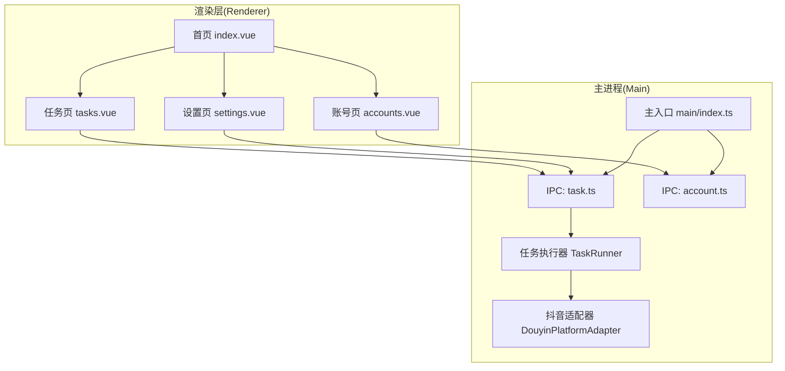
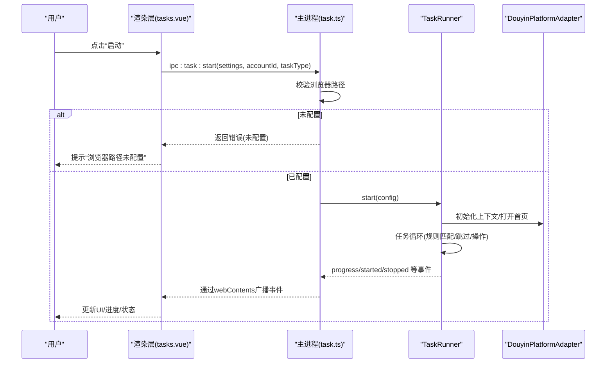
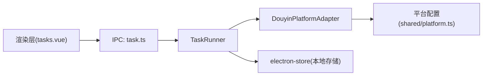

# 常见问题解答

<cite>
**本文引用的文件**   
- [package.json](file://package.json)
- [src/main/index.ts](file://src/main/index.ts)
- [src/main/service/task-runner.ts](file://src/main/service/task-runner.ts)
- [src/main/ipc/task.ts](file://src/main/ipc/task.ts)
- [src/main/ipc/account.ts](file://src/main/ipc/account.ts)
- [src/main/platform/douyin/index.ts](file://src/main/platform/douyin/index.ts)
- [src/shared/platform.ts](file://src/shared/platform.ts)
- [src/shared/task.ts](file://src/shared/task.ts)
- [src/shared/account.ts](file://src/shared/account.ts)
- [.trae/documents/fix-account-add-issue.md](file://.trae/documents/fix-account-add-issue.md)
- [.trae/documents/任务启动无反应排查计划.md](file://.trae/documents/任务启动无反应排查计划.md)
- [src/renderer/src/pages/index.vue](file://src/renderer/src/pages/index.vue)
- [src/renderer/src/pages/tasks.vue](file://src/renderer/src/pages/tasks.vue)
- [src/renderer/src/pages/accounts.vue](file://src/renderer/src/pages/accounts.vue)
- [src/renderer/src/pages/settings.vue](file://src/renderer/src/pages/settings.vue)
</cite>

## 目录
1. [简介](#简介)
2. [项目结构](#项目结构)
3. [核心组件](#核心组件)
4. [架构总览](#架构总览)
5. [详细组件分析](#详细组件分析)
6. [依赖关系分析](#依赖关系分析)
7. [性能与稳定性建议](#性能与稳定性建议)
8. [故障排查指南](#故障排查指南)
9. [结论](#结论)
10. [附录](#附录)

## 简介
本FAQ面向AutoOps用户，聚焦“任务启动无反应”“账号添加失败”“浏览器路径未配置”“AI设置无效”等高频问题，提供症状描述、原因分析、可操作的解决步骤与最佳实践建议。文档同时给出问题分类索引、快速查找方法与搜索技巧，帮助新用户快速上手、高级用户高效排障。

## 项目结构
AutoOps采用Electron + Vue3 + TypeScript架构，主进程负责任务调度与平台适配，渲染层提供任务、账号、设置等页面；通过IPC桥接前后端，实现任务启动、账号管理、AI配置等功能。

图表来源
- [src/main/index.ts:1-106](file://src/main/index.ts#L1-L106)
- [src/main/ipc/task.ts:1-243](file://src/main/ipc/task.ts#L1-L243)
- [src/main/ipc/account.ts:1-101](file://src/main/ipc/account.ts#L1-L101)
- [src/main/service/task-runner.ts:1-760](file://src/main/service/task-runner.ts#L1-L760)
- [src/main/platform/douyin/index.ts:1-494](file://src/main/platform/douyin/index.ts#L1-L494)
- [src/renderer/src/pages/index.vue:1-248](file://src/renderer/src/pages/index.vue#L1-L248)
- [src/renderer/src/pages/tasks.vue:1-800](file://src/renderer/src/pages/tasks.vue#L1-L800)
- [src/renderer/src/pages/accounts.vue:1-203](file://src/renderer/src/pages/accounts.vue#L1-L203)
- [src/renderer/src/pages/settings.vue:1-165](file://src/renderer/src/pages/settings.vue#L1-L165)

章节来源
- [src/main/index.ts:1-106](file://src/main/index.ts#L1-L106)
- [src/renderer/src/pages/index.vue:1-248](file://src/renderer/src/pages/index.vue#L1-L248)

## 核心组件
- 任务执行器(TaskRunner)：封装浏览器驱动、平台适配、规则匹配、AI评论生成、任务循环与状态管理。
- 抖音平台适配器(DouyinPlatformAdapter)：负责登录、视频缓存监听、评论/点赞/收藏/关注等操作。
- IPC任务服务(task.ts)：暴露任务启动/暂停/恢复/停止、队列与并发控制、定时任务等接口。
- IPC账号服务(account.ts)：提供账号增删改查、默认账号设置、按平台筛选等。
- 渲染页面：首页仪表盘、任务管理、账号管理、设置页。

章节来源
- [src/main/service/task-runner.ts:1-760](file://src/main/service/task-runner.ts#L1-L760)
- [src/main/platform/douyin/index.ts:1-494](file://src/main/platform/douyin/index.ts#L1-L494)
- [src/main/ipc/task.ts:1-243](file://src/main/ipc/task.ts#L1-L243)
- [src/main/ipc/account.ts:1-101](file://src/main/ipc/account.ts#L1-L101)
- [src/shared/platform.ts:1-260](file://src/shared/platform.ts#L1-L260)
- [src/shared/task.ts:1-62](file://src/shared/task.ts#L1-L62)
- [src/shared/account.ts:1-39](file://src/shared/account.ts#L1-L39)

## 架构总览
下图展示从用户点击“启动任务”到任务执行的关键流程，以及关键错误点与日志位置。

图表来源
- [src/renderer/src/pages/tasks.vue:245-263](file://src/renderer/src/pages/tasks.vue#L245-L263)
- [src/main/ipc/task.ts:81-132](file://src/main/ipc/task.ts#L81-L132)
- [src/main/service/task-runner.ts:55-113](file://src/main/service/task-runner.ts#L55-L113)
- [src/main/platform/douyin/index.ts:131-138](file://src/main/platform/douyin/index.ts#L131-L138)

章节来源
- [src/renderer/src/pages/tasks.vue:245-263](file://src/renderer/src/pages/tasks.vue#L245-L263)
- [src/main/ipc/task.ts:81-132](file://src/main/ipc/task.ts#L81-L132)
- [src/main/service/task-runner.ts:55-113](file://src/main/service/task-runner.ts#L55-L113)

## 详细组件分析

### 问题分类与快速索引
- 启动/运行类
  - 任务启动无反应
  - 任务无法暂停/恢复/停止
  - 任务状态不同步
- 账号类
  - 添加账号失败
  - 登录弹窗未出现
  - 默认账号未生效
- 浏览器/环境类
  - 浏览器路径未配置
  - Playwright版本不匹配
- AI设置类
  - AI评论不可用
  - AI连接测试失败
- 平台适配类
  - 评论发布超时
  - 视频缓存未更新

章节来源
- [.trae/documents/任务启动无反应排查计划.md:1-56](file://.trae/documents/任务启动无反应排查计划.md#L1-L56)
- [.trae/documents/fix-account-add-issue.md:1-41](file://.trae/documents/fix-account-add-issue.md#L1-L41)

### 任务启动无反应
- 症状
  - 点击“启动”按钮无响应，既不报错也不提示。
- 可能原因
  - 浏览器路径未配置或为空。
  - IPC通道未正确连接或主进程未响应。
  - TaskRunner初始化异常但未捕获。
  - 平台适配器videoCache遮蔽导致缓存未更新。
- 解决步骤
  1) 在设置页确认浏览器路径已配置，或前往“设置/浏览器设置”进行配置。
  2) 打开开发者工具查看渲染层是否调用IPC，主进程日志是否打印“task:start”请求。
  3) 在任务页开启“调试/日志”，观察progress事件是否到达。
  4) 如使用组合任务，检查规则组概率与最大次数配置。
  5) 若问题仍存在，参考“故障排查指南”的修复清单逐项验证。
- 相关文件
  - [src/main/ipc/task.ts:81-132](file://src/main/ipc/task.ts#L81-L132)
  - [src/main/service/task-runner.ts:55-113](file://src/main/service/task-runner.ts#L55-L113)
  - [.trae/documents/任务启动无反应排查计划.md:17-56](file://.trae/documents/任务启动无反应排查计划.md#L17-L56)

章节来源
- [.trae/documents/任务启动无反应排查计划.md:1-56](file://.trae/documents/任务启动无反应排查计划.md#L1-L56)
- [src/main/ipc/task.ts:81-132](file://src/main/ipc/task.ts#L81-L132)
- [src/main/service/task-runner.ts:55-113](file://src/main/service/task-runner.ts#L55-L113)

### 账号添加失败
- 症状
  - 点击“添加账号”后无登录弹窗，或保存后列表为空。
- 可能原因
  - Playwright版本过旧或导入路径错误。
  - 登录流程未完成或storageState未正确保存。
- 解决步骤
  1) 升级Playwright至最新稳定版，并安装Chromium。
  2) 将登录模块中的Playwright导入从“playwright”改为“@playwright/test”。
  3) 重新登录并确认storageState已写入存储。
  4) 刷新账号列表，检查默认账号是否设置。
- 相关文件
  - [.trae/documents/fix-account-add-issue.md:16-41](file://.trae/documents/fix-account-add-issue.md#L16-L41)
  - [src/main/ipc/account.ts:32-101](file://src/main/ipc/account.ts#L32-L101)

章节来源
- [.trae/documents/fix-account-add-issue.md:1-41](file://.trae/documents/fix-account-add-issue.md#L1-L41)
- [src/main/ipc/account.ts:32-101](file://src/main/ipc/account.ts#L32-L101)

### 浏览器路径未配置
- 症状
  - 任务启动时报错“浏览器路径未配置”，或直接无响应。
- 原因分析
  - 首次启动时未正确设置浏览器可执行路径。
- 解决步骤
  1) 在“设置/浏览器设置”页面重新配置浏览器路径。
  2) 确认路径指向可执行文件（如Chromium）。
  3) 重启应用后再次尝试启动任务。
- 相关文件
  - [src/main/ipc/task.ts:98-102](file://src/main/ipc/task.ts#L98-L102)
  - [src/renderer/src/pages/settings.vue:150-162](file://src/renderer/src/pages/settings.vue#L150-L162)

章节来源
- [src/main/ipc/task.ts:98-102](file://src/main/ipc/task.ts#L98-L102)
- [src/renderer/src/pages/settings.vue:150-162](file://src/renderer/src/pages/settings.vue#L150-L162)

### Playwright版本不匹配
- 症状
  - 运行时提示找不到模块“playwright”，或功能异常。
- 原因分析
  - package.json依赖为“@playwright/test”，但代码中导入“playwright”。
- 解决步骤
  1) 升级依赖至最新稳定版。
  2) 将导入语句从“playwright”改为“@playwright/test”。
  3) 重新安装依赖并运行类型检查。
- 相关文件
  - [.trae/documents/fix-account-add-issue.md:16-41](file://.trae/documents/fix-account-add-issue.md#L16-L41)
  - [package.json:16-34](file://package.json#L16-L34)

章节来源
- [.trae/documents/fix-account-add-issue.md:16-41](file://.trae/documents/fix-account-add-issue.md#L16-L41)
- [package.json:16-34](file://package.json#L16-L34)

### AI设置无效/评论不可用
- 症状
  - 开启AI评论后仍使用备选文案；或评论生成失败。
- 可能原因
  - AI平台/模型/密钥未正确配置；或网络不通。
  - 任务设置中未启用AI评论。
- 解决步骤
  1) 在“设置/AI设置”填写对应平台的API Key与模型。
  2) 使用“测试连接”验证连通性。
  3) 在任务配置中启用“AI评论”或在规则组中启用AI提示词。
  4) 若使用热门评论参考，确保平台适配器能获取评论列表。
- 相关文件
  - [src/renderer/src/pages/settings.vue:39-64](file://src/renderer/src/pages/settings.vue#L39-L64)
  - [src/main/service/task-runner.ts:614-679](file://src/main/service/task-runner.ts#L614-L679)

章节来源
- [src/renderer/src/pages/settings.vue:39-64](file://src/renderer/src/pages/settings.vue#L39-L64)
- [src/main/service/task-runner.ts:614-679](file://src/main/service/task-runner.ts#L614-L679)

### 评论发布超时/验证码弹窗
- 症状
  - 评论发布接口响应超时；或出现验证码弹窗后卡住。
- 原因分析
  - 网络延迟或风控触发；验证码弹窗未自动关闭。
- 解决步骤
  1) 在验证码弹窗出现时手动完成验证，等待弹窗消失。
  2) 适当增加视频切换等待时间，避免页面未加载完成。
  3) 检查账号状态是否正常，必要时更换账号。
- 相关文件
  - [src/main/platform/douyin/index.ts:350-375](file://src/main/platform/douyin/index.ts#L350-L375)
  - [src/main/platform/douyin/index.ts:335-342](file://src/main/platform/douyin/index.ts#L335-L342)

章节来源
- [src/main/platform/douyin/index.ts:350-375](file://src/main/platform/douyin/index.ts#L350-L375)
- [src/main/platform/douyin/index.ts:335-342](file://src/main/platform/douyin/index.ts#L335-L342)

### 视频缓存未更新
- 症状
  - 任务无法识别视频类型/标签，导致跳过或误判。
- 原因分析
  - 平台适配器videoCache字段被私有化覆盖，setVideoCache方法未生效。
- 解决步骤
  1) 确保使用继承的setVideoCache方法，而非私有字段遮蔽。
  2) 在任务循环中增加对缓存数据的校验与重试。
- 相关文件
  - [.trae/documents/任务启动无反应排查计划.md:47-48](file://.trae/documents/任务启动无反应排查计划.md#L47-L48)
  - [src/main/platform/douyin/index.ts:464-470](file://src/main/platform/douyin/index.ts#L464-L470)

章节来源
- [.trae/documents/任务启动无反应排查计划.md:47-48](file://.trae/documents/任务启动无反应排查计划.md#L47-L48)
- [src/main/platform/douyin/index.ts:464-470](file://src/main/platform/douyin/index.ts#L464-L470)

## 依赖关系分析
- 任务执行链路
  - 渲染层(tasks.vue) -> IPC(task.ts) -> TaskRunner -> 平台适配器(DouyinPlatformAdapter)
- 关键依赖
  - Playwright(@playwright/test)用于浏览器自动化
  - Electron用于桌面应用宿主
  - Vue3/Pinia用于状态管理与UI

图表来源
- [src/renderer/src/pages/tasks.vue:245-263](file://src/renderer/src/pages/tasks.vue#L245-L263)
- [src/main/ipc/task.ts:81-132](file://src/main/ipc/task.ts#L81-L132)
- [src/main/service/task-runner.ts:1-760](file://src/main/service/task-runner.ts#L1-L760)
- [src/main/platform/douyin/index.ts:1-494](file://src/main/platform/douyin/index.ts#L1-L494)
- [src/shared/platform.ts:1-260](file://src/shared/platform.ts#L1-L260)

章节来源
- [src/main/service/task-runner.ts:1-760](file://src/main/service/task-runner.ts#L1-L760)
- [src/shared/platform.ts:1-260](file://src/shared/platform.ts#L1-L260)

## 性能与稳定性建议
- 并发控制
  - 合理设置最大并行数，推荐2-3，避免平台风控与资源争用。
- 观看时长与等待
  - 为模拟观看设置合理区间，避免过短导致风控，过长降低效率。
- 规则与跳过策略
  - 使用“连续跳过上限”防止长时间无有效视频时卡死。
- 缓存与重试
  - 对视频缓存与API响应增加重试与超时处理，提升鲁棒性。
- 日志与监控
  - 通过progress事件与主进程日志定位问题，便于快速回溯。

## 故障排查指南
- 快速自查清单
  - 浏览器路径是否配置？（设置页）
  - Playwright版本是否为最新？导入是否为“@playwright/test”？
  - AI设置是否完整？“测试连接”是否通过？
  - 任务配置中是否启用AI评论/规则组？
  - 任务是否处于“运行中/暂停”状态？能否手动暂停/恢复？
- 详细排查步骤
  1) 在任务页开启调试日志，确认IPC调用链路。
  2) 检查主进程日志，定位“task:start”是否被接收与处理。
  3) 若平台适配器异常，检查videoCache遮蔽问题并修复。
  4) 验证验证码弹窗与网络状况，必要时更换账号。
  5) 如仍无法解决，导出日志并提交Issue或联系支持。

章节来源
- [.trae/documents/任务启动无反应排查计划.md:17-56](file://.trae/documents/任务启动无反应排查计划.md#L17-L56)
- [.trae/documents/fix-account-add-issue.md:16-41](file://.trae/documents/fix-account-add-issue.md#L16-L41)

## 结论
通过以上分类与流程梳理，大多数问题均可在“设置校验—日志定位—逐步修复”的路径下解决。建议新用户优先完成浏览器与AI设置，再创建简单任务验证；高级用户可结合并发与规则优化进一步提升稳定性与效率。

## 附录
- 问题搜索技巧
  - 使用关键词“任务启动/暂停/停止”“账号添加/登录”“浏览器路径/Playwright”“AI设置/评论”“验证码/缓存”等在本FAQ中快速定位。
- 社区与支持
  - 仓库根目录包含构建与依赖配置，可参考以快速搭建开发环境。
  - 如遇复杂问题，建议导出日志并提交Issue，附带版本信息与最小复现步骤。

章节来源
- [package.json:1-86](file://package.json#L1-L86)