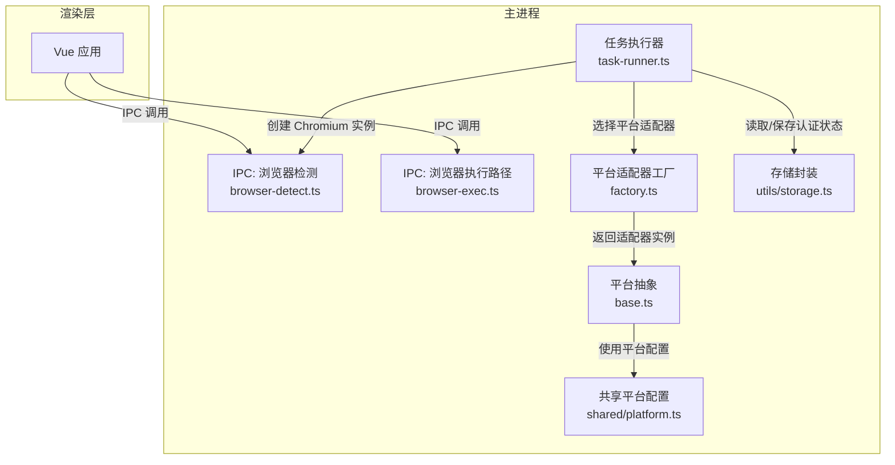
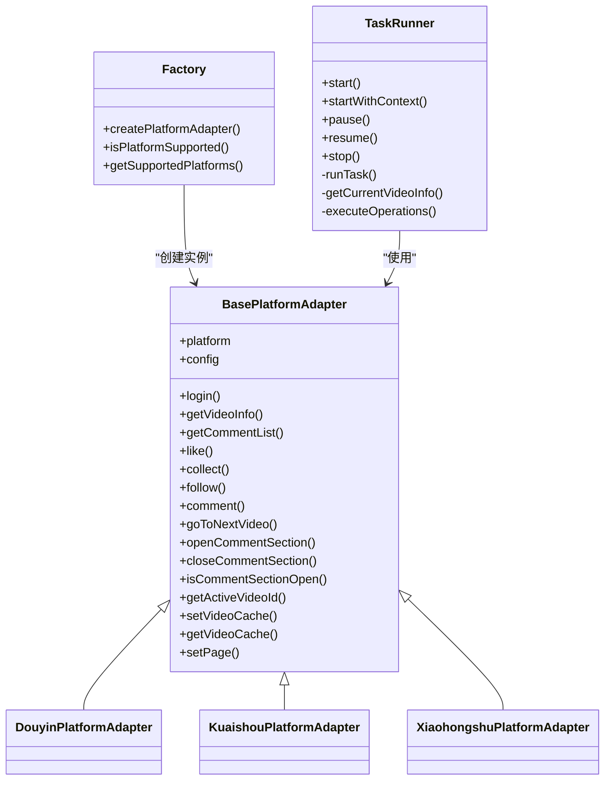
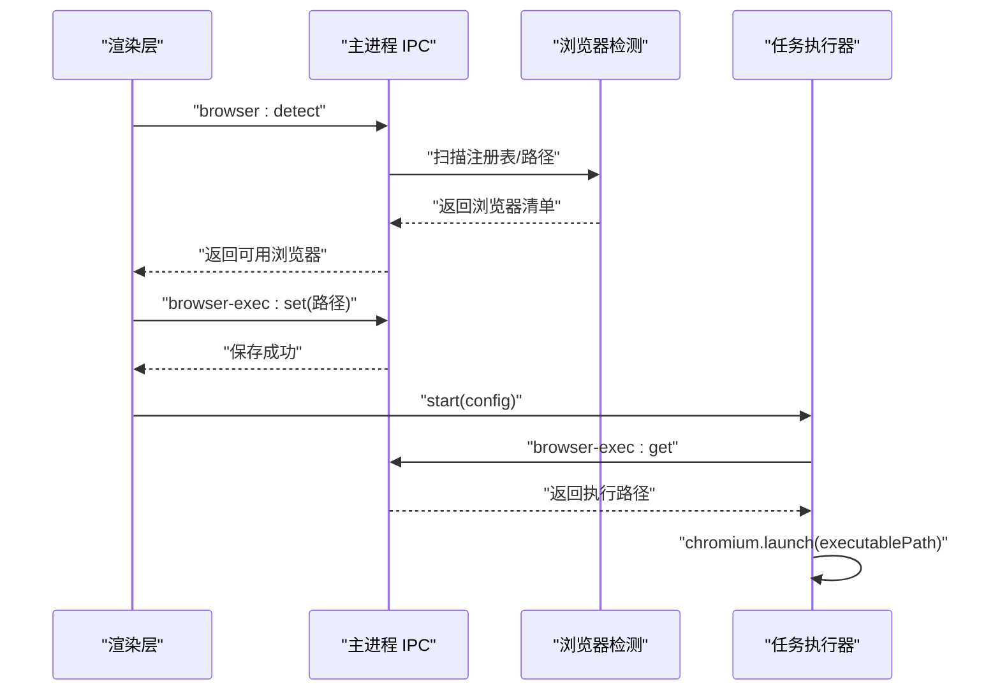
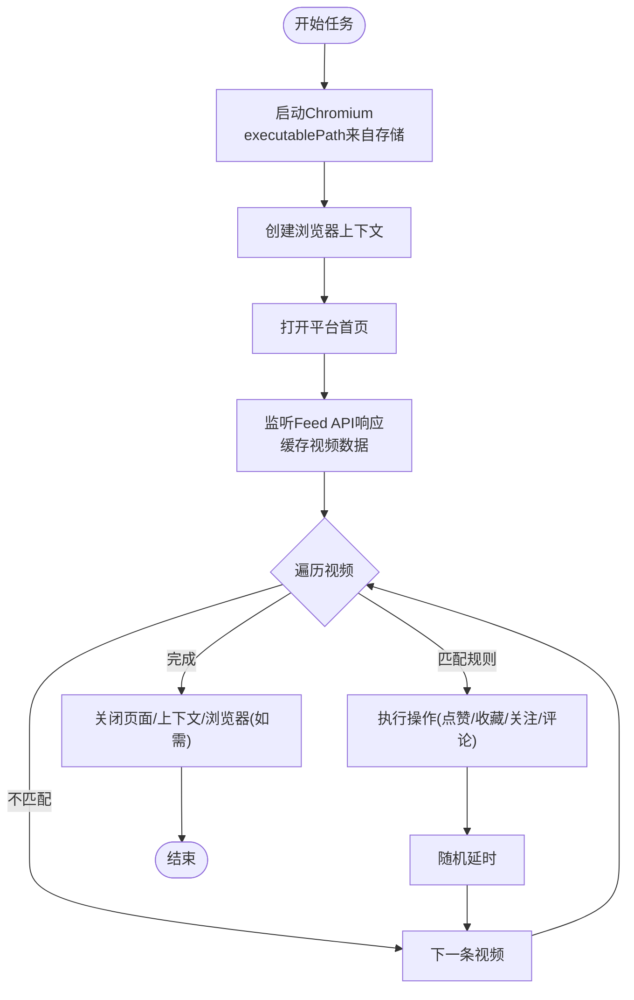
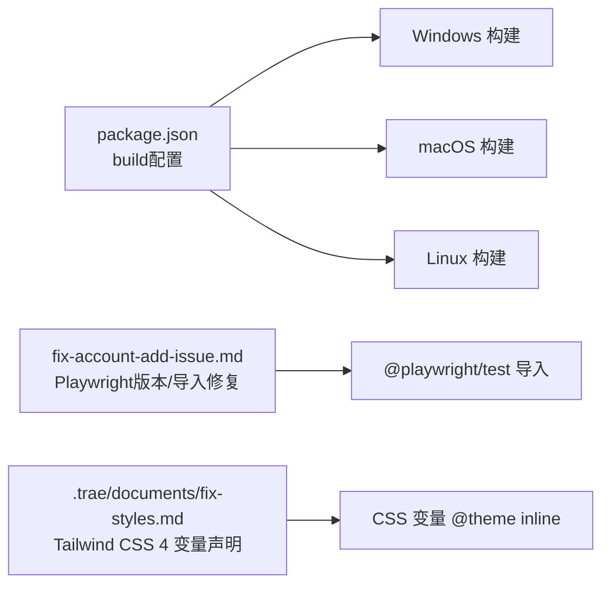

# 平台兼容性问题

<cite>
**本文引用的文件**
- [README.md](file://README.md)
- [package.json](file://package.json)
- [src/main/ipc/browser-detect.ts](file://src/main/ipc/browser-detect.ts)
- [src/main/ipc/browser-exec.ts](file://src/main/ipc/browser-exec.ts)
- [src/main/utils/storage.ts](file://src/main/utils/storage.ts)
- [src/main/platform/base.ts](file://src/main/platform/base.ts)
- [src/main/platform/factory.ts](file://src/main/platform/factory.ts)
- [src/shared/platform.ts](file://src/shared/platform.ts)
- [src/main/service/task-runner.ts](file://src/main/service/task-runner.ts)
- [.trae/documents/autoops-expansion-plan.md](file://.trae/documents/autoops-expansion-plan.md)
- [.trae/documents/fix-account-add-issue.md](file://.trae/documents/fix-account-add-issue.md)
- [.trae/documents/fix-styles.md](file://.trae/documents/fix-styles.md)
- [.trae/documents/任务启动无反应排查计划.md](file://.trae/documents/任务启动无反应排查计划.md)
</cite>

## 目录
1. [简介](#简介)
2. [项目结构](#项目结构)
3. [核心组件](#核心组件)
4. [架构总览](#架构总览)
5. [详细组件分析](#详细组件分析)
6. [依赖分析](#依赖分析)
7. [性能考虑](#性能考虑)
8. [故障排除指南](#故障排除指南)
9. [结论](#结论)
10. [附录](#附录)

## 简介
本文件面向AutoOps平台的兼容性问题，聚焦于不同操作系统、浏览器版本、硬件配置、网络环境与安全策略对平台运行的影响。结合仓库中的IPC浏览器检测、Playwright启动、平台适配器与任务执行流程，给出系统性的兼容性诊断方法、平台特定解决方案、降级策略与替代方案，并提供可复现的问题排查步骤。

## 项目结构
AutoOps采用Electron主进程 + Vue渲染层 + Playwright浏览器自动化架构。主进程负责：
- 浏览器路径检测与存储
- 任务执行引擎（基于Playwright）
- 平台适配器（抖音/快手/小红书等）
- IPC通信与状态持久化

图表来源
- [src/main/ipc/browser-detect.ts:105-118](file://src/main/ipc/browser-detect.ts#L105-L118)
- [src/main/ipc/browser-exec.ts:4-13](file://src/main/ipc/browser-exec.ts#L4-L13)
- [src/main/service/task-runner.ts:67-90](file://src/main/service/task-runner.ts#L67-L90)
- [src/main/platform/factory.ts:7-18](file://src/main/platform/factory.ts#L7-L18)
- [src/main/platform/base.ts:24-80](file://src/main/platform/base.ts#L24-L80)
- [src/shared/platform.ts:88-200](file://src/shared/platform.ts#L88-L200)
- [src/main/utils/storage.ts:14-25](file://src/main/utils/storage.ts#L14-L25)

章节来源
- [README.md: 36-54:36-54](file://README.md#L36-L54)
- [package.json: 16-50:16-50](file://package.json#L16-L50)

## 核心组件
- 浏览器检测与执行路径管理：通过IPC在主进程检测系统中可用的浏览器并持久化执行路径，供任务执行器启动Chromium使用。
- 任务执行器：基于Playwright启动浏览器上下文，加载平台首页，监听API响应缓存视频数据，执行规则匹配与自动化操作。
- 平台适配器：抽象不同平台的元素选择器、API端点与键盘快捷键，统一登录、点赞、收藏、关注、评论等操作。
- 存储封装：使用electron-store持久化浏览器执行路径、认证状态、任务历史等。

章节来源
- [src/main/ipc/browser-detect.ts: 105-118:105-118](file://src/main/ipc/browser-detect.ts#L105-L118)
- [src/main/ipc/browser-exec.ts: 4-13:4-13](file://src/main/ipc/browser-exec.ts#L4-L13)
- [src/main/service/task-runner.ts: 55-113:55-113](file://src/main/service/task-runner.ts#L55-L113)
- [src/main/platform/base.ts: 24-80:24-80](file://src/main/platform/base.ts#L24-L80)
- [src/shared/platform.ts: 88-200:88-200](file://src/shared/platform.ts#L88-L200)
- [src/main/utils/storage.ts: 14-25:14-25](file://src/main/utils/storage.ts#L14-L25)

## 架构总览
AutoOps以“平台适配器 + 任务引擎”为核心，通过IPC桥接渲染层与主进程，利用Playwright驱动浏览器自动化。平台配置集中于共享模块，适配器按平台差异化实现。

图表来源
- [src/main/platform/base.ts: 24-80:24-80](file://src/main/platform/base.ts#L24-L80)
- [src/main/platform/factory.ts: 7-18:7-18](file://src/main/platform/factory.ts#L7-L18)
- [src/main/service/task-runner.ts: 25-113:25-113](file://src/main/service/task-runner.ts#L25-L113)

## 详细组件分析

### 浏览器检测与执行路径（跨平台）
- Windows/macOS/Linux分别维护常见浏览器安装路径集合，支持Chrome、Chromium、Edge。
- 通过注册IPC处理器提供“browser:detect”，返回去重后的浏览器清单；另提供“browser-exec:get/set”用于读取/设置Chromium可执行路径。
- 任务执行器通过该路径启动Chromium，避免因系统未安装或路径不正确导致的启动失败。

图表来源
- [src/main/ipc/browser-detect.ts: 105-118:105-118](file://src/main/ipc/browser-detect.ts#L105-L118)
- [src/main/ipc/browser-exec.ts: 4-13:4-13](file://src/main/ipc/browser-exec.ts#L4-L13)
- [src/main/service/task-runner.ts: 67-70:67-70](file://src/main/service/task-runner.ts#L67-L70)

章节来源
- [src/main/ipc/browser-detect.ts: 12-33:12-33](file://src/main/ipc/browser-detect.ts#L12-L33)
- [src/main/ipc/browser-detect.ts: 47-103:47-103](file://src/main/ipc/browser-detect.ts#L47-L103)
- [src/main/ipc/browser-exec.ts: 4-13:4-13](file://src/main/ipc/browser-exec.ts#L4-L13)
- [src/main/service/task-runner.ts: 67-70:67-70](file://src/main/service/task-runner.ts#L67-L70)

### 任务执行器与平台适配器（平台差异）
- 任务执行器根据配置启动Chromium，创建上下文并打开平台首页；监听平台Feed API响应，缓存视频数据。
- 平台适配器定义各平台的选择器、API端点与键盘快捷键；工厂方法按平台创建对应适配器实例。
- 适配器统一暴露登录、点赞、收藏、关注、评论等操作，屏蔽平台差异。

图表来源
- [src/main/service/task-runner.ts: 55-113:55-113](file://src/main/service/task-runner.ts#L55-L113)
- [src/main/service/task-runner.ts: 160-180:160-180](file://src/main/service/task-runner.ts#L160-L180)
- [src/main/platform/factory.ts: 7-18:7-18](file://src/main/platform/factory.ts#L7-L18)
- [src/shared/platform.ts: 88-200:88-200](file://src/shared/platform.ts#L88-L200)

章节来源
- [src/main/service/task-runner.ts: 235-371:235-371](file://src/main/service/task-runner.ts#L235-L371)
- [src/main/platform/base.ts: 24-80:24-80](file://src/main/platform/base.ts#L24-L80)
- [src/shared/platform.ts: 88-200:88-200](file://src/shared/platform.ts#L88-L200)

### 存储与配置（跨平台一致性）
- electron-store提供键值存储，包括浏览器执行路径、认证状态、任务历史等。
- 任务执行器在关闭时保存上下文状态，重启后可恢复登录态，减少重复登录开销。

章节来源
- [src/main/utils/storage.ts: 14-25:14-25](file://src/main/utils/storage.ts#L14-L25)
- [src/main/service/task-runner.ts: 212-233:212-233](file://src/main/service/task-runner.ts#L212-L233)

## 依赖分析
- Electron版本与构建目标：项目声明了Windows/macOS/Linux的构建目标与产物类型，确保跨平台打包一致。
- Playwright版本与安装：文档指出Playwright版本与导入模块需与依赖保持一致，避免运行时找不到模块。
- Tailwind CSS 4：样式变量与类名语法在CSS层面有特殊要求，需在@theme inline中显式声明变量。

图表来源
- [package.json: 51-84:51-84](file://package.json#L51-L84)
- [.trae/documents/fix-account-add-issue.md: 5-15:5-15](file://.trae/documents/fix-account-add-issue.md#L5-L15)
- [.trae/documents/fix-styles.md: 12-18:12-18](file://.trae/documents/fix-styles.md#L12-L18)

章节来源
- [package.json: 51-84:51-84](file://package.json#L51-L84)
- [.trae/documents/fix-account-add-issue.md: 5-15:5-15](file://.trae/documents/fix-account-add-issue.md#L5-L15)
- [.trae/documents/fix-styles.md: 12-18:12-18](file://.trae/documents/fix-styles.md#L12-L18)

## 性能考虑
- 任务执行器内置随机延时与并发控制（如组合任务的概率与停止策略），降低被风控概率。
- 通过监听Feed API响应缓存视频数据，减少重复请求与DOM查询。
- 平台适配器统一抽象，便于未来扩展更多平台与优化策略。

章节来源
- [src/main/service/task-runner.ts: 324-352:324-352](file://src/main/service/task-runner.ts#L324-L352)
- [src/main/service/task-runner.ts: 160-180:160-180](file://src/main/service/task-runner.ts#L160-L180)

## 故障排除指南

### 一、操作系统与浏览器兼容性
- Windows
  - 症状：无法检测到Chrome/Edge或启动失败
  - 排查要点：检查注册表项与常见安装路径是否存在；确认executablePath是否指向有效可执行文件
  - 解决方案：通过“browser-exec:set”设置正确的Chromium可执行路径；必要时以管理员权限安装浏览器
- macOS
  - 症状：应用启动后无响应或浏览器未打开
  - 排查要点：确认/Applications下的浏览器可执行路径；检查沙箱与权限设置
  - 解决方案：使用绝对路径设置browser-exec；若为App Store版浏览器，确认其可被命令行调用
- Linux
  - 症状：找不到浏览器或启动崩溃
  - 排查要点：确认/usr/bin或/snap/bin下的浏览器可执行文件；检查X11/wayland会话
  - 解决方案：使用官方包管理器安装Chromium/Chrome；设置browser-exec为实际可执行路径

章节来源
- [src/main/ipc/browser-detect.ts: 12-33:12-33](file://src/main/ipc/browser-detect.ts#L12-L33)
- [src/main/ipc/browser-exec.ts: 4-13:4-13](file://src/main/ipc/browser-exec.ts#L4-L13)
- [src/main/service/task-runner.ts: 67-70:67-70](file://src/main/service/task-runner.ts#L67-L70)

### 二、浏览器版本与Playwright兼容性
- 症状：运行时报Cannot find module 'playwright'或功能异常
- 排查要点：确认package.json中依赖为@playwright/test；检查导入模块是否与依赖一致
- 解决方案：升级到推荐版本并安装Chromium；修正导入语句为@playwright/test

章节来源
- [.trae/documents/fix-account-add-issue.md: 5-15:5-15](file://.trae/documents/fix-account-add-issue.md#L5-L15)
- [.trae/documents/fix-account-add-issue.md: 18-22:18-22](file://.trae/documents/fix-account-add-issue.md#L18-L22)

### 三、分辨率与DPI设置问题
- 症状：UI元素重叠、点击失效、滚动异常
- 排查要点：确认渲染层CSS变量与Tailwind 4语法；检查@theme inline中是否声明了所需变量
- 解决方案：在CSS中显式声明所需变量；确保类名语法与Tailwind 4兼容

章节来源
- [.trae/documents/fix-styles.md: 12-18:12-18](file://.trae/documents/fix-styles.md#L12-L18)
- [.trae/documents/fix-styles.md: 28-33:28-33](file://.trae/documents/fix-styles.md#L28-L33)

### 四、网络环境与代理/防火墙
- 症状：任务启动后无法访问平台首页或API请求失败
- 排查要点：确认系统代理设置；检查企业防火墙对平台域名的放行；验证DNS解析
- 解决方案：在系统或应用层配置HTTP代理；为平台域名添加白名单；使用开发者工具检查网络拦截

### 五、平台API差异与权限模型
- 症状：不同平台出现登录失败、元素选择器不匹配、操作不可见
- 排查要点：核对平台配置中的选择器与API端点；确认适配器实现是否覆盖平台差异
- 解决方案：按平台更新选择器与端点；在适配器中补充平台特有的登录/验证流程

章节来源
- [src/shared/platform.ts: 88-200:88-200](file://src/shared/platform.ts#L88-L200)
- [src/main/platform/factory.ts: 7-18:7-18](file://src/main/platform/factory.ts#L7-L18)

### 六、任务启动无反应
- 症状：点击启动按钮无响应
- 排查要点：检查IPC通道是否建立；确认TaskRunner初始化与异常捕获；检查浏览器执行路径是否配置
- 解决方案：在IPC handler与前端store中添加日志与错误处理；修复适配器缓存字段遮蔽问题

章节来源
- [.trae/documents/任务启动无反应排查计划.md: 6-16:6-16](file://.trae/documents/任务启动无反应排查计划.md#L6-L16)
- [.trae/documents/任务启动无反应排查计划.md: 31-48:31-48](file://.trae/documents/任务启动无反应排查计划.md#L31-L48)

### 七、兼容性测试与问题复现步骤
- 测试矩阵
  - 操作系统：Windows 10/11、macOS 12+/13+、Ubuntu 22.04/24.04
  - 浏览器：Chrome 120+、Chromium 120+、Edge 120+
  - 分辨率：1920x1080、2560x1440、3840x2160；DPI：100%/125%/150%
  - 网络：直连、公司代理、移动热点
- 复现步骤
  - 清理存储与缓存，重新配置浏览器执行路径
  - 在不同分辨率/DPI下运行任务，记录失败场景
  - 更换网络环境，观察平台访问与API响应
  - 对比不同平台适配器的行为差异，定位选择器或端点问题

章节来源
- [src/main/ipc/browser-exec.ts: 4-13:4-13](file://src/main/ipc/browser-exec.ts#L4-L13)
- [src/main/service/task-runner.ts: 55-113:55-113](file://src/main/service/task-runner.ts#L55-L113)
- [src/shared/platform.ts: 88-200:88-200](file://src/shared/platform.ts#L88-L200)

## 结论
AutoOps通过平台适配器与任务执行器实现了对多平台的统一抽象，结合浏览器检测与存储机制，可在不同操作系统与浏览器环境下稳定运行。针对兼容性问题，建议优先解决浏览器路径与Playwright版本一致性、样式变量声明与网络代理配置，并在任务启动与平台适配器层面完善日志与错误处理，以提升可诊断性与稳定性。

## 附录
- 扩展计划：项目文档明确了平台抽象层、账号体系、任务类型与AI分析的扩展方向，有助于进一步降低平台间差异带来的兼容性挑战。

章节来源
- [.trae/documents/autoops-expansion-plan.md: 25-60:25-60](file://.trae/documents/autoops-expansion-plan.md#L25-L60)