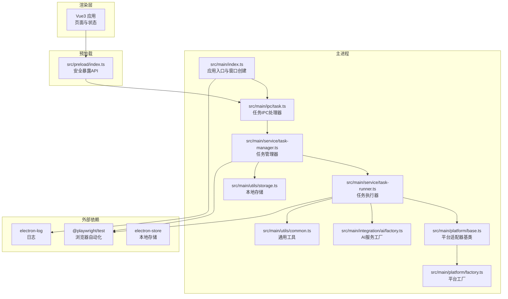
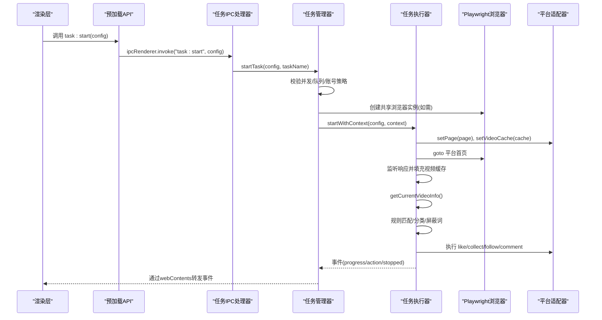
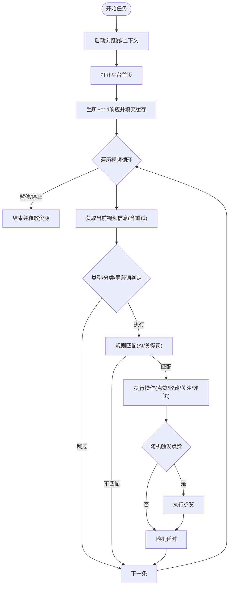
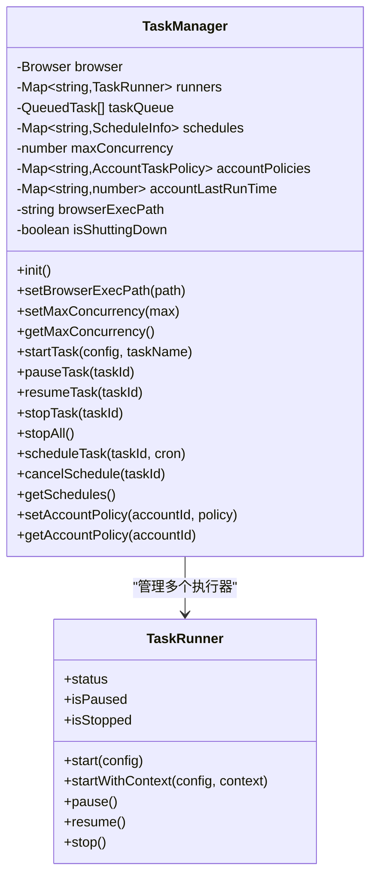
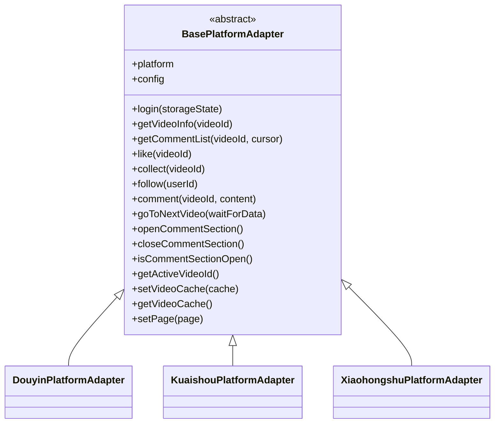
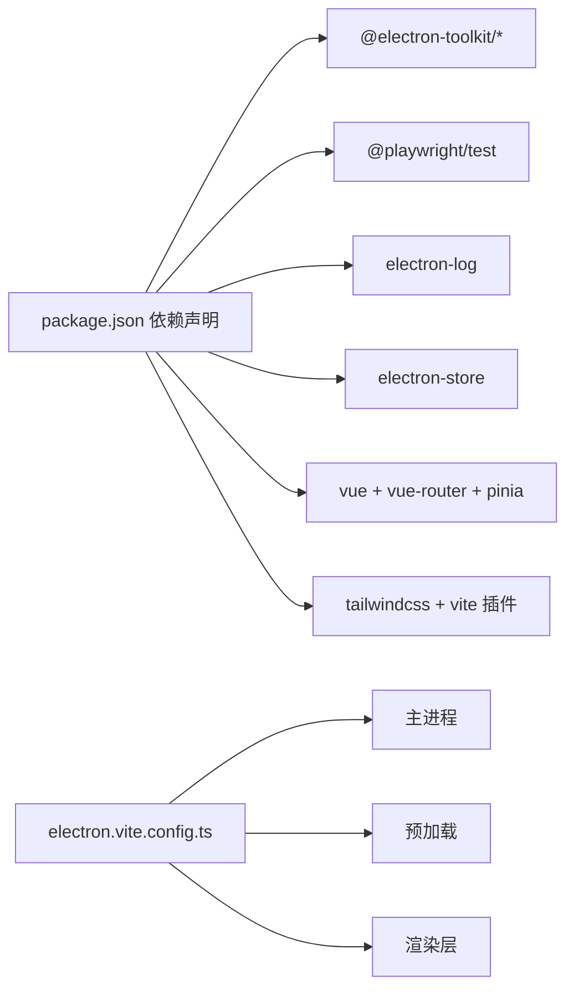

# 性能问题排查

<cite>
**本文引用的文件**   
- [package.json](file://package.json)
- [electron.vite.config.ts](file://electron.vite.config.ts)
- [src/main/index.ts](file://src/main/index.ts)
- [src/preload/index.ts](file://src/preload/index.ts)
- [src/main/service/task-runner.ts](file://src/main/service/task-runner.ts)
- [src/main/service/task-manager.ts](file://src/main/service/task-manager.ts)
- [src/main/ipc/task.ts](file://src/main/ipc/task.ts)
- [src/main/utils/common.ts](file://src/main/utils/common.ts)
- [src/main/utils/storage.ts](file://src/main/utils/storage.ts)
- [src/shared/platform.ts](file://src/shared/platform.ts)
- [src/main/platform/base.ts](file://src/main/platform/base.ts)
- [src/main/platform/factory.ts](file://src/main/platform/factory.ts)
- [src/main/integration/ai/factory.ts](file://src/main/integration/ai/factory.ts)
- [README.md](file://README.md)
</cite>

## 目录
1. [简介](#简介)
2. [项目结构](#项目结构)
3. [核心组件](#核心组件)
4. [架构总览](#架构总览)
5. [详细组件分析](#详细组件分析)
6. [依赖分析](#依赖分析)
7. [性能考量](#性能考量)
8. [故障排查指南](#故障排查指南)
9. [结论](#结论)
10. [附录](#附录)

## 简介
本指南面向AutoOps项目在实际运行中的性能问题排查与优化，聚焦以下关键场景：
- 应用启动缓慢
- 任务执行效率低
- 内存占用过高
- CPU使用率异常
- 浏览器自动化性能优化
- 并发任务管理与资源池配置
- 缓存策略、异步处理与数据库查询优化
- 性能基准测试、压力测试与回归检测
- 系统资源监控、进程分析与内存泄漏检测

通过结合主进程、预加载层、渲染层以及Playwright驱动的浏览器自动化链路，给出可落地的定位方法、优化建议与工具使用说明。

## 项目结构
AutoOps采用Electron + Vue3 + Playwright的架构，主进程负责任务编排与浏览器生命周期管理，预加载层提供安全的IPC接口，渲染层为用户界面与配置交互入口；业务逻辑集中在主进程的服务层，包括任务调度、规则匹配、AI评论生成与平台适配器。

**图表来源**
- [src/main/index.ts:1-106](file://src/main/index.ts#L1-L106)
- [src/main/ipc/task.ts:1-243](file://src/main/ipc/task.ts#L1-L243)
- [src/main/service/task-manager.ts:1-515](file://src/main/service/task-manager.ts#L1-L515)
- [src/main/service/task-runner.ts:1-760](file://src/main/service/task-runner.ts#L1-L760)
- [src/main/platform/base.ts:1-105](file://src/main/platform/base.ts#L1-L105)
- [src/main/platform/factory.ts:1-32](file://src/main/platform/factory.ts#L1-L32)
- [src/main/integration/ai/factory.ts:1-27](file://src/main/integration/ai/factory.ts#L1-L27)
- [src/main/utils/common.ts:1-11](file://src/main/utils/common.ts#L1-L11)
- [src/main/utils/storage.ts:1-46](file://src/main/utils/storage.ts#L1-L46)

**章节来源**
- [README.md:1-54](file://README.md#L1-L54)
- [electron.vite.config.ts:1-34](file://electron.vite.config.ts#L1-L34)

## 核心组件
- 应用入口与窗口：负责初始化日志、注册IPC、创建主窗口与URL加载。
- 任务IPC处理器：统一接收渲染层任务请求，校验浏览器路径，委派给任务管理器。
- 任务管理器：维护共享浏览器实例、并发控制、队列调度、定时任务、账号策略与持久化。
- 任务执行器：基于Playwright驱动浏览器，执行视频发现、规则匹配、AI评论生成与平台操作。
- 平台适配器：抽象各平台的选择器、API端点与操作流程，支持多平台扩展。
- AI服务工厂：按配置创建不同AI平台的服务实例，用于评论生成与视频分类。
- 预加载API桥：在安全上下文中向渲染层暴露有限的IPC接口，避免直接暴露Node能力。
- 通用工具与存储：提供随机延时、ID生成、本地存储封装。

**章节来源**
- [src/main/index.ts:1-106](file://src/main/index.ts#L1-L106)
- [src/main/ipc/task.ts:1-243](file://src/main/ipc/task.ts#L1-L243)
- [src/main/service/task-manager.ts:1-515](file://src/main/service/task-manager.ts#L1-L515)
- [src/main/service/task-runner.ts:1-760](file://src/main/service/task-runner.ts#L1-L760)
- [src/main/platform/base.ts:1-105](file://src/main/platform/base.ts#L1-L105)
- [src/main/platform/factory.ts:1-32](file://src/main/platform/factory.ts#L1-L32)
- [src/main/integration/ai/factory.ts:1-27](file://src/main/integration/ai/factory.ts#L1-L27)
- [src/preload/index.ts:1-234](file://src/preload/index.ts#L1-L234)
- [src/main/utils/common.ts:1-11](file://src/main/utils/common.ts#L1-L11)
- [src/main/utils/storage.ts:1-46](file://src/main/utils/storage.ts#L1-L46)

## 架构总览
下图展示从渲染层发起任务到浏览器自动化执行的关键路径，以及事件流与数据流：

**图表来源**
- [src/main/ipc/task.ts:81-132](file://src/main/ipc/task.ts#L81-L132)
- [src/main/service/task-manager.ts:178-230](file://src/main/service/task-manager.ts#L178-L230)
- [src/main/service/task-runner.ts:55-113](file://src/main/service/task-runner.ts#L55-L113)
- [src/main/platform/base.ts:24-80](file://src/main/platform/base.ts#L24-L80)

## 详细组件分析

### 任务执行器（TaskRunner）性能剖析
- 浏览器与上下文生命周期：独立启动时创建浏览器实例，共享上下文时仅新建Page，减少实例成本。
- 视频缓存：监听平台Feed响应，批量写入缓存，降低重复抓取开销。
- 规则匹配与AI辅助：支持关键词白/黑名单与AI视频分类，命中后才进入操作阶段，减少无效点击。
- 随机延时与概率：模拟真人行为，降低风控风险，但会增加整体耗时，需权衡。
- 事件驱动：通过EventEmitter分发进度、动作与状态变更，便于前端及时反馈。

**图表来源**
- [src/main/service/task-runner.ts:235-371](file://src/main/service/task-runner.ts#L235-L371)
- [src/main/service/task-runner.ts:160-180](file://src/main/service/task-runner.ts#L160-L180)
- [src/main/service/task-runner.ts:373-418](file://src/main/service/task-runner.ts#L373-L418)

**章节来源**
- [src/main/service/task-runner.ts:1-760](file://src/main/service/task-runner.ts#L1-L760)

### 任务管理器（TaskManager）并发与资源池
- 共享浏览器：首次使用时启动Chromium实例，后续任务复用，避免多次冷启动。
- 并发上限：通过maxConcurrency限制同时运行的任务数，默认3，可通过IPC设置。
- 队列机制：超出并发时入队，空闲时出队启动，保证吞吐与稳定性。
- 账号策略：按账号维度限制并发与冷却时间，防止被平台风控。
- 定时任务：基于cron解析与定时器轮询，定期检查并触发任务。
- 持久化：并发配置、定时任务列表持久化至本地存储。

**图表来源**
- [src/main/service/task-manager.ts:47-515](file://src/main/service/task-manager.ts#L47-L515)
- [src/main/service/task-runner.ts:25-760](file://src/main/service/task-runner.ts#L25-L760)

**章节来源**
- [src/main/service/task-manager.ts:1-515](file://src/main/service/task-manager.ts#L1-L515)

### 平台适配器与缓存策略
- 适配器基类：统一登录、视频信息、评论、操作与导航接口，支持多平台扩展。
- 视频缓存：TaskRunner监听Feed响应，将aweme_list写入缓存，减少DOM解析与网络请求。
- 选择器与端点：各平台选择器与API端点集中配置，便于维护与升级。

**图表来源**
- [src/main/platform/base.ts:24-80](file://src/main/platform/base.ts#L24-L80)
- [src/main/platform/factory.ts:7-18](file://src/main/platform/factory.ts#L7-L18)

**章节来源**
- [src/main/platform/base.ts:1-105](file://src/main/platform/base.ts#L1-L105)
- [src/main/platform/factory.ts:1-32](file://src/main/platform/factory.ts#L1-L32)
- [src/shared/platform.ts:1-260](file://src/shared/platform.ts#L1-L260)

### AI服务与异步优化
- AI工厂：按平台映射具体服务类，统一创建与调用。
- 评论生成：可选使用AI生成，失败回退到备选文案；可获取热门评论作为上下文。
- 分类与规则：AI视频分类与规则匹配在执行前进行，减少无效操作。

**章节来源**
- [src/main/integration/ai/factory.ts:1-27](file://src/main/integration/ai/factory.ts#L1-L27)
- [src/main/service/task-runner.ts:614-679](file://src/main/service/task-runner.ts#L614-L679)

## 依赖分析
- Electron与构建：electron-vite配置主/预加载/渲染三段式构建，主进程外置依赖以减少打包体积。
- 运行时依赖：@playwright/test驱动浏览器自动化；electron-log提供日志；electron-store提供本地存储。
- 渲染层：Vue3 + Vite + TailwindCSS，组件化UI与状态管理。

**图表来源**
- [package.json:16-34](file://package.json#L16-L34)
- [electron.vite.config.ts:6-34](file://electron.vite.config.ts#L6-L34)

**章节来源**
- [package.json:1-86](file://package.json#L1-L86)
- [electron.vite.config.ts:1-34](file://electron.vite.config.ts#L1-L34)

## 性能考量
- 启动性能
  - 主进程窗口延迟显示：ready-to-show后再show，避免白屏。
  - 日志初始化：应用启动即初始化日志，便于早期诊断。
  - 构建优化：主进程外置依赖，减少打包体积与冷启动时间。
- 任务执行效率
  - 共享浏览器：避免重复启动Chromium带来的冷启动开销。
  - 视频缓存：监听Feed响应填充缓存，减少DOM解析与网络请求。
  - 并发控制：通过maxConcurrency与账号策略限制并发，平衡吞吐与风控风险。
  - 随机延时：模拟真人行为，降低风控概率，但会增加总耗时，建议按场景调整。
- 内存与CPU
  - 事件驱动与轻量存储：使用Map缓存视频数据，注意及时清理，避免内存膨胀。
  - 任务停止时释放Page/Context/Browser，确保上下文关闭与storageState保存。
  - 定时器轮询：每分钟检查一次cron，避免高频轮询造成CPU占用。
- 浏览器自动化优化
  - headless: false用于调试，生产环境可考虑headless以节省资源。
  - 选择器与API端点配置集中管理，减少DOM查找与网络请求。
- 数据与配置
  - 本地存储：electron-store默认持久化，注意键空间与序列化开销。
  - 配置迁移：设置版本迁移（V2->V3），避免重复解析与转换。

**章节来源**
- [src/main/index.ts:22-52](file://src/main/index.ts#L22-L52)
- [src/main/service/task-manager.ts:111-127](file://src/main/service/task-manager.ts#L111-L127)
- [src/main/service/task-runner.ts:160-180](file://src/main/service/task-runner.ts#L160-L180)
- [src/main/service/task-manager.ts:407-455](file://src/main/service/task-manager.ts#L407-L455)
- [src/main/utils/storage.ts:14-25](file://src/main/utils/storage.ts#L14-L25)

## 故障排查指南

### 应用启动缓慢
- 检查主进程窗口创建与URL加载路径，确认开发/生产环境分支正确。
- 查看日志初始化与IPC注册顺序，确保日志可用。
- 构建配置：确认主进程外置依赖生效，避免不必要的打包。

**章节来源**
- [src/main/index.ts:54-84](file://src/main/index.ts#L54-L84)
- [electron.vite.config.ts:13-14](file://electron.vite.config.ts#L13-L14)

### 任务执行效率低
- 并发与队列：通过IPC设置并发上限，观察队列长度与任务启动延迟。
- 视频缓存：确认Feed监听是否正常，缓存命中率是否提升。
- 规则匹配：减少AI分类调用频率，优先使用关键词匹配。
- 随机延时：适当缩短延时范围，提高吞吐。

**章节来源**
- [src/main/ipc/task.ts:220-229](file://src/main/ipc/task.ts#L220-L229)
- [src/main/service/task-manager.ts:361-384](file://src/main/service/task-manager.ts#L361-L384)
- [src/main/service/task-runner.ts:160-180](file://src/main/service/task-runner.ts#L160-L180)
- [src/main/service/task-runner.ts:503-559](file://src/main/service/task-runner.ts#L503-L559)

### 内存占用过高
- 缓存清理：TaskRunner在获取视频信息后清理缓存，避免长期累积。
- 上下文释放：任务停止时保存storageState并关闭Page/Context/Browser。
- 本地存储：定期清理不需要的历史记录与模板，避免键空间膨胀。

**章节来源**
- [src/main/service/task-runner.ts:395-414](file://src/main/service/task-runner.ts#L395-L414)
- [src/main/service/task-runner.ts:212-233](file://src/main/service/task-runner.ts#L212-L233)
- [src/main/utils/storage.ts:14-25](file://src/main/utils/storage.ts#L14-L25)

### CPU使用率异常
- 定时器轮询：每分钟检查一次cron，避免高频轮询。
- 事件监听：仅在必要时开启响应监听，减少事件风暴。
- 并发控制：合理设置maxConcurrency，避免过多任务竞争CPU。

**章节来源**
- [src/main/service/task-manager.ts:427-445](file://src/main/service/task-manager.ts#L427-L445)
- [src/main/service/task-runner.ts:160-180](file://src/main/service/task-runner.ts#L160-L180)

### 浏览器自动化性能优化
- 共享上下文：优先使用startWithContext，减少浏览器实例数量。
- 选择器与端点：确保选择器稳定，避免频繁重试导致CPU占用。
- 调试模式：headless: false仅用于调试，生产环境建议headless以节省资源。

**章节来源**
- [src/main/service/task-runner.ts:118-156](file://src/main/service/task-runner.ts#L118-L156)
- [src/main/shared/platform.ts:88-200](file://src/main/shared/platform.ts#L88-L200)

### 并发任务管理与资源池配置
- 并发上限：通过IPC设置maxConcurrency，观察队列与任务启动情况。
- 账号策略：为高风险账号设置较低并发与较长冷却时间。
- 定时任务：合理设置cron表达式，避免过于频繁的任务触发。

**章节来源**
- [src/main/ipc/task.ts:220-229](file://src/main/ipc/task.ts#L220-L229)
- [src/main/service/task-manager.ts:503-513](file://src/main/service/task-manager.ts#L503-L513)
- [src/main/service/task-manager.ts:407-455](file://src/main/service/task-manager.ts#L407-L455)

### 缓存策略与异步处理优化
- 视频缓存：监听Feed响应，批量写入Map，读取后及时清理。
- 异步事件：使用EventEmitter分发进度与动作，前端订阅以降低耦合。
- AI调用：失败回退到备选文案，减少重试次数。

**章节来源**
- [src/main/service/task-runner.ts:160-180](file://src/main/service/task-runner.ts#L160-L180)
- [src/main/service/task-runner.ts:667-679](file://src/main/service/task-runner.ts#L667-L679)

### 数据库查询优化
- 本地存储：electron-store为键值存储，适合配置与小型记录；复杂查询建议在渲染层进行内存过滤。
- 配置迁移：设置版本迁移，避免重复解析与转换。

**章节来源**
- [src/main/utils/storage.ts:14-25](file://src/main/utils/storage.ts#L14-L25)
- [src/main/ipc/task.ts:104-106](file://src/main/ipc/task.ts#L104-L106)

### 性能基准测试、压力测试与回归检测
- 基准测试：固定任务参数与环境，测量单任务耗时与吞吐，记录视频缓存命中率。
- 压力测试：逐步提升并发与任务数量，观察CPU、内存与任务成功率变化。
- 回归检测：在每次更新后重复基准测试，对比关键指标变化。

[本节为通用指导，无需特定文件引用]

### 系统资源监控、进程分析与内存泄漏检测
- 进程监控：使用系统自带任务管理器或第三方工具（如Process Explorer）观察CPU、内存与句柄。
- 内存泄漏检测：定期检查TaskRunner的videoCache大小与TaskManager的runners数量，确保停止后清理。
- 日志分析：利用electron-log输出关键事件与耗时，定位瓶颈环节。

**章节来源**
- [src/main/service/task-runner.ts:33-36](file://src/main/service/task-runner.ts#L33-L36)
- [src/main/service/task-manager.ts:49-77](file://src/main/service/task-manager.ts#L49-L77)

## 结论
AutoOps的性能优化围绕“共享浏览器、视频缓存、并发控制、规则前置与AI降级”展开。通过合理的并发上限、队列与账号策略、稳定的平台适配器与AI服务，可在保证稳定性的同时提升吞吐与用户体验。建议在生产环境中启用headless模式、合理设置延时与并发，并持续进行基准与压力测试以维持性能基线。

## 附录
- 预加载API能力概览：任务控制、设置管理、账户管理、文件选择、调试信息等，均通过ipcRenderer.invoke与事件回调暴露给渲染层。
- 构建与运行：开发模式使用electron-vite dev，构建模式使用electron-vite build，支持多平台打包。

**章节来源**
- [src/preload/index.ts:130-234](file://src/preload/index.ts#L130-L234)
- [README.md:23-34](file://README.md#L23-L34)