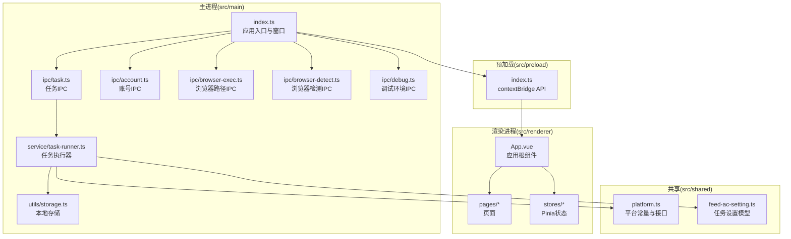
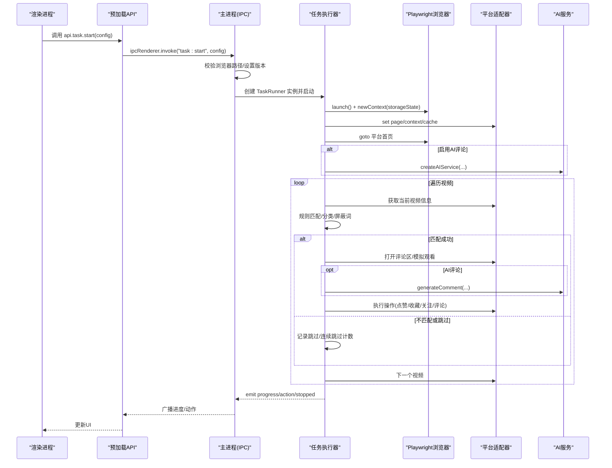
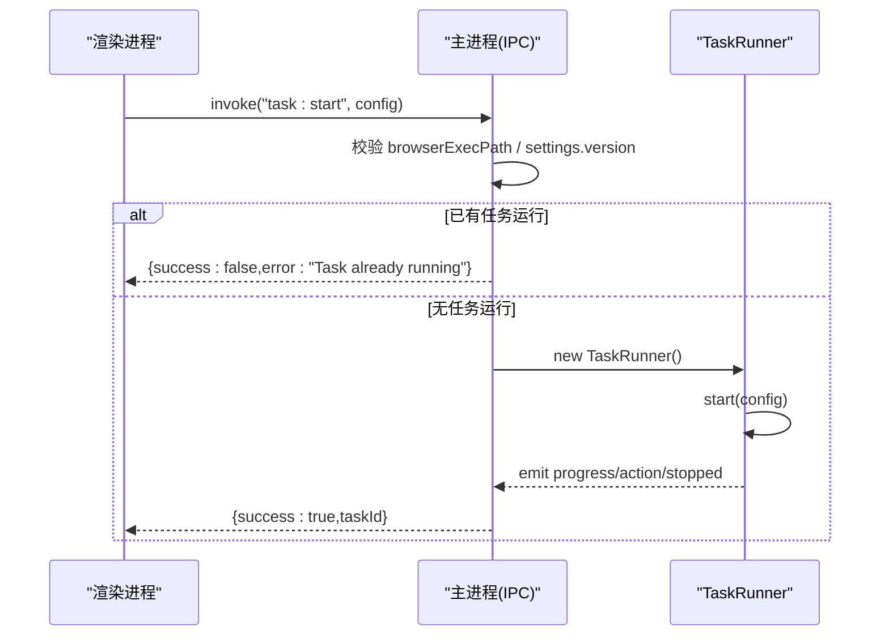
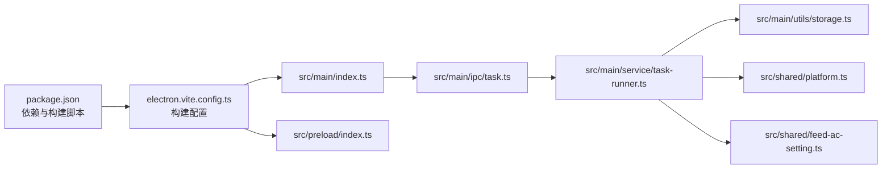

# 故障排除和FAQ

<cite>
**本文引用的文件**
- [package.json](file://package.json)
- [README.md](file://README.md)
- [electron.vite.config.ts](file://electron.vite.config.ts)
- [src/main/index.ts](file://src/main/index.ts)
- [src/preload/index.ts](file://src/preload/index.ts)
- [src/main/ipc/debug.ts](file://src/main/ipc/debug.ts)
- [src/main/ipc/task.ts](file://src/main/ipc/task.ts)
- [src/main/ipc/account.ts](file://src/main/ipc/account.ts)
- [src/main/ipc/browser-exec.ts](file://src/main/ipc/browser-exec.ts)
- [src/main/ipc/browser-detect.ts](file://src/main/ipc/browser-detect.ts)
- [src/main/service/task-runner.ts](file://src/main/service/task-runner.ts)
- [src/main/utils/storage.ts](file://src/main/utils/storage.ts)
- [src/shared/platform.ts](file://src/shared/platform.ts)
- [src/shared/feed-ac-setting.ts](file://src/shared/feed-ac-setting.ts)
</cite>

## 目录
1. [简介](#简介)
2. [项目结构](#项目结构)
3. [核心组件](#核心组件)
4. [架构总览](#架构总览)
5. [详细组件分析](#详细组件分析)
6. [依赖关系分析](#依赖关系分析)
7. [性能考虑](#性能考虑)
8. [故障排除指南](#故障排除指南)
9. [结论](#结论)
10. [附录](#附录)

## 简介
本文件面向使用 AutoOps 的用户与维护者，提供系统化的故障排除与常见问题解答（FAQ）。内容覆盖安装、运行、配置、平台兼容性、网络与权限问题、依赖冲突、错误码解释、异常处理与紧急恢复方案，并给出日志分析与性能优化建议。文档以仓库现有实现为依据，结合 IPC、主进程、渲染进程、任务执行器与存储层的交互进行说明。

## 项目结构
AutoOps 采用 Electron + Vue3 + Vite 的桌面应用架构，主要目录与职责如下：
- src/main：Electron 主进程，负责窗口、IPC 注册、任务执行器、日志与存储
- src/preload：预加载脚本，向渲染进程暴露受控 API
- src/renderer：Vue3 渲染进程，页面与状态管理
- src/shared：跨进程共享的数据模型与配置
- build：构建资源
- electron.vite.config.ts：开发与构建配置



图表来源
- [src/main/index.ts:1-106](file://src/main/index.ts#L1-L106)
- [src/preload/index.ts:1-187](file://src/preload/index.ts#L1-L187)
- [src/main/ipc/task.ts:1-104](file://src/main/ipc/task.ts#L1-L104)
- [src/main/ipc/account.ts:1-101](file://src/main/ipc/account.ts#L1-L101)
- [src/main/ipc/browser-exec.ts:1-13](file://src/main/ipc/browser-exec.ts#L1-L13)
- [src/main/ipc/browser-detect.ts:1-118](file://src/main/ipc/browser-detect.ts#L1-L118)
- [src/main/ipc/debug.ts:1-12](file://src/main/ipc/debug.ts#L1-L12)
- [src/main/service/task-runner.ts:1-760](file://src/main/service/task-runner.ts#L1-L760)
- [src/main/utils/storage.ts:1-46](file://src/main/utils/storage.ts#L1-L46)
- [src/shared/platform.ts:1-260](file://src/shared/platform.ts#L1-L260)
- [src/shared/feed-ac-setting.ts:1-149](file://src/shared/feed-ac-setting.ts#L1-L149)

章节来源
- [README.md:1-54](file://README.md#L1-L54)
- [electron.vite.config.ts:1-34](file://electron.vite.config.ts#L1-L34)

## 核心组件
- 应用入口与窗口：初始化日志、注册所有 IPC、创建主窗口、处理窗口事件
- 预加载 API：通过 contextBridge 暴露受控方法给渲染进程，涵盖认证、任务、账号、AI 设置、浏览器、文件选择、任务历史、模板、调试等
- 任务执行器：基于 Playwright 控制浏览器，适配不同平台，执行规则匹配、模拟真人行为、AI 评论生成、操作执行与状态上报
- 存储：electron-store 提供键值持久化，保存认证、设置、任务历史、账号、模板等
- 平台与设置：统一的平台常量、选择器、API 端点、任务类型与设置模型（含 v2 到 v3 的迁移）

章节来源
- [src/main/index.ts:1-106](file://src/main/index.ts#L1-L106)
- [src/preload/index.ts:1-187](file://src/preload/index.ts#L1-L187)
- [src/main/service/task-runner.ts:1-760](file://src/main/service/task-runner.ts#L1-L760)
- [src/main/utils/storage.ts:1-46](file://src/main/utils/storage.ts#L1-L46)
- [src/shared/platform.ts:1-260](file://src/shared/platform.ts#L1-L260)
- [src/shared/feed-ac-setting.ts:1-149](file://src/shared/feed-ac-setting.ts#L1-L149)

## 架构总览
下图展示从渲染进程发起任务到主进程执行、Playwright 控制浏览器、平台适配器与 AI 服务交互的整体流程。



图表来源
- [src/main/ipc/task.ts:1-104](file://src/main/ipc/task.ts#L1-L104)
- [src/main/service/task-runner.ts:1-760](file://src/main/service/task-runner.ts#L1-L760)
- [src/preload/index.ts:102-116](file://src/preload/index.ts#L102-L116)
- [src/shared/platform.ts:88-200](file://src/shared/platform.ts#L88-L200)
- [src/shared/feed-ac-setting.ts:37-70](file://src/shared/feed-ac-setting.ts#L37-L70)

## 详细组件分析

### 任务执行器（TaskRunner）
- 职责：启动/暂停/恢复/停止任务；监听平台 feed 数据缓存；执行规则匹配与操作；上报进度与动作；管理浏览器上下文生命周期
- 关键点：
  - 支持两种启动模式：独立浏览器实例或共享 BrowserContext（并行任务）
  - 通过适配器对接不同平台，读取选择器与 API 端点
  - AI 服务按需创建，支持热门评论参考与风格控制
  - 连续跳过阈值触发任务暂停，避免长时间无效轮询
  - 任务结束自动保存 storageState，便于下次登录复用

```mermaid
classDiagram
class TaskRunner {
+start(config) Promise~string~
+startWithContext(config, context) Promise~string~
+pause() Promise~void~
+resume() Promise~void~
+stop() Promise~void~
+on(event, listener) EventEmitter
-browser Browser
-context BrowserContext
-adapter BasePlatformAdapter
-page Page
-aiService AIService
-videoCache Map
-_status TaskRunnerStatus
}
class BasePlatformAdapter {
+setPage(page) void
+setVideoCache(cache) void
+getActiveVideoId() Promise~string~
+getVideoInfo(videoId) Promise~VideoInfo~
+openCommentSection() Promise~void~
+getCommentList(videoId) Promise~CommentListResult~
+getTopComments(videoId, n) Promise~CommentInfo[]~
+comment(videoId, text) Promise~CommentResult~
+like(videoId) Promise~OperationResult~
+collect(videoId) Promise~OperationResult~
+follow(userId) Promise~OperationResult~
+goToNextVideo() Promise~void~
}
class AIService {
+analyzeVideoType(input, prompt) Promise~{shouldWatch}~
+generateComment(context, options) Promise~{content}~
}
TaskRunner --> BasePlatformAdapter : "使用"
TaskRunner --> AIService : "可选使用"
```

图表来源
- [src/main/service/task-runner.ts:25-760](file://src/main/service/task-runner.ts#L25-L760)
- [src/shared/platform.ts:88-200](file://src/shared/platform.ts#L88-L200)
- [src/shared/feed-ac-setting.ts:37-70](file://src/shared/feed-ac-setting.ts#L37-L70)

章节来源
- [src/main/service/task-runner.ts:1-760](file://src/main/service/task-runner.ts#L1-L760)

### 任务IPC（IPC 任务）
- 职责：接收渲染进程的任务启动请求，校验浏览器路径与设置版本，创建 TaskRunner 并广播进度与动作事件
- 关键点：
  - 若已有任务运行，拒绝重复启动
  - 未配置浏览器路径时返回错误
  - 支持 v2 设置迁移至 v3
  - 任务停止后清理引用



图表来源
- [src/main/ipc/task.ts:11-84](file://src/main/ipc/task.ts#L11-L84)

章节来源
- [src/main/ipc/task.ts:1-104](file://src/main/ipc/task.ts#L1-L104)

### 浏览器路径与检测（IPC 浏览器）
- 职责：读取/设置浏览器可执行路径；扫描系统中可用浏览器并返回名称与版本
- 关键点：
  - Windows 通过注册表与常见路径探测
  - Linux/ macOS 通过常见安装路径探测
  - 仅在 Windows 读取版本号

章节来源
- [src/main/ipc/browser-exec.ts:1-13](file://src/main/ipc/browser-exec.ts#L1-L13)
- [src/main/ipc/browser-detect.ts:1-118](file://src/main/ipc/browser-detect.ts#L1-L118)

### 账号管理（IPC 账号）
- 职责：列表、新增、更新、删除、设置默认、查询默认、按平台筛选、获取有效账号
- 关键点：
  - 首次添加账号自动设为默认
  - 删除账号后若存在其他账号则自动补默认

章节来源
- [src/main/ipc/account.ts:1-101](file://src/main/ipc/account.ts#L1-L101)

### 预加载 API（contextBridge）
- 职责：向渲染进程暴露安全 API，包括认证、任务、账号、AI 设置、浏览器、文件选择、任务历史、任务 CRUD、模板与调试
- 关键点：
  - 通过 ipcRenderer.invoke 与主进程通信
  - 任务相关提供进度与动作事件订阅

章节来源
- [src/preload/index.ts:1-187](file://src/preload/index.ts#L1-L187)

### 存储（electron-store）
- 职责：持久化存储认证、设置、任务历史、账号、模板等
- 关键点：
  - 默认值集中定义
  - 提供 get/set 辅助方法

章节来源
- [src/main/utils/storage.ts:1-46](file://src/main/utils/storage.ts#L1-L46)

## 依赖关系分析
- 构建与打包：electron-vite 配置主/预加载/渲染三段入口与别名
- 运行时依赖：electron-log 日志、electron-store 存储、@playwright/test 浏览器驱动
- 平台与设置：共享的平台常量、选择器、API 端点与任务设置模型



图表来源
- [package.json:1-85](file://package.json#L1-L85)
- [electron.vite.config.ts:1-34](file://electron.vite.config.ts#L1-L34)
- [src/main/index.ts:1-106](file://src/main/index.ts#L1-L106)
- [src/main/ipc/task.ts:1-104](file://src/main/ipc/task.ts#L1-L104)
- [src/main/service/task-runner.ts:1-760](file://src/main/service/task-runner.ts#L1-L760)
- [src/main/utils/storage.ts:1-46](file://src/main/utils/storage.ts#L1-L46)
- [src/shared/platform.ts:1-260](file://src/shared/platform.ts#L1-L260)
- [src/shared/feed-ac-setting.ts:1-149](file://src/shared/feed-ac-setting.ts#L1-L149)

章节来源
- [package.json:1-85](file://package.json#L1-L85)
- [electron.vite.config.ts:1-34](file://electron.vite.config.ts#L1-L34)

## 性能考虑
- 浏览器实例管理：独立实例适合单任务，共享上下文适合多任务并行，减少内存占用
- 视频切换与等待：合理设置视频切换等待时间，避免频繁切换导致页面卡顿
- AI 评论：热门评论参考数量与生成策略影响性能，可根据网络与设备能力调整
- 事件广播：进度与动作事件在任务运行期间高频触发，渲染侧应避免过度重绘
- 存储写入：任务结束保存 storageState，注意磁盘 I/O 影响

## 故障排除指南

### 一、安装与构建问题
- 症状：首次安装后无法启动或构建报错
- 排查步骤：
  - 确认 Node.js 版本与依赖安装完整
  - 查看构建脚本与 electron-vite 配置
  - 在 Windows 上确保已安装构建工具链
- 参考文件：
  - [package.json:6-14](file://package.json#L6-L14)
  - [electron.vite.config.ts:1-34](file://electron.vite.config.ts#L1-L34)

章节来源
- [package.json:6-14](file://package.json#L6-L14)
- [electron.vite.config.ts:1-34](file://electron.vite.config.ts#L1-L34)

### 二、运行与启动问题
- 症状：应用启动黑屏或白屏
- 排查步骤：
  - 检查主进程日志初始化与窗口创建
  - 确认开发/生产环境加载路径正确
- 参考文件：
  - [src/main/index.ts:22-52](file://src/main/index.ts#L22-L52)

章节来源
- [src/main/index.ts:22-52](file://src/main/index.ts#L22-L52)

### 三、配置问题
- 症状：任务无法启动，提示“浏览器路径未配置”
- 排查步骤：
  - 通过浏览器检测功能确认系统中可用浏览器
  - 在设置中选择正确的浏览器可执行路径
  - 确认设置版本为 v3 或通过迁移逻辑转换
- 参考文件：
  - [src/main/ipc/browser-detect.ts:105-117](file://src/main/ipc/browser-detect.ts#L105-L117)
  - [src/main/ipc/browser-exec.ts:1-13](file://src/main/ipc/browser-exec.ts#L1-L13)
  - [src/main/ipc/task.ts:32-36](file://src/main/ipc/task.ts#L32-L36)
  - [src/shared/feed-ac-setting.ts:120-145](file://src/shared/feed-ac-setting.ts#L120-L145)

章节来源
- [src/main/ipc/browser-detect.ts:105-117](file://src/main/ipc/browser-detect.ts#L105-L117)
- [src/main/ipc/browser-exec.ts:1-13](file://src/main/ipc/browser-exec.ts#L1-L13)
- [src/main/ipc/task.ts:32-36](file://src/main/ipc/task.ts#L32-L36)
- [src/shared/feed-ac-setting.ts:120-145](file://src/shared/feed-ac-setting.ts#L120-L145)

### 四、平台兼容性
- 症状：不同平台页面结构变化导致操作失败
- 排查步骤：
  - 检查平台选择器与 API 端点配置
  - 确认平台适配器与页面元素匹配
- 参考文件：
  - [src/shared/platform.ts:88-200](file://src/shared/platform.ts#L88-L200)

章节来源
- [src/shared/platform.ts:88-200](file://src/shared/platform.ts#L88-L200)

### 五、网络问题排查
- 症状：任务执行中网络超时或数据获取失败
- 排查步骤：
  - 检查 feed 请求监听与响应解析
  - 确认平台 API 端点与域名可达
  - 在代理/防火墙环境下测试直连
- 参考文件：
  - [src/main/service/task-runner.ts:160-180](file://src/main/service/task-runner.ts#L160-L180)
  - [src/shared/platform.ts:103-110](file://src/shared/platform.ts#L103-L110)

章节来源
- [src/main/service/task-runner.ts:160-180](file://src/main/service/task-runner.ts#L160-L180)
- [src/shared/platform.ts:103-110](file://src/shared/platform.ts#L103-L110)

### 六、权限问题处理
- 症状：无法访问系统路径或注册表
- 排查步骤：
  - Windows 注册表读取失败属预期降级
  - 常见路径探测失败不影响手动设置
- 参考文件：
  - [src/main/ipc/browser-detect.ts:52-77](file://src/main/ipc/browser-detect.ts#L52-L77)

章节来源
- [src/main/ipc/browser-detect.ts:52-77](file://src/main/ipc/browser-detect.ts#L52-L77)

### 七、依赖冲突解决
- 症状：构建或运行时报依赖版本冲突
- 排查步骤：
  - 使用锁定文件与构建脚本
  - 确保 electron 与 @playwright/test 版本兼容
- 参考文件：
  - [package.json:16-49](file://package.json#L16-L49)

章节来源
- [package.json:16-49](file://package.json#L16-L49)

### 八、错误码与异常处理
- 任务启动被拒绝（已在运行）：返回错误提示，避免并发任务
- 浏览器路径缺失：返回错误提示，引导用户设置
- 任务执行异常：捕获错误并标记为 failed，发出 stopped 事件
- 连续跳过超过阈值：自动暂停任务，避免无效轮询
- 参考文件：
  - [src/main/ipc/task.ts:27-30](file://src/main/ipc/task.ts#L27-L30)
  - [src/main/ipc/task.ts:32-36](file://src/main/ipc/task.ts#L32-L36)
  - [src/main/service/task-runner.ts:106-110](file://src/main/service/task-runner.ts#L106-L110)
  - [src/main/service/task-runner.ts:268-271](file://src/main/service/task-runner.ts#L268-L271)

章节来源
- [src/main/ipc/task.ts:27-30](file://src/main/ipc/task.ts#L27-L30)
- [src/main/ipc/task.ts:32-36](file://src/main/ipc/task.ts#L32-L36)
- [src/main/service/task-runner.ts:106-110](file://src/main/service/task-runner.ts#L106-L110)
- [src/main/service/task-runner.ts:268-271](file://src/main/service/task-runner.ts#L268-L271)

### 九、日志分析方法
- 主进程日志：应用启动、IPC 注册、任务进度、错误与警告
- 渲染进程日志：通过 IPC 接收主进程日志级别并输出
- 调试环境：获取平台、架构、Electron 版本等信息
- 参考文件：
  - [src/main/index.ts:17-20](file://src/main/index.ts#L17-L20)
  - [src/main/index.ts:92-106](file://src/main/index.ts#L92-L106)
  - [src/main/ipc/debug.ts:1-12](file://src/main/ipc/debug.ts#L1-L12)

章节来源
- [src/main/index.ts:17-20](file://src/main/index.ts#L17-L20)
- [src/main/index.ts:92-106](file://src/main/index.ts#L92-L106)
- [src/main/ipc/debug.ts:1-12](file://src/main/ipc/debug.ts#L1-L12)

### 十、性能分析技巧
- 减少无效操作：合理设置规则与概率，避免频繁点击
- 降低网络压力：适当增加视频切换等待时间
- 并行任务：使用共享上下文提升吞吐，但注意资源竞争
- 参考文件：
  - [src/main/service/task-runner.ts:261-262](file://src/main/service/task-runner.ts#L261-L262)
  - [src/main/service/task-runner.ts:351-352](file://src/main/service/task-runner.ts#L351-L352)

章节来源
- [src/main/service/task-runner.ts:261-262](file://src/main/service/task-runner.ts#L261-L262)
- [src/main/service/task-runner.ts:351-352](file://src/main/service/task-runner.ts#L351-L352)

### 十一、紧急恢复方案
- 停止任务：调用停止接口，释放浏览器与上下文
- 清理存储：重置相关存储键值（如认证、设置、任务历史）
- 重启应用：确保窗口事件与 IPC 注册正常
- 参考文件：
  - [src/main/ipc/task.ts:86-98](file://src/main/ipc/task.ts#L86-L98)
  - [src/main/service/task-runner.ts:204-233](file://src/main/service/task-runner.ts#L204-L233)
  - [src/main/utils/storage.ts:14-25](file://src/main/utils/storage.ts#L14-L25)

章节来源
- [src/main/ipc/task.ts:86-98](file://src/main/ipc/task.ts#L86-L98)
- [src/main/service/task-runner.ts:204-233](file://src/main/service/task-runner.ts#L204-L233)
- [src/main/utils/storage.ts:14-25](file://src/main/utils/storage.ts#L14-L25)

### 十二、社区支持与反馈
- 项目信息与技术栈：参见项目自述文件
- 构建与开发命令：参见 package.json scripts
- 参考文件：
  - [README.md:1-54](file://README.md#L1-L54)
  - [package.json:6-14](file://package.json#L6-L14)

章节来源
- [README.md:1-54](file://README.md#L1-L54)
- [package.json:6-14](file://package.json#L6-L14)

## 结论
本文基于 AutoOps 的实际代码实现，提供了从安装、运行、配置到平台兼容性的系统化故障排除流程，并结合日志分析与性能优化建议，帮助用户快速定位与解决问题。对于复杂问题，建议优先检查浏览器路径、平台设置与网络连通性，必要时导出调试信息并联系社区支持。

## 附录

### 常见问题速查
- 问：为什么任务启动时报“浏览器路径未配置”？
  - 答：请先检测并设置正确的浏览器可执行路径
  - 参考：[src/main/ipc/browser-exec.ts:1-13](file://src/main/ipc/browser-exec.ts#L1-L13)、[src/main/ipc/browser-detect.ts:105-117](file://src/main/ipc/browser-detect.ts#L105-L117)
- 问：如何查看运行环境信息？
  - 答：通过调试 IPC 获取平台、架构与 Electron 版本
  - 参考：[src/main/ipc/debug.ts:1-12](file://src/main/ipc/debug.ts#L1-L12)
- 问：任务执行中出现连续跳过怎么办？
  - 答：检查规则与屏蔽词设置，适当提高连续跳过阈值或调整规则
  - 参考：[src/main/service/task-runner.ts:268-271](file://src/main/service/task-runner.ts#L268-L271)