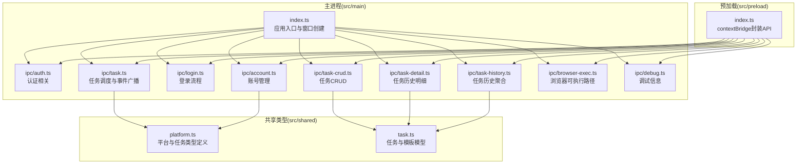
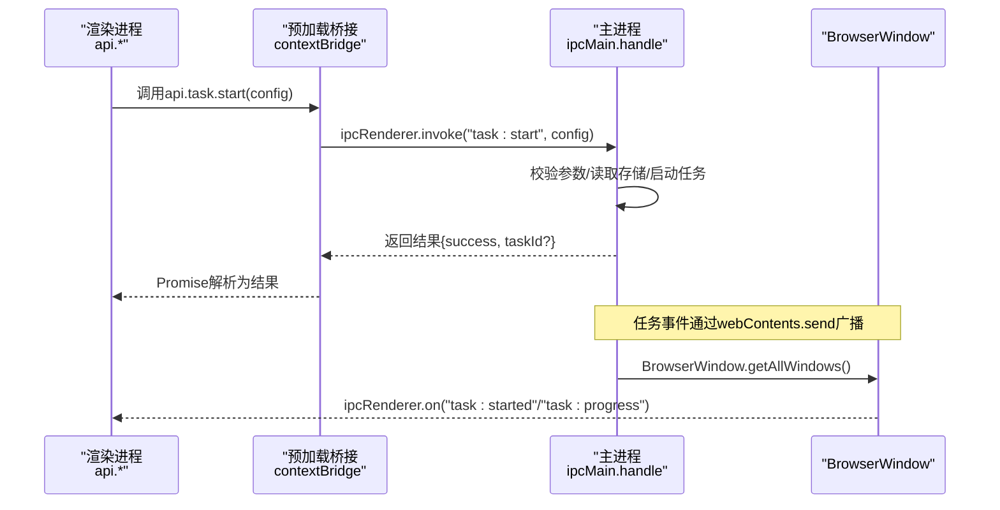
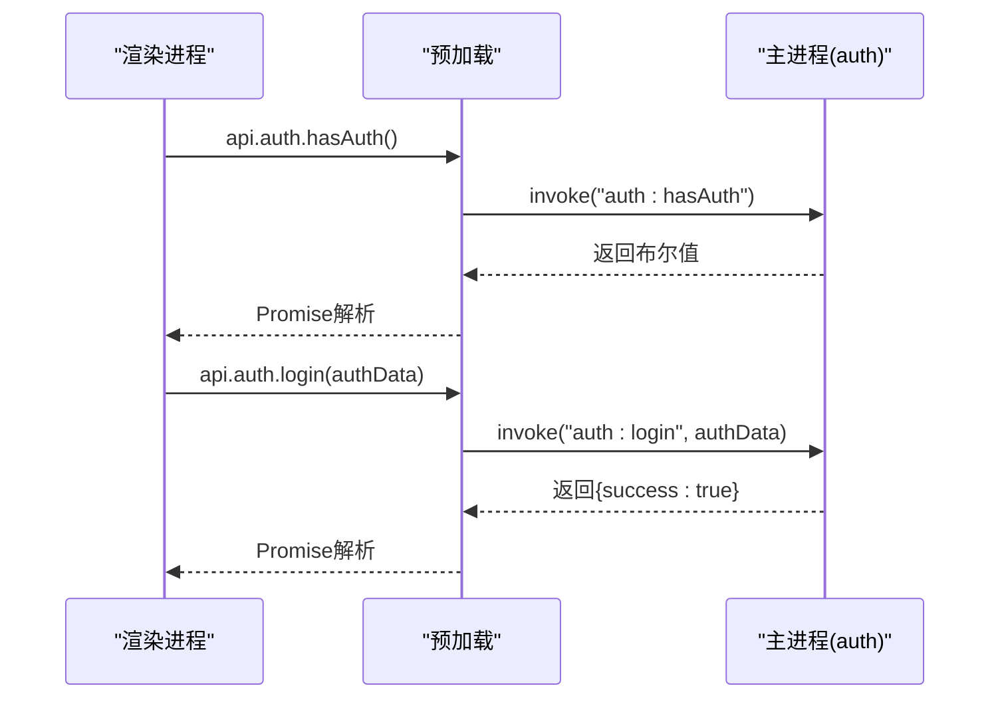
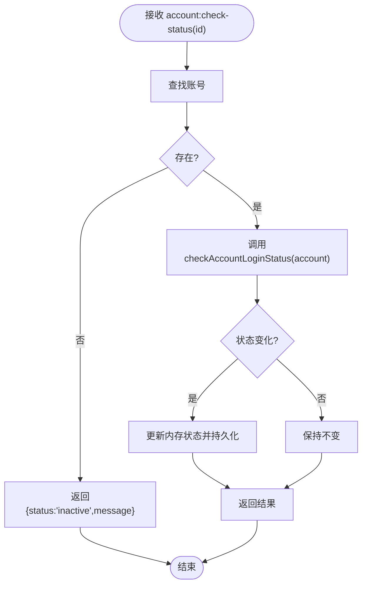
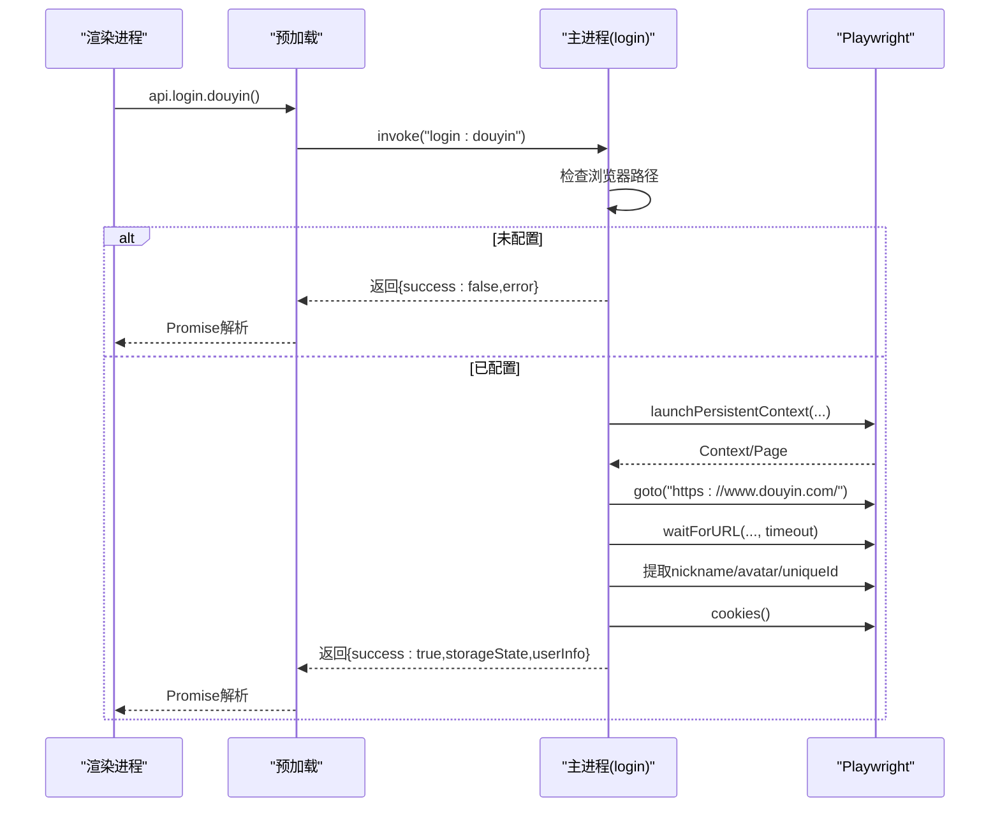
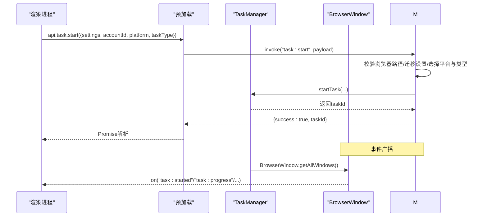
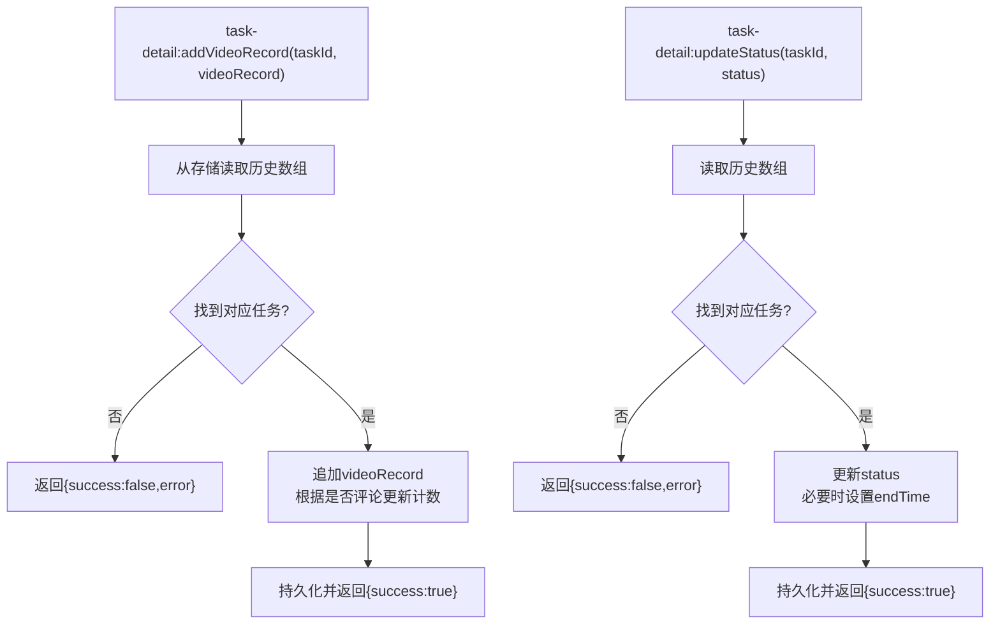
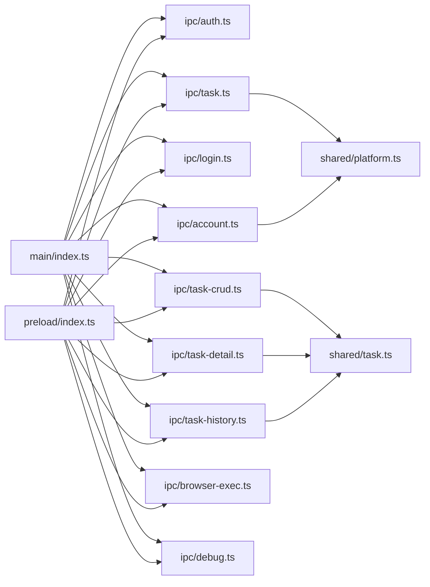

# IPC通信问题

<cite>
**本文引用的文件**
- [src/main/index.ts](file://src/main/index.ts)
- [src/preload/index.ts](file://src/preload/index.ts)
- [src/main/ipc/account.ts](file://src/main/ipc/account.ts)
- [src/main/ipc/auth.ts](file://src/main/ipc/auth.ts)
- [src/main/ipc/login.ts](file://src/main/ipc/login.ts)
- [src/main/ipc/task.ts](file://src/main/ipc/task.ts)
- [src/main/ipc/task-crud.ts](file://src/main/ipc/task-crud.ts)
- [src/main/ipc/task-detail.ts](file://src/main/ipc/task-detail.ts)
- [src/main/ipc/task-history.ts](file://src/main/ipc/task-history.ts)
- [src/main/ipc/browser-exec.ts](file://src/main/ipc/browser-exec.ts)
- [src/main/ipc/debug.ts](file://src/main/ipc/debug.ts)
- [src/shared/platform.ts](file://src/shared/platform.ts)
- [src/shared/task.ts](file://src/shared/task.ts)
</cite>

## 目录
1. [简介](#简介)
2. [项目结构](#项目结构)
3. [核心组件](#核心组件)
4. [架构总览](#架构总览)
5. [详细组件分析](#详细组件分析)
6. [依赖关系分析](#依赖关系分析)
7. [性能考量](#性能考量)
8. [故障排除指南](#故障排除指南)
9. [结论](#结论)
10. [附录](#附录)

## 简介
本指南聚焦于Electron应用中的IPC（进程间通信）运行时问题，覆盖主进程与渲染进程之间的消息传递异常、数据序列化错误、异步调用超时、通道建立失败、消息格式不匹配、权限验证错误等常见问题。文档提供IPC调试工具使用、消息追踪方法、性能监控技巧，并给出通信异常的日志分析方法与修复策略，解释不同类型IPC请求的处理流程与错误处理机制。

## 项目结构
该应用采用“按功能域划分”的IPC模块组织方式，主进程集中注册各类IPC处理器，渲染进程通过预加载桥接暴露统一的API接口，实现对主进程能力的安全访问。

图表来源
- [src/main/index.ts:1-106](file://src/main/index.ts#L1-L106)
- [src/preload/index.ts:1-235](file://src/preload/index.ts#L1-L235)
- [src/main/ipc/auth.ts:1-23](file://src/main/ipc/auth.ts#L1-L23)
- [src/main/ipc/account.ts:1-128](file://src/main/ipc/account.ts#L1-L128)
- [src/main/ipc/login.ts:1-193](file://src/main/ipc/login.ts#L1-L193)
- [src/main/ipc/task.ts:1-245](file://src/main/ipc/task.ts#L1-L245)
- [src/main/ipc/task-crud.ts:1-108](file://src/main/ipc/task-crud.ts#L1-L108)
- [src/main/ipc/task-detail.ts:1-39](file://src/main/ipc/task-detail.ts#L1-L39)
- [src/main/ipc/task-history.ts:1-45](file://src/main/ipc/task-history.ts#L1-L45)
- [src/main/ipc/browser-exec.ts:1-13](file://src/main/ipc/browser-exec.ts#L1-L13)
- [src/main/ipc/debug.ts:1-12](file://src/main/ipc/debug.ts#L1-L12)
- [src/shared/platform.ts:1-260](file://src/shared/platform.ts#L1-L260)
- [src/shared/task.ts:1-62](file://src/shared/task.ts#L1-L62)

章节来源
- [src/main/index.ts:1-106](file://src/main/index.ts#L1-L106)
- [src/preload/index.ts:1-235](file://src/preload/index.ts#L1-L235)

## 核心组件
- 主进程入口与窗口创建：负责初始化日志、注册所有IPC处理器、创建BrowserWindow并加载前端页面。
- 预加载桥接：通过contextBridge将安全可控的API暴露给渲染进程，统一使用invoke与send进行通信。
- IPC处理器模块：按功能域拆分，如认证、账号、登录、任务、任务历史、浏览器执行路径、调试等。
- 共享类型：定义平台、任务类型、任务与模板模型等，确保主/渲染两端数据契约一致。

章节来源
- [src/main/index.ts:1-106](file://src/main/index.ts#L1-L106)
- [src/preload/index.ts:131-235](file://src/preload/index.ts#L131-L235)
- [src/shared/platform.ts:1-260](file://src/shared/platform.ts#L1-L260)
- [src/shared/task.ts:1-62](file://src/shared/task.ts#L1-L62)

## 架构总览
主进程与渲染进程通过invoke/send实现双向通信。渲染进程通过预加载暴露的api对象发起请求；主进程在对应IPC模块中注册handle函数处理请求；部分长耗时或事件驱动场景通过webContents.send向渲染进程推送事件。

图表来源
- [src/preload/index.ts:138-162](file://src/preload/index.ts#L138-L162)
- [src/main/ipc/task.ts:81-134](file://src/main/ipc/task.ts#L81-L134)
- [src/main/ipc/task.ts:21-76](file://src/main/ipc/task.ts#L21-L76)

## 详细组件分析

### 认证与权限（auth）
- 渲染进程通过api.auth.*发起hasAuth/login/logout/getAuth请求。
- 主进程在auth.ts中注册对应handle，基于存储键值判断/写入认证状态。
- 常见问题：存储键缺失、类型不匹配、权限状态未同步。

图表来源
- [src/preload/index.ts:132-137](file://src/preload/index.ts#L132-L137)
- [src/main/ipc/auth.ts:4-23](file://src/main/ipc/auth.ts#L4-L23)

章节来源
- [src/preload/index.ts:132-137](file://src/preload/index.ts#L132-L137)
- [src/main/ipc/auth.ts:4-23](file://src/main/ipc/auth.ts#L4-L23)

### 账号管理（account）
- 提供列表、新增、更新、删除、设默认、查询默认、按平台筛选、活跃账号查询、单个/批量状态检查等。
- 错误处理：未找到账号时抛出错误；批量检查返回状态与过期时间并持久化更新。

图表来源
- [src/main/ipc/account.ts:102-126](file://src/main/ipc/account.ts#L102-L126)

章节来源
- [src/main/ipc/account.ts:32-127](file://src/main/ipc/account.ts#L32-L127)

### 登录流程（login）
- 使用Playwright Chromium持久化上下文打开目标站点，等待用户手动登录并提取用户信息与cookies。
- 关键点：浏览器可执行路径校验、超时控制、多次重试提取用户信息、错误捕获与日志记录。
- 常见问题：浏览器路径未配置、Playwright导入模块名不匹配、页面元素选择器失效、URL等待超时。

图表来源
- [src/preload/index.ts:195-197](file://src/preload/index.ts#L195-L197)
- [src/main/ipc/login.ts:85-192](file://src/main/ipc/login.ts#L85-L192)

章节来源
- [src/main/ipc/login.ts:85-192](file://src/main/ipc/login.ts#L85-L192)

### 任务系统（task）
- 统一入口：getTaskManager惰性初始化，转发任务事件到所有窗口的webContents。
- 请求类型：启动/停止/暂停/恢复/状态查询/队列管理/并发度设置/定时调度等。
- 错误处理：捕获异常并返回{success:false,error}；日志记录关键信息。

图表来源
- [src/preload/index.ts:138-162](file://src/preload/index.ts#L138-L162)
- [src/main/ipc/task.ts:13-79](file://src/main/ipc/task.ts#L13-L79)
- [src/main/ipc/task.ts:81-242](file://src/main/ipc/task.ts#L81-L242)

章节来源
- [src/main/ipc/task.ts:13-79](file://src/main/ipc/task.ts#L13-L79)
- [src/main/ipc/task.ts:81-242](file://src/main/ipc/task.ts#L81-L242)

### 任务CRUD与历史（task-crud、task-detail、task-history）
- CRUD：任务列表、按ID/账号/平台查询、创建、更新、删除、去重、模板保存与删除。
- 详情：为任务历史记录追加视频操作记录、更新任务状态与结束时间。
- 历史：全量查询、按ID查询、新增、更新、删除、清空。

图表来源
- [src/main/ipc/task-detail.ts:12-38](file://src/main/ipc/task-detail.ts#L12-L38)

章节来源
- [src/main/ipc/task-crud.ts:8-107](file://src/main/ipc/task-crud.ts#L8-L107)
- [src/main/ipc/task-detail.ts:5-39](file://src/main/ipc/task-detail.ts#L5-L39)
- [src/main/ipc/task-history.ts:5-45](file://src/main/ipc/task-history.ts#L5-L45)

### 浏览器执行路径与调试（browser-exec、debug）
- 浏览器执行路径：读取/设置浏览器可执行文件路径，用于Playwright启动。
- 调试：返回平台、架构、Electron/Node版本等环境信息。

章节来源
- [src/main/ipc/browser-exec.ts:4-13](file://src/main/ipc/browser-exec.ts#L4-L13)
- [src/main/ipc/debug.ts:3-12](file://src/main/ipc/debug.ts#L3-L12)

## 依赖关系分析
- 主进程入口集中注册所有IPC处理器，确保生命周期内可用。
- 预加载桥接统一暴露API，避免直接在渲染进程使用ipcRenderer.invoke/send，降低耦合与风险。
- 任务系统依赖共享类型定义平台与任务类型，保证跨模块一致性。
- 登录流程依赖Playwright（@playwright/test），需注意模块导入与版本兼容。

图表来源
- [src/main/index.ts:4-16](file://src/main/index.ts#L4-L16)
- [src/preload/index.ts:131-235](file://src/preload/index.ts#L131-L235)
- [src/shared/platform.ts:1-260](file://src/shared/platform.ts#L1-L260)
- [src/shared/task.ts:1-62](file://src/shared/task.ts#L1-L62)

章节来源
- [src/main/index.ts:4-16](file://src/main/index.ts#L4-L16)
- [src/preload/index.ts:131-235](file://src/preload/index.ts#L131-L235)

## 性能考量
- 事件广播：任务事件通过webContents.send向所有窗口广播，注意窗口数量增长带来的消息风暴，建议在渲染端按需订阅。
- 日志开销：大量invoke调用伴随日志输出，生产环境可降低日志级别或采样。
- 异步超时：登录流程与任务启动均设置超时，应结合业务合理调整并提供重试策略。
- 数据序列化：invoke参数与返回值需可被Electron序列化，避免传递不可序列化对象（如函数、循环引用）。

## 故障排除指南

### 一、消息传递异常与通道建立失败
- 症状
  - 渲染进程调用api.*立即报错或Promise永不resolve。
  - 控制台出现“Cannot find module”“Channel not found”等。
- 排查步骤
  - 确认主进程已注册对应handle：检查主入口是否调用对应registerXxxIPC。
  - 确认预加载桥接已暴露对应API：核对preload导出的api对象与channel名称一致。
  - 确认窗口webPreferences配置：contextIsolation启用、preload路径正确。
- 修复策略
  - 在主入口注册阶段增加日志确认已执行。
  - 在渲染端增加超时与重试包装，避免UI阻塞。
  - 对于动态导入模块（如Playwright），确保package.json依赖与导入路径一致。

章节来源
- [src/main/index.ts:54-78](file://src/main/index.ts#L54-L78)
- [src/preload/index.ts:234-235](file://src/preload/index.ts#L234-L235)

### 二、数据序列化错误
- 症状
  - invoke返回undefined或抛出“DataCloneError”。
  - 传参包含函数、Symbol、DOM节点、循环引用。
- 排查步骤
  - 检查invoke参数与返回值是否包含不可序列化字段。
  - 对复杂对象进行浅拷贝或JSON序列化/反序列化验证。
- 修复策略
  - 将回调函数移至主进程内部处理，仅传递必要标识符。
  - 使用结构化克隆支持的数据类型，必要时转换为普通对象。

章节来源
- [src/main/ipc/login.ts:159-171](file://src/main/ipc/login.ts#L159-L171)
- [src/main/ipc/task.ts:91-97](file://src/main/ipc/task.ts#L91-L97)

### 三、异步调用超时
- 症状
  - 登录等待URL超时、任务启动卡死、状态查询无响应。
- 排查步骤
  - 查看主进程日志中关键节点（开始、等待、提取、完成）。
  - 检查网络与目标站点可达性、浏览器路径有效性。
- 修复策略
  - 为waitForURL、waitForTimeout等设置合理超时并提供重试。
  - 对任务启动增加前置条件检查（如浏览器路径）。

章节来源
- [src/main/ipc/login.ts:117-121](file://src/main/ipc/login.ts#L117-L121)
- [src/main/ipc/login.ts:140-145](file://src/main/ipc/login.ts#L140-L145)
- [src/main/ipc/task.ts:99-103](file://src/main/ipc/task.ts#L99-L103)

### 四、消息格式不匹配
- 症状
  - 渲染端收到的事件字段与预期不符，导致UI渲染异常。
- 排查步骤
  - 对比预加载onXxx回调签名与主进程send发送的数据结构。
  - 核对共享类型定义（platform.ts、task.ts）是否一致。
- 修复策略
  - 在主进程send前进行数据规范化与字段校验。
  - 在渲染端增加防御性断言与默认值处理。

章节来源
- [src/preload/index.ts:3-12](file://src/preload/index.ts#L3-L12)
- [src/main/ipc/task.ts:21-76](file://src/main/ipc/task.ts#L21-L76)
- [src/shared/platform.ts:1-260](file://src/shared/platform.ts#L1-L260)
- [src/shared/task.ts:1-62](file://src/shared/task.ts#L1-L62)

### 五、权限验证错误
- 症状
  - hasAuth返回false，登录/任务启动失败。
- 排查步骤
  - 检查存储键是否存在且非空。
  - 核对auth:login/logout是否正确写入/清除。
- 修复策略
  - 在渲染端增加未授权引导（跳转设置页或提示）。
  - 对存储读写进行健壮性封装与回退逻辑。

章节来源
- [src/main/ipc/auth.ts:4-23](file://src/main/ipc/auth.ts#L4-L23)

### 六、IPC调试工具与消息追踪
- 使用主进程日志：在关键路径打印请求参数、返回值与中间状态。
- 使用debug通道：获取平台、架构、Electron/Node版本等环境信息。
- 在渲染端包装API调用：增加超时、重试、错误上报与埋点。

章节来源
- [src/main/ipc/debug.ts:3-12](file://src/main/ipc/debug.ts#L3-L12)
- [src/main/index.ts:92-106](file://src/main/index.ts#L92-L106)

### 七、性能监控技巧
- 事件风暴：任务事件广播可能造成消息风暴，建议在渲染端按需订阅与节流。
- 日志采样：高频invoke场景下降低日志级别或采样输出。
- 资源占用：Playwright上下文生命周期管理，避免重复创建与泄漏。

章节来源
- [src/main/ipc/task.ts:21-76](file://src/main/ipc/task.ts#L21-L76)

### 八、通信异常的日志分析与修复
- 日志入口
  - 主进程：electron-log/main，包含info/error/debug/warn。
  - 渲染端：通过ipcMain.on('log', ...)将渲染端日志转发到主进程。
- 分析要点
  - 定位请求进入时间、参数概要、异常堆栈、超时节点。
  - 区分业务异常与系统异常（如模块导入失败、路径不存在）。
- 修复策略
  - 对可恢复错误提供重试与降级方案。
  - 对致命错误提供清晰的错误码与用户提示。

章节来源
- [src/main/index.ts:17-19](file://src/main/index.ts#L17-L19)
- [src/main/index.ts:92-106](file://src/main/index.ts#L92-L106)
- [src/main/ipc/task.ts:16-18](file://src/main/ipc/task.ts#L16-L18)

### 九、不同类型IPC请求的处理流程与错误处理机制
- invoke请求（认证、账号、任务、登录、CRUD、历史、浏览器路径、调试）
  - 主进程handle中进行参数校验、业务处理、异常捕获与返回。
  - 渲染端Promise解析，UI层根据success与error字段更新状态。
- send事件（任务进度、动作、状态变更）
  - 主进程通过webContents.send广播到所有窗口。
  - 预加载封装onXxx回调，渲染端订阅并更新视图。
- 错误处理机制
  - 显式抛错或返回{success:false,error}，避免静默失败。
  - 结合日志与错误上报，便于定位问题根因。

章节来源
- [src/main/ipc/auth.ts:4-23](file://src/main/ipc/auth.ts#L4-L23)
- [src/main/ipc/account.ts:51-60](file://src/main/ipc/account.ts#L51-L60)
- [src/main/ipc/login.ts:180-186](file://src/main/ipc/login.ts#L180-L186)
- [src/main/ipc/task.ts:130-133](file://src/main/ipc/task.ts#L130-L133)
- [src/main/ipc/task.ts:21-76](file://src/main/ipc/task.ts#L21-L76)

## 结论
本指南围绕Electron IPC在主/渲染进程间的典型问题提供了系统化的排查思路与修复策略。通过规范的错误处理、完善的日志体系、合理的超时与重试机制，以及对数据序列化与事件风暴的治理，可显著提升系统的稳定性与可观测性。建议在开发与运维实践中持续完善这些机制，以应对复杂业务场景下的通信挑战。

## 附录
- 常见错误与修复清单
  - Playwright导入模块名不匹配：确保导入@playwright/test而非playwright。
  - 浏览器路径未配置：在设置页配置后重试登录/任务启动。
  - 页面元素选择器失效：定期更新选择器或采用更鲁棒的提取策略。
  - 事件广播过多：在渲染端按需订阅与节流。
  - 存储键缺失：检查auth与account相关存储键是否正确初始化。