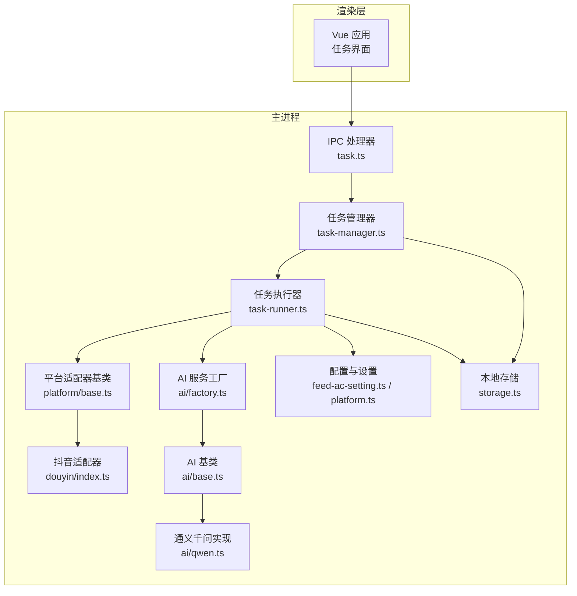
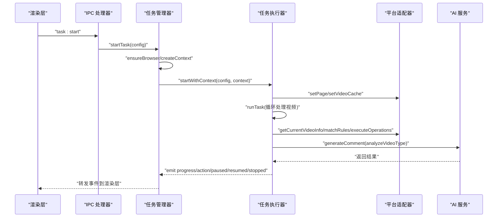
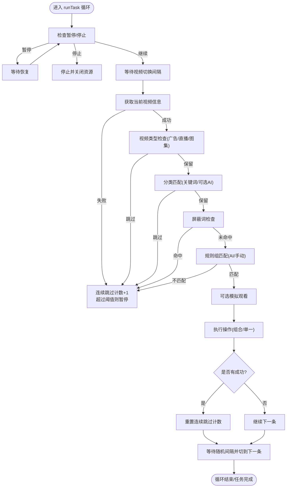
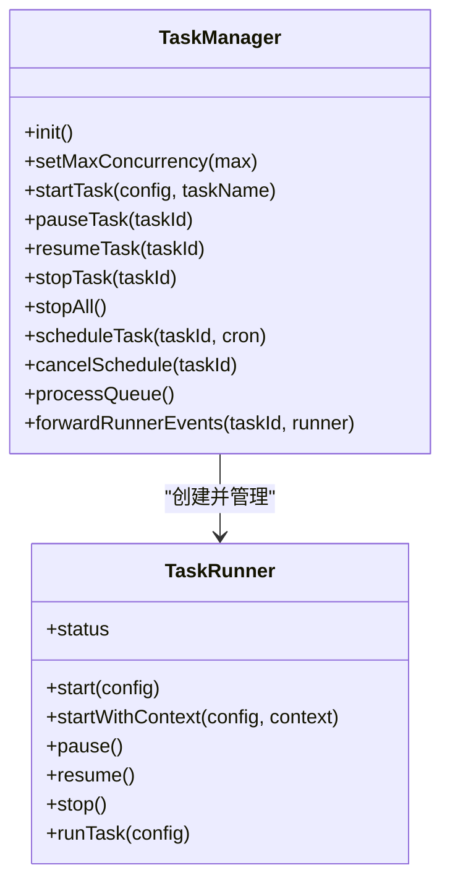
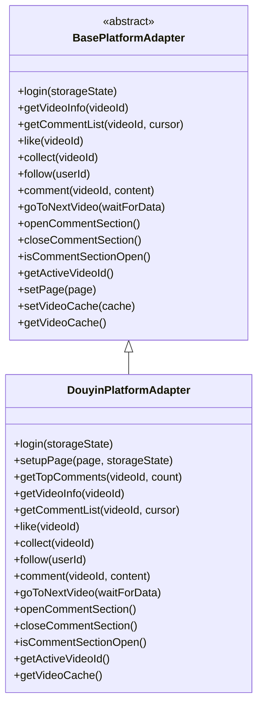
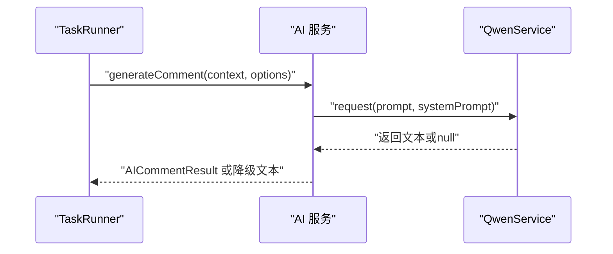
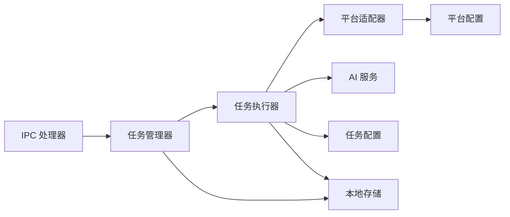

# 任务执行错误

<cite>
**本文引用的文件**
- [src/main/service/task-runner.ts](file://src/main/service/task-runner.ts)
- [src/main/service/task-manager.ts](file://src/main/service/task-manager.ts)
- [src/main/ipc/task.ts](file://src/main/ipc/task.ts)
- [src/main/platform/base.ts](file://src/main/platform/base.ts)
- [src/main/platform/douyin/index.ts](file://src/main/platform/douyin/index.ts)
- [src/main/integration/ai/base.ts](file://src/main/integration/ai/base.ts)
- [src/main/integration/ai/factory.ts](file://src/main/integration/ai/factory.ts)
- [src/main/integration/ai/qwen.ts](file://src/main/integration/ai/qwen.ts)
- [src/shared/feed-ac-setting.ts](file://src/shared/feed-ac-setting.ts)
- [src/shared/platform.ts](file://src/shared/platform.ts)
- [src/main/utils/common.ts](file://src/main/utils/common.ts)
- [src/main/utils/storage.ts](file://src/main/utils/storage.ts)
- [.trae/documents/任务启动无反应排查计划.md](file://.trae/documents/任务启动无反应排查计划.md)
- [README.md](file://README.md)
</cite>

## 目录
1. [简介](#简介)
2. [项目结构](#项目结构)
3. [核心组件](#核心组件)
4. [架构总览](#架构总览)
5. [详细组件分析](#详细组件分析)
6. [依赖关系分析](#依赖关系分析)
7. [性能考量](#性能考量)
8. [故障排除指南](#故障排除指南)
9. [结论](#结论)
10. [附录](#附录)

## 简介
本指南聚焦于任务执行过程中的运行时错误与故障排除，覆盖任务调度失败、执行中断、状态同步错误、任务队列管理异常、平台适配器连接失败、AI服务调用超时等常见问题。同时提供任务执行日志分析方法、错误堆栈追踪、性能瓶颈识别、任务状态机转换异常、并发执行冲突与资源竞争问题的定位与修复建议，并解释任务重试机制、断点续传与错误恢复策略。

## 项目结构
系统采用 Electron 主进程 + Vue 渲染层的架构，主进程负责任务编排、浏览器与页面控制、平台适配器与 AI 服务集成；渲染层通过 IPC 与主进程交互，驱动任务生命周期管理。

图表来源
- [src/main/ipc/task.ts:1-243](file://src/main/ipc/task.ts#L1-L243)
- [src/main/service/task-manager.ts:1-515](file://src/main/service/task-manager.ts#L1-L515)
- [src/main/service/task-runner.ts:1-760](file://src/main/service/task-runner.ts#L1-L760)
- [src/main/platform/base.ts:1-105](file://src/main/platform/base.ts#L1-L105)
- [src/main/platform/douyin/index.ts:1-494](file://src/main/platform/douyin/index.ts#L1-L494)
- [src/main/integration/ai/factory.ts:1-27](file://src/main/integration/ai/factory.ts#L1-L27)
- [src/main/integration/ai/base.ts:1-131](file://src/main/integration/ai/base.ts#L1-L131)
- [src/main/integration/ai/qwen.ts:1-45](file://src/main/integration/ai/qwen.ts#L1-L45)
- [src/shared/feed-ac-setting.ts:1-179](file://src/shared/feed-ac-setting.ts#L1-L179)
- [src/shared/platform.ts:1-260](file://src/shared/platform.ts#L1-L260)
- [src/main/utils/storage.ts:1-53](file://src/main/utils/storage.ts#L1-L53)

章节来源
- [README.md:1-54](file://README.md#L1-L54)
- [src/main/ipc/task.ts:1-243](file://src/main/ipc/task.ts#L1-L243)

## 核心组件
- 任务管理器（TaskManager）
  - 负责任务队列、并发控制、定时任务、共享浏览器上下文、事件转发与持久化。
- 任务执行器（TaskRunner）
  - 负责单任务生命周期、页面与适配器初始化、视频采集与规则匹配、操作执行、状态上报与日志。
- 平台适配器（BasePlatformAdapter/DouyinPlatformAdapter）
  - 负责平台特定的页面交互、元素选择器、键盘快捷键、评论/点赞/收藏/关注等操作封装。
- AI 服务（BaseAIService/QwenService 等）
  - 负责视频类型分析与评论生成，统一接口与超时控制。
- 配置与设置（FeedAcSettings、PlatformConfig）
  - 提供任务类型、规则组、屏蔽词、AI 评论参数、平台选择器与 API 端点等。

章节来源
- [src/main/service/task-manager.ts:1-515](file://src/main/service/task-manager.ts#L1-L515)
- [src/main/service/task-runner.ts:1-760](file://src/main/service/task-runner.ts#L1-L760)
- [src/main/platform/base.ts:1-105](file://src/main/platform/base.ts#L1-L105)
- [src/main/platform/douyin/index.ts:1-494](file://src/main/platform/douyin/index.ts#L1-L494)
- [src/main/integration/ai/base.ts:1-131](file://src/main/integration/ai/base.ts#L1-L131)
- [src/main/integration/ai/factory.ts:1-27](file://src/main/integration/ai/factory.ts#L1-L27)
- [src/shared/feed-ac-setting.ts:1-179](file://src/shared/feed-ac-setting.ts#L1-L179)
- [src/shared/platform.ts:1-260](file://src/shared/platform.ts#L1-L260)

## 架构总览
任务从渲染层触发，经 IPC 到主进程 TaskManager，再由 TaskManager 创建 TaskRunner 并注入共享 BrowserContext。TaskRunner 通过平台适配器与页面交互，必要时调用 AI 服务生成评论，期间通过事件向渲染层推送进度与动作结果。

图表来源
- [src/main/ipc/task.ts:81-132](file://src/main/ipc/task.ts#L81-L132)
- [src/main/service/task-manager.ts:178-230](file://src/main/service/task-manager.ts#L178-L230)
- [src/main/service/task-runner.ts:235-371](file://src/main/service/task-runner.ts#L235-L371)
- [src/main/platform/douyin/index.ts:198-261](file://src/main/platform/douyin/index.ts#L198-L261)
- [src/main/integration/ai/base.ts:62-130](file://src/main/integration/ai/base.ts#L62-L130)

## 详细组件分析

### 任务执行器（TaskRunner）分析
- 生命周期与状态机
  - 状态包括 running/paused/stopped/completed/failed，通过事件 emit 通知上层。
  - 支持 start/startWithContext 两种启动模式，后者用于共享上下文并行执行。
- 视频采集与缓存
  - 通过页面 response 监听 feed 接口，填充 videoCache，提升后续视频信息获取效率。
- 规则匹配与跳过策略
  - 视频类型（广告/直播/图集）、分类（关键词+AI）、屏蔽词、规则组（手动/AI）等多维判定。
- 操作执行
  - 支持 comment/like/collect/follow 等，支持组合操作与概率控制。
- 日志与事件
  - 统一日志格式与级别，emit progress/action/paused/resumed/stopped 等事件。

图表来源
- [src/main/service/task-runner.ts:235-371](file://src/main/service/task-runner.ts#L235-L371)
- [src/main/service/task-runner.ts:420-559](file://src/main/service/task-runner.ts#L420-L559)
- [src/main/service/task-runner.ts:561-612](file://src/main/service/task-runner.ts#L561-L612)

章节来源
- [src/main/service/task-runner.ts:1-760](file://src/main/service/task-runner.ts#L1-L760)

### 任务管理器（TaskManager）分析
- 并发与队列
  - 最大并发数可配置，超出时加入队列；按账号策略限制并发与冷却时间。
- 共享浏览器与上下文
  - 管理共享 Chromium 实例与 BrowserContext，减少资源消耗。
- 定时任务
  - 基于 cron-parser 的定时触发，周期性检查并触发任务。
- 事件转发
  - 将 TaskRunner 的事件转发给渲染层，保持 UI 与执行状态一致。

图表来源
- [src/main/service/task-manager.ts:47-515](file://src/main/service/task-manager.ts#L47-L515)
- [src/main/service/task-runner.ts:25-156](file://src/main/service/task-runner.ts#L25-L156)

章节来源
- [src/main/service/task-manager.ts:1-515](file://src/main/service/task-manager.ts#L1-L515)

### 平台适配器（BasePlatformAdapter/DouyinPlatformAdapter）分析
- 抽象接口
  - login/getVideoInfo/getCommentList/like/collect/follow/comment/goToNextVideo/openCommentSection/closeCommentSection/isCommentSectionOpen/getActiveVideoId 等。
- 抖音适配器
  - 基于键盘快捷键与选择器驱动页面交互；监听 feed/comment/list/publish 接口以获取数据与校验结果。
  - 提供 getTopComments、waitForVideoIdChange、waitForVideoCacheData 等辅助能力。
- 事件与日志
  - 通过 emit('log') 输出平台侧日志，便于统一收集。

图表来源
- [src/main/platform/base.ts:24-105](file://src/main/platform/base.ts#L24-L105)
- [src/main/platform/douyin/index.ts:60-494](file://src/main/platform/douyin/index.ts#L60-L494)

章节来源
- [src/main/platform/base.ts:1-105](file://src/main/platform/base.ts#L1-L105)
- [src/main/platform/douyin/index.ts:1-494](file://src/main/platform/douyin/index.ts#L1-L494)

### AI 服务（BaseAIService/QwenService）分析
- 统一接口
  - analyzeVideoType/generateComment，支持自定义提示词与风格控制。
- 超时与容错
  - QwenService 使用 AbortController 控制请求超时，异常时返回空值并降级。
- 结果解析
  - BaseAIService 对 AI 返回进行 JSON 解析与截断处理，保证输出质量。

图表来源
- [src/main/integration/ai/base.ts:28-131](file://src/main/integration/ai/base.ts#L28-L131)
- [src/main/integration/ai/qwen.ts:4-45](file://src/main/integration/ai/qwen.ts#L4-L45)

章节来源
- [src/main/integration/ai/base.ts:1-131](file://src/main/integration/ai/base.ts#L1-L131)
- [src/main/integration/ai/factory.ts:1-27](file://src/main/integration/ai/factory.ts#L1-L27)
- [src/main/integration/ai/qwen.ts:1-45](file://src/main/integration/ai/qwen.ts#L1-L45)

## 依赖关系分析
- IPC 层负责接收前端指令并调用 TaskManager。
- TaskManager 负责创建 TaskRunner、共享上下文与并发控制。
- TaskRunner 依赖平台适配器与 AI 服务，通过事件与日志与上层通信。
- 配置与设置贯穿各层，确保规则、平台选择器与 API 端点一致。

图表来源
- [src/main/ipc/task.ts:81-132](file://src/main/ipc/task.ts#L81-L132)
- [src/main/service/task-manager.ts:178-230](file://src/main/service/task-manager.ts#L178-L230)
- [src/main/service/task-runner.ts:90-103](file://src/main/service/task-runner.ts#L90-L103)
- [src/shared/platform.ts:88-200](file://src/shared/platform.ts#L88-L200)
- [src/shared/feed-ac-setting.ts:62-97](file://src/shared/feed-ac-setting.ts#L62-L97)
- [src/main/utils/storage.ts:16-53](file://src/main/utils/storage.ts#L16-L53)

章节来源
- [src/main/ipc/task.ts:1-243](file://src/main/ipc/task.ts#L1-L243)
- [src/main/service/task-manager.ts:1-515](file://src/main/service/task-manager.ts#L1-L515)
- [src/main/service/task-runner.ts:1-760](file://src/main/service/task-runner.ts#L1-L760)
- [src/shared/platform.ts:1-260](file://src/shared/platform.ts#L1-L260)
- [src/shared/feed-ac-setting.ts:1-179](file://src/shared/feed-ac-setting.ts#L1-L179)
- [src/main/utils/storage.ts:1-53](file://src/main/utils/storage.ts#L1-L53)

## 性能考量
- 并发与队列
  - 通过 maxConcurrency 与账号策略限制并发，避免浏览器与平台限流。
- 视频缓存与等待
  - feed 接口监听与 videoCache 减少重复请求；合理设置 videoSwitchWaitMs 降低平台风控风险。
- 随机化与节流
  - 随机观看时长、输入延迟、操作概率与随机间隔，提升“真人”行为特征。
- 资源回收
  - 任务停止时及时关闭 page/context/browser，保存 storageState，避免内存泄漏。

章节来源
- [src/main/service/task-manager.ts:96-106](file://src/main/service/task-manager.ts#L96-L106)
- [src/main/service/task-runner.ts:160-180](file://src/main/service/task-runner.ts#L160-L180)
- [src/main/service/task-runner.ts:261-262](file://src/main/service/task-runner.ts#L261-L262)
- [src/main/utils/common.ts:1-11](file://src/main/utils/common.ts#L1-L11)
- [src/main/service/task-runner.ts:212-233](file://src/main/service/task-runner.ts#L212-L233)

## 故障排除指南

### 任务调度失败
- 症状
  - 任务无法启动或立即失败。
- 可能原因
  - 浏览器路径未配置（BROWSER_EXEC_PATH 为空）。
  - TaskManager 初始化异常或并发限制导致排队。
  - IPC 通道未正确连接或前端未收到响应。
- 排查步骤
  - 检查存储中的浏览器路径是否存在。
  - 查看主进程日志，确认 task:start 是否被调用。
  - 确认渲染层是否正确注册并监听事件。
- 修复建议
  - 在 IPC 层增加更详细的日志与错误返回。
  - 在 TaskManager 中对浏览器实例断开进行重连处理。
  - 确保事件名称与监听一致（如 task:action）。

章节来源
- [src/main/ipc/task.ts:98-102](file://src/main/ipc/task.ts#L98-L102)
- [src/main/service/task-manager.ts:111-127](file://src/main/service/task-manager.ts#L111-L127)
- [.trae/documents/任务启动无反应排查计划.md:33-48](file://.trae/documents/任务启动无反应排查计划.md#L33-L48)

### 执行中断与状态同步错误
- 症状
  - 任务中途停止、状态未更新或 UI 不一致。
- 可能原因
  - TaskRunner 在 runTask 循环中抛出异常未捕获。
  - 事件转发链路缺失或重复。
  - 并发控制导致任务被提前终止。
- 排查步骤
  - 检查 runTask 中的异常捕获与状态变更。
  - 核对 TaskManager.forwardRunnerEvents 是否正确绑定。
  - 确认队列处理 processQueue 是否提前启动了其他任务。
- 修复建议
  - 在 runTask.catch 中统一设置状态为 failed 并发出 stopped。
  - 在 TaskManager 中确保事件去重与一致性。
  - 调整并发策略与账号冷却时间。

章节来源
- [src/main/service/task-runner.ts:106-110](file://src/main/service/task-runner.ts#L106-L110)
- [src/main/service/task-runner.ts:355-370](file://src/main/service/task-runner.ts#L355-L370)
- [src/main/service/task-manager.ts:389-402](file://src/main/service/task-manager.ts#L389-L402)
- [src/main/service/task-manager.ts:361-384](file://src/main/service/task-manager.ts#L361-L384)

### 任务队列管理异常
- 症状
  - 任务排队后无法启动、队列积压或顺序错乱。
- 可能原因
  - 并发上限设置不当，导致队列一直阻塞。
  - 账号策略未生效，多个任务同时运行。
  - 队列处理逻辑未考虑账号可用性。
- 排查步骤
  - 检查 getQueueSize 与 processQueue 的执行时机。
  - 核对 canStartForAccount 与 accountLastRunTime 的更新。
- 修复建议
  - 在 canStartForAccount 中综合并发与冷却时间判断。
  - 在 processQueue 中优先选择可启动的账号任务。

章节来源
- [src/main/service/task-manager.ts:161-173](file://src/main/service/task-manager.ts#L161-L173)
- [src/main/service/task-manager.ts:361-384](file://src/main/service/task-manager.ts#L361-L384)

### 平台适配器连接失败
- 症状
  - 无法获取视频 ID、评论列表或操作失败。
- 可能原因
  - 页面未就绪或元素选择器失效。
  - 网络请求超时或验证码弹窗阻塞。
  - 缓存未命中导致视频信息缺失。
- 排查步骤
  - 检查 getActiveVideoId、goToNextVideo 的等待与超时。
  - 观察 waitForVideoIdChange 与 waitForVideoCacheData 的等待逻辑。
  - 检查 verifyDialog 的可见性与处理。
- 修复建议
  - 增加重试与超时保护，必要时主动关闭评论面板再切视频。
  - 确保 videoCache 的一致性与清理。

章节来源
- [src/main/platform/douyin/index.ts:448-454](file://src/main/platform/douyin/index.ts#L448-L454)
- [src/main/platform/douyin/index.ts:379-426](file://src/main/platform/douyin/index.ts#L379-L426)
- [src/main/platform/douyin/index.ts:335-342](file://src/main/platform/douyin/index.ts#L335-L342)

### AI 服务调用超时
- 症状
  - 评论生成失败、AI 分析超时或解析异常。
- 可能原因
  - 网络不稳定或第三方接口超时。
  - 返回内容不符合预期格式导致解析失败。
- 排查步骤
  - 检查 QwenService 的 AbortController 超时与异常分支。
  - 观察 BaseAIService 的 JSON 解析与降级策略。
- 修复建议
  - 为 AI 调用增加重试与降级文本。
  - 记录原始响应以便定位格式问题。

章节来源
- [src/main/integration/ai/qwen.ts:5-44](file://src/main/integration/ai/qwen.ts#L5-L44)
- [src/main/integration/ai/base.ts:41-60](file://src/main/integration/ai/base.ts#L41-L60)
- [src/main/integration/ai/base.ts:116-130](file://src/main/integration/ai/base.ts#L116-L130)

### 任务状态机转换异常
- 症状
  - 状态停留在 paused 或 failed，无法恢复。
- 可能原因
  - resume/pause 逻辑未正确更新内部状态或事件未发出。
  - 任务在停止时未清理状态或 context。
- 排查步骤
  - 检查 pause/resume 的状态赋值与事件发射。
  - 确认 stop/close 中的状态同步与资源释放。
- 修复建议
  - 在 pause/resume 中严格设置 _status 并发出对应事件。
  - 在 stop 中确保状态最终收敛为 stopped/completed。

章节来源
- [src/main/service/task-runner.ts:185-202](file://src/main/service/task-runner.ts#L185-L202)
- [src/main/service/task-runner.ts:204-233](file://src/main/service/task-runner.ts#L204-L233)

### 并发执行冲突与资源竞争
- 症状
  - 多任务同时运行导致页面卡顿、操作失败或账号风控。
- 可能原因
  - 并发数过高或账号冷却时间不足。
  - 共享 BrowserContext 导致上下文污染。
- 排查步骤
  - 检查 maxConcurrency 与 canStartForAccount 的判断。
  - 确认 createContext 是否正确隔离账号存储状态。
- 修复建议
  - 降低并发上限，增加账号冷却时间。
  - 为每个任务创建独立 BrowserContext，避免共享上下文。

章节来源
- [src/main/service/task-manager.ts:96-106](file://src/main/service/task-manager.ts#L96-L106)
- [src/main/service/task-manager.ts:161-173](file://src/main/service/task-manager.ts#L161-L173)
- [src/main/service/task-manager.ts:132-156](file://src/main/service/task-manager.ts#L132-L156)

### 任务重试机制、断点续传与错误恢复策略
- 重试机制
  - getCurrentVideoInfo 支持多次重试与延时，避免瞬时网络波动影响。
  - AI 服务调用失败时降级为备选评论文本。
- 断点续传
  - 当前实现未提供断点续传；可通过记录已完成数量与最后处理视频 ID，在重启时从上次位置继续。
- 错误恢复
  - 任务失败时统一设置状态为 failed 并发出 stopped。
  - 浏览器断开时自动重连并清理状态。

章节来源
- [src/main/service/task-runner.ts:373-418](file://src/main/service/task-runner.ts#L373-L418)
- [src/main/service/task-runner.ts:667-670](file://src/main/service/task-runner.ts#L667-L670)
- [src/main/service/task-runner.ts:106-110](file://src/main/service/task-runner.ts#L106-L110)
- [src/main/service/task-manager.ts:121-127](file://src/main/service/task-manager.ts#L121-L127)

### 任务执行日志分析与错误堆栈追踪
- 日志来源
  - TaskRunner.log 与平台适配器 BasePlatformAdapter.log 输出统一格式日志。
  - IPC 层与 TaskManager 层均输出关键事件与错误信息。
- 分析方法
  - 按时间线梳理 progress/action/paused/resumed/stopped 事件。
  - 关注 error/warn 级别日志，定位异常发生阶段。
  - 结合平台适配器的 waitFor* 与超时处理，判断页面交互问题。
- 堆栈追踪
  - 在 runTask.catch 与 IPC handler 中捕获异常并记录堆栈，便于回溯。

章节来源
- [src/main/service/task-runner.ts:746-758](file://src/main/service/task-runner.ts#L746-L758)
- [src/main/platform/base.ts:68-79](file://src/main/platform/base.ts#L68-L79)
- [src/main/ipc/task.ts:128-131](file://src/main/ipc/task.ts#L128-L131)
- [src/main/service/task-runner.ts:106-110](file://src/main/service/task-runner.ts#L106-L110)

## 结论
本指南围绕任务执行过程中的常见运行时错误提供了系统化的排查思路与修复建议。通过完善日志、优化并发与队列、强化平台适配器与 AI 服务的容错能力，以及规范状态机与事件流转，可显著提升任务稳定性与可维护性。对于断点续传与更精细的重试策略，可在现有基础上扩展持久化与状态恢复机制。

## 附录
- 相关配置项
  - 并发数：taskConcurrency
  - 浏览器路径：browserExecPath
  - 任务历史与模板：taskHistory/taskTemplates
- 建议的改进方向
  - 增加断点续传与任务恢复能力
  - 引入更细粒度的重试与退避策略
  - 完善 UI 侧的错误提示与重试按钮

章节来源
- [src/main/utils/storage.ts:16-53](file://src/main/utils/storage.ts#L16-L53)
- [src/shared/feed-ac-setting.ts:148-179](file://src/shared/feed-ac-setting.ts#L148-L179)