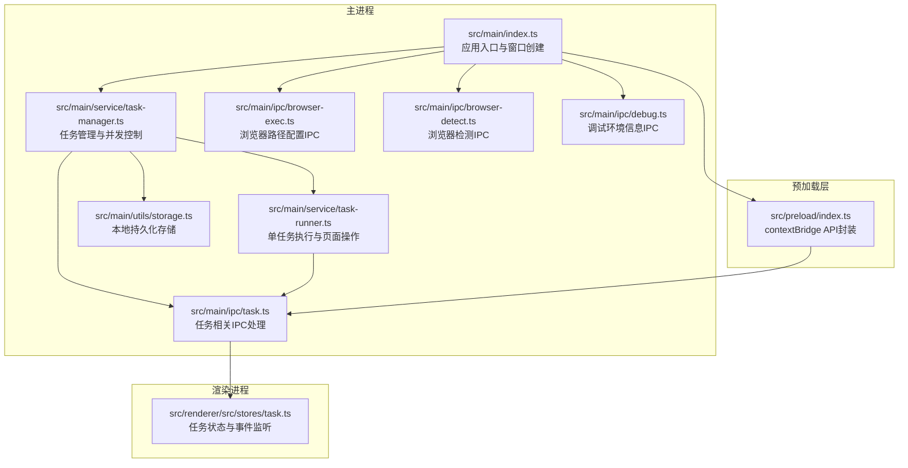
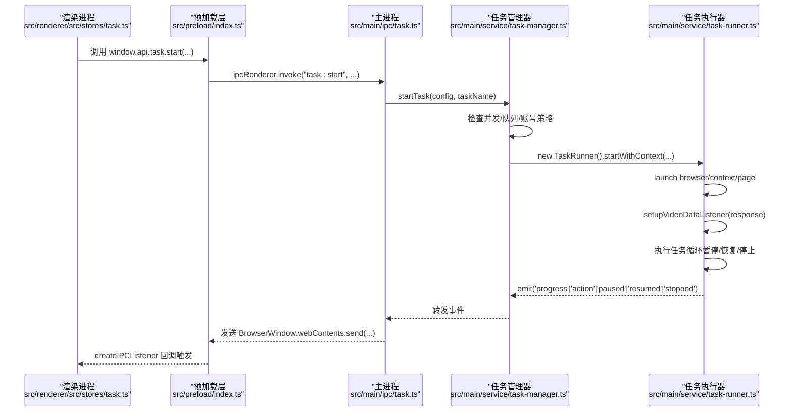
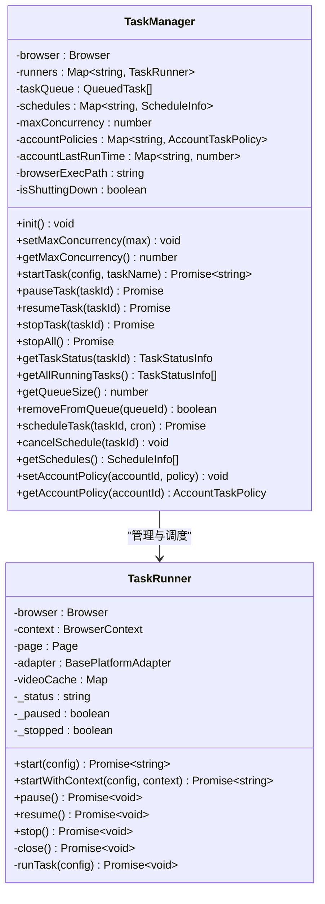
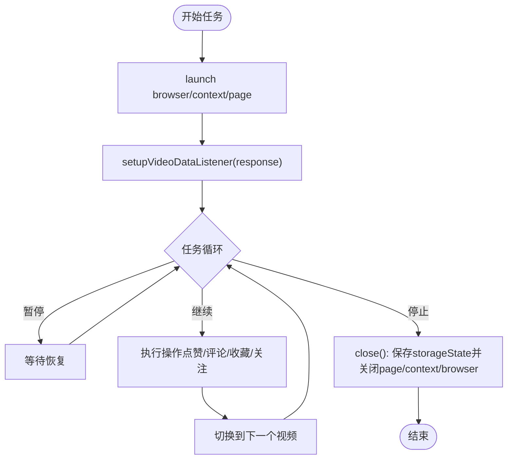
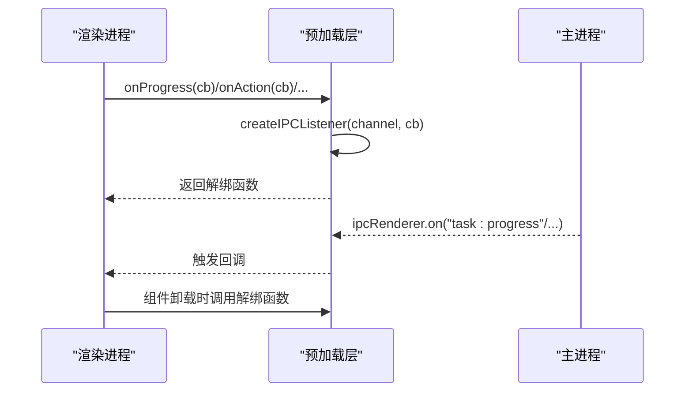
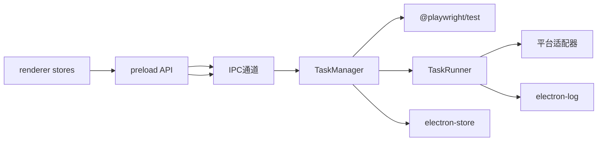

# 内存和性能问题

<cite>
**本文引用的文件**
- [package.json](file://package.json)
- [electron.vite.config.ts](file://electron.vite.config.ts)
- [src/main/index.ts](file://src/main/index.ts)
- [src/main/service/task-runner.ts](file://src/main/service/task-runner.ts)
- [src/main/service/task-manager.ts](file://src/main/service/task-manager.ts)
- [src/main/ipc/task.ts](file://src/main/ipc/task.ts)
- [src/preload/index.ts](file://src/preload/index.ts)
- [src/renderer/src/stores/task.ts](file://src/renderer/src/stores/task.ts)
- [src/main/utils/storage.ts](file://src/main/utils/storage.ts)
- [src/main/ipc/browser-exec.ts](file://src/main/ipc/browser-exec.ts)
- [src/main/ipc/browser-detect.ts](file://src/main/ipc/browser-detect.ts)
- [src/main/ipc/debug.ts](file://src/main/ipc/debug.ts)
- [src/shared/platform.ts](file://src/shared/platform.ts)
- [src/main/platform/douyin/index.ts](file://src/main/platform/douyin/index.ts)
- [src/main/platform/kuaishou/index.ts](file://src/main/platform/kuaishou/index.ts)
</cite>

## 目录
1. [简介](#简介)
2. [项目结构](#项目结构)
3. [核心组件](#核心组件)
4. [架构总览](#架构总览)
5. [详细组件分析](#详细组件分析)
6. [依赖关系分析](#依赖关系分析)
7. [性能考量](#性能考量)
8. [故障排除指南](#故障排除指南)
9. [结论](#结论)
10. [附录](#附录)

## 简介
本指南聚焦于该 Electron 应用在运行自动化任务（如评论、点赞、收藏、关注等）过程中可能出现的内存泄漏与性能问题，涵盖内存使用异常增长、CPU 占用过高、垃圾回收频繁等现象的诊断与治理。文档结合项目实际代码结构，给出可落地的检测方法、工具使用建议、资源清理策略、性能监控指标解读、瓶颈识别技巧与优化建议，并特别针对 Electron 应用的内存管理特点、事件监听器泄漏、定时器未清理等常见问题提出针对性方案。

## 项目结构
该项目采用典型的 Electron + Vue 3 + Vite 架构，主进程负责任务调度与浏览器实例管理，渲染进程负责用户交互与状态展示，preload 层通过 contextBridge 暴露受控 API，IPC 层连接主/渲染两端。

图表来源
- [src/main/index.ts:1-106](file://src/main/index.ts#L1-L106)
- [src/main/service/task-manager.ts:1-522](file://src/main/service/task-manager.ts#L1-L522)
- [src/main/service/task-runner.ts:1-850](file://src/main/service/task-runner.ts#L1-L850)
- [src/main/ipc/task.ts:32-80](file://src/main/ipc/task.ts#L32-L80)
- [src/preload/index.ts:1-235](file://src/preload/index.ts#L1-L235)
- [src/renderer/src/stores/task.ts:118-197](file://src/renderer/src/stores/task.ts#L118-L197)
- [src/main/utils/storage.ts:1-53](file://src/main/utils/storage.ts#L1-L53)
- [src/main/ipc/browser-exec.ts:1-13](file://src/main/ipc/browser-exec.ts#L1-L13)
- [src/main/ipc/browser-detect.ts:1-45](file://src/main/ipc/browser-detect.ts#L1-L45)
- [src/main/ipc/debug.ts:1-12](file://src/main/ipc/debug.ts#L1-L12)

章节来源
- [package.json:1-86](file://package.json#L1-L86)
- [electron.vite.config.ts:1-34](file://electron.vite.config.ts#L1-L34)
- [src/main/index.ts:1-106](file://src/main/index.ts#L1-L106)

## 核心组件
- 任务管理器（TaskManager）：负责浏览器实例生命周期、并发控制、任务队列、定时任务、事件转发与持久化。
- 任务执行器（TaskRunner）：负责单个任务的页面操作、事件监听、数据缓存、AI 服务集成与资源释放。
- IPC 通道：主进程注册各类 IPC 处理函数，渲染进程通过 preload 暴露的 API 调用并订阅事件。
- 存储（electron-store）：全局配置、账号、任务历史、并发与定时任务等数据持久化。
- 平台适配器：不同平台的选择器、API 端点与页面操作差异由平台模块处理。

章节来源
- [src/main/service/task-manager.ts:48-522](file://src/main/service/task-manager.ts#L48-L522)
- [src/main/service/task-runner.ts:26-254](file://src/main/service/task-runner.ts#L26-L254)
- [src/main/ipc/task.ts:32-80](file://src/main/ipc/task.ts#L32-L80)
- [src/preload/index.ts:14-162](file://src/preload/index.ts#L14-L162)
- [src/main/utils/storage.ts:16-53](file://src/main/utils/storage.ts#L16-L53)

## 架构总览
下图展示了主进程、预加载与渲染进程之间的交互，以及任务执行的关键流程。

图表来源
- [src/renderer/src/stores/task.ts:139-197](file://src/renderer/src/stores/task.ts#L139-L197)
- [src/preload/index.ts:131-162](file://src/preload/index.ts#L131-L162)
- [src/main/ipc/task.ts:32-80](file://src/main/ipc/task.ts#L32-L80)
- [src/main/service/task-manager.ts:179-235](file://src/main/service/task-manager.ts#L179-L235)
- [src/main/service/task-runner.ts:61-123](file://src/main/service/task-runner.ts#L61-L123)

## 详细组件分析

### 任务管理器（TaskManager）
- 并发控制：通过最大并发数与账号策略限制任务数量与冷却时间，避免资源争抢。
- 浏览器实例复用：共享 Chromium 实例，减少内存与 CPU 开销；断开时自动重置。
- 任务队列：当并发已达上限时，新任务进入队列等待。
- 定时任务：基于 cron 表达式与 setInterval 检查，定期触发任务。
- 事件转发：将 TaskRunner 的事件透传给主进程窗口，再由 IPC 发送到渲染端。
- 资源清理：停止所有任务、清空队列、关闭共享浏览器实例；退出时清理定时器。

图表来源
- [src/main/service/task-manager.ts:48-522](file://src/main/service/task-manager.ts#L48-L522)
- [src/main/service/task-runner.ts:26-254](file://src/main/service/task-runner.ts#L26-L254)

章节来源
- [src/main/service/task-manager.ts:66-107](file://src/main/service/task-manager.ts#L66-L107)
- [src/main/service/task-manager.ts:112-128](file://src/main/service/task-manager.ts#L112-L128)
- [src/main/service/task-manager.ts:179-235](file://src/main/service/task-manager.ts#L179-L235)
- [src/main/service/task-manager.ts:284-312](file://src/main/service/task-manager.ts#L284-L312)
- [src/main/service/task-manager.ts:414-462](file://src/main/service/task-manager.ts#L414-L462)

### 任务执行器（TaskRunner）
- 页面与上下文：每次任务启动创建独立 page 或复用共享 context，完成后保存 storageState 并关闭 page/context。
- 数据缓存：响应监听收集 feed 数据并缓存，提升后续匹配效率，但需注意缓存大小与生命周期。
- 事件与日志：通过 EventEmitter 分发进度、动作、暂停/恢复/停止事件，便于 UI 与日志系统感知。
- 资源释放：在 stop/close 中确保 page/context/browser 关闭，避免残留句柄导致内存泄漏。

图表来源
- [src/main/service/task-runner.ts:61-123](file://src/main/service/task-runner.ts#L61-L123)
- [src/main/service/task-runner.ts:233-254](file://src/main/service/task-runner.ts#L233-L254)
- [src/main/service/task-runner.ts:256-392](file://src/main/service/task-runner.ts#L256-L392)

章节来源
- [src/main/service/task-runner.ts:174-201](file://src/main/service/task-runner.ts#L174-L201)
- [src/main/service/task-runner.ts:233-254](file://src/main/service/task-runner.ts#L233-L254)
- [src/main/service/task-runner.ts:256-392](file://src/main/service/task-runner.ts#L256-L392)

### IPC 与事件监听
- 主进程注册任务相关 IPC：启动、暂停、恢复、停止、队列、定时任务等，并向所有 BrowserWindow 广播事件。
- 预加载层通过 createIPCListener 订阅事件，返回的解绑函数用于清理监听器。
- 渲染层在组件卸载时应调用解绑函数，防止事件监听器泄漏。

图表来源
- [src/preload/index.ts:125-129](file://src/preload/index.ts#L125-L129)
- [src/preload/index.ts:154-159](file://src/preload/index.ts#L154-L159)
- [src/main/ipc/task.ts:32-80](file://src/main/ipc/task.ts#L32-L80)
- [src/renderer/src/stores/task.ts:121-137](file://src/renderer/src/stores/task.ts#L121-L137)

章节来源
- [src/preload/index.ts:125-129](file://src/preload/index.ts#L125-L129)
- [src/preload/index.ts:154-159](file://src/preload/index.ts#L154-L159)
- [src/main/ipc/task.ts:32-80](file://src/main/ipc/task.ts#L32-L80)
- [src/renderer/src/stores/task.ts:121-137](file://src/renderer/src/stores/task.ts#L121-L137)

### 存储与配置
- electron-store 提供键值存储，默认项包括认证、任务历史、账号、并发、定时任务等。
- 任务管理器初始化时读取并发与定时任务配置，并在运行中持久化更新。

章节来源
- [src/main/utils/storage.ts:16-53](file://src/main/utils/storage.ts#L16-L53)
- [src/main/service/task-manager.ts:66-84](file://src/main/service/task-manager.ts#L66-L84)
- [src/main/service/task-manager.ts:496-505](file://src/main/service/task-manager.ts#L496-L505)

## 依赖关系分析
- 任务管理器依赖 Playwright（@playwright/test）创建浏览器实例与上下文。
- 任务执行器依赖平台适配器（抖音/快手等）进行页面操作。
- 预加载层依赖 Electron 的 contextBridge 与 ipcRenderer。
- 渲染层依赖 Pinia 状态管理与 Vue 组件生命周期。

图表来源
- [src/main/service/task-manager.ts:1-10](file://src/main/service/task-manager.ts#L1-L10)
- [src/main/service/task-runner.ts:1-13](file://src/main/service/task-runner.ts#L1-L13)
- [src/preload/index.ts:1-1](file://src/preload/index.ts#L1-L1)
- [src/renderer/src/stores/task.ts:1-10](file://src/renderer/src/stores/task.ts#L1-L10)

章节来源
- [package.json:16-34](file://package.json#L16-L34)
- [src/main/service/task-manager.ts:1-10](file://src/main/service/task-manager.ts#L1-L10)
- [src/main/service/task-runner.ts:1-13](file://src/main/service/task-runner.ts#L1-L13)

## 性能考量
- 并发与队列：合理设置最大并发数，避免同时打开过多页面导致内存/CPU 压力过大。
- 浏览器实例复用：共享浏览器实例可显著降低内存占用，但需注意页面间状态隔离与错误传播。
- 缓存策略：feed 数据缓存能减少重复解析，但需在任务结束后及时清理，避免长期累积。
- 事件与定时器：定时任务使用 setInterval，需在停止任务与应用退出时清理，防止后台常驻。
- 日志与网络：高频日志与网络请求可能成为性能瓶颈，建议按需输出与合并请求。
- 平台差异：不同平台的选择器与 API 端点不同，需针对平台特性优化选择器与请求频率。

[本节为通用指导，无需特定文件引用]

## 故障排除指南

### 一、内存使用异常增长
- 症状
  - 进程内存持续上升，长时间运行后出现卡顿或崩溃。
  - 页面数量增多、缓存未清理、事件监听器未移除。
- 排查步骤
  - 检查是否存在未关闭的 BrowserWindow/BrowserContext/Page。
  - 确认 TaskRunner 在 stop/close 中是否正确保存 storageState 并关闭 page/context/browser。
  - 检查 videoCache 是否在任务结束后被清理。
  - 确认渲染层组件卸载时是否调用解绑函数移除 IPC 监听器。
  - 检查定时任务是否在 stopAll 时被清理。
- 修复建议
  - 在 TaskRunner.stop/close 中确保 page/context/browser 顺序关闭并置空引用。
  - 在 TaskManager.stopAll 中清理所有定时器与浏览器实例。
  - 在渲染层组件卸载钩子中调用解绑函数。
  - 控制 feed 缓存大小，必要时定期清理或限制容量。

章节来源
- [src/main/service/task-runner.ts:233-254](file://src/main/service/task-runner.ts#L233-L254)
- [src/main/service/task-runner.ts:414-453](file://src/main/service/task-runner.ts#L414-L453)
- [src/main/service/task-manager.ts:284-312](file://src/main/service/task-manager.ts#L284-L312)
- [src/renderer/src/stores/task.ts:121-137](file://src/renderer/src/stores/task.ts#L121-L137)

### 二、CPU 占用过高
- 症状
  - 页面操作密集（频繁点击、滚动、请求），定时器过于频繁地检查。
- 排查步骤
  - 检查定时任务的检查周期（每分钟检查一次）是否合理。
  - 检查任务循环中的 sleep 与随机等待是否足够，避免忙等。
  - 检查平台适配器的 DOM 查询是否过于频繁。
- 优化建议
  - 合理增大定时器检查间隔或改为更高效的调度机制。
  - 减少不必要的 DOM 查询与网络请求，合并请求。
  - 适当提高任务间的等待时间，降低 CPU 占用峰值。

章节来源
- [src/main/service/task-manager.ts:434-452](file://src/main/service/task-manager.ts#L434-L452)
- [src/main/service/task-runner.ts:283-373](file://src/main/service/task-runner.ts#L283-L373)

### 三、垃圾回收频繁
- 症状
  - GC 频繁触发，主线程抖动明显，界面卡顿。
- 排查步骤
  - 检查是否存在大对象未释放、闭包持有长生命周期引用。
  - 检查事件监听器是否未清理，导致对象无法被回收。
  - 检查缓存是否过大且未清理。
- 优化建议
  - 使用弱引用或及时清理缓存。
  - 在组件销毁时清理所有监听器与定时器。
  - 控制并发与页面数量，避免同时存在大量活动对象。

[本节为通用指导，无需特定文件引用]

### 四、事件监听器泄漏
- 症状
  - 组件卸载后仍接收事件回调，内存无法回收。
- 排查步骤
  - 检查渲染层是否在组件卸载时调用解绑函数。
  - 检查预加载层 createIPCListener 是否在合适时机移除。
- 修复建议
  - 在组件 beforeUnmount 或 onBeforeRouteLeave 等生命周期钩子中调用解绑函数。
  - 对外暴露统一的清理接口，在路由切换或任务停止时调用。

章节来源
- [src/preload/index.ts:125-129](file://src/preload/index.ts#L125-L129)
- [src/renderer/src/stores/task.ts:121-137](file://src/renderer/src/stores/task.ts#L121-L137)

### 五、定时器未清理
- 症状
  - 任务停止或应用退出后，定时器仍在后台运行。
- 排查步骤
  - 检查 TaskManager 中定时器的创建与清理逻辑。
  - 检查 stopAll 是否清理了所有定时器。
- 修复建议
  - 在 cancelSchedule 与 stopAll 中确保 clearInterval 被调用。
  - 在应用退出前主动调用 stopAll。

章节来源
- [src/main/service/task-manager.ts:467-475](file://src/main/service/task-manager.ts#L467-L475)
- [src/main/service/task-manager.ts:284-312](file://src/main/service/task-manager.ts#L284-L312)

### 六、性能监控指标与工具
- 指标建议
  - 进程内存（RSS/堆内存）、CPU 使用率、页面数量、任务队列长度、并发数、定时器数量。
- 工具建议
  - 使用 Electron DevTools 的 Performance/Memory 面板进行采样。
  - 使用 Node.js 内置的 heapdump 或 heap snapshot 分析内存快照。
  - 使用系统监控工具（Windows 任务管理器、Linux top/hist、Activity Monitor）观察资源占用。
  - 结合日志输出关键节点耗时，定位热点路径。

[本节为通用指导，无需特定文件引用]

### 七、瓶颈识别技巧
- 页面操作瓶颈：通过日志与 DevTools 的 Performance 面板定位 DOM 查询与交互耗时。
- 网络请求瓶颈：检查 feed 请求频率与响应解析，避免重复请求与大对象解析。
- 并发瓶颈：调整最大并发数与账号策略，观察内存/CPU 变化趋势。
- 事件与定时器：减少无效轮询，合并事件处理。

[本节为通用指导，无需特定文件引用]

### 八、优化建议
- 资源管理
  - 明确生命周期：start/create → run → stop/close → destroy。
  - 统一清理入口：stopAll、组件卸载钩子、应用退出。
- 缓存与存储
  - 控制缓存大小与有效期，定期清理。
  - 将大对象持久化到磁盘而非内存。
- 并发与调度
  - 合理设置最大并发数，避免过度并行。
  - 使用队列与冷却策略，平滑资源压力。
- 日志与调试
  - 仅在必要时输出详细日志，避免高频写入。
  - 使用结构化日志，便于分析与过滤。

[本节为通用指导，无需特定文件引用]

### 九、Electron 应用内存管理要点
- 预加载与渲染进程隔离：通过 contextBridge 暴露最小 API，避免直接共享全局对象。
- 事件监听器与定时器：必须成对清理，防止跨进程泄漏。
- 页面与上下文：每个任务尽量复用上下文，但要确保在任务结束时关闭。
- 存储与序列化：大对象避免频繁序列化，必要时分批处理。

[本节为通用指导，无需特定文件引用]

## 结论
本项目通过任务管理器与执行器的分层设计，实现了对浏览器实例与任务生命周期的有效控制。在内存与性能方面，关键在于严格的资源清理、合理的并发与缓存策略、以及对事件监听器与定时器的规范管理。按照本文提供的检测方法、工具使用与优化建议，可系统性地降低内存泄漏风险与性能波动，提升应用稳定性与用户体验。

[本节为总结性内容，无需特定文件引用]

## 附录

### A. 常见问题快速定位清单
- 页面未关闭：检查 TaskRunner.close 中 page/context/browser 是否关闭。
- 事件未解绑：确认渲染层组件卸载时调用解绑函数。
- 定时器未清理：确认 stopAll/cancelSchedule 是否清理定时器。
- 缓存未清理：确认任务结束后清理 videoCache。
- 并发过高：调整最大并发数与账号策略。

章节来源
- [src/main/service/task-runner.ts:233-254](file://src/main/service/task-runner.ts#L233-L254)
- [src/renderer/src/stores/task.ts:121-137](file://src/renderer/src/stores/task.ts#L121-L137)
- [src/main/service/task-manager.ts:284-312](file://src/main/service/task-manager.ts#L284-L312)

### B. 调试与诊断入口
- 环境信息：通过 debug IPC 获取平台、架构、Electron 版本等信息。
- 浏览器路径：通过 browser-exec IPC 获取/设置浏览器可执行路径。
- 浏览器检测：通过 browser-detect IPC 获取系统中可用浏览器列表。

章节来源
- [src/main/ipc/debug.ts:4-11](file://src/main/ipc/debug.ts#L4-L11)
- [src/main/ipc/browser-exec.ts:5-12](file://src/main/ipc/browser-exec.ts#L5-L12)
- [src/main/ipc/browser-detect.ts:35-45](file://src/main/ipc/browser-detect.ts#L35-L45)