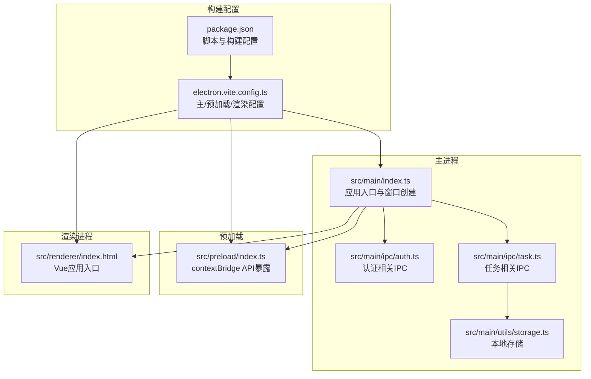
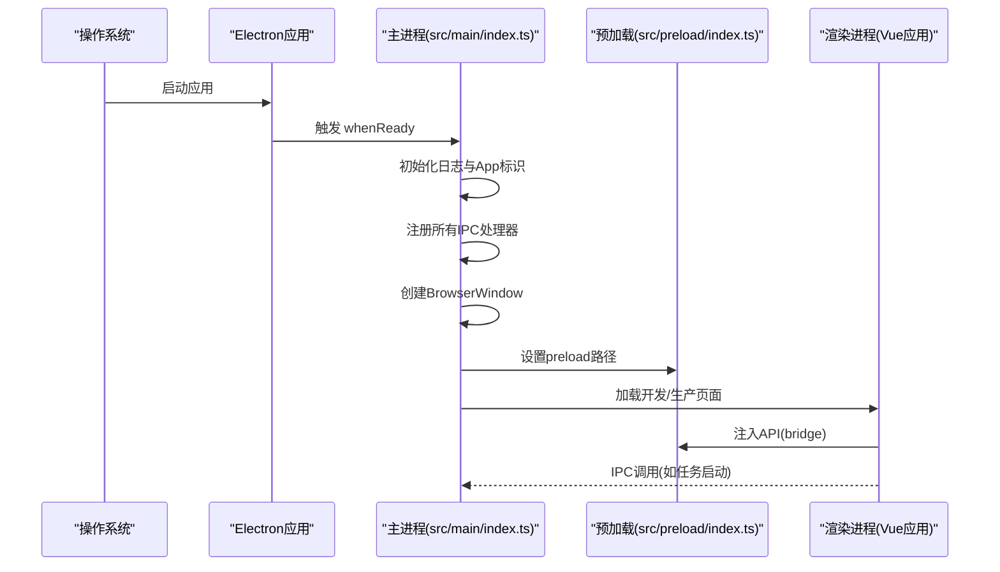
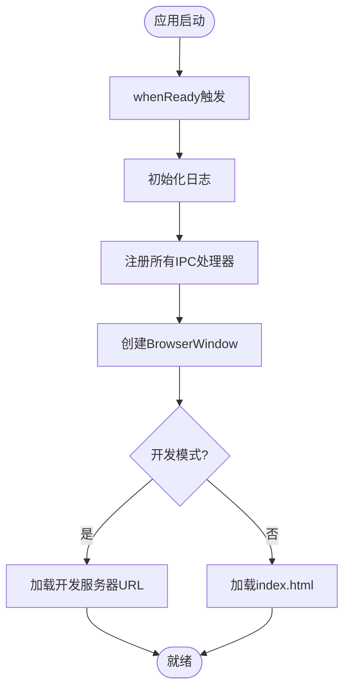
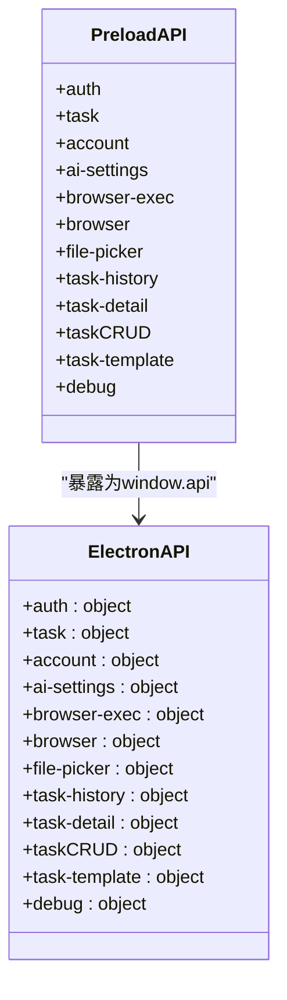
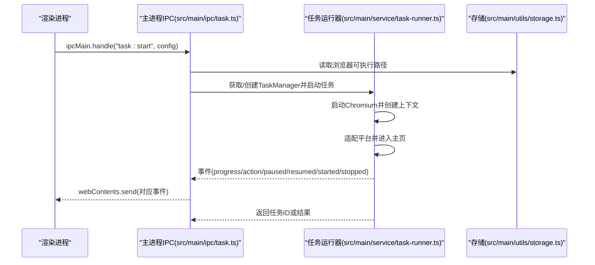
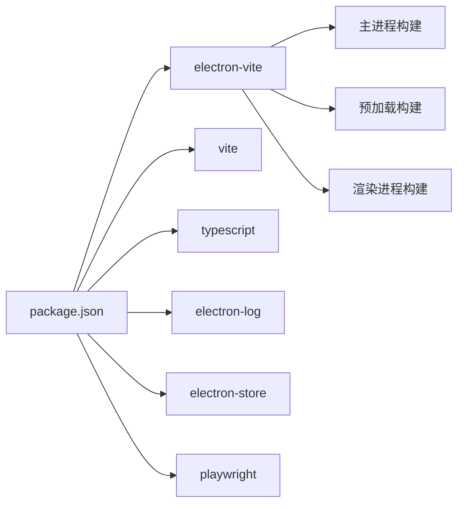

# 应用启动问题

<cite>
**本文引用的文件**
- [package.json](file://package.json)
- [electron.vite.config.ts](file://electron.vite.config.ts)
- [src/main/index.ts](file://src/main/index.ts)
- [src/preload/index.ts](file://src/preload/index.ts)
- [src/main/ipc/auth.ts](file://src/main/ipc/auth.ts)
- [src/main/ipc/task.ts](file://src/main/ipc/task.ts)
- [src/main/service/task-runner.ts](file://src/main/service/task-runner.ts)
- [src/main/utils/storage.ts](file://src/main/utils/storage.ts)
- [src/main/ipc/debug.ts](file://src/main/ipc/debug.ts)
- [npminstall-debug.log](file://npminstall-debug.log)
- [tsconfig.json](file://tsconfig.json)
</cite>

## 目录
1. [简介](#简介)
2. [项目结构](#项目结构)
3. [核心组件](#核心组件)
4. [架构总览](#架构总览)
5. [详细组件分析](#详细组件分析)
6. [依赖分析](#依赖分析)
7. [性能考虑](#性能考虑)
8. [故障排除指南](#故障排除指南)
9. [结论](#结论)
10. [附录](#附录)

## 简介
本指南聚焦于 AutoOps 应用在启动阶段的常见问题与系统化排障流程，覆盖 Electron 主进程启动失败、预加载脚本错误、Vite 构建配置问题、Node.js 版本兼容性、依赖安装问题、环境变量配置错误、启动日志分析方法、进程检查命令以及权限问题排查，并提供启动失败的快速诊断步骤与修复方案。同时解释 Electron 主进程与渲染进程的启动顺序与依赖关系，帮助开发者快速定位并解决问题。

## 项目结构
AutoOps 采用 Electron + Vue 3 + Vite 的现代桌面应用架构，主进程负责窗口创建、IPC 注册与业务逻辑协调；预加载脚本通过 contextBridge 暴露受限 API 给渲染进程；渲染进程为 Vue 应用，负责用户交互与界面展示。

图表来源
- [src/main/index.ts:1-106](file://src/main/index.ts#L1-L106)
- [src/preload/index.ts:1-234](file://src/preload/index.ts#L1-L234)
- [src/main/ipc/auth.ts:1-23](file://src/main/ipc/auth.ts#L1-L23)
- [src/main/ipc/task.ts:1-243](file://src/main/ipc/task.ts#L1-L243)
- [src/main/utils/storage.ts:1-53](file://src/main/utils/storage.ts#L1-L53)
- [electron.vite.config.ts:1-34](file://electron.vite.config.ts#L1-L34)
- [package.json:1-86](file://package.json#L1-L86)

章节来源
- [package.json:1-86](file://package.json#L1-L86)
- [electron.vite.config.ts:1-34](file://electron.vite.config.ts#L1-L34)
- [src/main/index.ts:1-106](file://src/main/index.ts#L1-L106)
- [src/preload/index.ts:1-234](file://src/preload/index.ts#L1-L234)
- [src/main/ipc/auth.ts:1-23](file://src/main/ipc/auth.ts#L1-L23)
- [src/main/ipc/task.ts:1-243](file://src/main/ipc/task.ts#L1-L243)
- [src/main/utils/storage.ts:1-53](file://src/main/utils/storage.ts#L1-L53)

## 核心组件
- 主进程入口与窗口创建：负责初始化日志、注册 IPC、创建 BrowserWindow、设置窗口行为与加载策略。
- 预加载脚本：通过 contextBridge 将受控 API 暴露给渲染进程，统一管理 IPC 调用与事件监听。
- 任务 IPC 与任务运行器：封装任务生命周期、并发控制、平台适配器与 Playwright 浏览器驱动。
- 存储模块：基于 electron-store 提供键值存储与默认值管理。
- 构建配置：electron-vite 分离主进程、预加载与渲染进程的构建路径与插件。

章节来源
- [src/main/index.ts:1-106](file://src/main/index.ts#L1-L106)
- [src/preload/index.ts:1-234](file://src/preload/index.ts#L1-L234)
- [src/main/ipc/task.ts:1-243](file://src/main/ipc/task.ts#L1-L243)
- [src/main/service/task-runner.ts:1-760](file://src/main/service/task-runner.ts#L1-L760)
- [src/main/utils/storage.ts:1-53](file://src/main/utils/storage.ts#L1-L53)
- [electron.vite.config.ts:1-34](file://electron.vite.config.ts#L1-L34)

## 架构总览
下图展示了 Electron 主进程与渲染进程的启动顺序与关键依赖关系：主进程先初始化日志与窗口，随后注册各类 IPC 处理器，再创建窗口并加载渲染进程；预加载脚本在窗口创建时注入，向渲染进程暴露 API。

图表来源
- [src/main/index.ts:54-84](file://src/main/index.ts#L54-L84)
- [src/preload/index.ts:233-234](file://src/preload/index.ts#L233-L234)

章节来源
- [src/main/index.ts:54-84](file://src/main/index.ts#L54-L84)
- [src/preload/index.ts:233-234](file://src/preload/index.ts#L233-L234)

## 详细组件分析

### 主进程启动流程与依赖
- 日志初始化：应用启动即初始化日志系统，便于后续追踪。
- 窗口创建：设置窗口尺寸、最小宽高、沙箱与隔离策略，加载开发或生产页面。
- IPC 注册：集中注册认证、任务、账户、登录、文件选择、任务历史、调试等 IPC。
- 窗口激活与退出：窗口激活时若无窗口则重建；非 macOS 下关闭所有窗口后退出。

图表来源
- [src/main/index.ts:54-84](file://src/main/index.ts#L54-L84)

章节来源
- [src/main/index.ts:1-106](file://src/main/index.ts#L1-L106)

### 预加载脚本与API桥接
- 通过 contextBridge 将 ElectronAPI 暴露到渲染进程的 window.api。
- 所有 IPC 调用均通过 ipcRenderer.invoke 或 on 事件监听实现，确保安全与可控。
- 提供认证、任务、账户、AI 设置、浏览器检测、文件选择、任务历史、任务 CRUD、调试等接口。

图表来源
- [src/preload/index.ts:13-122](file://src/preload/index.ts#L13-L122)

章节来源
- [src/preload/index.ts:1-234](file://src/preload/index.ts#L1-L234)

### 任务IPC与任务运行器
- 任务IPC：集中处理任务启动、停止、暂停、恢复、队列、并发、调度等请求，必要时转发事件到渲染进程。
- 任务运行器：基于 Playwright 启动 Chromium，创建上下文与页面，适配不同平台，执行评论、点赞、收藏、关注等操作，并记录进度与状态。

图表来源
- [src/main/ipc/task.ts:81-240](file://src/main/ipc/task.ts#L81-L240)
- [src/main/service/task-runner.ts:55-113](file://src/main/service/task-runner.ts#L55-L113)
- [src/main/utils/storage.ts:16-29](file://src/main/utils/storage.ts#L16-L29)

章节来源
- [src/main/ipc/task.ts:1-243](file://src/main/ipc/task.ts#L1-L243)
- [src/main/service/task-runner.ts:1-760](file://src/main/service/task-runner.ts#L1-L760)
- [src/main/utils/storage.ts:1-53](file://src/main/utils/storage.ts#L1-L53)

## 依赖分析
- 构建工具链：electron-vite 管理主/预加载/渲染三类构建；Vite 提供开发与生产构建能力。
- 运行时依赖：electron、electron-log、electron-store、@playwright/test、Vue 3 生态等。
- 开发依赖：Vite、TypeScript、TailwindCSS 插件等。
- Node.js 版本要求：Vite 对 Node 版本有明确范围要求，需与当前环境匹配。

图表来源
- [package.json:16-50](file://package.json#L16-L50)
- [electron.vite.config.ts:6-33](file://electron.vite.config.ts#L6-L33)

章节来源
- [package.json:1-86](file://package.json#L1-L86)
- [electron.vite.config.ts:1-34](file://electron.vite.config.ts#L1-L34)
- [tsconfig.json:1-18](file://tsconfig.json#L1-L18)

## 性能考虑
- 预加载与渲染进程隔离：启用 contextIsolation 与禁用 nodeIntegration，降低安全风险并保持性能稳定。
- 任务并发与资源占用：通过并发限制与浏览器上下文共享减少资源消耗，避免过度打开标签页。
- 日志级别与频率：合理使用 info/warn/error，避免高频写入影响启动速度。

## 故障排除指南

### 一、启动阶段常见问题与快速诊断

1) Electron 主进程启动失败
- 现象：应用启动后无窗口、无日志输出或立即退出。
- 快速检查清单
  - 确认主进程入口文件路径正确（package.json 的 main 字段指向编译产物）。
  - 检查开发模式下的 ELECTRON_RENDERER_URL 环境变量是否正确。
  - 查看主进程日志初始化是否成功（应用启动即初始化日志）。
- 关联文件
  - [src/main/index.ts:17-20](file://src/main/index.ts#L17-L20)
  - [src/main/index.ts:47-51](file://src/main/index.ts#L47-L51)
  - [package.json:5-5](file://package.json#L5-L5)

2) 预加载脚本错误
- 现象：渲染进程无法访问 window.api，或出现 bridge 注入失败。
- 快速检查清单
  - 确认 preload 路径在 BrowserWindow.webPreferences.preload 中正确配置。
  - 检查 contextBridge.exposeInMainWorld 是否执行。
  - 确认预加载导出的 ElectronAPI 类型与渲染端调用一致。
- 关联文件
  - [src/main/index.ts:30-36](file://src/main/index.ts#L30-L36)
  - [src/preload/index.ts:233-234](file://src/preload/index.ts#L233-L234)

3) Vite 构建配置问题
- 现象：开发模式无法热更新、生产构建产物缺失、路径别名不生效。
- 快速检查清单
  - 检查 electron.vite.config.ts 中主/预加载/渲染的输入与别名配置。
  - 确认 tsconfig.json 的路径映射与别名一致。
  - 确认开发脚本与构建脚本可用。
- 关联文件
  - [electron.vite.config.ts:6-33](file://electron.vite.config.ts#L6-L33)
  - [tsconfig.json:11-16](file://tsconfig.json#L11-L16)
  - [package.json:6-14](file://package.json#L6-L14)

4) Node.js 版本兼容性
- 现象：安装依赖时报错、Vite 启动失败、运行时报引擎错误。
- 快速检查清单
  - 查看 Vite 的 Node 版本要求范围。
  - 对照当前 Node 版本进行升级或降级。
- 关联文件
  - [package.json:42-49](file://package.json#L42-L49)
  - [npminstall-debug.log:11-11](file://npminstall-debug.log#L11-L11)

5) 依赖包安装问题
- 现象：依赖安装中断、部分二进制包下载失败、electron-builder 安装失败。
- 快速检查清单
  - 检查镜像源与代理配置，确保二进制包可下载。
  - 查看 npminstall 日志中的镜像与缓存目录。
  - 重试安装或清理缓存后重装。
- 关联文件
  - [npminstall-debug.log:1-175](file://npminstall-debug.log#L1-L175)
  - [package.json:14-14](file://package.json#L14-L14)

6) 环境变量配置错误
- 现象：开发模式无法加载远程地址、调试信息缺失。
- 快速检查清单
  - 确认开发模式下 ELECTRON_RENDERER_URL 已设置。
  - 检查 debug IPC 是否正常工作以获取平台与版本信息。
- 关联文件
  - [src/main/index.ts:47-49](file://src/main/index.ts#L47-L49)
  - [src/main/ipc/debug.ts:1-12](file://src/main/ipc/debug.ts#L1-L12)

7) 启动日志分析方法
- 快速定位
  - 主进程日志：应用启动即初始化日志，观察初始化与 IPC 注册阶段。
  - 渲染进程日志：通过 IPC 接收主进程转发的任务事件，辅助定位问题。
- 关联文件
  - [src/main/index.ts:17-20](file://src/main/index.ts#L17-L20)
  - [src/main/ipc/task.ts:21-77](file://src/main/ipc/task.ts#L21-L77)

8) 进程检查命令
- Windows
  - 查看 Electron 进程：任务管理器或 PowerShell Get-Process | Where-Object { $_.ProcessName -like "*electron*" }
  - 结束残留进程：PowerShell Stop-Process -Name electron -Force
- macOS/Linux
  - 查看进程：ps aux | grep electron
  - 结束进程：killall electron 或 pkill electron

9) 权限问题排查
- 现象：无法启动浏览器、无法写入存储、无法访问特定目录。
- 快速检查清单
  - 确认浏览器可执行路径存在且可执行。
  - 检查应用数据目录权限，确保 electron-store 可写。
  - 确认文件选择与目录访问权限。
- 关联文件
  - [src/main/ipc/task.ts:98-102](file://src/main/ipc/task.ts#L98-L102)
  - [src/main/utils/storage.ts:16-29](file://src/main/utils/storage.ts#L16-L29)

### 二、启动失败的快速诊断步骤与修复方案

- 步骤 1：确认主进程入口与窗口创建
  - 检查 package.json main 与 electron.vite 输出路径是否一致。
  - 确认开发模式下 ELECTRON_RENDERER_URL 是否设置。
  - 关联文件
    - [package.json:5-5](file://package.json#L5-L5)
    - [src/main/index.ts:47-51](file://src/main/index.ts#L47-L51)

- 步骤 2：验证预加载桥接
  - 确认 preload 路径与 contextBridge 注入。
  - 关联文件
    - [src/main/index.ts:30-36](file://src/main/index.ts#L30-L36)
    - [src/preload/index.ts:233-234](file://src/preload/index.ts#L233-L234)

- 步骤 3：检查任务启动前置条件
  - 确认浏览器可执行路径已配置，否则任务启动会直接失败。
  - 关联文件
    - [src/main/ipc/task.ts:98-102](file://src/main/ipc/task.ts#L98-L102)
    - [src/main/utils/storage.ts:37-37](file://src/main/utils/storage.ts#L37-L37)

- 步骤 4：核对构建与别名配置
  - 确认 electron.vite 与 tsconfig 的路径别名一致。
  - 关联文件
    - [electron.vite.config.ts:8-12](file://electron.vite.config.ts#L8-L12)
    - [tsconfig.json:13-16](file://tsconfig.json#L13-L16)

- 步骤 5：验证 Node.js 与依赖
  - 对照 Vite 的 Node 版本要求，必要时切换 Node 版本。
  - 使用 npminstall 日志排查二进制包下载问题。
  - 关联文件
    - [package.json:42-49](file://package.json#L42-L49)
    - [npminstall-debug.log:11-11](file://npminstall-debug.log#L11-L11)

### 三、启动顺序与依赖关系总结
- 主进程先初始化日志与 App 标识，再注册所有 IPC，最后创建窗口并加载页面。
- 预加载在窗口创建时注入，渲染进程通过 window.api 访问受限功能。
- 任务启动依赖浏览器可执行路径与平台适配器，失败时应优先检查存储与路径配置。

章节来源
- [src/main/index.ts:54-84](file://src/main/index.ts#L54-L84)
- [src/preload/index.ts:233-234](file://src/preload/index.ts#L233-L234)
- [src/main/ipc/task.ts:98-102](file://src/main/ipc/task.ts#L98-L102)
- [src/main/utils/storage.ts:37-37](file://src/main/utils/storage.ts#L37-L37)
- [electron.vite.config.ts:8-12](file://electron.vite.config.ts#L8-L12)
- [tsconfig.json:13-16](file://tsconfig.json#L13-L16)
- [package.json:42-49](file://package.json#L42-L49)
- [npminstall-debug.log:11-11](file://npminstall-debug.log#L11-L11)

## 结论
通过系统化的启动流程梳理与故障排除清单，可以高效定位 Electron 主进程、预加载脚本、Vite 构建、Node.js 版本、依赖安装、环境变量与权限等问题。建议在日常开发中：
- 固化构建配置与别名映射；
- 明确开发/生产环境变量；
- 严格管理 Node 与依赖版本；
- 利用日志与 IPC 事件进行问题追踪；
- 在任务启动前校验前置条件（如浏览器路径）。

## 附录

### A. 常见启动错误与定位要点
- 主进程崩溃：检查日志初始化与 IPC 注册阶段；确认窗口创建参数。
- 预加载失败：检查 preload 路径与 contextBridge 注入。
- 构建失败：核对 electron.vite 与 tsconfig 的别名与输入。
- Node 版本不符：对照 Vite 要求调整 Node 版本。
- 依赖安装失败：检查镜像与二进制包下载日志。
- 环境变量缺失：确认开发模式下的 ELECTRON_RENDERER_URL。
- 权限不足：检查浏览器路径与存储目录权限。

章节来源
- [src/main/index.ts:17-20](file://src/main/index.ts#L17-L20)
- [src/main/index.ts:30-36](file://src/main/index.ts#L30-L36)
- [src/main/index.ts:47-51](file://src/main/index.ts#L47-L51)
- [src/preload/index.ts:233-234](file://src/preload/index.ts#L233-L234)
- [electron.vite.config.ts:8-12](file://electron.vite.config.ts#L8-L12)
- [tsconfig.json:13-16](file://tsconfig.json#L13-L16)
- [package.json:42-49](file://package.json#L42-L49)
- [npminstall-debug.log:11-11](file://npminstall-debug.log#L11-L11)
- [src/main/ipc/debug.ts:1-12](file://src/main/ipc/debug.ts#L1-L12)
- [src/main/ipc/task.ts:98-102](file://src/main/ipc/task.ts#L98-L102)
- [src/main/utils/storage.ts:37-37](file://src/main/utils/storage.ts#L37-L37)