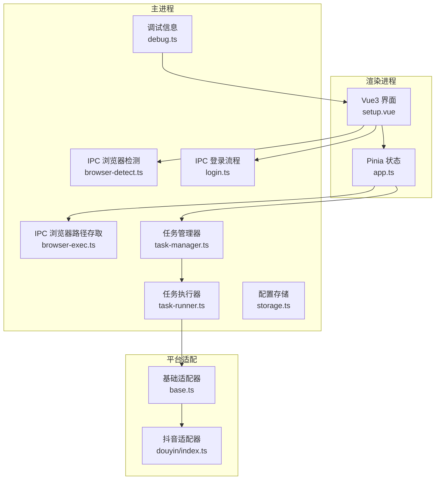
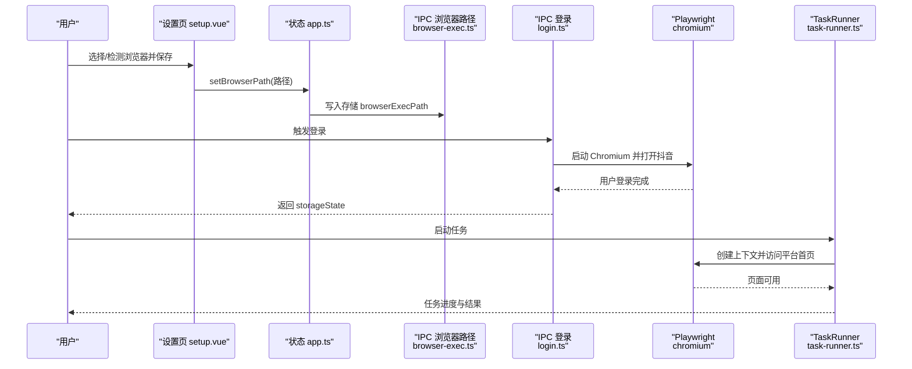
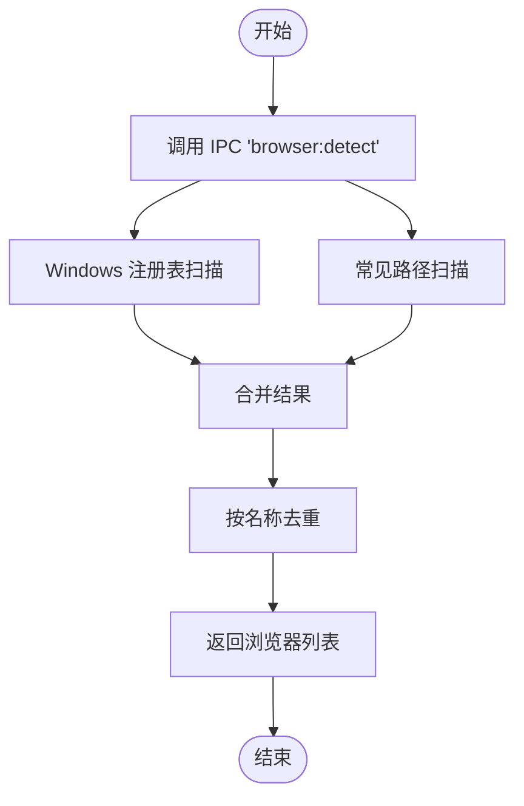
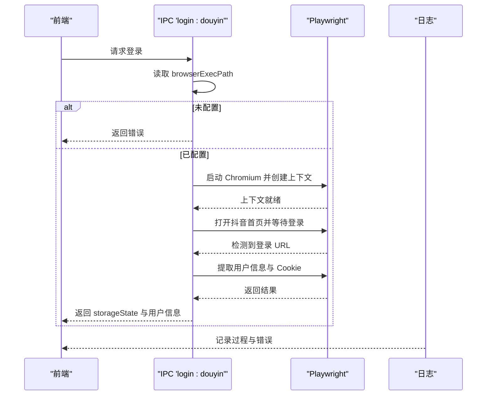
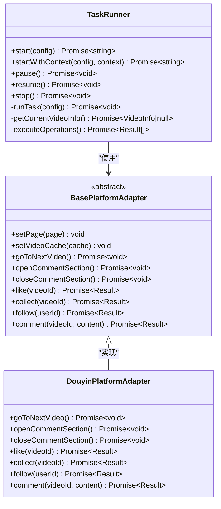
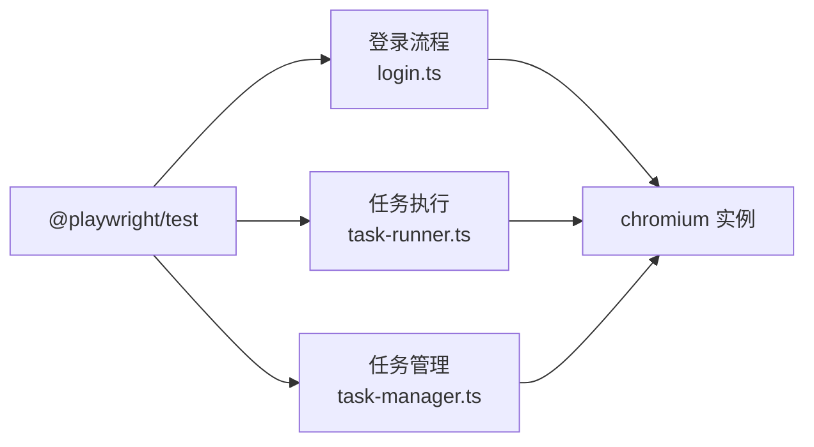

# 浏览器自动化问题

<cite>
**本文引用的文件**
- [package.json](file://package.json)
- [fix-account-add-issue.md](file://.trae/documents/fix-account-add-issue.md)
- [login.ts](file://src/main/ipc/login.ts)
- [browser-detect.ts](file://src/main/ipc/browser-detect.ts)
- [browser-exec.ts](file://src/main/ipc/browser-exec.ts)
- [storage.ts](file://src/main/utils/storage.ts)
- [setup.vue](file://src/renderer/src/pages/setup.vue)
- [app.ts](file://src/renderer/src/stores/app.ts)
- [task-runner.ts](file://src/main/service/task-runner.ts)
- [task-manager.ts](file://src/main/service/task-manager.ts)
- [base.ts](file://src/main/platform/base.ts)
- [index.ts](file://src/main/platform/douyin/index.ts)
- [debug.ts](file://src/main/ipc/debug.ts)
- [任务启动无反应排查计划.md](file://.trae/documents/任务启动无反应排查计划.md)
</cite>

## 目录
1. [简介](#简介)
2. [项目结构](#项目结构)
3. [核心组件](#核心组件)
4. [架构总览](#架构总览)
5. [详细组件分析](#详细组件分析)
6. [依赖关系分析](#依赖关系分析)
7. [性能考量](#性能考量)
8. [故障排除指南](#故障排除指南)
9. [结论](#结论)
10. [附录](#附录)

## 简介
本指南聚焦于浏览器自动化运行时问题的综合故障排除，围绕 Playwright 相关问题展开，涵盖版本不匹配、驱动安装失败、浏览器权限问题；详细说明测试环境配置、chromium 驱动安装与跨平台兼容性；并提供页面元素定位失败、自动化操作超时、浏览器崩溃等常见问题的诊断与修复方法。同时给出调试技巧、截图与视频录制建议，以及不同平台下的浏览器配置差异与最佳实践。

## 项目结构
该项目采用 Electron + Vue3 的桌面应用架构，Playwright 用于浏览器自动化与任务执行。关键目录与职责如下：
- src/main/ipc：主进程 IPC 通道，负责浏览器检测、执行路径存取、登录流程、调试信息等
- src/main/service：任务调度与执行，包括 TaskRunner、TaskManager
- src/main/platform：平台适配层，抽象了抖音等平台的操作接口
- src/main/utils：通用工具与配置存储
- src/renderer：Vue3 前端界面，包含设置页、任务页等
- .trae/documents：内部文档，包含问题修复与排查计划

图表来源
- [setup.vue:1-245](file://src/renderer/src/pages/setup.vue#L1-L245)
- [app.ts:1-70](file://src/renderer/src/stores/app.ts#L1-L70)
- [browser-detect.ts:1-118](file://src/main/ipc/browser-detect.ts#L1-L118)
- [browser-exec.ts:1-13](file://src/main/ipc/browser-exec.ts#L1-L13)
- [login.ts:1-193](file://src/main/ipc/login.ts#L1-L193)
- [task-runner.ts:1-760](file://src/main/service/task-runner.ts#L1-L760)
- [task-manager.ts:84-132](file://src/main/service/task-manager.ts#L84-L132)
- [base.ts:1-105](file://src/main/platform/base.ts#L1-L105)
- [index.ts:363-407](file://src/main/platform/douyin/index.ts#L363-L407)

章节来源
- [package.json:16-34](file://package.json#L16-L34)
- [setup.vue:1-245](file://src/renderer/src/pages/setup.vue#L1-L245)
- [app.ts:1-70](file://src/renderer/src/stores/app.ts#L1-L70)
- [browser-detect.ts:1-118](file://src/main/ipc/browser-detect.ts#L1-L118)
- [browser-exec.ts:1-13](file://src/main/ipc/browser-exec.ts#L1-L13)
- [login.ts:1-193](file://src/main/ipc/login.ts#L1-L193)
- [task-runner.ts:1-760](file://src/main/service/task-runner.ts#L1-L760)
- [task-manager.ts:84-132](file://src/main/service/task-manager.ts#L84-L132)
- [base.ts:1-105](file://src/main/platform/base.ts#L1-L105)
- [index.ts:363-407](file://src/main/platform/douyin/index.ts#L363-L407)

## 核心组件
- 浏览器检测与路径配置
  - 主进程通过 IPC 提供浏览器检测能力，支持 Windows 注册表与常见路径扫描，并去重返回唯一浏览器列表
  - 前端设置页提供“检测到的浏览器”列表与“自定义路径”，并将所选路径写入存储
  - 存储键为 browserExecPath，供后续登录与任务执行使用
- 登录流程
  - 使用 Playwright 启动 Chromium，打开抖音首页，等待用户手动登录并检测 URL 变化
  - 成功后提取用户信息与 Cookie，封装为 storageState 返回给前端
- 任务执行
  - TaskRunner 负责单任务执行，支持外部上下文共享与独立上下文
  - 通过平台适配器抽象不同平台的交互细节，如打开评论区、翻页、点赞/收藏/关注/评论等
- 调试与环境信息
  - 提供调试 IPC 获取平台、架构、Electron 版本等信息，便于定位跨平台问题

章节来源
- [browser-detect.ts:105-117](file://src/main/ipc/browser-detect.ts#L105-L117)
- [browser-exec.ts:4-13](file://src/main/ipc/browser-exec.ts#L4-L13)
- [storage.ts:33-44](file://src/main/utils/storage.ts#L33-L44)
- [setup.vue:32-75](file://src/renderer/src/pages/setup.vue#L32-L75)
- [login.ts:85-193](file://src/main/ipc/login.ts#L85-L193)
- [task-runner.ts:25-113](file://src/main/service/task-runner.ts#L25-L113)
- [base.ts:24-80](file://src/main/platform/base.ts#L24-L80)
- [debug.ts:3-12](file://src/main/ipc/debug.ts#L3-L12)

## 架构总览
下图展示从用户操作到 Playwright 执行的关键链路，包括浏览器路径读取、登录流程、任务执行与平台适配。

图表来源
- [setup.vue:32-75](file://src/renderer/src/pages/setup.vue#L32-L75)
- [app.ts:32-43](file://src/renderer/src/stores/app.ts#L32-L43)
- [browser-exec.ts:4-13](file://src/main/ipc/browser-exec.ts#L4-L13)
- [login.ts:85-193](file://src/main/ipc/login.ts#L85-L193)
- [task-runner.ts:55-113](file://src/main/service/task-runner.ts#L55-L113)

## 详细组件分析

### 组件A：浏览器检测与路径配置
- 功能要点
  - Windows：从注册表与常见路径扫描 Chrome/Edge；非 Windows 平台仅扫描常见路径
  - 去重策略：按名称去重，避免重复显示同一浏览器
  - 前端交互：提供刷新检测、自定义路径、验证保存
  - 存储：通过 IPC 读写 browserExecPath
- 关键数据流
  - 前端触发检测 -> IPC 处理器 -> 扫描系统 -> 返回唯一列表 -> 前端渲染
  - 前端选择或自定义路径 -> IPC 写入 -> 存储生效 -> 后续流程使用

图表来源
- [browser-detect.ts:105-117](file://src/main/ipc/browser-detect.ts#L105-L117)

章节来源
- [browser-detect.ts:1-118](file://src/main/ipc/browser-detect.ts#L1-L118)
- [browser-exec.ts:1-13](file://src/main/ipc/browser-exec.ts#L1-L13)
- [storage.ts:33-44](file://src/main/utils/storage.ts#L33-L44)
- [setup.vue:32-75](file://src/renderer/src/pages/setup.vue#L32-L75)

### 组件B：登录流程（Playwright）
- 功能要点
  - 读取浏览器路径，若未配置则直接返回错误
  - 启动 Chromium，使用持久化用户目录，禁用部分安全特性以提升兼容性
  - 打开抖音首页，等待用户登录（URL 匹配），随后提取用户信息与 Cookie
- 错误处理
  - 路径缺失、启动失败、URL 等待超时、信息提取失败均有相应日志与错误返回

图表来源
- [login.ts:85-193](file://src/main/ipc/login.ts#L85-L193)

章节来源
- [login.ts:1-193](file://src/main/ipc/login.ts#L1-L193)

### 组件C：任务执行（TaskRunner）
- 功能要点
  - 支持独立浏览器与共享上下文两种启动模式
  - 监听平台 feed 接口响应，缓存视频数据
  - 通过平台适配器执行翻页、打开评论区、点赞/收藏/关注/评论等操作
  - 支持暂停/恢复/停止，异步执行任务循环
- 关键流程
  - 启动 -> 创建上下文 -> 设置适配器 -> 进入主页 -> 循环处理视频 -> 结束并保存状态

图表来源
- [task-runner.ts:25-113](file://src/main/service/task-runner.ts#L25-L113)
- [base.ts:24-80](file://src/main/platform/base.ts#L24-L80)
- [index.ts:363-407](file://src/main/platform/douyin/index.ts#L363-L407)

章节来源
- [task-runner.ts:1-760](file://src/main/service/task-runner.ts#L1-L760)
- [base.ts:1-105](file://src/main/platform/base.ts#L1-L105)
- [index.ts:363-407](file://src/main/platform/douyin/index.ts#L363-L407)

### 组件D：跨平台与环境信息
- 调试 IPC 提供 platform/arch/versions/electron 等信息，便于定位跨平台差异
- 浏览器路径配置在各平台下需确保可执行权限与路径正确

章节来源
- [debug.ts:3-12](file://src/main/ipc/debug.ts#L3-L12)
- [browser-detect.ts:12-33](file://src/main/ipc/browser-detect.ts#L12-L33)

## 依赖关系分析
- Playwright 版本与依赖
  - package.json 中依赖 @playwright/test，而非 playwright；登录流程中应使用 @playwright/test 进行动态导入
- 依赖关系图

图表来源
- [package.json:19](file://package.json#L19)
- [login.ts:94](file://src/main/ipc/login.ts#L94)
- [task-runner.ts:2](file://src/main/service/task-runner.ts#L2)
- [task-manager.ts:117-120](file://src/main/service/task-manager.ts#L117-L120)

章节来源
- [package.json:1-86](file://package.json#L1-L86)
- [login.ts:94](file://src/main/ipc/login.ts#L94)
- [task-runner.ts:2](file://src/main/service/task-runner.ts#L2)
- [task-manager.ts:117-120](file://src/main/service/task-manager.ts#L117-L120)

## 性能考量
- 启动参数优化
  - 登录流程中禁用 web 安全与隔离特性以提升兼容性，但可能带来安全风险，建议仅在受控环境下使用
- 等待策略
  - 页面加载与 URL 等待设置了合理超时；建议根据网络状况调整超时时间
- 缓存与复用
  - 任务执行器监听 feed 接口响应并缓存视频数据，减少重复请求
- 并发控制
  - 任务管理器支持最大并发数设置，避免资源争用导致性能下降

章节来源
- [login.ts:98-107](file://src/main/ipc/login.ts#L98-L107)
- [task-runner.ts:160-180](file://src/main/service/task-runner.ts#L160-L180)
- [task-manager.ts:96-102](file://src/main/service/task-manager.ts#L96-L102)

## 故障排除指南

### Playwright 版本不匹配
- 症状
  - 运行时报错找不到模块或功能异常
- 根因
  - package.json 依赖 @playwright/test，但登录流程使用 import('playwright') 动态导入
- 修复步骤
  - 升级到最新稳定版并安装 chromium 驱动
  - 将登录流程中的动态导入改为 import('@playwright/test')
- 验证
  - 类型检查通过，开发模式下账号添加功能正常

章节来源
- [fix-account-add-issue.md:1-41](file://.trae/documents/fix-account-add-issue.md#L1-L41)
- [package.json:19](file://package.json#L19)
- [login.ts:94](file://src/main/ipc/login.ts#L94)

### 驱动安装失败
- 症状
  - 启动浏览器时报错，无法找到可执行文件
- 根因
  - 未安装 chromium 驱动或路径配置错误
- 修复步骤
  - 安装驱动并确保可执行文件存在
  - 在设置页检测并选择正确的浏览器路径
- 验证
  - 设置页成功显示浏览器列表，保存后任务可正常启动

章节来源
- [fix-account-add-issue.md:18-22](file://.trae/documents/fix-account-add-issue.md#L18-L22)
- [browser-detect.ts:82-103](file://src/main/ipc/browser-detect.ts#L82-L103)
- [setup.vue:32-75](file://src/renderer/src/pages/setup.vue#L32-L75)

### 浏览器权限问题
- 症状
  - 登录流程无法打开页面或页面空白
- 根因
  - 路径不可执行或权限不足
- 修复步骤
  - 确保浏览器可执行文件具备执行权限
  - 使用管理员权限运行应用
- 验证
  - 登录流程可正常打开抖音首页并等待用户登录

章节来源
- [login.ts:87-91](file://src/main/ipc/login.ts#L87-L91)
- [browser-exec.ts:9-12](file://src/main/ipc/browser-exec.ts#L9-L12)

### 页面元素定位失败
- 症状
  - 点击/输入无效，或等待超时
- 根因
  - 选择器失效、页面结构变化、等待条件不满足
- 修复步骤
  - 更新平台适配器中的选择器
  - 增加更稳健的等待条件（如可见、稳定等）
- 验证
  - 重新执行任务，观察元素交互是否成功

章节来源
- [base.ts:63-66](file://src/main/platform/base.ts#L63-L66)
- [index.ts:391-394](file://src/main/platform/douyin/index.ts#L391-L394)

### 自动化操作超时
- 症状
  - 等待 URL/元素/响应超时
- 根因
  - 网络延迟、页面加载慢、等待条件过于严格
- 修复步骤
  - 适当增加超时时间
  - 使用更宽松的等待策略（如存在即止）
- 验证
  - 任务可在合理时间内完成

章节来源
- [login.ts:117-121](file://src/main/ipc/login.ts#L117-L121)
- [task-runner.ts:391-394](file://src/main/service/task-runner.ts#L391-L394)

### 浏览器崩溃
- 症状
  - 应用无响应或崩溃
- 根因
  - 资源占用过高、上下文异常断开、并发过多
- 修复步骤
  - 降低并发数，启用共享上下文
  - 监控断开事件并重建上下文
- 验证
  - 任务稳定运行，无频繁崩溃

章节来源
- [task-manager.ts:121-124](file://src/main/service/task-manager.ts#L121-L124)
- [task-runner.ts:204-233](file://src/main/service/task-runner.ts#L204-L233)

### 任务启动无反应
- 症状
  - 点击“启动”按钮无响应
- 根因
  - IPC 通道未正确连接、前端未显示错误、平台适配器方法被遮蔽
- 修复步骤
  - 在前端添加调试日志确认调用
  - 检查主进程日志与 IPC handler 是否被调用
  - 修复平台适配器方法遮蔽问题
- 验证
  - 启动按钮可正常触发任务并显示进度

章节来源
- [任务启动无反应排查计划.md:1-45](file://.trae/documents/任务启动无反应排查计划.md#L1-L45)
- [index.ts:363-375](file://src/main/platform/douyin/index.ts#L363-L375)

### 调试技巧与截图/视频录制
- 调试技巧
  - 使用调试 IPC 获取平台与版本信息，辅助跨平台问题定位
  - 在关键节点添加日志，记录 URL、状态与耗时
- 截图与视频
  - Playwright 提供截图与视频录制能力，可在任务执行前后捕获关键状态
  - 建议在失败场景与边界条件处进行截图与录屏以便复现

章节来源
- [debug.ts:3-12](file://src/main/ipc/debug.ts#L3-L12)
- [task-runner.ts:746-758](file://src/main/service/task-runner.ts#L746-L758)

### 跨平台兼容性
- Windows
  - 支持注册表扫描与常见路径；注意权限与路径分隔符
- macOS/Linux
  - 仅支持常见路径扫描；注意可执行权限与沙箱限制
- 最佳实践
  - 在各平台下统一使用 Electron 的可执行路径
  - 对于沙箱受限环境，考虑降级安全策略或调整启动参数

章节来源
- [browser-detect.ts:12-33](file://src/main/ipc/browser-detect.ts#L12-L33)
- [login.ts:103-106](file://src/main/ipc/login.ts#L103-L106)

## 结论
本指南基于项目现有实现，系统梳理了 Playwright 相关运行时问题的诊断与修复路径。通过规范版本依赖、完善驱动安装、修正导入路径、增强等待策略与日志记录，可显著提升自动化稳定性与可维护性。建议在生产环境中进一步完善错误处理、监控告警与回滚机制，以应对复杂多变的浏览器生态。

## 附录
- 快速检查清单
  - Playwright 版本与依赖一致
  - 已安装 chromium 驱动
  - 浏览器路径可执行且权限正确
  - 设置页成功保存 browserExecPath
  - 登录流程可正常打开目标页面
  - 任务执行日志完整，无超时/崩溃
  - 跨平台差异已通过调试信息确认