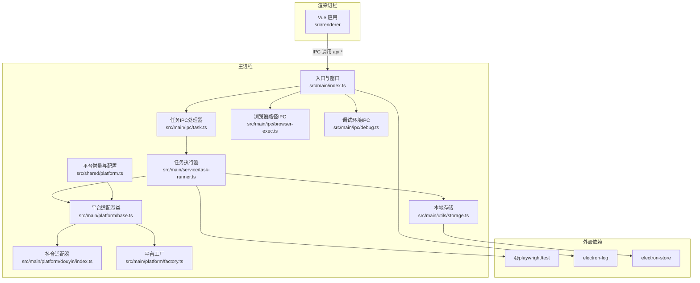
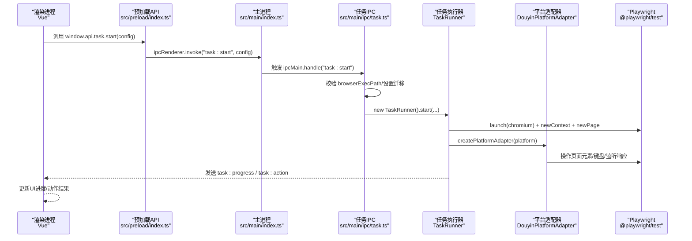
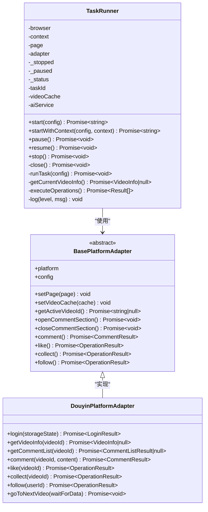
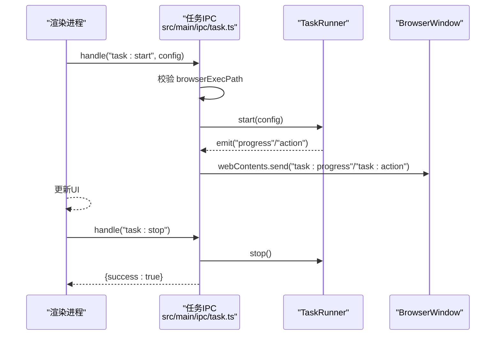
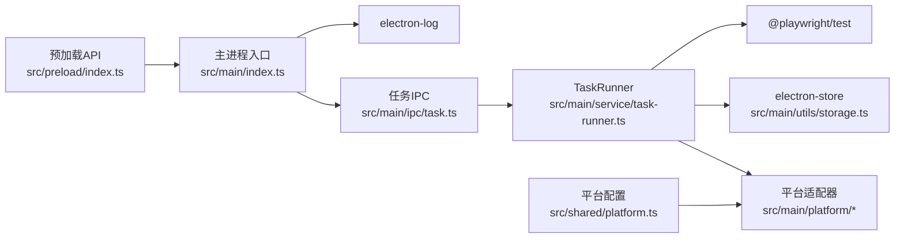

# 运行时问题

<cite>
**本文引用的文件**
- [package.json](file://package.json)
- [src/main/index.ts](file://src/main/index.ts)
- [src/preload/index.ts](file://src/preload/index.ts)
- [src/main/service/task-runner.ts](file://src/main/service/task-runner.ts)
- [src/main/ipc/task.ts](file://src/main/ipc/task.ts)
- [src/main/ipc/browser-exec.ts](file://src/main/ipc/browser-exec.ts)
- [src/main/ipc/debug.ts](file://src/main/ipc/debug.ts)
- [src/main/utils/storage.ts](file://src/main/utils/storage.ts)
- [src/main/platform/base.ts](file://src/main/platform/base.ts)
- [src/main/platform/factory.ts](file://src/main/platform/factory.ts)
- [src/main/platform/douyin/index.ts](file://src/main/platform/douyin/index.ts)
- [src/shared/platform.ts](file://src/shared/platform.ts)
- [.trae/documents/任务启动无反应排查计划.md](file://.trae/documents/任务启动无反应排查计划.md)
- [.trae/documents/fix-account-add-issue.md](file://.trae/documents/fix-account-add-issue.md)
</cite>

## 目录
1. [简介](#简介)
2. [项目结构](#项目结构)
3. [核心组件](#核心组件)
4. [架构总览](#架构总览)
5. [详细组件分析](#详细组件分析)
6. [依赖关系分析](#依赖关系分析)
7. [性能考量](#性能考量)
8. [故障排除指南](#故障排除指南)
9. [结论](#结论)
10. [附录](#附录)

## 简介
本指南聚焦于 AutoOps 在运行时可能出现的问题与排障实践，覆盖应用启动失败、任务执行异常、浏览器自动化问题（Playwright 版本与驱动、权限与沙箱设置）、IPC 通信异常、内存泄漏检测、日志分析与调试技巧、性能监控、常见运行时错误代码与异常堆栈解读、系统资源监控与进程管理、服务重启策略以及紧急恢复与数据保护。内容基于仓库中的实际实现进行归纳，并提供可操作的定位与修复路径。

## 项目结构
AutoOps 采用 Electron + Vue3 架构，主进程负责任务调度、Playwright 浏览器控制与 IPC，渲染层提供任务与账号管理界面。Playwright 用于抖音等平台的自动化操作；Electron Store 提供本地持久化；electron-log 输出日志。

图表来源
- [src/main/index.ts:1-106](file://src/main/index.ts#L1-L106)
- [src/main/ipc/task.ts:1-104](file://src/main/ipc/task.ts#L1-L104)
- [src/main/ipc/browser-exec.ts:1-13](file://src/main/ipc/browser-exec.ts#L1-L13)
- [src/main/ipc/debug.ts:1-12](file://src/main/ipc/debug.ts#L1-L12)
- [src/main/service/task-runner.ts:1-760](file://src/main/service/task-runner.ts#L1-L760)
- [src/main/platform/base.ts:1-105](file://src/main/platform/base.ts#L1-L105)
- [src/main/platform/douyin/index.ts:1-507](file://src/main/platform/douyin/index.ts#L1-L507)
- [src/main/platform/factory.ts:1-32](file://src/main/platform/factory.ts#L1-L32)
- [src/main/utils/storage.ts:1-46](file://src/main/utils/storage.ts#L1-L46)
- [src/shared/platform.ts:1-260](file://src/shared/platform.ts#L1-L260)

章节来源
- [src/main/index.ts:1-106](file://src/main/index.ts#L1-L106)
- [src/preload/index.ts:1-187](file://src/preload/index.ts#L1-L187)
- [package.json:1-85](file://package.json#L1-L85)

## 核心组件
- 主进程入口与窗口管理：负责创建 BrowserWindow、注册 IPC、初始化日志。
- 任务执行器 TaskRunner：封装 Playwright 生命周期、页面与上下文管理、任务循环、事件发射与状态维护。
- 平台适配器体系：抽象 BasePlatformAdapter，具体实现如 DouyinPlatformAdapter，负责各平台的元素选择器、API 端点、键盘快捷键、评论/点赞/收藏/关注等操作。
- IPC 层：提供 auth、task、account、login、file-picker、task-history、task-detail、task-template、debug 等 API；任务 IPC 负责启动/停止/状态查询。
- 存储层：electron-store 封装，统一读写认证、设置、任务历史、账号等数据。
- 日志：electron-log 主进程日志，配合 IPC 从渲染进程接收日志级别与消息。

章节来源
- [src/main/index.ts:1-106](file://src/main/index.ts#L1-L106)
- [src/main/service/task-runner.ts:1-760](file://src/main/service/task-runner.ts#L1-L760)
- [src/main/platform/base.ts:1-105](file://src/main/platform/base.ts#L1-L105)
- [src/main/platform/douyin/index.ts:1-507](file://src/main/platform/douyin/index.ts#L1-L507)
- [src/main/ipc/task.ts:1-104](file://src/main/ipc/task.ts#L1-L104)
- [src/main/utils/storage.ts:1-46](file://src/main/utils/storage.ts#L1-L46)

## 架构总览
下图展示从渲染层发起任务启动到主进程 TaskRunner 执行、Playwright 控制浏览器、平台适配器与页面交互的端到端流程。

图表来源
- [src/preload/index.ts:102-116](file://src/preload/index.ts#L102-L116)
- [src/main/ipc/task.ts:11-84](file://src/main/ipc/task.ts#L11-L84)
- [src/main/service/task-runner.ts:55-113](file://src/main/service/task-runner.ts#L55-L113)
- [src/main/platform/douyin/index.ts:69-105](file://src/main/platform/douyin/index.ts#L69-L105)

## 详细组件分析

### 组件A：任务执行器 TaskRunner
- 职责：启动/暂停/恢复/停止任务；管理 Playwright 浏览器、上下文与页面；监听 feed 数据缓存；执行规则匹配与操作（点赞/收藏/关注/评论）；事件发射 progress/action/stopped。
- 关键点：
  - 支持两种启动模式：自行创建浏览器（兼容旧调用）与共享上下文（并行多任务）。
  - 通过 storageState 恢复登录态，任务结束保存状态。
  - 通过 EventEmitter 发布进度与动作事件，供主进程广播到所有窗口。
  - 对异常进行捕获并标记状态为 failed，随后关闭资源。

图表来源
- [src/main/service/task-runner.ts:25-760](file://src/main/service/task-runner.ts#L25-L760)
- [src/main/platform/base.ts:24-80](file://src/main/platform/base.ts#L24-L80)
- [src/main/platform/douyin/index.ts:56-507](file://src/main/platform/douyin/index.ts#L56-L507)

章节来源
- [src/main/service/task-runner.ts:1-760](file://src/main/service/task-runner.ts#L1-L760)
- [src/main/platform/base.ts:1-105](file://src/main/platform/base.ts#L1-L105)
- [src/main/platform/douyin/index.ts:1-507](file://src/main/platform/douyin/index.ts#L1-L507)

### 组件B：任务IPC处理器
- 职责：接收渲染层任务启动请求，校验浏览器可执行路径，迁移设置版本，创建 TaskRunner 并转发进度与动作事件到所有窗口，提供停止与状态查询。
- 关键点：
  - 若未配置浏览器路径，直接返回错误。
  - 任务运行期间通过事件广播进度与动作，便于 UI 实时反馈。
  - 异常时清理 currentTaskRunner 并返回错误信息。

图表来源
- [src/main/ipc/task.ts:11-103](file://src/main/ipc/task.ts#L11-L103)
- [src/main/service/task-runner.ts:204-233](file://src/main/service/task-runner.ts#L204-L233)

章节来源
- [src/main/ipc/task.ts:1-104](file://src/main/ipc/task.ts#L1-L104)

### 组件C：浏览器路径与调试IPC
- 浏览器路径 IPC：提供获取/设置浏览器可执行路径，供任务启动前校验。
- 调试 IPC：返回平台、架构、Electron/Node 版本等环境信息，辅助诊断。

章节来源
- [src/main/ipc/browser-exec.ts:1-13](file://src/main/ipc/browser-exec.ts#L1-L13)
- [src/main/ipc/debug.ts:1-12](file://src/main/ipc/debug.ts#L1-L12)

### 组件D：预加载API与渲染层交互
- 预加载暴露 window.api.*，包括任务启动/停止/状态、账号管理、文件选择、任务历史、模板、调试等。
- 渲染层通过 api.task.start 发起任务，订阅 task:progress 与 task:action 事件更新 UI。

章节来源
- [src/preload/index.ts:1-187](file://src/preload/index.ts#L1-L187)

## 依赖关系分析
- Electron 与日志：主进程使用 electron-log 输出日志；渲染进程通过 IPC 将日志级别与消息转发至主进程。
- Playwright：@playwright/test 用于 Chromium 启动、页面操作与响应监听；版本需与项目依赖一致。
- 存储：electron-store 统一管理认证、设置、任务历史、账号等数据。
- 平台配置：shared/platform.ts 定义平台信息、选择器、API 端点与快捷键，被适配器与任务执行器使用。

图表来源
- [src/preload/index.ts:1-187](file://src/preload/index.ts#L1-L187)
- [src/main/index.ts:1-106](file://src/main/index.ts#L1-L106)
- [src/main/ipc/task.ts:1-104](file://src/main/ipc/task.ts#L1-L104)
- [src/main/service/task-runner.ts:1-760](file://src/main/service/task-runner.ts#L1-L760)
- [src/main/platform/base.ts:1-105](file://src/main/platform/base.ts#L1-L105)
- [src/shared/platform.ts:1-260](file://src/shared/platform.ts#L1-L260)

章节来源
- [package.json:16-33](file://package.json#L16-L33)
- [src/main/utils/storage.ts:1-46](file://src/main/utils/storage.ts#L1-L46)

## 性能考量
- 页面与上下文生命周期：TaskRunner 在任务结束后保存 storageState 并关闭页面/上下文；若非共享上下文则关闭浏览器，避免资源泄露。
- 事件驱动与异步：任务循环使用异步执行，避免阻塞主线程；进度与动作通过事件广播，降低 UI 轮询成本。
- 缓存与去抖：feed 数据通过响应监听写入 videoCache，减少重复请求；等待视频切换与数据到达采用超时与降级策略，避免长时间阻塞。
- 并行与共享：支持共享上下文以提升多任务并发能力，同时注意上下文隔离与状态同步。

章节来源
- [src/main/service/task-runner.ts:212-233](file://src/main/service/task-runner.ts#L212-L233)
- [src/main/platform/douyin/index.ts:136-153](file://src/main/platform/douyin/index.ts#L136-L153)

## 故障排除指南

### 1. 应用启动失败
- 症状：应用无法启动或窗口不显示。
- 排查要点：
  - 检查主进程日志初始化与窗口创建逻辑。
  - 确认开发环境变量 ELECETRON_RENDERER_URL 或生产 HTML 加载路径。
  - 核对 webPreferences 的沙箱与上下文隔离设置。
- 建议：
  - 在主进程入口增加显式日志，确认 app.whenReady 回调与窗口创建链路。
  - 开发模式下确保 Vite Dev Server 地址可用。

章节来源
- [src/main/index.ts:54-84](file://src/main/index.ts#L54-L84)
- [src/main/index.ts:47-51](file://src/main/index.ts#L47-L51)

### 2. 任务执行异常
- 症状：任务启动后无响应、中途退出或报错。
- 排查要点：
  - 检查任务 IPC 是否收到请求与返回错误。
  - 核查浏览器可执行路径是否配置。
  - 关注 TaskRunner 的异常捕获与状态变更。
- 建议：
  - 在任务 IPC 中增加更详细的日志与错误返回。
  - 确保设置版本迁移逻辑正确，避免因版本差异导致解析失败。

章节来源
- [src/main/ipc/task.ts:17-84](file://src/main/ipc/task.ts#L17-L84)
- [src/main/service/task-runner.ts:106-110](file://src/main/service/task-runner.ts#L106-L110)

### 3. 浏览器自动化问题（Playwright）
- 版本不匹配与驱动安装：
  - 项目依赖 @playwright/test，需确保版本与平台驱动一致。
  - 安装与更新驱动：根据依赖声明使用对应命令。
- 权限与沙箱：
  - 主进程 webPreferences 已启用 contextIsolation，禁用 nodeIntegration，避免渲染进程直接访问 Node API。
  - 若出现页面行为异常，检查 headless 设置与页面等待策略。
- IPC 通信异常：
  - 确认 preload 暴露的 API 名称与主进程 handle/on 注册一致。
  - 检查事件名大小写与拼写（如 task:action）。

章节来源
- [package.json:19](file://package.json#L19)
- [.trae/documents/fix-account-add-issue.md:5-22](file://.trae/documents/fix-account-add-issue.md#L5-L22)
- [src/main/index.ts:30-35](file://src/main/index.ts#L30-L35)
- [src/preload/index.ts:102-116](file://src/preload/index.ts#L102-L116)
- [src/main/ipc/task.ts:51-63](file://src/main/ipc/task.ts#L51-L63)

### 4. IPC 通信异常
- 现象：前端调用 api.* 无响应或报“未找到处理器”。
- 排查：
  - 确认主进程已注册对应 IPC 处理函数。
  - 检查 preload 中 ipcRenderer.invoke 与主进程 ipcMain.handle 的名称一致性。
  - 核对事件监听与移除逻辑，避免重复监听导致内存增长。
- 建议：
  - 在主进程入口集中注册所有 IPC，统一日志输出。
  - 在 preload 中对高频事件提供解绑回调。

章节来源
- [src/main/index.ts:63-75](file://src/main/index.ts#L63-L75)
- [src/preload/index.ts:106-115](file://src/preload/index.ts#L106-L115)

### 5. 内存泄漏检测
- 触发点：长时间运行、频繁创建 TaskRunner、未正确关闭页面/上下文/浏览器。
- 检测手段：
  - 使用 Node.js 原生命能分析工具（如 v8 堆快照）定位大对象与长链。
  - 监控窗口数量与 TaskRunner 实例数量，确保 stop/close 后释放。
- 预防：
  - 任务结束时调用 close() 保存 storageState 并关闭页面/上下文。
  - 非共享上下文时关闭浏览器实例。
  - 事件监听完成后及时移除。

章节来源
- [src/main/service/task-runner.ts:212-233](file://src/main/service/task-runner.ts#L212-L233)

### 6. 日志分析方法与调试技巧
- 日志来源：
  - 主进程：electron-log 输出 info/warn/error/debug。
  - 渲染进程：通过 IPC 将日志级别与消息转发至主进程。
- 分析建议：
  - 以任务 ID 为线索串联 start/progress/action/stopped 事件。
  - 结合平台适配器日志与 feed 响应监听，定位页面元素选择器失效或 API 端点变更。
- 调试技巧：
  - 临时开启 headless=false 便于观察页面行为。
  - 使用 debug IPC 获取平台/架构/版本信息，辅助跨平台问题定位。

章节来源
- [src/main/index.ts:92-106](file://src/main/index.ts#L92-L106)
- [src/main/ipc/debug.ts:4-11](file://src/main/ipc/debug.ts#L4-L11)
- [src/main/platform/base.ts:68-79](file://src/main/platform/base.ts#L68-L79)

### 7. 性能监控
- 监控指标：
  - 任务吞吐：completedCount 与平均单视频耗时。
  - 操作成功率：各动作计数与失败率。
  - 页面响应：feed 数据到达时间、视频切换等待时间。
- 工具建议：
  - 使用 Electron DevTools 进行前端性能分析。
  - 使用 Node.js Profiler 分析主进程 CPU 与内存占用。

章节来源
- [src/main/service/task-runner.ts:362-371](file://src/main/service/task-runner.ts#L362-L371)

### 8. 常见运行时错误代码与异常堆栈解读
- 错误类型与来源：
  - IPC 未注册：调用 api.* 报“未找到处理器”，检查主进程注册与 preload 名称。
  - 浏览器路径缺失：任务启动返回“Browser path not configured”，检查 browser-exec IPC 设置。
  - Playwright 导入错误：Cannot find module 'playwright'，检查依赖与导入路径。
- 建议：
  - 在异常捕获处记录完整堆栈与上下文参数。
  - 对网络/页面等待超时场景，区分超时与业务错误，避免混淆。

章节来源
- [src/main/ipc/task.ts:32-36](file://src/main/ipc/task.ts#L32-L36)
- [.trae/documents/fix-account-add-issue.md:10-14](file://.trae/documents/fix-account-add-issue.md#L10-L14)

### 9. 系统资源监控、进程管理与服务重启策略
- 资源监控：
  - 监控主进程与渲染进程内存、CPU 使用率。
  - 监控 Playwright 进程数量与句柄占用。
- 进程管理：
  - 优雅关闭：任务 stop -> close -> 保存 storageState -> 关闭页面/上下文/浏览器。
  - 异常退出：捕获错误后清理资源并重置状态。
- 重启策略：
  - 任务失败自动重启：在任务结束事件中判断状态，必要时延时重启。
  - 浏览器异常：检测到页面卡死或无响应时，强制关闭上下文并重建。

章节来源
- [src/main/service/task-runner.ts:204-233](file://src/main/service/task-runner.ts#L204-L233)

### 10. 紧急恢复方案与数据保护
- 数据保护：
  - 使用 electron-store 保存认证状态与关键配置，任务结束时持久化 storageState。
  - 任务历史与模板定期备份，防止误删。
- 紧急恢复：
  - 清理浏览器缓存与 cookies，重新登录。
  - 重置浏览器路径与设置，确保下次启动可用。
  - 回滚到上一个稳定版本，验证 Playwright 与平台选择器变更。

章节来源
- [src/main/utils/storage.ts:14-25](file://src/main/utils/storage.ts#L14-L25)
- [src/main/platform/douyin/index.ts:493-505](file://src/main/platform/douyin/index.ts#L493-L505)

## 结论
本指南围绕 AutoOps 的运行时问题提供了系统化的定位与修复路径，重点覆盖 Playwright 版本与驱动、IPC 一致性、任务生命周期管理、日志与调试、性能与资源监控、紧急恢复等方面。建议在日常运维中结合日志与事件流进行持续观测，并在版本升级与平台变更时优先验证 IPC 与适配器的兼容性。

## 附录

### A. 任务启动无反应排查清单
- 前端：确认 api.task.start 调用与事件订阅。
- 主进程：确认 task:start IPC 已注册与日志输出。
- 配置：检查浏览器路径与设置版本迁移。
- 适配器：确认 DouyinPlatformAdapter 的 setVideoCache 使用。

章节来源
- [.trae/documents/任务启动无反应排查计划.md:17-56](file://.trae/documents/任务启动无反应排查计划.md#L17-L56)

### B. Playwright 升级与导入修复
- 升级依赖与驱动，修正 login.ts 中的导入路径。
- 验证类型检查与开发启动。

章节来源
- [.trae/documents/fix-account-add-issue.md:16-41](file://.trae/documents/fix-account-add-issue.md#L16-L41)