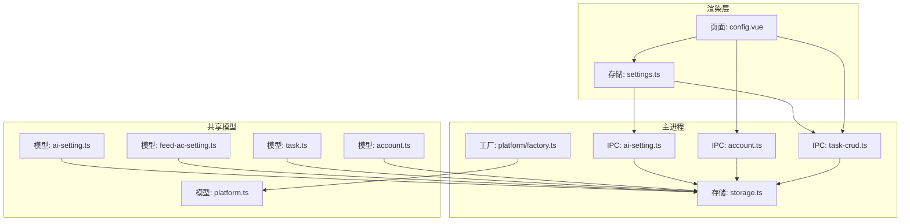
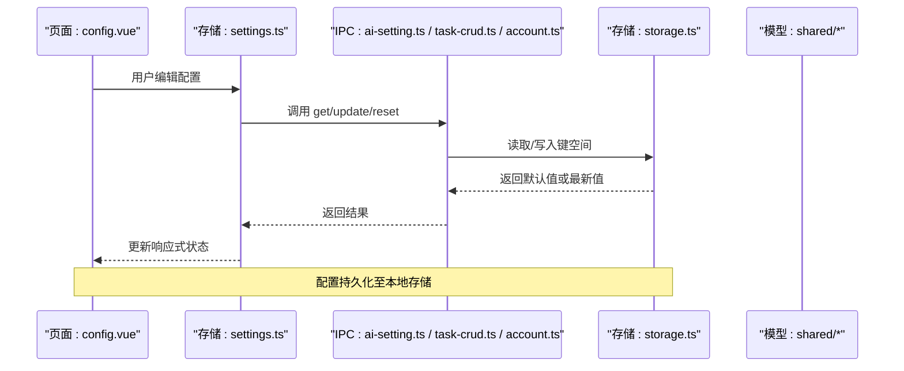
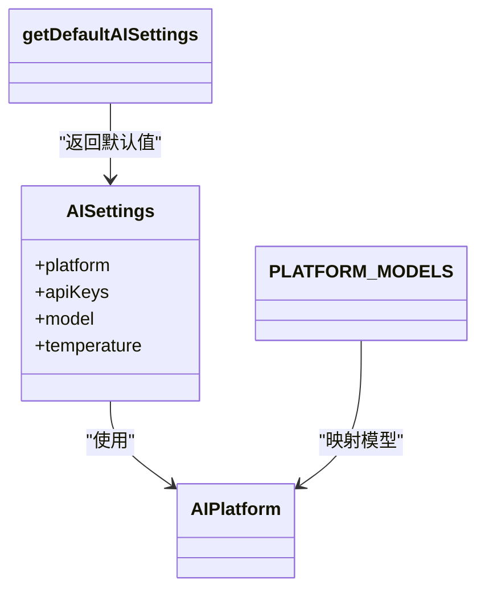
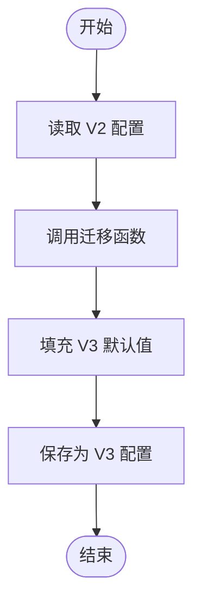
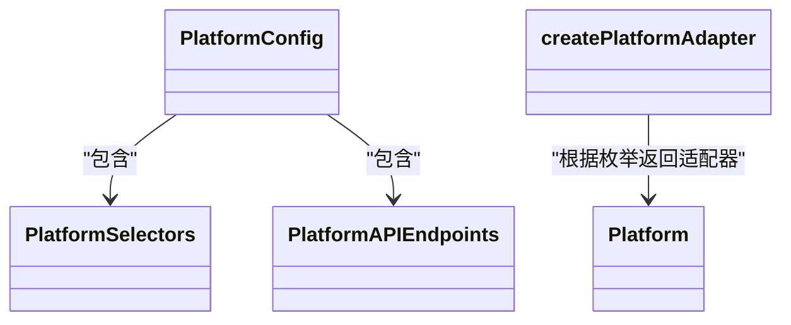
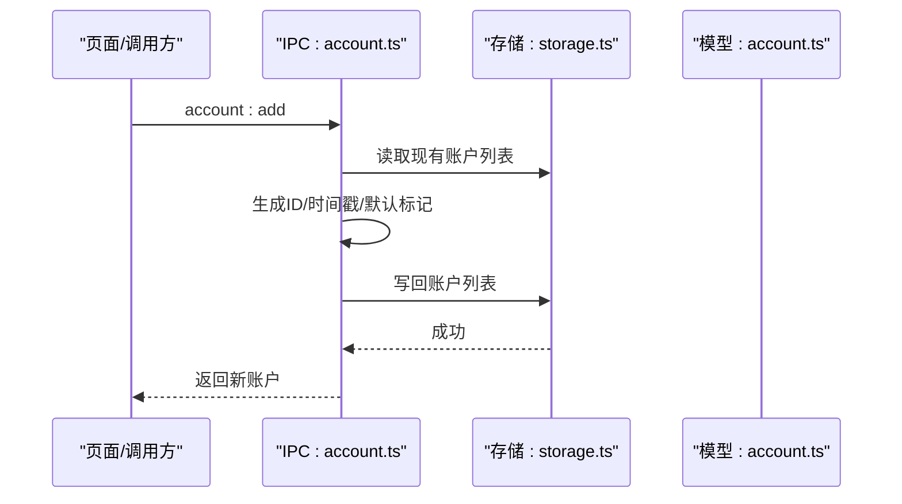
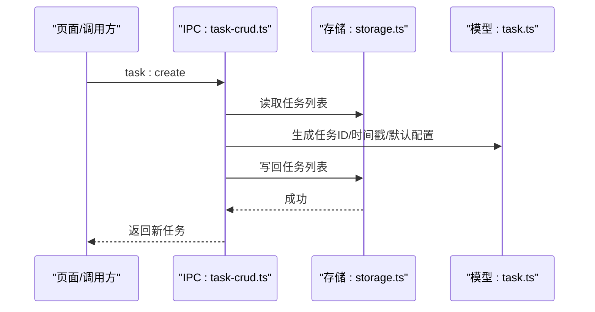
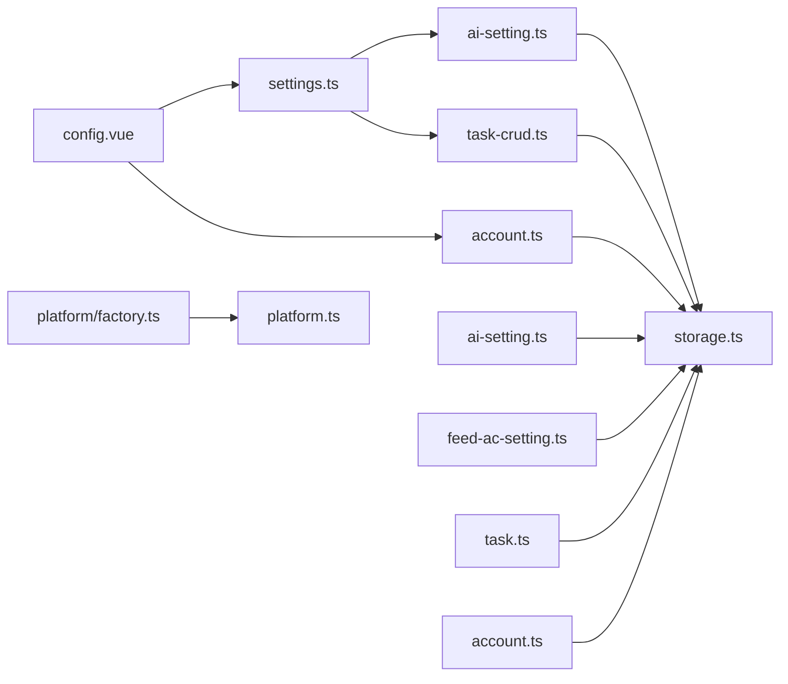

# 配置问题

<cite>
**本文引用的文件**
- [src/shared/ai-setting.ts](file://src/shared/ai-setting.ts)
- [src/shared/feed-ac-setting.ts](file://src/shared/feed-ac-setting.ts)
- [src/shared/platform.ts](file://src/shared/platform.ts)
- [src/shared/task.ts](file://src/shared/task.ts)
- [src/shared/account.ts](file://src/shared/account.ts)
- [src/main/ipc/ai-setting.ts](file://src/main/ipc/ai-setting.ts)
- [src/main/ipc/account.ts](file://src/main/ipc/account.ts)
- [src/main/ipc/task-crud.ts](file://src/main/ipc/task-crud.ts)
- [src/main/utils/storage.ts](file://src/main/utils/storage.ts)
- [src/main/platform/factory.ts](file://src/main/platform/factory.ts)
- [src/renderer/src/pages/config.vue](file://src/renderer/src/pages/config.vue)
- [src/renderer/src/stores/settings.ts](file://src/renderer/src/stores/settings.ts)
</cite>

## 目录
1. [简介](#简介)
2. [项目结构](#项目结构)
3. [核心组件](#核心组件)
4. [架构总览](#架构总览)
5. [详细组件分析](#详细组件分析)
6. [依赖分析](#依赖分析)
7. [性能考虑](#性能考虑)
8. [故障排查指南](#故障排查指南)
9. [结论](#结论)
10. [附录](#附录)

## 简介
本文件聚焦AutoOps在“配置问题”方面的系统化解决方案，覆盖以下方面：
- AI服务配置错误：平台选择、模型与温度、API密钥管理
- 平台适配器配置问题：平台支持性、选择器与端点映射
- 账户配置失效：状态管理、默认账户、过期处理
- 任务模板错误：模板保存、加载、重复与迁移
- 配置文件格式验证、参数校验规则、默认值处理
- 配置迁移指南、备份恢复方案、配置重置方法
- UI界面配置问题、本地存储异常、配置同步冲突
- 配置优先级、覆盖规则、继承关系
- 配置验证工具与自动修复功能使用指南

## 项目结构
AutoOps采用Electron + Vue的桌面应用架构，配置相关逻辑分布在共享数据模型、主进程IPC、渲染层存储与页面组件之间，并通过本地存储进行持久化。

图表来源
- [src/renderer/src/pages/config.vue](file://src/renderer/src/pages/config.vue)
- [src/renderer/src/stores/settings.ts](file://src/renderer/src/stores/settings.ts)
- [src/main/ipc/ai-setting.ts](file://src/main/ipc/ai-setting.ts)
- [src/main/ipc/account.ts](file://src/main/ipc/account.ts)
- [src/main/ipc/task-crud.ts](file://src/main/ipc/task-crud.ts)
- [src/main/platform/factory.ts](file://src/main/platform/factory.ts)
- [src/main/utils/storage.ts](file://src/main/utils/storage.ts)
- [src/shared/ai-setting.ts](file://src/shared/ai-setting.ts)
- [src/shared/feed-ac-setting.ts](file://src/shared/feed-ac-setting.ts)
- [src/shared/platform.ts](file://src/shared/platform.ts)
- [src/shared/task.ts](file://src/shared/task.ts)
- [src/shared/account.ts](file://src/shared/account.ts)

章节来源
- [src/renderer/src/pages/config.vue:1-323](file://src/renderer/src/pages/config.vue#L1-L323)
- [src/renderer/src/stores/settings.ts:1-46](file://src/renderer/src/stores/settings.ts#L1-L46)
- [src/main/ipc/ai-setting.ts:1-27](file://src/main/ipc/ai-setting.ts#L1-L27)
- [src/main/ipc/account.ts:1-101](file://src/main/ipc/account.ts#L1-L101)
- [src/main/ipc/task-crud.ts:1-108](file://src/main/ipc/task-crud.ts#L1-L108)
- [src/main/platform/factory.ts:1-32](file://src/main/platform/factory.ts#L1-L32)
- [src/main/utils/storage.ts:1-46](file://src/main/utils/storage.ts#L1-L46)
- [src/shared/ai-setting.ts:1-29](file://src/shared/ai-setting.ts#L1-L29)
- [src/shared/feed-ac-setting.ts:1-179](file://src/shared/feed-ac-setting.ts#L1-L179)
- [src/shared/platform.ts:1-260](file://src/shared/platform.ts#L1-L260)
- [src/shared/task.ts:1-62](file://src/shared/task.ts#L1-L62)
- [src/shared/account.ts:1-39](file://src/shared/account.ts#L1-L39)

## 核心组件
- AI设置模型与默认值：定义平台枚举、API密钥映射、模型列表与默认配置
- Feed-AutoComment设置模型：版本化配置、规则组、屏蔽词、AI评论开关与默认值
- 平台模型与适配器：平台信息、选择器、端点、快捷键与适配器工厂
- 任务与模板：任务对象、模板对象、默认任务生成与模板保存
- 账户模型：账户字段、状态与默认值生成
- 主进程IPC：AI设置读写、账户增删改查、任务CRUD与模板管理
- 渲染层存储：Pinia设置存储，对接IPC完成配置加载与更新
- 本地存储：electron-store键空间与默认值

章节来源
- [src/shared/ai-setting.ts:1-29](file://src/shared/ai-setting.ts#L1-L29)
- [src/shared/feed-ac-setting.ts:1-179](file://src/shared/feed-ac-setting.ts#L1-L179)
- [src/shared/platform.ts:1-260](file://src/shared/platform.ts#L1-L260)
- [src/shared/task.ts:1-62](file://src/shared/task.ts#L1-L62)
- [src/shared/account.ts:1-39](file://src/shared/account.ts#L1-L39)
- [src/main/ipc/ai-setting.ts:1-27](file://src/main/ipc/ai-setting.ts#L1-L27)
- [src/main/ipc/account.ts:1-101](file://src/main/ipc/account.ts#L1-L101)
- [src/main/ipc/task-crud.ts:1-108](file://src/main/ipc/task-crud.ts#L1-L108)
- [src/renderer/src/stores/settings.ts:1-46](file://src/renderer/src/stores/settings.ts#L1-L46)
- [src/main/utils/storage.ts:1-46](file://src/main/utils/storage.ts#L1-L46)

## 架构总览
配置从UI到存储的流转路径如下：

图表来源
- [src/renderer/src/pages/config.vue](file://src/renderer/src/pages/config.vue)
- [src/renderer/src/stores/settings.ts](file://src/renderer/src/stores/settings.ts)
- [src/main/ipc/ai-setting.ts](file://src/main/ipc/ai-setting.ts)
- [src/main/ipc/task-crud.ts](file://src/main/ipc/task-crud.ts)
- [src/main/ipc/account.ts](file://src/main/ipc/account.ts)
- [src/main/utils/storage.ts](file://src/main/utils/storage.ts)
- [src/shared/ai-setting.ts](file://src/shared/ai-setting.ts)
- [src/shared/feed-ac-setting.ts](file://src/shared/feed-ac-setting.ts)
- [src/shared/task.ts](file://src/shared/task.ts)
- [src/shared/account.ts](file://src/shared/account.ts)

## 详细组件分析

### AI服务配置（平台、模型、温度、密钥）
- 平台枚举与模型映射：支持火山、百炼、OpenAI、DeepSeek；提供各平台可用模型列表
- 默认值：平台默认为DeepSeek，模型默认为对应平台的聊天模型，温度默认0.9
- 密钥管理：按平台维护独立API密钥，未提供密钥校验逻辑
- IPC接口：提供读取、更新、重置与测试占位接口

图表来源
- [src/shared/ai-setting.ts:1-29](file://src/shared/ai-setting.ts#L1-L29)
- [src/main/ipc/ai-setting.ts:1-27](file://src/main/ipc/ai-setting.ts#L1-L27)

章节来源
- [src/shared/ai-setting.ts:1-29](file://src/shared/ai-setting.ts#L1-L29)
- [src/main/ipc/ai-setting.ts:1-27](file://src/main/ipc/ai-setting.ts#L1-L27)

### Feed-AutoComment配置（规则、屏蔽词、AI评论）
- 版本演进：V2/V3双版本，V3引入操作集合、跳过策略、视频分类等
- 默认值：V2默认watch区间、最大数量、AI评论关闭；V3默认任务类型、操作默认项、跳过与等待参数、评论风格与长度
- 迁移：提供从V2到V3的迁移函数，保留关键字段并填充默认值
- UI：页面提供基础参数、规则组、屏蔽词与AI评论开关的可视化编辑

图表来源
- [src/shared/feed-ac-setting.ts:148-174](file://src/shared/feed-ac-setting.ts#L148-L174)
- [src/shared/feed-ac-setting.ts:101-146](file://src/shared/feed-ac-setting.ts#L101-L146)

章节来源
- [src/shared/feed-ac-setting.ts:1-179](file://src/shared/feed-ac-setting.ts#L1-L179)
- [src/renderer/src/pages/config.vue:19-105](file://src/renderer/src/pages/config.vue#L19-L105)

### 平台适配器配置（支持性、选择器、端点）
- 支持平台：抖音、快手、小红书（微信视频号当前未实现）
- 适配器工厂：根据平台类型返回对应适配器实例
- 选择器与端点：为每个平台定义DOM选择器、API端点与快捷键
- 错误处理：未知平台抛出异常

图表来源
- [src/shared/platform.ts:1-260](file://src/shared/platform.ts#L1-L260)
- [src/main/platform/factory.ts:1-32](file://src/main/platform/factory.ts#L1-L32)

章节来源
- [src/shared/platform.ts:1-260](file://src/shared/platform.ts#L1-L260)
- [src/main/platform/factory.ts:1-32](file://src/main/platform/factory.ts#L1-L32)

### 账户配置（状态、默认账户、过期）
- 字段：ID、名称、平台、头像、存储状态、Cookie、创建时间、是否默认、状态、过期时间
- 默认值：首次添加自动设为默认；删除后若无默认则选首个为默认
- 状态：active/inactive/expired
- IPC：提供列表、新增、更新、删除、设默认、查询默认、按ID/平台查询、查询有效账户

图表来源
- [src/main/ipc/account.ts:32-49](file://src/main/ipc/account.ts#L32-L49)
- [src/main/utils/storage.ts:14-25](file://src/main/utils/storage.ts#L14-L25)
- [src/shared/account.ts:1-39](file://src/shared/account.ts#L1-L39)

章节来源
- [src/main/ipc/account.ts:1-101](file://src/main/ipc/account.ts#L1-L101)
- [src/shared/account.ts:1-39](file://src/shared/account.ts#L1-L39)
- [src/main/utils/storage.ts:1-46](file://src/main/utils/storage.ts#L1-L46)

### 任务与模板（创建、复制、保存模板）
- 任务：包含平台、任务类型、配置、调度、创建/更新时间
- 模板：用于保存可复用的配置
- IPC：提供任务查询、创建、更新、删除、复制；模板保存、删除
- 默认值：任务默认平台为抖音，任务类型为评论，配置使用V3默认值

图表来源
- [src/main/ipc/task-crud.ts:29-44](file://src/main/ipc/task-crud.ts#L29-L44)
- [src/shared/task.ts:50-61](file://src/shared/task.ts#L50-L61)
- [src/main/utils/storage.ts:14-25](file://src/main/utils/storage.ts#L14-L25)

章节来源
- [src/main/ipc/task-crud.ts:1-108](file://src/main/ipc/task-crud.ts#L1-L108)
- [src/shared/task.ts:1-62](file://src/shared/task.ts#L1-L62)
- [src/main/utils/storage.ts:1-46](file://src/main/utils/storage.ts#L1-L46)

### UI界面配置（页面与存储）
- 页面：提供基础参数、规则组、屏蔽词、AI评论开关的可视化编辑
- 存储：Pinia设置存储封装IPC调用，支持加载、更新、重置
- 数据流：页面双向绑定响应式配置，提交后通过IPC写入存储

章节来源
- [src/renderer/src/pages/config.vue:1-323](file://src/renderer/src/pages/config.vue#L1-L323)
- [src/renderer/src/stores/settings.ts:1-46](file://src/renderer/src/stores/settings.ts#L1-L46)

## 依赖分析
- 组件耦合
  - 渲染层依赖存储层，存储层依赖主进程IPC，IPC依赖共享模型与本地存储
  - 平台适配器工厂依赖共享平台模型
- 外部依赖
  - electron-store负责键空间与默认值
  - Pinia提供状态管理
  - Vue组件提供UI交互

图表来源
- [src/renderer/src/pages/config.vue](file://src/renderer/src/pages/config.vue)
- [src/renderer/src/stores/settings.ts](file://src/renderer/src/stores/settings.ts)
- [src/main/ipc/ai-setting.ts](file://src/main/ipc/ai-setting.ts)
- [src/main/ipc/account.ts](file://src/main/ipc/account.ts)
- [src/main/ipc/task-crud.ts](file://src/main/ipc/task-crud.ts)
- [src/main/platform/factory.ts](file://src/main/platform/factory.ts)
- [src/shared/platform.ts](file://src/shared/platform.ts)
- [src/main/utils/storage.ts](file://src/main/utils/storage.ts)
- [src/shared/ai-setting.ts](file://src/shared/ai-setting.ts)
- [src/shared/feed-ac-setting.ts](file://src/shared/feed-ac-setting.ts)
- [src/shared/task.ts](file://src/shared/task.ts)
- [src/shared/account.ts](file://src/shared/account.ts)

章节来源
- [src/main/utils/storage.ts:1-46](file://src/main/utils/storage.ts#L1-L46)
- [src/main/platform/factory.ts:1-32](file://src/main/platform/factory.ts#L1-L32)
- [src/shared/platform.ts:1-260](file://src/shared/platform.ts#L1-L260)

## 性能考虑
- 配置读写：IPC调用在主进程执行，避免渲染层阻塞
- 默认值策略：缺失配置时即时返回默认值，减少空值判断开销
- 存储键空间：集中管理键名，便于批量迁移与清理
- UI更新：Pinia响应式更新，仅变更部分视图

## 故障排查指南

### AI服务配置错误
- 现象：AI评论无法生成、模型不可用、温度无效
- 排查要点
  - 平台选择是否在支持列表内
  - API密钥是否已填写且未过期
  - 模型是否属于该平台可用模型列表
  - 温度是否在合理范围内
- 处理建议
  - 使用重置功能恢复默认AI设置
  - 在页面中重新选择平台与模型
  - 检查密钥有效性（测试接口为占位，后续可扩展）

章节来源
- [src/shared/ai-setting.ts:1-29](file://src/shared/ai-setting.ts#L1-L29)
- [src/main/ipc/ai-setting.ts:18-27](file://src/main/ipc/ai-setting.ts#L18-L27)

### 平台适配器配置问题
- 现象：任务在特定平台无法执行、元素选择失败
- 排查要点
  - 平台是否受支持（微信视频号当前未实现）
  - 选择器与端点是否匹配当前页面结构
  - 快捷键是否被系统占用
- 处理建议
  - 切换到受支持平台
  - 检查适配器工厂返回的适配器类型
  - 如需自定义选择器，请在共享模型中扩展

章节来源
- [src/main/platform/factory.ts:1-32](file://src/main/platform/factory.ts#L1-L32)
- [src/shared/platform.ts:18-51](file://src/shared/platform.ts#L18-L51)

### 账户配置失效
- 现象：账户状态异常、默认账户丢失、登录态失效
- 排查要点
  - 账户状态是否为active
  - 是否存在默认账户
  - 存储中账户列表是否为空
- 处理建议
  - 重新添加账户并设为默认
  - 使用账户查询接口确认当前默认账户
  - 清理过期账户并重建登录态

章节来源
- [src/main/ipc/account.ts:62-84](file://src/main/ipc/account.ts#L62-L84)
- [src/shared/account.ts:13-15](file://src/shared/account.ts#L13-L15)

### 任务模板错误
- 现象：模板保存失败、加载不到模板、复制任务异常
- 排查要点
  - 模板保存时的平台与任务类型是否一致
  - 任务配置是否符合V3规范
  - 模板列表键空间是否存在
- 处理建议
  - 使用模板保存接口重新保存
  - 检查任务配置是否包含必要字段
  - 清空并重建模板列表键空间

章节来源
- [src/main/ipc/task-crud.ts:86-99](file://src/main/ipc/task-crud.ts#L86-L99)
- [src/shared/task.ts:24-31](file://src/shared/task.ts#L24-L31)

### 配置文件格式验证与参数校验
- 验证策略
  - 缺失字段：通过默认值函数补齐
  - 类型约束：共享模型定义了强类型接口
  - 取值范围：如温度、计数、时间范围等
- 建议
  - 在IPC层增加参数校验与边界检查
  - 对用户输入进行前端校验（如数值范围、必填项）

章节来源
- [src/shared/feed-ac-setting.ts:101-146](file://src/shared/feed-ac-setting.ts#L101-L146)
- [src/shared/ai-setting.ts:10-22](file://src/shared/ai-setting.ts#L10-L22)

### 默认值处理
- AI设置默认值：平台、模型、温度
- Feed-AutoComment默认值：V2/V3默认参数
- 任务默认值：平台、任务类型、配置
- 账户默认值：首次自动设为默认

章节来源
- [src/shared/ai-setting.ts:10-22](file://src/shared/ai-setting.ts#L10-L22)
- [src/shared/feed-ac-setting.ts:101-146](file://src/shared/feed-ac-setting.ts#L101-L146)
- [src/shared/task.ts:50-61](file://src/shared/task.ts#L50-L61)
- [src/main/ipc/account.ts:43-44](file://src/main/ipc/account.ts#L43-L44)

### 配置迁移指南
- 从V2迁移到V3
  - 保留规则组与AI开关
  - 自动填充V3默认字段
  - 将旧规则组中的评论文本迁移为新操作集合
- 执行步骤
  - 读取V2配置
  - 调用迁移函数
  - 写回V3配置

章节来源
- [src/shared/feed-ac-setting.ts:148-174](file://src/shared/feed-ac-setting.ts#L148-L174)

### 备份与恢复方案
- 备份
  - 导出本地存储键空间：accounts、tasks、taskTemplates、aiSettings、feedAcSettings
- 恢复
  - 将导出的数据写回对应键空间
  - 若键空间损坏，可清空后重建

章节来源
- [src/main/utils/storage.ts:29-38](file://src/main/utils/storage.ts#L29-L38)

### 配置重置方法
- AI设置重置：调用重置接口，写回默认值
- Feed-AutoComment重置：通过设置存储的重置函数
- 账户/任务/模板：清空对应键空间或使用默认值

章节来源
- [src/main/ipc/ai-setting.ts:18-22](file://src/main/ipc/ai-setting.ts#L18-L22)
- [src/renderer/src/stores/settings.ts:20-34](file://src/renderer/src/stores/settings.ts#L20-L34)

### UI界面配置问题
- 现象：页面无法加载配置、表单无法提交、实时日志不显示
- 排查要点
  - 确认IPC接口可用
  - 检查Pinia存储是否成功加载
  - 确认页面路由与组件初始化顺序
- 处理建议
  - 在页面挂载时先加载设置
  - 提交前校验必填字段
  - 查看实时日志以定位运行时错误

章节来源
- [src/renderer/src/pages/config.vue:41-51](file://src/renderer/src/pages/config.vue#L41-L51)
- [src/renderer/src/stores/settings.ts:12-34](file://src/renderer/src/stores/settings.ts#L12-L34)

### 本地存储异常
- 现象：配置丢失、读取为空、键空间损坏
- 排查要点
  - electron-store初始化是否成功
  - 键空间是否正确写入
  - 默认值是否生效
- 处理建议
  - 重启应用以触发默认值回填
  - 手动清空键空间后重建
  - 检查权限与磁盘空间

章节来源
- [src/main/utils/storage.ts:14-25](file://src/main/utils/storage.ts#L14-L25)

### 配置同步冲突
- 场景：多窗口/多实例同时修改同一配置
- 建议
  - 使用单一写入口（IPC）
  - 在渲染层加锁或禁用并发写
  - 对重要配置采用原子更新策略

## 结论
AutoOps的配置体系以共享模型为核心，通过IPC与本地存储实现跨进程持久化。针对常见配置问题，建议优先使用默认值与重置功能快速恢复，配合迁移工具完成版本升级，并在UI层完善参数校验与错误提示。对于平台适配器与账户状态问题，应结合工厂与IPC接口进行定位与修复。

## 附录

### 配置优先级与覆盖规则
- 优先级
  - 用户显式配置 > 默认值函数返回值
- 覆盖规则
  - 更新接口对已有字段进行浅合并
  - 未提供的字段保持原值或使用默认值

章节来源
- [src/main/ipc/ai-setting.ts:11-16](file://src/main/ipc/ai-setting.ts#L11-L16)
- [src/main/ipc/task-crud.ts:46-55](file://src/main/ipc/task-crud.ts#L46-L55)
- [src/main/ipc/account.ts:51-60](file://src/main/ipc/account.ts#L51-L60)

### 配置验证工具与自动修复
- 工具
  - 页面内置参数校验（数值范围、必填）
  - 重置按钮一键恢复默认
  - 迁移函数自动补齐V3字段
- 自动修复
  - 丢失键空间时回填默认值
  - 删除后自动补回默认账户

章节来源
- [src/renderer/src/pages/config.vue:137-164](file://src/renderer/src/pages/config.vue#L137-L164)
- [src/main/ipc/ai-setting.ts:18-22](file://src/main/ipc/ai-setting.ts#L18-L22)
- [src/shared/feed-ac-setting.ts:148-174](file://src/shared/feed-ac-setting.ts#L148-L174)
- [src/main/ipc/account.ts:65-69](file://src/main/ipc/account.ts#L65-L69)