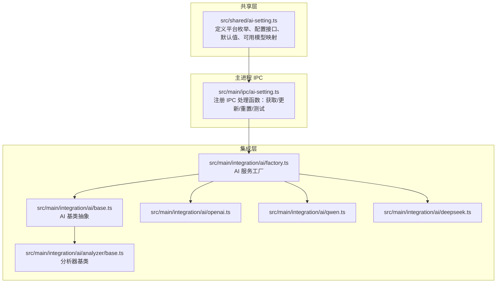
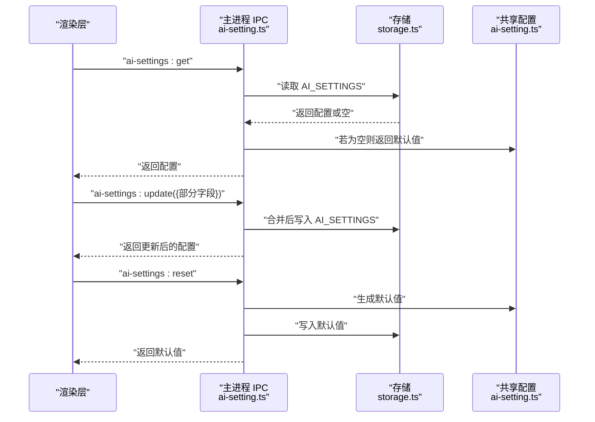
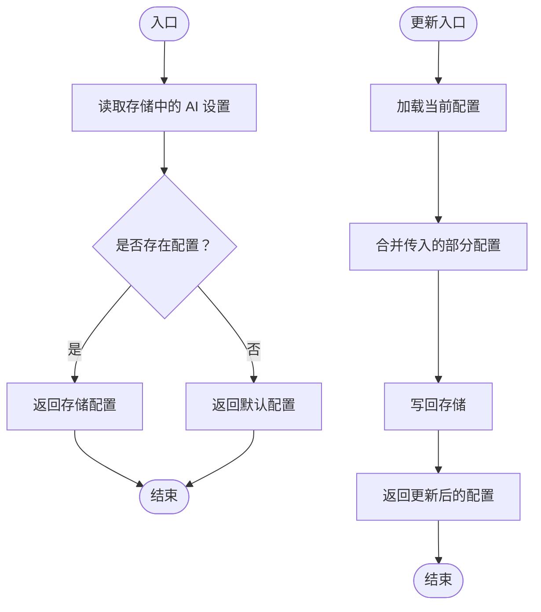
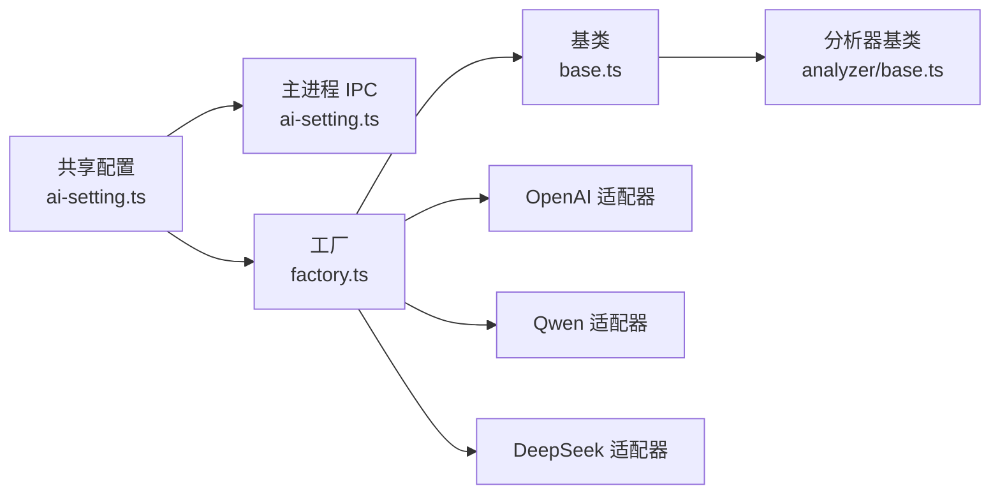

# AI设置模型

<cite>
**本文引用的文件**
- [ai-setting.ts](file://src/shared/ai-setting.ts)
- [ai-setting.ts](file://src/main/ipc/ai-setting.ts)
- [base.ts](file://src/main/integration/ai/analyzer/base.ts)
- [base.ts](file://src/main/integration/ai/base.ts)
- [factory.ts](file://src/main/integration/ai/factory.ts)
- [openai.ts](file://src/main/integration/ai/openai.ts)
- [qwen.ts](file://src/main/integration/ai/qwen.ts)
- [deepseek.ts](file://src/main/integration/ai/deepseek.ts)
</cite>

## 目录
1. [简介](#简介)
2. [项目结构](#项目结构)
3. [核心组件](#核心组件)
4. [架构总览](#架构总览)
5. [详细组件分析](#详细组件分析)
6. [依赖关系分析](#依赖关系分析)
7. [性能考虑](#性能考虑)
8. [故障排除指南](#故障排除指南)
9. [结论](#结论)
10. [附录](#附录)

## 简介
本文件系统性梳理 AutoOps 中“AI 设置模型”的数据结构与实现，重点覆盖以下方面：
- AI 配置接口的字段定义：平台类型、API 密钥、模型名称、温度系数等
- 不同 AI 服务提供商（OpenAI、通义千问、DeepSeek、火山引擎/百炼）的配置差异与可用模型列表
- 配置的默认值、校验规则、更新流程与迁移策略
- 实际使用建议：API 密钥管理、模型选择与参数调优
- 性能优化、错误处理与成本控制最佳实践

## 项目结构
AutoOps 的 AI 设置模型位于共享层与主进程 IPC 层，配合集成层的 AI 提供商适配器共同工作：
- 共享层定义统一的配置数据结构与默认值
- 主进程 IPC 负责持久化存储与对外暴露读写接口
- 集成层按提供商拆分适配器，负责具体请求封装与行为差异



图表来源
- [ai-setting.ts:1-29](file://src/shared/ai-setting.ts#L1-L29)
- [ai-setting.ts:1-27](file://src/main/ipc/ai-setting.ts#L1-L27)
- [base.ts](file://src/main/integration/ai/analyzer/base.ts)
- [base.ts](file://src/main/integration/ai/base.ts)
- [factory.ts](file://src/main/integration/ai/factory.ts)
- [openai.ts](file://src/main/integration/ai/openai.ts)
- [qwen.ts](file://src/main/integration/ai/qwen.ts)
- [deepseek.ts](file://src/main/integration/ai/deepseek.ts)

章节来源
- [ai-setting.ts:1-29](file://src/shared/ai-setting.ts#L1-L29)
- [ai-setting.ts:1-27](file://src/main/ipc/ai-setting.ts#L1-L27)

## 核心组件
- 平台枚举与配置接口
  - 平台类型：支持火山引擎/百炼、通义千问、OpenAI、DeepSeek
  - 配置接口包含：平台标识、各平台 API 密钥字典、当前使用的模型名、采样温度
- 默认值与可用模型
  - 默认平台为 DeepSeek；默认模型为 DeepSeek 对应的聊天模型；默认温度为 0.9
  - 各平台可用模型列表在共享层集中维护，便于 UI 下拉选择与校验

章节来源
- [ai-setting.ts:1-29](file://src/shared/ai-setting.ts#L1-L29)

## 架构总览
AI 设置模型通过 IPC 在渲染层与主进程之间传递，主进程负责持久化与默认值回填；集成层根据所选平台调用对应适配器完成实际请求。



图表来源
- [ai-setting.ts:5-22](file://src/main/ipc/ai-setting.ts#L5-L22)
- [ai-setting.ts:10-22](file://src/shared/ai-setting.ts#L10-L22)

章节来源
- [ai-setting.ts:1-27](file://src/main/ipc/ai-setting.ts#L1-L27)
- [ai-setting.ts:1-29](file://src/shared/ai-setting.ts#L1-L29)

## 详细组件分析

### 数据模型与字段定义
- 字段说明
  - 平台(platform)：从枚举中选择，决定后续请求路由到哪个适配器
  - API 密钥(apiKeys)：按平台键值存储密钥，便于多平台切换时独立管理
  - 模型(model)：当前生效的模型名称，需与所选平台匹配
  - 温度(temperature)：控制采样随机性，数值越高越随机
- 默认值与可用模型
  - 默认平台与默认模型由共享层提供
  - 可用模型列表集中维护，UI 可据此动态生成下拉选项

章节来源
- [ai-setting.ts:3-8](file://src/shared/ai-setting.ts#L3-L8)
- [ai-setting.ts:10-22](file://src/shared/ai-setting.ts#L10-L22)
- [ai-setting.ts:24-29](file://src/shared/ai-setting.ts#L24-L29)

### 平台差异与适配器
- 工厂与基类
  - 工厂根据平台选择对应适配器
  - 基类抽象出通用行为，分析器基类用于扩展分析类能力
- OpenAI
  - 支持模型列表包含 gpt-4o、gpt-4o-mini 等
  - 请求封装遵循 OpenAI 协议与鉴权方式
- 通义千问(Qwen)
  - 支持模型列表包含 qwen-plus、qwen-max 等
  - 请求封装遵循通义千问协议与鉴权方式
- DeepSeek
  - 支持模型列表包含 deepseek-chat、deepseek-reasoner 等
  - 请求封装遵循 DeepSeek 协议与鉴权方式
- 火山引擎/百炼(VolcEngine/Bailian)
  - 支持模型列表包含 doubao 系列等
  - 请求封装遵循火山引擎协议与鉴权方式

```mermaid
classDiagram
class AISettings {
+platform : AIPlatform
+apiKeys : Record<AIPlatform, string>
+model : string
+temperature : number
}
class AIPlatform {
<<enumeration>>
"volcengine"
"bailian"
"openai"
"deepseek"
}
class OpenAIAdapter {
+sendRequest()
}
class QwenAdapter {
+sendRequest()
}
class DeepSeekAdapter {
+sendRequest()
}
class VolcEngineAdapter {
+sendRequest()
}
AISettings --> AIPlatform : "使用"
OpenAIAdapter ..|> AIAdapterBase
QwenAdapter ..|> AIAdapterBase
DeepSeekAdapter ..|> AIAdapterBase
VolcEngineAdapter ..|> AIAdapterBase
```

图表来源
- [ai-setting.ts:1-8](file://src/shared/ai-setting.ts#L1-L8)
- [openai.ts](file://src/main/integration/ai/openai.ts)
- [qwen.ts](file://src/main/integration/ai/qwen.ts)
- [deepseek.ts](file://src/main/integration/ai/deepseek.ts)
- [base.ts](file://src/main/integration/ai/base.ts)

章节来源
- [ai-setting.ts:1-29](file://src/shared/ai-setting.ts#L1-L29)
- [openai.ts](file://src/main/integration/ai/openai.ts)
- [qwen.ts](file://src/main/integration/ai/qwen.ts)
- [deepseek.ts](file://src/main/integration/ai/deepseek.ts)
- [base.ts](file://src/main/integration/ai/base.ts)
- [factory.ts](file://src/main/integration/ai/factory.ts)

### 配置更新与持久化流程
- 获取配置
  - 若存储中存在配置则直接返回，否则返回默认值
- 更新配置
  - 将传入的部分配置与当前配置合并，再写回存储
- 重置配置
  - 重新生成默认值并写回存储
- 测试配置
  - 当前占位实现返回成功提示，可扩展为真实连通性测试



图表来源
- [ai-setting.ts:6-16](file://src/main/ipc/ai-setting.ts#L6-L16)

章节来源
- [ai-setting.ts:1-27](file://src/main/ipc/ai-setting.ts#L1-L27)

### 验证规则与默认值
- 平台与模型一致性
  - 所选模型必须属于当前平台的可用模型列表
- 温度范围
  - 建议在 0~1 区间内取值，超出范围可按平台要求截断或报错
- API 密钥
  - 必须为非空字符串；不同平台采用不同鉴权方式
- 默认值
  - 默认平台为 DeepSeek，模型为该平台的聊天模型，温度为 0.9

章节来源
- [ai-setting.ts:10-22](file://src/shared/ai-setting.ts#L10-L22)
- [ai-setting.ts:24-29](file://src/shared/ai-setting.ts#L24-L29)

### 配置迁移策略
- 版本演进
  - 新增平台或模型时，保持现有配置不变，仅在需要时进行默认值回填
- 兼容性
  - 旧版本配置可能缺少新字段，读取时以默认值补齐
- 迁移脚本
  - 可在应用启动时检测并执行一次性的迁移逻辑，确保配置结构一致

章节来源
- [ai-setting.ts:10-22](file://src/shared/ai-setting.ts#L10-L22)
- [ai-setting.ts:6-9](file://src/main/ipc/ai-setting.ts#L6-L9)

### 实际示例与最佳实践
- API 密钥管理
  - 使用独立的密钥字典，避免硬编码；在 UI 中隐藏敏感信息
- 模型选择
  - 根据任务类型选择合适模型：推理类优先考虑 reasoner 类模型，对话类优先 chat 类模型
- 参数调优
  - 温度越高，输出越随机；对需要稳定输出的任务降低温度
- 成本控制
  - 优先选择更短上下文与更低单价的模型；合理设置最大 tokens
- 错误处理
  - 对网络异常、鉴权失败、模型不可用等情况分别处理并给出明确提示
- 性能优化
  - 合理缓存响应；批量请求时注意并发与限流；启用压缩与长连接（如平台支持）

## 依赖关系分析
- 共享层依赖
  - 平台枚举与默认值集中定义，被 IPC 与集成层复用
- IPC 依赖
  - 依赖存储模块进行持久化；依赖共享层提供默认值
- 集成层依赖
  - 工厂依赖基类与分析器基类；各适配器依赖平台特定的 SDK 或 HTTP 客户端



图表来源
- [ai-setting.ts:1-29](file://src/shared/ai-setting.ts#L1-L29)
- [ai-setting.ts:1-27](file://src/main/ipc/ai-setting.ts#L1-L27)
- [base.ts](file://src/main/integration/ai/analyzer/base.ts)
- [base.ts](file://src/main/integration/ai/base.ts)
- [factory.ts](file://src/main/integration/ai/factory.ts)
- [openai.ts](file://src/main/integration/ai/openai.ts)
- [qwen.ts](file://src/main/integration/ai/qwen.ts)
- [deepseek.ts](file://src/main/integration/ai/deepseek.ts)

章节来源
- [ai-setting.ts:1-29](file://src/shared/ai-setting.ts#L1-L29)
- [ai-setting.ts:1-27](file://src/main/ipc/ai-setting.ts#L1-L27)

## 性能考虑
- 模型选择
  - 优先选择推理更快、上下文更短的模型
- 请求优化
  - 合理设置超时与重试；对长文本分片处理
- 缓存策略
  - 对重复输入或相似问题的结果进行缓存
- 并发控制
  - 控制并发请求数，避免触发平台限流

## 故障排除指南
- 常见问题
  - API 密钥无效：检查密钥是否正确、是否已过期、权限是否足够
  - 模型不可用：确认所选模型是否属于当前平台的可用列表
  - 温度过高导致输出不稳定：适当降低温度
- 排查步骤
  - 使用“测试配置”占位接口确认 IPC 通道正常
  - 查看存储中的配置是否被正确写入
  - 分别尝试不同平台与模型进行对比测试

章节来源
- [ai-setting.ts:24-26](file://src/main/ipc/ai-setting.ts#L24-L26)

## 结论
AI 设置模型通过共享层统一数据结构、IPC 层保障持久化与默认值回填、集成层按平台解耦适配，形成清晰、可扩展且易于维护的配置体系。结合合理的验证规则、默认值与迁移策略，可在多平台环境下稳定运行，并为性能优化与成本控制提供良好基础。

## 附录
- 关键实现位置参考
  - 平台枚举与配置接口：[ai-setting.ts:1-8](file://src/shared/ai-setting.ts#L1-L8)
  - 默认值与可用模型：[ai-setting.ts:10-29](file://src/shared/ai-setting.ts#L10-L29)
  - IPC 读写与重置：[ai-setting.ts:5-22](file://src/main/ipc/ai-setting.ts#L5-L22)
  - 测试接口占位：[ai-setting.ts:24-26](file://src/main/ipc/ai-setting.ts#L24-L26)
  - 工厂与基类：[factory.ts](file://src/main/integration/ai/factory.ts), [base.ts](file://src/main/integration/ai/base.ts), [base.ts](file://src/main/integration/ai/analyzer/base.ts)
  - 平台适配器：[openai.ts](file://src/main/integration/ai/openai.ts), [qwen.ts](file://src/main/integration/ai/qwen.ts), [deepseek.ts](file://src/main/integration/ai/deepseek.ts)