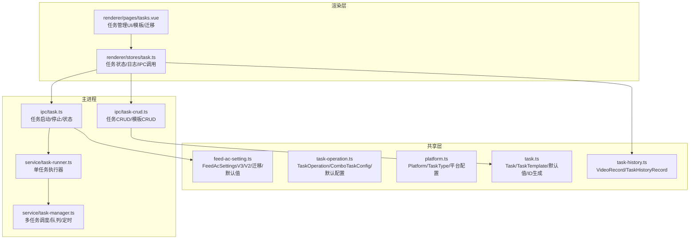
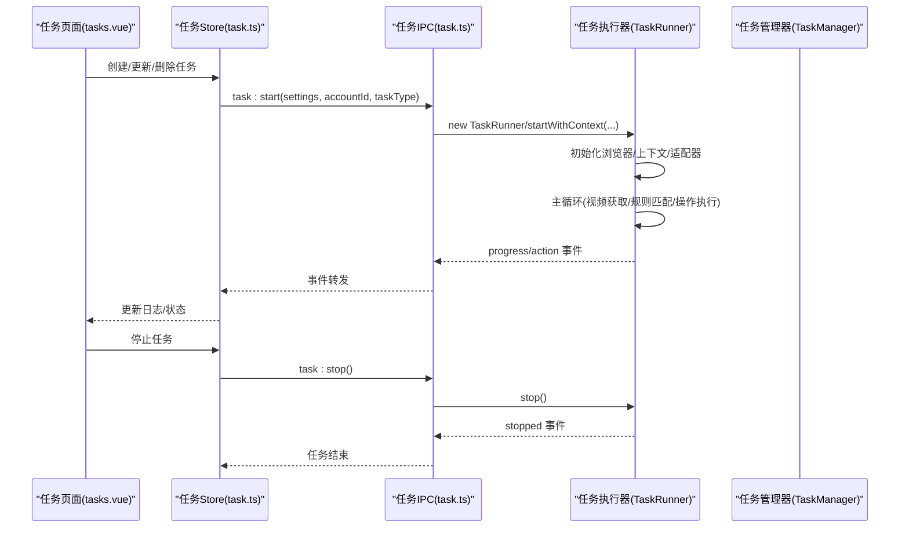
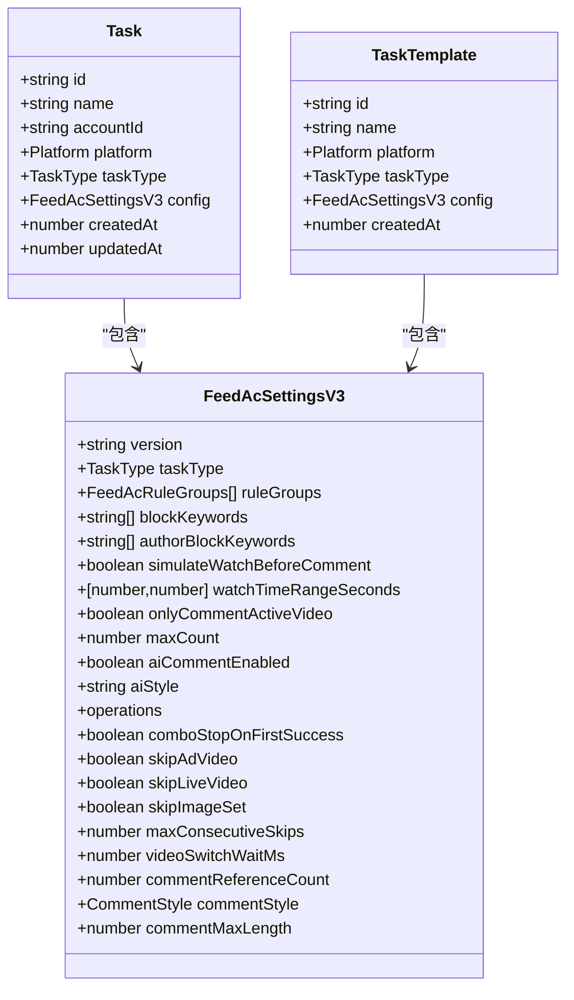
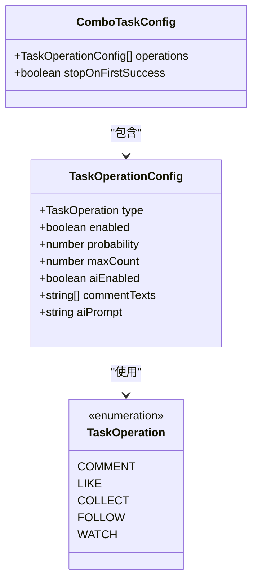
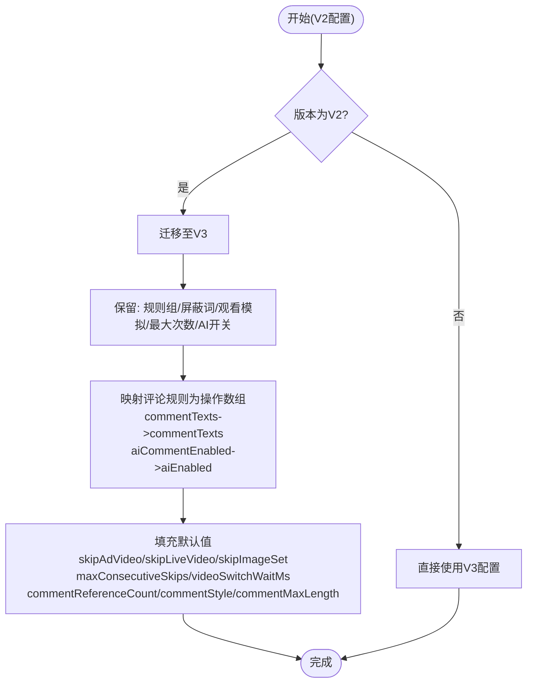
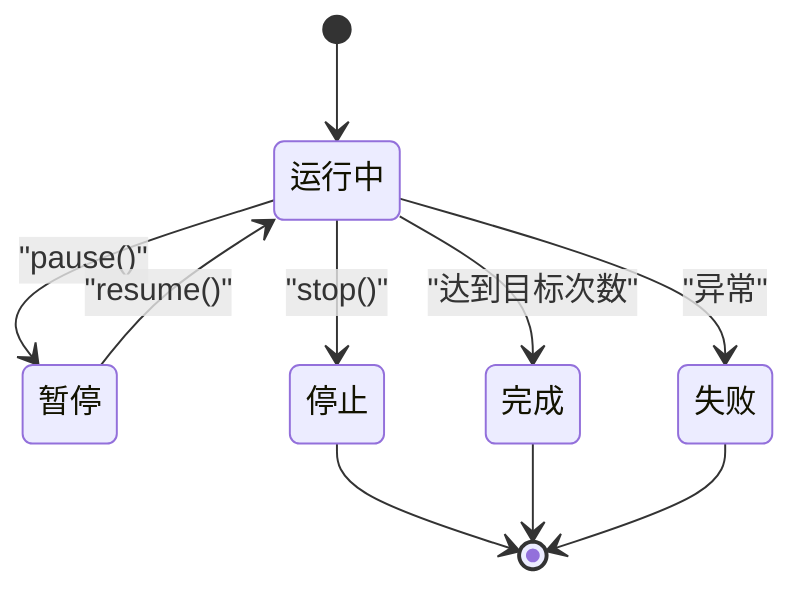
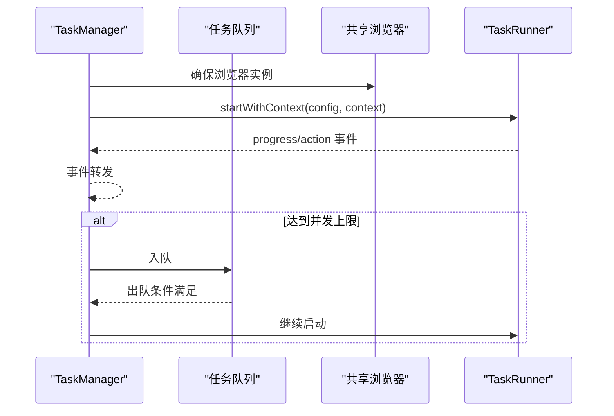
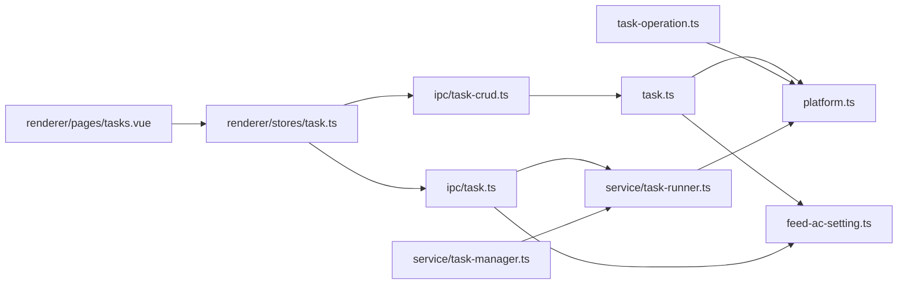

# 任务配置模型

<cite>
**本文档引用的文件**
- [src/shared/task.ts](file://src/shared/task.ts)
- [src/shared/task-operation.ts](file://src/shared/task-operation.ts)
- [src/shared/platform.ts](file://src/shared/platform.ts)
- [src/shared/feed-ac-setting.ts](file://src/shared/feed-ac-setting.ts)
- [src/shared/task-history.ts](file://src/shared/task-history.ts)
- [src/main/ipc/task.ts](file://src/main/ipc/task.ts)
- [src/main/ipc/task-crud.ts](file://src/main/ipc/task-crud.ts)
- [src/main/service/task-runner.ts](file://src/main/service/task-runner.ts)
- [src/main/service/task-manager.ts](file://src/main/service/task-manager.ts)
- [src/renderer/src/stores/task.ts](file://src/renderer/src/stores/task.ts)
- [src/renderer/src/pages/tasks.vue](file://src/renderer/src/pages/tasks.vue)
</cite>

## 目录
1. [简介](#简介)
2. [项目结构](#项目结构)
3. [核心组件](#核心组件)
4. [架构总览](#架构总览)
5. [详细组件分析](#详细组件分析)
6. [依赖关系分析](#依赖关系分析)
7. [性能考虑](#性能考虑)
8. [故障排除指南](#故障排除指南)
9. [结论](#结论)
10. [附录](#附录)

## 简介
本文件系统性梳理 AutoOps 中任务配置模型的数据结构与运行机制，覆盖任务接口字段、任务操作配置、组合任务配置、任务状态管理、执行参数配置、任务调度机制、验证规则与默认值处理、配置迁移策略，以及任务模板与批量任务管理的实现细节。目标是帮助开发者与使用者全面理解任务系统的数据层与运行时行为。

## 项目结构
任务系统围绕共享层的数据模型、主进程的 IPC 与执行器、渲染层的状态管理与 UI 展示展开，形成跨进程的协作架构。

**图表来源**
- [src/shared/task.ts:1-54](file://src/shared/task.ts#L1-L54)
- [src/shared/task-operation.ts:1-58](file://src/shared/task-operation.ts#L1-L58)
- [src/shared/platform.ts:1-260](file://src/shared/platform.ts#L1-L260)
- [src/shared/feed-ac-setting.ts:1-149](file://src/shared/feed-ac-setting.ts#L1-L149)
- [src/shared/task-history.ts:1-26](file://src/shared/task-history.ts#L1-L26)
- [src/main/ipc/task.ts:1-104](file://src/main/ipc/task.ts#L1-L104)
- [src/main/ipc/task-crud.ts:1-108](file://src/main/ipc/task-crud.ts#L1-L108)
- [src/main/service/task-runner.ts:1-760](file://src/main/service/task-runner.ts#L1-L760)
- [src/main/service/task-manager.ts:1-515](file://src/main/service/task-manager.ts#L1-L515)
- [src/renderer/src/stores/task.ts:1-192](file://src/renderer/src/stores/task.ts#L1-L192)
- [src/renderer/src/pages/tasks.vue:1-867](file://src/renderer/src/pages/tasks.vue#L1-L867)

**章节来源**
- [src/shared/task.ts:1-54](file://src/shared/task.ts#L1-L54)
- [src/shared/task-operation.ts:1-58](file://src/shared/task-operation.ts#L1-L58)
- [src/shared/platform.ts:1-260](file://src/shared/platform.ts#L1-L260)
- [src/shared/feed-ac-setting.ts:1-149](file://src/shared/feed-ac-setting.ts#L1-L149)
- [src/shared/task-history.ts:1-26](file://src/shared/task-history.ts#L1-L26)
- [src/main/ipc/task.ts:1-104](file://src/main/ipc/task.ts#L1-L104)
- [src/main/ipc/task-crud.ts:1-108](file://src/main/ipc/task-crud.ts#L1-L108)
- [src/main/service/task-runner.ts:1-760](file://src/main/service/task-runner.ts#L1-L760)
- [src/main/service/task-manager.ts:1-515](file://src/main/service/task-manager.ts#L1-L515)
- [src/renderer/src/stores/task.ts:1-192](file://src/renderer/src/stores/task.ts#L1-L192)
- [src/renderer/src/pages/tasks.vue:1-867](file://src/renderer/src/pages/tasks.vue#L1-L867)

## 核心组件
- 任务接口与模板
  - Task：包含任务标识、名称、账户、平台、任务类型、配置、创建/更新时间等字段。
  - TaskTemplate：用于保存可复用的配置模板，包含平台、任务类型与配置。
- 任务操作配置
  - TaskOperationConfig：单个操作的配置项，包含启用、概率、最大次数、AI开关、评论文本、AI提示等。
  - ComboTaskConfig：组合任务配置，包含多个操作及其概率与上限，并可配置“首个成功即停止”。
- 执行参数与规则
  - FeedAcSettingsV3：统一的执行配置载体，包含规则组、屏蔽词、观看模拟、最大次数、AI评论、操作数组、跳过策略、视频切换等待、AI评论参数等。
  - FeedAcSettingsV2：旧版本配置，通过迁移函数转换为 V3。
- 任务状态与历史
  - TaskRunnerStatus：运行中/暂停/停止/完成/失败。
  - TaskHistoryRecord/VideoRecord：任务执行历史与视频记录。

**章节来源**
- [src/shared/task.ts:5-23](file://src/shared/task.ts#L5-L23)
- [src/shared/task-operation.ts:28-41](file://src/shared/task-operation.ts#L28-L41)
- [src/shared/feed-ac-setting.ts:37-70](file://src/shared/feed-ac-setting.ts#L37-L70)
- [src/shared/feed-ac-setting.ts:22-33](file://src/shared/feed-ac-setting.ts#L22-L33)
- [src/shared/task-history.ts:14-22](file://src/shared/task-history.ts#L14-L22)

## 架构总览
任务从 UI 创建开始，经由渲染层 Store 调用主进程 IPC，主进程启动 TaskRunner 或 TaskManager 执行任务，期间通过事件向渲染层推送进度与动作日志；任务配置在 UI 中可保存为模板，供批量复用。

**图表来源**
- [src/renderer/src/pages/tasks.vue:158-183](file://src/renderer/src/pages/tasks.vue#L158-L183)
- [src/renderer/src/stores/task.ts:100-144](file://src/renderer/src/stores/task.ts#L100-L144)
- [src/main/ipc/task.ts:11-103](file://src/main/ipc/task.ts#L11-L103)
- [src/main/service/task-runner.ts:55-113](file://src/main/service/task-runner.ts#L55-L113)
- [src/main/service/task-manager.ts:178-230](file://src/main/service/task-manager.ts#L178-L230)

## 详细组件分析

### 任务接口与模板设计
- 字段定义
  - 任务ID：唯一标识，生成策略包含时间戳与随机字符串。
  - 名称：用户可见的任务名。
  - 账户ID：绑定执行账号。
  - 平台：支持抖音/快手/小红书/微信视频号。
  - 任务类型：comment/like/collect/follow/watch/combo。
  - 配置：FeedAcSettingsV3，承载所有执行参数。
  - 时间戳：创建与更新时间。
- 模板设计
  - 与任务结构类似，但不含账户绑定，便于跨账号复用。
- 默认值与ID生成
  - 提供默认任务对象与模板ID生成函数，保证新任务快速可用。

**图表来源**
- [src/shared/task.ts:5-23](file://src/shared/task.ts#L5-L23)
- [src/shared/feed-ac-setting.ts:37-70](file://src/shared/feed-ac-setting.ts#L37-L70)

**章节来源**
- [src/shared/task.ts:5-53](file://src/shared/task.ts#L5-L53)
- [src/shared/platform.ts:1-51](file://src/shared/platform.ts#L1-L51)

### 任务操作配置与组合任务
- 单操作配置
  - type：操作类型（评论/点赞/收藏/关注/观看）。
  - enabled：是否启用。
  - probability：触发概率。
  - maxCount：最大执行次数。
  - aiEnabled/aiPrompt：AI评论开关与提示词。
  - commentTexts：备用评论文本列表。
- 组合任务配置
  - operations：每个子操作独立配置，支持各自概率与上限。
  - stopOnFirstSuccess：首个成功即停止组合流程。
- 默认配置
  - 提供默认操作配置函数，确保新任务有合理初始值。

**图表来源**
- [src/shared/task-operation.ts:28-41](file://src/shared/task-operation.ts#L28-L41)
- [src/shared/task-operation.ts:3-9](file://src/shared/task-operation.ts#L3-L9)

**章节来源**
- [src/shared/task-operation.ts:28-57](file://src/shared/task-operation.ts#L28-L57)

### 执行参数与规则体系
- 规则组与规则
  - FeedAcRuleGroups：支持手动规则与AI规则，支持嵌套子规则组、逻辑关系（and/or）、关键词与AI提示。
  - FeedAcRule：字段（昵称/视频描述/标签）+ 关键词。
- 执行参数
  - 屏蔽词：按描述与作者昵称屏蔽。
  - 观看模拟：在评论前模拟观看时长。
  - 最大次数：任务总目标次数。
  - AI评论：开启后可使用AI生成评论，支持风格、长度与参考热门评论。
  - 操作数组：每项含type/enabled/probability/maxCount/ai配置。
  - 跳过策略：广告/直播/图集自动跳过。
  - 视频切换：切换等待时间与连续跳过阈值。
- 版本迁移
  - V2 -> V3：保留关键字段，将规则组中的评论文本与AI提示迁移到V3操作数组中，补充默认参数。

**图表来源**
- [src/shared/feed-ac-setting.ts:120-145](file://src/shared/feed-ac-setting.ts#L120-L145)
- [src/renderer/src/pages/tasks.vue:138-156](file://src/renderer/src/pages/tasks.vue#L138-L156)

**章节来源**
- [src/shared/feed-ac-setting.ts:4-70](file://src/shared/feed-ac-setting.ts#L4-L70)
- [src/shared/feed-ac-setting.ts:120-145](file://src/shared/feed-ac-setting.ts#L120-L145)
- [src/renderer/src/pages/tasks.vue:138-156](file://src/renderer/src/pages/tasks.vue#L138-L156)

### 任务状态管理与执行流程
- 状态枚举
  - running/paused/stopped/completed/failed。
- 执行器职责
  - 启动/暂停/恢复/停止任务。
  - 浏览器与上下文管理，适配器初始化。
  - 主循环：视频切换等待、视频信息获取、类型与分类检查、屏蔽词检查、规则匹配、模拟观看、执行操作、统计与日志。
  - 事件推送：progress/action/stopped/paused/resumed。
- 管理器职责
  - 共享浏览器实例、账号级并发控制与冷却时间。
  - 任务队列与调度、定时任务（基于 cron 表达式）。
  - 事件转发与持久化。

**图表来源**
- [src/main/service/task-runner.ts:23-50](file://src/main/service/task-runner.ts#L23-L50)
- [src/main/service/task-runner.ts:185-202](file://src/main/service/task-runner.ts#L185-L202)
- [src/main/service/task-runner.ts:204-210](file://src/main/service/task-runner.ts#L204-L210)

**章节来源**
- [src/main/service/task-runner.ts:23-50](file://src/main/service/task-runner.ts#L23-L50)
- [src/main/service/task-manager.ts:47-84](file://src/main/service/task-manager.ts#L47-L84)

### 任务调度机制
- 并发控制
  - 全局最大并发数与账号级策略（最大并发、冷却时间）。
- 队列机制
  - 不满足条件时加入队列，空闲时自动拉起。
- 定时任务
  - 基于 cron 表达式定期触发，保存/恢复状态。
- 事件桥接
  - 将执行器事件转发给管理器，再由管理器统一广播。

**图表来源**
- [src/main/service/task-manager.ts:178-230](file://src/main/service/task-manager.ts#L178-L230)
- [src/main/service/task-manager.ts:361-384](file://src/main/service/task-manager.ts#L361-L384)
- [src/main/service/task-manager.ts:407-455](file://src/main/service/task-manager.ts#L407-L455)

**章节来源**
- [src/main/service/task-manager.ts:178-230](file://src/main/service/task-manager.ts#L178-L230)
- [src/main/service/task-manager.ts:361-384](file://src/main/service/task-manager.ts#L361-L384)
- [src/main/service/task-manager.ts:407-455](file://src/main/service/task-manager.ts#L407-L455)

### 任务配置的实际示例与最佳实践
- 评论任务
  - 使用 FeedAcSettingsV3 的默认配置，启用 AI 评论时设置风格与长度，配置规则组与屏蔽词。
- 组合任务
  - 在 operations 中为 comment/like/collect/follow/watch 分别设置概率与最大次数，必要时启用“首个成功即停止”。
- 批量任务
  - 通过模板保存常用配置，复制任务或批量创建任务时复用模板。
- 最佳实践
  - 合理设置 maxCount 与 videoSwitchWaitMs，避免过于频繁的操作。
  - 使用规则组进行精细化筛选，结合 AI 分析提升命中准确率。
  - 对高风险操作（如关注/收藏）降低概率并设置上限。

**章节来源**
- [src/shared/feed-ac-setting.ts:88-118](file://src/shared/feed-ac-setting.ts#L88-L118)
- [src/shared/task-operation.ts:47-57](file://src/shared/task-operation.ts#L47-L57)
- [src/renderer/src/pages/tasks.vue:61-100](file://src/renderer/src/pages/tasks.vue#L61-L100)

### 验证规则、默认值与配置迁移
- 验证规则
  - 任务创建时校验名称与账号选择；保存时合并默认值并写入存储。
  - UI 中对规则组名称、评论文本等进行基础校验。
- 默认值处理
  - getDefaultFeedAcSettingsV3 提供完整默认值，包括操作数组、跳过策略、视频切换等待、AI评论参数等。
  - getDefaultTask 提供任务默认值，包含默认任务类型与配置。
- 配置迁移
  - migrateToV3 将 V2 的规则组评论文本与 AI 开关迁移到 V3 的操作数组与默认参数中，确保兼容。

**章节来源**
- [src/main/ipc/task-crud.ts:29-55](file://src/main/ipc/task-crud.ts#L29-L55)
- [src/shared/feed-ac-setting.ts:88-118](file://src/shared/feed-ac-setting.ts#L88-L118)
- [src/shared/feed-ac-setting.ts:120-145](file://src/shared/feed-ac-setting.ts#L120-L145)
- [src/shared/task.ts:42-53](file://src/shared/task.ts#L42-L53)

### 任务模板设计与批量任务管理
- 模板保存与删除
  - 通过 IPC 保存模板，包含平台、任务类型与配置，创建时生成模板ID。
- 批量管理
  - 支持复制任务、批量创建、按账号筛选与历史记录查看。
- UI 支持
  - 任务页面提供模板列表、保存为模板、删除模板等操作入口。

**章节来源**
- [src/main/ipc/task-crud.ts:81-107](file://src/main/ipc/task-crud.ts#L81-L107)
- [src/renderer/src/stores/task.ts:61-70](file://src/renderer/src/stores/task.ts#L61-L70)
- [src/renderer/src/pages/tasks.vue:799-814](file://src/renderer/src/pages/tasks.vue#L799-L814)

## 依赖关系分析

**图表来源**
- [src/shared/task.ts:1-54](file://src/shared/task.ts#L1-L54)
- [src/shared/task-operation.ts:1-7](file://src/shared/task-operation.ts#L1-L7)
- [src/shared/platform.ts:1-7](file://src/shared/platform.ts#L1-L7)
- [src/main/ipc/task.ts:1-104](file://src/main/ipc/task.ts#L1-L104)
- [src/main/ipc/task-crud.ts:1-108](file://src/main/ipc/task-crud.ts#L1-L108)
- [src/main/service/task-runner.ts:1-14](file://src/main/service/task-runner.ts#L1-L14)
- [src/main/service/task-manager.ts:1-9](file://src/main/service/task-manager.ts#L1-L9)
- [src/renderer/src/stores/task.ts:1-6](file://src/renderer/src/stores/task.ts#L1-L6)
- [src/renderer/src/pages/tasks.vue:1-66](file://src/renderer/src/pages/tasks.vue#L1-L66)

**章节来源**
- [src/shared/task.ts:1-54](file://src/shared/task.ts#L1-L54)
- [src/shared/task-operation.ts:1-7](file://src/shared/task-operation.ts#L1-L7)
- [src/shared/platform.ts:1-7](file://src/shared/platform.ts#L1-L7)
- [src/main/ipc/task.ts:1-104](file://src/main/ipc/task.ts#L1-L104)
- [src/main/ipc/task-crud.ts:1-108](file://src/main/ipc/task-crud.ts#L1-L108)
- [src/main/service/task-runner.ts:1-14](file://src/main/service/task-runner.ts#L1-L14)
- [src/main/service/task-manager.ts:1-9](file://src/main/service/task-manager.ts#L1-L9)
- [src/renderer/src/stores/task.ts:1-6](file://src/renderer/src/stores/task.ts#L1-L6)
- [src/renderer/src/pages/tasks.vue:1-66](file://src/renderer/src/pages/tasks.vue#L1-L66)

## 性能考虑
- 并发与队列
  - 通过最大并发与账号策略控制资源占用，避免浏览器上下文过多导致性能下降。
- 视频切换等待
  - 合理设置 videoSwitchWaitMs，平衡效率与稳定性。
- AI 评论
  - 控制 commentReferenceCount 与 commentMaxLength，减少网络请求与生成开销。
- 日志与事件
  - 事件频率较高，建议在 UI 层做节流与截断，避免内存膨胀。

## 故障排除指南
- 无法启动任务
  - 检查浏览器执行路径是否配置；确认当前无任务运行；查看日志输出。
- 任务卡住或频繁跳过
  - 调整 skipAdVideo/skipLiveVideo/skipImageSet 与 maxConsecutiveSkips；检查规则组匹配与屏蔽词设置。
- 组合任务未按预期执行
  - 核对各操作的概率与最大次数；确认 stopOnFirstSuccess 的行为是否符合预期。
- 模板与任务不一致
  - 确认 V2 -> V3 迁移是否正确；检查模板保存时的平台与任务类型。

**章节来源**
- [src/main/ipc/task.ts:17-84](file://src/main/ipc/task.ts#L17-L84)
- [src/main/service/task-runner.ts:268-287](file://src/main/service/task-runner.ts#L268-L287)
- [src/shared/feed-ac-setting.ts:120-145](file://src/shared/feed-ac-setting.ts#L120-L145)

## 结论
AutoOps 的任务配置模型以共享层的数据结构为核心，配合主进程的执行器与管理器，实现了灵活、可扩展的任务系统。通过 FeedAcSettingsV3 统一承载执行参数，结合规则组与 AI 能力，既满足个性化需求，又具备良好的可维护性。模板与批量管理进一步提升了复用效率。建议在生产环境中合理设置并发与等待参数，充分利用迁移与默认值策略，确保任务稳定高效运行。

## 附录
- 平台与任务类型
  - 平台：douyin/kuaishou/xiaohongshu/wechat。
  - 任务类型：comment/like/collect/follow/watch/combo。
- 关键常量与默认值
  - 默认任务类型：comment。
  - 默认跳过策略：广告/直播/图集默认开启。
  - 默认视频切换等待：2000ms。
  - 默认 AI 评论参数：风格 mixed，最大长度 50，参考条数 5。

**章节来源**
- [src/shared/platform.ts:1-51](file://src/shared/platform.ts#L1-L51)
- [src/shared/feed-ac-setting.ts:88-118](file://src/shared/feed-ac-setting.ts#L88-L118)