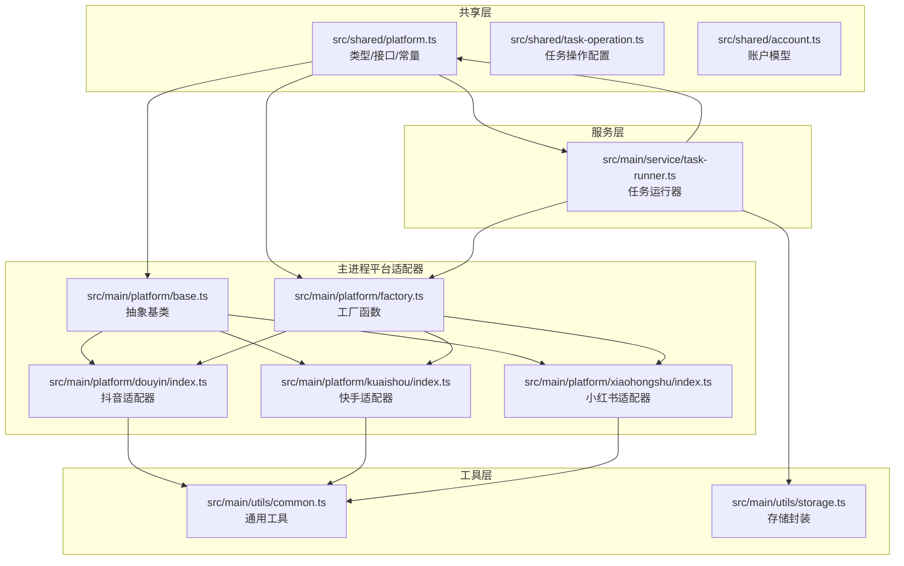
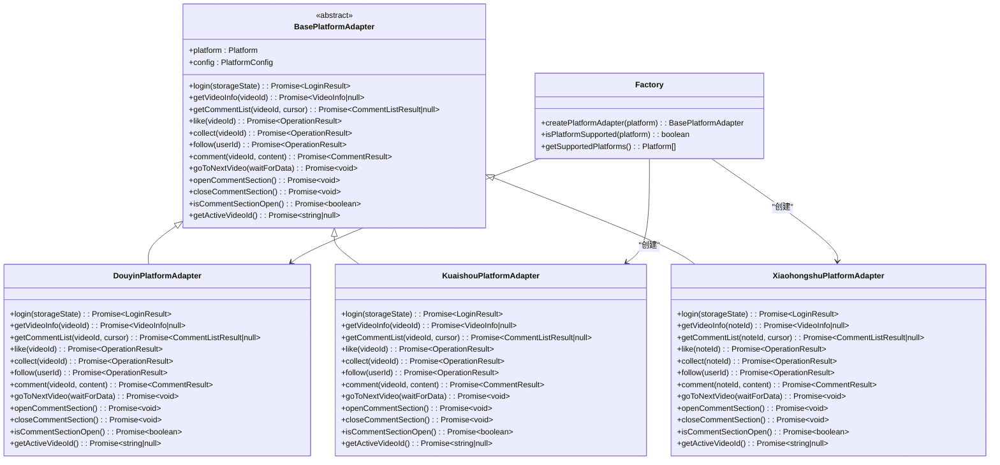
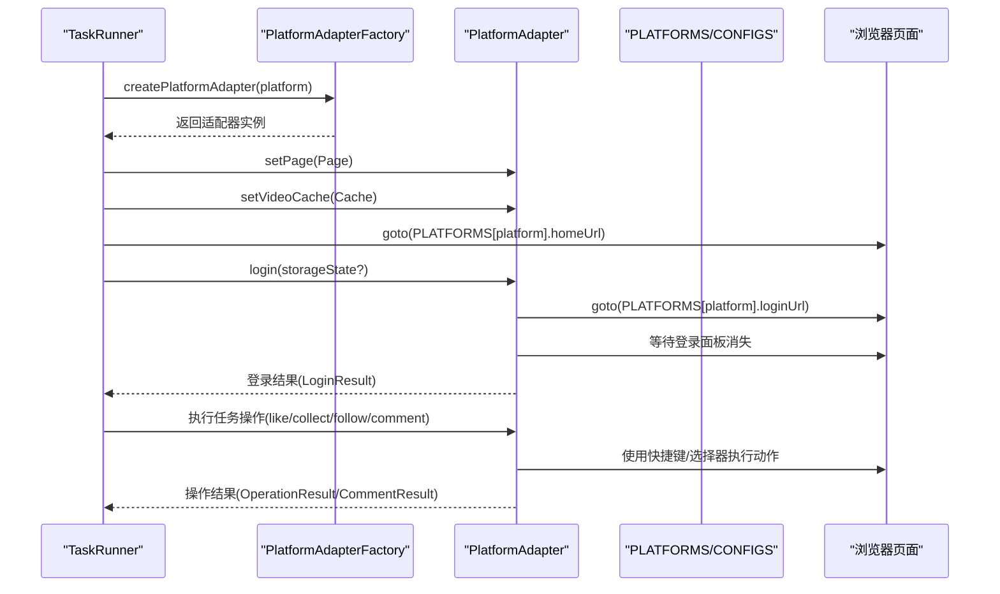
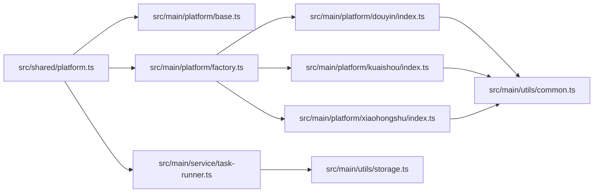

# 平台配置模型

<cite>
**本文档引用的文件**
- [src/shared/platform.ts](file://src/shared/platform.ts)
- [src/main/platform/base.ts](file://src/main/platform/base.ts)
- [src/main/platform/factory.ts](file://src/main/platform/factory.ts)
- [src/main/platform/douyin/index.ts](file://src/main/platform/douyin/index.ts)
- [src/main/platform/kuaishou/index.ts](file://src/main/platform/kuaishou/index.ts)
- [src/main/platform/xiaohongshu/index.ts](file://src/main/platform/xiaohongshu/index.ts)
- [src/shared/task-operation.ts](file://src/shared/task-operation.ts)
- [src/main/service/task-runner.ts](file://src/main/service/task-runner.ts)
- [src/main/utils/common.ts](file://src/main/utils/common.ts)
- [src/main/utils/storage.ts](file://src/main/utils/storage.ts)
- [src/shared/account.ts](file://src/shared/account.ts)
- [src/renderer/src/stores/app.ts](file://src/renderer/src/stores/app.ts)
</cite>

## 目录
1. [简介](#简介)
2. [项目结构](#项目结构)
3. [核心组件](#核心组件)
4. [架构总览](#架构总览)
5. [详细组件分析](#详细组件分析)
6. [依赖关系分析](#依赖关系分析)
7. [性能考虑](#性能考虑)
8. [故障排除指南](#故障排除指南)
9. [结论](#结论)
10. [附录](#附录)

## 简介
本文件系统性阐述 AutoOps 的平台配置模型，重点解释以下内容：
- Platform 类型定义与 TaskType 枚举的设计原则
- PlatformInfo 接口与 PLATFORMS 常量的配置结构
- PlatformSelectors 选择器配置、PlatformAPIEndpoints API 端点配置与键盘快捷键配置
- 各平台配置的具体示例与使用场景
- 平台扩展指南，说明如何添加新平台支持
- 平台配置的结构设计与正确使用方法

该模型采用“共享配置 + 适配器模式”的架构：共享层提供跨平台统一的类型、接口与配置常量；适配器层针对不同平台实现具体的业务逻辑，保证扩展性与一致性。

## 项目结构
AutoOps 将平台配置与适配器分别组织在共享层与主进程层：
- 共享层（src/shared）：定义类型、接口与全局配置常量
- 主进程层（src/main/platform）：基于适配器模式实现各平台的具体行为
- 服务层（src/main/service）：任务运行器等核心业务逻辑
- 工具层（src/main/utils）：通用工具与存储封装

图表来源
- [src/shared/platform.ts:1-260](file://src/shared/platform.ts#L1-L260)
- [src/main/platform/base.ts:1-105](file://src/main/platform/base.ts#L1-L105)
- [src/main/platform/factory.ts:1-32](file://src/main/platform/factory.ts#L1-L32)
- [src/main/platform/douyin/index.ts:1-507](file://src/main/platform/douyin/index.ts#L1-L507)
- [src/main/platform/kuaishou/index.ts:1-253](file://src/main/platform/kuaishou/index.ts#L1-L253)
- [src/main/platform/xiaohongshu/index.ts:1-264](file://src/main/platform/xiaohongshu/index.ts#L1-L264)
- [src/main/service/task-runner.ts:73-111](file://src/main/service/task-runner.ts#L73-L111)
- [src/main/utils/common.ts:1-11](file://src/main/utils/common.ts#L1-L11)
- [src/main/utils/storage.ts:1-46](file://src/main/utils/storage.ts#L1-L46)

章节来源
- [src/shared/platform.ts:1-260](file://src/shared/platform.ts#L1-L260)
- [src/main/platform/base.ts:1-105](file://src/main/platform/base.ts#L1-L105)
- [src/main/platform/factory.ts:1-32](file://src/main/platform/factory.ts#L1-L32)
- [src/main/platform/douyin/index.ts:1-507](file://src/main/platform/douyin/index.ts#L1-L507)
- [src/main/platform/kuaishou/index.ts:1-253](file://src/main/platform/kuaishou/index.ts#L1-L253)
- [src/main/platform/xiaohongshu/index.ts:1-264](file://src/main/platform/xiaohongshu/index.ts#L1-L264)
- [src/main/service/task-runner.ts:73-111](file://src/main/service/task-runner.ts#L73-L111)
- [src/main/utils/common.ts:1-11](file://src/main/utils/common.ts#L1-L11)
- [src/main/utils/storage.ts:1-46](file://src/main/utils/storage.ts#L1-L46)

## 核心组件
本节聚焦于平台配置模型的核心要素：类型定义、接口与常量配置。

- Platform 类型
  - 定义可支持的平台集合，用于约束工厂与运行时选择
  - 示例路径：[src/shared/platform.ts:1](file://src/shared/platform.ts#L1)

- TaskType 枚举
  - 表示任务类型，包含评论、点赞、收藏、关注、观看、组合等
  - 示例路径：[src/shared/platform.ts:3](file://src/shared/platform.ts#L3)

- PlatformInfo 接口
  - 描述平台的基础元信息：标识、名称、图标、首页URL、登录URL、颜色
  - 示例路径：[src/shared/platform.ts:9-16](file://src/shared/platform.ts#L9-L16)

- PLATFORMS 常量
  - 提供各平台的标准化配置，作为全局配置源
  - 示例路径：[src/shared/platform.ts:18-51](file://src/shared/platform.ts#L18-L51)

- PlatformSelectors 接口
  - 定义页面元素选择器映射，用于定位视频、按钮、输入框等
  - 示例路径：[src/shared/platform.ts:53-65](file://src/shared/platform.ts#L53-L65)

- PlatformAPIEndpoints 接口
  - 定义各平台的 API 端点，如推荐流、评论列表、发布评论等
  - 示例路径：[src/shared/platform.ts:67-74](file://src/shared/platform.ts#L67-L74)

- PlatformConfig 接口
  - 组合选择器、API 端点与键盘快捷键配置
  - 示例路径：[src/shared/platform.ts:76-86](file://src/shared/platform.ts#L76-L86)

- PLATFORM_CONFIGS 常量
  - 提供各平台的完整配置集合，包含选择器、API 端点与快捷键
  - 示例路径：[src/shared/platform.ts:88-200](file://src/shared/platform.ts#L88-L200)

- 任务操作配置
  - TaskOperation 枚举与 TaskOperationConfig 接口，用于描述单个任务操作
  - 示例路径：[src/shared/task-operation.ts:3-36](file://src/shared/task-operation.ts#L3-L36)

章节来源
- [src/shared/platform.ts:1-260](file://src/shared/platform.ts#L1-L260)
- [src/shared/task-operation.ts:1-58](file://src/shared/task-operation.ts#L1-L58)

## 架构总览
平台配置模型采用“共享配置 + 适配器模式”：
- 共享层提供统一的类型、接口与配置常量，确保跨平台一致性
- 适配器层针对不同平台实现具体业务逻辑，遵循抽象基类规范
- 工厂函数负责根据平台类型创建对应适配器实例
- 服务层（如任务运行器）通过工厂与配置常量驱动任务执行

图表来源
- [src/main/platform/base.ts:24-80](file://src/main/platform/base.ts#L24-L80)
- [src/main/platform/douyin/index.ts:56-507](file://src/main/platform/douyin/index.ts#L56-L507)
- [src/main/platform/kuaishou/index.ts:22-253](file://src/main/platform/kuaishou/index.ts#L22-L253)
- [src/main/platform/xiaohongshu/index.ts:23-264](file://src/main/platform/xiaohongshu/index.ts#L23-L264)
- [src/main/platform/factory.ts:7-26](file://src/main/platform/factory.ts#L7-L26)

## 详细组件分析

### Platform 类型与 TaskType 枚举
- 设计原则
  - 使用字面量联合类型限定平台集合，避免魔法字符串
  - TaskType 以枚举形式表达任务操作类型，便于扩展与维护
- 关键点
  - 平台类型与工厂函数保持一致，确保运行时安全
  - 任务类型与任务操作配置解耦，支持组合任务
- 示例路径
  - [src/shared/platform.ts:1](file://src/shared/platform.ts#L1)
  - [src/shared/platform.ts:3](file://src/shared/platform.ts#L3)

章节来源
- [src/shared/platform.ts:1-5](file://src/shared/platform.ts#L1-L5)

### PlatformInfo 接口与 PLATFORMS 常量
- 字段说明
  - id：平台标识，与 Platform 类型一致
  - name：平台显示名称
  - icon：平台图标（表情符号）
  - homeUrl：平台首页URL
  - loginUrl：平台登录URL
  - color：平台主题色
- 配置示例
  - 抖音：id='douyin'，name='抖音'，icon='📱'，homeUrl='https://www.douyin.com/'，loginUrl='https://www.douyin.com/login/'，color='#000000'
  - 快手：id='kuaishou'，name='快手'，icon='📹'，homeUrl='https://www.kuaishou.com/'，loginUrl='https://www.kuaishou.com/login'，color='#FF0000'
  - 小红书：id='xiaohongshu'，name='小红书'，icon='📕'，homeUrl='https://www.xiaohongshu.com/'，loginUrl='https://www.xiaohongshu.com/login'，color='#FF2442'
  - 微信视频号：id='wechat'，name='微信视频号'，icon='💚'，homeUrl='https://channels.weixin.qq.com/'，loginUrl='https://weixin.qq.com/'，color='#07C160'
- 示例路径
  - [src/shared/platform.ts:18-51](file://src/shared/platform.ts#L18-L51)

章节来源
- [src/shared/platform.ts:18-51](file://src/shared/platform.ts#L18-L51)

### PlatformSelectors 选择器配置
- 字段说明
  - activeVideo：当前活动视频容器选择器
  - videoIdAttr：从活动视频容器提取视频ID的属性名
  - likeButton：点赞按钮选择器
  - collectButton：收藏按钮选择器
  - followButton：关注按钮选择器
  - commentInput：评论输入框选择器
  - commentSubmit：评论提交按钮选择器（部分平台为空）
  - commentSection：评论面板选择器
  - verifyDialog：验证码弹窗选择器（部分平台可选）
  - loginPanel：登录面板选择器（部分平台可选）
  - videoSideCard：视频侧栏卡片选择器（部分平台可选）
- 配置示例
  - 抖音：activeVideo='[data-e2e="feed-active-video"]'，videoIdAttr='data-e2e-vid'，likeButton='[data-e2e="feed-like-icon"]'，followButton='[data-e2e="follow-button"]'，commentInput='.comment-input-inner-container'，videoSideCard='#videoSideCard'
  - 快手：activeVideo='[data-e2e="feed-active-video"]'，videoIdAttr='data-vid'，commentInput='.comment-input-container'
  - 小红书：activeVideo='.note-card'，videoIdAttr='data-note-id'，likeButton='.like-btn'，collectButton='.collect-btn'，followButton='.follow-btn'，commentInput='.comment-input'
  - 微信视频号：全部为空，表示尚未实现
- 示例路径
  - [src/shared/platform.ts:53-65](file://src/shared/platform.ts#L53-L65)
  - [src/shared/platform.ts:88-200](file://src/shared/platform.ts#L88-L200)

章节来源
- [src/shared/platform.ts:53-65](file://src/shared/platform.ts#L53-L65)
- [src/shared/platform.ts:88-200](file://src/shared/platform.ts#L88-L200)

### PlatformAPIEndpoints API 端点配置
- 字段说明
  - feed：推荐流/主页内容接口
  - commentList：评论列表接口
  - commentPublish：评论发布接口
  - like：点赞接口（部分平台为空）
  - collect：收藏接口（部分平台为空）
  - follow：关注接口（部分平台为空）
- 配置示例
  - 抖音：feed='https://www.douyin.com/aweme/v1/web/tab/feed/'，commentList='https://www.douyin.com/aweme/v1/web/comment/list/'，commentPublish='https://www.douyin.com/aweme/v1/web/comment/publish'
  - 快手：feed='https://www.kuaishou.com/graphql'，commentList='https://www.kuaishou.com/graphql'，commentPublish='https://www.kuaishou.com/graphql'
  - 小红书：全部为空，表示尚未实现
  - 微信视频号：全部为空，表示尚未实现
- 示例路径
  - [src/shared/platform.ts:67-74](file://src/shared/platform.ts#L67-L74)
  - [src/shared/platform.ts:88-200](file://src/shared/platform.ts#L88-L200)

章节来源
- [src/shared/platform.ts:67-74](file://src/shared/platform.ts#L67-L74)
- [src/shared/platform.ts:88-200](file://src/shared/platform.ts#L88-L200)

### 键盘快捷键配置
- 字段说明
  - nextVideo：下一条视频
  - like：点赞
  - collect：收藏
  - comment：打开/关闭评论区
  - follow：关注
- 配置示例
  - 抖音：nextVideo='ArrowDown'，like='z'，collect='c'，comment='x'，follow='f'
  - 快手：nextVideo='ArrowDown'，like='z'，collect='c'，comment='x'，follow='f'
  - 小红书：nextVideo='ArrowDown'，like='z'，collect='c'，comment='x'，follow='f'
  - 微信视频号：全部为空，表示尚未实现
- 示例路径
  - [src/shared/platform.ts:79-85](file://src/shared/platform.ts#L79-L85)
  - [src/shared/platform.ts:88-200](file://src/shared/platform.ts#L88-L200)

章节来源
- [src/shared/platform.ts:79-85](file://src/shared/platform.ts#L79-L85)
- [src/shared/platform.ts:88-200](file://src/shared/platform.ts#L88-L200)

### 适配器类与工厂模式
- BasePlatformAdapter 抽象基类
  - 定义统一的平台适配器接口，包括登录、获取视频信息、评论、点赞、收藏、关注、导航等方法
  - 提供日志输出、页面管理、缓存管理等通用能力
  - 示例路径：[src/main/platform/base.ts:24-80](file://src/main/platform/base.ts#L24-L80)

- 工厂函数
  - createPlatformAdapter：根据平台类型创建对应适配器实例
  - isPlatformSupported：判断平台是否受支持
  - getSupportedPlatforms：获取支持的平台列表
  - 示例路径：[src/main/platform/factory.ts:7-26](file://src/main/platform/factory.ts#L7-L26)

- 平台适配器实现
  - DouyinPlatformAdapter：实现抖音平台的登录、视频数据监听、评论发布、导航等
  - KuaishouPlatformAdapter：实现快手平台的登录、评论、导航等
  - XiaohongshuPlatformAdapter：实现小红书平台的登录、评论、导航等
  - 示例路径：
    - [src/main/platform/douyin/index.ts:56-507](file://src/main/platform/douyin/index.ts#L56-L507)
    - [src/main/platform/kuaishou/index.ts:22-253](file://src/main/platform/kuaishou/index.ts#L22-L253)
    - [src/main/platform/xiaohongshu/index.ts:23-264](file://src/main/platform/xiaohongshu/index.ts#L23-L264)

章节来源
- [src/main/platform/base.ts:24-80](file://src/main/platform/base.ts#L24-L80)
- [src/main/platform/factory.ts:7-26](file://src/main/platform/factory.ts#L7-L26)
- [src/main/platform/douyin/index.ts:56-507](file://src/main/platform/douyin/index.ts#L56-L507)
- [src/main/platform/kuaishou/index.ts:22-253](file://src/main/platform/kuaishou/index.ts#L22-L253)
- [src/main/platform/xiaohongshu/index.ts:23-264](file://src/main/platform/xiaohongshu/index.ts#L23-L264)

### 任务执行流程（序列图）
任务运行器通过工厂创建适配器，读取配置常量，驱动平台适配器执行任务。

图表来源
- [src/main/service/task-runner.ts:73-111](file://src/main/service/task-runner.ts#L73-L111)
- [src/main/platform/factory.ts:7-18](file://src/main/platform/factory.ts#L7-L18)
- [src/shared/platform.ts:18-51](file://src/shared/platform.ts#L18-L51)
- [src/shared/platform.ts:88-200](file://src/shared/platform.ts#L88-L200)

### 平台配置使用场景
- 账户管理
  - 账户模型包含平台字段，用于区分不同平台的账号
  - 示例路径：[src/shared/account.ts:6](file://src/shared/account.ts#L6)

- 任务运行器
  - 任务运行器根据平台类型访问 PLATFORMS 与 PLATFORM_CONFIGS，设置浏览器上下文与页面
  - 示例路径：[src/main/service/task-runner.ts:90-94](file://src/main/service/task-runner.ts#L90-L94)

- 前端状态管理
  - 应用状态管理中记录当前任务状态，便于 UI 展示
  - 示例路径：[src/renderer/src/stores/app.ts:11-16](file://src/renderer/src/stores/app.ts#L11-L16)

章节来源
- [src/shared/account.ts:6](file://src/shared/account.ts#L6)
- [src/main/service/task-runner.ts:90-94](file://src/main/service/task-runner.ts#L90-L94)
- [src/renderer/src/stores/app.ts:11-16](file://src/renderer/src/stores/app.ts#L11-L16)

## 依赖关系分析
- 共享层依赖
  - BasePlatformAdapter 依赖共享的类型与接口
  - 工厂函数依赖共享的 Platform 类型
  - 适配器实现依赖共享的 PLATFORMS 与 PLATFORM_CONFIGS 常量
- 服务层依赖
  - 任务运行器依赖工厂函数与共享配置常量
  - 任务运行器依赖存储封装以持久化认证状态
- 工具层依赖
  - 适配器实现依赖通用工具（随机数、睡眠、ID 生成）

图表来源
- [src/shared/platform.ts:1-260](file://src/shared/platform.ts#L1-L260)
- [src/main/platform/base.ts:1-105](file://src/main/platform/base.ts#L1-L105)
- [src/main/platform/factory.ts:1-32](file://src/main/platform/factory.ts#L1-L32)
- [src/main/platform/douyin/index.ts:1-507](file://src/main/platform/douyin/index.ts#L1-L507)
- [src/main/platform/kuaishou/index.ts:1-253](file://src/main/platform/kuaishou/index.ts#L1-L253)
- [src/main/platform/xiaohongshu/index.ts:1-264](file://src/main/platform/xiaohongshu/index.ts#L1-L264)
- [src/main/service/task-runner.ts:73-111](file://src/main/service/task-runner.ts#L73-L111)
- [src/main/utils/common.ts:1-11](file://src/main/utils/common.ts#L1-L11)
- [src/main/utils/storage.ts:1-46](file://src/main/utils/storage.ts#L1-L46)

章节来源
- [src/shared/platform.ts:1-260](file://src/shared/platform.ts#L1-L260)
- [src/main/platform/base.ts:1-105](file://src/main/platform/base.ts#L1-L105)
- [src/main/platform/factory.ts:1-32](file://src/main/platform/factory.ts#L1-L32)
- [src/main/platform/douyin/index.ts:1-507](file://src/main/platform/douyin/index.ts#L1-L507)
- [src/main/platform/kuaishou/index.ts:1-253](file://src/main/platform/kuaishou/index.ts#L1-L253)
- [src/main/platform/xiaohongshu/index.ts:1-264](file://src/main/platform/xiaohongshu/index.ts#L1-L264)
- [src/main/service/task-runner.ts:73-111](file://src/main/service/task-runner.ts#L73-L111)
- [src/main/utils/common.ts:1-11](file://src/main/utils/common.ts#L1-L11)
- [src/main/utils/storage.ts:1-46](file://src/main/utils/storage.ts#L1-L46)

## 性能考虑
- 页面监听与缓存
  - 抖音适配器通过监听 feed API 响应填充视频缓存，减少重复请求
  - 示例路径：[src/main/platform/douyin/index.ts:136-153](file://src/main/platform/douyin/index.ts#L136-L153)
- 等待策略
  - 使用超时与重试机制等待页面元素出现或响应返回，避免死等
  - 示例路径：[src/main/platform/douyin/index.ts:221-260](file://src/main/platform/douyin/index.ts#L221-L260)
- 随机延迟
  - 在模拟用户行为时加入随机延迟，降低被风控概率
  - 示例路径：[src/main/utils/common.ts:1-11](file://src/main/utils/common.ts#L1-L11)

## 故障排除指南
- 登录失败
  - 检查登录URL与登录面板选择器是否匹配
  - 确认 storageState 是否正确传递
  - 示例路径：[src/main/platform/douyin/index.ts:69-105](file://src/main/platform/douyin/index.ts#L69-L105)
- 评论发布超时
  - 检查评论发布API端点与响应监听逻辑
  - 确认验证码弹窗处理逻辑
  - 示例路径：[src/main/platform/douyin/index.ts:350-375](file://src/main/platform/douyin/index.ts#L350-L375)
- 适配器未创建
  - 检查工厂函数中的平台分支与 isPlatformSupported
  - 示例路径：[src/main/platform/factory.ts:7-26](file://src/main/platform/factory.ts#L7-L26)
- 配置不一致
  - 确保 PLATFORMS 与 PLATFORM_CONFIGS 中的平台键一致
  - 示例路径：[src/shared/platform.ts:18-51](file://src/shared/platform.ts#L18-L51)

章节来源
- [src/main/platform/douyin/index.ts:69-105](file://src/main/platform/douyin/index.ts#L69-L105)
- [src/main/platform/douyin/index.ts:350-375](file://src/main/platform/douyin/index.ts#L350-L375)
- [src/main/platform/factory.ts:7-26](file://src/main/platform/factory.ts#L7-L26)
- [src/shared/platform.ts:18-51](file://src/shared/platform.ts#L18-L51)

## 结论
AutoOps 的平台配置模型通过共享层的类型、接口与配置常量，结合主进程的适配器模式与工厂函数，实现了对多平台的一致性支持与良好扩展性。该模型的关键优势包括：
- 明确的类型约束与接口定义，降低错误风险
- 集中的配置常量，便于维护与扩展
- 适配器模式隔离平台差异，提升可测试性与可维护性
- 工厂函数统一创建入口，简化调用方逻辑

建议在扩展新平台时严格遵循现有结构，确保配置常量、选择器、API 端点与快捷键的完整性与一致性。

## 附录

### 平台扩展指南
- 新增平台步骤
  1. 在共享层定义平台类型与配置接口
     - 示例路径：[src/shared/platform.ts:1-5](file://src/shared/platform.ts#L1-L5)
  2. 在共享层完善 PLATFORMS 与 PLATFORM_CONFIGS
     - 选择器、API 端点与快捷键需完整填写
     - 示例路径：[src/shared/platform.ts:18-51](file://src/shared/platform.ts#L18-L51)
  3. 在主进程创建适配器类
     - 继承 BasePlatformAdapter，实现登录、导航、操作等方法
     - 示例路径：[src/main/platform/base.ts:24-80](file://src/main/platform/base.ts#L24-L80)
  4. 在工厂函数注册新适配器
     - 添加分支以支持新平台
     - 示例路径：[src/main/platform/factory.ts:7-18](file://src/main/platform/factory.ts#L7-L18)
  5. 在服务层使用新平台
     - 任务运行器通过工厂与配置常量使用新平台
     - 示例路径：[src/main/service/task-runner.ts:90-94](file://src/main/service/task-runner.ts#L90-L94)

- 配置规则
  - 选择器必须能稳定定位到页面元素
  - API 端点需与实际平台接口一致
  - 快捷键需与平台交互方式匹配
  - 颜色与图标用于 UI 展示，需符合品牌规范

- 使用场景示例
  - 账户管理：根据平台字段筛选与管理账号
    - 示例路径：[src/shared/account.ts:6](file://src/shared/account.ts#L6)
  - 任务执行：通过工厂创建适配器，读取配置常量执行任务
    - 示例路径：[src/main/service/task-runner.ts:90-94](file://src/main/service/task-runner.ts#L90-L94)

章节来源
- [src/shared/platform.ts:1-5](file://src/shared/platform.ts#L1-L5)
- [src/shared/platform.ts:18-51](file://src/shared/platform.ts#L18-L51)
- [src/main/platform/base.ts:24-80](file://src/main/platform/base.ts#L24-L80)
- [src/main/platform/factory.ts:7-18](file://src/main/platform/factory.ts#L7-L18)
- [src/main/service/task-runner.ts:90-94](file://src/main/service/task-runner.ts#L90-L94)
- [src/shared/account.ts:6](file://src/shared/account.ts#L6)