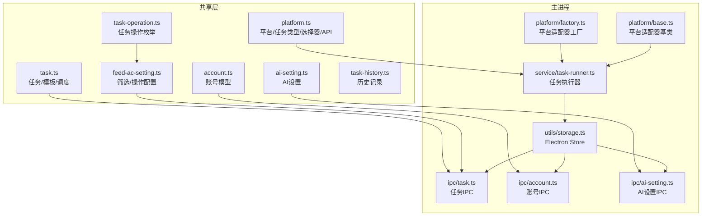
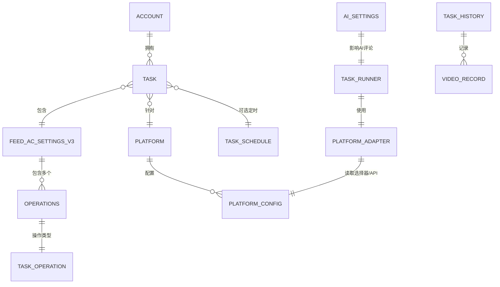
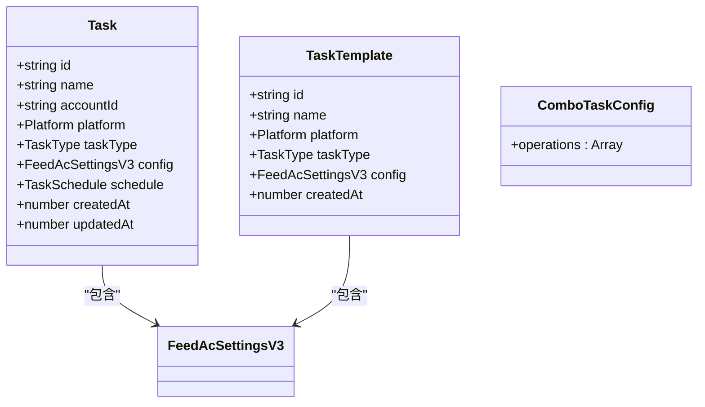
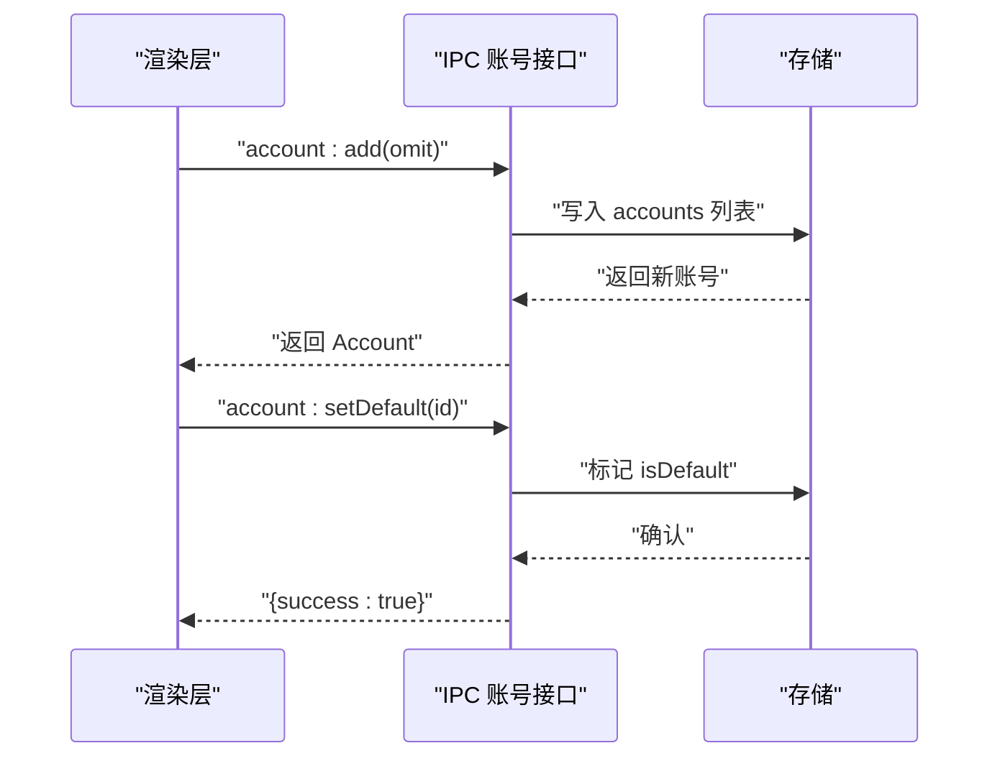
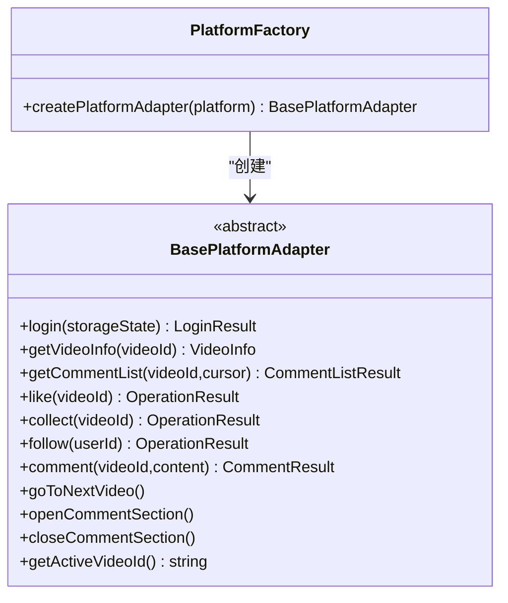
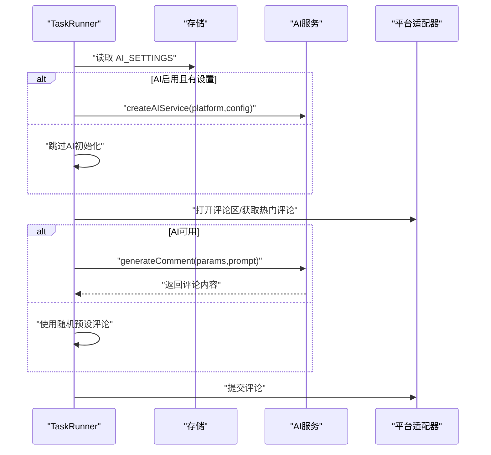
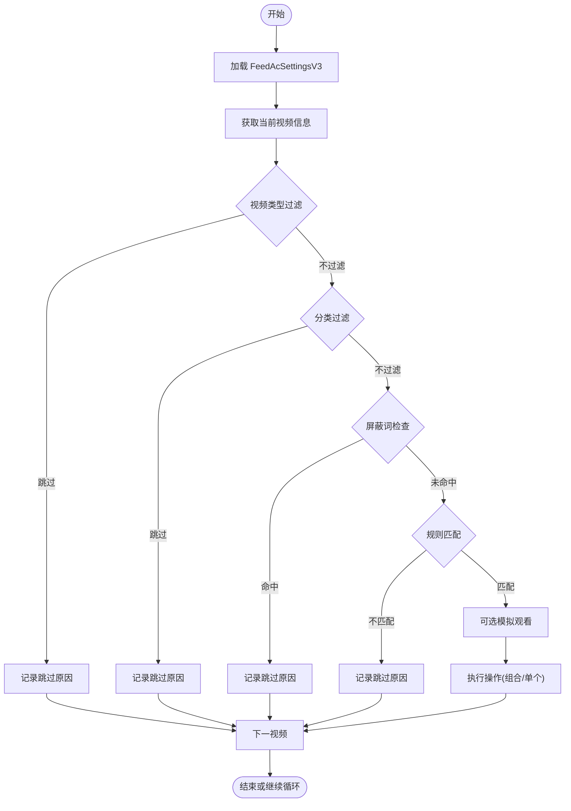
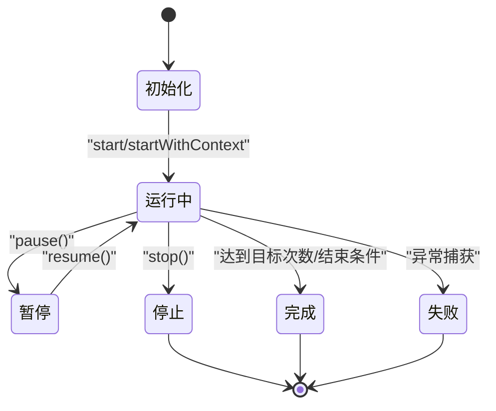
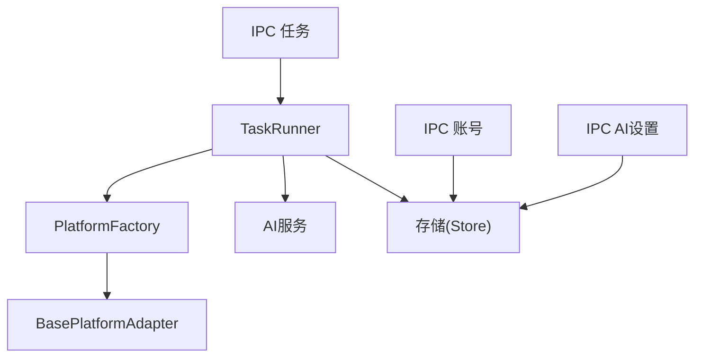

# 数据关系和依赖

<cite>
**本文档引用的文件**
- [src/shared/task.ts](file://src/shared/task.ts)
- [src/shared/account.ts](file://src/shared/account.ts)
- [src/shared/platform.ts](file://src/shared/platform.ts)
- [src/shared/ai-setting.ts](file://src/shared/ai-setting.ts)
- [src/shared/feed-ac-setting.ts](file://src/shared/feed-ac-setting.ts)
- [src/shared/task-operation.ts](file://src/shared/task-operation.ts)
- [src/shared/task-history.ts](file://src/shared/task-history.ts)
- [src/main/ipc/task.ts](file://src/main/ipc/task.ts)
- [src/main/ipc/account.ts](file://src/main/ipc/account.ts)
- [src/main/ipc/ai-setting.ts](file://src/main/ipc/ai-setting.ts)
- [src/main/utils/storage.ts](file://src/main/utils/storage.ts)
- [src/main/service/task-runner.ts](file://src/main/service/task-runner.ts)
- [src/main/platform/base.ts](file://src/main/platform/base.ts)
- [src/main/platform/factory.ts](file://src/main/platform/factory.ts)
</cite>

## 目录
1. [引言](#引言)
2. [项目结构](#项目结构)
3. [核心组件](#核心组件)
4. [架构总览](#架构总览)
5. [详细组件分析](#详细组件分析)
6. [依赖分析](#依赖分析)
7. [性能考虑](#性能考虑)
8. [故障排查指南](#故障排查指南)
9. [结论](#结论)
10. [附录](#附录)

## 引言
本文件系统性梳理 AutoOps 的数据模型关系与依赖结构，重点解释：
- 平台配置与任务配置的耦合与解耦方式
- 账号信息在任务执行中的作用与生命周期
- AI 设置对任务执行的影响路径与回退策略
- 筛选规则与平台配置的交互机制
- 数据一致性、级联更新与依赖解析的实现策略
- 数据模型演进与版本兼容（如 FeedAcSettings 的 v2→v3 迁移）
- 数据完整性检查、错误传播与回滚机制的技术细节

## 项目结构
AutoOps 采用“共享模型 + 主进程服务 + 渲染层”的分层设计：
- 共享层（src/shared）：定义跨进程的数据模型与常量
- 主进程（src/main）：封装 IPC 接口、任务运行器、平台适配器、存储管理
- 渲染层（src/renderer）：UI 层，通过 IPC 与主进程交互

图表来源
- [src/shared/task.ts:1-62](file://src/shared/task.ts#L1-L62)
- [src/shared/account.ts:1-39](file://src/shared/account.ts#L1-L39)
- [src/shared/platform.ts:1-260](file://src/shared/platform.ts#L1-L260)
- [src/shared/ai-setting.ts:1-29](file://src/shared/ai-setting.ts#L1-L29)
- [src/shared/feed-ac-setting.ts:1-179](file://src/shared/feed-ac-setting.ts#L1-L179)
- [src/shared/task-operation.ts:1-58](file://src/shared/task-operation.ts#L1-L58)
- [src/shared/task-history.ts:1-26](file://src/shared/task-history.ts#L1-L26)
- [src/main/ipc/task.ts:1-243](file://src/main/ipc/task.ts#L1-L243)
- [src/main/ipc/account.ts:1-101](file://src/main/ipc/account.ts#L1-L101)
- [src/main/ipc/ai-setting.ts:1-27](file://src/main/ipc/ai-setting.ts#L1-L27)
- [src/main/utils/storage.ts:1-46](file://src/main/utils/storage.ts#L1-L46)
- [src/main/service/task-runner.ts:1-760](file://src/main/service/task-runner.ts#L1-L760)
- [src/main/platform/base.ts:1-105](file://src/main/platform/base.ts#L1-L105)
- [src/main/platform/factory.ts:1-32](file://src/main/platform/factory.ts#L1-L32)

章节来源
- [src/shared/task.ts:1-62](file://src/shared/task.ts#L1-L62)
- [src/shared/account.ts:1-39](file://src/shared/account.ts#L1-L39)
- [src/shared/platform.ts:1-260](file://src/shared/platform.ts#L1-L260)
- [src/shared/ai-setting.ts:1-29](file://src/shared/ai-setting.ts#L1-L29)
- [src/shared/feed-ac-setting.ts:1-179](file://src/shared/feed-ac-setting.ts#L1-L179)
- [src/shared/task-operation.ts:1-58](file://src/shared/task-operation.ts#L1-L58)
- [src/shared/task-history.ts:1-26](file://src/shared/task-history.ts#L1-L26)
- [src/main/ipc/task.ts:1-243](file://src/main/ipc/task.ts#L1-L243)
- [src/main/ipc/account.ts:1-101](file://src/main/ipc/account.ts#L1-L101)
- [src/main/ipc/ai-setting.ts:1-27](file://src/main/ipc/ai-setting.ts#L1-L27)
- [src/main/utils/storage.ts:1-46](file://src/main/utils/storage.ts#L1-L46)
- [src/main/service/task-runner.ts:1-760](file://src/main/service/task-runner.ts#L1-L760)
- [src/main/platform/base.ts:1-105](file://src/main/platform/base.ts#L1-L105)
- [src/main/platform/factory.ts:1-32](file://src/main/platform/factory.ts#L1-L32)

## 核心组件
- 任务模型（Task/TaskTemplate/ComboTaskConfig/TaskSchedule）：承载任务标识、名称、所属账号、平台、任务类型、配置、定时等信息
- 账号模型（Account/AccountListItem）：承载账号标识、平台、登录态、状态等
- 平台模型（Platform/TaskType/PlatformConfig/PlatformSelectors/API）：承载平台元信息、选择器、API 端点、快捷键等
- AI 设置（AISettings/PLATFORM_MODELS）：承载 AI 平台、模型、温度、密钥等
- 筛选与操作配置（FeedAcSettingsV2/V3/RuleGroups/Operations）：承载规则组、屏蔽词、模拟观看、操作概率、AI 评论等
- 任务运行器（TaskRunner）：封装浏览器上下文、平台适配器、AI 服务、任务执行循环、状态管理
- 存储（StorageKey/StoreSchema）：统一管理账户、任务、历史、AI 设置、浏览器路径等持久化键

章节来源
- [src/shared/task.ts:12-62](file://src/shared/task.ts#L12-L62)
- [src/shared/account.ts:3-39](file://src/shared/account.ts#L3-L39)
- [src/shared/platform.ts:1-260](file://src/shared/platform.ts#L1-L260)
- [src/shared/ai-setting.ts:1-29](file://src/shared/ai-setting.ts#L1-L29)
- [src/shared/feed-ac-setting.ts:62-179](file://src/shared/feed-ac-setting.ts#L62-L179)
- [src/main/service/task-runner.ts:15-51](file://src/main/service/task-runner.ts#L15-L51)
- [src/main/utils/storage.ts:3-38](file://src/main/utils/storage.ts#L3-L38)

## 架构总览
下图展示数据模型之间的引用关系与数据流向，包括 IPC、存储与运行时交互。

图表来源
- [src/shared/account.ts:3-39](file://src/shared/account.ts#L3-L39)
- [src/shared/task.ts:12-22](file://src/shared/task.ts#L12-L22)
- [src/shared/feed-ac-setting.ts:62-97](file://src/shared/feed-ac-setting.ts#L62-L97)
- [src/shared/task-operation.ts:28-41](file://src/shared/task-operation.ts#L28-L41)
- [src/shared/platform.ts:76-86](file://src/shared/platform.ts#L76-L86)
- [src/shared/ai-setting.ts:3-8](file://src/shared/ai-setting.ts#L3-L8)
- [src/shared/task-history.ts:14-22](file://src/shared/task-history.ts#L14-L22)
- [src/main/service/task-runner.ts:25-51](file://src/main/service/task-runner.ts#L25-L51)
- [src/main/platform/base.ts:24-80](file://src/main/platform/base.ts#L24-L80)

## 详细组件分析

### 任务模型与任务模板
- Task：包含任务标识、名称、accountId、platform、taskType、config（FeedAcSettingsV3）、schedule、时间戳
- TaskTemplate：用于复用配置，不含 accountId
- ComboTaskConfig：组合任务的子操作集合，含概率与上限
- 默认任务生成器：提供默认字段与时间戳

图表来源
- [src/shared/task.ts:12-31](file://src/shared/task.ts#L12-L31)
- [src/shared/feed-ac-setting.ts:62-97](file://src/shared/feed-ac-setting.ts#L62-L97)

章节来源
- [src/shared/task.ts:12-62](file://src/shared/task.ts#L12-L62)
- [src/shared/feed-ac-setting.ts:62-97](file://src/shared/feed-ac-setting.ts#L62-L97)

### 账号模型与默认账号策略
- Account：包含 id、name、platform、storageState、cookies、状态与过期时间等
- 默认账号：当列表为空时自动设为默认；删除账号后若无默认则将首个账号置为默认
- IPC 提供增删改查、设置默认、按平台筛选、获取活动账号等

图表来源
- [src/main/ipc/account.ts:32-100](file://src/main/ipc/account.ts#L32-L100)
- [src/main/utils/storage.ts:14-25](file://src/main/utils/storage.ts#L14-L25)

章节来源
- [src/shared/account.ts:3-39](file://src/shared/account.ts#L3-L39)
- [src/main/ipc/account.ts:20-100](file://src/main/ipc/account.ts#L20-L100)
- [src/main/utils/storage.ts:3-38](file://src/main/utils/storage.ts#L3-L38)

### 平台配置与平台适配器
- Platform/TaskType：平台枚举与任务类型枚举
- PlatformConfig：包含 selectors、API endpoints、键盘快捷键
- BasePlatformAdapter：抽象平台适配器，定义登录、视频/评论/互动操作、导航等接口
- 工厂：根据平台创建对应适配器

图表来源
- [src/main/platform/base.ts:24-80](file://src/main/platform/base.ts#L24-L80)
- [src/main/platform/factory.ts:7-18](file://src/main/platform/factory.ts#L7-L18)

章节来源
- [src/shared/platform.ts:1-260](file://src/shared/platform.ts#L1-L260)
- [src/main/platform/base.ts:1-105](file://src/main/platform/base.ts#L1-L105)
- [src/main/platform/factory.ts:1-32](file://src/main/platform/factory.ts#L1-L32)

### AI 设置与任务执行影响
- AISettings：平台、模型、温度、各平台 API Key 映射
- 任务运行器在启动时读取 AI 设置，并在满足条件时初始化 AI 服务
- 评论阶段优先使用 AI 生成内容，失败时回退至预设评论文本

图表来源
- [src/main/service/task-runner.ts:96-103](file://src/main/service/task-runner.ts#L96-L103)
- [src/main/service/task-runner.ts:614-679](file://src/main/service/task-runner.ts#L614-L679)
- [src/shared/ai-setting.ts:1-29](file://src/shared/ai-setting.ts#L1-L29)

章节来源
- [src/shared/ai-setting.ts:1-29](file://src/shared/ai-setting.ts#L1-L29)
- [src/main/service/task-runner.ts:96-103](file://src/main/service/task-runner.ts#L96-L103)
- [src/main/service/task-runner.ts:614-679](file://src/main/service/task-runner.ts#L614-L679)

### 筛选规则与平台配置交互
- FeedAcSettingsV3：包含规则组、屏蔽词、模拟观看、操作集合、视频分类等
- 规则匹配：支持手动关键词与 AI 提示两种规则类型，支持嵌套与逻辑关系
- 视频类型过滤：广告/直播/图集自动跳过策略
- 分类过滤：白名单/黑名单与关键词+AI 组合判定

图表来源
- [src/main/service/task-runner.ts:276-353](file://src/main/service/task-runner.ts#L276-L353)
- [src/main/service/task-runner.ts:423-482](file://src/main/service/task-runner.ts#L423-L482)
- [src/main/service/task-runner.ts:489-501](file://src/main/service/task-runner.ts#L489-L501)
- [src/main/service/task-runner.ts:503-559](file://src/main/service/task-runner.ts#L503-L559)
- [src/shared/feed-ac-setting.ts:62-97](file://src/shared/feed-ac-setting.ts#L62-L97)

章节来源
- [src/shared/feed-ac-setting.ts:1-179](file://src/shared/feed-ac-setting.ts#L1-L179)
- [src/main/service/task-runner.ts:276-353](file://src/main/service/task-runner.ts#L276-L353)
- [src/main/service/task-runner.ts:423-482](file://src/main/service/task-runner.ts#L423-L482)
- [src/main/service/task-runner.ts:489-501](file://src/main/service/task-runner.ts#L489-L501)
- [src/main/service/task-runner.ts:503-559](file://src/main/service/task-runner.ts#L503-L559)

### 任务执行流程与状态机
- TaskRunner 状态：running/paused/stopped/completed/failed
- 支持外部共享 BrowserContext 的并发模式
- 通过事件向渲染层广播进度、动作、暂停/恢复等状态

图表来源
- [src/main/service/task-runner.ts:25-51](file://src/main/service/task-runner.ts#L25-L51)
- [src/main/service/task-runner.ts:185-210](file://src/main/service/task-runner.ts#L185-L210)
- [src/main/service/task-runner.ts:235-371](file://src/main/service/task-runner.ts#L235-L371)

章节来源
- [src/main/service/task-runner.ts:25-51](file://src/main/service/task-runner.ts#L25-L51)
- [src/main/service/task-runner.ts:185-210](file://src/main/service/task-runner.ts#L185-L210)
- [src/main/service/task-runner.ts:235-371](file://src/main/service/task-runner.ts#L235-L371)

### 数据模型演进与版本兼容
- FeedAcSettingsV2 → V3：迁移函数保留关键字段，新增 operations、视频分类、AI 评论相关字段，并提供默认值
- 任务 IPC 在启动前自动检测并迁移设置版本

图表来源
- [src/shared/feed-ac-setting.ts:148-174](file://src/shared/feed-ac-setting.ts#L148-L174)
- [src/main/ipc/task.ts:104-106](file://src/main/ipc/task.ts#L104-L106)

章节来源
- [src/shared/feed-ac-setting.ts:148-174](file://src/shared/feed-ac-setting.ts#L148-L174)
- [src/main/ipc/task.ts:104-106](file://src/main/ipc/task.ts#L104-L106)

## 依赖分析
- 组件内聚与耦合
  - TaskRunner 对平台适配器与 AI 服务存在运行时依赖，但通过工厂与配置注入降低编译期耦合
  - FeedAcSettings 与平台配置通过选择器/API 字段间接耦合，便于扩展新平台
- 外部依赖
  - Playwright 浏览器驱动、electron-store 持久化、electron-log 日志
- IPC 与存储
  - IPC 将渲染层请求转换为主进程服务调用，统一经由存储层持久化

图表来源
- [src/main/service/task-runner.ts:8-12](file://src/main/service/task-runner.ts#L8-L12)
- [src/main/platform/factory.ts:7-18](file://src/main/platform/factory.ts#L7-L18)
- [src/main/ipc/task.ts:81-132](file://src/main/ipc/task.ts#L81-L132)
- [src/main/ipc/account.ts:32-100](file://src/main/ipc/account.ts#L32-L100)
- [src/main/ipc/ai-setting.ts:5-27](file://src/main/ipc/ai-setting.ts#L5-L27)

章节来源
- [src/main/service/task-runner.ts:8-12](file://src/main/service/task-runner.ts#L8-L12)
- [src/main/platform/factory.ts:1-32](file://src/main/platform/factory.ts#L1-L32)
- [src/main/ipc/task.ts:1-243](file://src/main/ipc/task.ts#L1-L243)
- [src/main/ipc/account.ts:1-101](file://src/main/ipc/account.ts#L1-L101)
- [src/main/ipc/ai-setting.ts:1-27](file://src/main/ipc/ai-setting.ts#L1-L27)

## 性能考虑
- 并发与上下文复用：支持共享 BrowserContext 的多任务并行，减少浏览器实例创建开销
- 缓存与监听：页面响应监听缓存视频数据，避免重复抓取
- 随机化与节流：操作间隔、观看时长随机化，降低风控风险
- AI 回退：AI 失败时快速回退至预设文案，保障吞吐

## 故障排查指南
- 任务启动失败
  - 检查浏览器可执行路径是否配置（IPC 返回“Browser path not configured”）
  - 查看日志中 TaskRunner 初始化与页面导航错误
- 账号登录态问题
  - 确认账号 storageState 是否正确保存与解析；失败时回退至全局 auth
- AI 评论失败
  - 检查 AI 设置是否启用、API Key 是否有效、模型是否匹配
  - 若 AI 失败，系统会回退到随机预设评论
- 规则不匹配导致频繁跳过
  - 调整 FeedAcSettings 的规则组、屏蔽词、分类策略或放宽“仅活跃视频”限制

章节来源
- [src/main/ipc/task.ts:98-102](file://src/main/ipc/task.ts#L98-L102)
- [src/main/service/task-runner.ts:72-84](file://src/main/service/task-runner.ts#L72-L84)
- [src/main/ipc/ai-setting.ts:24-26](file://src/main/ipc/ai-setting.ts#L24-L26)
- [src/main/service/task-runner.ts:667-670](file://src/main/service/task-runner.ts#L667-L670)

## 结论
AutoOps 的数据模型以共享层为核心，通过 IPC 与主进程服务解耦，形成清晰的职责边界。任务执行围绕 FeedAcSettings 与平台适配器展开，AI 设置与账号信息分别在评论与登录态层面提供增强与保障。通过版本迁移、回退策略与事件广播，系统在复杂场景下仍保持稳定与可维护性。

## 附录
- 关键接口与路径
  - 任务启动与状态查询：[src/main/ipc/task.ts:81-240](file://src/main/ipc/task.ts#L81-L240)
  - 账号 CRUD 与默认账号：[src/main/ipc/account.ts:32-100](file://src/main/ipc/account.ts#L32-L100)
  - AI 设置读取/更新/重置：[src/main/ipc/ai-setting.ts:5-27](file://src/main/ipc/ai-setting.ts#L5-L27)
  - 任务执行器核心逻辑：[src/main/service/task-runner.ts:235-760](file://src/main/service/task-runner.ts#L235-L760)
  - 存储键与默认值：[src/main/utils/storage.ts:14-38](file://src/main/utils/storage.ts#L14-L38)