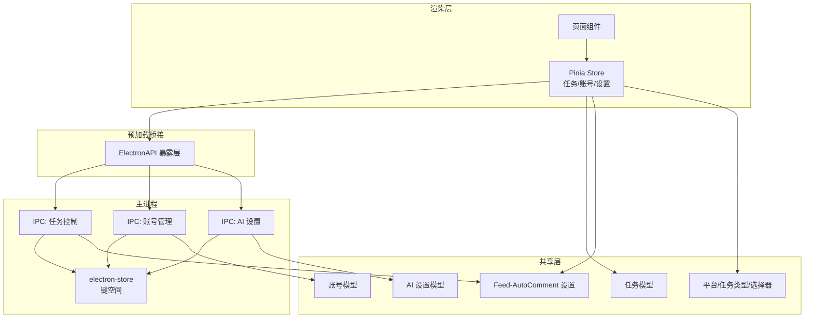
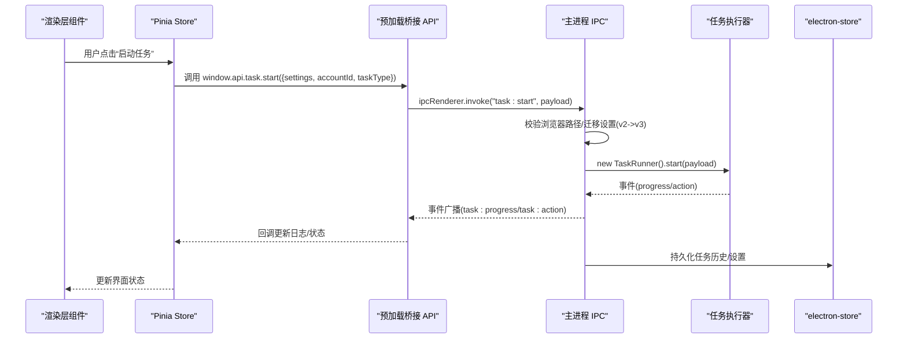
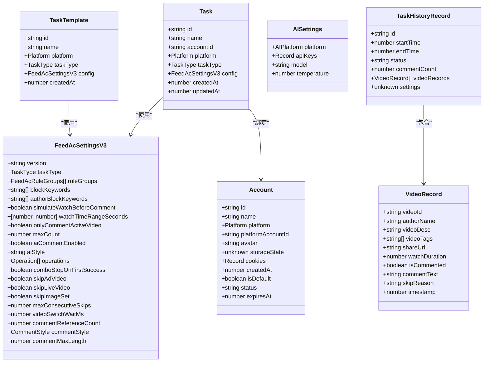
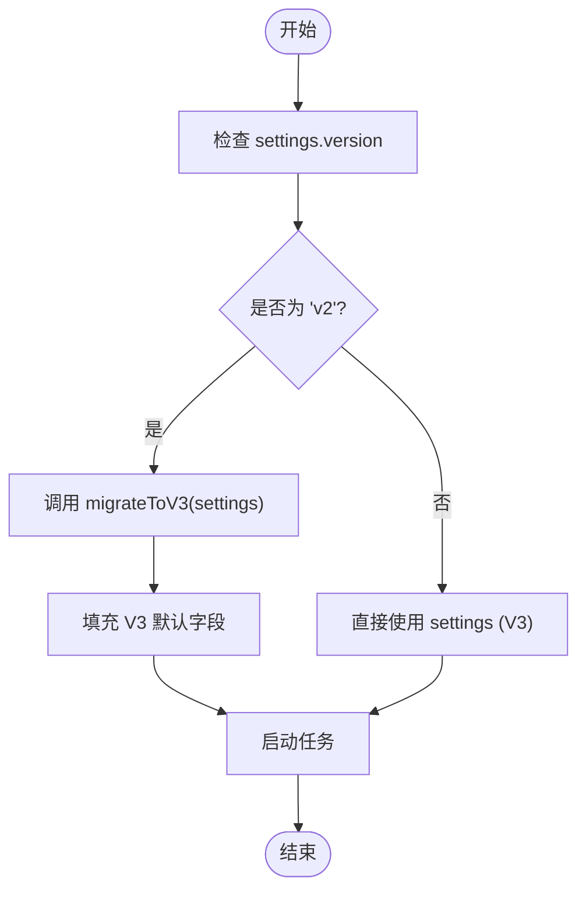

# 数据模型

<cite>
**本文引用的文件**
- [src/shared/task.ts](file://src/shared/task.ts)
- [src/shared/account.ts](file://src/shared/account.ts)
- [src/shared/ai-setting.ts](file://src/shared/ai-setting.ts)
- [src/shared/feed-ac-setting.ts](file://src/shared/feed-ac-setting.ts)
- [src/shared/platform.ts](file://src/shared/platform.ts)
- [src/shared/task-operation.ts](file://src/shared/task-operation.ts)
- [src/shared/task-history.ts](file://src/shared/task-history.ts)
- [src/main/ipc/task.ts](file://src/main/ipc/task.ts)
- [src/main/ipc/account.ts](file://src/main/ipc/account.ts)
- [src/main/ipc/ai-setting.ts](file://src/main/ipc/ai-setting.ts)
- [src/main/utils/storage.ts](file://src/main/utils/storage.ts)
- [src/preload/index.ts](file://src/preload/index.ts)
- [src/renderer/src/stores/task.ts](file://src/renderer/src/stores/task.ts)
- [src/renderer/src/stores/account.ts](file://src/renderer/src/stores/account.ts)
- [src/renderer/src/stores/settings.ts](file://src/renderer/src/stores/settings.ts)
</cite>

## 目录
1. [简介](#简介)
2. [项目结构与数据模型定位](#项目结构与数据模型定位)
3. [核心数据模型总览](#核心数据模型总览)
4. [架构概览与数据流](#架构概览与数据流)
5. [详细模型解析](#详细模型解析)
6. [依赖关系与耦合分析](#依赖关系与耦合分析)
7. [序列化、持久化与版本兼容](#序列化持久化与版本兼容)
8. [性能与扩展性考量](#性能与扩展性考量)
9. [故障排查与常见问题](#故障排查与常见问题)
10. [结论](#结论)

## 简介
本文件系统性梳理 AutoOps 的数据模型，覆盖平台配置、任务配置、账号、AI 设置以及筛选规则等核心实体，并解释它们之间的关系、约束与使用方式。文档同时给出数据在渲染层、预加载层与主进程之间的传递路径、持久化策略与版本兼容处理建议，帮助开发者正确使用与扩展这些模型。

## 项目结构与数据模型定位
AutoOps 的数据模型主要集中在共享层（shared）与主进程 IPC 层，渲染层通过 Pinia store 与预加载桥接 API 使用这些模型。关键位置如下：
- 共享层：定义跨进程/跨界面的数据结构与默认值生成器
- 主进程 IPC：负责任务启动、账号管理、AI 设置读写与持久化
- 预加载桥接：暴露安全可控的 API 给渲染层调用
- 渲染层 Store：管理状态、发起 IPC 调用、展示日志与运行状态

图表来源
- [src/renderer/src/stores/task.ts:1-192](file://src/renderer/src/stores/task.ts#L1-L192)
- [src/renderer/src/stores/account.ts:1-82](file://src/renderer/src/stores/account.ts#L1-L82)
- [src/renderer/src/stores/settings.ts:1-46](file://src/renderer/src/stores/settings.ts#L1-L46)
- [src/preload/index.ts:1-187](file://src/preload/index.ts#L1-L187)
- [src/main/ipc/task.ts:1-104](file://src/main/ipc/task.ts#L1-L104)
- [src/main/ipc/account.ts:1-101](file://src/main/ipc/account.ts#L1-L101)
- [src/main/ipc/ai-setting.ts:1-27](file://src/main/ipc/ai-setting.ts#L1-L27)
- [src/main/utils/storage.ts:1-46](file://src/main/utils/storage.ts#L1-L46)
- [src/shared/task.ts:1-54](file://src/shared/task.ts#L1-L54)
- [src/shared/account.ts:1-39](file://src/shared/account.ts#L1-L39)
- [src/shared/ai-setting.ts:1-29](file://src/shared/ai-setting.ts#L1-L29)
- [src/shared/feed-ac-setting.ts:1-149](file://src/shared/feed-ac-setting.ts#L1-L149)
- [src/shared/platform.ts:1-260](file://src/shared/platform.ts#L1-L260)

章节来源
- [src/shared/task.ts:1-54](file://src/shared/task.ts#L1-L54)
- [src/shared/account.ts:1-39](file://src/shared/account.ts#L1-L39)
- [src/shared/ai-setting.ts:1-29](file://src/shared/ai-setting.ts#L1-L29)
- [src/shared/feed-ac-setting.ts:1-149](file://src/shared/feed-ac-setting.ts#L1-L149)
- [src/shared/platform.ts:1-260](file://src/shared/platform.ts#L1-L260)
- [src/shared/task-operation.ts:1-58](file://src/shared/task-operation.ts#L1-L58)
- [src/shared/task-history.ts:1-26](file://src/shared/task-history.ts#L1-L26)
- [src/main/ipc/task.ts:1-104](file://src/main/ipc/task.ts#L1-L104)
- [src/main/ipc/account.ts:1-101](file://src/main/ipc/account.ts#L1-L101)
- [src/main/ipc/ai-setting.ts:1-27](file://src/main/ipc/ai-setting.ts#L1-L27)
- [src/main/utils/storage.ts:1-46](file://src/main/utils/storage.ts#L1-L46)
- [src/preload/index.ts:1-187](file://src/preload/index.ts#L1-L187)
- [src/renderer/src/stores/task.ts:1-192](file://src/renderer/src/stores/task.ts#L1-L192)
- [src/renderer/src/stores/account.ts:1-82](file://src/renderer/src/stores/account.ts#L1-L82)
- [src/renderer/src/stores/settings.ts:1-46](file://src/renderer/src/stores/settings.ts#L1-L46)

## 核心数据模型总览
- 平台配置模型：描述多平台通用信息、选择器、API 端点与快捷键
- 任务配置模型：封装 Feed-AutoComment 设置（含 v2/v3 版本与迁移）
- 账号模型：账户元数据、登录态与状态管理
- AI 设置模型：平台、密钥、模型与温度参数
- 筛选规则模型：规则组、关键词、AI 提示词与评论素材
- 任务与模板：任务实体、模板实体与组合任务配置
- 任务历史记录：单次任务执行记录与视频行为记录

章节来源
- [src/shared/platform.ts:1-260](file://src/shared/platform.ts#L1-L260)
- [src/shared/feed-ac-setting.ts:1-149](file://src/shared/feed-ac-setting.ts#L1-L149)
- [src/shared/task.ts:1-54](file://src/shared/task.ts#L1-L54)
- [src/shared/account.ts:1-39](file://src/shared/account.ts#L1-L39)
- [src/shared/ai-setting.ts:1-29](file://src/shared/ai-setting.ts#L1-L29)
- [src/shared/task-operation.ts:1-58](file://src/shared/task-operation.ts#L1-L58)
- [src/shared/task-history.ts:1-26](file://src/shared/task-history.ts#L1-L26)

## 架构概览与数据流
渲染层通过 Pinia Store 调用预加载桥接 API，主进程 IPC 处理业务逻辑并将数据持久化到 electron-store。任务启动时，主进程根据传入的 Feed-AutoComment 设置进行版本迁移与校验，再交由任务执行器运行。

图表来源
- [src/renderer/src/stores/task.ts:100-144](file://src/renderer/src/stores/task.ts#L100-L144)
- [src/preload/index.ts:102-116](file://src/preload/index.ts#L102-L116)
- [src/main/ipc/task.ts:11-84](file://src/main/ipc/task.ts#L11-L84)
- [src/main/utils/storage.ts:14-25](file://src/main/utils/storage.ts#L14-L25)

章节来源
- [src/renderer/src/stores/task.ts:100-144](file://src/renderer/src/stores/task.ts#L100-L144)
- [src/preload/index.ts:102-116](file://src/preload/index.ts#L102-L116)
- [src/main/ipc/task.ts:11-84](file://src/main/ipc/task.ts#L11-L84)
- [src/main/utils/storage.ts:14-25](file://src/main/utils/storage.ts#L14-L25)

## 详细模型解析

### 平台配置模型（Platform/TaskType/选择器/API/键盘快捷键）
- 平台枚举与平台信息：包含平台标识、名称、图标、首页与登录页 URL、颜色等
- 任务类型枚举：comment/like/collect/follow/watch/combo
- 平台选择器：各平台的活动视频、视频 ID 属性、操作按钮、评论输入/提交、侧栏卡片、验证码/登录面板等选择器
- 平台 API 端点：feed、评论列表、评论发布、点赞/收藏/关注等端点
- 键盘快捷键：下一条视频、点赞、收藏、评论、关注

字段与类型要点
- 平台标识：字符串字面量联合类型
- 任务类型：字符串字面量联合类型
- 选择器与 API：字符串或空字符串占位（部分平台尚未实现）
- 快捷键：字符串

业务约束
- 不同平台的选择器与端点不同，需按平台映射
- 未实现的端点应避免调用

章节来源
- [src/shared/platform.ts:1-260](file://src/shared/platform.ts#L1-L260)

### 任务配置模型（Feed-AutoComment Settings）
- 版本演进
  - V2：包含规则组、屏蔽词、作者屏蔽词、模拟观看、观看时长范围、仅对活跃视频评论、最大数量、是否启用 AI 评论等
  - V3：引入 taskType、operations 数组（含概率、最大次数、AI 开关、评论文本/提示词）、视频跳过策略、连续跳过限制、视频切换等待、AI 评论参考数、评论风格、评论最大长度等
- 默认值与生成器
  - V2 默认值：watchTimeRangeSeconds=[5,15]、maxCount=10、aiCommentEnabled=false
  - V3 默认值：taskType='comment'、operations 单项默认、视频跳过开关开启、等待时间默认、AI 评论参数默认
- 迁移函数：将 V2 迁移到 V3，保留规则组中的评论文案与 AI 提示词，设置默认任务类型为 comment
- 规则组与规则
  - 规则组支持嵌套（children）、AND/OR 关系、AI 提示词、评论文案、图片路径与类型等
  - 规则字段：昵称、视频描述、视频标签
  - 规则类型：AI 或手动

字段与类型要点
- version：'v2' | 'v3'
- taskType：'comment' | 'like' | 'collect' | 'follow' | 'watch' | 'combo'
- operations：数组，每项含 type/enabled/probability/maxCount/aiEnabled/commentTexts/aiPrompt
- 视频跳过与切换：skipAdVideo/skipLiveVideo/skipImageSet/maxConsecutiveSkips/videoSwitchWaitMs
- AI 评论：commentReferenceCount/commentStyle/commentMaxLength

业务约束
- V3 中 operations 的 type 必须与 taskType 匹配（除 combo）
- 概率与最大次数需满足非负、概率在 0~1 范围内
- 视频跳过策略与连续跳过限制用于防止无限跳过

章节来源
- [src/shared/feed-ac-setting.ts:1-149](file://src/shared/feed-ac-setting.ts#L1-L149)
- [src/shared/task-operation.ts:1-58](file://src/shared/task-operation.ts#L1-L58)

### 任务与模板模型（Task/TaskTemplate/ComboTaskConfig）
- 任务 Task：包含 id/name/accountId/platform/taskType/config/创建/更新时间
- 任务模板 TaskTemplate：与任务结构类似，但不包含 updatedAt
- 组合任务配置 ComboTaskConfig：基于 V3 去除 operations，新增 operations 列表（type 限定为非 combo）
- 工具函数：生成唯一 id、创建默认任务

字段与类型要点
- id：字符串前缀+时间戳+随机串
- config：FeedAcSettingsV3
- 任务类型：TaskType

业务约束
- 新建任务默认使用 V3 默认配置
- 组合任务的子任务类型不能为 combo

章节来源
- [src/shared/task.ts:1-54](file://src/shared/task.ts#L1-L54)

### 账号模型（Account/AccountListItem）
- 账号 Account：id/name/platform/platformAccountId/avatar/storageState/cookies/createdAt/isDefault/status/expiresAt
- 列表项 AccountListItem：去除了敏感字段（storageState/cookies），便于展示
- 工具函数：生成唯一 id、创建账号（自动填充 id/createdAt/isDefault）

字段与类型要点
- storageState：未知类型（用于浏览器登录态）
- cookies：键值对
- status：'active' | 'inactive' | 'expired'

业务约束
- 首个添加的账号默认为默认账号
- 删除账号后若无默认账号，自动将第一个账号设为默认

章节来源
- [src/shared/account.ts:1-39](file://src/shared/account.ts#L1-L39)
- [src/main/ipc/account.ts:32-100](file://src/main/ipc/account.ts#L32-L100)

### AI 设置模型（AISettings）
- 平台枚举：volcengine/bailian/openai/deepseek
- 设置结构：platform/apiKeys/model/temperature
- 默认值：默认平台为 deepseek，默认模型为 deepseek-chat，温度为 0.9
- 平台可用模型映射：各平台可选模型列表

字段与类型要点
- apiKeys：以平台为键的字符串映射
- temperature：数值

业务约束
- 未实现具体测试接口，当前返回占位结果

章节来源
- [src/shared/ai-setting.ts:1-29](file://src/shared/ai-setting.ts#L1-L29)
- [src/main/ipc/ai-setting.ts:5-27](file://src/main/ipc/ai-setting.ts#L5-L27)

### 任务历史记录模型（TaskHistoryRecord/VideoRecord）
- 任务历史记录：id/startTime/endTime/status/commentCount/videoRecords/settings
- 视频记录：videoId/authorName/videoDesc/videoTags/shareUrl/watchDuration/isCommented/commentText/skipReason/timestamp

字段与类型要点
- status：'running' | 'completed' | 'stopped' | 'error'
- settings：未知类型（用于后续回放或调试）

业务约束
- 任务结束时更新 endTime 与状态
- 视频记录按时间戳排序展示

章节来源
- [src/shared/task-history.ts:1-26](file://src/shared/task-history.ts#L1-L26)

## 依赖关系与耦合分析
- 模型依赖
  - Task/TaskTemplate 依赖 FeedAcSettingsV3
  - Feed-AutoComment 设置依赖平台选择器与 API 端点（间接通过平台配置）
  - 账号模型独立，但被任务绑定
  - AI 设置独立，供评论生成等场景使用
- IPC 依赖
  - 任务 IPC 依赖 Feed-AutoComment 设置迁移与平台枚举
  - 账号 IPC 依赖存储键空间
  - AI 设置 IPC 依赖存储键空间
- 存储键空间
  - accounts/tasks/taskTemplates/taskHistory/aiSettings/feedAcSettings/browserExecPath 等键名统一管理

图表来源
- [src/shared/task.ts:5-23](file://src/shared/task.ts#L5-L23)
- [src/shared/feed-ac-setting.ts:37-70](file://src/shared/feed-ac-setting.ts#L37-L70)
- [src/shared/account.ts:3-15](file://src/shared/account.ts#L3-L15)
- [src/shared/ai-setting.ts:3-8](file://src/shared/ai-setting.ts#L3-L8)
- [src/shared/task-history.ts:14-22](file://src/shared/task-history.ts#L14-L22)
- [src/shared/task-history.ts:1-12](file://src/shared/task-history.ts#L1-L12)

章节来源
- [src/shared/task.ts:1-54](file://src/shared/task.ts#L1-L54)
- [src/shared/feed-ac-setting.ts:1-149](file://src/shared/feed-ac-setting.ts#L1-L149)
- [src/shared/account.ts:1-39](file://src/shared/account.ts#L1-L39)
- [src/shared/ai-setting.ts:1-29](file://src/shared/ai-setting.ts#L1-L29)
- [src/shared/task-history.ts:1-26](file://src/shared/task-history.ts#L1-L26)

## 序列化、持久化与版本兼容

### 序列化与传输
- 渲染层通过预加载桥接 API 发起 IPC 调用，参数与返回值均为可序列化对象
- 任务启动时，主进程接收 settings（可能为 V2 或 V3），并在内部进行迁移与校验

章节来源
- [src/preload/index.ts:102-116](file://src/preload/index.ts#L102-L116)
- [src/main/ipc/task.ts:11-84](file://src/main/ipc/task.ts#L11-L84)

### 持久化存储
- electron-store 键空间统一管理：auth、feedAcSettings、aiSettings、browserExecPath、taskHistory、accounts、tasks、taskTemplates
- 各 IPC 模块按键读写，确保数据隔离与一致性

章节来源
- [src/main/utils/storage.ts:3-38](file://src/main/utils/storage.ts#L3-L38)
- [src/main/ipc/account.ts:20-26](file://src/main/ipc/account.ts#L20-L26)
- [src/main/ipc/ai-setting.ts:5-22](file://src/main/ipc/ai-setting.ts#L5-L22)

### 版本兼容与迁移
- Feed-AutoComment 设置从 V2 迁移到 V3：保留规则组中的评论文案与 AI 提示词，设置默认任务类型为 comment，补充 V3 新增字段默认值
- 任务启动时自动识别版本并迁移，避免旧配置导致的运行异常

图表来源
- [src/main/ipc/task.ts:40-42](file://src/main/ipc/task.ts#L40-L42)
- [src/shared/feed-ac-setting.ts:120-145](file://src/shared/feed-ac-setting.ts#L120-L145)

章节来源
- [src/main/ipc/task.ts:40-42](file://src/main/ipc/task.ts#L40-L42)
- [src/shared/feed-ac-setting.ts:120-145](file://src/shared/feed-ac-setting.ts#L120-L145)

## 性能与扩展性考量
- 任务日志与事件流：主进程通过事件广播进度与动作，渲染层仅保留最近若干条日志，避免内存膨胀
- 任务并发：同一时刻仅允许一个任务运行，避免资源竞争
- 存储键空间：按功能域划分键名，便于清理与迁移
- 扩展建议
  - Feed-AutoComment 设置可增加更多视频类型控制与 AI 评论策略
  - 账号状态机可细化（如 pending/locked/expiring）
  - 任务历史记录可增加聚合统计字段

章节来源
- [src/renderer/src/stores/task.ts:159-167](file://src/renderer/src/stores/task.ts#L159-L167)
- [src/main/ipc/task.ts:9-30](file://src/main/ipc/task.ts#L9-L30)
- [src/main/utils/storage.ts:29-38](file://src/main/utils/storage.ts#L29-L38)

## 故障排查与常见问题
- 任务启动失败
  - 浏览器路径未配置：检查 browserExecPath 是否存在
  - 任务已在运行：避免重复启动
  - 设置版本错误：确认 settings.version 与实际结构一致
- 账号管理
  - 删除账号后无默认账号：系统会自动选择首个账号为默认
  - 查询不到默认账号：确认 accounts 列表与 isDefault 字段
- AI 设置
  - 接口占位：test 尚未实现，可先在前端校验必填字段
- 任务历史
  - 无法回放：settings 为 unknown 类型，需要在后续版本中明确结构

章节来源
- [src/main/ipc/task.ts:32-36](file://src/main/ipc/task.ts#L32-L36)
- [src/main/ipc/task.ts:27-30](file://src/main/ipc/task.ts#L27-L30)
- [src/main/ipc/account.ts:62-79](file://src/main/ipc/account.ts#L62-L79)
- [src/main/ipc/ai-setting.ts:24-26](file://src/main/ipc/ai-setting.ts#L24-L26)
- [src/shared/task-history.ts:21](file://src/shared/task-history.ts#L21)

## 结论
AutoOps 的数据模型围绕“平台抽象 + 任务配置 + 账号 + AI 设置 + 历史记录”展开，采用清晰的版本演进与迁移策略，结合 IPC 与存储层实现跨进程数据流转与持久化。通过 Pinia Store 与预加载桥接，渲染层以声明式方式使用这些模型。建议在后续迭代中完善历史记录结构、增强账号状态机与 AI 设置测试能力，并持续优化任务并发与日志管理策略。