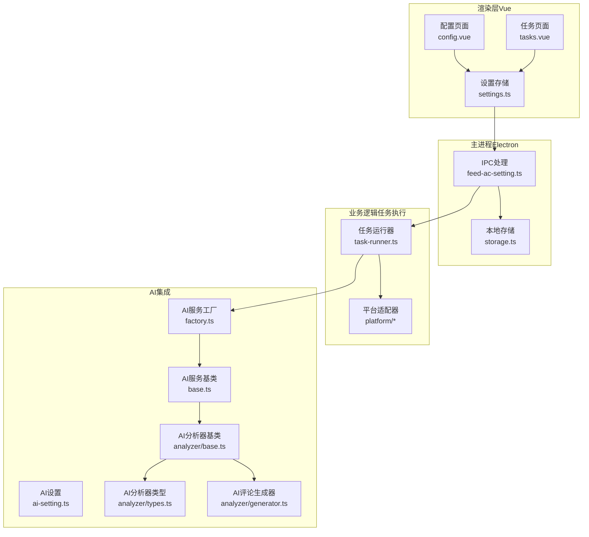
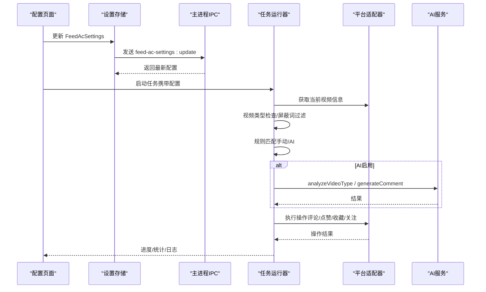
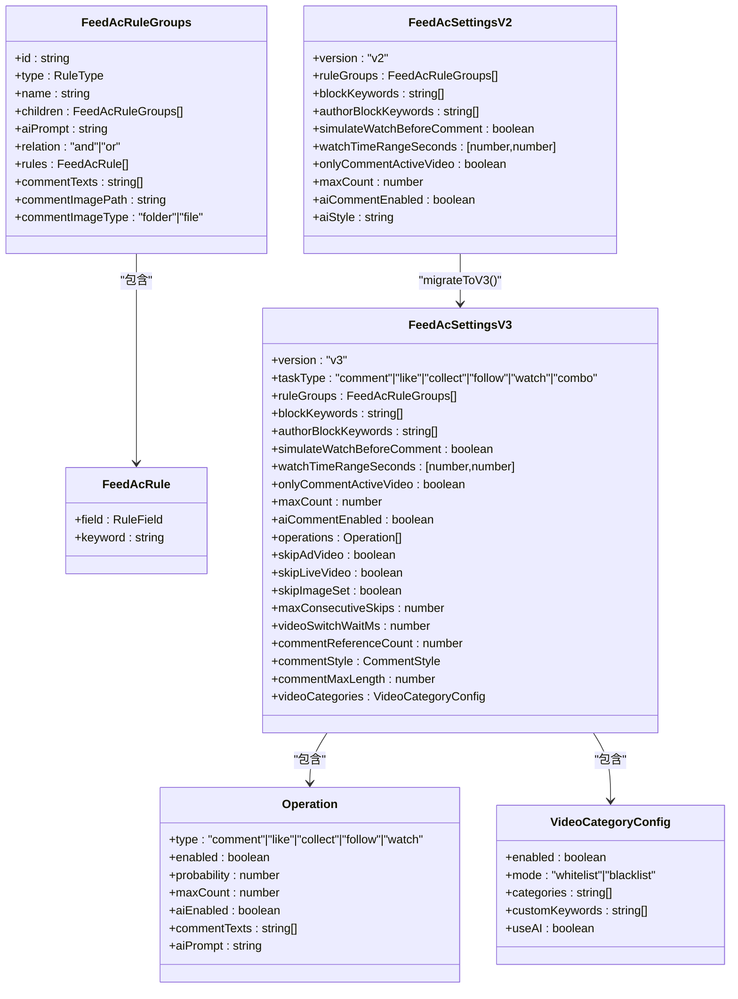
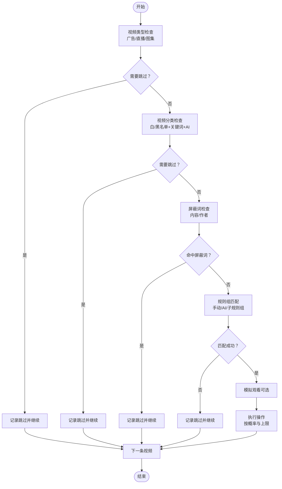
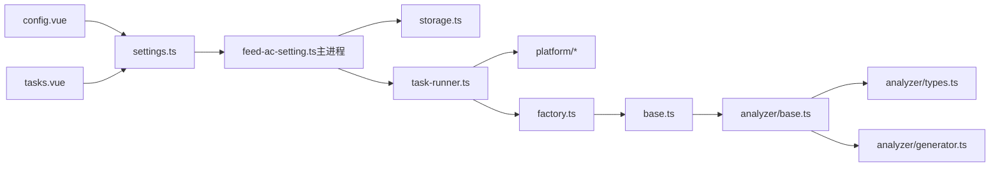

# 筛选规则模型

<cite>
**本文引用的文件**
- [feed-ac-setting.ts](file://src/shared/feed-ac-setting.ts)
- [feed-ac-setting.ts（主进程IPC）](file://src/main/ipc/feed-ac-setting.ts)
- [settings.ts（设置存储）](file://src/renderer/src/stores/settings.ts)
- [task-runner.ts（任务运行器）](file://src/main/service/task-runner.ts)
- [ai-setting.ts（AI设置）](file://src/shared/ai-setting.ts)
- [factory.ts（AI服务工厂）](file://src/main/integration/ai/factory.ts)
- [base.ts（AI服务基类）](file://src/main/integration/ai/base.ts)
- [analyzer/base.ts（AI分析器基类）](file://src/main/integration/ai/analyzer/base.ts)
- [analyzer/types.ts（AI分析器类型）](file://src/main/integration/ai/analyzer/types.ts)
- [analyzer/generator.ts（AI评论生成器）](file://src/main/integration/ai/analyzer/generator.ts)
- [storage.ts（存储工具）](file://src/main/utils/storage.ts)
- [config.vue（配置页面）](file://src/renderer/src/pages/config.vue)
- [tasks.vue（任务页面）](file://src/renderer/src/pages/tasks.vue)
</cite>

## 目录
1. [简介](#简介)
2. [项目结构](#项目结构)
3. [核心组件](#核心组件)
4. [架构总览](#架构总览)
5. [详细组件分析](#详细组件分析)
6. [依赖关系分析](#依赖关系分析)
7. [性能考量](#性能考量)
8. [故障排查指南](#故障排查指南)
9. [结论](#结论)
10. [附录](#附录)

## 简介
本文件系统性阐述 AutoOps 中“内容筛选与自动操作”的数据结构设计与实现机制，重点围绕 FeedAcSettings 接口及其版本演进、规则引擎工作流、手动规则与 AI 规则的配置结构、屏蔽词过滤、内容分类与智能匹配、AI 评论生成、以及规则测试与批量应用的最佳实践。文档同时提供面向非技术读者的可读性说明，并通过可视化图表展示关键流程与数据结构。

## 项目结构
AutoOps 的筛选规则模型横跨前端渲染层、主进程 IPC 层、任务执行层与 AI 集成层，形成“配置-校验-执行-反馈”的闭环。

图表来源
- [config.vue:1-200](file://src/renderer/src/pages/config.vue#L1-L200)
- [tasks.vue:1-200](file://src/renderer/src/pages/tasks.vue#L1-L200)
- [settings.ts:1-46](file://src/renderer/src/stores/settings.ts#L1-L46)
- [feed-ac-setting.ts（主进程IPC）:1-44](file://src/main/ipc/feed-ac-setting.ts#L1-L44)
- [storage.ts:1-46](file://src/main/utils/storage.ts#L1-L46)
- [task-runner.ts:1-200](file://src/main/service/task-runner.ts#L1-L200)
- [factory.ts:1-27](file://src/main/integration/ai/factory.ts#L1-L27)
- [base.ts:1-46](file://src/main/integration/ai/base.ts#L1-L46)
- [analyzer/base.ts:1-182](file://src/main/integration/ai/analyzer/base.ts#L1-L182)
- [analyzer/types.ts:1-72](file://src/main/integration/ai/analyzer/types.ts#L1-L72)
- [analyzer/generator.ts:1-108](file://src/main/integration/ai/analyzer/generator.ts#L1-L108)

章节来源
- [config.vue:1-200](file://src/renderer/src/pages/config.vue#L1-L200)
- [tasks.vue:1-200](file://src/renderer/src/pages/tasks.vue#L1-L200)
- [settings.ts:1-46](file://src/renderer/src/stores/settings.ts#L1-L46)
- [feed-ac-setting.ts（主进程IPC）:1-44](file://src/main/ipc/feed-ac-setting.ts#L1-L44)
- [storage.ts:1-46](file://src/main/utils/storage.ts#L1-L46)
- [task-runner.ts:1-200](file://src/main/service/task-runner.ts#L1-L200)
- [factory.ts:1-27](file://src/main/integration/ai/factory.ts#L1-L27)
- [base.ts:1-46](file://src/main/integration/ai/base.ts#L1-L46)
- [analyzer/base.ts:1-182](file://src/main/integration/ai/analyzer/base.ts#L1-L182)
- [analyzer/types.ts:1-72](file://src/main/integration/ai/analyzer/types.ts#L1-L72)
- [analyzer/generator.ts:1-108](file://src/main/integration/ai/analyzer/generator.ts#L1-L108)

## 核心组件
- 数据模型与版本演进
  - FeedAcSettingsV2/V3：统一的筛选与自动操作配置对象，包含规则组、屏蔽词、视频分类、操作集合等。
  - 默认值与迁移：提供默认配置与从 V2 到 V3 的平滑迁移逻辑。
- 规则引擎
  - 手动规则：基于字段（昵称、视频描述、标签）与关键词的布尔组合（AND/OR）。
  - AI 规则：基于自定义提示词与 AI 分析结果的智能匹配。
- 内容分类与智能匹配
  - 支持白名单/黑名单模式、关键词匹配与 AI 分析。
- AI 评论生成
  - 基于热门评论参考、视频分析与评论风格的生成器。
- 存储与IPC
  - 通过 Electron Store 持久化，主进程提供 get/update/reset/import/export 接口。
- 任务执行
  - 任务运行器按配置循环抓取视频、执行类型检查、屏蔽词过滤、规则匹配、操作执行与日志记录。

章节来源
- [feed-ac-setting.ts:22-97](file://src/shared/feed-ac-setting.ts#L22-L97)
- [feed-ac-setting.ts:101-178](file://src/shared/feed-ac-setting.ts#L101-L178)
- [feed-ac-setting.ts（主进程IPC）:10-44](file://src/main/ipc/feed-ac-setting.ts#L10-L44)
- [task-runner.ts:420-580](file://src/main/service/task-runner.ts#L420-L580)
- [analyzer/base.ts:1-182](file://src/main/integration/ai/analyzer/base.ts#L1-L182)
- [analyzer/generator.ts:1-108](file://src/main/integration/ai/analyzer/generator.ts#L1-L108)

## 架构总览
筛选规则模型的端到端流程如下：

图表来源
- [config.vue:48-56](file://src/renderer/src/pages/config.vue#L48-L56)
- [settings.ts:12-22](file://src/renderer/src/stores/settings.ts#L12-L22)
- [feed-ac-setting.ts（主进程IPC）:16-43](file://src/main/ipc/feed-ac-setting.ts#L16-L43)
- [task-runner.ts:235-371](file://src/main/service/task-runner.ts#L235-L371)
- [factory.ts:16-25](file://src/main/integration/ai/factory.ts#L16-L25)

## 详细组件分析

### 数据模型与版本演进
- 关键类型
  - RuleField：筛选字段枚举（昵称、视频描述、视频标签）
  - RuleType：规则类型（手动/ai）
  - FeedAcRule：单条规则（字段+关键词）
  - FeedAcRuleGroups：规则组（含子规则组、AI提示词、关系运算符、评论文本等）
  - FeedAcSettingsV2/V3：配置对象，包含规则组、屏蔽词、视频分类、操作集合等
- 版本演进
  - V2：以 ruleGroups 为中心，支持 AI 评论开关
  - V3：引入 operations 数组、任务类型、视频分类配置、跳过策略、AI 评论参数等
  - 迁移：将 V2 的规则组评论与 AI 开关迁移到 V3 的 operations，并填充默认值
- 默认值与工具函数
  - getDefaultFeedAcSettings/getDefaultFeedAcSettingsV3 提供初始配置
  - migrateToV3 完成结构迁移
  - generateRuleGroupId 用于生成唯一规则组 ID

图表来源
- [feed-ac-setting.ts:4-97](file://src/shared/feed-ac-setting.ts#L4-L97)
- [feed-ac-setting.ts:148-178](file://src/shared/feed-ac-setting.ts#L148-L178)

章节来源
- [feed-ac-setting.ts:4-97](file://src/shared/feed-ac-setting.ts#L4-L97)
- [feed-ac-setting.ts:101-178](file://src/shared/feed-ac-setting.ts#L101-L178)

### 规则引擎工作机制
- 匹配顺序
  1) 视频类型检查（广告/直播/图集）
  2) 视频分类检查（白/黑名单 + 关键词 + AI）
  3) 屏蔽词检查（内容/作者）
  4) 规则组匹配（手动/AI/子规则组）
  5) 模拟观看（可选）
  6) 执行操作（按概率与上限）
- 手动规则
  - 字段匹配：昵称、视频描述、标签
  - 关系运算：AND/OR 控制多规则组合
  - 子规则组：支持嵌套，逐层匹配
- AI 规则
  - 使用 AI 服务对视频信息进行“是否观看”分析
  - 支持自定义提示词与异常回退
- 评论策略
  - AI 评论：可参考热门评论、指定风格与长度
  - 备选评论：AI 失败时回退到预设评论列表

图表来源
- [task-runner.ts:276-352](file://src/main/service/task-runner.ts#L276-L352)
- [task-runner.ts:423-559](file://src/main/service/task-runner.ts#L423-L559)

章节来源
- [task-runner.ts:276-352](file://src/main/service/task-runner.ts#L276-L352)
- [task-runner.ts:423-559](file://src/main/service/task-runner.ts#L423-L559)

### 屏蔽词过滤与内容分类
- 屏蔽词
  - blockKeywords：视频描述中的关键词命中即跳过
  - authorBlockKeywords：作者昵称命中即跳过
- 内容分类
  - 白名单：仅接受匹配分类或关键词的视频
  - 黑名单：排除匹配分类或关键词的视频
  - 关键词匹配：结合视频标签与描述
  - AI 分析：当关键词未命中且启用 AI 时，调用 AI 服务进行二次判断

章节来源
- [task-runner.ts:489-501](file://src/main/service/task-runner.ts#L489-L501)
- [task-runner.ts:453-482](file://src/main/service/task-runner.ts#L453-L482)
- [feed-ac-setting.ts:38-60](file://src/shared/feed-ac-setting.ts#L38-L60)

### AI 规则与智能匹配
- AI 规则
  - 使用 AI 服务的 analyzeVideoType 对视频信息进行“是否观看”判断
  - 支持自定义提示词，失败时回退
- AI 评论
  - 可获取热门评论作为上下文
  - 支持风格、长度、自定义提示词
  - 失败时回退到预设评论

章节来源
- [task-runner.ts:522-536](file://src/main/service/task-runner.ts#L522-L536)
- [task-runner.ts:614-679](file://src/main/service/task-runner.ts#L614-L679)
- [factory.ts:16-25](file://src/main/integration/ai/factory.ts#L16-L25)
- [base.ts:23-26](file://src/main/integration/ai/base.ts#L23-L26)

### 操作执行与组合策略
- 单任务模式：按任务类型执行对应操作
- 组合模式：遍历 operations，按 enabled/probability/maxCount 执行，支持首次成功即停止

章节来源
- [task-runner.ts:561-590](file://src/main/service/task-runner.ts#L561-L590)

### 配置界面与实际示例
- 配置页面（V2/V3）
  - 支持添加/删除规则组、设置规则类型（手动/AI）、评论内容、屏蔽词等
  - V3 页面新增视频分类、跳过策略、AI 评论参数等
- 实际配置示例（概念性说明）
  - 多条件组合：规则组 A（AND：包含“美食”标签 AND 包含“烹饪”描述），规则组 B（OR：包含“旅行”标签 OR 包含“风景”关键词）
  - 优先级设置：按规则组顺序依次匹配，先匹配者生效
  - 动态调整：通过 UI 修改配置后立即生效（IPC 更新后由任务运行器读取）

章节来源
- [config.vue:169-221](file://src/renderer/src/pages/config.vue#L169-L221)
- [tasks.vue:593-648](file://src/renderer/src/pages/tasks.vue#L593-L648)

## 依赖关系分析
- 渲染层依赖
  - settings.ts 通过 window.api 访问主进程 IPC 接口
  - config.vue/tasks.vue 负责配置编辑与保存
- 主进程依赖
  - feed-ac-setting.ts 提供 get/update/reset/import/export
  - storage.ts 提供持久化
- 任务执行依赖
  - task-runner.ts 依赖平台适配器与 AI 服务
  - feed-ac-setting.ts 提供数据模型与默认值
- AI 集成依赖
  - factory.ts 根据平台创建具体 AI 服务
  - analyzer/base.ts 提供分析器抽象与默认实现
  - analyzer/generator.ts 提供评论生成器

图表来源
- [settings.ts:12-22](file://src/renderer/src/stores/settings.ts#L12-L22)
- [feed-ac-setting.ts（主进程IPC）:16-43](file://src/main/ipc/feed-ac-setting.ts#L16-L43)
- [storage.ts:14-25](file://src/main/utils/storage.ts#L14-L25)
- [task-runner.ts:96-103](file://src/main/service/task-runner.ts#L96-L103)
- [factory.ts:16-25](file://src/main/integration/ai/factory.ts#L16-L25)
- [analyzer/base.ts:1-182](file://src/main/integration/ai/analyzer/base.ts#L1-L182)
- [analyzer/types.ts:1-72](file://src/main/integration/ai/analyzer/types.ts#L1-L72)
- [analyzer/generator.ts:1-108](file://src/main/integration/ai/analyzer/generator.ts#L1-L108)

章节来源
- [settings.ts:12-22](file://src/renderer/src/stores/settings.ts#L12-L22)
- [feed-ac-setting.ts（主进程IPC）:16-43](file://src/main/ipc/feed-ac-setting.ts#L16-L43)
- [storage.ts:14-25](file://src/main/utils/storage.ts#L14-L25)
- [task-runner.ts:96-103](file://src/main/service/task-runner.ts#L96-L103)
- [factory.ts:16-25](file://src/main/integration/ai/factory.ts#L16-L25)
- [analyzer/base.ts:1-182](file://src/main/integration/ai/analyzer/base.ts#L1-L182)
- [analyzer/types.ts:1-72](file://src/main/integration/ai/analyzer/types.ts#L1-L72)
- [analyzer/generator.ts:1-108](file://src/main/integration/ai/analyzer/generator.ts#L1-L108)

## 性能考量
- 规则匹配复杂度
  - 手动规则：线性扫描规则数组，复杂度 O(N)，N 为规则数量
  - AI 规则：每次调用一次外部 API，需考虑网络延迟与重试
- 缓存与去抖
  - 任务运行器缓存视频数据，减少重复请求
  - 适当增加视频切换等待时间，降低平台风控风险
- 并发与资源
  - 多任务并行时共享 BrowserContext，减少内存占用
  - 合理设置最大连续跳过阈值，避免长时间空转
- AI 服务
  - 限制热门评论获取数量与生成器长度，平衡质量与性能
  - 失败回退策略确保稳定性

[本节为通用性能指导，无需特定文件引用]

## 故障排查指南
- 配置加载失败
  - 检查 IPC 接口是否正确注册与调用
  - 确认存储键名一致（FEED_AC_SETTINGS）
- 规则不生效
  - 确认规则组顺序与关系（AND/OR）
  - 检查关键词大小写与全角半角差异
- AI 分析异常
  - 核对 AI 平台与模型配置
  - 检查 API Key 与网络连通性
- 评论生成失败
  - 回退到预设评论列表
  - 调整风格与长度参数
- 任务卡顿或频繁跳过
  - 增加视频切换等待时间
  - 调整最大连续跳过阈值

章节来源
- [feed-ac-setting.ts（主进程IPC）:16-43](file://src/main/ipc/feed-ac-setting.ts#L16-L43)
- [storage.ts:29-38](file://src/main/utils/storage.ts#L29-L38)
- [task-runner.ts:489-501](file://src/main/service/task-runner.ts#L489-L501)
- [task-runner.ts:667-670](file://src/main/service/task-runner.ts#L667-L670)

## 结论
AutoOps 的筛选规则模型通过清晰的数据结构与严格的执行流程，实现了从“内容筛选”到“自动操作”的完整闭环。V3 版本在 V2 基础上增强了操作灵活性、视频分类能力与 AI 评论生成，配合 IPC 与存储层的解耦设计，既保证了易用性也兼顾了扩展性。建议在生产环境中结合实际场景持续迭代规则组与 AI 提示词，并通过日志与统计指标进行效果评估与优化。

[本节为总结性内容，无需特定文件引用]

## 附录

### 规则测试与效果评估最佳实践
- 规则测试
  - 使用小规模样本验证规则组组合与关系
  - 对比手动规则与 AI 规则的命中率与误判率
- 效果评估
  - 统计命中率、跳过率、操作成功率与平均观看时长
  - 对比不同规则组的收益指标
- 批量应用
  - 通过模板与导入导出功能快速复制配置
  - 在任务页面批量创建与启动任务

[本节为通用实践建议，无需特定文件引用]