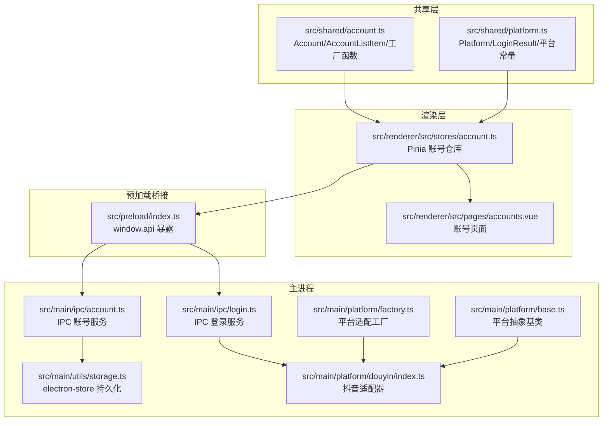
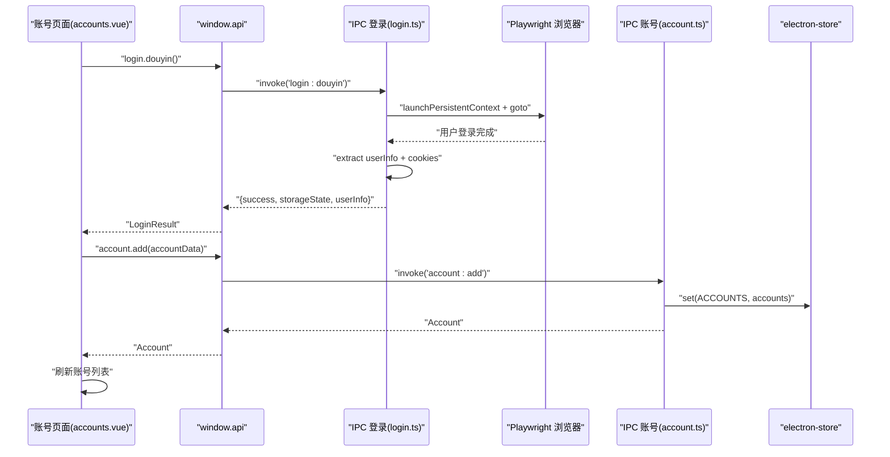
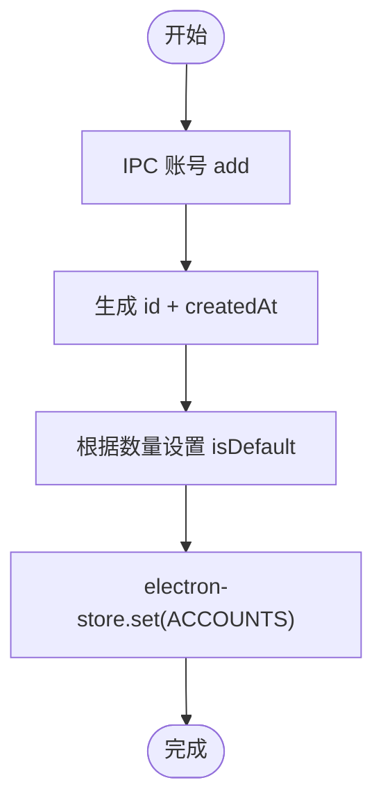
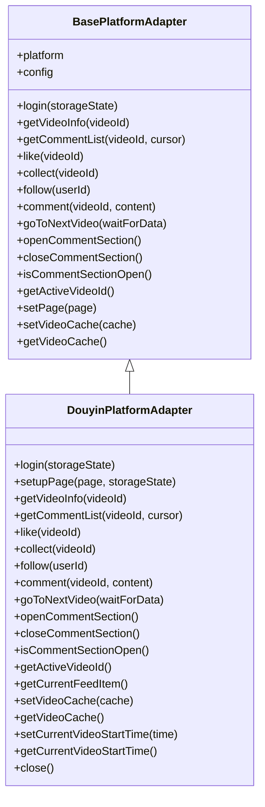
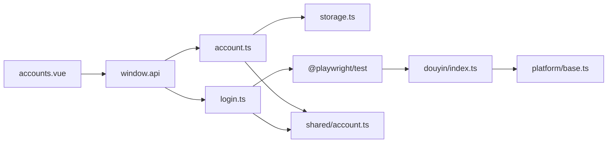

# 账号模型

<cite>
**本文引用的文件**
- [src/shared/account.ts](file://src/shared/account.ts)
- [src/shared/platform.ts](file://src/shared/platform.ts)
- [src/renderer/src/stores/account.ts](file://src/renderer/src/stores/account.ts)
- [src/main/ipc/account.ts](file://src/main/ipc/account.ts)
- [src/main/ipc/login.ts](file://src/main/ipc/login.ts)
- [src/main/platform/base.ts](file://src/main/platform/base.ts)
- [src/main/platform/factory.ts](file://src/main/platform/factory.ts)
- [src/main/platform/douyin/index.ts](file://src/main/platform/douyin/index.ts)
- [src/main/utils/storage.ts](file://src/main/utils/storage.ts)
- [src/preload/index.ts](file://src/preload/index.ts)
- [src/renderer/src/pages/accounts.vue](file://src/renderer/src/pages/accounts.vue)
</cite>

## 目录
1. [简介](#简介)
2. [项目结构](#项目结构)
3. [核心组件](#核心组件)
4. [架构总览](#架构总览)
5. [详细组件分析](#详细组件分析)
6. [依赖关系分析](#依赖关系分析)
7. [性能考量](#性能考量)
8. [故障排查指南](#故障排查指南)
9. [结论](#结论)
10. [附录](#附录)

## 简介
本文件系统性阐述 AutoOps 中“账号模型”的数据结构与运行机制，重点覆盖：
- Account 接口字段定义与用途
- LoginResult 登录结果结构与错误处理
- 账号存储机制、认证数据持久化与会话管理
- 多平台账号配置、切换与状态同步
- 自动登录流程、安全验证与最佳实践
- 账号导入导出与批量管理的安全建议

## 项目结构
AutoOps 的账号模型横跨共享层、主进程、渲染层与平台适配层，形成“共享数据结构 + IPC 交互 + 平台适配 + 存储持久化”的分层架构。

图表来源
- [src/shared/account.ts:1-39](file://src/shared/account.ts#L1-L39)
- [src/shared/platform.ts:1-260](file://src/shared/platform.ts#L1-L260)
- [src/renderer/src/stores/account.ts:1-82](file://src/renderer/src/stores/account.ts#L1-L82)
- [src/main/ipc/account.ts:1-101](file://src/main/ipc/account.ts#L1-L101)
- [src/main/ipc/login.ts:1-173](file://src/main/ipc/login.ts#L1-L173)
- [src/main/utils/storage.ts:1-46](file://src/main/utils/storage.ts#L1-L46)
- [src/main/platform/factory.ts:1-32](file://src/main/platform/factory.ts#L1-L32)
- [src/main/platform/base.ts:1-105](file://src/main/platform/base.ts#L1-L105)
- [src/main/platform/douyin/index.ts:1-507](file://src/main/platform/douyin/index.ts#L1-L507)
- [src/preload/index.ts:1-187](file://src/preload/index.ts#L1-L187)
- [src/renderer/src/pages/accounts.vue:1-203](file://src/renderer/src/pages/accounts.vue#L1-L203)

章节来源
- [src/shared/account.ts:1-39](file://src/shared/account.ts#L1-L39)
- [src/shared/platform.ts:1-260](file://src/shared/platform.ts#L1-L260)
- [src/renderer/src/stores/account.ts:1-82](file://src/renderer/src/stores/account.ts#L1-L82)
- [src/main/ipc/account.ts:1-101](file://src/main/ipc/account.ts#L1-L101)
- [src/main/ipc/login.ts:1-173](file://src/main/ipc/login.ts#L1-L173)
- [src/main/utils/storage.ts:1-46](file://src/main/utils/storage.ts#L1-L46)
- [src/main/platform/factory.ts:1-32](file://src/main/platform/factory.ts#L1-L32)
- [src/main/platform/base.ts:1-105](file://src/main/platform/base.ts#L1-L105)
- [src/main/platform/douyin/index.ts:1-507](file://src/main/platform/douyin/index.ts#L1-L507)
- [src/preload/index.ts:1-187](file://src/preload/index.ts#L1-L187)
- [src/renderer/src/pages/accounts.vue:1-203](file://src/renderer/src/pages/accounts.vue#L1-L203)

## 核心组件
- Account 数据模型：统一描述账号标识、平台、登录态、头像、创建时间、默认标记、状态与过期时间等。
- LoginResult 结构：封装登录成功与否、用户信息、存储状态与错误信息。
- 账号仓库（Pinia）：维护当前账号、默认账号、列表与 CRUD 操作。
- IPC 账号服务：提供 list/add/update/delete/setDefault/getDefault/getById/getByPlatform/getActiveAccounts 等接口。
- IPC 登录服务：负责打开浏览器、等待用户登录、提取用户信息与 cookies，生成 storageState。
- 存储层：基于 electron-store 的键值存储，集中存放 accounts、auth、tasks 等。
- 平台适配：抽象基类定义登录、操作接口；具体平台适配器实现登录与业务操作。
- 预加载桥接：将 IPC 能力暴露给渲染进程，形成 window.api。

章节来源
- [src/shared/account.ts:3-15](file://src/shared/account.ts#L3-L15)
- [src/shared/platform.ts:202-211](file://src/shared/platform.ts#L202-L211)
- [src/renderer/src/stores/account.ts:14-81](file://src/renderer/src/stores/account.ts#L14-L81)
- [src/main/ipc/account.ts:32-100](file://src/main/ipc/account.ts#L32-L100)
- [src/main/ipc/login.ts:17-172](file://src/main/ipc/login.ts#L17-L172)
- [src/main/utils/storage.ts:29-46](file://src/main/utils/storage.ts#L29-L46)
- [src/main/platform/base.ts:24-80](file://src/main/platform/base.ts#L24-L80)
- [src/preload/index.ts:37-50](file://src/preload/index.ts#L37-L50)

## 架构总览
账号模型的端到端流程如下：
- 用户在渲染层发起“添加账号”操作
- 渲染层调用 window.api.login.douyin 打开浏览器进行登录
- 主进程使用 Playwright 启动上下文，等待用户登录完成
- 提取用户信息与 cookies，生成 storageState 返回
- 渲染层将 storageState 写入 Pinia 账号仓库，并通过 window.api.account.add 持久化
- 主进程 IPC 将账户写入 electron-store，完成账号入库

图表来源
- [src/renderer/src/pages/accounts.vue:62-95](file://src/renderer/src/pages/accounts.vue#L62-L95)
- [src/preload/index.ts:148-150](file://src/preload/index.ts#L148-L150)
- [src/main/ipc/login.ts:17-172](file://src/main/ipc/login.ts#L17-L172)
- [src/main/ipc/account.ts:32-49](file://src/main/ipc/account.ts#L32-L49)
- [src/main/utils/storage.ts:29-46](file://src/main/utils/storage.ts#L29-L46)

## 详细组件分析

### Account 接口字段定义
- id：全局唯一账号标识，用于区分不同账号实例
- name：显示名称，通常来自登录后的用户昵称
- platform：所属平台标识，如 'douyin'/'kuaishou'/'xiaohongshu'
- platformAccountId：平台侧用户标识（可选）
- avatar：头像地址（可选）
- storageState：浏览器上下文存储状态，用于后续复用登录态
- cookies：平台 cookies（可选），与 storageState 对应
- createdAt：创建时间戳
- isDefault：是否为默认账号
- status：账号状态，支持 'active'/'inactive'/'expired'
- expiresAt：过期时间戳（可选）

字段复杂度与约束
- 基本字段均为字符串或数值，便于序列化与持久化
- storageState 作为未知类型，由平台适配器生成，确保跨平台兼容
- cookies 与 storageState 互为补充，前者更直观，后者更完整

章节来源
- [src/shared/account.ts:3-15](file://src/shared/account.ts#L3-L15)

### LoginResult 接口结构
- success：布尔值，指示登录是否成功
- userInfo：包含 nickname、avatar、uid（抖音适配器中 uid 为空占位）
- storageState：浏览器上下文存储对象（JSON 字符串形式返回）
- error：错误信息（可选）

登录流程要点
- 成功后返回 storageState，可用于后续平台适配器复用登录态
- 失败时返回 error，前端可据此提示用户

章节来源
- [src/shared/platform.ts:202-211](file://src/shared/platform.ts#L202-L211)
- [src/main/ipc/login.ts:6-15](file://src/main/ipc/login.ts#L6-L15)
- [src/main/platform/douyin/index.ts:69-105](file://src/main/platform/douyin/index.ts#L69-L105)

### 账号存储机制与会话管理
- 存储位置：electron-store，键为 ACCOUNTS
- 写入时机：新增账号时由 IPC 账号服务写入
- 读取时机：渲染层通过 window.api.account.list 获取
- 会话复用：平台适配器 login 方法接收 storageState，创建带存储状态的浏览器上下文

图表来源
- [src/main/ipc/account.ts:37-49](file://src/main/ipc/account.ts#L37-L49)
- [src/main/utils/storage.ts:29-46](file://src/main/utils/storage.ts#L29-L46)

章节来源
- [src/main/ipc/account.ts:20-26](file://src/main/ipc/account.ts#L20-L26)
- [src/main/ipc/account.ts:32-100](file://src/main/ipc/account.ts#L32-L100)
- [src/main/utils/storage.ts:14-25](file://src/main/utils/storage.ts#L14-L25)

### 认证数据加密与安全考虑
- cookies 与 storageState：主进程在登录完成后收集 cookies 并打包为 storageState 返回，避免明文长期保存
- 浏览器上下文：使用 Playwright 的 persistent context，登录态仅存在于内存与临时目录，关闭后销毁
- 安全建议：
  - 不要在应用内明文存储敏感字段
  - 使用临时目录存放登录上下文，避免污染用户本地数据
  - 在生产环境限制浏览器执行路径，防止被篡改

章节来源
- [src/main/ipc/login.ts:28-39](file://src/main/ipc/login.ts#L28-L39)
- [src/main/ipc/login.ts:135-149](file://src/main/ipc/login.ts#L135-L149)
- [src/main/platform/douyin/index.ts:69-105](file://src/main/platform/douyin/index.ts#L69-L105)

### 账号配置与多平台支持
- 平台枚举与配置：共享层定义平台类型与平台配置常量
- 适配器工厂：根据平台选择对应适配器实例
- 抽象基类：定义 login、操作接口与日志事件，确保各平台行为一致

图表来源
- [src/main/platform/base.ts:24-80](file://src/main/platform/base.ts#L24-L80)
- [src/main/platform/douyin/index.ts:56-507](file://src/main/platform/douyin/index.ts#L56-L507)

章节来源
- [src/shared/platform.ts:1-51](file://src/shared/platform.ts#L1-L51)
- [src/shared/platform.ts:88-200](file://src/shared/platform.ts#L88-L200)
- [src/main/platform/factory.ts:7-18](file://src/main/platform/factory.ts#L7-L18)
- [src/main/platform/base.ts:24-80](file://src/main/platform/base.ts#L24-L80)

### 账号状态同步、自动登录与安全验证
- 状态同步：渲染层通过 Pinia 维护 currentAccount/defaultAccount，主进程通过 IPC 提供查询接口
- 自动登录：平台适配器 login 使用 storageState 创建上下文，若已登录则直接返回用户信息与新的 storageState
- 安全验证：登录过程中检测登录面板消失，判断登录成功；同时监控验证码弹窗，必要时等待用户完成验证

章节来源
- [src/renderer/src/stores/account.ts:18-24](file://src/renderer/src/stores/account.ts#L18-L24)
- [src/main/ipc/account.ts:81-89](file://src/main/ipc/account.ts#L81-L89)
- [src/main/platform/douyin/index.ts:69-105](file://src/main/platform/douyin/index.ts#L69-L105)
- [src/main/platform/douyin/index.ts:335-342](file://src/main/platform/douyin/index.ts#L335-L342)

### 账号导入导出与批量管理
- 导入导出：当前仓库未提供专用的账号导入导出功能。可通过以下方式间接实现：
  - 导出：从 electron-store 的 ACCOUNTS 键读取数据，手动备份
  - 导入：将备份数据写回 ACCOUNTS 键，重启应用后生效
- 批量管理：通过 IPC 提供的 list/getByPlatform/getActiveAccounts 等接口，结合前端表格进行批量操作
- 安全建议：
  - 导出数据需脱敏，避免泄露 cookies 与 storageState
  - 导入前校验数据结构与完整性
  - 建议在离线环境下进行导入，避免网络干扰

章节来源
- [src/main/ipc/account.ts:91-99](file://src/main/ipc/account.ts#L91-L99)
- [src/main/utils/storage.ts:29-46](file://src/main/utils/storage.ts#L29-L46)
- [src/renderer/src/pages/accounts.vue:118-193](file://src/renderer/src/pages/accounts.vue#L118-L193)

## 依赖关系分析
- 渲染层依赖预加载桥接暴露的 window.api，进而调用主进程 IPC
- 主进程 IPC 依赖 electron-store 进行持久化
- 平台适配器依赖 Playwright 进行自动化操作
- 共享层提供跨层通用的数据结构与平台常量

图表来源
- [src/renderer/src/pages/accounts.vue:1-203](file://src/renderer/src/pages/accounts.vue#L1-L203)
- [src/preload/index.ts:1-187](file://src/preload/index.ts#L1-L187)
- [src/main/ipc/account.ts:1-101](file://src/main/ipc/account.ts#L1-L101)
- [src/main/ipc/login.ts:1-173](file://src/main/ipc/login.ts#L1-L173)
- [src/main/utils/storage.ts:1-46](file://src/main/utils/storage.ts#L1-L46)
- [src/shared/account.ts:1-39](file://src/shared/account.ts#L1-L39)
- [src/main/platform/douyin/index.ts:1-507](file://src/main/platform/douyin/index.ts#L1-L507)
- [src/main/platform/base.ts:1-105](file://src/main/platform/base.ts#L1-L105)

章节来源
- [src/preload/index.ts:37-50](file://src/preload/index.ts#L37-L50)
- [src/main/ipc/account.ts:1-101](file://src/main/ipc/account.ts#L1-L101)
- [src/main/ipc/login.ts:1-173](file://src/main/ipc/login.ts#L1-L173)
- [src/main/utils/storage.ts:1-46](file://src/main/utils/storage.ts#L1-L46)
- [src/shared/account.ts:1-39](file://src/shared/account.ts#L1-L39)
- [src/main/platform/douyin/index.ts:1-507](file://src/main/platform/douyin/index.ts#L1-L507)
- [src/main/platform/base.ts:1-105](file://src/main/platform/base.ts#L1-L105)

## 性能考量
- 登录态复用：通过 storageState 减少重复登录成本
- 缓存策略：平台适配器内部缓存视频数据，降低重复请求
- 异步等待：对网络响应与 DOM 变化采用超时与重试策略，避免阻塞
- 批量操作：前端表格支持批量设置默认账号与删除，减少多次 IPC 调用

## 故障排查指南
- 登录失败
  - 检查浏览器执行路径是否配置正确
  - 确认网络连通性与抖音登录页可达
  - 查看主进程日志，定位 URL 等待超时或用户取消
- 账号无法保存
  - 检查 IPC 账号 add 是否抛出异常
  - 核对 electron-store 写入是否成功
- 账号状态异常
  - 使用 getActiveAccounts 或 getByPlatform 查询状态
  - 确认 isDefault 标记是否正确

章节来源
- [src/main/ipc/login.ts:17-23](file://src/main/ipc/login.ts#L17-L23)
- [src/main/ipc/account.ts:51-60](file://src/main/ipc/account.ts#L51-L60)
- [src/main/ipc/account.ts:96-99](file://src/main/ipc/account.ts#L96-L99)

## 结论
AutoOps 的账号模型以共享数据结构为核心，结合 IPC 与平台适配器实现了跨平台、可扩展的账号管理能力。通过 storageState 实现登录态复用，借助 electron-store 完成持久化，配合 Pinia 提供的仓库模式，使账号的增删改查、默认账号切换与状态同步变得简单可靠。未来可在现有基础上增强账号导入导出与批量管理能力，并进一步强化安全与审计机制。

## 附录
- 多平台账号配置方式
  - 在渲染层通过 window.api.account.getByPlatform 获取指定平台账号列表
  - 在主进程通过 IPC account.getByPlatform 实现筛选
- 切换机制
  - 设置默认账号：window.api.account.setDefault
  - 当前账号：Pinia 计算属性 currentAccount/currentAccountId
- 安全验证
  - 登录成功后检测登录面板消失与验证码弹窗
  - 关闭时持久化 storageState，避免泄露

章节来源
- [src/main/ipc/account.ts:91-94](file://src/main/ipc/account.ts#L91-L94)
- [src/renderer/src/stores/account.ts:18-24](file://src/renderer/src/stores/account.ts#L18-L24)
- [src/main/platform/douyin/index.ts:82-105](file://src/main/platform/douyin/index.ts#L82-L105)
- [src/main/platform/douyin/index.ts:335-342](file://src/main/platform/douyin/index.ts#L335-L342)