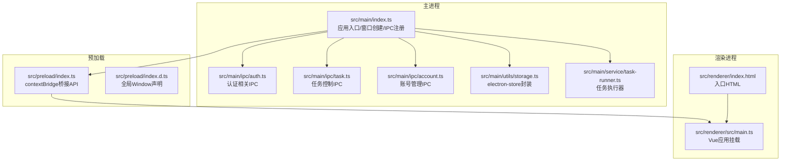
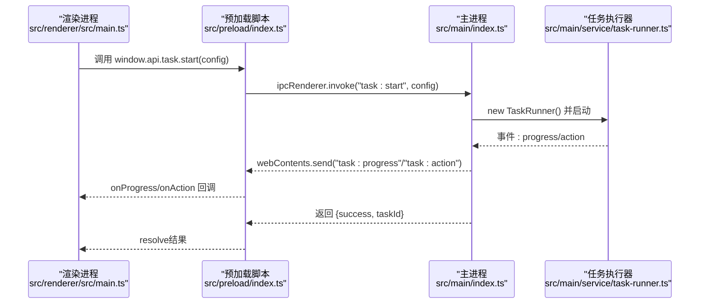
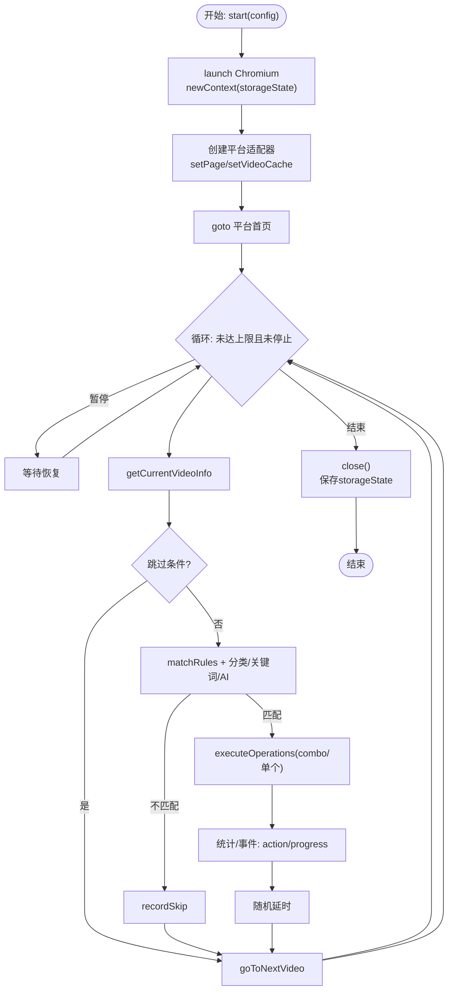
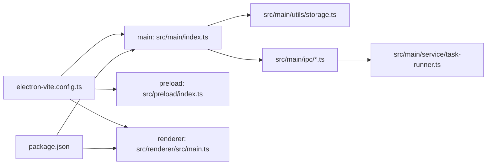

# Electron架构设计

<cite>
**本文引用的文件**
- [src/main/index.ts](file://src/main/index.ts)
- [src/preload/index.ts](file://src/preload/index.ts)
- [src/preload/index.d.ts](file://src/preload/index.d.ts)
- [src/renderer/index.html](file://src/renderer/index.html)
- [src/renderer/src/main.ts](file://src/renderer/src/main.ts)
- [electron.vite.config.ts](file://electron.vite.config.ts)
- [package.json](file://package.json)
- [src/main/ipc/auth.ts](file://src/main/ipc/auth.ts)
- [src/main/ipc/task.ts](file://src/main/ipc/task.ts)
- [src/main/service/task-runner.ts](file://src/main/service/task-runner.ts)
- [src/main/utils/storage.ts](file://src/main/utils/storage.ts)
- [src/main/platform/base.ts](file://src/main/platform/base.ts)
- [src/shared/platform.ts](file://src/shared/platform.ts)
- [src/main/ipc/account.ts](file://src/main/ipc/account.ts)
</cite>

## 目录
1. [简介](#简介)
2. [项目结构](#项目结构)
3. [核心组件](#核心组件)
4. [架构总览](#架构总览)
5. [详细组件分析](#详细组件分析)
6. [依赖关系分析](#依赖关系分析)
7. [性能考虑](#性能考虑)
8. [故障排查指南](#故障排查指南)
9. [结论](#结论)
10. [附录](#附录)

## 简介
本文件面向AutoOps的Electron桌面应用，系统性阐述其主进程与渲染进程的职责划分、生命周期管理与安全隔离机制；详解预加载脚本如何通过contextBridge暴露受控API，并结合contextIsolation与nodeIntegration的安全配置；解析窗口管理、菜单系统与系统集成的设计模式；梳理应用启动流程、事件循环与资源管理策略；最后给出架构决策的技术考量、性能优化建议与安全最佳实践，并提供可定位到源码位置的示例路径。

## 项目结构
AutoOps采用典型的Electron三进程分层：
- 主进程负责应用生命周期、窗口创建、IPC注册、系统级能力调用与持久化存储。
- 预加载脚本负责在渲染上下文内注入安全的桥接API，限制渲染进程直接访问Node/Electron原生能力。
- 渲染进程承载UI与业务逻辑，通过IPC与主进程交互。

图表来源
- [src/main/index.ts:1-106](file://src/main/index.ts#L1-L106)
- [src/preload/index.ts:1-187](file://src/preload/index.ts#L1-L187)
- [src/preload/index.d.ts:1-7](file://src/preload/index.d.ts#L1-L7)
- [src/renderer/index.html:1-12](file://src/renderer/index.html#L1-L12)
- [src/renderer/src/main.ts:1-12](file://src/renderer/src/main.ts#L1-L12)
- [src/main/ipc/auth.ts:1-23](file://src/main/ipc/auth.ts#L1-L23)
- [src/main/ipc/task.ts:1-104](file://src/main/ipc/task.ts#L1-L104)
- [src/main/ipc/account.ts:1-101](file://src/main/ipc/account.ts#L1-L101)
- [src/main/utils/storage.ts:1-46](file://src/main/utils/storage.ts#L1-L46)
- [src/main/service/task-runner.ts:1-760](file://src/main/service/task-runner.ts#L1-L760)

章节来源
- [src/main/index.ts:1-106](file://src/main/index.ts#L1-L106)
- [electron.vite.config.ts:1-34](file://electron.vite.config.ts#L1-L34)
- [package.json:1-85](file://package.json#L1-L85)

## 核心组件
- 主进程入口与窗口创建
  - 创建BrowserWindow，设置webPreferences以启用contextIsolation并禁用nodeIntegration，加载预加载脚本与渲染页面。
  - 注册各类IPC处理器，初始化日志与应用ID。
- 预加载脚本
  - 使用contextBridge.exposeInMainWorld暴露受限API接口，统一通过ipcRenderer.invoke/on转发到主进程，避免渲染进程直接接触Node/Electron能力。
- 渲染进程
  - Vue应用在index.html中挂载，通过模块化入口初始化状态管理与路由。
- IPC与服务
  - 认证、任务、账号等模块均通过ipcMain.handle注册异步处理器，配合TaskRunner执行具体业务。

章节来源
- [src/main/index.ts:22-52](file://src/main/index.ts#L22-L52)
- [src/preload/index.ts:95-187](file://src/preload/index.ts#L95-L187)
- [src/renderer/src/main.ts:1-12](file://src/renderer/src/main.ts#L1-L12)
- [src/main/ipc/auth.ts:4-23](file://src/main/ipc/auth.ts#L4-L23)
- [src/main/ipc/task.ts:11-103](file://src/main/ipc/task.ts#L11-L103)
- [src/main/ipc/account.ts:32-101](file://src/main/ipc/account.ts#L32-L101)

## 架构总览
下图展示从渲染进程发起任务到主进程调度TaskRunner的端到端流程，以及预加载脚本在其中的桥接作用。

图表来源
- [src/renderer/src/main.ts:1-12](file://src/renderer/src/main.ts#L1-L12)
- [src/preload/index.ts:102-116](file://src/preload/index.ts#L102-L116)
- [src/main/index.ts:79-83](file://src/main/index.ts#L79-L83)
- [src/main/ipc/task.ts:11-103](file://src/main/ipc/task.ts#L11-L103)
- [src/main/service/task-runner.ts:55-113](file://src/main/service/task-runner.ts#L55-L113)

## 详细组件分析

### 主进程与窗口生命周期
- 窗口创建与安全配置
  - webPreferences中启用contextIsolation，禁用nodeIntegration，确保渲染进程无法直接访问Node API。
  - 设置preload脚本路径，保证预加载逻辑在渲染进程沙箱内先行注入。
  - ready-to-show时显示窗口，setWindowOpenHandler统一拦截外部链接打开行为。
- 应用生命周期
  - whenReady后注册所有IPC处理器，创建主窗口。
  - activate用于macOS场景重建窗口；window-all-closed时非Darwin平台退出应用。
  - 提供统一的日志接收通道，将渲染侧日志转发至主进程日志系统。

章节来源
- [src/main/index.ts:22-52](file://src/main/index.ts#L22-L52)
- [src/main/index.ts:54-90](file://src/main/index.ts#L54-L90)
- [src/main/index.ts:92-106](file://src/main/index.ts#L92-L106)

### 预加载脚本与安全隔离
- 暴露受控API
  - 通过contextBridge.exposeInMainWorld向渲染进程暴露有限方法集合，如auth、task、account、login、file-picker、task-history、task-detail、taskCRUD、task-template、debug等。
  - 所有调用均通过ipcRenderer.invoke或ipcRenderer.on转发到主进程，返回Promise或回调。
- 类型约束
  - 在index.d.ts中为Window对象声明api属性，确保TypeScript编译期安全。
- 安全要点
  - 渲染进程无法直接访问Node/Electron原生API，只能通过桥接方法与主进程通信。
  - 预加载脚本本身不暴露全局变量，仅在注入阶段建立桥接。

章节来源
- [src/preload/index.ts:3-93](file://src/preload/index.ts#L3-L93)
- [src/preload/index.ts:95-187](file://src/preload/index.ts#L95-L187)
- [src/preload/index.d.ts:1-7](file://src/preload/index.d.ts#L1-L7)

### 渲染进程与UI框架
- 入口HTML与应用挂载
  - index.html提供根节点与入口脚本，渲染进程通过src/main.ts创建并挂载Vue应用。
  - 初始化Pinia与路由，随后将应用挂载到DOM。
- 开发与构建
  - electron-vite配置区分main、preload、renderer三类构建目标，renderer使用Vite+Vue+TailwindCSS插件链。

章节来源
- [src/renderer/index.html:1-12](file://src/renderer/index.html#L1-L12)
- [src/renderer/src/main.ts:1-12](file://src/renderer/src/main.ts#L1-L12)
- [electron.vite.config.ts:6-34](file://electron.vite.config.ts#L6-L34)

### IPC与业务模块
- 认证模块
  - 主进程通过ipcMain.handle提供hasAuth/login/logout/getAuth接口，数据存储于electron-store。
- 任务模块
  - 主进程注册task:start/stop/status，内部创建TaskRunner并广播进度与动作事件。
  - TaskRunner基于Playwright驱动浏览器，适配多平台，支持AI辅助评论生成、规则匹配与操作执行。
- 账号模块
  - 提供账号列表、新增、更新、删除、设默认、查询、按平台筛选、获取活跃账号等接口。

章节来源
- [src/main/ipc/auth.ts:4-23](file://src/main/ipc/auth.ts#L4-L23)
- [src/main/ipc/task.ts:11-103](file://src/main/ipc/task.ts#L11-L103)
- [src/main/service/task-runner.ts:25-760](file://src/main/service/task-runner.ts#L25-L760)
- [src/main/ipc/account.ts:32-101](file://src/main/ipc/account.ts#L32-L101)

### 存储与配置
- electron-store封装
  - 统一键名枚举与默认值，提供get/set便捷函数，集中管理认证、设置、任务历史、账号、任务模板等数据。
- 平台与任务配置
  - shared/platform.ts定义平台常量、选择器、API端点与键盘快捷键，支撑多平台适配。

章节来源
- [src/main/utils/storage.ts:14-46](file://src/main/utils/storage.ts#L14-L46)
- [src/shared/platform.ts:18-200](file://src/shared/platform.ts#L18-L200)

### 任务执行器（TaskRunner）
- 角色与职责
  - 封装任务生命周期：启动、暂停、恢复、停止、关闭。
  - 基于Playwright创建浏览器实例与上下文，注入storageState实现登录态复用。
  - 监听平台Feed响应，缓存视频元数据，驱动规则匹配与操作执行。
- 关键流程
  - start/startWithContext：根据配置启动任务，创建适配器并导航至平台首页。
  - runTask：主循环，按规则与概率执行操作，统计完成数与操作计数。
  - close：保存storageState，释放页面与上下文资源。
- 事件与日志
  - 通过EventEmitter发布progress/action/stopped等事件，便于主进程广播给渲染进程。

图表来源
- [src/main/service/task-runner.ts:55-113](file://src/main/service/task-runner.ts#L55-L113)
- [src/main/service/task-runner.ts:235-371](file://src/main/service/task-runner.ts#L235-L371)
- [src/main/service/task-runner.ts:212-233](file://src/main/service/task-runner.ts#L212-L233)

章节来源
- [src/main/service/task-runner.ts:25-760](file://src/main/service/task-runner.ts#L25-L760)

### 平台适配器基类
- 抽象接口
  - 定义登录、获取视频信息、评论、点赞、收藏、关注、打开/关闭评论区、切换视频等抽象方法。
- 能力与缓存
  - 维护Page实例与视频缓存，提供日志事件输出，便于上层任务执行器统一处理。
- 设计意义
  - 将不同平台的差异封装在适配器内，任务执行器通过统一接口与平台交互，降低耦合。

章节来源
- [src/main/platform/base.ts:24-80](file://src/main/platform/base.ts#L24-L80)
- [src/shared/platform.ts:18-200](file://src/shared/platform.ts#L18-L200)

### 窗口管理与系统集成
- 窗口创建
  - 固定初始尺寸与最小尺寸，ready-to-show时显示，避免白屏。
- 外链处理
  - setWindowOpenHandler统一走shell.openExternal，拒绝在应用内打开外部链接。
- 应用ID与快捷键
  - 设置AppUserModelId，优化任务栏与Dock体验；optimizer.watchWindowShortcuts监听窗口快捷键。

章节来源
- [src/main/index.ts:22-52](file://src/main/index.ts#L22-L52)
- [src/main/index.ts:59-61](file://src/main/index.ts#L59-L61)

## 依赖关系分析
- 构建与打包
  - electron-vite区分main、preload、renderer三段构建，renderer使用Vite+Vue+TailwindCSS。
  - package.json定义主进程入口、跨平台构建目标与安装后钩子。
- 运行时依赖
  - electron-store用于本地持久化；electron-log用于日志；@playwright/test用于任务执行；Vue生态用于渲染层。

图表来源
- [electron.vite.config.ts:6-34](file://electron.vite.config.ts#L6-L34)
- [package.json:1-85](file://package.json#L1-L85)
- [src/main/index.ts:17-17](file://src/main/index.ts#L17-L17)
- [src/main/utils/storage.ts:14-46](file://src/main/utils/storage.ts#L14-L46)
- [src/main/service/task-runner.ts:1-14](file://src/main/service/task-runner.ts#L1-L14)

章节来源
- [electron.vite.config.ts:1-34](file://electron.vite.config.ts#L1-L34)
- [package.json:1-85](file://package.json#L1-L85)

## 性能考虑
- 浏览器实例与上下文复用
  - TaskRunner支持startWithContext共享上下文，减少浏览器实例创建开销，适合多任务并发场景。
- 网络与数据缓存
  - 通过监听Feed响应缓存视频元数据，降低重复请求与解析成本。
- 随机延时与节流
  - 循环中加入随机延时与连续跳过阈值，避免过于频繁的操作触发风控。
- 日志与事件
  - 事件驱动的progress/action便于前端节流渲染，避免高频更新造成主线程阻塞。

章节来源
- [src/main/service/task-runner.ts:118-156](file://src/main/service/task-runner.ts#L118-L156)
- [src/main/service/task-runner.ts:160-180](file://src/main/service/task-runner.ts#L160-L180)
- [src/main/service/task-runner.ts:247-353](file://src/main/service/task-runner.ts#L247-L353)

## 故障排查指南
- 任务启动失败
  - 检查浏览器执行路径是否配置（存储键：BROWSER_EXEC_PATH），若未配置会直接返回错误。
  - 查看主进程日志中“Failed to start task”与TaskRunner错误堆栈。
- 任务无法停止
  - 确认当前是否存在TaskRunner实例，调用task:stop后实例应被置空。
- 登录态丢失
  - TaskRunner在close时会保存storageState回store，确认store写入成功且重启后读取正常。
- 外链无法打开
  - setWindowOpenHandler已统一拦截外部链接，需确认是否期望在应用内打开。

章节来源
- [src/main/ipc/task.ts:32-36](file://src/main/ipc/task.ts#L32-L36)
- [src/main/ipc/task.ts:86-98](file://src/main/ipc/task.ts#L86-L98)
- [src/main/service/task-runner.ts:212-233](file://src/main/service/task-runner.ts#L212-L233)
- [src/main/index.ts:42-45](file://src/main/index.ts#L42-L45)

## 结论
AutoOps的Electron架构以“主进程强管控、预加载桥接、渲染进程专注UI”的方式实现了清晰的职责分离与安全隔离。通过IPC模块化组织业务能力，结合TaskRunner的任务执行模型与平台适配器的多态设计，既保证了扩展性，也兼顾了性能与稳定性。建议在生产环境中持续完善日志体系、资源回收与异常监控，以进一步提升用户体验与系统可靠性。

## 附录
- 安全最佳实践
  - 始终启用contextIsolation并禁用nodeIntegration。
  - 严格限制预加载脚本暴露的API数量与参数校验。
  - 对来自渲染进程的IPC输入进行白名单校验与长度限制。
- 架构决策考量
  - 采用electron-store集中存储，简化数据一致性与迁移。
  - 使用Playwright驱动浏览器，提升跨平台稳定性与可维护性。
  - 通过事件驱动的progress/action解耦UI与业务执行，利于前端节流与可观测性。