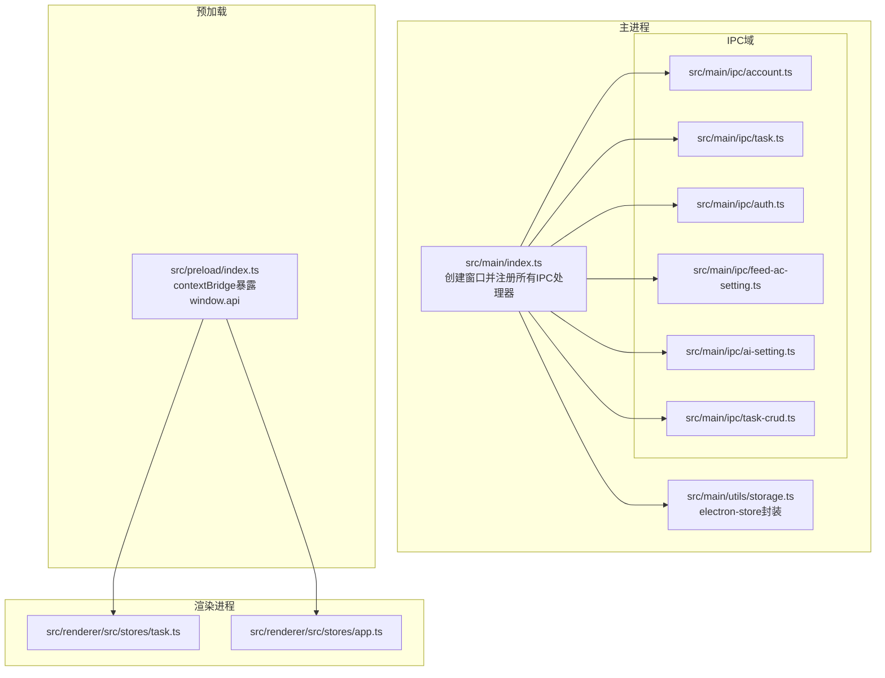
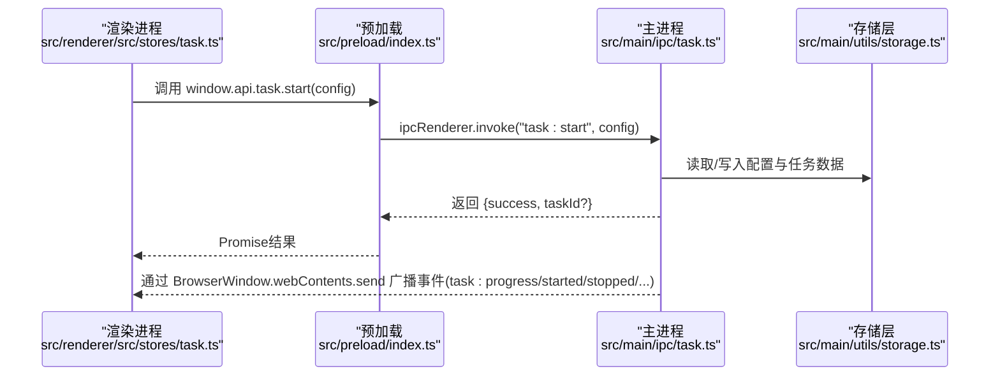
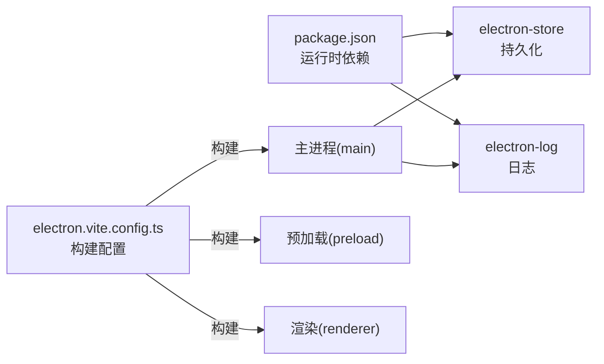

# IPC核心机制

<cite>
**本文引用的文件**
- [src/main/index.ts](file://src/main/index.ts)
- [src/preload/index.ts](file://src/preload/index.ts)
- [src/main/ipc/account.ts](file://src/main/ipc/account.ts)
- [src/main/ipc/task.ts](file://src/main/ipc/task.ts)
- [src/main/ipc/auth.ts](file://src/main/ipc/auth.ts)
- [src/main/ipc/feed-ac-setting.ts](file://src/main/ipc/feed-ac-setting.ts)
- [src/main/ipc/ai-setting.ts](file://src/main/ipc/ai-setting.ts)
- [src/main/ipc/task-crud.ts](file://src/main/ipc/task-crud.ts)
- [src/main/utils/storage.ts](file://src/main/utils/storage.ts)
- [src/shared/platform.ts](file://src/shared/platform.ts)
- [src/shared/task.ts](file://src/shared/task.ts)
- [src/renderer/src/stores/task.ts](file://src/renderer/src/stores/task.ts)
- [src/renderer/src/stores/app.ts](file://src/renderer/src/stores/app.ts)
- [electron.vite.config.ts](file://electron.vite.config.ts)
- [package.json](file://package.json)
</cite>

## 目录
1. [简介](#简介)
2. [项目结构](#项目结构)
3. [核心组件](#核心组件)
4. [架构总览](#架构总览)
5. [详细组件分析](#详细组件分析)
6. [依赖关系分析](#依赖关系分析)
7. [性能考量](#性能考量)
8. [故障排查指南](#故障排查指南)
9. [结论](#结论)
10. [附录](#附录)

## 简介
本文件系统性阐述 AutoOps 的 Electron IPC 核心机制，覆盖主进程与渲染进程的消息传递模型、事件驱动架构、预加载脚本的安全边界（contextIsolation）、以及异步通信与错误传播策略。文档同时给出内存管理、并发控制与性能优化建议，并通过仓库中的真实实现路径展示如何正确使用 IPC 进行进程间通信。

## 项目结构
AutoOps 将 IPC 相关逻辑按职责拆分在多个模块中：
- 主进程入口负责窗口创建与 IPC 处理器注册
- 预加载脚本通过 contextBridge 暴露受控 API 到渲染进程
- 各功能域的 IPC 文件集中处理对应业务的请求/响应与事件广播
- 存储层统一使用 electron-store 提供键值持久化
- 渲染侧通过 Pinia store 调用 window.api 并订阅任务事件

图表来源
- [src/main/index.ts:1-106](file://src/main/index.ts#L1-L106)
- [src/preload/index.ts:1-234](file://src/preload/index.ts#L1-L234)
- [src/main/ipc/account.ts:1-128](file://src/main/ipc/account.ts#L1-L128)
- [src/main/ipc/task.ts:1-243](file://src/main/ipc/task.ts#L1-L243)
- [src/main/ipc/auth.ts:1-23](file://src/main/ipc/auth.ts#L1-L23)
- [src/main/ipc/feed-ac-setting.ts:1-44](file://src/main/ipc/feed-ac-setting.ts#L1-L44)
- [src/main/ipc/ai-setting.ts:1-27](file://src/main/ipc/ai-setting.ts#L1-L27)
- [src/main/ipc/task-crud.ts:1-108](file://src/main/ipc/task-crud.ts#L1-L108)
- [src/main/utils/storage.ts:1-46](file://src/main/utils/storage.ts#L1-L46)
- [src/renderer/src/stores/task.ts:1-315](file://src/renderer/src/stores/task.ts#L1-L315)
- [src/renderer/src/stores/app.ts:1-71](file://src/renderer/src/stores/app.ts#L1-L71)

章节来源
- [src/main/index.ts:1-106](file://src/main/index.ts#L1-L106)
- [src/preload/index.ts:1-234](file://src/preload/index.ts#L1-L234)

## 核心组件
- 主进程窗口与WebPreferences
  - 在窗口创建时启用预加载脚本、contextIsolation、禁用 nodeIntegration，确保安全边界
  - 参考：[src/main/index.ts:22-52](file://src/main/index.ts#L22-L52)
- 预加载脚本与上下文桥接
  - 使用 contextBridge.exposeInMainWorld 暴露 window.api，仅导出受控方法与事件监听器
  - 通过 ipcRenderer.invoke 发起请求，通过 ipcRenderer.on 订阅事件
  - 参考：[src/preload/index.ts:130-234](file://src/preload/index.ts#L130-L234)
- IPC 域处理器
  - 账号域：账户增删改查、默认账户设置、状态检查等
  - 任务域：任务启动/停止/暂停/恢复、并发度控制、队列管理、定时调度
  - 认证域：登录态读取/写入/清理
  - 设置域：Feed-AutoComment 设置的读取/更新/重置/导入/导出
  - AI 设置域：AI 配置读取/更新/重置/测试占位
  - 任务 CRUD 域：任务与模板的增删改查
  - 参考：
    - [src/main/ipc/account.ts:32-127](file://src/main/ipc/account.ts#L32-L127)
    - [src/main/ipc/task.ts:81-240](file://src/main/ipc/task.ts#L81-L240)
    - [src/main/ipc/auth.ts:4-23](file://src/main/ipc/auth.ts#L4-L23)
    - [src/main/ipc/feed-ac-setting.ts:16-44](file://src/main/ipc/feed-ac-setting.ts#L16-L44)
    - [src/main/ipc/ai-setting.ts:5-27](file://src/main/ipc/ai-setting.ts#L5-L27)
    - [src/main/ipc/task-crud.ts:8-107](file://src/main/ipc/task-crud.ts#L8-L107)
- 存储层
  - 统一使用 electron-store，定义键名枚举与默认值
  - 参考：[src/main/utils/storage.ts:14-46](file://src/main/utils/storage.ts#L14-L46)
- 渲染侧 Store
  - 任务 Store：封装任务生命周期、并发度、日志、事件订阅与清理
  - 应用 Store：浏览器路径初始化与运行状态
  - 参考：
    - [src/renderer/src/stores/task.ts:1-315](file://src/renderer/src/stores/task.ts#L1-L315)
    - [src/renderer/src/stores/app.ts:1-71](file://src/renderer/src/stores/app.ts#L1-L71)

章节来源
- [src/main/index.ts:22-52](file://src/main/index.ts#L22-L52)
- [src/preload/index.ts:130-234](file://src/preload/index.ts#L130-L234)
- [src/main/ipc/account.ts:32-127](file://src/main/ipc/account.ts#L32-L127)
- [src/main/ipc/task.ts:81-240](file://src/main/ipc/task.ts#L81-L240)
- [src/main/ipc/auth.ts:4-23](file://src/main/ipc/auth.ts#L4-L23)
- [src/main/ipc/feed-ac-setting.ts:16-44](file://src/main/ipc/feed-ac-setting.ts#L16-L44)
- [src/main/ipc/ai-setting.ts:5-27](file://src/main/ipc/ai-setting.ts#L5-L27)
- [src/main/ipc/task-crud.ts:8-107](file://src/main/ipc/task-crud.ts#L8-L107)
- [src/main/utils/storage.ts:14-46](file://src/main/utils/storage.ts#L14-L46)
- [src/renderer/src/stores/task.ts:1-315](file://src/renderer/src/stores/task.ts#L1-L315)
- [src/renderer/src/stores/app.ts:1-71](file://src/renderer/src/stores/app.ts#L1-L71)

## 架构总览
AutoOps 的 IPC 采用“主进程处理器 + 预加载桥接 + 渲染侧 Store”的三层架构：
- 主进程：集中注册 ipcMain.handle 与事件广播，负责业务逻辑与持久化
- 预加载：通过 contextBridge 暴露有限 API，屏蔽底层细节，统一错误与返回格式
- 渲染：通过 window.api 调用，订阅任务事件，驱动 UI 与状态管理

图表来源
- [src/renderer/src/stores/task.ts:138-201](file://src/renderer/src/stores/task.ts#L138-L201)
- [src/preload/index.ts:137-161](file://src/preload/index.ts#L137-L161)
- [src/main/ipc/task.ts:81-132](file://src/main/ipc/task.ts#L81-L132)
- [src/main/utils/storage.ts:14-46](file://src/main/utils/storage.ts#L14-L46)

## 详细组件分析

### 预加载脚本与安全边界
- 安全配置
  - contextIsolation: true，隔离渲染上下文，防止 DOM 污染
  - nodeIntegration: false，禁止 Node 能力直接注入
  - preload: 指向预加载脚本，确保在页面加载前执行
  - 参考：[src/main/index.ts:30-35](file://src/main/index.ts#L30-L35)
- API 暴露策略
  - 通过 contextBridge.exposeInMainWorld('api', api)，仅暴露受控接口
  - 每个域的方法均以 ipcRenderer.invoke 调用主进程处理器
  - 事件监听通过 createIPCListener 包装，返回移除函数，便于组件卸载时清理
  - 参考：[src/preload/index.ts:130-234](file://src/preload/index.ts#L130-L234)
- 类型约束
  - ElectronAPI 接口对每个域的输入输出进行 TypeScript 级别约束，降低误用风险
  - 参考：[src/preload/index.ts:13-122](file://src/preload/index.ts#L13-L122)

章节来源
- [src/main/index.ts:30-35](file://src/main/index.ts#L30-L35)
- [src/preload/index.ts:13-122](file://src/preload/index.ts#L13-L122)
- [src/preload/index.ts:130-234](file://src/preload/index.ts#L130-L234)

### 主进程处理器与事件驱动
- 任务域处理器
  - 提供任务生命周期管理：start/stop/pause/resume/status/queue/schedule/concurrency 等
  - 通过 BrowserWindow.getAllWindows() 广播事件，渲染侧统一订阅
  - 参考：[src/main/ipc/task.ts:81-240](file://src/main/ipc/task.ts#L81-L240)
- 账号域处理器
  - 支持列表、新增、更新、删除、默认账户切换、按平台筛选、活跃账户查询、单个/批量状态检查
  - 参考：[src/main/ipc/account.ts:32-127](file://src/main/ipc/account.ts#L32-L127)
- 认证域处理器
  - 登录态读取/写入/清理，配合存储层
  - 参考：[src/main/ipc/auth.ts:4-23](file://src/main/ipc/auth.ts#L4-L23)
- 设置域处理器
  - Feed-AutoComment 设置的版本兼容与迁移、导入/导出
  - 参考：[src/main/ipc/feed-ac-setting.ts:16-44](file://src/main/ipc/feed-ac-setting.ts#L16-L44)
- AI 设置域处理器
  - 默认值回退与占位测试接口
  - 参考：[src/main/ipc/ai-setting.ts:5-27](file://src/main/ipc/ai-setting.ts#L5-L27)
- 任务 CRUD 域处理器
  - 任务与模板的增删改查、去重与 ID 生成
  - 参考：[src/main/ipc/task-crud.ts:8-107](file://src/main/ipc/task-crud.ts#L8-L107)

章节来源
- [src/main/ipc/task.ts:81-240](file://src/main/ipc/task.ts#L81-L240)
- [src/main/ipc/account.ts:32-127](file://src/main/ipc/account.ts#L32-L127)
- [src/main/ipc/auth.ts:4-23](file://src/main/ipc/auth.ts#L4-L23)
- [src/main/ipc/feed-ac-setting.ts:16-44](file://src/main/ipc/feed-ac-setting.ts#L16-L44)
- [src/main/ipc/ai-setting.ts:5-27](file://src/main/ipc/ai-setting.ts#L5-L27)
- [src/main/ipc/task-crud.ts:8-107](file://src/main/ipc/task-crud.ts#L8-L107)

### 渲染侧调用与事件订阅
- 任务 Store
  - 通过 window.api.task.* 发起请求，订阅 task:progress、task:action、task:started、task:stopped 等事件
  - 提供并发度设置、日志截断、运行状态聚合等能力
  - 参考：[src/renderer/src/stores/task.ts:138-315](file://src/renderer/src/stores/task.ts#L138-L315)
- 应用 Store
  - 初始化浏览器路径，检查是否已配置
  - 参考：[src/renderer/src/stores/app.ts:32-43](file://src/renderer/src/stores/app.ts#L32-L43)

章节来源
- [src/renderer/src/stores/task.ts:138-315](file://src/renderer/src/stores/task.ts#L138-L315)
- [src/renderer/src/stores/app.ts:32-43](file://src/renderer/src/stores/app.ts#L32-L43)

### 数据流与消息序列化
- 请求/响应模型
  - 渲染侧通过 ipcRenderer.invoke 触发主进程 ipcMain.handle 处理器
  - 主进程返回 Promise 结果，渲染侧统一处理 success/error 字段
  - 参考：
    - [src/preload/index.ts:137-161](file://src/preload/index.ts#L137-L161)
    - [src/main/ipc/task.ts:81-132](file://src/main/ipc/task.ts#L81-L132)
- 事件广播模型
  - 主进程在任务状态变化时，通过 BrowserWindow.webContents.send 广播事件
  - 渲染侧通过 window.api.task.onXxx 订阅，返回移除函数用于清理
  - 参考：[src/main/ipc/task.ts:22-76](file://src/main/ipc/task.ts#L22-L76)

章节来源
- [src/preload/index.ts:137-161](file://src/preload/index.ts#L137-L161)
- [src/main/ipc/task.ts:22-76](file://src/main/ipc/task.ts#L22-L76)

### 异步通信、Promise 与错误传播
- Promise 处理
  - 预加载层统一包装 ipcRenderer.invoke，返回 Promise
  - 主进程处理器内部 try/catch 并返回 {success, error?} 结构
  - 参考：
    - [src/preload/index.ts:137-161](file://src/preload/index.ts#L137-L161)
    - [src/main/ipc/task.ts:128-131](file://src/main/ipc/task.ts#L128-L131)
- 错误传播
  - 主进程捕获异常后返回错误信息；渲染侧根据 success 字段决定 UI 展示
  - 参考：[src/main/ipc/task.ts:128-131](file://src/main/ipc/task.ts#L128-L131)
- 日志与调试
  - 主进程监听来自渲染的日志通道，统一输出到日志系统
  - 参考：[src/main/index.ts:92-106](file://src/main/index.ts#L92-L106)

章节来源
- [src/preload/index.ts:137-161](file://src/preload/index.ts#L137-L161)
- [src/main/ipc/task.ts:128-131](file://src/main/ipc/task.ts#L128-L131)
- [src/main/index.ts:92-106](file://src/main/index.ts#L92-L106)

### 内存管理、并发控制与性能优化
- 事件监听清理
  - 渲染侧在组件卸载或任务结束时调用返回的移除函数，避免内存泄漏
  - 参考：[src/renderer/src/stores/task.ts:120-136](file://src/renderer/src/stores/task.ts#L120-L136)
- 并发度控制
  - 主进程提供 setConcurrency/getConcurrency 接口，渲染侧维护 maxConcurrency 状态
  - 参考：
    - [src/main/ipc/task.ts:220-229](file://src/main/ipc/task.ts#L220-L229)
    - [src/renderer/src/stores/task.ts:115-118](file://src/renderer/src/stores/task.ts#L115-L118)
- 日志截断
  - 渲染侧保留最近 N 条日志，避免内存膨胀
  - 参考：[src/renderer/src/stores/task.ts:270-273](file://src/renderer/src/stores/task.ts#L270-L273)
- 任务状态聚合
  - 渲染侧聚合 runningTasks，减少重复查询
  - 参考：[src/renderer/src/stores/task.ts:110-113](file://src/renderer/src/stores/task.ts#L110-L113)

章节来源
- [src/renderer/src/stores/task.ts:120-136](file://src/renderer/src/stores/task.ts#L120-L136)
- [src/renderer/src/stores/task.ts:115-118](file://src/renderer/src/stores/task.ts#L115-L118)
- [src/renderer/src/stores/task.ts:270-273](file://src/renderer/src/stores/task.ts#L270-L273)
- [src/renderer/src/stores/task.ts:110-113](file://src/renderer/src/stores/task.ts#L110-L113)

### 具体使用示例（路径指引）
- 在渲染侧启动任务并订阅事件
  - 调用路径：[src/renderer/src/stores/task.ts:138-201](file://src/renderer/src/stores/task.ts#L138-L201)
  - 订阅事件路径：[src/renderer/src/stores/task.ts:162-199](file://src/renderer/src/stores/task.ts#L162-L199)
- 在渲染侧设置最大并发度
  - 调用路径：[src/renderer/src/stores/task.ts:245-251](file://src/renderer/src/stores/task.ts#L245-L251)
- 在主进程处理任务状态变更并广播事件
  - 处理器路径：[src/main/ipc/task.ts:81-132](file://src/main/ipc/task.ts#L81-L132)
  - 广播事件路径：[src/main/ipc/task.ts:22-76](file://src/main/ipc/task.ts#L22-L76)
- 在预加载层暴露 API 并转发到主进程
  - 暴露路径：[src/preload/index.ts:137-161](file://src/preload/index.ts#L137-L161)
  - 事件监听路径：[src/preload/index.ts:153-160](file://src/preload/index.ts#L153-L160)

章节来源
- [src/renderer/src/stores/task.ts:138-201](file://src/renderer/src/stores/task.ts#L138-L201)
- [src/renderer/src/stores/task.ts:162-199](file://src/renderer/src/stores/task.ts#L162-L199)
- [src/renderer/src/stores/task.ts:245-251](file://src/renderer/src/stores/task.ts#L245-L251)
- [src/main/ipc/task.ts:81-132](file://src/main/ipc/task.ts#L81-L132)
- [src/main/ipc/task.ts:22-76](file://src/main/ipc/task.ts#L22-L76)
- [src/preload/index.ts:137-161](file://src/preload/index.ts#L137-L161)
- [src/preload/index.ts:153-160](file://src/preload/index.ts#L153-L160)

## 依赖关系分析
- 构建与打包
  - electron-vite 配置分别构建 main、preload、renderer 三类资源
  - 参考：[electron.vite.config.ts:6-34](file://electron.vite.config.ts#L6-L34)
- 运行时依赖
  - electron-store 提供键值存储
  - electron-log 提供日志记录
  - @electron-toolkit/utils 提供工具方法
  - 参考：[package.json:16-34](file://package.json#L16-L34)

图表来源
- [electron.vite.config.ts:6-34](file://electron.vite.config.ts#L6-L34)
- [package.json:16-34](file://package.json#L16-L34)

章节来源
- [electron.vite.config.ts:6-34](file://electron.vite.config.ts#L6-L34)
- [package.json:16-34](file://package.json#L16-L34)

## 性能考量
- 事件风暴防护
  - 通过并发度上限与队列长度限制，避免任务过多导致资源争用
  - 参考：[src/main/ipc/task.ts:191-194](file://src/main/ipc/task.ts#L191-L194)
- 日志与内存
  - 渲染侧日志截断与事件监听清理，防止内存泄漏
  - 参考：
    - [src/renderer/src/stores/task.ts:270-273](file://src/renderer/src/stores/task.ts#L270-L273)
    - [src/renderer/src/stores/task.ts:120-136](file://src/renderer/src/stores/task.ts#L120-L136)
- 存储访问
  - 统一通过存储层封装，避免频繁 IO；必要时可引入缓存与批量写入
  - 参考：[src/main/utils/storage.ts:14-46](file://src/main/utils/storage.ts#L14-L46)

## 故障排查指南
- 无法收到任务事件
  - 检查预加载是否正确暴露 window.api 且未被覆盖
  - 检查渲染侧是否正确订阅事件并保存移除函数
  - 参考：
    - [src/preload/index.ts:130-234](file://src/preload/index.ts#L130-L234)
    - [src/renderer/src/stores/task.ts:162-199](file://src/renderer/src/stores/task.ts#L162-L199)
- 任务启动失败
  - 查看主进程返回的错误字段；确认浏览器路径已配置
  - 参考：
    - [src/main/ipc/task.ts:128-131](file://src/main/ipc/task.ts#L128-L131)
    - [src/main/ipc/task.ts:98-102](file://src/main/ipc/task.ts#L98-L102)
- 事件未清理导致内存泄漏
  - 确保在组件卸载时调用返回的移除函数
  - 参考：[src/renderer/src/stores/task.ts:120-136](file://src/renderer/src/stores/task.ts#L120-L136)

章节来源
- [src/preload/index.ts:130-234](file://src/preload/index.ts#L130-L234)
- [src/renderer/src/stores/task.ts:162-199](file://src/renderer/src/stores/task.ts#L162-L199)
- [src/main/ipc/task.ts:128-131](file://src/main/ipc/task.ts#L128-L131)
- [src/main/ipc/task.ts:98-102](file://src/main/ipc/task.ts#L98-L102)
- [src/renderer/src/stores/task.ts:120-136](file://src/renderer/src/stores/task.ts#L120-L136)

## 结论
AutoOps 的 IPC 架构以“安全的预加载桥接 + 主进程域处理器 + 渲染侧 Store”为核心，实现了清晰的职责分离与良好的扩展性。通过严格的 contextIsolation 配置、统一的 Promise 返回结构与事件广播机制，系统在保证安全性的同时提供了灵活的任务编排与可观测性。结合并发度控制、事件清理与日志截断等最佳实践，可在复杂场景下保持稳定与高性能。

## 附录
- 关键类型与常量
  - 平台与任务类型：参考 [src/shared/platform.ts:1-260](file://src/shared/platform.ts#L1-L260)
  - 任务与模板结构：参考 [src/shared/task.ts:12-62](file://src/shared/task.ts#L12-L62)
- 构建与运行
  - electron-vite 配置：参考 [electron.vite.config.ts:6-34](file://electron.vite.config.ts#L6-L34)
  - 依赖声明：参考 [package.json:16-34](file://package.json#L16-L34)