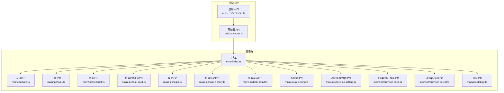
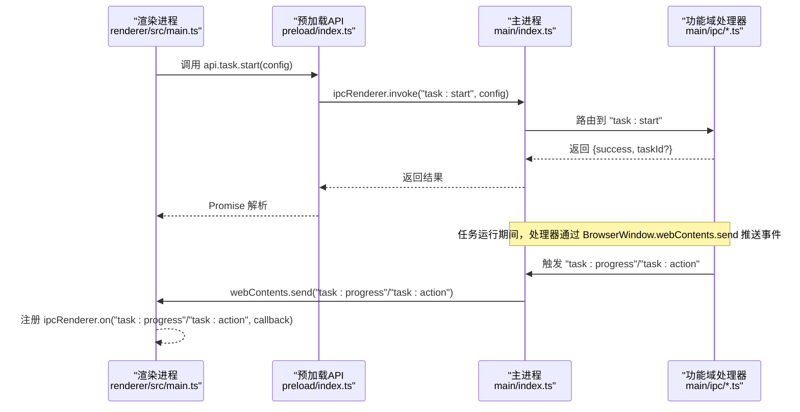
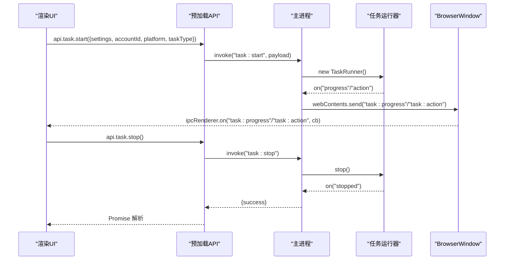
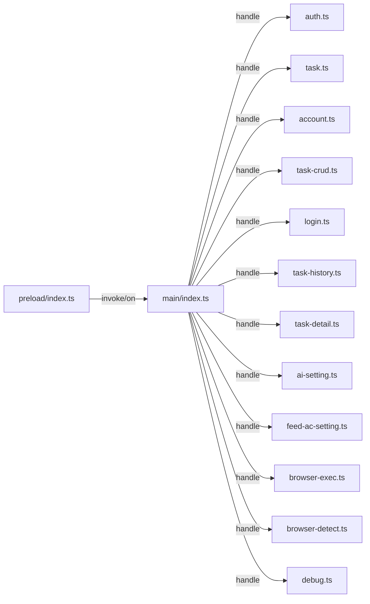

# IPC通信机制

<cite>
**本文引用的文件**
- [src/preload/index.ts](file://src/preload/index.ts)
- [src/main/index.ts](file://src/main/index.ts)
- [src/main/ipc/auth.ts](file://src/main/ipc/auth.ts)
- [src/main/ipc/task.ts](file://src/main/ipc/task.ts)
- [src/main/ipc/account.ts](file://src/main/ipc/account.ts)
- [src/main/ipc/task-crud.ts](file://src/main/ipc/task-crud.ts)
- [src/main/ipc/login.ts](file://src/main/ipc/login.ts)
- [src/main/ipc/task-history.ts](file://src/main/ipc/task-history.ts)
- [src/main/ipc/task-detail.ts](file://src/main/ipc/task-detail.ts)
- [src/main/ipc/debug.ts](file://src/main/ipc/debug.ts)
- [src/main/ipc/ai-setting.ts](file://src/main/ipc/ai-setting.ts)
- [src/main/ipc/feed-ac-setting.ts](file://src/main/ipc/feed-ac-setting.ts)
- [src/main/ipc/browser-exec.ts](file://src/main/ipc/browser-exec.ts)
- [src/main/ipc/browser-detect.ts](file://src/main/ipc/browser-detect.ts)
- [src/renderer/src/main.ts](file://src/renderer/src/main.ts)
</cite>

## 目录
1. [简介](#简介)
2. [项目结构](#项目结构)
3. [核心组件](#核心组件)
4. [架构总览](#架构总览)
5. [详细组件分析](#详细组件分析)
6. [依赖关系分析](#依赖关系分析)
7. [性能考虑](#性能考虑)
8. [故障排查指南](#故障排查指南)
9. [结论](#结论)
10. [附录](#附录)

## 简介
本文件系统性梳理 AutoOps 的 IPC（进程间通信）机制，覆盖主进程与渲染进程之间的消息传递、事件驱动架构与异步通信模式。重点解析 ipcMain 与 ipcRenderer 的工作原理、消息序列化与反序列化、各类 IPC 处理器的注册与管理机制（任务管理、账号管理、认证处理等），并给出错误处理策略、超时机制与连接状态管理建议。同时提供性能优化、内存管理与并发控制的最佳实践，以及 API 使用示例与调试技巧。

## 项目结构
AutoOps 的 IPC 架构由三部分组成：
- 预加载层（Preload）：通过 contextBridge 暴露受控 API 给渲染进程，统一使用 ipcRenderer.invoke 与 ipcRenderer.on 进行请求-响应与事件订阅。
- 主进程（Main）：集中注册各功能域的 IPC 处理器（ipcMain.handle），并负责业务逻辑与状态管理。
- 渲染进程（Renderer）：基于 Vue/Pinia/路由的应用层，调用预加载层暴露的 API 完成交互。

图表来源
- [src/renderer/src/main.ts:1-12](file://src/renderer/src/main.ts#L1-L12)
- [src/preload/index.ts:1-187](file://src/preload/index.ts#L1-L187)
- [src/main/index.ts:1-106](file://src/main/index.ts#L1-L106)
- [src/main/ipc/auth.ts:1-23](file://src/main/ipc/auth.ts#L1-L23)
- [src/main/ipc/task.ts:1-104](file://src/main/ipc/task.ts#L1-L104)
- [src/main/ipc/account.ts:1-101](file://src/main/ipc/account.ts#L1-L101)
- [src/main/ipc/task-crud.ts:1-108](file://src/main/ipc/task-crud.ts#L1-L108)
- [src/main/ipc/login.ts:1-173](file://src/main/ipc/login.ts#L1-L173)
- [src/main/ipc/task-history.ts:1-45](file://src/main/ipc/task-history.ts#L1-L45)
- [src/main/ipc/task-detail.ts:1-39](file://src/main/ipc/task-detail.ts#L1-L39)
- [src/main/ipc/ai-setting.ts:1-27](file://src/main/ipc/ai-setting.ts#L1-L27)
- [src/main/ipc/feed-ac-setting.ts:1-44](file://src/main/ipc/feed-ac-setting.ts#L1-L44)
- [src/main/ipc/browser-exec.ts:1-13](file://src/main/ipc/browser-exec.ts#L1-L13)
- [src/main/ipc/browser-detect.ts:1-118](file://src/main/ipc/browser-detect.ts#L1-L118)
- [src/main/ipc/debug.ts:1-12](file://src/main/ipc/debug.ts#L1-L12)

章节来源
- [src/main/index.ts:54-84](file://src/main/index.ts#L54-L84)
- [src/preload/index.ts:95-187](file://src/preload/index.ts#L95-L187)

## 核心组件
- 预加载层（preload/index.ts）
  - 通过 contextBridge.exposeInMainWorld 暴露受控 API 对象，封装 ipcRenderer.invoke 与 ipcRenderer.on，按命名空间划分功能域（如 auth、task、account、taskCRUD 等）。
  - 所有 IPC 调用均以字符串通道名标识，例如 "auth:login"、"task:start"、"account:list" 等。
- 主进程（main/index.ts）
  - 在应用准备就绪后集中注册所有 IPC 处理器，确保渲染进程可用前完成桥接。
  - 提供通用日志通道 "log"，接收渲染端日志级别与消息，统一写入主进程日志系统。
- 各功能域 IPC 处理器
  - 认证（auth）、任务（task）、账号（account）、任务CRUD（task-crud）、登录（login）、任务历史（task-history）、任务详情（task-detail）、AI 设置（ai-setting）、动态推荐设置（feed-ac-setting）、浏览器执行路径（browser-exec）、浏览器检测（browser-detect）、调试（debug）等。

章节来源
- [src/preload/index.ts:1-187](file://src/preload/index.ts#L1-L187)
- [src/main/index.ts:17-106](file://src/main/index.ts#L17-L106)

## 架构总览
下图展示从渲染进程到主进程的关键调用链与事件流，涵盖请求-响应与事件推送两条主线。

图表来源
- [src/renderer/src/main.ts:1-12](file://src/renderer/src/main.ts#L1-L12)
- [src/preload/index.ts:102-116](file://src/preload/index.ts#L102-L116)
- [src/main/index.ts:54-84](file://src/main/index.ts#L54-L84)
- [src/main/ipc/task.ts:11-104](file://src/main/ipc/task.ts#L11-L104)

## 详细组件分析

### 预加载层（contextBridge 与 API 暴露）
- 设计要点
  - 将 ipcRenderer.invoke 与 ipcRenderer.on 包装为强类型接口，按功能域分组，避免直接暴露底层 API。
  - 事件监听返回解绑函数，便于组件销毁时清理。
  - 通道名采用 "namespace:action" 命名规范，清晰可维护。
- 关键通道示例
  - 认证：auth:hasAuth、auth:login、auth:logout、auth:getAuth
  - 任务：task:start、task:stop、task:status、task:progress、task:action
  - 账号：account:list、account:add、account:update、account:delete、account:setDefault、account:getDefault、account:getById、account:getByPlatform、account:getActiveAccounts
  - 任务CRUD：task:getAll、task:getById、task:getByAccount、task:create、task:update、task:delete、task:duplicate、task-template:getAll、task-template:save、task-template:delete
  - 登录：login:douyin、login:getUrl
  - 任务历史：task-history:getAll、task-history:getById、task-history:add、task-history:update、task-history:delete、task-history:clear
  - 任务详情：task-detail:get、task-detail:addVideoRecord、task-detail:updateStatus
  - AI设置：ai-settings:get、ai-settings:update、ai-settings:reset、ai-settings:test
  - 动态推荐设置：feed-ac-settings:get、feed-ac-settings:update、feed-ac-settings:reset、feed-ac-settings:export、feed-ac-settings:import
  - 浏览器执行路径：browser-exec:get、browser-exec:set
  - 浏览器检测：browser:detect
  - 调试：debug:getEnv

章节来源
- [src/preload/index.ts:3-93](file://src/preload/index.ts#L3-L93)
- [src/preload/index.ts:95-187](file://src/preload/index.ts#L95-L187)

### 主进程入口与处理器注册
- 入口初始化
  - 应用启动后注册所有 IPC 处理器，随后创建窗口并加载页面。
  - 提供通用日志通道 "log"，支持 error/warn/debug/info 级别。
- 处理器注册顺序
  - 认证、任务、动态推荐设置、AI设置、浏览器执行路径、浏览器检测、账号、登录、文件选择器、任务历史、任务详情、调试、任务CRUD（重复注册用于不同命名空间）。

章节来源
- [src/main/index.ts:54-84](file://src/main/index.ts#L54-L84)
- [src/main/index.ts:92-106](file://src/main/index.ts#L92-L106)

### 认证（auth）处理器
- 功能
  - 检查是否已认证、登录、登出、获取认证信息。
  - 数据存储通过共享存储工具实现持久化。
- 错误处理
  - 登录成功返回统一结构；登出清空存储；查询不存在时返回空值或默认值。

章节来源
- [src/main/ipc/auth.ts:1-23](file://src/main/ipc/auth.ts#L1-L23)

### 任务（task）处理器
- 功能
  - 启动任务：校验当前是否已有运行中的任务、检查浏览器执行路径、迁移旧版设置、实例化任务运行器并绑定进度与动作事件。
  - 停止任务：停止当前运行器并重置状态。
  - 查询状态：返回是否正在运行。
- 事件推送
  - 通过 BrowserWindow.webContents.send 推送 "task:progress" 与 "task:action" 事件，主进程向所有窗口广播。
- 错误处理
  - 捕获异常并返回统一错误结构，清理运行器状态。

图表来源
- [src/main/ipc/task.ts:11-104](file://src/main/ipc/task.ts#L11-L104)
- [src/preload/index.ts:102-116](file://src/preload/index.ts#L102-L116)

章节来源
- [src/main/ipc/task.ts:1-104](file://src/main/ipc/task.ts#L1-L104)

### 账号（account）处理器
- 功能
  - 列表、新增、更新、删除、设置默认、获取默认、按ID与平台筛选、获取活跃账号。
- 默认行为
  - 新增账号时若为空则自动设为默认；删除账号后若列表非空则自动补一个默认账号。
- 错误处理
  - 更新不存在的账号会抛出错误，调用方需捕获。

章节来源
- [src/main/ipc/account.ts:1-101](file://src/main/ipc/account.ts#L1-L101)

### 任务CRUD（task-crud）处理器
- 功能
  - 获取全部任务、按ID/账户/平台查询、创建、更新、删除、复制任务。
  - 任务模板的保存与删除。
- 默认值与生成
  - 自动生成ID、时间戳字段，提供默认平台与任务类型。
- 错误处理
  - 更新不存在的任务返回空，删除与复制操作返回布尔结果。

章节来源
- [src/main/ipc/task-crud.ts:1-108](file://src/main/ipc/task-crud.ts#L1-L108)

### 登录（login）处理器
- 功能
  - 使用 Playwright 启动带临时用户数据目录的 Chromium 实例，访问目标站点并等待用户登录。
  - 提取用户昵称、头像、唯一ID等信息，导出 cookies 为 storageState 字符串。
- 超时与等待
  - 页面加载与 URL 变化等待分别设置超时时间，避免长时间阻塞。
- 错误处理
  - 捕获异常并返回错误信息；若未检测到昵称则回退为默认昵称。

章节来源
- [src/main/ipc/login.ts:17-173](file://src/main/ipc/login.ts#L17-L173)

### 任务历史（task-history）与任务详情（task-detail）处理器
- 任务历史
  - 支持全量查询、按ID查询、新增、更新、删除、清空。
- 任务详情
  - 新增视频记录并统计评论数，更新任务状态并在终止状态时写入结束时间。

章节来源
- [src/main/ipc/task-history.ts:1-45](file://src/main/ipc/task-history.ts#L1-L45)
- [src/main/ipc/task-detail.ts:1-39](file://src/main/ipc/task-detail.ts#L1-L39)

### AI设置（ai-setting）与动态推荐设置（feed-ac-setting）处理器
- AI设置
  - 获取、更新、重置、测试（占位）。
- 动态推荐设置
  - 版本兼容处理（v2 -> v3 迁移）、获取、更新、重置、导出、导入。

章节来源
- [src/main/ipc/ai-setting.ts:1-27](file://src/main/ipc/ai-setting.ts#L1-L27)
- [src/main/ipc/feed-ac-setting.ts:1-44](file://src/main/ipc/feed-ac-setting.ts#L1-L44)

### 浏览器执行路径（browser-exec）与浏览器检测（browser-detect）处理器
- 浏览器执行路径
  - 获取与设置浏览器可执行路径，用于后续任务启动。
- 浏览器检测
  - Windows 通过注册表与常见路径扫描，macOS/Linux 通过常见安装路径扫描，去重后返回浏览器名称、路径与版本。

章节来源
- [src/main/ipc/browser-exec.ts:1-13](file://src/main/ipc/browser-exec.ts#L1-L13)
- [src/main/ipc/browser-detect.ts:1-118](file://src/main/ipc/browser-detect.ts#L1-L118)

### 调试（debug）处理器
- 功能
  - 返回平台、架构、版本信息，辅助诊断环境问题。

章节来源
- [src/main/ipc/debug.ts:1-12](file://src/main/ipc/debug.ts#L1-L12)

## 依赖关系分析
- 模块耦合
  - 预加载层仅依赖 Electron 的 ipcRenderer 与 contextBridge，职责单一，耦合度低。
  - 主进程入口集中注册，降低跨模块耦合；各处理器内部自洽，通过存储工具与业务服务协作。
- 外部依赖
  - 存储：通过共享存储工具实现键值持久化。
  - 任务运行：依赖任务运行器服务，负责实际业务执行与事件发布。
  - 登录流程：依赖 Playwright 启动浏览器上下文并进行页面交互。
- 潜在循环依赖
  - 当前结构清晰，无明显循环依赖风险。

图表来源
- [src/preload/index.ts:1-187](file://src/preload/index.ts#L1-L187)
- [src/main/index.ts:54-84](file://src/main/index.ts#L54-L84)
- [src/main/ipc/auth.ts:1-23](file://src/main/ipc/auth.ts#L1-L23)
- [src/main/ipc/task.ts:1-104](file://src/main/ipc/task.ts#L1-L104)
- [src/main/ipc/account.ts:1-101](file://src/main/ipc/account.ts#L1-L101)
- [src/main/ipc/task-crud.ts:1-108](file://src/main/ipc/task-crud.ts#L1-L108)
- [src/main/ipc/login.ts:1-173](file://src/main/ipc/login.ts#L1-L173)
- [src/main/ipc/task-history.ts:1-45](file://src/main/ipc/task-history.ts#L1-L45)
- [src/main/ipc/task-detail.ts:1-39](file://src/main/ipc/task-detail.ts#L1-L39)
- [src/main/ipc/ai-setting.ts:1-27](file://src/main/ipc/ai-setting.ts#L1-L27)
- [src/main/ipc/feed-ac-setting.ts:1-44](file://src/main/ipc/feed-ac-setting.ts#L1-L44)
- [src/main/ipc/browser-exec.ts:1-13](file://src/main/ipc/browser-exec.ts#L1-L13)
- [src/main/ipc/browser-detect.ts:1-118](file://src/main/ipc/browser-detect.ts#L1-L118)
- [src/main/ipc/debug.ts:1-12](file://src/main/ipc/debug.ts#L1-L12)

章节来源
- [src/main/index.ts:54-84](file://src/main/index.ts#L54-L84)
- [src/preload/index.ts:95-187](file://src/preload/index.ts#L95-L187)

## 性能考虑
- 消息序列化与反序列化
  - 预加载层与主进程之间传递的数据应尽量保持可序列化结构，避免循环引用与不可克隆对象。
  - 大对象传输建议拆分或延迟加载，减少主线程阻塞。
- 广播事件
  - 任务进度与动作事件通过 BrowserWindow.webContents.send 推送，注意窗口数量增长带来的广播开销。
- 并发控制
  - 任务启动前检查运行状态，避免并发冲突；长耗时操作（如登录）应设置合理超时。
- 内存管理
  - 任务运行器停止后及时释放引用，防止内存泄漏。
- I/O 与存储
  - 存储读写集中在主进程，避免在渲染进程直接操作磁盘；批量更新时合并写入。

## 故障排查指南
- 日志通道
  - 渲染进程可通过 "log" 通道上报日志，主进程按级别输出到日志系统，便于定位问题。
- 常见问题
  - 任务无法启动：检查浏览器执行路径是否配置、是否存在运行中的任务。
  - 登录失败：确认浏览器路径正确、网络可达、目标站点可访问；查看超时与 URL 等待配置。
  - 事件未到达：确认渲染进程已注册对应事件监听，并在组件销毁时正确解绑。
- 调试技巧
  - 使用调试处理器获取平台与版本信息，核对运行环境。
  - 在预加载层增加参数校验与错误包装，统一返回结构，便于前端处理。
  - 对长耗时操作添加心跳或阶段性日志，提升可观测性。

章节来源
- [src/main/index.ts:92-106](file://src/main/index.ts#L92-L106)
- [src/main/ipc/task.ts:17-84](file://src/main/ipc/task.ts#L17-L84)
- [src/main/ipc/login.ts:25-167](file://src/main/ipc/login.ts#L25-L167)
- [src/main/ipc/debug.ts:4-12](file://src/main/ipc/debug.ts#L4-L12)

## 结论
AutoOps 的 IPC 架构以预加载层为边界，将 Electron 的底层 API 封装为受控接口，主进程集中注册各功能域处理器，形成清晰的请求-响应与事件驱动模式。通过统一的通道命名、错误包装与日志系统，提升了系统的可维护性与可观测性。建议在扩展新功能时遵循现有命名与结构约定，关注消息序列化、事件广播与资源释放，持续优化性能与稳定性。

## 附录
- API 使用示例（路径）
  - 认证：[src/preload/index.ts:96-101](file://src/preload/index.ts#L96-L101)
  - 任务：[src/preload/index.ts:102-116](file://src/preload/index.ts#L102-L116)
  - 账号：[src/preload/index.ts:137-147](file://src/preload/index.ts#L137-L147)
  - 任务CRUD：[src/preload/index.ts:168-176](file://src/preload/index.ts#L168-L176)
  - 登录：[src/preload/index.ts:148-150](file://src/preload/index.ts#L148-L150)
  - 任务历史：[src/preload/index.ts:155-162](file://src/preload/index.ts#L155-L162)
  - 任务详情：[src/preload/index.ts:163-167](file://src/preload/index.ts#L163-L167)
  - AI设置：[src/preload/index.ts:124-129](file://src/preload/index.ts#L124-L129)
  - 动态推荐设置：[src/preload/index.ts:117-123](file://src/preload/index.ts#L117-L123)
  - 浏览器执行路径：[src/preload/index.ts:130-133](file://src/preload/index.ts#L130-L133)
  - 浏览器检测：[src/preload/index.ts:134-136](file://src/preload/index.ts#L134-L136)
  - 调试：[src/preload/index.ts:182-184](file://src/preload/index.ts#L182-L184)
- 处理器注册（路径）
  - 主入口注册：[src/main/index.ts:63-75](file://src/main/index.ts#L63-L75)
  - 认证处理器：[src/main/ipc/auth.ts:4-23](file://src/main/ipc/auth.ts#L4-L23)
  - 任务处理器：[src/main/ipc/task.ts:11-104](file://src/main/ipc/task.ts#L11-L104)
  - 账号处理器：[src/main/ipc/account.ts:32-100](file://src/main/ipc/account.ts#L32-L100)
  - 任务CRUD处理器：[src/main/ipc/task-crud.ts:8-107](file://src/main/ipc/task-crud.ts#L8-L107)
  - 登录处理器：[src/main/ipc/login.ts:17-173](file://src/main/ipc/login.ts#L17-L173)
  - 任务历史处理器：[src/main/ipc/task-history.ts:5-45](file://src/main/ipc/task-history.ts#L5-L45)
  - 任务详情处理器：[src/main/ipc/task-detail.ts:5-39](file://src/main/ipc/task-detail.ts#L5-L39)
  - AI设置处理器：[src/main/ipc/ai-setting.ts:5-27](file://src/main/ipc/ai-setting.ts#L5-L27)
  - 动态推荐设置处理器：[src/main/ipc/feed-ac-setting.ts:16-44](file://src/main/ipc/feed-ac-setting.ts#L16-L44)
  - 浏览器执行路径处理器：[src/main/ipc/browser-exec.ts:4-13](file://src/main/ipc/browser-exec.ts#L4-L13)
  - 浏览器检测处理器：[src/main/ipc/browser-detect.ts:105-118](file://src/main/ipc/browser-detect.ts#L105-L118)
  - 调试处理器：[src/main/ipc/debug.ts:3-12](file://src/main/ipc/debug.ts#L3-L12)