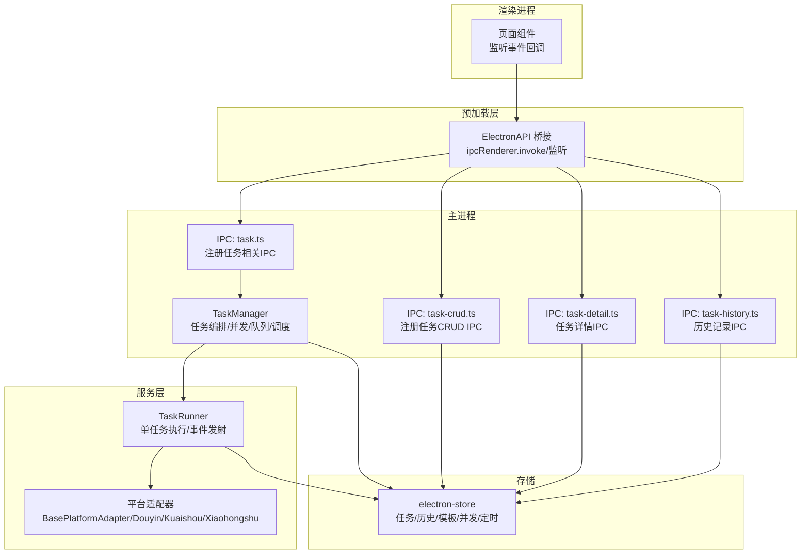
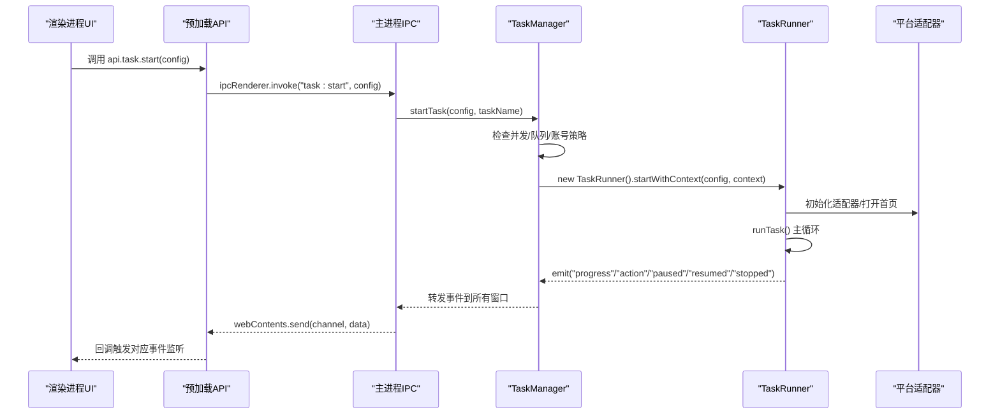
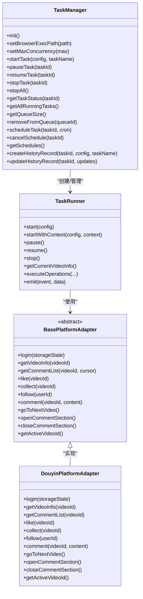

# 任务管理IPC

<cite>
**本文引用的文件**
- [src/main/ipc/task.ts](file://src/main/ipc/task.ts)
- [src/main/ipc/task-crud.ts](file://src/main/ipc/task-crud.ts)
- [src/main/ipc/task-detail.ts](file://src/main/ipc/task-detail.ts)
- [src/main/ipc/task-history.ts](file://src/main/ipc/task-history.ts)
- [src/main/service/task-runner.ts](file://src/main/service/task-runner.ts)
- [src/main/service/task-manager.ts](file://src/main/service/task-manager.ts)
- [src/preload/index.ts](file://src/preload/index.ts)
- [src/shared/task.ts](file://src/shared/task.ts)
- [src/shared/task-history.ts](file://src/shared/task-history.ts)
- [src/shared/platform.ts](file://src/shared/platform.ts)
- [src/main/utils/storage.ts](file://src/main/utils/storage.ts)
- [src/main/platform/base.ts](file://src/main/platform/base.ts)
- [src/main/platform/factory.ts](file://src/main/platform/factory.ts)
- [src/main/platform/douyin/index.ts](file://src/main/platform/douyin/index.ts)
</cite>

## 更新摘要
**变更内容**
- 优化了任务历史保存机制，增加内存缓存和实时更新功能
- 简化了任务CRUD IPC处理器的错误处理模式，移除了不必要的复杂响应结构
- 改进了历史记录的实时同步机制，提升了用户体验

## 目录
1. [简介](#简介)
2. [项目结构](#项目结构)
3. [核心组件](#核心组件)
4. [架构总览](#架构总览)
5. [详细组件分析](#详细组件分析)
6. [依赖关系分析](#依赖关系分析)
7. [性能考量](#性能考量)
8. [故障排查指南](#故障排查指南)
9. [结论](#结论)
10. [附录](#附录)

## 简介
本文件面向AutoOps的任务管理IPC通信模块，系统性阐述任务启动、停止、暂停/恢复、状态查询的IPC接口设计与实现；深入分析TaskRunner与IPC层的交互机制，包括任务进度通知、操作结果反馈与错误处理；梳理任务CRUD与模板管理的IPC协议；解释任务详情与历史记录的通信机制；分析任务执行过程中的实时数据传输、状态同步与事件广播；并提供API使用示例、参数说明、错误处理策略、性能优化建议与最佳实践。

## 项目结构
任务管理IPC相关代码主要分布在主进程IPC处理器、预加载桥接API、任务执行引擎与平台适配器之间，采用"主进程IPC → 任务管理器 → 任务运行器 → 平台适配器"的分层架构，通过事件总线与Electron IPC双向通信。

**图表来源**
- [src/main/ipc/task.ts:81-240](file://src/main/ipc/task.ts#L81-L240)
- [src/main/ipc/task-crud.ts:8-107](file://src/main/ipc/task-crud.ts#L8-L107)
- [src/main/ipc/task-detail.ts:5-39](file://src/main/ipc/task-detail.ts#L5-L39)
- [src/main/ipc/task-history.ts:5-45](file://src/main/ipc/task-history.ts#L5-L45)
- [src/main/service/task-manager.ts:47-515](file://src/main/service/task-manager.ts#L47-L515)
- [src/main/service/task-runner.ts:25-760](file://src/main/service/task-runner.ts#L25-L760)
- [src/main/platform/base.ts:24-105](file://src/main/platform/base.ts#L24-L105)
- [src/main/utils/storage.ts:16-53](file://src/main/utils/storage.ts#L16-L53)

**章节来源**
- [src/main/ipc/task.ts:1-243](file://src/main/ipc/task.ts#L1-L243)
- [src/main/ipc/task-crud.ts:1-108](file://src/main/ipc/task-crud.ts#L1-L108)
- [src/main/ipc/task-detail.ts:1-39](file://src/main/ipc/task-detail.ts#L1-L39)
- [src/main/ipc/task-history.ts:1-45](file://src/main/ipc/task-history.ts#L1-L45)
- [src/main/service/task-manager.ts:1-515](file://src/main/service/task-manager.ts#L1-L515)
- [src/main/service/task-runner.ts:1-760](file://src/main/service/task-runner.ts#L1-L760)
- [src/main/platform/base.ts:1-105](file://src/main/platform/base.ts#L1-L105)
- [src/main/utils/storage.ts:1-53](file://src/main/utils/storage.ts#L1-L53)

## 核心组件
- 任务IPC处理器（task.ts）：提供任务启动、停止、暂停/恢复、状态查询、并发与队列、定时任务等IPC接口，并将TaskManager事件广播至所有窗口。
- 任务CRUD与模板IPC处理器（task-crud.ts）：提供任务列表、按条件筛选、创建、更新、删除、复制、模板保存与删除等IPC接口，采用简化的错误处理模式。
- 任务详情与历史IPC处理器（task-detail.ts、task-history.ts）：提供任务详情查询、视频记录追加、状态更新、历史记录增删改查与清空，支持实时历史记录更新。
- 预加载桥接API（preload/index.ts）：定义渲染进程可用的API命名空间与事件监听器，封装invoke与事件订阅。
- 任务管理器（task-manager.ts）：负责共享浏览器实例、并发控制、任务队列、账号策略、定时任务持久化与事件转发，包含内存缓存的历史记录管理。
- 任务运行器（task-runner.ts）：封装单任务执行逻辑，基于Playwright驱动平台适配器，发射进度、动作、暂停/恢复、停止等事件。
- 平台适配器（platform/*）：抽象平台差异，统一视频信息、评论、点赞、收藏、关注等操作接口。
- 存储（storage.ts）：electron-store键值映射，承载任务、历史、模板、并发、定时等配置。

**章节来源**
- [src/main/ipc/task.ts:81-240](file://src/main/ipc/task.ts#L81-L240)
- [src/main/ipc/task-crud.ts:8-107](file://src/main/ipc/task-crud.ts#L8-L107)
- [src/main/ipc/task-detail.ts:5-39](file://src/main/ipc/task-detail.ts#L5-L39)
- [src/main/ipc/task-history.ts:5-45](file://src/main/ipc/task-history.ts#L5-L45)
- [src/preload/index.ts:130-234](file://src/preload/index.ts#L130-L234)
- [src/main/service/task-manager.ts:47-515](file://src/main/service/task-manager.ts#L47-L515)
- [src/main/service/task-runner.ts:25-760](file://src/main/service/task-runner.ts#L25-L760)
- [src/main/platform/base.ts:24-105](file://src/main/platform/base.ts#L24-L105)
- [src/main/utils/storage.ts:16-53](file://src/main/utils/storage.ts#L16-L53)

## 架构总览
任务管理IPC采用"主进程事件驱动 + 渲染进程桥接API"的模式。主进程通过ipcMain.handle暴露方法，TaskManager作为中枢协调TaskRunner生命周期与资源，TaskRunner通过平台适配器与目标平台交互，期间通过EventEmitter向TaskManager广播进度、动作、暂停/恢复、停止等事件，TaskManager再将这些事件转发给所有BrowserWindow，渲染进程通过ipcRenderer.on订阅。

**图表来源**
- [src/main/ipc/task.ts:81-240](file://src/main/ipc/task.ts#L81-L240)
- [src/main/service/task-manager.ts:178-230](file://src/main/service/task-manager.ts#L178-L230)
- [src/main/service/task-runner.ts:55-113](file://src/main/service/task-runner.ts#L55-L113)
- [src/main/platform/base.ts:24-80](file://src/main/platform/base.ts#L24-L80)
- [src/preload/index.ts:130-234](file://src/preload/index.ts#L130-L234)

## 详细组件分析

### 任务启动、停止、暂停/恢复、状态查询（IPC接口）
- 接口清单与行为
  - 启动任务：接收配置对象（包含平台、任务类型、设置、账户ID、任务名），校验浏览器可执行路径，迁移旧版本设置，创建TaskManager并启动任务，返回任务ID或错误。
  - 停止任务：支持按任务ID停止或停止全部；停止后清理runner并尝试启动队列中任务。
  - 暂停/恢复：对指定任务切换暂停/运行状态，TaskRunner内部循环检测暂停标志。
  - 状态查询：支持按任务ID查询状态，或查询当前运行中的任务集合。
  - 并发与队列：设置最大并发，超出则入队；任务停止后尝试从队列取出新任务启动。
  - 定时任务：设置/取消/查询定时任务，基于cron表达式与定时器轮询。
- 事件广播
  - TaskManager将progress、action、paused、resumed、taskStarted、taskStopped、queued、scheduleTriggered等事件转发给所有窗口，渲染进程通过onProgress/onAction/onPaused/onResumed/onStarted/onStopped/onQueued/onScheduleTriggered订阅。

**章节来源**
- [src/main/ipc/task.ts:81-240](file://src/main/ipc/task.ts#L81-L240)
- [src/main/service/task-manager.ts:178-307](file://src/main/service/task-manager.ts#L178-L307)
- [src/main/service/task-runner.ts:185-210](file://src/main/service/task-runner.ts#L185-L210)
- [src/preload/index.ts:153-161](file://src/preload/index.ts#L153-L161)

### 任务CRUD与模板管理（IPC协议）
- CRUD接口
  - 获取全部任务、按ID获取、按账户ID过滤、按平台过滤。
  - 创建任务：生成唯一ID，填充默认设置，写入存储。
  - 更新任务：按ID查找并合并更新字段，更新时间戳。
  - 删除任务：按ID过滤数组并回写存储，返回简化的成功响应。
  - 复制任务：克隆原任务并生成新ID，保留名称副本标记。
- 模板管理
  - 获取全部模板、保存模板、删除模板。
- 数据模型
  - 任务实体包含平台、任务类型、配置、计划任务、时间戳等。
  - 模板实体包含平台、任务类型、配置与创建时间。
- **更新** 错误处理模式简化：删除任务操作现在返回 `{ success: true }` 而不是完整的响应对象，减少了不必要的复杂性。

**章节来源**
- [src/main/ipc/task-crud.ts:8-107](file://src/main/ipc/task-crud.ts#L8-L107)
- [src/shared/task.ts:12-31](file://src/shared/task.ts#L12-L31)
- [src/main/utils/storage.ts:16-53](file://src/main/utils/storage.ts#L16-L53)

### 任务详情与历史记录（IPC协议）
- 任务详情
  - 按任务ID获取历史记录；追加视频记录并维护评论计数；更新任务状态并在结束/停止/错误时写入结束时间。
- 历史记录
  - 获取全部/按ID获取；新增记录（头部插入）、更新、删除；清空历史。
- **更新** 历史记录实时更新：TaskManager现在维护内存缓存，实时更新历史记录并通过 `historyUpdated` 事件推送到前端，提升了用户体验。

**章节来源**
- [src/main/ipc/task-detail.ts:5-39](file://src/main/ipc/task-detail.ts#L5-L39)
- [src/main/ipc/task-history.ts:5-45](file://src/main/ipc/task-history.ts#L5-L45)
- [src/shared/task-history.ts:14-22](file://src/shared/task-history.ts#L14-L22)
- [src/main/utils/storage.ts:16-53](file://src/main/utils/storage.ts#L16-L53)

### TaskRunner与IPC层交互机制
- 事件发射
  - 进度：每次关键步骤发射progress事件，携带消息与时间戳。
  - 动作：执行具体操作（如评论、点赞、收藏、关注）后发射action事件，包含视频ID、动作类型与结果。
  - 状态：暂停/恢复/停止分别发射对应事件。
- 事件转发
  - TaskManager在runner事件上做增强（附加taskId），并向所有窗口广播，确保渲染进程能区分不同任务。
- 错误处理
  - TaskRunner捕获异常并置状态为failed，发射stopped事件；主进程日志记录错误。

**章节来源**
- [src/main/service/task-runner.ts:63-113](file://src/main/service/task-runner.ts#L63-L113)
- [src/main/service/task-runner.ts:339-370](file://src/main/service/task-runner.ts#L339-L370)
- [src/main/service/task-manager.ts:389-402](file://src/main/service/task-manager.ts#L389-L402)

### 平台适配器与任务执行流程
- 适配器职责
  - 统一视频信息获取、评论列表、点赞/收藏/关注、评论发布、前后视频切换、验证码处理等。
  - 通过EventEmitter向外抛出日志事件，供上层记录。
- 执行流程
  - 任务循环：等待视频切换、获取视频信息、类型/分类/屏蔽词/规则匹配、可选模拟观看、执行操作、统计与计数、下一条。
  - AI集成：当启用AI时，根据提示词生成评论内容或视频类型判断。
  - 事件与缓存：监听feed接口响应，缓存视频数据以提升性能与稳定性。

**章节来源**
- [src/main/platform/base.ts:24-105](file://src/main/platform/base.ts#L24-L105)
- [src/main/platform/douyin/index.ts:140-426](file://src/main/platform/douyin/index.ts#L140-L426)
- [src/main/service/task-runner.ts:235-371](file://src/main/service/task-runner.ts#L235-L371)

### 任务详情获取与历史记录查询的通信机制
- 详情查询：渲染进程调用ipcRenderer.invoke("task-detail:get", id)，主进程从存储中检索并返回。
- 视频记录追加：主进程更新历史记录数组并维护评论计数。
- 历史记录管理：提供增删改查与清空接口，均基于electron-store持久化。
- **更新** 实时历史更新：TaskManager维护内存缓存，实时更新历史记录并通过事件推送，确保前端显示最新状态。

**章节来源**
- [src/main/ipc/task-detail.ts:6-38](file://src/main/ipc/task-detail.ts#L6-L38)
- [src/main/ipc/task-history.ts:6-44](file://src/main/ipc/task-history.ts#L6-L44)
- [src/main/utils/storage.ts:16-53](file://src/main/utils/storage.ts#L16-L53)

### 实时数据传输、状态同步与事件广播
- 实时数据
  - 任务进度、动作结果、暂停/恢复、开始/停止、入队、定时触发等事件通过webContents.send广播。
- 状态同步
  - 渲染进程通过api.task.getStatus/api.task.status获取最新状态，主进程从TaskManager查询。
- 事件广播
  - TaskManager在构造时绑定事件转发，确保所有窗口收到一致事件流。
- **更新** 历史记录实时同步：通过内存缓存和 `historyUpdated` 事件实现历史记录的实时同步。

**章节来源**
- [src/main/ipc/task.ts:21-76](file://src/main/ipc/task.ts#L21-L76)
- [src/main/service/task-manager.ts:389-402](file://src/main/service/task-manager.ts#L389-L402)
- [src/preload/index.ts:153-161](file://src/preload/index.ts#L153-L161)

## 依赖关系分析

**图表来源**
- [src/main/service/task-manager.ts:47-515](file://src/main/service/task-manager.ts#L47-L515)
- [src/main/service/task-runner.ts:25-760](file://src/main/service/task-runner.ts#L25-L760)
- [src/main/platform/base.ts:24-105](file://src/main/platform/base.ts#L24-L105)
- [src/main/platform/douyin/index.ts:60-494](file://src/main/platform/douyin/index.ts#L60-L494)

**章节来源**
- [src/main/service/task-manager.ts:47-515](file://src/main/service/task-manager.ts#L47-L515)
- [src/main/service/task-runner.ts:25-760](file://src/main/service/task-runner.ts#L25-L760)
- [src/main/platform/base.ts:24-105](file://src/main/platform/base.ts#L24-L105)
- [src/main/platform/factory.ts:7-32](file://src/main/platform/factory.ts#L7-L32)

## 性能考量
- 浏览器实例复用
  - TaskManager维护共享浏览器实例，避免重复启动带来的开销；断连时自动重建。
- 并发与队列
  - 通过最大并发与队列机制控制资源占用；账号级冷却时间避免频繁切换导致不稳定。
- 缓存与网络
  - 平台适配器监听feed接口响应，缓存视频数据，减少重复请求与DOM解析成本。
- 事件频率
  - 进度事件粒度适中，避免过于频繁导致UI卡顿；必要时在渲染端节流显示。
- 存储访问
  - electron-store为本地存储，注意批量写入与去抖，避免频繁I/O。
- **更新** 内存缓存优化：TaskManager维护历史记录内存缓存，减少存储访问频率，提升历史记录更新性能。

**章节来源**
- [src/main/service/task-manager.ts:111-127](file://src/main/service/task-manager.ts#L111-L127)
- [src/main/service/task-manager.ts:96-106](file://src/main/service/task-manager.ts#L96-L106)
- [src/main/platform/douyin/index.ts:140-157](file://src/main/platform/douyin/index.ts#L140-L157)
- [src/main/service/task-runner.ts:160-180](file://src/main/service/task-runner.ts#L160-L180)

## 故障排查指南
- 无法启动任务
  - 检查浏览器执行路径是否配置；确认TaskManager初始化与并发设置；查看日志输出。
- 任务无响应或卡死
  - 关注progress事件是否持续；检查验证码弹窗阻塞；确认网络与平台接口可达。
- 评论失败
  - 检查评论输入框定位、接口响应超时与验证码处理；确认账号登录状态。
- 并发与队列问题
  - 调整最大并发；观察队列长度；核对账号策略与冷却时间。
- 历史记录缺失
  - 确认历史记录写入逻辑与存储键值；检查任务状态更新时机。
- **更新** 历史记录不同步
  - 检查 `historyUpdated` 事件是否正常触发；确认内存缓存是否正确更新。

**章节来源**
- [src/main/ipc/task.ts:98-102](file://src/main/ipc/task.ts#L98-L102)
- [src/main/platform/douyin/index.ts:335-342](file://src/main/platform/douyin/index.ts#L335-L342)
- [src/main/service/task-manager.ts:279-307](file://src/main/service/task-manager.ts#L279-L307)
- [src/main/ipc/task-detail.ts:12-24](file://src/main/ipc/task-detail.ts#L12-L24)

## 结论
该IPC模块通过清晰的分层设计与事件驱动机制，实现了任务生命周期的全链路控制与状态同步。TaskManager承担编排职责，TaskRunner专注执行细节，平台适配器屏蔽平台差异，预加载API为渲染进程提供统一调用入口。配合缓存、并发与队列策略，系统在保证稳定性的同时兼顾性能与扩展性。最新的优化进一步提升了历史记录的实时性和用户体验。

## 附录

### API使用示例与参数说明
- 任务控制
  - 启动：调用api.task.start({ settings, accountId?, platform?, taskType?, taskName? })，返回{ success, taskId? | error }。
  - 停止：api.task.stop(taskId?)，支持按任务或全部停止。
  - 暂停/恢复：api.task.pause(taskId)、api.task.resume(taskId)。
  - 状态：api.task.status(taskId?)、api.task.listRunning()、api.task.getStatus(taskId)。
  - 并发与队列：api.task.setConcurrency(max)、api.task.getConcurrency()、api.task.queueSize()、api.task.removeFromQueue(queueId)。
  - 定时任务：api.task.schedule(taskId, cron)、api.task.cancelSchedule(taskId)、api.task.getSchedules()。
- 事件监听
  - 进度：api.task.onProgress(cb)；动作：api.task.onAction(cb)；暂停/恢复/开始/停止/入队/定时触发：对应onPaused/onResumed/onStarted/onStopped/onQueued/onScheduleTriggered。
- 任务CRUD
  - 查询：api.taskCRUD.getAll/getById/getByAccount/create/update/delete/duplicate。
- 任务详情与历史
  - 详情：api.task-detail.get(id)、addVideoRecord(taskId, videoRecord)、updateStatus(taskId, status)。
  - 历史：api.task-history.getAll/getById/add/update/delete/clear。

**章节来源**
- [src/preload/index.ts:130-234](file://src/preload/index.ts#L130-L234)
- [src/main/ipc/task.ts:81-240](file://src/main/ipc/task.ts#L81-L240)
- [src/main/ipc/task-crud.ts:8-107](file://src/main/ipc/task-crud.ts#L8-L107)
- [src/main/ipc/task-detail.ts:5-39](file://src/main/ipc/task-detail.ts#L5-L39)
- [src/main/ipc/task-history.ts:5-45](file://src/main/ipc/task-history.ts#L5-L45)