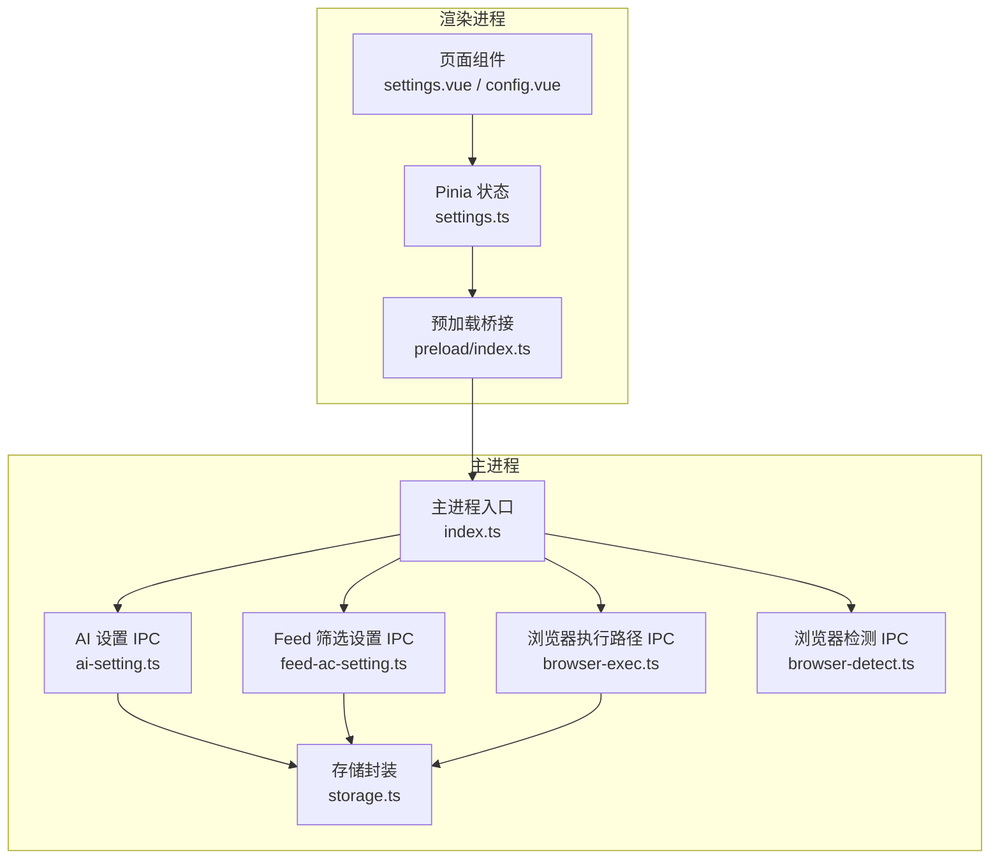
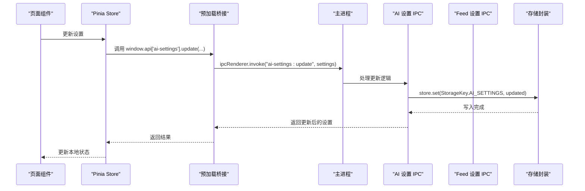
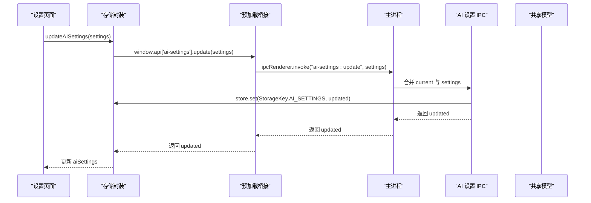
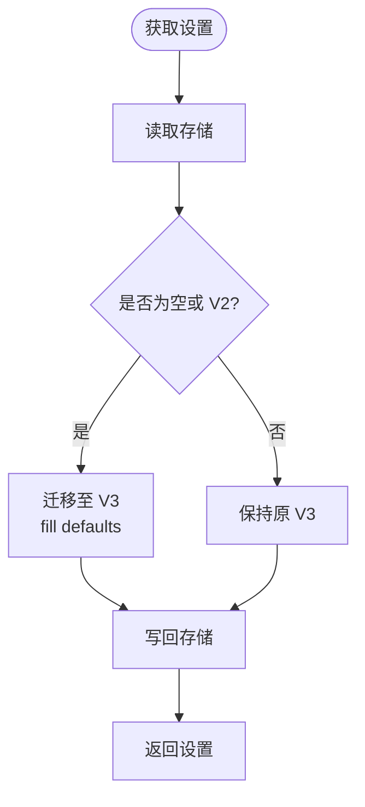
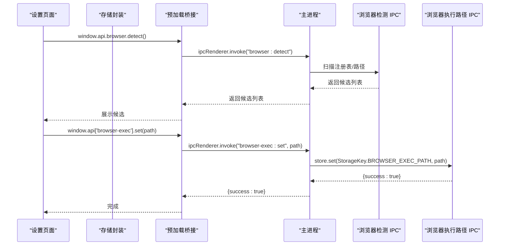
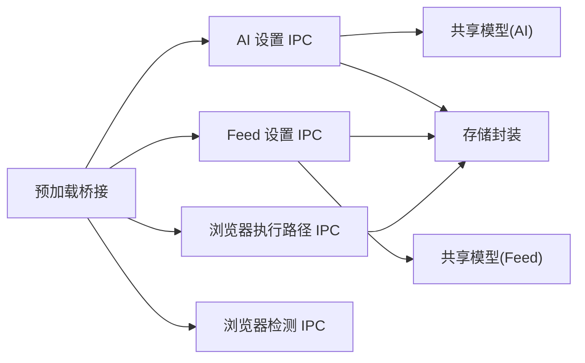

# 设置配置IPC

<cite>
**本文引用的文件**
- [src/main/ipc/ai-setting.ts](file://src/main/ipc/ai-setting.ts)
- [src/main/ipc/feed-ac-setting.ts](file://src/main/ipc/feed-ac-setting.ts)
- [src/main/ipc/browser-detect.ts](file://src/main/ipc/browser-detect.ts)
- [src/main/ipc/browser-exec.ts](file://src/main/ipc/browser-exec.ts)
- [src/main/utils/storage.ts](file://src/main/utils/storage.ts)
- [src/preload/index.ts](file://src/preload/index.ts)
- [src/shared/ai-setting.ts](file://src/shared/ai-setting.ts)
- [src/shared/feed-ac-setting.ts](file://src/shared/feed-ac-setting.ts)
- [src/renderer/src/stores/settings.ts](file://src/renderer/src/stores/settings.ts)
- [src/renderer/src/pages/settings.vue](file://src/renderer/src/pages/settings.vue)
- [src/renderer/src/pages/config.vue](file://src/renderer/src/pages/config.vue)
- [src/main/index.ts](file://src/main/index.ts)
</cite>

## 目录
1. [简介](#简介)
2. [项目结构](#项目结构)
3. [核心组件](#核心组件)
4. [架构总览](#架构总览)
5. [详细组件分析](#详细组件分析)
6. [依赖关系分析](#依赖关系分析)
7. [性能考量](#性能考量)
8. [故障排除指南](#故障排除指南)
9. [结论](#结论)
10. [附录：配置API与数据模型](#附录配置api与数据模型)

## 简介
本文件系统性梳理 AutoOps 的“设置配置IPC”模块，覆盖以下主题：
- AI 设置与 Feed 筛选设置的 IPC 管理机制
- 浏览器检测与执行路径配置的 IPC 实现（自动检测、路径验证、配置更新）
- 设置数据的持久化存储、版本管理与迁移
- 配置变更的通知机制、实时同步与冲突处理策略
- 设置验证、默认值处理与错误恢复的 IPC 协议
- 配置 API 使用示例、数据格式与验证规则
- 最佳实践与故障排除指南

## 项目结构
设置配置IPC相关代码主要分布在以下位置：
- 主进程 IPC 处理器：src/main/ipc/*.ts
- 预加载桥接层：src/preload/index.ts
- 共享数据模型：src/shared/*.ts
- 存储封装：src/main/utils/storage.ts
- 渲染侧状态与页面：src/renderer/src/stores/settings.ts、src/renderer/src/pages/*.vue
- 主进程入口注册：src/main/index.ts

图表来源
- [src/main/index.ts:54-76](file://src/main/index.ts#L54-L76)
- [src/main/ipc/ai-setting.ts:5-27](file://src/main/ipc/ai-setting.ts#L5-L27)
- [src/main/ipc/feed-ac-setting.ts:16-44](file://src/main/ipc/feed-ac-setting.ts#L16-L44)
- [src/main/ipc/browser-exec.ts:4-13](file://src/main/ipc/browser-exec.ts#L4-L13)
- [src/main/ipc/browser-detect.ts:105-118](file://src/main/ipc/browser-detect.ts#L105-L118)
- [src/main/utils/storage.ts:16-53](file://src/main/utils/storage.ts#L16-L53)
- [src/preload/index.ts:162-181](file://src/preload/index.ts#L162-L181)

章节来源
- [src/main/index.ts:54-76](file://src/main/index.ts#L54-L76)
- [src/preload/index.ts:130-234](file://src/preload/index.ts#L130-L234)

## 核心组件
- AI 设置 IPC：提供获取、更新、重置、测试接口；默认值来自共享模型。
- Feed 筛选设置 IPC：提供获取、更新、重置、导出、导入接口；内置版本兼容与迁移。
- 浏览器检测 IPC：跨平台扫描常见路径与注册表，返回可执行路径、名称、版本。
- 浏览器执行路径 IPC：读取/写入已选择的浏览器可执行路径。
- 存储封装：基于 electron-store 的键空间与默认值管理。
- 预加载桥接：统一暴露 IPC 调用到渲染进程。
- 渲染侧状态：Pinia Store 封装设置读写，页面组件通过 Store 调用 IPC。

章节来源
- [src/main/ipc/ai-setting.ts:5-27](file://src/main/ipc/ai-setting.ts#L5-L27)
- [src/main/ipc/feed-ac-setting.ts:16-44](file://src/main/ipc/feed-ac-setting.ts#L16-L44)
- [src/main/ipc/browser-detect.ts:105-118](file://src/main/ipc/browser-detect.ts#L105-L118)
- [src/main/ipc/browser-exec.ts:4-13](file://src/main/ipc/browser-exec.ts#L4-L13)
- [src/main/utils/storage.ts:16-53](file://src/main/utils/storage.ts#L16-L53)
- [src/preload/index.ts:162-181](file://src/preload/index.ts#L162-L181)
- [src/renderer/src/stores/settings.ts:8-46](file://src/renderer/src/stores/settings.ts#L8-L46)

## 架构总览
渲染进程通过预加载桥接调用主进程 IPC 接口，主进程对共享数据模型进行读取/合并/写入，并通过存储封装持久化。浏览器检测与执行路径分别提供自动发现与用户配置能力。

图表来源
- [src/renderer/src/pages/settings.vue:39-48](file://src/renderer/src/pages/settings.vue#L39-L48)
- [src/renderer/src/stores/settings.ts:24-34](file://src/renderer/src/stores/settings.ts#L24-L34)
- [src/preload/index.ts:169-174](file://src/preload/index.ts#L169-L174)
- [src/main/ipc/ai-setting.ts:11-16](file://src/main/ipc/ai-setting.ts#L11-L16)
- [src/main/utils/storage.ts:46-52](file://src/main/utils/storage.ts#L46-L52)

## 详细组件分析

### AI 设置 IPC
- 接口职责
  - 获取：若存储为空，返回默认值。
  - 更新：合并传入部分设置与当前设置，写回存储并返回最新设置。
  - 重置：写回默认值并返回。
  - 测试：占位接口，返回通用结果。
- 数据模型与默认值
  - 来自共享模型，包含平台、各平台 API Key 映射、模型名、温度等字段。
- 错误处理
  - 当前未显式抛错，异常会透传给调用方；建议在渲染层捕获并提示。

图表来源
- [src/main/ipc/ai-setting.ts:5-27](file://src/main/ipc/ai-setting.ts#L5-L27)
- [src/shared/ai-setting.ts:10-22](file://src/shared/ai-setting.ts#L10-L22)
- [src/renderer/src/stores/settings.ts:24-34](file://src/renderer/src/stores/settings.ts#L24-L34)
- [src/preload/index.ts:169-174](file://src/preload/index.ts#L169-L174)

章节来源
- [src/main/ipc/ai-setting.ts:5-27](file://src/main/ipc/ai-setting.ts#L5-L27)
- [src/shared/ai-setting.ts:1-29](file://src/shared/ai-setting.ts#L1-L29)
- [src/renderer/src/stores/settings.ts:24-34](file://src/renderer/src/stores/settings.ts#L24-L34)
- [src/renderer/src/pages/settings.vue:39-64](file://src/renderer/src/pages/settings.vue#L39-L64)

### Feed 筛选设置 IPC
- 接口职责
  - 获取：确保返回 V3 结构，必要时从 V2 迁移或使用默认值。
  - 更新：合并传入部分设置与当前设置，写回存储并返回。
  - 重置：写回默认 V3 值。
  - 导出：返回当前 V3 设置。
  - 导入：接收 V2/V3，转换为 V3 并写回。
- 版本管理与迁移
  - 通过 ensureV3 统一入口，支持空值、V2 到 V3 的字段映射与默认值补齐。
  - 迁移函数将旧规则组中的评论文本与 AI 开关等映射到新结构。
- 数据模型
  - 新增任务类型、操作集合、视频分类、跳过策略、AI 评论风格与长度等字段。

图表来源
- [src/main/ipc/feed-ac-setting.ts:10-14](file://src/main/ipc/feed-ac-setting.ts#L10-L14)
- [src/main/ipc/feed-ac-setting.ts:16-44](file://src/main/ipc/feed-ac-setting.ts#L16-L44)
- [src/shared/feed-ac-setting.ts:148-174](file://src/shared/feed-ac-setting.ts#L148-L174)

章节来源
- [src/main/ipc/feed-ac-setting.ts:16-44](file://src/main/ipc/feed-ac-setting.ts#L16-L44)
- [src/shared/feed-ac-setting.ts:62-97](file://src/shared/feed-ac-setting.ts#L62-L97)
- [src/shared/feed-ac-setting.ts:115-146](file://src/shared/feed-ac-setting.ts#L115-L146)
- [src/shared/feed-ac-setting.ts:148-174](file://src/shared/feed-ac-setting.ts#L148-L174)

### 浏览器检测与执行路径 IPC
- 浏览器检测
  - 跨平台扫描常见安装路径与注册表（Windows），去重后返回名称、路径、版本。
  - 版本解析仅在 Windows 上有效，其他平台返回占位值。
- 执行路径
  - 读取：返回已保存的浏览器可执行路径。
  - 写入：保存用户选择的路径，供后续任务使用。

图表来源
- [src/main/ipc/browser-detect.ts:105-118](file://src/main/ipc/browser-detect.ts#L105-L118)
- [src/main/ipc/browser-exec.ts:4-13](file://src/main/ipc/browser-exec.ts#L4-L13)
- [src/main/utils/storage.ts:33-44](file://src/main/utils/storage.ts#L33-L44)
- [src/preload/index.ts:179-181](file://src/preload/index.ts#L179-L181)
- [src/preload/index.ts:175-178](file://src/preload/index.ts#L175-L178)

章节来源
- [src/main/ipc/browser-detect.ts:12-118](file://src/main/ipc/browser-detect.ts#L12-L118)
- [src/main/ipc/browser-exec.ts:4-13](file://src/main/ipc/browser-exec.ts#L4-L13)
- [src/main/utils/storage.ts:33-44](file://src/main/utils/storage.ts#L33-L44)
- [src/preload/index.ts:175-181](file://src/preload/index.ts#L175-L181)

### 存储封装与默认值
- 存储键空间
  - 包含认证、Feed 设置、AI 设置、浏览器执行路径、任务历史、账户、任务、并发、定时等键。
- 默认值
  - 在初始化时为各键提供默认值，保证首次使用无需手动配置。
- 类型安全
  - 通过枚举键与泛型方法，减少键名拼写错误与类型不匹配风险。

章节来源
- [src/main/utils/storage.ts:3-53](file://src/main/utils/storage.ts#L3-L53)

### 渲染侧状态与页面
- Pinia Store
  - 提供加载、更新、重置 AI 与 Feed 设置的方法，内部通过 window.api 调用 IPC。
- 页面组件
  - 设置页：展示并编辑 AI 设置，支持测试连接。
  - 配置页：展示 Feed 筛选规则、屏蔽词、AI 评论开关等，支持启动/停止任务。

章节来源
- [src/renderer/src/stores/settings.ts:8-46](file://src/renderer/src/stores/settings.ts#L8-L46)
- [src/renderer/src/pages/settings.vue:32-64](file://src/renderer/src/pages/settings.vue#L32-L64)
- [src/renderer/src/pages/config.vue:41-56](file://src/renderer/src/pages/config.vue#L41-L56)

## 依赖关系分析
- 模块耦合
  - 预加载桥接集中暴露所有 IPC 接口，降低渲染层对具体通道名的记忆成本。
  - 主进程 IPC 处理器依赖存储封装与共享模型，职责清晰。
- 外部依赖
  - electron-store 提供键值持久化。
  - child_process/fs/path 用于浏览器检测与路径判断。
- 可能的循环依赖
  - 未见直接循环依赖；IPC 注册集中在主进程入口统一注册。

图表来源
- [src/preload/index.ts:162-181](file://src/preload/index.ts#L162-L181)
- [src/main/ipc/ai-setting.ts:1-3](file://src/main/ipc/ai-setting.ts#L1-L3)
- [src/main/ipc/feed-ac-setting.ts:1-8](file://src/main/ipc/feed-ac-setting.ts#L1-L8)
- [src/main/ipc/browser-exec.ts:1-2](file://src/main/ipc/browser-exec.ts#L1-L2)
- [src/main/ipc/browser-detect.ts:1-5](file://src/main/ipc/browser-detect.ts#L1-L5)
- [src/main/utils/storage.ts:1-2](file://src/main/utils/storage.ts#L1-L2)

章节来源
- [src/preload/index.ts:162-181](file://src/preload/index.ts#L162-L181)
- [src/main/index.ts:54-76](file://src/main/index.ts#L54-L76)

## 性能考量
- IPC 调用频率
  - 设置读写建议批量合并后再写入，避免频繁触发存储与渲染更新。
- 存储开销
  - Feed 设置体量较大，建议在渲染层做节流/防抖，减少不必要的重绘。
- 浏览器检测
  - 路径扫描与注册表查询可能阻塞主线程，建议异步执行并在 UI 中显示进度。
- 序列化与深拷贝
  - 更新设置时使用浅合并，注意深层对象的引用变化；必要时在渲染层进行浅拷贝。

## 故障排除指南
- AI 设置测试接口未实现
  - 表现：测试返回通用提示。
  - 建议：在主进程实现对应平台 SDK 的连通性校验，并返回明确的成功/失败信息。
- 浏览器检测无结果
  - 可能原因：路径不存在、权限不足、平台不支持。
  - 处理：检查常见安装路径与注册表访问权限；提供手动输入路径的降级方案。
- 设置更新后未生效
  - 检查点：确认已调用更新接口并返回成功；确认渲染层已刷新状态。
- 版本迁移异常
  - 检查：确保传入的是合法的 V2/V3 结构；核对迁移字段映射是否完整。
- 存储损坏或键缺失
  - 处理：利用默认值回退；必要时提供“重置设置”功能。

章节来源
- [src/main/ipc/ai-setting.ts:24-26](file://src/main/ipc/ai-setting.ts#L24-L26)
- [src/main/ipc/browser-detect.ts:47-80](file://src/main/ipc/browser-detect.ts#L47-L80)
- [src/main/ipc/feed-ac-setting.ts:10-14](file://src/main/ipc/feed-ac-setting.ts#L10-L14)

## 结论
该设置配置IPC模块以清晰的职责划分与统一的预加载桥接实现了渲染层与主进程之间的稳定交互。AI 设置与 Feed 筛选设置均具备完善的默认值与版本迁移能力；浏览器检测与执行路径提供了自动化与手动配置的双重保障。建议后续完善 AI 设置测试接口与错误反馈，增强设置变更的实时通知与冲突处理能力。

## 附录：配置API与数据模型

### 配置API清单
- AI 设置
  - 获取：window.api['ai-settings'].get()
  - 更新：window.api['ai-settings'].update(settings)
  - 重置：window.api['ai-settings'].reset()
  - 测试：window.api['ai-settings'].test(config)
- Feed 筛选设置
  - 获取：window.api['feed-ac-settings'].get()
  - 更新：window.api['feed-ac-settings'].update(settings)
  - 重置：window.api['feed-ac-settings'].reset()
  - 导出：window.api['feed-ac-settings'].export()
  - 导入：window.api['feed-ac-settings'].import(settings)
- 浏览器执行路径
  - 获取：window.api['browser-exec'].get()
  - 设置：window.api['browser-exec'].set(path)
- 浏览器检测
  - 检测：window.api.browser.detect()

章节来源
- [src/preload/index.ts:162-181](file://src/preload/index.ts#L162-L181)
- [src/preload/index.ts:175-181](file://src/preload/index.ts#L175-L181)

### 数据模型与验证规则
- AI 设置
  - 字段：platform、apiKeys、model、temperature
  - 默认值：platform 默认为指定平台，apiKeys 为空字符串映射，model 与 temperature 有默认值
  - 验证：渲染层可限制 temperature 范围；平台与模型列表来自共享常量
- Feed 筛选设置（V3）
  - 新增字段：taskType、operations、skipAdVideo、skipLiveVideo、maxConsecutiveSkips、videoSwitchWaitMs、commentReferenceCount、commentStyle、commentMaxLength、videoCategories
  - 规则组：支持嵌套、AI/手动类型、评论文本数组、AI 提示词等
  - 屏蔽词：视频描述与作者名两类
- 版本迁移
  - V2 → V3：填充默认值、迁移规则组评论文本与 AI 开关、新增操作集合与跳过策略

章节来源
- [src/shared/ai-setting.ts:1-29](file://src/shared/ai-setting.ts#L1-L29)
- [src/shared/feed-ac-setting.ts:62-97](file://src/shared/feed-ac-setting.ts#L62-L97)
- [src/shared/feed-ac-setting.ts:115-146](file://src/shared/feed-ac-setting.ts#L115-L146)
- [src/shared/feed-ac-setting.ts:148-174](file://src/shared/feed-ac-setting.ts#L148-L174)

### 使用示例（步骤说明）
- 编辑 AI 设置
  - 步骤：在设置页选择平台与模型，填写对应 API Key，调整温度，点击保存；可点击测试连接查看结果。
  - 关联文件：[src/renderer/src/pages/settings.vue:39-64](file://src/renderer/src/pages/settings.vue#L39-L64)，[src/renderer/src/stores/settings.ts:24-34](file://src/renderer/src/stores/settings.ts#L24-L34)
- 配置 Feed 筛选规则
  - 步骤：在配置页添加规则组、设置评论文本、配置屏蔽词、开启 AI 评论，点击启动任务。
  - 关联文件：[src/renderer/src/pages/config.vue:41-56](file://src/renderer/src/pages/config.vue#L41-L56)，[src/renderer/src/stores/settings.ts:12-22](file://src/renderer/src/stores/settings.ts#L12-L22)
- 浏览器路径配置
  - 步骤：在设置页点击前往设置，使用检测结果或手动输入路径，保存后生效。
  - 关联文件：[src/renderer/src/pages/settings.vue:154-162](file://src/renderer/src/pages/settings.vue#L154-L162)，[src/main/ipc/browser-detect.ts:105-118](file://src/main/ipc/browser-detect.ts#L105-L118)，[src/main/ipc/browser-exec.ts:4-13](file://src/main/ipc/browser-exec.ts#L4-L13)