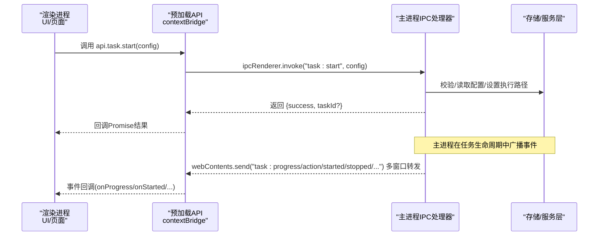
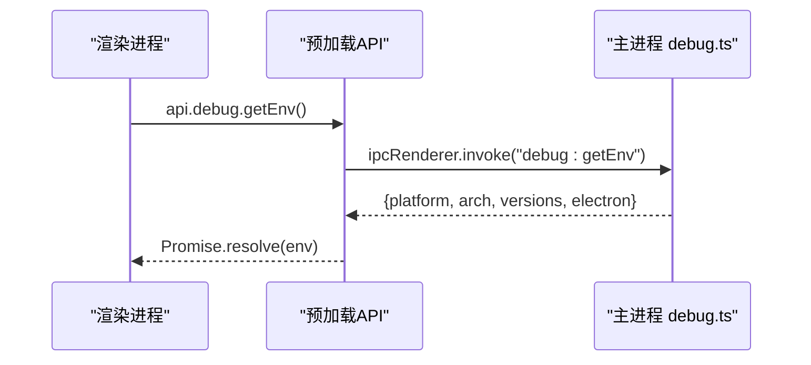
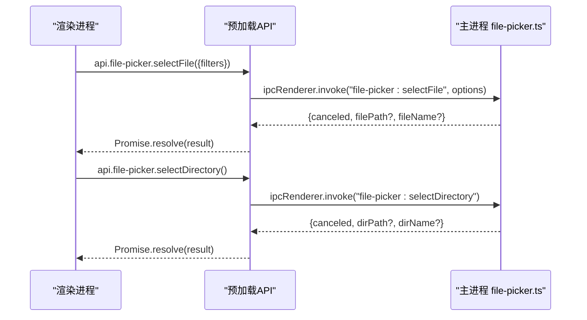
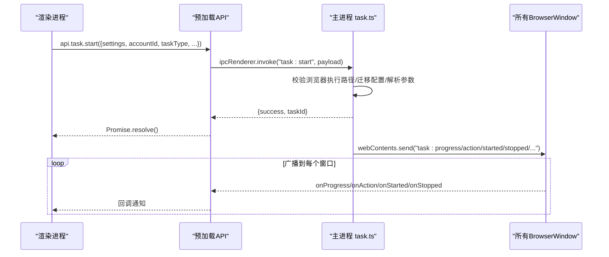
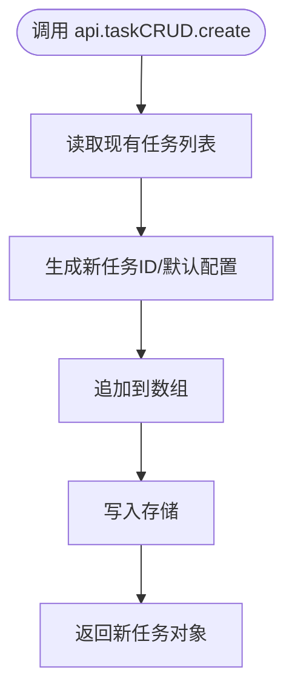
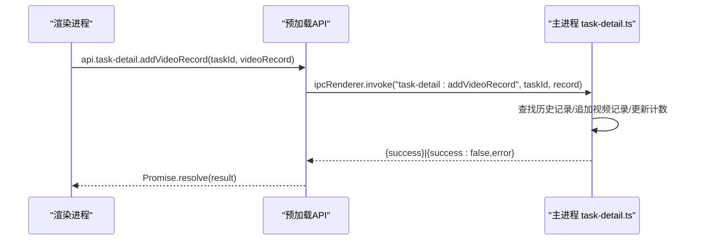
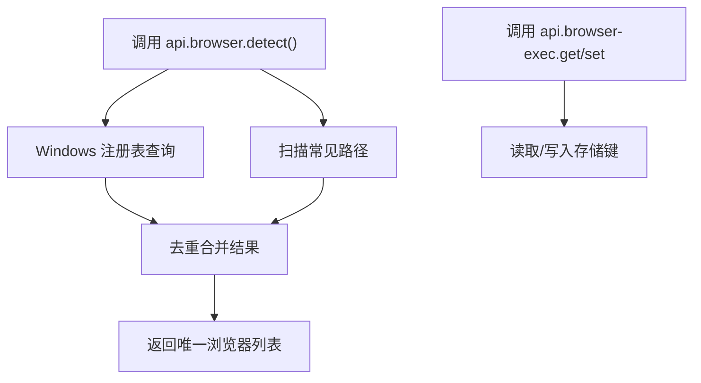
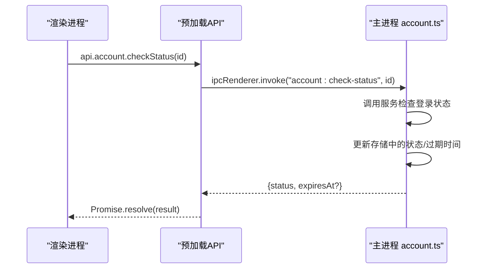
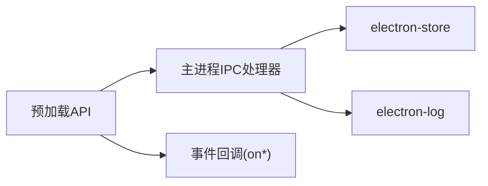

# 调试监控IPC

<cite>
**本文引用的文件**
- [src/main/ipc/debug.ts](file://src/main/ipc/debug.ts)
- [src/main/ipc/file-picker.ts](file://src/main/ipc/file-picker.ts)
- [src/main/ipc/task.ts](file://src/main/ipc/task.ts)
- [src/main/ipc/task-crud.ts](file://src/main/ipc/task-crud.ts)
- [src/main/ipc/task-detail.ts](file://src/main/ipc/task-detail.ts)
- [src/main/ipc/task-history.ts](file://src/main/ipc/task-history.ts)
- [src/main/ipc/account.ts](file://src/main/ipc/account.ts)
- [src/main/ipc/auth.ts](file://src/main/ipc/auth.ts)
- [src/main/ipc/browser-detect.ts](file://src/main/ipc/browser-detect.ts)
- [src/main/ipc/browser-exec.ts](file://src/main/ipc/browser-exec.ts)
- [src/main/index.ts](file://src/main/index.ts)
- [src/preload/index.ts](file://src/preload/index.ts)
- [src/main/utils/storage.ts](file://src/main/utils/storage.ts)
- [src/shared/platform.ts](file://src/shared/platform.ts)
- [src/shared/task.ts](file://src/shared/task.ts)
- [src/shared/task-history.ts](file://src/shared/task-history.ts)
- [package.json](file://package.json)
</cite>

## 目录
1. [简介](#简介)
2. [项目结构](#项目结构)
3. [核心组件](#核心组件)
4. [架构总览](#架构总览)
5. [详细组件分析](#详细组件分析)
6. [依赖关系分析](#依赖关系分析)
7. [性能与监控](#性能与监控)
8. [故障排查指南](#故障排查指南)
9. [结论](#结论)
10. [附录](#附录)

## 简介
本文件聚焦AutoOps的调试监控IPC通信模块，系统性阐述以下内容：
- 调试信息采集、日志输出与错误追踪的IPC实现机制
- 文件选择器IPC接口设计（文件浏览、路径选择、权限验证）
- 调试模式下的通信优化、性能监控与资源使用统计
- 错误报告、异常捕获与堆栈追踪的IPC传输机制
- 开发与生产环境的调试差异、配置管理与安全考量
- 具体调试API使用示例、日志格式与监控指标
- 调试技巧、性能分析与问题诊断最佳实践

## 项目结构
AutoOps采用Electron主进程与渲染进程通过IPC通信的分层架构。主进程负责业务逻辑与系统级能力（如对话框、浏览器检测、任务调度），渲染进程负责UI与用户交互，并通过预加载脚本暴露统一的API桥接。

```mermaid
graph TB
subgraph "渲染进程"
UI["Vue 应用<br/>用户界面"]
Preload["预加载脚本<br/>contextBridge 暴露 api"]
end
subgraph "主进程"
Main["主入口<br/>注册所有IPC处理器"]
IPC_Debug["调试IPC<br/>debug.ts"]
IPC_File["文件选择器IPC<br/>file-picker.ts"]
IPC_Task["任务IPC<br/>task.ts"]
IPC_TaskCRUD["任务CRUD IPC<br/>task-crud.ts"]
IPC_TaskDetail["任务详情IPC<br/>task-detail.ts"]
IPC_TaskHistory["任务历史IPC<br/>task-history.ts"]
IPC_Account["账号IPC<br/>account.ts"]
IPC_Auth["认证IPC<br/>auth.ts"]
IPC_BrowserDetect["浏览器检测IPC<br/>browser-detect.ts"]
IPC_BrowserExec["浏览器执行路径IPC<br/>browser-exec.ts"]
end
UI --> Preload
Preload <- --> Main
Main --> IPC_Debug
Main --> IPC_File
Main --> IPC_Task
Main --> IPC_TaskCRUD
Main --> IPC_TaskDetail
Main --> IPC_TaskHistory
Main --> IPC_Account
Main --> IPC_Auth
Main --> IPC_BrowserDetect
Main --> IPC_BrowserExec
```

图表来源
- [src/main/index.ts:54-79](file://src/main/index.ts#L54-L79)
- [src/preload/index.ts:131-234](file://src/preload/index.ts#L131-L234)

章节来源
- [src/main/index.ts:1-106](file://src/main/index.ts#L1-L106)
- [src/preload/index.ts:1-235](file://src/preload/index.ts#L1-L235)

## 核心组件
- 调试IPC：提供运行时环境信息查询，便于快速定位平台、架构与Electron版本等信息。
- 文件选择器IPC：封装原生对话框，支持文件与目录选择，返回基础元数据。
- 任务IPC：集中处理任务生命周期、并发控制、队列与定时调度，同时向渲染进程广播事件。
- 任务CRUD与历史/详情IPC：持久化与模板管理，配合历史记录与视频操作记录。
- 浏览器检测与执行路径IPC：自动发现可用浏览器并持久化执行路径。
- 认证与账号IPC：提供认证状态查询与账号状态检查。
- 预加载API桥：统一暴露渲染进程可调用的IPC方法签名。

章节来源
- [src/main/ipc/debug.ts:1-12](file://src/main/ipc/debug.ts#L1-L12)
- [src/main/ipc/file-picker.ts:1-37](file://src/main/ipc/file-picker.ts#L1-L37)
- [src/main/ipc/task.ts:1-245](file://src/main/ipc/task.ts#L1-L245)
- [src/main/ipc/task-crud.ts:1-108](file://src/main/ipc/task-crud.ts#L1-L108)
- [src/main/ipc/task-detail.ts:1-39](file://src/main/ipc/task-detail.ts#L1-L39)
- [src/main/ipc/task-history.ts:1-45](file://src/main/ipc/task-history.ts#L1-L45)
- [src/main/ipc/browser-detect.ts:1-118](file://src/main/ipc/browser-detect.ts#L1-L118)
- [src/main/ipc/browser-exec.ts:1-13](file://src/main/ipc/browser-exec.ts#L1-L13)
- [src/main/ipc/auth.ts:1-23](file://src/main/ipc/auth.ts#L1-L23)
- [src/main/ipc/account.ts:1-128](file://src/main/ipc/account.ts#L1-L128)
- [src/preload/index.ts:14-234](file://src/preload/index.ts#L14-L234)

## 架构总览
下图展示从渲染进程发起请求到主进程处理并回传响应的典型链路，以及主进程内部事件广播机制。



图表来源
- [src/preload/index.ts:138-162](file://src/preload/index.ts#L138-L162)
- [src/main/ipc/task.ts:81-134](file://src/main/ipc/task.ts#L81-L134)
- [src/main/ipc/task.ts:22-76](file://src/main/ipc/task.ts#L22-L76)

章节来源
- [src/main/ipc/task.ts:1-245](file://src/main/ipc/task.ts#L1-L245)
- [src/preload/index.ts:131-234](file://src/preload/index.ts#L131-L234)

## 详细组件分析

### 调试IPC（debug:getEnv）
- 功能：返回当前运行平台、架构、Node/Electron版本等环境信息，用于快速诊断。
- 使用场景：开发者面板、崩溃报告、环境自检。
- 安全性：仅返回公开信息，不涉及敏感数据。
- 性能：纯内存查询，开销极低。



图表来源
- [src/main/ipc/debug.ts:3-12](file://src/main/ipc/debug.ts#L3-L12)
- [src/preload/index.ts:229-231](file://src/preload/index.ts#L229-L231)

章节来源
- [src/main/ipc/debug.ts:1-12](file://src/main/ipc/debug.ts#L1-L12)
- [src/preload/index.ts:120-122](file://src/preload/index.ts#L120-L122)

### 文件选择器IPC（file-picker）
- 接口设计：
  - 选择文件：支持过滤器，返回取消标记、文件路径与文件名。
  - 选择目录：返回取消标记、目录路径与目录名。
- 权限与安全：
  - 基于Electron dialog的原生能力，遵循操作系统权限模型。
  - 返回值不含文件内容，仅路径与基础元数据，避免越权读取。
- 可靠性：对空结果与取消进行显式分支处理，保证调用方行为一致。



图表来源
- [src/main/ipc/file-picker.ts:4-37](file://src/main/ipc/file-picker.ts#L4-L37)
- [src/preload/index.ts:198-201](file://src/preload/index.ts#L198-L201)

章节来源
- [src/main/ipc/file-picker.ts:1-37](file://src/main/ipc/file-picker.ts#L1-L37)
- [src/preload/index.ts:81-92](file://src/preload/index.ts#L81-L92)

### 任务IPC（task）与事件广播
- 生命周期与并发：
  - 启动/停止/暂停/恢复/状态查询/并发控制/队列管理/定时调度。
  - 通过事件总线向所有BrowserWindow广播进度、动作、开始/结束等事件。
- 日志与错误：
  - 统一使用electron-log记录关键路径输入与错误，便于审计与排障。
  - 对异常进行捕获并返回结构化错误信息，避免崩溃传播。
- 数据一致性：
  - 通过全局单例管理器确保跨调用状态一致；必要时重置或重建实例。



图表来源
- [src/main/ipc/task.ts:81-134](file://src/main/ipc/task.ts#L81-L134)
- [src/main/ipc/task.ts:22-76](file://src/main/ipc/task.ts#L22-L76)
- [src/preload/index.ts:154-161](file://src/preload/index.ts#L154-L161)

章节来源
- [src/main/ipc/task.ts:1-245](file://src/main/ipc/task.ts#L1-L245)
- [src/preload/index.ts:14-45](file://src/preload/index.ts#L14-L45)

### 任务CRUD与模板IPC（task-crud）
- 能力范围：
  - 获取全部/按ID/按账号/按平台筛选任务。
  - 创建/更新/删除/复制任务。
  - 保存/删除任务模板。
- 存储后端：基于electron-store，键空间见storage.ts。
- 一致性：更新/删除均写回存储，返回最新状态或成功标志。



图表来源
- [src/main/ipc/task-crud.ts:29-44](file://src/main/ipc/task-crud.ts#L29-L44)
- [src/main/utils/storage.ts:16-29](file://src/main/utils/storage.ts#L16-L29)

章节来源
- [src/main/ipc/task-crud.ts:1-108](file://src/main/ipc/task-crud.ts#L1-L108)
- [src/main/utils/storage.ts:1-53](file://src/main/utils/storage.ts#L1-L53)

### 任务历史与详情IPC（task-history / task-detail）
- 历史记录：
  - 获取全部/按ID获取/新增/更新/删除/清空。
- 详情扩展：
  - 追加视频记录（含评论计数联动）、更新任务状态（自动填充结束时间）。



图表来源
- [src/main/ipc/task-detail.ts:12-24](file://src/main/ipc/task-detail.ts#L12-L24)
- [src/main/ipc/task-history.ts:16-21](file://src/main/ipc/task-history.ts#L16-L21)

章节来源
- [src/main/ipc/task-history.ts:1-45](file://src/main/ipc/task-history.ts#L1-L45)
- [src/main/ipc/task-detail.ts:1-39](file://src/main/ipc/task-detail.ts#L1-L39)

### 浏览器检测与执行路径IPC
- 检测策略：
  - Windows：注册表查询 + 常见路径探测，提取版本号。
  - macOS/Linux：常见安装路径探测。
- 执行路径：
  - 读取/设置浏览器可执行路径，供任务启动时使用。
- 安全与兼容：
  - 严格存在性校验，避免无效路径写入。
  - 版本号仅在Windows有效，其他平台返回占位值。



图表来源
- [src/main/ipc/browser-detect.ts:105-117](file://src/main/ipc/browser-detect.ts#L105-L117)
- [src/main/ipc/browser-exec.ts:4-13](file://src/main/ipc/browser-exec.ts#L4-L13)

章节来源
- [src/main/ipc/browser-detect.ts:1-118](file://src/main/ipc/browser-detect.ts#L1-L118)
- [src/main/ipc/browser-exec.ts:1-13](file://src/main/ipc/browser-exec.ts#L1-L13)

### 认证与账号IPC
- 认证：
  - hasAuth/getAuth/login/logout，基于存储键管理。
- 账号：
  - 列表/增删改/设默认/查默认/按平台筛选/活跃账号。
  - 单个账号状态检查与批量检查，异步更新状态并持久化。



图表来源
- [src/main/ipc/account.ts:102-121](file://src/main/ipc/account.ts#L102-L121)
- [src/preload/index.ts:183-194](file://src/preload/index.ts#L183-L194)

章节来源
- [src/main/ipc/auth.ts:1-23](file://src/main/ipc/auth.ts#L1-L23)
- [src/main/ipc/account.ts:1-128](file://src/main/ipc/account.ts#L1-L128)

## 依赖关系分析
- IPC注册顺序：主入口集中注册所有处理器，确保渲染进程初始化前完成桥接。
- 预加载API：统一暴露invoke与事件监听，屏蔽底层通道细节。
- 存储层：统一通过electron-store访问，键空间明确，便于调试与迁移。
- 日志：主进程统一使用electron-log，渲染侧通过ipcMain转发日志级别。



图表来源
- [src/main/index.ts:54-79](file://src/main/index.ts#L54-L79)
- [src/preload/index.ts:125-129](file://src/preload/index.ts#L125-L129)
- [src/main/utils/storage.ts:16-29](file://src/main/utils/storage.ts#L16-L29)

章节来源
- [src/main/index.ts:17-106](file://src/main/index.ts#L17-L106)
- [src/preload/index.ts:131-234](file://src/preload/index.ts#L131-L234)
- [src/main/utils/storage.ts:1-53](file://src/main/utils/storage.ts#L1-L53)

## 性能与监控
- 调试模式通信优化建议
  - 事件聚合：对高频事件（如进度）进行节流/去抖，减少渲染压力。
  - 分通道广播：仅向需要的任务窗口发送事件，避免全量广播。
  - 结构化日志：统一字段（如任务ID、时间戳、阶段）便于索引与检索。
- 性能监控指标
  - 任务启动延迟：从invoke到首次事件的时间。
  - 事件吞吐：单位时间内事件数量与大小。
  - 存储写入频率：任务/历史/模板变更的QPS。
- 资源使用统计
  - 通过Node进程监控（如os、process）与第三方库（如进程级采样）结合，避免在IPC路径内直接进行高成本计算。
- 生产环境注意事项
  - 默认关闭冗余日志，仅保留关键错误与警告。
  - 限制事件广播范围，避免跨窗口通信带来的上下文切换开销。

[本节为通用指导，无需具体文件引用]

## 故障排查指南
- 渲染进程日志上报
  - 渲染侧通过ipcMain接收日志消息并按级别转发至electron-log，便于统一收集。
- 常见问题定位
  - 任务启动失败：检查浏览器执行路径是否配置；查看主进程日志中的错误堆栈。
  - 事件未到达：确认预加载API是否正确注册事件监听；检查主进程是否向所有窗口广播。
  - 文件选择无响应：确认操作系统权限与对话框返回值；避免在取消情况下误读路径。
- 错误报告与堆栈追踪
  - 主进程对关键路径进行try/catch并记录错误；返回结构化错误信息给渲染进程。
  - 建议在渲染侧捕获Promise拒绝并上报，形成端到端追踪链路。

章节来源
- [src/main/index.ts:92-106](file://src/main/index.ts#L92-L106)
- [src/main/ipc/task.ts:130-133](file://src/main/ipc/task.ts#L130-L133)
- [src/main/ipc/file-picker.ts:11-13](file://src/main/ipc/file-picker.ts#L11-L13)

## 结论
AutoOps的调试监控IPC以“轻量、统一、可观测”为核心设计原则：通过预加载API屏蔽IPC细节，主进程集中处理业务与日志，渲染进程专注UI与交互。文件选择器与任务生命周期的IPC接口清晰、健壮，配合electron-log与事件广播，能够满足开发与生产环境的调试需求。建议在生产环境中进一步完善事件聚合、日志分级与资源监控，持续提升稳定性与可观测性。

[本节为总结，无需具体文件引用]

## 附录

### 调试API使用示例（路径指引）
- 获取运行环境信息
  - 渲染侧调用：[src/preload/index.ts:229-231](file://src/preload/index.ts#L229-L231)
  - 主进程处理：[src/main/ipc/debug.ts:3-12](file://src/main/ipc/debug.ts#L3-L12)
- 文件选择
  - 渲染侧调用：[src/preload/index.ts:198-201](file://src/preload/index.ts#L198-L201)
  - 主进程处理：[src/main/ipc/file-picker.ts:4-37](file://src/main/ipc/file-picker.ts#L4-L37)
- 任务启动与事件监听
  - 渲染侧调用：[src/preload/index.ts:138-162](file://src/preload/index.ts#L138-L162)
  - 主进程处理：[src/main/ipc/task.ts:81-134](file://src/main/ipc/task.ts#L81-L134)
  - 事件广播：[src/main/ipc/task.ts:22-76](file://src/main/ipc/task.ts#L22-L76)

### 日志格式与监控指标
- 日志格式建议
  - 时间戳、通道、级别、消息体、附加上下文（如任务ID、账号ID）。
  - 渲染侧转发：[src/main/index.ts:92-106](file://src/main/index.ts#L92-L106)
- 监控指标
  - 任务启动/停止/错误率、事件延迟分布、存储写入耗时、CPU/内存占用（结合外部采样）。

### 开发与生产环境差异
- 开发环境
  - 更详细的日志与断点；允许更宽松的权限与调试接口。
- 生产环境
  - 关闭冗余日志；限制事件广播范围；启用错误上报与告警。

### 安全考虑
- 文件选择器：仅返回路径与基础元数据，避免读取文件内容。
- 浏览器路径：严格存在性校验，避免注入无效路径。
- 认证与账号：避免在日志中打印敏感信息；对状态变更进行幂等处理。

章节来源
- [src/main/ipc/file-picker.ts:11-19](file://src/main/ipc/file-picker.ts#L11-L19)
- [src/main/ipc/browser-exec.ts:9-12](file://src/main/ipc/browser-exec.ts#L9-L12)
- [src/main/ipc/auth.ts:5-8](file://src/main/ipc/auth.ts#L5-L8)