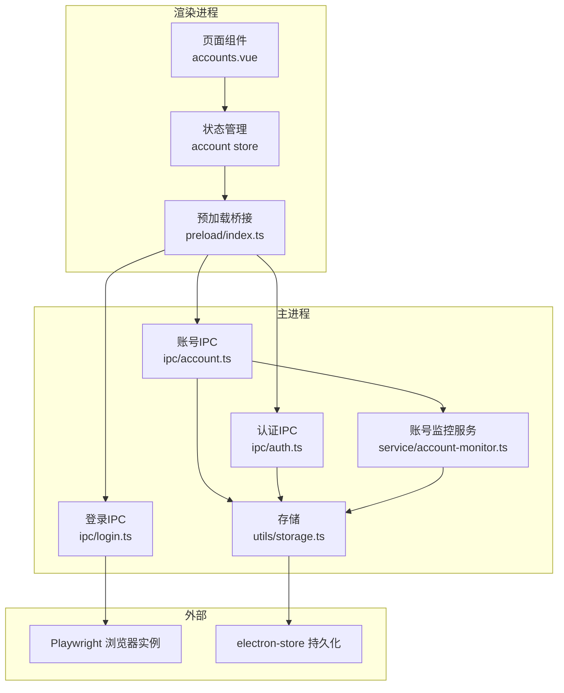
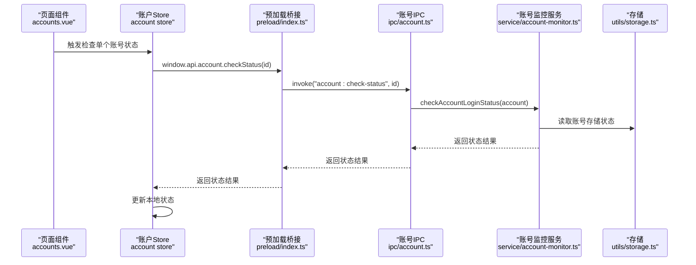
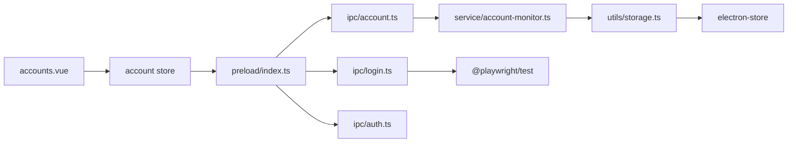

# 账号管理IPC

<cite>
**本文引用的文件**
- [src/main/ipc/account.ts](file://src/main/ipc/account.ts)
- [src/main/ipc/auth.ts](file://src/main/ipc/auth.ts)
- [src/main/ipc/login.ts](file://src/main/ipc/login.ts)
- [src/main/service/account-monitor.ts](file://src/main/service/account-monitor.ts)
- [src/main/utils/storage.ts](file://src/main/utils/storage.ts)
- [src/shared/account.ts](file://src/shared/account.ts)
- [src/shared/platform.ts](file://src/shared/platform.ts)
- [src/renderer/src/stores/account.ts](file://src/renderer/src/stores/account.ts)
- [src/preload/index.ts](file://src/preload/index.ts)
- [src/renderer/src/pages/accounts.vue](file://src/renderer/src/pages/accounts.vue)
- [package.json](file://package.json)
</cite>

## 目录
1. [简介](#简介)
2. [项目结构](#项目结构)
3. [核心组件](#核心组件)
4. [架构总览](#架构总览)
5. [详细组件分析](#详细组件分析)
6. [依赖关系分析](#依赖关系分析)
7. [性能考量](#性能考量)
8. [故障排除指南](#故障排除指南)
9. [结论](#结论)
10. [附录：API参考与最佳实践](#附录api参考与最佳实践)

## 简介
本技术文档聚焦AutoOps的账号管理IPC通信模块，系统性阐述账号CRUD操作的IPC接口设计、登录认证流程的IPC实现、账号状态同步与登录状态检查、权限验证机制，以及多账号支持的IPC架构设计（含账号切换、状态管理与数据隔离）。文档同时提供API调用示例、参数格式、返回值结构说明，并总结安全考虑、错误处理与用户体验优化的最佳实践。

## 项目结构
账号管理相关代码主要分布在以下层次：
- 主进程IPC层：负责注册与处理IPC通道，封装业务逻辑（账号CRUD、登录态检查、认证状态维护）。
- 渲染进程预加载层：通过contextBridge暴露受控API给渲染进程，统一管理IPC调用。
- 渲染进程状态层：Pinia Store集中管理账号列表、当前账号、默认账号等状态。
- 共享类型层：定义账号、平台、登录结果等跨层数据结构。
- 存储层：基于electron-store持久化账号、认证、浏览器执行路径等配置。
- 登录服务层：Playwright驱动浏览器进行登录流程，提取用户信息与Cookie状态。

图表来源
- [src/renderer/src/pages/accounts.vue:110-139](file://src/renderer/src/pages/accounts.vue#L110-L139)
- [src/renderer/src/stores/account.ts:41-127](file://src/renderer/src/stores/account.ts#L41-L127)
- [src/preload/index.ts:130-234](file://src/preload/index.ts#L130-L234)
- [src/main/ipc/account.ts:32-127](file://src/main/ipc/account.ts#L32-L127)
- [src/main/ipc/login.ts:85-192](file://src/main/ipc/login.ts#L85-L192)
- [src/main/ipc/auth.ts:4-23](file://src/main/ipc/auth.ts#L4-L23)
- [src/main/service/account-monitor.ts:17-109](file://src/main/service/account-monitor.ts#L17-L109)
- [src/main/utils/storage.ts:16-53](file://src/main/utils/storage.ts#L16-L53)

章节来源
- [src/main/ipc/account.ts:1-128](file://src/main/ipc/account.ts#L1-L128)
- [src/main/ipc/login.ts:1-193](file://src/main/ipc/login.ts#L1-L193)
- [src/main/ipc/auth.ts:1-23](file://src/main/ipc/auth.ts#L1-L23)
- [src/main/service/account-monitor.ts:1-110](file://src/main/service/account-monitor.ts#L1-L110)
- [src/main/utils/storage.ts:1-53](file://src/main/utils/storage.ts#L1-L53)
- [src/shared/account.ts:1-39](file://src/shared/account.ts#L1-L39)
- [src/shared/platform.ts:1-260](file://src/shared/platform.ts#L1-L260)
- [src/renderer/src/stores/account.ts:1-128](file://src/renderer/src/stores/account.ts#L1-L128)
- [src/preload/index.ts:1-234](file://src/preload/index.ts#L1-L234)
- [src/renderer/src/pages/accounts.vue:1-289](file://src/renderer/src/pages/accounts.vue#L1-L289)
- [package.json:16-34](file://package.json#L16-L34)

## 核心组件
- 账号IPC处理器：提供账号列表、新增、更新、删除、设置默认、按平台筛选、获取默认、按ID查询、获取活跃账号、检查单个账号状态、批量检查状态等接口。
- 登录IPC处理器：通过Playwright启动浏览器，引导用户登录，提取用户昵称、头像、唯一标识与Cookie序列化状态，返回给渲染进程用于创建账号。
- 认证IPC处理器：维护应用级认证状态（如管理员或开发者模式），提供存在性检查、登录、登出、获取认证数据。
- 账号监控服务：解析账号存储的Cookie状态，计算最早过期时间，判定登录态是否有效、即将过期或已过期，并可批量推送状态变更到渲染进程。
- 预加载桥接：在渲染进程暴露受控API，统一映射到主进程IPC通道，确保安全与类型约束。
- 渲染进程Store：集中管理账号列表、当前账号、默认账号、按平台分组、状态检查与批量检查。
- 共享类型：定义Account、AccountListItem、平台枚举、登录结果等跨层数据结构。

章节来源
- [src/main/ipc/account.ts:32-127](file://src/main/ipc/account.ts#L32-L127)
- [src/main/ipc/login.ts:85-192](file://src/main/ipc/login.ts#L85-L192)
- [src/main/ipc/auth.ts:4-23](file://src/main/ipc/auth.ts#L4-L23)
- [src/main/service/account-monitor.ts:17-109](file://src/main/service/account-monitor.ts#L17-L109)
- [src/renderer/src/stores/account.ts:19-127](file://src/renderer/src/stores/account.ts#L19-L127)
- [src/preload/index.ts:130-234](file://src/preload/index.ts#L130-L234)
- [src/shared/account.ts:3-39](file://src/shared/account.ts#L3-L39)
- [src/shared/platform.ts:1-260](file://src/shared/platform.ts#L1-L260)

## 架构总览
账号管理IPC采用“渲染进程调用预加载桥接，预加载桥接转发到主进程IPC处理器，主进程IPC处理器调用服务层或存储层”的分层设计。登录流程通过Playwright在独立上下文捕获Cookie与用户信息，再由IPC返回渲染进程创建账号记录；状态检查通过解析Cookie过期时间实现，支持单个与批量检查，并向渲染进程广播状态更新。

图表来源
- [src/renderer/src/pages/accounts.vue:141-148](file://src/renderer/src/pages/accounts.vue#L141-L148)
- [src/renderer/src/stores/account.ts:84-98](file://src/renderer/src/stores/account.ts#L84-L98)
- [src/preload/index.ts:192-193](file://src/preload/index.ts#L192-L193)
- [src/main/ipc/account.ts:102-121](file://src/main/ipc/account.ts#L102-L121)
- [src/main/service/account-monitor.ts:17-75](file://src/main/service/account-monitor.ts#L17-L75)
- [src/main/utils/storage.ts:16-53](file://src/main/utils/storage.ts#L16-L53)

## 详细组件分析

### 账号CRUD IPC接口设计
- 接口清单与职责
  - 列表查询：返回全部账号。
  - 新增账号：生成唯一ID、创建时间戳、首个账号自动设为默认、状态初始化。
  - 更新账号：按ID部分更新字段。
  - 删除账号：过滤掉目标ID；若删除后无默认账号则将首个账号设为默认。
  - 设置默认账号：将指定ID设为默认，其他账号取消默认标记。
  - 获取默认账号：返回标记为默认的账号或首个账号。
  - 按ID查询：根据ID查找账号。
  - 按平台查询：返回该平台的所有账号。
  - 获取活跃账号：返回状态为“active”的账号。
  - 检查单个账号状态：解析Cookie过期时间，更新本地状态并返回结果。
  - 批量检查所有账号状态：遍历账号，逐一检查并更新，最后广播状态更新事件。

- 数据模型与复杂度
  - 账号对象包含平台、昵称、头像、存储状态、Cookie、创建时间、默认标记、状态、过期时间等字段。
  - CRUD操作的时间复杂度为O(n)，其中n为账号数量；批量检查为O(n)遍历与解析Cookie。
  - 状态更新写入存储为O(1)写操作，但涉及数组查找与更新，整体为O(n)。

- 错误处理
  - 未找到账号时抛出错误或返回明确提示。
  - 状态检查异常时返回“检查失败”状态，避免中断流程。

章节来源
- [src/main/ipc/account.ts:32-127](file://src/main/ipc/account.ts#L32-L127)
- [src/shared/account.ts:3-39](file://src/shared/account.ts#L3-L39)
- [src/main/utils/storage.ts:33-53](file://src/main/utils/storage.ts#L33-L53)

### 登录认证流程的IPC实现
- 登录入口与流程
  - 渲染进程触发登录：调用window.api.login.douyin()。
  - 预加载桥接转发到主进程IPC通道“login:douyin”。
  - 主进程使用@playwright/test启动临时用户目录的浏览器实例，访问目标平台首页，等待用户完成登录动作。
  - 提取用户昵称、头像、唯一标识，收集Cookie并序列化为storageState。
  - 返回登录结果（包含success、storageState、userInfo、error）给渲染进程。
  - 渲染进程将storageState与用户信息组合为账号数据，调用IPC新增账号。

- Cookie与会话维持
  - 登录完成后从上下文导出Cookies，序列化为包含name、value、domain、path、expires、httpOnly、secure、sameSite的结构。
  - 后续状态检查通过解析storageState中的Cookie过期时间判断登录态有效性。

- 自动登录机制
  - 当首次添加账号时，若无默认账号则自动设为默认；后续可通过设置默认账号接口切换。
  - 批量检查状态时，仅对“active”或“expired”的账号进行检查，减少无效请求。

- OAuth授权与第三方集成
  - 当前实现通过浏览器登录流程采集Cookie，未直接展示OAuth授权码交换细节；如需OAuth，可在登录流程中增加授权页跳转与回调处理，随后将授权令牌与Cookie合并保存。

章节来源
- [src/main/ipc/login.ts:85-192](file://src/main/ipc/login.ts#L85-L192)
- [src/renderer/src/pages/accounts.vue:110-139](file://src/renderer/src/pages/accounts.vue#L110-L139)
- [src/preload/index.ts:194-196](file://src/preload/index.ts#L194-L196)
- [src/main/service/account-monitor.ts:17-75](file://src/main/service/account-monitor.ts#L17-L75)

### 账号状态同步、登录状态检查与权限验证
- 状态同步机制
  - 单个检查：渲染进程调用window.api.account.checkStatus(id)，主进程解析storageState并返回状态与过期时间，Store更新本地状态。
  - 批量检查：渲染进程调用window.api.account.checkAllStatus()，主进程遍历账号逐一检查，更新存储并广播“account:statusUpdate”事件到所有窗口，实现全局状态同步。

- 登录状态检查算法
  - 解析storageState中的cookies数组，匹配关键登录态Cookie名称集合。
  - 记录最早过期时间，若无过期时间则视为会话Cookie，状态为“active”。
  - 若最早过期时间小于等于当前时间，则状态为“expired”，否则根据剩余时间判断“expired”或“active”。

- 权限验证
  - 应用级认证：通过auth:hasAuth、auth:login、auth:logout、auth:getAuth维护全局认证状态，可用于限制某些功能或页面访问。
  - 账号级权限：当前未实现细粒度权限控制，建议在Account模型中扩展角色字段，并在IPC层增加权限校验逻辑。

章节来源
- [src/main/ipc/account.ts:102-127](file://src/main/ipc/account.ts#L102-L127)
- [src/main/service/account-monitor.ts:17-109](file://src/main/service/account-monitor.ts#L17-L109)
- [src/main/ipc/auth.ts:4-23](file://src/main/ipc/auth.ts#L4-L23)
- [src/renderer/src/stores/account.ts:84-105](file://src/renderer/src/stores/account.ts#L84-L105)

### 多账号支持的IPC架构设计
- 账号切换
  - 通过set default接口将某账号标记为默认，Store在渲染进程更新currentAccountId，页面组件响应变化。
  - 当删除默认账号时，自动将第一个非默认账号设为默认，保证始终存在默认账号。

- 状态管理
  - Store维护accounts、currentAccountId、defaultAccount、accountsByPlatform等计算属性，便于UI层按平台分组展示与操作。
  - 批量检查时，Store并发发起检查请求，提升用户体验。

- 数据隔离
  - 每个账号独立保存storageState与Cookies，主进程存储层以数组形式持久化，不同账号之间互不干扰。
  - 平台维度隔离：按platform字段区分不同平台账号，Store提供按平台分组视图。

章节来源
- [src/main/ipc/account.ts:72-84](file://src/main/ipc/account.ts#L72-L84)
- [src/renderer/src/stores/account.ts:19-127](file://src/renderer/src/stores/account.ts#L19-L127)
- [src/shared/platform.ts:1-260](file://src/shared/platform.ts#L1-L260)

## 依赖关系分析
- 组件耦合
  - 渲染进程Store依赖预加载桥接API；预加载桥接依赖主进程IPC通道；IPC通道依赖服务层与存储层。
  - 账号监控服务与存储层耦合，用于读取与更新账号状态。
  - 登录IPC依赖Playwright运行时环境，需要正确配置浏览器执行路径。

- 外部依赖
  - Playwright用于浏览器自动化登录与状态采集。
  - electron-store用于键值存储，包含账号、认证、任务历史等键。
  - electron-log用于日志记录，便于问题定位。

图表来源
- [src/renderer/src/pages/accounts.vue:110-139](file://src/renderer/src/pages/accounts.vue#L110-L139)
- [src/renderer/src/stores/account.ts:41-127](file://src/renderer/src/stores/account.ts#L41-L127)
- [src/preload/index.ts:130-234](file://src/preload/index.ts#L130-L234)
- [src/main/ipc/account.ts:32-127](file://src/main/ipc/account.ts#L32-L127)
- [src/main/ipc/login.ts:85-192](file://src/main/ipc/login.ts#L85-L192)
- [src/main/ipc/auth.ts:4-23](file://src/main/ipc/auth.ts#L4-L23)
- [src/main/service/account-monitor.ts:17-109](file://src/main/service/account-monitor.ts#L17-L109)
- [src/main/utils/storage.ts:16-53](file://src/main/utils/storage.ts#L16-L53)

章节来源
- [package.json:16-34](file://package.json#L16-L34)
- [src/main/ipc/account.ts:1-128](file://src/main/ipc/account.ts#L1-L128)
- [src/main/ipc/login.ts:1-193](file://src/main/ipc/login.ts#L1-L193)
- [src/main/ipc/auth.ts:1-23](file://src/main/ipc/auth.ts#L1-L23)
- [src/main/service/account-monitor.ts:1-110](file://src/main/service/account-monitor.ts#L1-L110)
- [src/main/utils/storage.ts:1-53](file://src/main/utils/storage.ts#L1-L53)

## 性能考量
- 批量状态检查：使用Promise.all并发检查活跃与即将过期的账号，减少总耗时。
- 存储读写：状态检查与更新均通过存储层进行，注意避免频繁写入；可考虑节流或去抖策略。
- 浏览器实例：登录流程使用临时用户目录，避免与常规会话冲突；合理关闭上下文释放资源。
- UI响应：渲染进程在检查期间禁用按钮并显示加载状态，提升用户体验。

[本节为通用性能建议，无需特定文件引用]

## 故障排除指南
- 登录失败
  - 检查浏览器执行路径是否正确配置；若未配置，登录流程会返回错误提示。
  - 确认网络连通性与目标平台首页可达；超时或URL等待失败会导致检查阶段异常。
  - 查看日志输出，定位具体错误位置。

- 状态检查异常
  - 若storageState为空或格式异常，状态检查会返回“检查失败”；请重新登录并生成新的storageState。
  - Cookie缺失或无法解析时，状态为“未找到登录Cookie”。

- 默认账号丢失
  - 删除最后一个账号时会自动选择新的默认账号；若出现异常，可手动设置默认账号。

章节来源
- [src/main/ipc/login.ts:89-91](file://src/main/ipc/login.ts#L89-L91)
- [src/main/service/account-monitor.ts:18-30](file://src/main/service/account-monitor.ts#L18-L30)
- [src/main/ipc/account.ts:62-70](file://src/main/ipc/account.ts#L62-L70)

## 结论
AutoOps的账号管理IPC模块通过清晰的分层设计实现了账号CRUD、登录态检查与状态同步，结合Playwright的浏览器自动化能力，提供了可靠的账号登录与状态管理方案。多平台支持通过平台枚举与配置实现，Store层提供了良好的UI交互体验。未来可在权限验证、OAuth集成、状态缓存与去抖等方面进一步优化。

[本节为总结性内容，无需特定文件引用]

## 附录：API参考与最佳实践

### API调用示例与参数格式
- 账号管理
  - 列表查询：调用window.api.account.list()，返回账号数组。
  - 新增账号：调用window.api.account.add(accountData)，accountData包含平台、昵称、头像、storageState等字段。
  - 更新账号：调用window.api.account.update(id, updates)，updates为部分字段更新。
  - 删除账号：调用window.api.account.delete(id)。
  - 设置默认：调用window.api.account.setDefault(id)。
  - 获取默认：调用window.api.account.getDefault()。
  - 按ID查询：调用window.api.account.getById(id)。
  - 按平台查询：调用window.api.account.getByPlatform(platform)。
  - 获取活跃账号：调用window.api.account.getActiveAccounts()。
  - 检查单个账号状态：调用window.api.account.checkStatus(id)，返回{ status, expiresAt? }。
  - 批量检查状态：调用window.api.account.checkAllStatus()。

- 登录
  - 登录抖音：调用window.api.login.douyin()，返回{ success, storageState?, userInfo?, error? }。

- 认证
  - 是否已认证：调用window.api.auth.hasAuth()。
  - 登录：调用window.api.auth.login(authData)。
  - 登出：调用window.api.auth.logout()。
  - 获取认证：调用window.api.auth.getAuth()。

章节来源
- [src/preload/index.ts:65-79](file://src/preload/index.ts#L65-L79)
- [src/preload/index.ts:130-234](file://src/preload/index.ts#L130-L234)
- [src/main/ipc/account.ts:32-127](file://src/main/ipc/account.ts#L32-L127)
- [src/main/ipc/login.ts:85-192](file://src/main/ipc/login.ts#L85-L192)
- [src/main/ipc/auth.ts:4-23](file://src/main/ipc/auth.ts#L4-L23)

### 返回值结构
- 账号对象(Account)
  - 字段：id、name、platform、platformAccountId?、avatar?、storageState、cookies?、createdAt、isDefault、status、expiresAt?
  - 状态：'active' | 'inactive' | 'expired' | 'checking'

- 登录结果(LoginResult)
  - 字段：success、storageState?、userInfo?、error?

- 认证结果
  - hasAuth：boolean
  - login/logout/getAuth：通用对象

章节来源
- [src/shared/account.ts:3-15](file://src/shared/account.ts#L3-L15)
- [src/main/ipc/login.ts:7-16](file://src/main/ipc/login.ts#L7-L16)
- [src/main/ipc/auth.ts:5-22](file://src/main/ipc/auth.ts#L5-L22)

### 安全考虑
- Cookie与storageState敏感性：应避免在日志中打印完整storageState；仅记录必要信息。
- 浏览器上下文隔离：登录流程使用临时用户目录，降低会话污染风险。
- 认证状态保护：应用级认证数据存储于安全的键空间，避免被意外覆盖。
- 输入校验：新增与更新账号时，对关键字段进行基本校验，防止异常数据进入存储。

### 错误处理与用户体验优化
- 错误处理
  - 对未找到账号、状态检查失败等情况返回明确错误信息。
  - 登录失败时返回错误消息，渲染进程提示用户重试。
- 用户体验
  - 在检查状态与登录过程中显示加载状态与进度提示。
  - 批量检查完成后统一提示结果，避免多次Toast弹窗。

[本节为通用指导，无需特定文件引用]