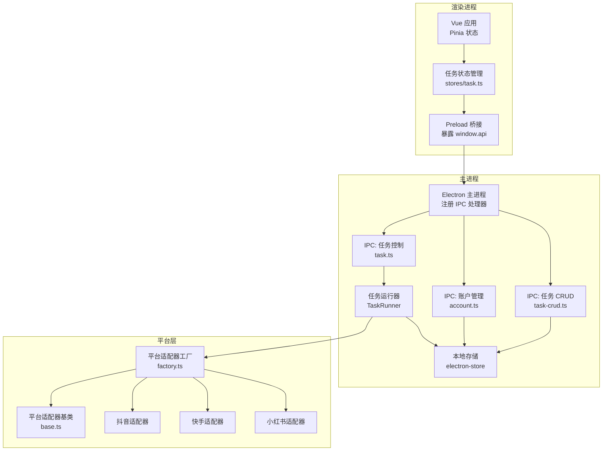
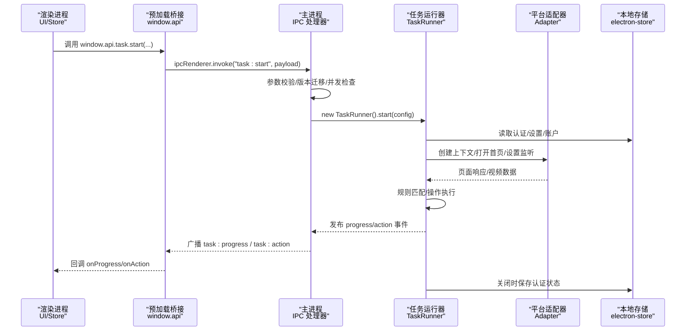
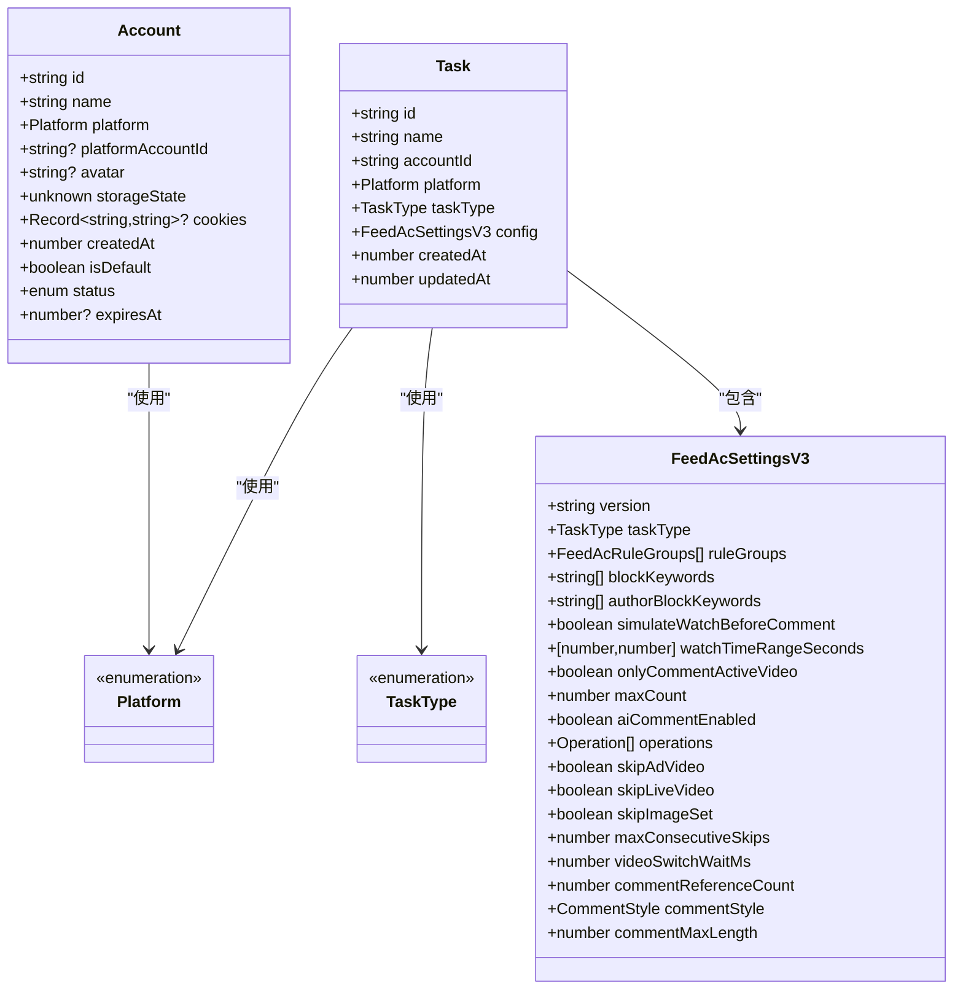
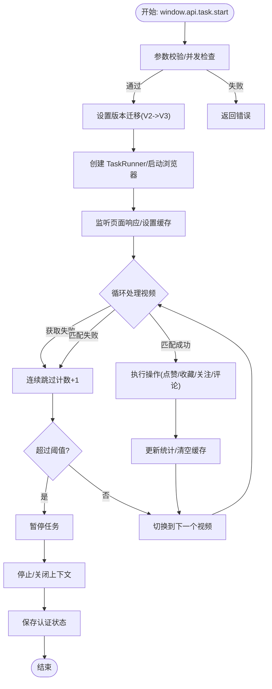
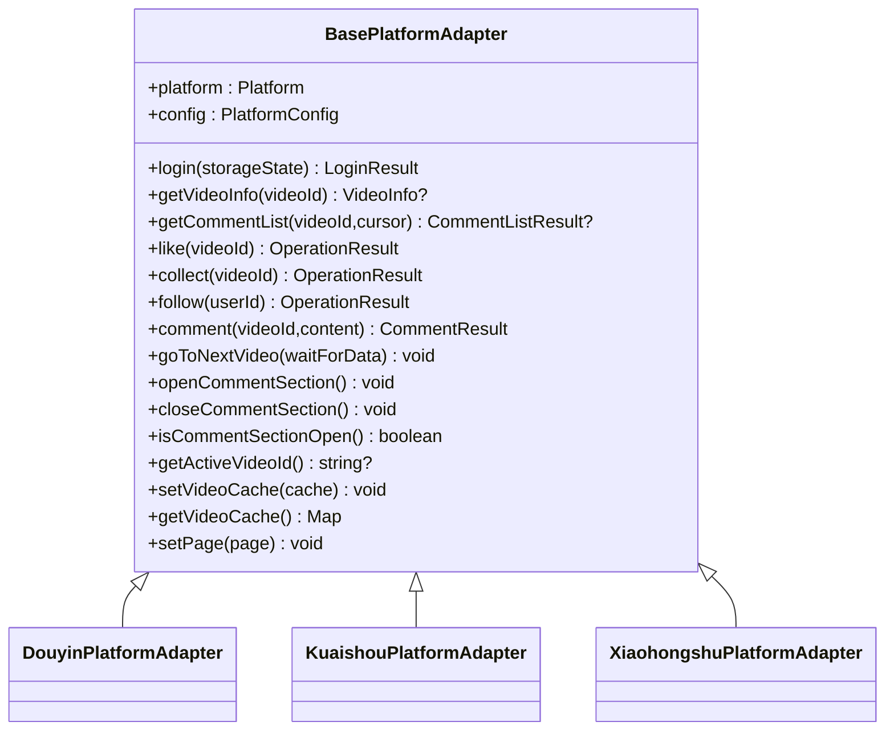
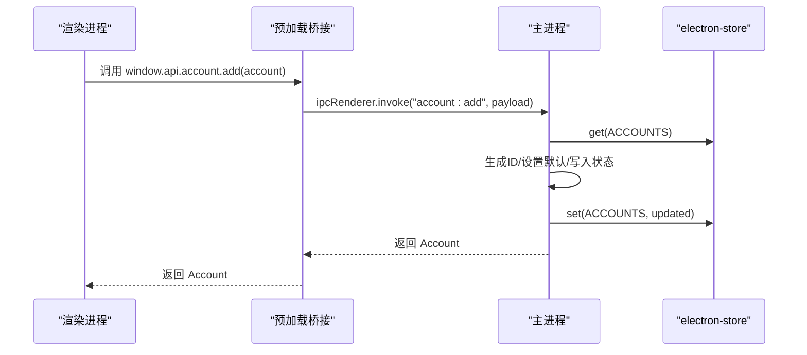
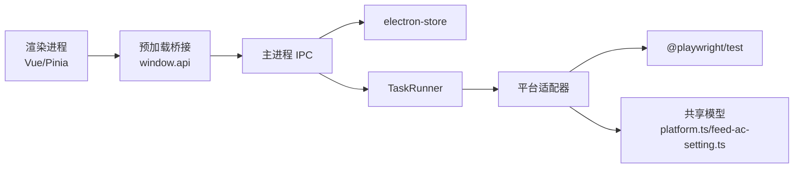

# 数据流设计

<cite>
**本文引用的文件**
- [src/main/index.ts](file://src/main/index.ts)
- [src/preload/index.ts](file://src/preload/index.ts)
- [src/renderer/src/main.ts](file://src/renderer/src/main.ts)
- [src/renderer/src/stores/task.ts](file://src/renderer/src/stores/task.ts)
- [src/shared/task.ts](file://src/shared/task.ts)
- [src/shared/account.ts](file://src/shared/account.ts)
- [src/shared/platform.ts](file://src/shared/platform.ts)
- [src/shared/feed-ac-setting.ts](file://src/shared/feed-ac-setting.ts)
- [src/main/ipc/task.ts](file://src/main/ipc/task.ts)
- [src/main/ipc/account.ts](file://src/main/ipc/account.ts)
- [src/main/ipc/task-crud.ts](file://src/main/ipc/task-crud.ts)
- [src/main/service/task-runner.ts](file://src/main/service/task-runner.ts)
- [src/main/platform/base.ts](file://src/main/platform/base.ts)
- [src/main/platform/factory.ts](file://src/main/platform/factory.ts)
- [src/main/utils/storage.ts](file://src/main/utils/storage.ts)
</cite>

## 目录
1. [引言](#引言)
2. [项目结构](#项目结构)
3. [核心组件](#核心组件)
4. [架构总览](#架构总览)
5. [详细组件分析](#详细组件分析)
6. [依赖关系分析](#依赖关系分析)
7. [性能考量](#性能考量)
8. [故障排查指南](#故障排查指南)
9. [结论](#结论)
10. [附录](#附录)

## 引言
本技术文档围绕 AutoOps 的数据流设计展开，系统性阐述从用户界面到主进程再到平台 API 的数据传输链路，覆盖数据验证、转换与处理环节；详解共享数据模型的设计原则、类型定义与约束；解释状态同步机制、缓存策略与一致性保障；分析任务执行过程中的数据流转、中间状态存储与最终结果反馈；并给出数据安全、隐私保护与性能优化建议及可视化图表。

## 项目结构
AutoOps 采用 Electron + Vue + Pinia 架构，前端通过 preload 暴露受控 API，主进程通过 IPC 接收请求并驱动后台服务（Playwright 浏览器自动化）与平台适配器，共享数据模型位于 shared 目录，持久化通过主进程的本地存储模块实现。

**图表来源**
- [src/renderer/src/main.ts:1-12](file://src/renderer/src/main.ts#L1-L12)
- [src/renderer/src/stores/task.ts:1-192](file://src/renderer/src/stores/task.ts#L1-L192)
- [src/preload/index.ts:1-187](file://src/preload/index.ts#L1-L187)
- [src/main/index.ts:1-106](file://src/main/index.ts#L1-L106)
- [src/main/ipc/task.ts:1-104](file://src/main/ipc/task.ts#L1-L104)
- [src/main/ipc/account.ts:1-101](file://src/main/ipc/account.ts#L1-L101)
- [src/main/ipc/task-crud.ts:1-108](file://src/main/ipc/task-crud.ts#L1-L108)
- [src/main/service/task-runner.ts:1-760](file://src/main/service/task-runner.ts#L1-L760)
- [src/main/platform/base.ts:1-105](file://src/main/platform/base.ts#L1-L105)
- [src/main/platform/factory.ts:1-32](file://src/main/platform/factory.ts#L1-L32)
- [src/main/utils/storage.ts:1-46](file://src/main/utils/storage.ts#L1-L46)

**章节来源**
- [src/main/index.ts:54-84](file://src/main/index.ts#L54-L84)
- [src/preload/index.ts:95-187](file://src/preload/index.ts#L95-L187)
- [src/renderer/src/main.ts:1-12](file://src/renderer/src/main.ts#L1-L12)

## 核心组件
- 渲染进程与状态管理
  - Vue 应用初始化与路由挂载，Pinia 提供全局状态容器。
  - 任务状态管理 store 负责任务生命周期、日志、进度与动作事件订阅。
- 预加载桥接
  - 通过 contextBridge 暴露受控 API，统一封装 IPC 调用与事件监听。
- 主进程 IPC 层
  - 注册各类 IPC 处理器，负责参数校验、版本迁移、并发控制与错误回传。
- 任务运行器
  - 基于 Playwright 控制浏览器上下文，拉取视频数据、执行规则匹配与操作，发布进度与动作事件。
- 平台适配器
  - 抽象平台差异，统一登录、视频信息、评论、点赞、收藏、关注等操作接口。
- 共享数据模型
  - 定义任务、账户、平台、设置等跨层数据结构与默认值生成器。
- 本地存储
  - electron-store 统一键空间，提供类型安全的读写与默认值。

**章节来源**
- [src/renderer/src/main.ts:1-12](file://src/renderer/src/main.ts#L1-L12)
- [src/renderer/src/stores/task.ts:12-192](file://src/renderer/src/stores/task.ts#L12-L192)
- [src/preload/index.ts:3-93](file://src/preload/index.ts#L3-L93)
- [src/main/ipc/task.ts:11-103](file://src/main/ipc/task.ts#L11-L103)
- [src/main/service/task-runner.ts:25-760](file://src/main/service/task-runner.ts#L25-L760)
- [src/main/platform/base.ts:24-105](file://src/main/platform/base.ts#L24-L105)
- [src/shared/task.ts:5-54](file://src/shared/task.ts#L5-L54)
- [src/shared/account.ts:3-39](file://src/shared/account.ts#L3-L39)
- [src/shared/platform.ts:1-260](file://src/shared/platform.ts#L1-L260)
- [src/shared/feed-ac-setting.ts:37-149](file://src/shared/feed-ac-setting.ts#L37-L149)
- [src/main/utils/storage.ts:14-46](file://src/main/utils/storage.ts#L14-L46)

## 架构总览
数据流自上而下分为三层：
- 表现层（渲染进程）：UI 交互、状态展示、事件订阅与 IPC 调用。
- 控制层（主进程）：参数校验、并发控制、版本迁移、持久化与事件广播。
- 执行层（平台适配器+浏览器）：页面自动化、网络拦截、规则匹配与平台操作。

**图表来源**
- [src/renderer/src/stores/task.ts:100-144](file://src/renderer/src/stores/task.ts#L100-L144)
- [src/preload/index.ts:102-116](file://src/preload/index.ts#L102-L116)
- [src/main/ipc/task.ts:11-103](file://src/main/ipc/task.ts#L11-L103)
- [src/main/service/task-runner.ts:55-113](file://src/main/service/task-runner.ts#L55-L113)
- [src/main/platform/base.ts:24-80](file://src/main/platform/base.ts#L24-L80)
- [src/main/utils/storage.ts:40-46](file://src/main/utils/storage.ts#L40-L46)

## 详细组件分析

### 数据模型与约束
- 任务模型
  - 包含标识、名称、账号关联、平台、任务类型、配置、时间戳等字段；提供默认构造与模板生成器。
- 账户模型
  - 支持多平台、状态枚举、默认账户标记、可选过期时间与存储状态。
- 平台与任务类型
  - 统一平台枚举与任务类型枚举，提供平台信息、选择器、API 端点与快捷键配置。
- 设置模型
  - V3 版本引入任务类型、操作集合、视频类型跳过策略、连续跳过阈值、等待时长、AI 评论相关参数等；提供 V2 到 V3 的迁移函数。

**图表来源**
- [src/shared/task.ts:5-54](file://src/shared/task.ts#L5-L54)
- [src/shared/account.ts:3-39](file://src/shared/account.ts#L3-L39)
- [src/shared/platform.ts:1-260](file://src/shared/platform.ts#L1-L260)
- [src/shared/feed-ac-setting.ts:37-149](file://src/shared/feed-ac-setting.ts#L37-L149)

**章节来源**
- [src/shared/task.ts:42-54](file://src/shared/task.ts#L42-L54)
- [src/shared/account.ts:32-39](file://src/shared/account.ts#L32-L39)
- [src/shared/feed-ac-setting.ts:120-145](file://src/shared/feed-ac-setting.ts#L120-L145)

### 任务执行数据流与状态管理
- 启动流程
  - 渲染层调用 window.api.task.start，携带设置、账号与任务类型；主进程进行并发与环境检查，必要时执行设置版本迁移；创建 TaskRunner 并启动浏览器上下文。
- 运行时数据
  - 通过页面响应拦截收集视频缓存，结合适配器获取当前视频信息；按规则组匹配与概率执行操作；发布进度与动作事件。
- 结束与持久化
  - 任务结束或停止时，关闭页面与上下文，保存认证状态；主进程向所有窗口广播停止事件。

**图表来源**
- [src/renderer/src/stores/task.ts:100-144](file://src/renderer/src/stores/task.ts#L100-L144)
- [src/main/ipc/task.ts:17-84](file://src/main/ipc/task.ts#L17-L84)
- [src/main/service/task-runner.ts:235-371](file://src/main/service/task-runner.ts#L235-L371)
- [src/main/platform/base.ts:160-180](file://src/main/platform/base.ts#L160-L180)

**章节来源**
- [src/renderer/src/stores/task.ts:100-144](file://src/renderer/src/stores/task.ts#L100-L144)
- [src/main/ipc/task.ts:17-84](file://src/main/ipc/task.ts#L17-L84)
- [src/main/service/task-runner.ts:235-371](file://src/main/service/task-runner.ts#L235-L371)

### 平台适配器与数据一致性
- 适配器职责
  - 统一封装平台差异，提供登录、视频信息、评论列表、点赞、收藏、关注、评论、导航等方法；通过事件向外广播日志与状态。
- 缓存与一致性
  - 页面响应拦截收集视频数据至缓存，避免重复抓取；当前视频信息优先从缓存读取，缺失时回退到适配器抓取；适配器内部维护视频缓存映射。
- 事件与状态
  - 适配器继承 EventEmitter，便于上层订阅日志与状态变化；运行器通过 emit 将进度与动作事件广播给所有窗口。

**图表来源**
- [src/main/platform/base.ts:24-105](file://src/main/platform/base.ts#L24-L105)
- [src/main/platform/factory.ts:7-18](file://src/main/platform/factory.ts#L7-L18)

**章节来源**
- [src/main/platform/base.ts:24-105](file://src/main/platform/base.ts#L24-L105)
- [src/main/platform/factory.ts:7-18](file://src/main/platform/factory.ts#L7-L18)

### IPC 与持久化策略
- 任务控制 IPC
  - 提供启动、停止、状态查询；对运行中状态进行互斥控制；将运行时事件广播到所有窗口。
- 账户管理 IPC
  - 提供列表、新增、更新、删除、设默认、查询默认、按平台/状态过滤等；删除后自动补默认账户。
- 任务 CRUD 与模板
  - 提供任务的增删改查、复制、模板保存与删除；模板与任务共享配置结构。
- 本地存储
  - 统一键空间：认证、设置、AI 设置、浏览器路径、任务历史、账户、任务、任务模板；提供类型安全的 get/set。

**图表来源**
- [src/preload/index.ts:137-147](file://src/preload/index.ts#L137-L147)
- [src/main/ipc/account.ts:37-49](file://src/main/ipc/account.ts#L37-L49)
- [src/main/utils/storage.ts:40-46](file://src/main/utils/storage.ts#L40-L46)

**章节来源**
- [src/main/ipc/task.ts:86-102](file://src/main/ipc/task.ts#L86-L102)
- [src/main/ipc/account.ts:32-100](file://src/main/ipc/account.ts#L32-L100)
- [src/main/ipc/task-crud.ts:8-107](file://src/main/ipc/task-crud.ts#L8-L107)
- [src/main/utils/storage.ts:14-46](file://src/main/utils/storage.ts#L14-L46)

## 依赖关系分析
- 渲染层依赖
  - 通过 window.api 调用主进程能力；Pinia 管理任务状态与日志；事件订阅用于接收运行时进度与动作。
- 主进程依赖
  - 依赖 electron-store 进行持久化；依赖 TaskRunner 执行自动化；依赖平台适配器处理平台差异。
- 适配器依赖
  - 依赖 Playwright Page/Response；依赖共享平台配置；通过事件向上层广播日志。

**图表来源**
- [src/renderer/src/stores/task.ts:12-192](file://src/renderer/src/stores/task.ts#L12-L192)
- [src/preload/index.ts:95-187](file://src/preload/index.ts#L95-L187)
- [src/main/ipc/task.ts:1-104](file://src/main/ipc/task.ts#L1-L104)
- [src/main/service/task-runner.ts:1-760](file://src/main/service/task-runner.ts#L1-L760)
- [src/main/platform/base.ts:1-105](file://src/main/platform/base.ts#L1-L105)
- [src/shared/platform.ts:1-260](file://src/shared/platform.ts#L1-L260)
- [src/shared/feed-ac-setting.ts:1-149](file://src/shared/feed-ac-setting.ts#L1-L149)
- [src/main/utils/storage.ts:1-46](file://src/main/utils/storage.ts#L1-L46)

**章节来源**
- [src/main/index.ts:4-16](file://src/main/index.ts#L4-L16)
- [src/main/service/task-runner.ts:1-14](file://src/main/service/task-runner.ts#L1-L14)

## 性能考量
- 浏览器上下文复用
  - 支持外部传入上下文以实现多任务并行，减少浏览器实例创建开销。
- 视频数据缓存
  - 页面响应拦截收集视频列表，降低重复抓取成本；当前视频信息优先从缓存读取。
- 事件节流与日志裁剪
  - 日志队列仅保留最近若干条，避免内存膨胀；进度与动作事件按需订阅。
- 等待与随机化
  - 视频切换等待与操作间隔采用随机范围，降低被风控概率并提升稳定性。

[本节为通用性能建议，无需特定文件引用]

## 故障排查指南
- 任务无法启动
  - 检查浏览器可执行路径是否配置；确认当前无任务运行；查看主进程日志与返回的错误信息。
- 任务中途暂停
  - 关注连续跳过阈值触发；检查网络响应与页面元素定位；确认平台适配器选择器与端点配置。
- 认证失效
  - 任务结束会保存认证状态；若登录态丢失，重新登录并确保存储状态正确写入。
- 数据不一致
  - 确认页面响应拦截是否生效；检查视频缓存清理时机；核对适配器抓取回退逻辑。

**章节来源**
- [src/main/ipc/task.ts:27-36](file://src/main/ipc/task.ts#L27-L36)
- [src/main/service/task-runner.ts:268-287](file://src/main/service/task-runner.ts#L268-L287)
- [src/main/service/task-runner.ts:212-233](file://src/main/service/task-runner.ts#L212-L233)

## 结论
AutoOps 的数据流设计以共享模型为核心，通过预加载桥接与主进程 IPC 实现清晰的职责分离；任务运行器与平台适配器解耦平台差异，结合缓存与事件机制实现高效稳定的自动化；本地存储提供可靠的状态持久化。整体架构具备良好的扩展性与可维护性，适合进一步增强 AI 分析、多账号调度与任务编排能力。

## 附录
- 数据安全与隐私
  - 存储敏感认证状态时应避免明文泄露；建议在生产环境启用更强的访问控制与加密策略。
- 最佳实践
  - 在渲染层仅暴露最小 API 面；主进程集中做参数校验与权限控制；事件命名规范，便于调试与监控。
- 扩展方向
  - 引入任务模板库、批量任务调度、任务历史归档与审计日志、平台适配器插件化等。