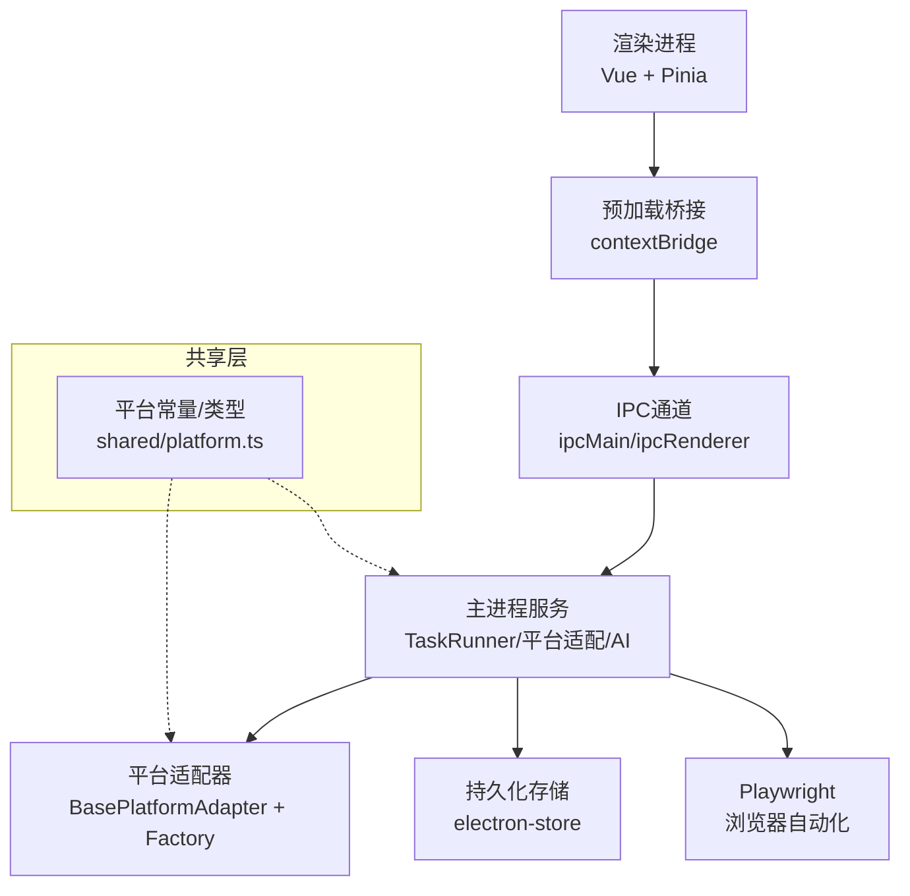
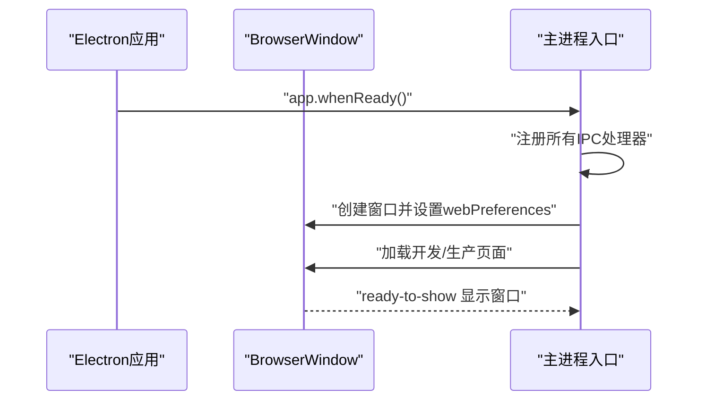
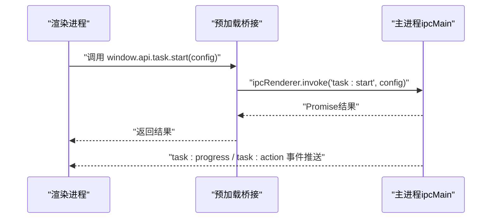
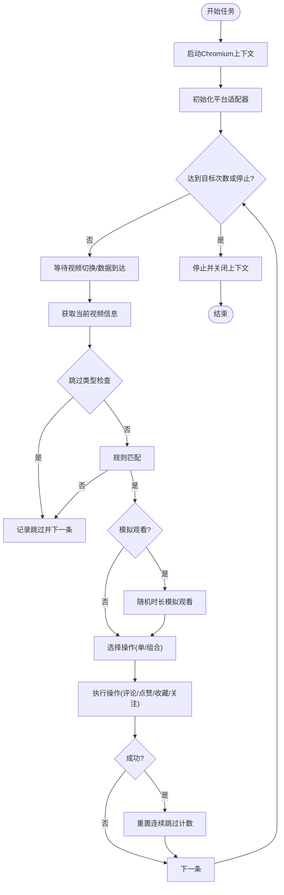
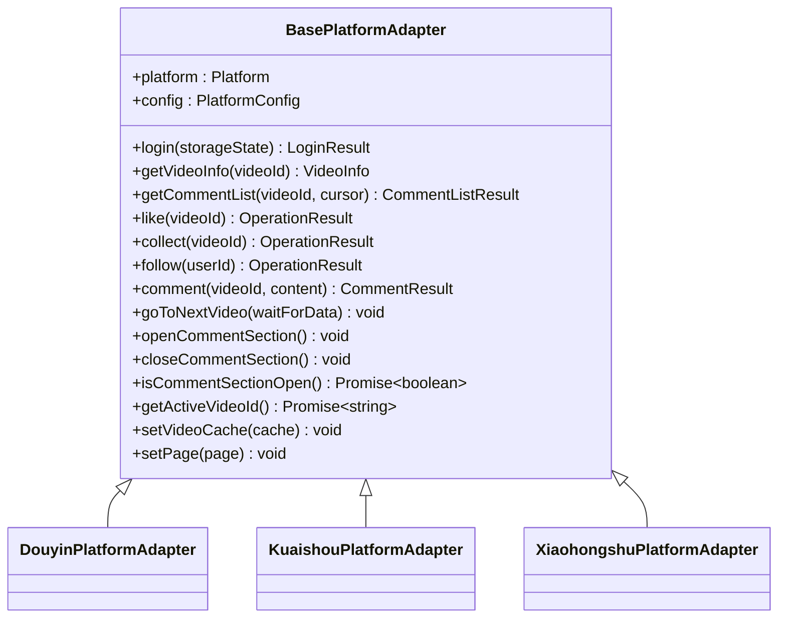
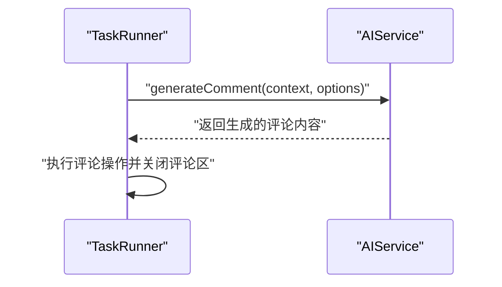
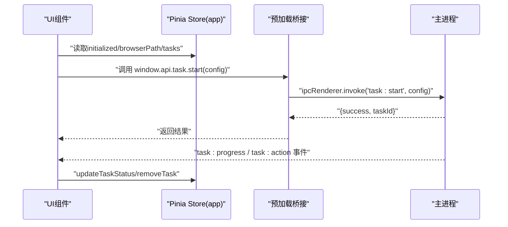
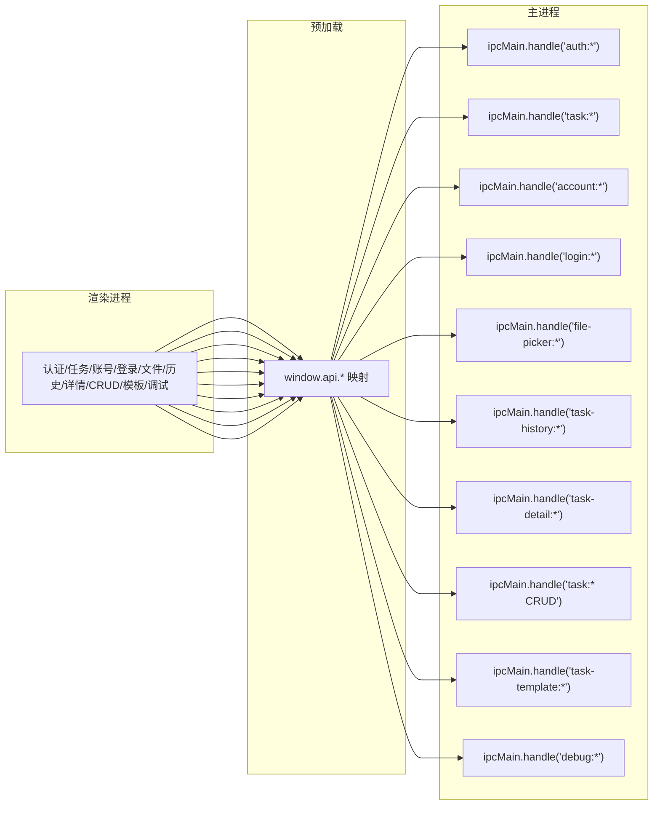
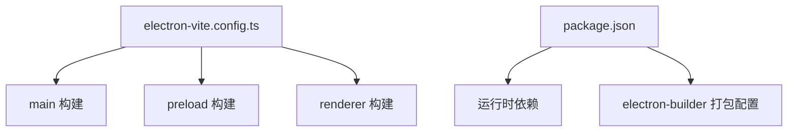

# 架构设计

<cite>
**本文引用的文件**
- [src/main/index.ts](file://src/main/index.ts)
- [src/preload/index.ts](file://src/preload/index.ts)
- [src/renderer/src/main.ts](file://src/renderer/src/main.ts)
- [src/main/ipc/auth.ts](file://src/main/ipc/auth.ts)
- [src/main/ipc/task.ts](file://src/main/ipc/task.ts)
- [src/main/service/task-runner.ts](file://src/main/service/task-runner.ts)
- [src/main/platform/base.ts](file://src/main/platform/base.ts)
- [src/main/platform/factory.ts](file://src/main/platform/factory.ts)
- [src/main/integration/ai/factory.ts](file://src/main/integration/ai/factory.ts)
- [src/shared/platform.ts](file://src/shared/platform.ts)
- [src/main/utils/storage.ts](file://src/main/utils/storage.ts)
- [src/renderer/src/stores/app.ts](file://src/renderer/src/stores/app.ts)
- [package.json](file://package.json)
- [electron.vite.config.ts](file://electron.vite.config.ts)
</cite>

## 目录
1. [引言](#引言)
2. [项目结构](#项目结构)
3. [核心组件](#核心组件)
4. [架构总览](#架构总览)
5. [详细组件分析](#详细组件分析)
6. [依赖分析](#依赖分析)
7. [性能考虑](#性能考虑)
8. [故障排查指南](#故障排查指南)
9. [结论](#结论)
10. [附录](#附录)

## 引言
本文件面向AutoOps项目的架构设计与实现，系统化阐述基于Electron的应用整体架构模式，重点覆盖主进程与渲染进程的职责划分、IPC通信机制、分层架构组织（共享层、主进程层、渲染进程层）、数据流与组件交互、状态管理、技术决策与可扩展性设计，并辅以架构图与组件关系说明，帮助开发者快速理解系统设计思路与实现细节。

## 项目结构
AutoOps采用Electron + Vue 3 + Pinia + Vite的现代桌面应用栈，代码按“主进程/预加载/渲染进程/共享层”分层组织，配合electron-vite进行构建与开发。

- 主进程：负责窗口生命周期、IPC注册、业务服务编排、持久化存储等
- 预加载脚本：通过contextBridge暴露受控API给渲染进程
- 渲染进程：Vue应用，使用Pinia进行状态管理，路由驱动页面导航
- 共享层：跨主/渲染共享的数据模型、平台常量与类型定义

```mermaid
graph TB
subgraph "主进程"
MIDX["src/main/index.ts"]
MIPC["src/main/ipc/*.ts"]
MSVC["src/main/service/task-runner.ts"]
MPLAT["src/main/platform/*.ts"]
MAI["src/main/integration/ai/*.ts"]
MSTOR["src/main/utils/storage.ts"]
end
subgraph "预加载"
PRE["src/preload/index.ts"]
end
subgraph "渲染进程"
RAPP["src/renderer/src/main.ts"]
RSTORE["src/renderer/src/stores/*.ts"]
RPAGES["src/renderer/src/pages/*.vue"]
end
subgraph "共享层"
SHARED["src/shared/*.ts"]
end
MIDX --> MIPC
MIPC --> MSVC
MSVC --> MPLAT
MSVC --> MAI
MIPC --> MSTOR
PRE <- --> RAPP
RAPP --> RSTORE
RSTORE --> PRE
SHARED -.-> MIPC
SHARED -.-> MSVC
```

**图表来源**
- [src/main/index.ts:1-106](file://src/main/index.ts#L1-L106)
- [src/preload/index.ts:1-187](file://src/preload/index.ts#L1-L187)
- [src/renderer/src/main.ts:1-12](file://src/renderer/src/main.ts#L1-L12)
- [src/main/ipc/auth.ts:1-23](file://src/main/ipc/auth.ts#L1-L23)
- [src/main/ipc/task.ts:1-104](file://src/main/ipc/task.ts#L1-L104)
- [src/main/service/task-runner.ts:1-608](file://src/main/service/task-runner.ts#L1-L608)
- [src/main/platform/base.ts:1-105](file://src/main/platform/base.ts#L1-L105)
- [src/main/platform/factory.ts:1-32](file://src/main/platform/factory.ts#L1-L32)
- [src/main/integration/ai/factory.ts:1-27](file://src/main/integration/ai/factory.ts#L1-L27)
- [src/main/utils/storage.ts:1-46](file://src/main/utils/storage.ts#L1-L46)
- [src/renderer/src/stores/app.ts:1-71](file://src/renderer/src/stores/app.ts#L1-L71)
- [src/shared/platform.ts:1-260](file://src/shared/platform.ts#L1-L260)

**章节来源**
- [package.json:1-85](file://package.json#L1-L85)
- [electron.vite.config.ts:1-34](file://electron.vite.config.ts#L1-L34)

## 核心组件
- 主进程入口与窗口管理：负责创建BrowserWindow、设置webPreferences、注册所有IPC处理器、日志初始化与应用生命周期事件监听
- 预加载桥接：通过contextBridge暴露安全可控的API集合，统一命名空间映射到主进程ipcMain.handle/handle的通道
- 渲染进程：Vue应用初始化，Pinia状态管理，路由与页面组件
- 任务运行器：封装Playwright浏览器自动化、平台适配器、AI服务集成、任务流程控制与事件广播
- 平台适配器：抽象平台差异，统一视频/评论/互动操作接口
- AI服务工厂：按配置动态创建不同平台的AI服务实例
- 存储：electron-store持久化，键空间涵盖认证、任务、账号、设置等

**章节来源**
- [src/main/index.ts:1-106](file://src/main/index.ts#L1-L106)
- [src/preload/index.ts:1-187](file://src/preload/index.ts#L1-L187)
- [src/renderer/src/main.ts:1-12](file://src/renderer/src/main.ts#L1-L12)
- [src/main/service/task-runner.ts:1-608](file://src/main/service/task-runner.ts#L1-L608)
- [src/main/platform/base.ts:1-105](file://src/main/platform/base.ts#L1-L105)
- [src/main/platform/factory.ts:1-32](file://src/main/platform/factory.ts#L1-L32)
- [src/main/integration/ai/factory.ts:1-27](file://src/main/integration/ai/factory.ts#L1-L27)
- [src/main/utils/storage.ts:1-46](file://src/main/utils/storage.ts#L1-L46)

## 架构总览
AutoOps采用“主进程-预加载-渲染进程”的经典Electron三层架构，结合“共享层”复用数据模型与平台配置，形成清晰的职责边界与数据流向。



**图表来源**
- [src/main/index.ts:1-106](file://src/main/index.ts#L1-L106)
- [src/preload/index.ts:1-187](file://src/preload/index.ts#L1-L187)
- [src/main/ipc/task.ts:1-104](file://src/main/ipc/task.ts#L1-L104)
- [src/main/service/task-runner.ts:1-608](file://src/main/service/task-runner.ts#L1-L608)
- [src/main/platform/base.ts:1-105](file://src/main/platform/base.ts#L1-L105)
- [src/main/platform/factory.ts:1-32](file://src/main/platform/factory.ts#L1-L32)
- [src/shared/platform.ts:1-260](file://src/shared/platform.ts#L1-L260)

## 详细组件分析

### 主进程与窗口生命周期
- 创建BrowserWindow并启用上下文隔离、禁用Node集成，确保安全
- 开发环境加载ELECTRON_RENDERER_URL，生产环境加载打包后的HTML
- 注册全部IPC处理器，集中初始化日志与应用行为
- 统一接收来自渲染端的日志消息并分级输出



**图表来源**
- [src/main/index.ts:22-52](file://src/main/index.ts#L22-L52)
- [src/main/index.ts:54-84](file://src/main/index.ts#L54-L84)

**章节来源**
- [src/main/index.ts:1-106](file://src/main/index.ts#L1-L106)

### 预加载桥接与IPC API暴露
- 通过contextBridge.exposeInMainWorld暴露统一的window.api命名空间
- 将每个功能域的IPC调用映射为Promise接口，如auth、task、account、login、file-picker、task-history、task-detail、taskCRUD、task-template、debug等
- 支持事件订阅（onProgress/onAction），返回移除监听函数



**图表来源**
- [src/preload/index.ts:95-187](file://src/preload/index.ts#L95-L187)
- [src/main/ipc/task.ts:11-103](file://src/main/ipc/task.ts#L11-L103)

**章节来源**
- [src/preload/index.ts:1-187](file://src/preload/index.ts#L1-L187)

### 任务执行流水线（TaskRunner）
- 生命周期：start -> 启动浏览器/上下文 -> 初始化平台适配器 -> 进入任务循环 -> 停止/关闭
- 数据采集：监听平台feed响应，缓存视频元数据，供后续规则匹配与操作使用
- 规则引擎：支持手动规则组与AI规则组，支持多条件AND/OR组合、子规则递归匹配
- 操作执行：根据任务类型与概率执行评论/点赞/收藏/关注等动作，支持AI生成评论
- 事件广播：向所有窗口广播进度与动作事件，便于UI实时更新
- 状态持久化：任务结束时保存浏览器storageState回全局认证



**图表来源**
- [src/main/service/task-runner.ts:35-245](file://src/main/service/task-runner.ts#L35-L245)
- [src/main/service/task-runner.ts:408-437](file://src/main/service/task-runner.ts#L408-L437)
- [src/main/service/task-runner.ts:461-527](file://src/main/service/task-runner.ts#L461-L527)

**章节来源**
- [src/main/service/task-runner.ts:1-608](file://src/main/service/task-runner.ts#L1-L608)

### 平台适配与扩展
- 抽象基类BasePlatformAdapter定义统一接口：登录、视频信息、评论列表、互动操作、导航与评论面板控制、活动视频ID获取等
- 工厂createPlatformAdapter按平台返回具体适配器实例，支持抖音/快手/小红书扩展
- 平台配置集中于shared/platform.ts，包含选择器、API端点、快捷键等



**图表来源**
- [src/main/platform/base.ts:24-80](file://src/main/platform/base.ts#L24-L80)
- [src/main/platform/factory.ts:7-18](file://src/main/platform/factory.ts#L7-L18)
- [src/shared/platform.ts:88-200](file://src/shared/platform.ts#L88-L200)

**章节来源**
- [src/main/platform/base.ts:1-105](file://src/main/platform/base.ts#L1-L105)
- [src/main/platform/factory.ts:1-32](file://src/main/platform/factory.ts#L1-L32)
- [src/shared/platform.ts:1-260](file://src/shared/platform.ts#L1-L260)

### AI服务集成
- 工厂按AI平台（火山、百炼、OpenAI、DeepSeek）创建对应服务实例
- 在评论生成环节，可结合热门评论与自定义提示词生成更高质量内容
- 支持降级策略：AI失败时回退到备选评论池



**图表来源**
- [src/main/integration/ai/factory.ts:16-25](file://src/main/integration/ai/factory.ts#L16-L25)
- [src/main/service/task-runner.ts:484-521](file://src/main/service/task-runner.ts#L484-L521)

**章节来源**
- [src/main/integration/ai/factory.ts:1-27](file://src/main/integration/ai/factory.ts#L1-L27)
- [src/main/service/task-runner.ts:1-608](file://src/main/service/task-runner.ts#L1-L608)

### 状态管理与UI交互
- 渲染进程使用Pinia管理应用状态，包含初始化状态、浏览器路径、当前账号、任务状态映射等
- 提供计算属性判断是否正在运行、运行中的任务数量
- 通过window.api与主进程通信，订阅任务进度与动作事件，驱动UI刷新



**图表来源**
- [src/renderer/src/stores/app.ts:18-70](file://src/renderer/src/stores/app.ts#L18-L70)
- [src/preload/index.ts:102-116](file://src/preload/index.ts#L102-L116)
- [src/main/ipc/task.ts:51-63](file://src/main/ipc/task.ts#L51-L63)

**章节来源**
- [src/renderer/src/stores/app.ts:1-71](file://src/renderer/src/stores/app.ts#L1-L71)
- [src/preload/index.ts:1-187](file://src/preload/index.ts#L1-L187)
- [src/main/ipc/task.ts:1-104](file://src/main/ipc/task.ts#L1-L104)

### IPC与数据流
- 认证相关：hasAuth/login/logout/getAuth
- 任务相关：start/stop/status，以及进度与动作事件
- 账号相关：list/add/update/delete/setDefault/getDefault/getById/getByPlatform/getActiveAccounts
- 登录：抖音一键登录
- 文件选择：selectFile/selectDirectory
- 任务历史与详情：getAll/getById/add/update/delete/clear 与 get/addVideoRecord/updateStatus
- 任务CRUD与模板：getAll/getById/getByAccount/create/update/delete/duplicate 与 getAll/save/delete
- 调试：getEnv



**图表来源**
- [src/preload/index.ts:3-93](file://src/preload/index.ts#L3-L93)
- [src/main/ipc/auth.ts:4-23](file://src/main/ipc/auth.ts#L4-L23)
- [src/main/ipc/task.ts:11-103](file://src/main/ipc/task.ts#L11-L103)

**章节来源**
- [src/preload/index.ts:1-187](file://src/preload/index.ts#L1-L187)
- [src/main/ipc/auth.ts:1-23](file://src/main/ipc/auth.ts#L1-L23)
- [src/main/ipc/task.ts:1-104](file://src/main/ipc/task.ts#L1-L104)

## 依赖分析
- 构建与开发：electron-vite配置区分main、preload、renderer三段构建，renderer别名@/@renderer/@/components提升开发体验
- 运行时依赖：Vue 3、Pinia、Vue Router、TailwindCSS、electron-log、electron-store、Playwright等
- 应用打包：electron-builder配置多平台产物（NSIS、DMG、AppImage）



**图表来源**
- [electron.vite.config.ts:6-33](file://electron.vite.config.ts#L6-L33)
- [package.json:16-84](file://package.json#L16-L84)

**章节来源**
- [electron.vite.config.ts:1-34](file://electron.vite.config.ts#L1-L34)
- [package.json:1-85](file://package.json#L1-L85)

## 性能考虑
- 浏览器上下文复用：TaskRunner在单次任务内复用同一浏览器上下文，减少启动成本
- 数据缓存：通过videoCache聚合feed响应，降低重复请求与解析开销
- 事件驱动：使用EventEmitter与BrowserWindow广播事件，避免轮询带来的CPU占用
- 随机化与节流：操作间隔与观看时长随机化，降低风控风险同时保持自然节奏
- 存储优化：electron-store键空间明确，避免冗余字段；任务结束持久化storageState，减少重复登录成本
- 可扩展性：平台适配器与AI服务工厂解耦，新增平台/模型仅需扩展工厂与适配器

[本节为通用性能建议，无需特定文件引用]

## 故障排查指南
- 任务无法启动
  - 检查浏览器可执行路径是否配置（browser-exec:get）
  - 查看主进程日志级别与任务启动参数
  - 确认当前是否已有任务运行
- 任务中途停止或异常
  - 关注task:progress与task:action事件，定位失败阶段
  - 检查平台适配器是否正确获取活动视频ID与评论区状态
- 认证失效
  - 任务结束后会回写storageState，若仍失败需重新登录
- 日志查看
  - 渲染端通过window.api.debug.getEnv获取环境信息
  - 主进程统一接收并分级记录日志

**章节来源**
- [src/main/ipc/task.ts:17-84](file://src/main/ipc/task.ts#L17-L84)
- [src/main/service/task-runner.ts:113-130](file://src/main/service/task-runner.ts#L113-L130)
- [src/preload/index.ts:182-184](file://src/preload/index.ts#L182-L184)
- [src/main/index.ts:92-106](file://src/main/index.ts#L92-L106)

## 结论
AutoOps以Electron为核心，结合Vue/Pinia与Playwright，构建了高内聚、低耦合的多平台自动化运营框架。通过明确的分层架构、严格的IPC边界与事件驱动的状态更新，系统在保证安全性的同时实现了良好的可扩展性与可维护性。未来可在平台适配器与AI服务工厂上进一步抽象通用能力，增强跨平台一致性与智能化水平。

## 附录
- 分层架构要点
  - 共享层：统一平台常量、类型与默认配置，避免重复定义
  - 主进程层：窗口、IPC、服务编排、持久化
  - 预加载层：安全桥接，统一API命名空间
  - 渲染进程层：UI、状态、路由与用户交互
- 架构决策
  - 安全优先：上下文隔离、禁用Node集成、严格API暴露
  - 可观测性：统一日志、事件广播、调试接口
  - 可扩展性：工厂模式、适配器模式、模块化IPC

[本节为总结性内容，无需特定文件引用]