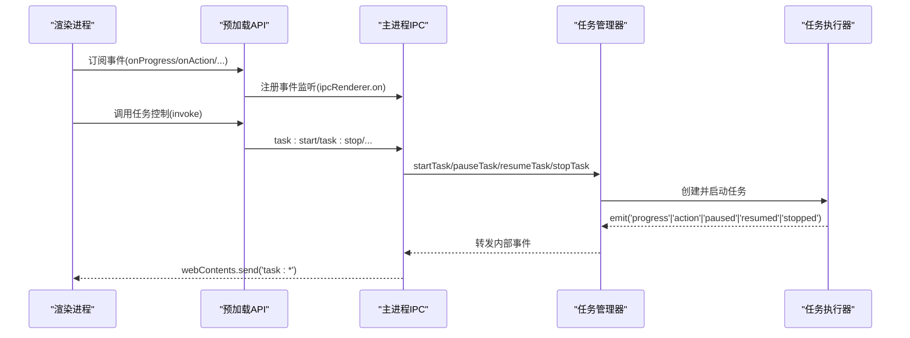
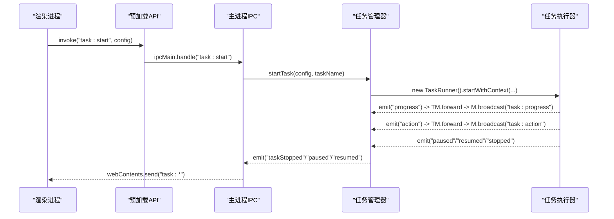
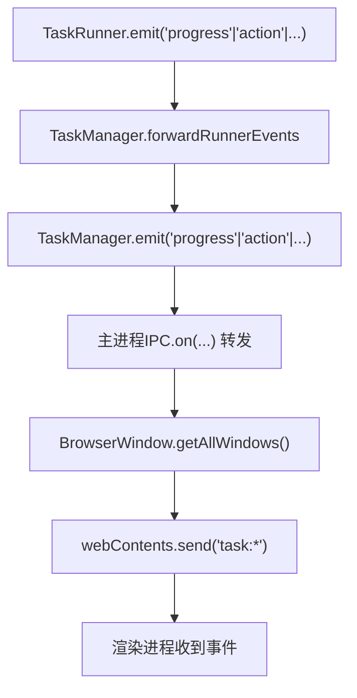
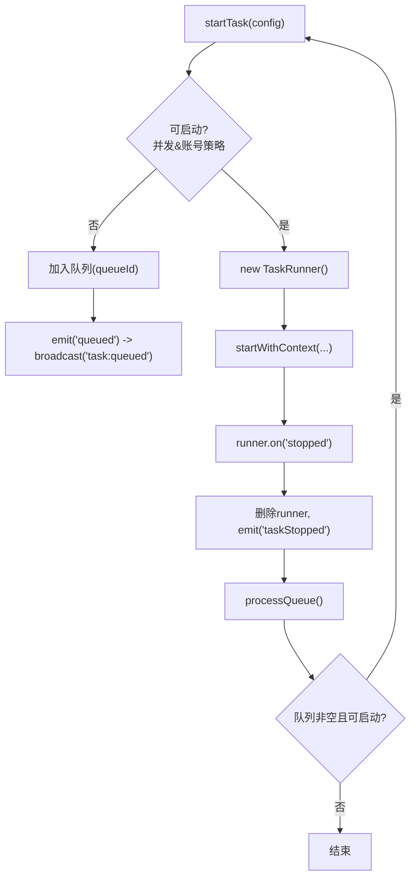
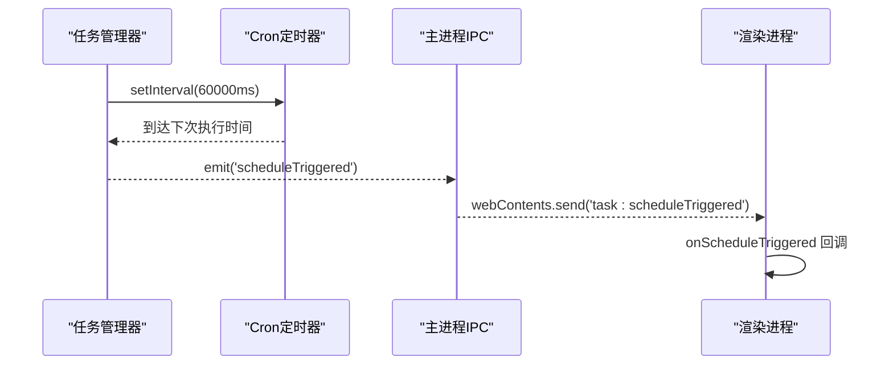
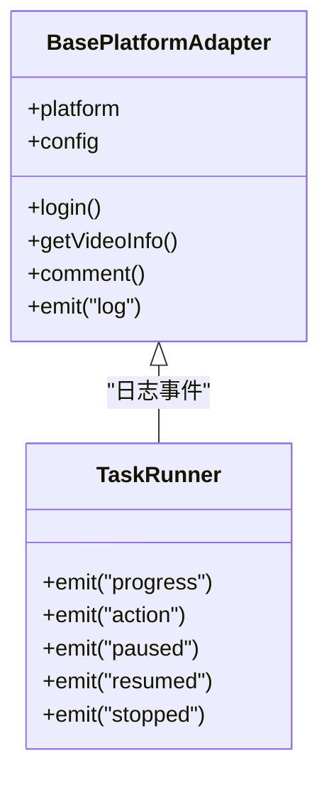
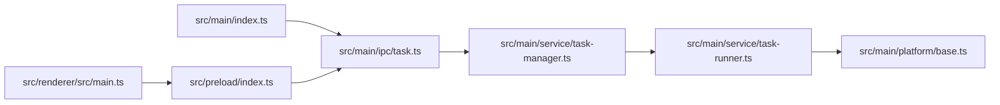

# 事件驱动架构

<cite>
**本文引用的文件**   
- [src/main/index.ts](file://src/main/index.ts)
- [src/preload/index.ts](file://src/preload/index.ts)
- [src/main/ipc/task.ts](file://src/main/ipc/task.ts)
- [src/main/service/task-manager.ts](file://src/main/service/task-manager.ts)
- [src/main/service/task-runner.ts](file://src/main/service/task-runner.ts)
- [src/main/platform/base.ts](file://src/main/platform/base.ts)
- [src/renderer/src/main.ts](file://src/renderer/src/main.ts)
- [src/shared/task.ts](file://src/shared/task.ts)
</cite>

## 目录
1. [引言](#引言)
2. [项目结构](#项目结构)
3. [核心组件](#核心组件)
4. [架构总览](#架构总览)
5. [详细组件分析](#详细组件分析)
6. [依赖关系分析](#依赖关系分析)
7. [性能考量](#性能考量)
8. [故障排查指南](#故障排查指南)
9. [结论](#结论)
10. [附录](#附录)

## 引言
本文件系统性阐述 AutoOps 的事件驱动架构，聚焦主进程、渲染进程与共享层之间的事件通信机制，解析 IPC 事件的传递路径与处理流程；深入说明任务执行过程中的事件流（启动、进度、操作、结果反馈等）；解释事件驱动如何实现组件间松耦合及异步事件处理的优势与挑战；给出事件生命周期管理（注册、触发、监听、清理）与设计原则、最佳实践（命名规范、数据格式、错误处理），并提供完整的事件流程图与时序图，帮助开发者快速理解复杂事件交互。

## 项目结构
AutoOps 采用 Electron 架构，分为三部分：
- 主进程：负责应用生命周期、窗口管理、IPC 注册与任务调度、浏览器上下文管理。
- 预加载脚本：通过 contextBridge 暴露受控 API 到渲染进程，并统一封装 IPC 调用与事件监听。
- 渲染进程：Vue 应用，通过预加载 API 发起任务控制请求与订阅事件回调。

```mermaid
graph TB
subgraph "主进程"
A["Electron 主进程<br/>src/main/index.ts"]
B["IPC 任务处理器<br/>src/main/ipc/task.ts"]
C["任务管理器<br/>src/main/service/task-manager.ts"]
D["任务执行器<br/>src/main/service/task-runner.ts"]
E["平台适配基类(EventEmitter)<br/>src/main/platform/base.ts"]
end
subgraph "预加载层"
F["预加载 API 暴露<br/>src/preload/index.ts"]
end
subgraph "渲染进程"
G["Vue 应用入口<br/>src/renderer/src/main.ts"]
end
G --> F
F --> |"invoke/on"| B
B --> |"事件转发"| A
A --> |"webContents.send"| G
C --> |"forwardRunnerEvents"| A
D --> |"emit('progress'|'action'|'paused'|'resumed'|'stopped')" --> C
E --> |"emit('log')" --> D
```

**图表来源**
- [src/main/index.ts:54-84](file://src/main/index.ts#L54-L84)
- [src/main/ipc/task.ts:13-79](file://src/main/ipc/task.ts#L13-L79)
- [src/main/service/task-manager.ts:47-84](file://src/main/service/task-manager.ts#L47-L84)
- [src/main/service/task-runner.ts:25-50](file://src/main/service/task-runner.ts#L25-L50)
- [src/main/platform/base.ts:24-79](file://src/main/platform/base.ts#L24-L79)
- [src/preload/index.ts:130-234](file://src/preload/index.ts#L130-L234)
- [src/renderer/src/main.ts:1-12](file://src/renderer/src/main.ts#L1-L12)

**章节来源**
- [src/main/index.ts:1-106](file://src/main/index.ts#L1-L106)
- [src/preload/index.ts:1-234](file://src/preload/index.ts#L1-L234)
- [src/renderer/src/main.ts:1-12](file://src/renderer/src/main.ts#L1-L12)

## 核心组件
- 主进程入口与窗口创建：负责初始化日志、注册所有 IPC 处理器、创建 BrowserWindow 并加载渲染页面。
- 预加载 API：定义统一的 ElectronAPI 接口，封装 invoke/on 方法，暴露认证、任务、账号、文件选择、调试等能力，并提供事件监听器的注册与注销。
- 任务 IPC：集中注册任务相关的 handle/on 通道，接收渲染端请求，调用 TaskManager 执行业务逻辑，并将内部事件广播给所有窗口。
- 任务管理器：继承 EventEmitter，负责浏览器实例共享、并发控制、队列调度、定时任务、账号策略、事件转发与持久化。
- 任务执行器：继承 EventEmitter，负责具体任务执行循环、平台适配、AI 服务集成、操作执行、状态变更与事件上报。
- 平台适配基类：抽象平台差异，统一登录、视频信息、评论区、操作等接口，并通过 EventEmitter 上报日志事件。
- 渲染入口：Vue 应用挂载入口，配合 Pinia/Router 提供 UI 层事件订阅与任务控制。

**章节来源**
- [src/main/index.ts:54-84](file://src/main/index.ts#L54-L84)
- [src/preload/index.ts:130-234](file://src/preload/index.ts#L130-L234)
- [src/main/ipc/task.ts:81-240](file://src/main/ipc/task.ts#L81-L240)
- [src/main/service/task-manager.ts:47-515](file://src/main/service/task-manager.ts#L47-L515)
- [src/main/service/task-runner.ts:25-760](file://src/main/service/task-runner.ts#L25-L760)
- [src/main/platform/base.ts:24-105](file://src/main/platform/base.ts#L24-L105)
- [src/renderer/src/main.ts:1-12](file://src/renderer/src/main.ts#L1-L12)

## 架构总览
事件驱动贯穿主进程、预加载与渲染进程：
- 渲染进程通过预加载 API 的 on* 方法订阅任务事件（进度、动作、暂停/恢复、启动/停止、入队、定时触发）。
- 预加载层将渲染端的 invoke 请求映射到对应的 IPC channel，并将事件监听器注册到 ipcRenderer。
- 主进程的 IPC 处理器接收请求，委托 TaskManager 执行；TaskManager 在内部事件触发时，通过 BrowserWindow.getAllWindows() 将事件广播到所有窗口。
- 任务执行器在执行过程中 emit 多种事件，TaskManager 转发至主进程，再由主进程分发到渲染端。



**图表来源**
- [src/preload/index.ts:153-161](file://src/preload/index.ts#L153-L161)
- [src/main/ipc/task.ts:21-77](file://src/main/ipc/task.ts#L21-L77)
- [src/main/service/task-manager.ts:389-402](file://src/main/service/task-manager.ts#L389-L402)
- [src/main/service/task-runner.ts:63-113](file://src/main/service/task-runner.ts#L63-L113)

**章节来源**
- [src/preload/index.ts:124-161](file://src/preload/index.ts#L124-L161)
- [src/main/ipc/task.ts:13-79](file://src/main/ipc/task.ts#L13-L79)
- [src/main/service/task-manager.ts:389-402](file://src/main/service/task-manager.ts#L389-L402)
- [src/main/service/task-runner.ts:63-113](file://src/main/service/task-runner.ts#L63-L113)

## 详细组件分析

### 事件通道与命名规范
- 渲染端事件通道：task:progress、task:action、task:paused、task:resumed、task:started、task:stopped、task:queued、task:scheduleTriggered。
- 预加载层对应方法：onProgress、onAction、onPaused、onResumed、onStarted、onStopped、onQueued、onScheduleTriggered。
- 主进程广播：TaskManager 在多个内部事件上注册转发器，将事件广播到所有窗口。
- 设计原则：
  - 通道名采用“域:动作”命名，语义清晰、便于检索。
  - 事件负载包含 taskId（若适用）、时间戳、必要上下文字段，保证可追踪性。
  - 事件粒度适中：进度事件用于高频反馈，动作事件用于关键操作结果，状态事件用于生命周期关键节点。

**章节来源**
- [src/preload/index.ts:153-161](file://src/preload/index.ts#L153-L161)
- [src/main/ipc/task.ts:21-77](file://src/main/ipc/task.ts#L21-L77)
- [src/main/service/task-manager.ts:389-402](file://src/main/service/task-manager.ts#L389-L402)

### 任务启动与生命周期事件流
- 渲染端调用 task:start，预加载层通过 ipcRenderer.invoke 调用主进程的 task:start。
- 主进程校验浏览器路径与设置版本，创建 TaskManager 单例并初始化，随后调用 manager.startTask。
- TaskManager 检查并发与账号策略，决定直接启动或入队；启动时创建 TaskRunner，绑定事件转发。
- TaskRunner 启动后 emit 'progress'，TaskManager 转发为 'task:progress'，渲染端收到实时进度。
- 任务执行期间，TaskRunner 对每个操作 emit 'action'，TaskManager 转发为 'task:action'。
- 暂停/恢复/停止分别触发 'paused'/'resumed'/'stopped'，TaskManager 转发为 'task:paused'/'task:resumed'/'task:stopped'。
- 任务结束时，TaskManager 触发 'taskStopped'，并尝试处理队列。



**图表来源**
- [src/main/ipc/task.ts:82-132](file://src/main/ipc/task.ts#L82-L132)
- [src/main/service/task-manager.ts:178-230](file://src/main/service/task-manager.ts#L178-L230)
- [src/main/service/task-runner.ts:63-113](file://src/main/service/task-runner.ts#L63-L113)
- [src/main/service/task-manager.ts:389-402](file://src/main/service/task-manager.ts#L389-L402)

**章节来源**
- [src/main/ipc/task.ts:82-132](file://src/main/ipc/task.ts#L82-L132)
- [src/main/service/task-manager.ts:178-230](file://src/main/service/task-manager.ts#L178-L230)
- [src/main/service/task-runner.ts:63-113](file://src/main/service/task-runner.ts#L63-L113)

### 事件转发与广播机制
- TaskManager 在构造时注册多个事件监听器，将 TaskRunner 的事件转发为统一的 'task:*' 事件。
- 主进程 IPC 在 getTaskManager() 时注册事件监听器，将 TaskManager 的内部事件广播到所有 BrowserWindow。
- 预加载层提供 createIPCListener，封装 ipcRenderer.on 注册与 removeListener 注销，确保事件监听的生命周期可控。



**图表来源**
- [src/main/service/task-manager.ts:389-402](file://src/main/service/task-manager.ts#L389-L402)
- [src/main/ipc/task.ts:21-77](file://src/main/ipc/task.ts#L21-L77)

**章节来源**
- [src/main/service/task-manager.ts:389-402](file://src/main/service/task-manager.ts#L389-L402)
- [src/main/ipc/task.ts:21-77](file://src/main/ipc/task.ts#L21-L77)

### 并发控制与队列调度
- TaskManager 维护最大并发数与账号级策略（最大并发、冷却时间），在 startTask 中进行准入检查。
- 当无法立即启动时，任务进入队列；processQueue 循环尝试启动队列中的任务，直至达到并发上限或队列为空。
- 队列事件 'queued' 会广播到渲染端，便于 UI 显示排队状态。



**图表来源**
- [src/main/service/task-manager.ts:178-230](file://src/main/service/task-manager.ts#L178-L230)
- [src/main/service/task-manager.ts:361-384](file://src/main/service/task-manager.ts#L361-L384)

**章节来源**
- [src/main/service/task-manager.ts:178-230](file://src/main/service/task-manager.ts#L178-L230)
- [src/main/service/task-manager.ts:361-384](file://src/main/service/task-manager.ts#L361-L384)

### 定时任务与事件触发
- TaskManager 支持基于 cron 的定时任务，使用 setInterval 每分钟检查下一次执行时间。
- 当到达触发时间，emit 'scheduleTriggered'，主进程 IPC 广播 'task:scheduleTriggered'。
- 渲染端可通过 onScheduleTriggered 订阅定时触发事件，实现 UI 与后台任务的联动。



**图表来源**
- [src/main/service/task-manager.ts:407-455](file://src/main/service/task-manager.ts#L407-L455)
- [src/main/ipc/task.ts:71-76](file://src/main/ipc/task.ts#L71-L76)

**章节来源**
- [src/main/service/task-manager.ts:407-455](file://src/main/service/task-manager.ts#L407-L455)
- [src/main/ipc/task.ts:71-76](file://src/main/ipc/task.ts#L71-L76)

### 日志与平台适配事件
- 平台适配基类 BasePlatformAdapter 继承 EventEmitter，统一通过 emit('log') 输出日志事件，便于任务执行器与上层统一处理。
- 任务执行器在关键节点 emit 'progress'，形成完整的事件链路。



**图表来源**
- [src/main/platform/base.ts:24-79](file://src/main/platform/base.ts#L24-L79)
- [src/main/service/task-runner.ts:746-758](file://src/main/service/task-runner.ts#L746-L758)

**章节来源**
- [src/main/platform/base.ts:24-79](file://src/main/platform/base.ts#L24-L79)
- [src/main/service/task-runner.ts:746-758](file://src/main/service/task-runner.ts#L746-L758)

### 数据模型与共享层
- 任务模板与默认任务生成：共享层提供任务与模板的数据结构与默认值生成函数，确保前后端一致。
- 任务调度信息：包含启用状态、cron 表达式、下次/上次执行时间等字段。

**章节来源**
- [src/shared/task.ts:12-62](file://src/shared/task.ts#L12-L62)

## 依赖关系分析
- 主进程入口依赖各 IPC 注册器，IPC 注册器依赖 TaskManager；TaskManager 依赖 TaskRunner；TaskRunner 依赖平台适配器与 AI 服务。
- 预加载层依赖 Electron 的 ipcRenderer 与 contextBridge，向渲染进程暴露统一 API。
- 渲染进程依赖 Vue/Pinia/Router，通过预加载 API 与主进程交互。



**图表来源**
- [src/main/index.ts:54-84](file://src/main/index.ts#L54-L84)
- [src/main/ipc/task.ts:13-79](file://src/main/ipc/task.ts#L13-L79)
- [src/main/service/task-manager.ts:47-84](file://src/main/service/task-manager.ts#L47-L84)
- [src/main/service/task-runner.ts:25-50](file://src/main/service/task-runner.ts#L25-L50)
- [src/main/platform/base.ts:24-79](file://src/main/platform/base.ts#L24-L79)
- [src/preload/index.ts:130-234](file://src/preload/index.ts#L130-L234)
- [src/renderer/src/main.ts:1-12](file://src/renderer/src/main.ts#L1-L12)

**章节来源**
- [src/main/index.ts:54-84](file://src/main/index.ts#L54-L84)
- [src/preload/index.ts:130-234](file://src/preload/index.ts#L130-L234)
- [src/renderer/src/main.ts:1-12](file://src/renderer/src/main.ts#L1-L12)

## 性能考量
- 事件频率控制：进度事件应避免过于频繁，建议合并或节流；动作事件用于关键结果，频率较低。
- 并发与队列：合理设置最大并发与账号策略，避免资源争用；队列化可平滑突发任务。
- 浏览器共享：TaskManager 共享 Chromium 实例，减少启动开销；注意上下文隔离与状态持久化。
- 定时器精度：cron 检查间隔为 60000ms，兼顾准确性与性能；可按需调整。
- 日志与网络：AI 分析与网络请求可能成为瓶颈，建议缓存与降级策略。

## 故障排查指南
- 任务启动失败：检查浏览器路径配置与设置版本迁移；查看主进程日志与返回的错误信息。
- 事件未到达：确认预加载层的事件监听是否正确注册与注销；检查主进程 IPC 是否转发到所有窗口。
- 并发与队列异常：核对最大并发与账号策略；观察队列大小与入队事件。
- 定时任务不触发：验证 cron 表达式有效性；检查定时器是否被清理；确认 'scheduleTriggered' 事件是否广播。
- 日志缺失：确认平台适配器与任务执行器是否 emit('log')；检查日志级别与输出。

**章节来源**
- [src/main/ipc/task.ts:82-132](file://src/main/ipc/task.ts#L82-L132)
- [src/main/service/task-manager.ts:407-455](file://src/main/service/task-manager.ts#L407-L455)
- [src/main/service/task-runner.ts:746-758](file://src/main/service/task-runner.ts#L746-L758)

## 结论
AutoOps 的事件驱动架构以 Electron IPC 为核心，结合 EventEmitter 实现主进程、预加载与渲染进程之间的松耦合通信。通过统一的事件通道与转发机制，任务执行过程中的关键节点得以实时反馈到 UI，同时支持并发控制、队列调度与定时任务。遵循统一的命名规范、数据格式与错误处理策略，有助于提升系统的可维护性与可观测性。

## 附录

### 事件命名规范与数据格式约定
- 事件通道命名：域:动作，如 task:progress、task:action、task:paused、task:resumed、task:started、task:stopped、task:queued、task:scheduleTriggered。
- 事件负载字段：
  - 通用：timestamp（毫秒）、taskId（若适用）。
  - 进度：message（字符串）。
  - 动作：videoId、action（如 liked、collected、followed、commented、skipped）、success。
  - 状态：根据事件类型携带相应上下文（如任务名称、队列 ID、定时表达式等）。
- 错误处理：IPC handler 返回 { success: boolean, error?: string }；渲染端根据 success 字段决定 UI 提示与后续行为。

**章节来源**
- [src/preload/index.ts:3-44](file://src/preload/index.ts#L3-L44)
- [src/main/ipc/task.ts:134-240](file://src/main/ipc/task.ts#L134-L240)