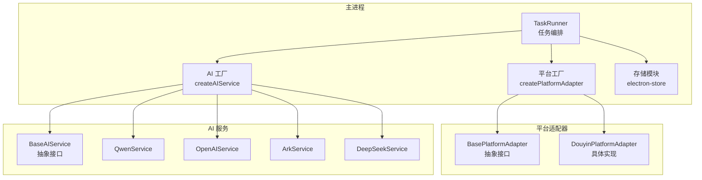
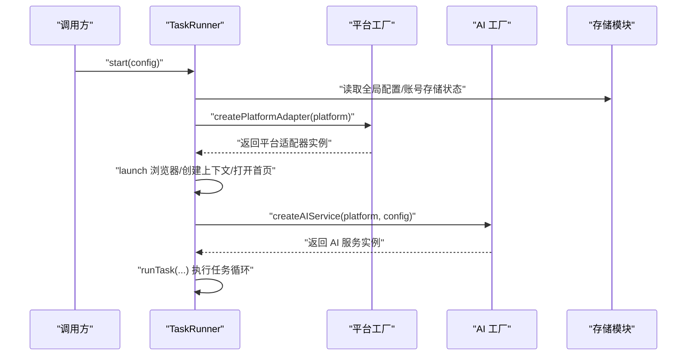
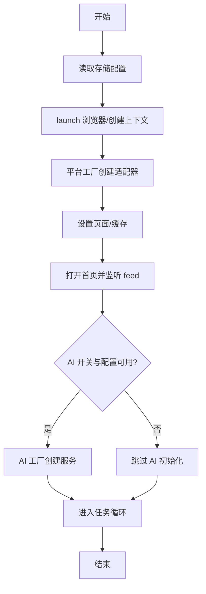
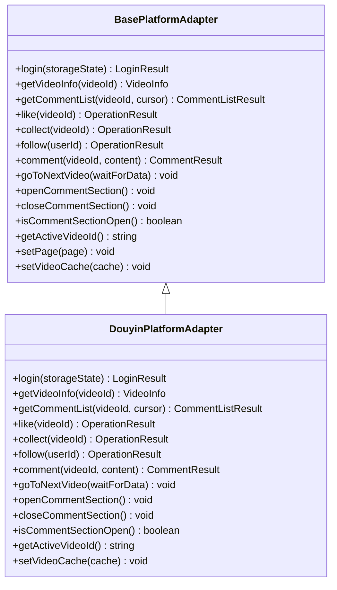
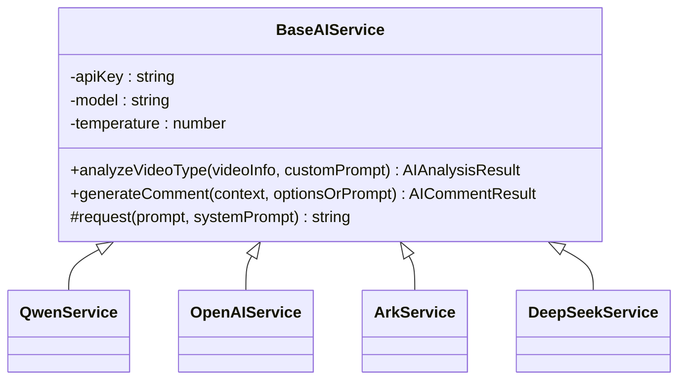
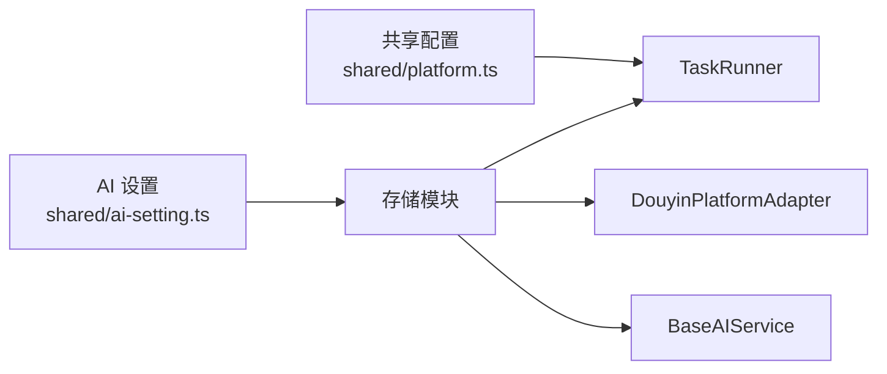
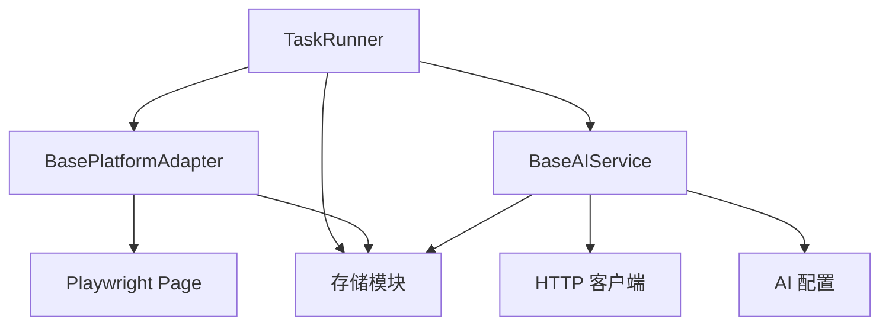

# 依赖注入机制

<cite>
**本文引用的文件**
- [src/main/service/task-runner.ts](file://src/main/service/task-runner.ts)
- [src/main/platform/factory.ts](file://src/main/platform/factory.ts)
- [src/main/integration/ai/factory.ts](file://src/main/integration/ai/factory.ts)
- [src/main/platform/base.ts](file://src/main/platform/base.ts)
- [src/main/platform/douyin/index.ts](file://src/main/platform/douyin/index.ts)
- [src/main/integration/ai/base.ts](file://src/main/integration/ai/base.ts)
- [src/main/integration/ai/analyzer/base.ts](file://src/main/integration/ai/analyzer/base.ts)
- [src/main/integration/ai/qwen.ts](file://src/main/integration/ai/qwen.ts)
- [src/main/integration/ai/openai.ts](file://src/main/integration/ai/openai.ts)
- [src/main/integration/ai/ark.ts](file://src/main/integration/ai/ark.ts)
- [src/main/integration/ai/deepseek.ts](file://src/main/integration/ai/deepseek.ts)
- [src/shared/platform.ts](file://src/shared/platform.ts)
- [src/shared/ai-setting.ts](file://src/shared/ai-setting.ts)
- [src/main/utils/storage.ts](file://src/main/utils/storage.ts)
- [src/main/index.ts](file://src/main/index.ts)
</cite>

## 目录
1. [简介](#简介)
2. [项目结构](#项目结构)
3. [核心组件](#核心组件)
4. [架构总览](#架构总览)
5. [详细组件分析](#详细组件分析)
6. [依赖关系分析](#依赖关系分析)
7. [性能考量](#性能考量)
8. [故障排查指南](#故障排查指南)
9. [结论](#结论)
10. [附录](#附录)

## 简介
本文件系统性梳理 AutoOps 中的依赖注入机制，重点围绕 TaskRunner 如何通过构造函数与工厂函数实现依赖注入，分析平台适配器、AI 服务、存储模块之间的依赖关系与初始化顺序，并说明如何通过配置实现组件的动态绑定。同时，阐述依赖注入如何提升可测试性与可维护性，如何通过依赖注入实现组件替换与扩展，总结依赖注入容器设计模式（单例、工厂与 DI 的结合），并提供最佳实践与常见问题排查方法。

## 项目结构
AutoOps 的主进程采用模块化组织，关键依赖注入发生于以下层次：
- 服务层：TaskRunner 负责任务生命周期与业务流程编排
- 平台适配层：BasePlatformAdapter 抽象平台差异，具体平台适配器由工厂创建
- AI 服务层：BaseAIService 抽象 AI 能力，具体平台由工厂按配置创建
- 配置与存储：通过共享配置对象与存储模块驱动运行时行为

图表来源
- [src/main/service/task-runner.ts:1-120](file://src/main/service/task-runner.ts#L1-L120)
- [src/main/platform/factory.ts:1-32](file://src/main/platform/factory.ts#L1-L32)
- [src/main/integration/ai/factory.ts:1-27](file://src/main/integration/ai/factory.ts#L1-L27)
- [src/main/platform/base.ts:1-105](file://src/main/platform/base.ts#L1-L105)
- [src/main/platform/douyin/index.ts:1-120](file://src/main/platform/douyin/index.ts#L1-L120)
- [src/main/integration/ai/base.ts:1-131](file://src/main/integration/ai/base.ts#L1-L131)
- [src/main/integration/ai/qwen.ts:1-45](file://src/main/integration/ai/qwen.ts#L1-L45)
- [src/main/integration/ai/openai.ts:1-45](file://src/main/integration/ai/openai.ts#L1-L45)
- [src/main/integration/ai/ark.ts:1-45](file://src/main/integration/ai/ark.ts#L1-L45)
- [src/main/integration/ai/deepseek.ts:1-45](file://src/main/integration/ai/deepseek.ts#L1-L45)
- [src/main/utils/storage.ts:1-53](file://src/main/utils/storage.ts#L1-L53)

章节来源
- [src/main/service/task-runner.ts:1-120](file://src/main/service/task-runner.ts#L1-L120)
- [src/main/platform/factory.ts:1-32](file://src/main/platform/factory.ts#L1-L32)
- [src/main/integration/ai/factory.ts:1-27](file://src/main/integration/ai/factory.ts#L1-L27)
- [src/main/platform/base.ts:1-105](file://src/main/platform/base.ts#L1-L105)
- [src/main/platform/douyin/index.ts:1-120](file://src/main/platform/douyin/index.ts#L1-L120)
- [src/main/integration/ai/base.ts:1-131](file://src/main/integration/ai/base.ts#L1-L131)
- [src/main/utils/storage.ts:1-53](file://src/main/utils/storage.ts#L1-L53)

## 核心组件
- TaskRunner：负责启动浏览器上下文、创建平台适配器、按配置选择 AI 服务、执行任务循环与状态管理。其内部通过工厂函数创建平台适配器与 AI 服务，从而实现对外部依赖的解耦。
- 平台适配器工厂：根据平台枚举创建对应适配器实例，屏蔽平台差异。
- AI 服务工厂：根据配置的 AI 平台映射到具体服务类，统一对外接口。
- 存储模块：提供全局配置读写能力，驱动 TaskRunner 的行为选择（如是否启用 AI、账号存储状态等）。

章节来源
- [src/main/service/task-runner.ts:1-120](file://src/main/service/task-runner.ts#L1-L120)
- [src/main/platform/factory.ts:1-32](file://src/main/platform/factory.ts#L1-L32)
- [src/main/integration/ai/factory.ts:1-27](file://src/main/integration/ai/factory.ts#L1-L27)
- [src/main/utils/storage.ts:1-53](file://src/main/utils/storage.ts#L1-L53)

## 架构总览
下图展示了 TaskRunner 在启动阶段的关键依赖注入与初始化顺序：

图表来源
- [src/main/service/task-runner.ts:61-123](file://src/main/service/task-runner.ts#L61-L123)
- [src/main/platform/factory.ts:7-18](file://src/main/platform/factory.ts#L7-L18)
- [src/main/integration/ai/factory.ts:16-25](file://src/main/integration/ai/factory.ts#L16-L25)
- [src/main/utils/storage.ts:46-53](file://src/main/utils/storage.ts#L46-L53)

章节来源
- [src/main/service/task-runner.ts:61-123](file://src/main/service/task-runner.ts#L61-L123)
- [src/main/platform/factory.ts:7-18](file://src/main/platform/factory.ts#L7-L18)
- [src/main/integration/ai/factory.ts:16-25](file://src/main/integration/ai/factory.ts#L16-L25)
- [src/main/utils/storage.ts:46-53](file://src/main/utils/storage.ts#L46-L53)

## 详细组件分析

### TaskRunner 的依赖注入与初始化顺序
- 构造函数注入：TaskRunner 未显式声明构造函数参数，但通过工厂函数间接“注入”平台适配器与 AI 服务；其内部通过工厂函数创建实例，避免硬编码依赖。
- 运行时注入：在启动阶段，TaskRunner 依据配置从工厂创建平台适配器与 AI 服务，并设置页面与缓存，随后进入任务循环。
- 初始化顺序要点：
  1) 读取存储配置（账号、AI 设置等）
  2) 创建浏览器与上下文
  3) 通过平台工厂创建适配器并设置页面/缓存
  4) 打开首页并监听 feed 数据
  5) 若启用 AI 且配置可用，则通过 AI 工厂创建服务
  6) 启动异步任务循环

图表来源
- [src/main/service/task-runner.ts:74-123](file://src/main/service/task-runner.ts#L74-L123)
- [src/main/platform/factory.ts:7-18](file://src/main/platform/factory.ts#L7-L18)
- [src/main/integration/ai/factory.ts:16-25](file://src/main/integration/ai/factory.ts#L16-L25)
- [src/main/utils/storage.ts:46-53](file://src/main/utils/storage.ts#L46-L53)

章节来源
- [src/main/service/task-runner.ts:74-123](file://src/main/service/task-runner.ts#L74-L123)

### 平台适配器的依赖注入与扩展
- 抽象与实现分离：BasePlatformAdapter 定义统一接口，各平台适配器继承实现具体逻辑。
- 工厂函数注入：createPlatformAdapter 根据平台枚举返回具体适配器实例，便于替换与扩展新平台。
- 依赖关系：
  - TaskRunner 依赖 BasePlatformAdapter 接口，实际运行时由工厂注入具体实现。
  - 平台适配器内部依赖 Playwright Page 与存储模块，用于页面交互与状态持久化。

图表来源
- [src/main/platform/base.ts:24-80](file://src/main/platform/base.ts#L24-L80)
- [src/main/platform/douyin/index.ts:60-120](file://src/main/platform/douyin/index.ts#L60-L120)

章节来源
- [src/main/platform/base.ts:24-80](file://src/main/platform/base.ts#L24-L80)
- [src/main/platform/douyin/index.ts:60-120](file://src/main/platform/douyin/index.ts#L60-L120)

### AI 服务的依赖注入与动态绑定
- 抽象与实现分离：BaseAIService 定义统一接口，具体 AI 平台服务继承实现网络请求细节。
- 工厂函数注入：createAIService 根据配置的 AI 平台映射到具体服务类，实现动态绑定。
- 依赖关系：
  - TaskRunner 依赖 AIService 接口，实际运行时由工厂注入具体实现。
  - AI 分析器（DefaultAnalyzer）同样依赖 AIService，通过 setter 注入。

图表来源
- [src/main/integration/ai/base.ts:28-131](file://src/main/integration/ai/base.ts#L28-L131)
- [src/main/integration/ai/qwen.ts:3-45](file://src/main/integration/ai/qwen.ts#L3-L45)
- [src/main/integration/ai/openai.ts:3-45](file://src/main/integration/ai/openai.ts#L3-L45)
- [src/main/integration/ai/ark.ts:3-45](file://src/main/integration/ai/ark.ts#L3-L45)
- [src/main/integration/ai/deepseek.ts:3-45](file://src/main/integration/ai/deepseek.ts#L3-L45)

章节来源
- [src/main/integration/ai/base.ts:28-131](file://src/main/integration/ai/base.ts#L28-L131)
- [src/main/integration/ai/qwen.ts:3-45](file://src/main/integration/ai/qwen.ts#L3-L45)
- [src/main/integration/ai/openai.ts:3-45](file://src/main/integration/ai/openai.ts#L3-L45)
- [src/main/integration/ai/ark.ts:3-45](file://src/main/integration/ai/ark.ts#L3-L45)
- [src/main/integration/ai/deepseek.ts:3-45](file://src/main/integration/ai/deepseek.ts#L3-L45)

### 配置驱动的动态绑定
- 平台配置：通过共享配置对象定义平台信息与 API 端点，TaskRunner 在启动时读取并用于页面导航与数据监听。
- AI 配置：通过存储模块读取 AI 设置，工厂函数据此创建对应平台的服务实例。
- 存储模块：提供键值访问接口，贯穿于 TaskRunner、平台适配器与 AI 服务中，用于持久化认证状态与配置。

图表来源
- [src/shared/platform.ts:18-200](file://src/shared/platform.ts#L18-L200)
- [src/shared/ai-setting.ts:1-29](file://src/shared/ai-setting.ts#L1-L29)
- [src/main/utils/storage.ts:46-53](file://src/main/utils/storage.ts#L46-L53)
- [src/main/service/task-runner.ts:106-113](file://src/main/service/task-runner.ts#L106-L113)
- [src/main/platform/douyin/index.ts:538-550](file://src/main/platform/douyin/index.ts#L538-L550)

章节来源
- [src/shared/platform.ts:18-200](file://src/shared/platform.ts#L18-L200)
- [src/shared/ai-setting.ts:1-29](file://src/shared/ai-setting.ts#L1-L29)
- [src/main/utils/storage.ts:46-53](file://src/main/utils/storage.ts#L46-L53)
- [src/main/service/task-runner.ts:106-113](file://src/main/service/task-runner.ts#L106-L113)
- [src/main/platform/douyin/index.ts:538-550](file://src/main/platform/douyin/index.ts#L538-L550)

### 依赖注入如何提升可测试性与可维护性
- 可测试性：通过接口与工厂注入，可在测试环境中以桩对象替换真实依赖，隔离 UI 与网络层。
- 可维护性：平台与 AI 服务的扩展通过新增工厂映射与适配器实现，无需修改 TaskRunner 主流程。
- 可替换性：通过配置切换平台或 AI 服务，无需改动业务代码。

章节来源
- [src/main/platform/factory.ts:7-18](file://src/main/platform/factory.ts#L7-L18)
- [src/main/integration/ai/factory.ts:16-25](file://src/main/integration/ai/factory.ts#L16-L25)
- [src/main/platform/base.ts:24-80](file://src/main/platform/base.ts#L24-L80)
- [src/main/integration/ai/base.ts:28-131](file://src/main/integration/ai/base.ts#L28-L131)

### 依赖注入容器设计模式
- 单例模式：存储模块与平台/AI 工厂在进程范围内提供全局实例，减少重复创建成本。
- 工厂模式：平台工厂与 AI 工厂集中处理对象创建与依赖装配，降低耦合。
- 组合使用：TaskRunner 通过工厂函数“注入”具体实现，形成轻量 DI 容器效果，便于替换与扩展。

章节来源
- [src/main/utils/storage.ts:16-29](file://src/main/utils/storage.ts#L16-L29)
- [src/main/platform/factory.ts:7-18](file://src/main/platform/factory.ts#L7-L18)
- [src/main/integration/ai/factory.ts:16-25](file://src/main/integration/ai/factory.ts#L16-L25)

### 依赖注入最佳实践
- 明确依赖边界：接口与实现分离，避免在业务逻辑中直接依赖具体实现。
- 集中装配：将对象创建与依赖装配集中在工厂或容器入口，保持调用方简洁。
- 配置驱动：通过配置文件或存储模块决定依赖绑定，便于运行时切换。
- 避免循环依赖：确保工厂仅创建无环依赖链，必要时引入中间层或延迟初始化。
- 清晰表达依赖：通过构造函数注入或 setter 注入明确表达依赖关系，便于单元测试替换。

章节来源
- [src/main/platform/factory.ts:7-18](file://src/main/platform/factory.ts#L7-L18)
- [src/main/integration/ai/factory.ts:16-25](file://src/main/integration/ai/factory.ts#L16-L25)
- [src/main/platform/base.ts:24-80](file://src/main/platform/base.ts#L24-L80)
- [src/main/integration/ai/base.ts:28-131](file://src/main/integration/ai/base.ts#L28-L131)

### 具体场景示例（代码片段路径）
- TaskRunner 启动流程与工厂注入
  - [启动与浏览器初始化:74-104](file://src/main/service/task-runner.ts#L74-L104)
  - [平台适配器创建与设置:97-99](file://src/main/service/task-runner.ts#L97-L99)
  - [AI 服务创建与设置:107-113](file://src/main/service/task-runner.ts#L107-L113)
- 平台工厂与适配器
  - [平台工厂函数:7-18](file://src/main/platform/factory.ts#L7-L18)
  - [抖音适配器实现:60-120](file://src/main/platform/douyin/index.ts#L60-L120)
- AI 工厂与服务
  - [AI 工厂函数:16-25](file://src/main/integration/ai/factory.ts#L16-L25)
  - [Qwen 服务实现:3-45](file://src/main/integration/ai/qwen.ts#L3-L45)
  - [OpenAI 服务实现:3-45](file://src/main/integration/ai/openai.ts#L3-L45)
  - [Ark 服务实现:3-45](file://src/main/integration/ai/ark.ts#L3-L45)
  - [DeepSeek 服务实现:3-45](file://src/main/integration/ai/deepseek.ts#L3-L45)
- 配置与存储
  - [平台配置常量:18-200](file://src/shared/platform.ts#L18-L200)
  - [AI 设置接口:1-29](file://src/shared/ai-setting.ts#L1-L29)
  - [存储模块读写:46-53](file://src/main/utils/storage.ts#L46-L53)

章节来源
- [src/main/service/task-runner.ts:74-113](file://src/main/service/task-runner.ts#L74-L113)
- [src/main/platform/factory.ts:7-18](file://src/main/platform/factory.ts#L7-L18)
- [src/main/integration/ai/factory.ts:16-25](file://src/main/integration/ai/factory.ts#L16-L25)
- [src/main/platform/douyin/index.ts:60-120](file://src/main/platform/douyin/index.ts#L60-L120)
- [src/main/integration/ai/qwen.ts:3-45](file://src/main/integration/ai/qwen.ts#L3-L45)
- [src/main/integration/ai/openai.ts:3-45](file://src/main/integration/ai/openai.ts#L3-L45)
- [src/main/integration/ai/ark.ts:3-45](file://src/main/integration/ai/ark.ts#L3-L45)
- [src/main/integration/ai/deepseek.ts:3-45](file://src/main/integration/ai/deepseek.ts#L3-L45)
- [src/shared/platform.ts:18-200](file://src/shared/platform.ts#L18-L200)
- [src/shared/ai-setting.ts:1-29](file://src/shared/ai-setting.ts#L1-L29)
- [src/main/utils/storage.ts:46-53](file://src/main/utils/storage.ts#L46-L53)

## 依赖关系分析
- TaskRunner 依赖：
  - 平台适配器接口（通过工厂注入具体实现）
  - AI 服务接口（通过工厂注入具体实现）
  - 存储模块（读取配置与持久化状态）
- 平台适配器依赖：
  - Playwright Page（页面交互）
  - 存储模块（持久化认证状态）
- AI 服务依赖：
  - 网络请求（HTTP 客户端）
  - 配置（API Key、模型、温度）

图表来源
- [src/main/service/task-runner.ts:1-120](file://src/main/service/task-runner.ts#L1-L120)
- [src/main/platform/base.ts:24-80](file://src/main/platform/base.ts#L24-L80)
- [src/main/integration/ai/base.ts:28-131](file://src/main/integration/ai/base.ts#L28-L131)
- [src/main/utils/storage.ts:16-29](file://src/main/utils/storage.ts#L16-L29)

章节来源
- [src/main/service/task-runner.ts:1-120](file://src/main/service/task-runner.ts#L1-L120)
- [src/main/platform/base.ts:24-80](file://src/main/platform/base.ts#L24-L80)
- [src/main/integration/ai/base.ts:28-131](file://src/main/integration/ai/base.ts#L28-L131)
- [src/main/utils/storage.ts:16-29](file://src/main/utils/storage.ts#L16-L29)

## 性能考量
- 工厂集中创建：通过工厂集中创建与复用实例，减少重复初始化开销。
- 缓存与降级：平台适配器内置缓存与 DOM 降级策略，降低网络与解析成本。
- 异步任务循环：任务循环采用异步与节流策略，避免阻塞主线程。
- 存储持久化：在适配器关闭时保存认证状态，减少重复登录成本。

章节来源
- [src/main/platform/douyin/index.ts:140-160](file://src/main/platform/douyin/index.ts#L140-L160)
- [src/main/platform/douyin/index.ts:538-550](file://src/main/platform/douyin/index.ts#L538-L550)
- [src/main/service/task-runner.ts:256-392](file://src/main/service/task-runner.ts#L256-L392)

## 故障排查指南
- 平台工厂错误：当传入不支持的平台枚举时，工厂抛出错误，需检查平台配置与枚举值。
- AI 工厂错误：当传入不支持的 AI 平台时，工厂抛出错误，需检查配置与映射表。
- 页面交互失败：平台适配器在页面元素缺失或网络异常时返回失败结果，需检查页面选择器与网络状态。
- AI 请求失败：AI 服务在超时或响应异常时返回空内容，需检查 API Key、网络与模型配置。
- 存储读写异常：存储模块在序列化/反序列化失败时记录警告，需检查存储结构与权限。

章节来源
- [src/main/platform/factory.ts:15-17](file://src/main/platform/factory.ts#L15-L17)
- [src/main/integration/ai/factory.ts:21-23](file://src/main/integration/ai/factory.ts#L21-L23)
- [src/main/platform/douyin/index.ts:321-406](file://src/main/platform/douyin/index.ts#L321-L406)
- [src/main/integration/ai/base.ts:48-59](file://src/main/integration/ai/base.ts#L48-L59)
- [src/main/utils/storage.ts:46-53](file://src/main/utils/storage.ts#L46-L53)

## 结论
AutoOps 通过工厂函数与接口抽象实现了轻量而高效的依赖注入，使 TaskRunner 能够在运行时动态绑定平台适配器与 AI 服务。该设计提升了系统的可扩展性与可维护性，便于在不修改核心逻辑的前提下替换与扩展组件。配合配置驱动与存储模块，系统具备良好的运行时灵活性与可测试性。

## 附录
- 主进程入口注册了各类 IPC 处理器，为前端与主进程通信提供桥梁，间接支撑任务调度与配置下发。
  
章节来源
- [src/main/index.ts:54-84](file://src/main/index.ts#L54-L84)