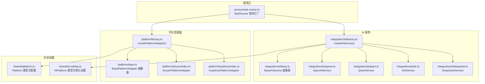
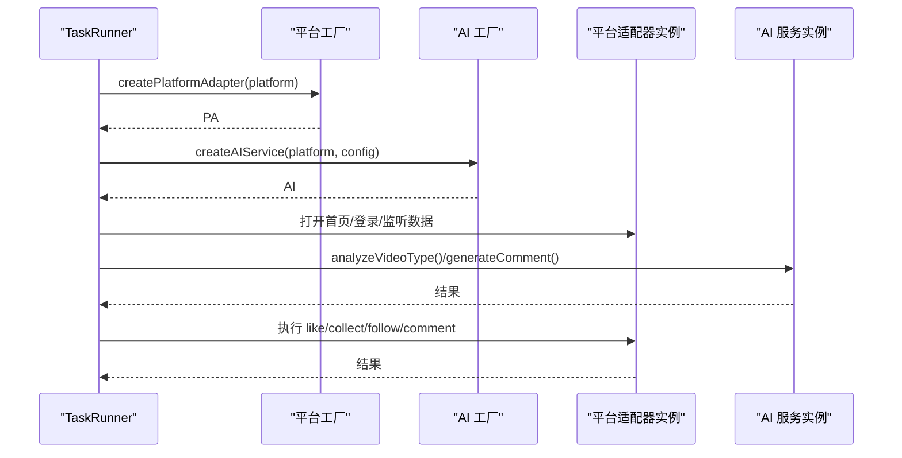
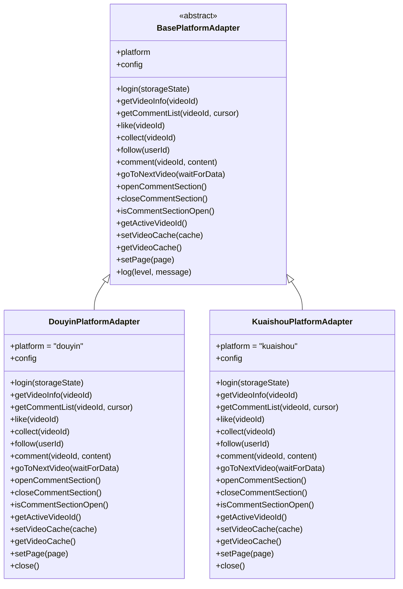
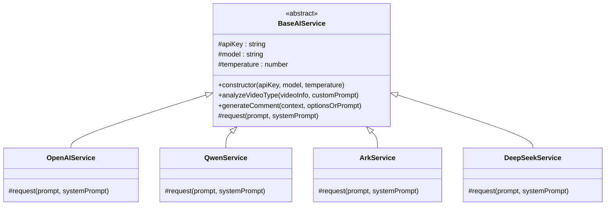
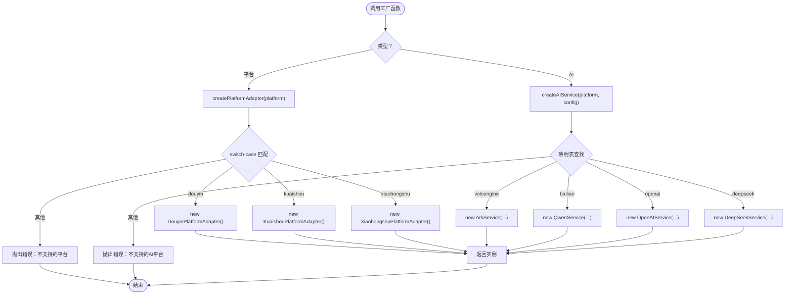
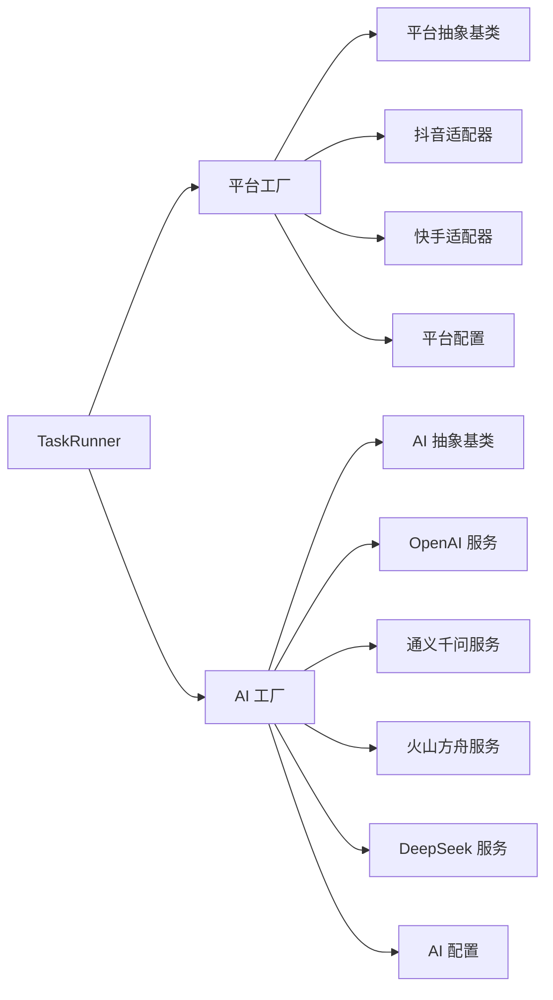

# 工厂模式设计

<cite>
**本文档引用的文件**
- [factory.ts](file://src/main/integration/ai/factory.ts)
- [base.ts](file://src/main/integration/ai/base.ts)
- [openai.ts](file://src/main/integration/ai/openai.ts)
- [qwen.ts](file://src/main/integration/ai/qwen.ts)
- [ark.ts](file://src/main/integration/ai/ark.ts)
- [deepseek.ts](file://src/main/integration/ai/deepseek.ts)
- [factory.ts](file://src/main/platform/factory.ts)
- [base.ts](file://src/main/platform/base.ts)
- [douyin/index.ts](file://src/main/platform/douyin/index.ts)
- [kuaishou/index.ts](file://src/main/platform/kuaishou/index.ts)
- [platform.ts](file://src/shared/platform.ts)
- [ai-setting.ts](file://src/shared/ai-setting.ts)
- [task-runner.ts](file://src/main/service/task-runner.ts)
</cite>

## 目录
1. [简介](#简介)
2. [项目结构](#项目结构)
3. [核心组件](#核心组件)
4. [架构总览](#架构总览)
5. [详细组件分析](#详细组件分析)
6. [依赖关系分析](#依赖关系分析)
7. [性能考量](#性能考量)
8. [故障排查指南](#故障排查指南)
9. [结论](#结论)
10. [附录：扩展指南](#附录扩展指南)

## 简介
本文件系统性阐述 AutoOps 中的工厂模式设计，重点覆盖两大领域：
- 平台适配器工厂：通过统一入口动态创建不同短视频平台的适配器实例，实现平台无关的业务逻辑。
- AI 服务工厂：通过统一入口动态创建不同大模型提供商的 AI 服务实例，实现多供应商的统一调用接口。

工厂模式在此项目中实现了对象创建的解耦、便于扩展新平台与新 AI 供应商，并与配置驱动相结合，使运行期行为可配置、可切换。

## 项目结构
AutoOps 将“平台适配器”和“AI 服务”分别置于独立目录，采用“抽象基类 + 具体实现 + 工厂”的分层组织方式，确保新增平台或 AI 供应商只需少量改动即可接入。

图表来源
- [factory.ts:1-32](file://src/main/platform/factory.ts#L1-L32)
- [base.ts:24-80](file://src/main/platform/base.ts#L24-L80)
- [douyin/index.ts:60-494](file://src/main/platform/douyin/index.ts#L60-L494)
- [kuaishou/index.ts:22-253](file://src/main/platform/kuaishou/index.ts#L22-L253)
- [factory.ts:1-27](file://src/main/integration/ai/factory.ts#L1-L27)
- [base.ts:28-131](file://src/main/integration/ai/base.ts#L28-L131)
- [openai.ts:3-45](file://src/main/integration/ai/openai.ts#L3-L45)
- [qwen.ts:3-45](file://src/main/integration/ai/qwen.ts#L3-L45)
- [ark.ts:3-45](file://src/main/integration/ai/ark.ts#L3-L45)
- [deepseek.ts:3-45](file://src/main/integration/ai/deepseek.ts#L3-L45)
- [platform.ts:1-260](file://src/shared/platform.ts#L1-L260)
- [ai-setting.ts:1-29](file://src/shared/ai-setting.ts#L1-L29)
- [task-runner.ts:1-760](file://src/main/service/task-runner.ts#L1-L760)

章节来源
- [factory.ts:1-32](file://src/main/platform/factory.ts#L1-L32)
- [factory.ts:1-27](file://src/main/integration/ai/factory.ts#L1-L27)
- [platform.ts:1-260](file://src/shared/platform.ts#L1-L260)
- [ai-setting.ts:1-29](file://src/shared/ai-setting.ts#L1-L29)
- [task-runner.ts:1-760](file://src/main/service/task-runner.ts#L1-L760)

## 核心组件
- 平台适配器工厂：提供统一的 createPlatformAdapter()，根据平台枚举返回对应适配器实例；同时提供 isPlatformSupported() 与 getSupportedPlatforms() 辅助查询。
- AI 服务工厂：提供统一的 createAIService()，根据 AI 平台枚举返回对应 AI 服务实例；内部维护平台到具体实现类的映射表。
- 抽象基类：平台适配器与 AI 服务均继承自各自的抽象基类，定义公共接口与通用能力（如日志、参数封装、通用提示构建等）。
- 配置驱动：平台与 AI 的类型、默认配置、可用模型均由共享配置文件集中定义，工厂与使用方通过读取配置实现解耦。

章节来源
- [factory.ts:7-18](file://src/main/platform/factory.ts#L7-L18)
- [factory.ts:20-26](file://src/main/platform/factory.ts#L20-L26)
- [factory.ts:16-25](file://src/main/integration/ai/factory.ts#L16-L25)
- [base.ts:24-80](file://src/main/platform/base.ts#L24-L80)
- [base.ts:28-131](file://src/main/integration/ai/base.ts#L28-L131)
- [platform.ts:1-260](file://src/shared/platform.ts#L1-L260)
- [ai-setting.ts:1-29](file://src/shared/ai-setting.ts#L1-L29)

## 架构总览
工厂模式在 AutoOps 中的职责分工清晰：
- 工厂层：负责“创建”，屏蔽具体实现细节，暴露统一接口。
- 抽象层：定义“契约”，约束实现的一致性与可替换性。
- 实现层：针对具体平台或供应商的具体实现。
- 使用层：仅依赖抽象，不关心具体工厂与实现。

图表来源
- [task-runner.ts:90-103](file://src/main/service/task-runner.ts#L90-L103)
- [task-runner.ts:133-146](file://src/main/service/task-runner.ts#L133-L146)
- [factory.ts:7-18](file://src/main/platform/factory.ts#L7-L18)
- [factory.ts:16-25](file://src/main/integration/ai/factory.ts#L16-L25)

## 详细组件分析

### 平台适配器工厂与抽象基类
- 工厂函数 createPlatformAdapter() 通过 switch-case 返回具体适配器实例，若平台不受支持则抛出错误。
- isPlatformSupported() 与 getSupportedPlatforms() 提供平台能力查询，便于 UI 或配置界面展示。
- 抽象基类 BasePlatformAdapter 定义了平台适配器的统一接口与通用能力（如页面管理、缓存、日志事件等），子类仅需实现差异化逻辑。

图表来源
- [base.ts:24-80](file://src/main/platform/base.ts#L24-L80)
- [douyin/index.ts:60-494](file://src/main/platform/douyin/index.ts#L60-L494)
- [kuaishou/index.ts:22-253](file://src/main/platform/kuaishou/index.ts#L22-L253)

章节来源
- [factory.ts:7-18](file://src/main/platform/factory.ts#L7-L18)
- [factory.ts:20-26](file://src/main/platform/factory.ts#L20-L26)
- [base.ts:24-80](file://src/main/platform/base.ts#L24-L80)
- [douyin/index.ts:60-494](file://src/main/platform/douyin/index.ts#L60-L494)
- [kuaishou/index.ts:22-253](file://src/main/platform/kuaishou/index.ts#L22-L253)

### AI 服务工厂与抽象基类
- 工厂函数 createAIService() 通过映射表返回具体 AI 服务实例，若平台不受支持则抛出错误。
- 抽象基类 BaseAIService 定义了统一的 AIService 接口与通用能力（如参数封装、系统提示构建、结果解析与截断等），子类仅需实现网络请求方法。
- 具体 AI 服务实现均继承自 BaseAIService，覆盖 request() 方法以对接不同供应商的 API。

图表来源
- [base.ts:28-131](file://src/main/integration/ai/base.ts#L28-L131)
- [openai.ts:3-45](file://src/main/integration/ai/openai.ts#L3-L45)
- [qwen.ts:3-45](file://src/main/integration/ai/qwen.ts#L3-L45)
- [ark.ts:3-45](file://src/main/integration/ai/ark.ts#L3-L45)
- [deepseek.ts:3-45](file://src/main/integration/ai/deepseek.ts#L3-L45)

章节来源
- [factory.ts:9-14](file://src/main/integration/ai/factory.ts#L9-L14)
- [factory.ts:16-25](file://src/main/integration/ai/factory.ts#L16-L25)
- [base.ts:28-131](file://src/main/integration/ai/base.ts#L28-L131)
- [openai.ts:3-45](file://src/main/integration/ai/openai.ts#L3-L45)
- [qwen.ts:3-45](file://src/main/integration/ai/qwen.ts#L3-L45)
- [ark.ts:3-45](file://src/main/integration/ai/ark.ts#L3-L45)
- [deepseek.ts:3-45](file://src/main/integration/ai/deepseek.ts#L3-L45)

### 工厂函数实现机制详解
- createPlatformAdapter()：基于平台枚举进行分支选择，返回对应适配器实例；若平台不受支持，抛出错误，避免隐式失败。
- createAIService()：基于平台枚举从映射表中查找构造函数，再实例化具体 AI 服务；若平台不受支持，抛出错误，保证调用方明确感知。

图表来源
- [factory.ts:7-18](file://src/main/platform/factory.ts#L7-L18)
- [factory.ts:16-25](file://src/main/integration/ai/factory.ts#L16-L25)

章节来源
- [factory.ts:7-18](file://src/main/platform/factory.ts#L7-L18)
- [factory.ts:16-25](file://src/main/integration/ai/factory.ts#L16-L25)

### 工厂模式与策略模式的区别与结合
- 工厂模式：关注“如何创建对象”，隐藏构造细节，统一创建入口。
- 策略模式：关注“如何选择算法/实现”，在运行期根据条件切换不同策略。
- 在 AutoOps 中：
  - 工厂模式用于“创建平台适配器/AI 服务”，屏蔽平台差异。
  - 策略模式体现在 TaskRunner 对不同任务类型的处理（如 comment/like/collect/follow/combo），以及对不同规则组的匹配策略。
  - 两者结合：工厂提供对象，策略决定行为；工厂负责“物”，策略负责“事”。

[本节为概念性说明，无需代码来源]

## 依赖关系分析
- 工厂对实现的依赖：工厂导入具体实现类，形成“工厂 -> 实现”的单向依赖。
- 使用方对工厂的依赖：TaskRunner 仅依赖工厂与抽象基类，不直接依赖具体实现，降低耦合。
- 配置对工厂的依赖：平台与 AI 的类型、默认配置由共享配置文件提供，工厂与使用方通过读取配置实现解耦。

图表来源
- [task-runner.ts:4-11](file://src/main/service/task-runner.ts#L4-L11)
- [factory.ts:1-5](file://src/main/platform/factory.ts#L1-L5)
- [factory.ts:1-7](file://src/main/integration/ai/factory.ts#L1-L7)
- [platform.ts:1-260](file://src/shared/platform.ts#L1-L260)
- [ai-setting.ts:1-29](file://src/shared/ai-setting.ts#L1-L29)

章节来源
- [task-runner.ts:4-11](file://src/main/service/task-runner.ts#L4-L11)
- [factory.ts:1-5](file://src/main/platform/factory.ts#L1-L5)
- [factory.ts:1-7](file://src/main/integration/ai/factory.ts#L1-L7)
- [platform.ts:1-260](file://src/shared/platform.ts#L1-L260)
- [ai-setting.ts:1-29](file://src/shared/ai-setting.ts#L1-L29)

## 性能考量
- 工厂创建成本：工厂本身轻量，创建实例的成本主要取决于具体实现类的初始化（如浏览器启动、网络请求等）。建议在任务启动阶段一次性创建并复用实例，减少重复初始化。
- 缓存与异步：平台适配器与 AI 服务均具备缓存与异步处理能力，合理利用缓存可显著降低重复请求成本。
- 超时与重试：AI 服务实现中包含超时控制与异常处理，有助于提升稳定性与用户体验。

[本节为一般性指导，无需代码来源]

## 故障排查指南
- 不支持的平台/AI 平台：当传入的平台枚举不在支持列表时，工厂会抛出错误。检查平台枚举与工厂映射是否一致。
- 登录状态与页面初始化：平台适配器依赖页面与登录状态，若未正确初始化或登录失败，相关操作会返回失败。检查 TaskRunner 的登录流程与页面设置。
- AI 请求失败：AI 服务实现包含超时与异常捕获，若返回空结果或解析失败，将回退到默认行为。检查 API Key、模型名称与网络连通性。
- 日志与事件：平台适配器通过事件系统输出日志，可通过订阅事件定位问题。

章节来源
- [factory.ts:15-17](file://src/main/platform/factory.ts#L15-L17)
- [factory.ts:21-23](file://src/main/integration/ai/factory.ts#L21-L23)
- [base.ts:68-79](file://src/main/platform/base.ts#L68-L79)
- [openai.ts:32-43](file://src/main/integration/ai/openai.ts#L32-L43)
- [qwen.ts:32-43](file://src/main/integration/ai/qwen.ts#L32-L43)
- [ark.ts:32-43](file://src/main/integration/ai/ark.ts#L32-L43)
- [deepseek.ts:32-43](file://src/main/integration/ai/deepseek.ts#L32-L43)

## 结论
AutoOps 的工厂模式设计通过“抽象基类 + 工厂 + 具体实现 + 配置驱动”的架构，实现了平台与 AI 服务的高内聚、低耦合与强扩展性。工厂函数将对象创建细节封装起来，使用方仅依赖抽象，从而获得：
- 明确的扩展边界：新增平台或 AI 供应商只需实现抽象基类并更新工厂映射。
- 统一的调用体验：通过统一接口与通用能力，降低使用复杂度。
- 配置驱动的灵活性：通过共享配置文件集中管理类型与默认值，实现运行期可配置。

[本节为总结性内容，无需代码来源]

## 附录：扩展指南

### 扩展新的平台适配器
步骤概览：
1. 新建适配器类：在 platform 目录下新增文件，实现 BasePlatformAdapter 抽象类，定义平台专属的登录、浏览、交互等方法。
2. 更新工厂：在 platform/factory.ts 中增加 switch-case 分支或映射项，返回新适配器实例。
3. 更新配置：在 shared/platform.ts 中完善 PLATFORMS 与 PLATFORM_CONFIGS，补充选择器、键盘快捷键、API 端点等。
4. 测试验证：在 TaskRunner 中通过 createPlatformAdapter() 创建实例，验证登录与基本操作。

章节来源
- [factory.ts:7-18](file://src/main/platform/factory.ts#L7-L18)
- [base.ts:24-80](file://src/main/platform/base.ts#L24-L80)
- [platform.ts:18-200](file://src/shared/platform.ts#L18-L200)

### 扩展新的 AI 服务提供商
步骤概览：
1. 新建服务类：在 integration/ai 目录下新增文件，实现 BaseAIService 抽象类，覆盖 request() 方法以对接新供应商 API。
2. 更新工厂：在 integration/ai/factory.ts 中更新映射表，将新平台映射到新服务类。
3. 更新配置：在 shared/ai-setting.ts 中完善 AIPlatform 类型、默认设置与可用模型列表。
4. 测试验证：在 TaskRunner 中通过 createAIService() 创建实例，验证分析与评论生成功能。

章节来源
- [factory.ts:9-14](file://src/main/integration/ai/factory.ts#L9-L14)
- [base.ts:28-131](file://src/main/integration/ai/base.ts#L28-L131)
- [ai-setting.ts:1-29](file://src/shared/ai-setting.ts#L1-L29)

### 组件生命周期管理
- 创建：通过工厂函数创建实例，注入必要参数（如 API Key、模型、温度等）。
- 初始化：平台适配器在 TaskRunner 中设置页面与缓存；AI 服务在 TaskRunner 中按需创建。
- 运行：通过抽象接口执行操作，平台适配器负责页面交互，AI 服务负责文本生成。
- 关闭：平台适配器负责保存状态并释放资源；工厂不负责销毁，遵循“谁创建谁负责”的原则。

章节来源
- [task-runner.ts:90-103](file://src/main/service/task-runner.ts#L90-L103)
- [task-runner.ts:133-146](file://src/main/service/task-runner.ts#L133-L146)
- [douyin/index.ts:480-492](file://src/main/platform/douyin/index.ts#L480-L492)
- [kuaishou/index.ts:241-251](file://src/main/platform/kuaishou/index.ts#L241-L251)

### 配置驱动的组件创建
- 平台配置：通过 shared/platform.ts 的 PLATFORMS 与 PLATFORM_CONFIGS 提供平台信息与选择器、端点、快捷键等。
- AI 配置：通过 shared/ai-setting.ts 的 AISettings 与默认值提供平台、API Key、模型与温度等。
- 工厂与使用方：工厂仅负责创建，使用方（如 TaskRunner）读取配置并调用工厂创建实例，实现“配置即行为”。

章节来源
- [platform.ts:18-200](file://src/shared/platform.ts#L18-L200)
- [ai-setting.ts:3-22](file://src/shared/ai-setting.ts#L3-L22)
- [task-runner.ts:96-103](file://src/main/service/task-runner.ts#L96-L103)
- [task-runner.ts:139-146](file://src/main/service/task-runner.ts#L139-L146)