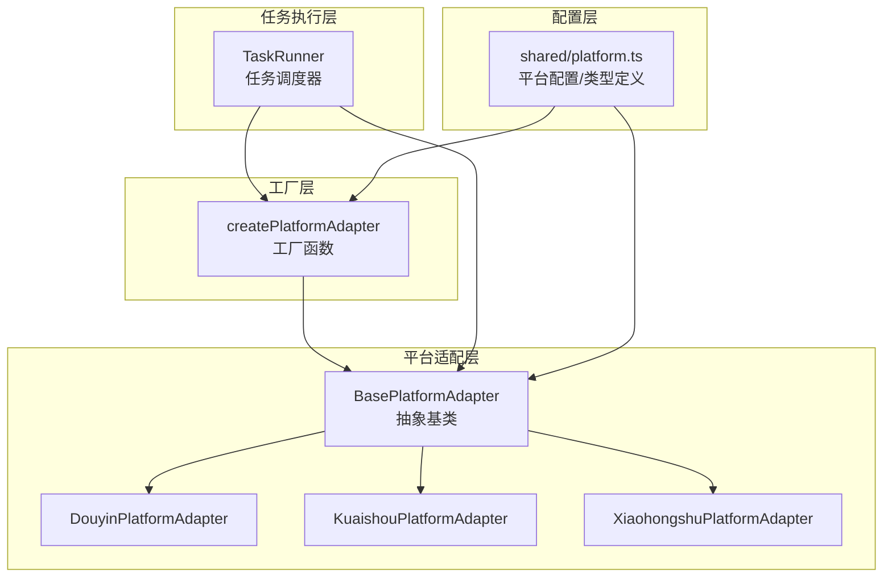
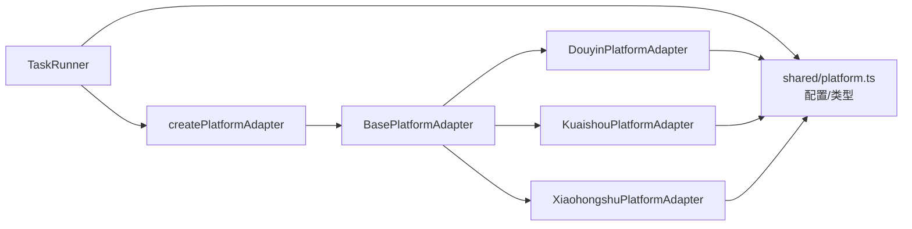
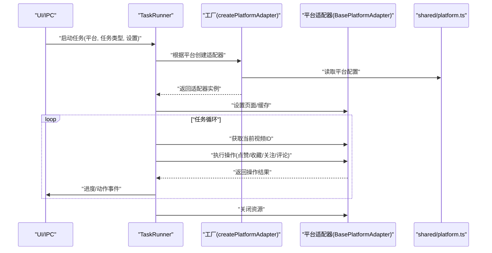
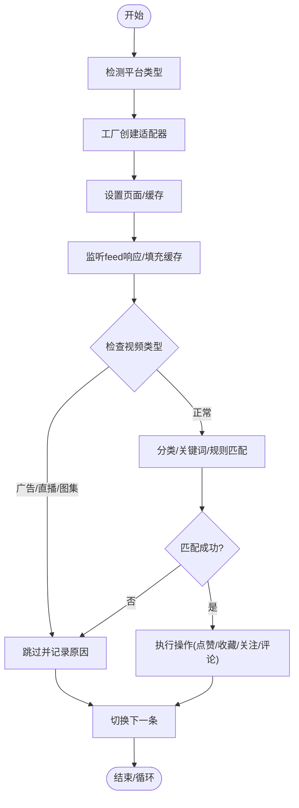

# 策略模式应用

<cite>
**本文档引用的文件**
- [src/main/platform/base.ts](file://src/main/platform/base.ts)
- [src/main/platform/factory.ts](file://src/main/platform/factory.ts)
- [src/main/platform/douyin/index.ts](file://src/main/platform/douyin/index.ts)
- [src/main/platform/kuaishou/index.ts](file://src/main/platform/kuaishou/index.ts)
- [src/main/platform/xiaohongshu/index.ts](file://src/main/platform/xiaohongshu/index.ts)
- [src/shared/platform.ts](file://src/shared/platform.ts)
- [src/main/service/task-runner.ts](file://src/main/service/task-runner.ts)
- [src/main/ipc/task.ts](file://src/main/ipc/task.ts)
- [src/main/ipc/account.ts](file://src/main/ipc/account.ts)
</cite>

## 目录
1. [引言](#引言)
2. [项目结构](#项目结构)
3. [核心组件](#核心组件)
4. [架构总览](#架构总览)
5. [详细组件分析](#详细组件分析)
6. [依赖关系分析](#依赖关系分析)
7. [性能考虑](#性能考虑)
8. [故障排查指南](#故障排查指南)
9. [结论](#结论)
10. [附录](#附录)

## 引言
本文件系统化阐述 AutoOps 在多平台短视频生态中的策略模式应用，重点围绕 BasePlatformAdapter 抽象基类的设计理念、各平台适配器如何实现统一操作接口、策略模式在多平台支持中的优势、平台间可替换性、与工厂模式的结合、配置驱动的策略选择与切换，以及扩展新平台与自定义操作策略的方法。文档同时提供代码级架构图与流程图，帮助读者快速理解并实践该模式。

## 项目结构
AutoOps 的策略模式主要集中在平台适配层与任务执行层：
- 平台适配层：抽象基类 BasePlatformAdapter 定义统一接口；各平台适配器（抖音、快手、小红书）实现具体差异。
- 工厂层：createPlatformAdapter 根据平台类型创建对应适配器实例。
- 任务执行层：TaskRunner 使用适配器执行统一操作，屏蔽平台差异。
- 配置层：shared/platform.ts 提供平台配置、选择器、键盘快捷键等统一数据结构。



**图表来源**
- [src/main/platform/base.ts:24-80](file://src/main/platform/base.ts#L24-L80)
- [src/main/platform/factory.ts:7-18](file://src/main/platform/factory.ts#L7-L18)
- [src/main/platform/douyin/index.ts:60-71](file://src/main/platform/douyin/index.ts#L60-L71)
- [src/main/platform/kuaishou/index.ts:22-33](file://src/main/platform/kuaishou/index.ts#L22-L33)
- [src/main/platform/xiaohongshu/index.ts:23-34](file://src/main/platform/xiaohongshu/index.ts#L23-L34)
- [src/shared/platform.ts:1-260](file://src/shared/platform.ts#L1-L260)

**章节来源**
- [src/main/platform/base.ts:1-105](file://src/main/platform/base.ts#L1-L105)
- [src/main/platform/factory.ts:1-32](file://src/main/platform/factory.ts#L1-L32)
- [src/shared/platform.ts:1-260](file://src/shared/platform.ts#L1-L260)

## 核心组件
- BasePlatformAdapter：定义统一的平台操作接口与通用能力（如日志、页面管理、缓存），并以抽象方法约束子类必须实现的平台特定行为。
- 各平台适配器：Douyin/Kuaishou/Xiaohongshu 分别实现登录、视频信息获取、评论列表、点赞、收藏、关注、评论、视频切换、评论区开关等方法，并封装平台特有的 DOM 选择器、键盘快捷键与网络监听。
- 工厂函数 createPlatformAdapter：根据平台枚举返回对应适配器实例，实现“策略选择”与“可替换性”。
- TaskRunner：任务调度器，持有适配器实例，统一执行任务流程（视频识别、规则匹配、AI 生成、操作执行、进度上报）。
- shared/platform.ts：集中定义平台类型、平台配置、选择器、API 端点、键盘快捷键、统一的数据结构（VideoInfo、CommentListResult 等）。

**章节来源**
- [src/main/platform/base.ts:24-80](file://src/main/platform/base.ts#L24-L80)
- [src/main/platform/douyin/index.ts:60-494](file://src/main/platform/douyin/index.ts#L60-L494)
- [src/main/platform/kuaishou/index.ts:22-253](file://src/main/platform/kuaishou/index.ts#L22-L253)
- [src/main/platform/xiaohongshu/index.ts:23-264](file://src/main/platform/xiaohongshu/index.ts#L23-L264)
- [src/main/platform/factory.ts:7-18](file://src/main/platform/factory.ts#L7-L18)
- [src/main/service/task-runner.ts:25-760](file://src/main/service/task-runner.ts#L25-L760)
- [src/shared/platform.ts:1-260](file://src/shared/platform.ts#L1-L260)

## 架构总览
策略模式在 AutoOps 中体现为：
- 抽象接口：BasePlatformAdapter 定义统一操作契约。
- 多种实现：各平台适配器实现具体细节。
- 运行时选择：工厂函数根据配置动态创建适配器。
- 统一调度：TaskRunner 仅依赖抽象接口，不关心具体平台。

```mermaid
classDiagram
class BasePlatformAdapter {
<<abstract>>
+platform : Platform
+config : PlatformConfig
+login(storageState) Promise~LoginResult~
+getVideoInfo(videoId) Promise~VideoInfo|null~
+getCommentList(videoId, cursor) Promise~CommentListResult|null~
+like(videoId) Promise~OperationResult~
+collect(videoId) Promise~OperationResult~
+follow(userId) Promise~OperationResult~
+comment(videoId, content) Promise~CommentResult~
+goToNextVideo(waitForData) Promise~void~
+openCommentSection() Promise~void~
+closeCommentSection() Promise~void~
+isCommentSectionOpen() Promise~boolean~
+getActiveVideoId() Promise~string|null~
+setPage(page) void
+setVideoCache(cache) void
+getVideoCache() Map
+emit(event, data) void
}
class DouyinPlatformAdapter {
+platform = "douyin"
+config = PLATFORM_CONFIGS.douyin
+login(storageState) Promise~LoginResult~
+getVideoInfo(videoId) Promise~VideoInfo|null~
+getCommentList(videoId, cursor) Promise~CommentListResult|null~
+like(videoId) Promise~OperationResult~
+collect(videoId) Promise~OperationResult~
+follow(userId) Promise~OperationResult~
+comment(videoId, content) Promise~CommentResult~
+goToNextVideo(waitForData) Promise~void~
+openCommentSection() Promise~void~
+closeCommentSection() Promise~void~
+isCommentSectionOpen() Promise~boolean~
+getActiveVideoId() Promise~string|null~
+setupPage(page, storageState) Promise~void~
+getCurrentVideoStartTime() number
+setCurrentVideoStartTime(time) void
+close() Promise~void~
}
class KuaishouPlatformAdapter {
+platform = "kuaishou"
+config = PLATFORM_CONFIGS.kuaishou
+login(storageState) Promise~LoginResult~
+getVideoInfo(videoId) Promise~VideoInfo|null~
+getCommentList(videoId, cursor) Promise~CommentListResult|null~
+like(videoId) Promise~OperationResult~
+collect(videoId) Promise~OperationResult~
+follow(userId) Promise~OperationResult~
+comment(videoId, content) Promise~CommentResult~
+goToNextVideo(waitForData) Promise~void~
+openCommentSection() Promise~void~
+closeCommentSection() Promise~void~
+isCommentSectionOpen() Promise~boolean~
+getActiveVideoId() Promise~string|null~
+setupPage(page, storageState) Promise~void~
+close() Promise~void~
}
class XiaohongshuPlatformAdapter {
+platform = "xiaohongshu"
+config = PLATFORM_CONFIGS.xiaohongshu
+login(storageState) Promise~LoginResult~
+getVideoInfo(noteId) Promise~VideoInfo|null~
+getCommentList(noteId, cursor) Promise~CommentListResult|null~
+like(noteId) Promise~OperationResult~
+collect(noteId) Promise~OperationResult~
+follow(userId) Promise~OperationResult~
+comment(noteId, content) Promise~CommentResult~
+goToNextVideo(waitForData) Promise~void~
+openCommentSection() Promise~void~
+closeCommentSection() Promise~void~
+isCommentSectionOpen() Promise~boolean~
+getActiveVideoId() Promise~string|null~
+setupPage(page, storageState) Promise~void~
+close() Promise~void~
}
class TaskRunner {
+start(config) Promise~string~
+startWithContext(config, context) Promise~string~
+pause() Promise~void~
+resume() Promise~void~
+stop() Promise~void~
+runTask(config) Promise~void~
+executeOperations(videoInfo, settings, taskType, counts) Promise~Array~
+executeComment(videoInfo, settings, op) Promise~{success,error}~
+executeLike(videoId) Promise~{success,error}~
+executeCollect(videoId) Promise~{success,error}~
+executeFollow(userId) Promise~{success,error}~
+goToNextVideo() Promise~void~
+getCurrentVideoInfo(maxRetries) Promise~VideoInfo|null~
+checkVideoType(videoInfo, settings) {shouldSkip,reason}
+checkVideoCategory(videoInfo, settings) {shouldSkip,reason}
+matchRules(videoInfo, settings) Promise~RuleGroup|null~
+recordSkip(videoInfo, reason) Promise~void~
}
BasePlatformAdapter <|-- DouyinPlatformAdapter
BasePlatformAdapter <|-- KuaishouPlatformAdapter
BasePlatformAdapter <|-- XiaohongshuPlatformAdapter
TaskRunner --> BasePlatformAdapter : "依赖抽象接口"
```

**图表来源**
- [src/main/platform/base.ts:24-80](file://src/main/platform/base.ts#L24-L80)
- [src/main/platform/douyin/index.ts:60-494](file://src/main/platform/douyin/index.ts#L60-L494)
- [src/main/platform/kuaishou/index.ts:22-253](file://src/main/platform/kuaishou/index.ts#L22-L253)
- [src/main/platform/xiaohongshu/index.ts:23-264](file://src/main/platform/xiaohongshu/index.ts#L23-L264)
- [src/main/service/task-runner.ts:25-760](file://src/main/service/task-runner.ts#L25-L760)

## 详细组件分析

### BasePlatformAdapter 抽象基类
设计理念：
- 统一接口：所有平台必须实现登录、视频信息、评论列表、点赞、收藏、关注、评论、视频切换、评论区控制等方法。
- 通用能力：日志系统（带平台标识）、页面管理、视频缓存、事件发射（便于 UI 层订阅）。
- 平台差异：通过 config（选择器、键盘快捷键、API 端点）隔离差异，子类仅实现具体交互逻辑。

关键点：
- 抽象方法保证“策略可替换”，调用方无需关心具体平台。
- 事件发射机制使上层 UI 能实时接收日志与进度。
- 缓存与页面管理减少重复查询与 DOM 访问成本。

**章节来源**
- [src/main/platform/base.ts:24-80](file://src/main/platform/base.ts#L24-L80)

### 工厂模式与策略选择
工厂函数 createPlatformAdapter：
- 输入：平台枚举（douyin/kuaishou/xiaohongshu）。
- 输出：对应平台适配器实例。
- 扩展：新增平台只需在工厂中注册映射，调用方无需修改。

策略选择与切换：
- 配置驱动：通过设置平台字段即可切换策略。
- 运行时切换：TaskRunner 在启动时根据配置创建适配器，后续所有操作均走同一抽象接口。

**章节来源**
- [src/main/platform/factory.ts:7-18](file://src/main/platform/factory.ts#L7-L18)

### 抖音平台适配器（DouyinPlatformAdapter）
平台特定实现：
- 登录：基于 Chromium 新建上下文，访问登录页并检测登录面板消失。
- 视频数据监听：监听 feed 接口响应，填充视频缓存，支持广告/直播/图集过滤。
- 评论：打开评论区，输入文本，等待发布响应，处理验证码弹窗。
- 视频切换：按键触发下一条，等待元素可见并轮询视频 ID 变化，必要时等待缓存数据。
- 评论区控制：通过侧边卡片宽度判断是否打开，支持开关控制。

差异化处理：
- 广告/直播/图集识别与跳过。
- 热门评论提取用于 AI 生成参考。
- 键盘快捷键与选择器来自配置，便于维护。

**章节来源**
- [src/main/platform/douyin/index.ts:60-494](file://src/main/platform/douyin/index.ts#L60-L494)
- [src/shared/platform.ts:88-200](file://src/shared/platform.ts#L88-L200)

### 快手平台适配器（KuaishouPlatformAdapter）
平台特定实现：
- 登录：检测“登录”按钮是否存在判断登录状态。
- 评论：打开评论区，点击输入框，逐字输入，回车提交，关闭评论区。
- 视频切换：按键触发，等待随机时间。
- 评论区控制：通过面板可见性判断。

差异化处理：
- 选择器与端点与抖音不同，但操作流程一致。
- 评论列表暂不支持抓取。

**章节来源**
- [src/main/platform/kuaishou/index.ts:22-253](file://src/main/platform/kuaishou/index.ts#L22-L253)
- [src/shared/platform.ts:119-145](file://src/shared/platform.ts#L119-L145)

### 小红书平台适配器（XiaohongshuPlatformAdapter）
平台特定实现：
- 登录：检测登录按钮判断状态。
- 评论：打开评论区，输入并提交，关闭评论区。
- 视频切换：按键触发，等待随机时间。
- 评论区控制：通过面板可见性判断。

差异化处理：
- 使用 note 缓存替代 feed 缓存。
- 选择器与端点与抖音不同，但操作流程一致。

**章节来源**
- [src/main/platform/xiaohongshu/index.ts:23-264](file://src/main/platform/xiaohongshu/index.ts#L23-L264)
- [src/shared/platform.ts:146-172](file://src/shared/platform.ts#L146-L172)

### 任务执行器（TaskRunner）与策略模式
职责：
- 任务生命周期管理：启动、暂停、恢复、停止。
- 统一任务流程：视频识别、规则匹配、AI 生成、操作执行、进度上报。
- 策略执行：通过适配器执行具体平台操作，屏蔽差异。

关键流程：
- 启动阶段：创建浏览器、上下文、页面；根据平台创建适配器；设置视频数据监听；初始化 AI 服务（可选）。
- 循环阶段：等待视频切换、获取当前视频信息、类型与分类检查、规则匹配、AI 生成评论、执行操作、记录结果、切换下一条。
- 结束阶段：保存状态、关闭资源。

策略模式体现：
- 适配器作为“策略”，TaskRunner 仅依赖抽象接口。
- 工厂负责“策略选择”，配置驱动“策略切换”。

**章节来源**
- [src/main/service/task-runner.ts:25-760](file://src/main/service/task-runner.ts#L25-L760)

### IPC 与配置驱动的策略选择
IPC 层：
- 提供任务启动、停止、暂停、恢复、状态查询等接口。
- 任务启动时读取浏览器路径、迁移配置版本、选择平台与任务类型，委托 TaskManager/TaskRunner 执行。

配置驱动：
- 平台字段决定使用哪个适配器。
- 任务类型（comment/like/collect/follow/combo/watch）决定执行哪些操作。
- 设置项（最大数量、观看时长、AI 开关、规则组等）影响策略执行细节。

**章节来源**
- [src/main/ipc/task.ts:82-132](file://src/main/ipc/task.ts#L82-L132)
- [src/shared/platform.ts:1-260](file://src/shared/platform.ts#L1-L260)

## 依赖关系分析
- TaskRunner 依赖工厂函数创建适配器，适配器依赖 shared/platform.ts 的配置。
- 各平台适配器之间相互独立，互不影响，便于扩展与维护。
- 事件发射贯穿适配器与 TaskRunner，便于 UI 层订阅与展示。



**图表来源**
- [src/main/service/task-runner.ts:90-92](file://src/main/service/task-runner.ts#L90-L92)
- [src/main/platform/factory.ts:7-18](file://src/main/platform/factory.ts#L7-L18)
- [src/shared/platform.ts:1-260](file://src/shared/platform.ts#L1-L260)

**章节来源**
- [src/main/service/task-runner.ts:25-760](file://src/main/service/task-runner.ts#L25-L760)
- [src/main/platform/factory.ts:1-32](file://src/main/platform/factory.ts#L1-L32)
- [src/shared/platform.ts:1-260](file://src/shared/platform.ts#L1-L260)

## 性能考虑
- 缓存策略：适配器内部维护视频/笔记缓存，避免重复请求与 DOM 查询。
- 网络监听：TaskRunner 与适配器均监听 feed 接口响应，批量填充缓存，降低延迟。
- 随机化与节流：评论输入、操作间隔、视频切换等待采用随机范围，提升稳定性与规避风控。
- 并行与共享上下文：TaskRunner 支持共享 BrowserContext，提高多任务并发效率。

[本节为通用指导，不直接分析具体文件]

## 故障排查指南
常见问题与定位思路：
- 无法登录：检查登录 URL、登录面板选择器、storageState 是否正确传递。
- 未获取到视频信息：确认 feed 监听是否生效、缓存是否填充、DOM 选择器是否正确。
- 评论失败：检查评论输入框选择器、验证码弹窗处理、发布响应监听。
- 平台切换无效：确认工厂映射是否完整、平台枚举是否正确、配置是否持久化。

建议排查步骤：
- 查看适配器日志事件（带平台标识），定位具体步骤。
- 检查 shared/platform.ts 中的配置是否与目标平台一致。
- 验证 TaskRunner 的适配器创建与设置过程。

**章节来源**
- [src/main/platform/base.ts:68-79](file://src/main/platform/base.ts#L68-L79)
- [src/main/platform/douyin/index.ts:73-109](file://src/main/platform/douyin/index.ts#L73-L109)
- [src/main/platform/kuaishou/index.ts:35-69](file://src/main/platform/kuaishou/index.ts#L35-L69)
- [src/main/platform/xiaohongshu/index.ts:36-69](file://src/main/platform/xiaohongshu/index.ts#L36-L69)
- [src/main/service/task-runner.ts:55-113](file://src/main/service/task-runner.ts#L55-L113)

## 结论
AutoOps 通过策略模式与工厂模式的结合，实现了多平台短视频生态的统一抽象与灵活扩展。BasePlatformAdapter 定义清晰的契约，各平台适配器封装差异，TaskRunner 以统一流程执行策略，shared/platform.ts 提供配置驱动的可替换性。该架构既保证了平台间的可替换性，又便于新增平台与自定义操作策略，具备良好的可维护性与扩展性。

[本节为总结，不直接分析具体文件]

## 附录

### 策略模式与工厂模式结合的序列图


**图表来源**
- [src/main/service/task-runner.ts:55-113](file://src/main/service/task-runner.ts#L55-L113)
- [src/main/platform/factory.ts:7-18](file://src/main/platform/factory.ts#L7-L18)
- [src/shared/platform.ts:1-260](file://src/shared/platform.ts#L1-L260)

### 平台适配器差异处理流程图


**图表来源**
- [src/main/service/task-runner.ts:423-448](file://src/main/service/task-runner.ts#L423-L448)
- [src/main/platform/douyin/index.ts:159-183](file://src/main/platform/douyin/index.ts#L159-L183)

### 扩展指南：添加新平台
步骤：
1. 在 shared/platform.ts 中新增平台枚举与配置（选择器、端点、快捷键）。
2. 在 src/main/platform/ 下创建新平台目录与适配器文件，继承 BasePlatformAdapter。
3. 在 factory.ts 中注册新平台到适配器的映射。
4. 在 TaskRunner 或 UI 层配置中增加平台选项，验证登录、视频识别、操作执行流程。
5. 如需特殊规则或 UI 适配，在 UI 层补充对应逻辑。

注意事项：
- 保持抽象接口一致，避免破坏策略契约。
- 优先使用配置驱动，减少硬编码。
- 为新平台编写最小可用测试，覆盖关键流程。

**章节来源**
- [src/shared/platform.ts:1-260](file://src/shared/platform.ts#L1-L260)
- [src/main/platform/factory.ts:7-18](file://src/main/platform/factory.ts#L7-L18)