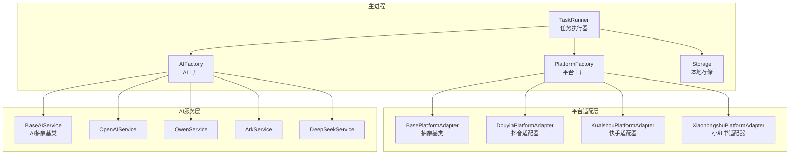
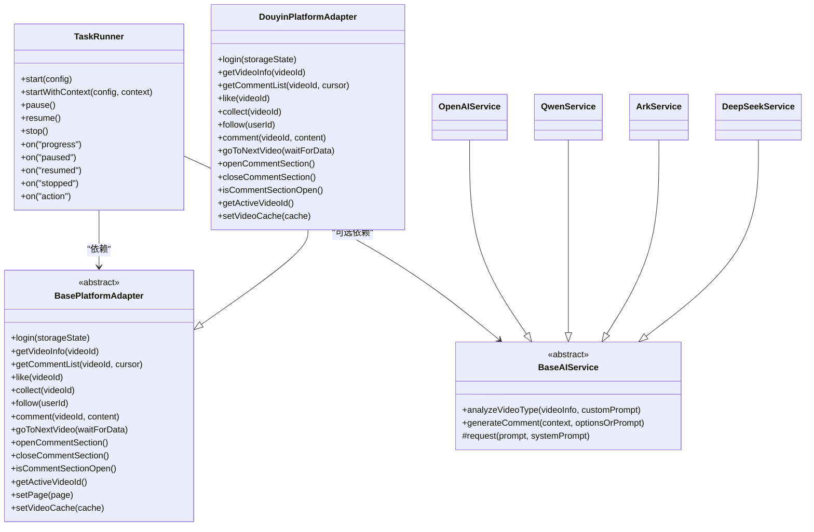
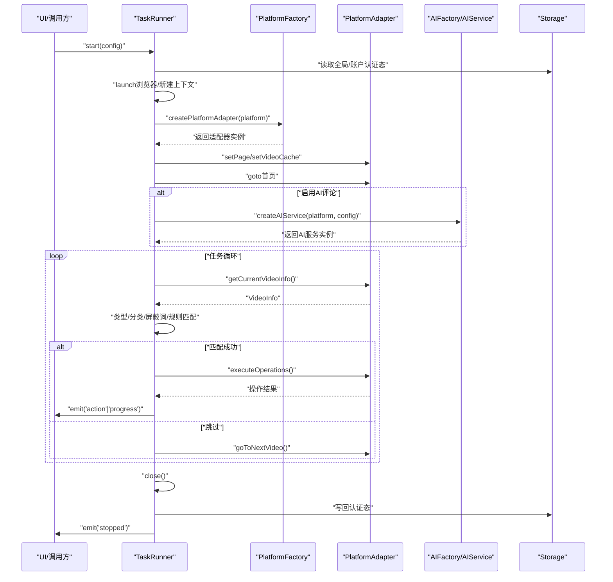
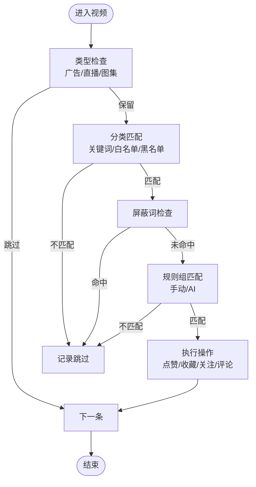
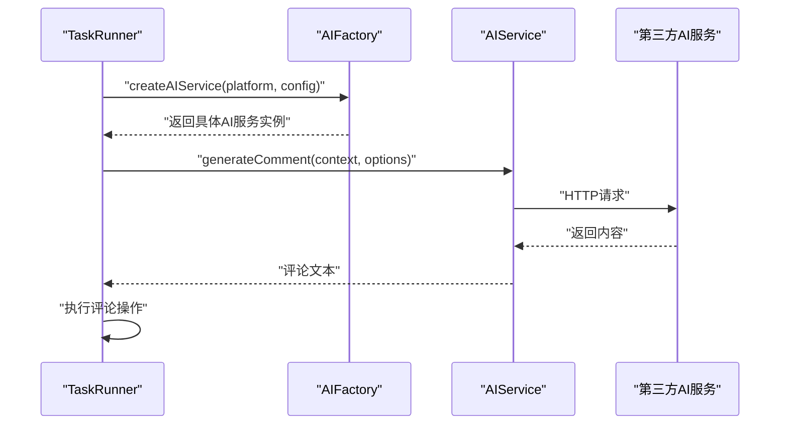
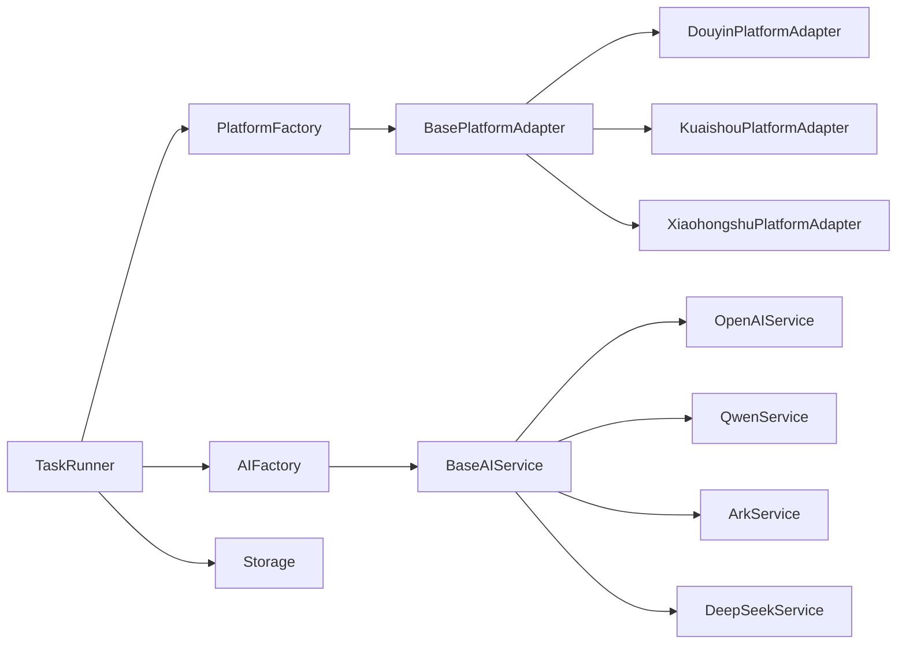

# 组件交互模式

<cite>
**本文引用的文件**
- [src/main/service/task-runner.ts](file://src/main/service/task-runner.ts)
- [src/main/platform/base.ts](file://src/main/platform/base.ts)
- [src/main/platform/factory.ts](file://src/main/platform/factory.ts)
- [src/main/platform/douyin/index.ts](file://src/main/platform/douyin/index.ts)
- [src/main/integration/ai/base.ts](file://src/main/integration/ai/base.ts)
- [src/main/integration/ai/factory.ts](file://src/main/integration/ai/factory.ts)
- [src/main/integration/ai/openai.ts](file://src/main/integration/ai/openai.ts)
- [src/main/integration/ai/qwen.ts](file://src/main/integration/ai/qwen.ts)
- [src/main/integration/ai/ark.ts](file://src/main/integration/ai/ark.ts)
- [src/main/integration/ai/deepseek.ts](file://src/main/integration/ai/deepseek.ts)
- [src/shared/platform.ts](file://src/shared/platform.ts)
- [src/shared/ai-setting.ts](file://src/shared/ai-setting.ts)
- [src/main/utils/storage.ts](file://src/main/utils/storage.ts)
- [src/shared/task.ts](file://src/shared/task.ts)
</cite>

## 目录
1. [简介](#简介)
2. [项目结构](#项目结构)
3. [核心组件](#核心组件)
4. [架构总览](#架构总览)
5. [详细组件分析](#详细组件分析)
6. [依赖分析](#依赖分析)
7. [性能考虑](#性能考虑)
8. [故障排查指南](#故障排查指南)
9. [结论](#结论)
10. [附录](#附录)

## 简介
本文件面向AutoOps的组件交互模式，系统性阐述任务执行器、平台适配器、AI服务集成等核心组件的协作关系、依赖注入与解耦设计；深入分析工厂模式、观察者模式、策略模式在系统中的应用；解释状态管理与业务逻辑的分离、事件驱动架构与回调机制；并总结组件生命周期管理、资源清理与异常处理策略，以及扩展性、插件化与向后兼容的设计考量。

## 项目结构
AutoOps采用主进程+渲染进程的Electron架构，核心业务位于主进程的src/main目录，前端界面位于src/renderer。组件交互主要集中在主进程的服务层与适配层，通过工厂模式创建平台适配器与AI服务，通过事件总线进行状态与进度上报。

**图表来源**
- [src/main/service/task-runner.ts:1-760](file://src/main/service/task-runner.ts#L1-L760)
- [src/main/platform/factory.ts:1-32](file://src/main/platform/factory.ts#L1-L32)
- [src/main/platform/base.ts:1-105](file://src/main/platform/base.ts#L1-L105)
- [src/main/platform/douyin/index.ts:1-507](file://src/main/platform/douyin/index.ts#L1-L507)
- [src/main/integration/ai/factory.ts:1-27](file://src/main/integration/ai/factory.ts#L1-L27)
- [src/main/integration/ai/base.ts:1-131](file://src/main/integration/ai/base.ts#L1-L131)
- [src/main/utils/storage.ts:1-46](file://src/main/utils/storage.ts#L1-L46)

**章节来源**
- [src/main/service/task-runner.ts:1-760](file://src/main/service/task-runner.ts#L1-L760)
- [src/main/platform/factory.ts:1-32](file://src/main/platform/factory.ts#L1-L32)
- [src/main/platform/base.ts:1-105](file://src/main/platform/base.ts#L1-L105)
- [src/main/platform/douyin/index.ts:1-507](file://src/main/platform/douyin/index.ts#L1-L507)
- [src/main/integration/ai/factory.ts:1-27](file://src/main/integration/ai/factory.ts#L1-L27)
- [src/main/integration/ai/base.ts:1-131](file://src/main/integration/ai/base.ts#L1-L131)
- [src/main/utils/storage.ts:1-46](file://src/main/utils/storage.ts#L1-L46)

## 核心组件
- 任务执行器（TaskRunner）
  - 负责浏览器生命周期、页面导航、视频数据缓存、规则匹配、操作执行与状态上报。
  - 内置事件总线，向外发出进度、暂停/恢复、停止、动作结果等事件。
  - 支持独立浏览器与共享上下文两种运行模式，便于多任务并行。
- 平台适配器（BasePlatformAdapter + 具体实现）
  - 抽象定义平台统一能力：登录、获取视频信息、评论区交互、点赞/收藏/关注、翻页等。
  - 具体适配器（抖音/快手/小红书）封装平台差异与选择器映射。
- AI服务（BaseAIService + 具体实现）
  - 统一AI分析与评论生成接口，具体实现（OpenAI/Qwen/Ark/DeepSeek）负责HTTP请求与参数拼装。
- 工厂模式
  - 平台工厂：按平台类型创建对应适配器实例。
  - AI工厂：按AI平台类型创建对应服务实例。
- 存储与配置
  - 本地存储封装，保存认证态、任务设置、AI设置等。
  - 平台与AI配置常量集中管理，便于扩展与维护。

**章节来源**
- [src/main/service/task-runner.ts:25-113](file://src/main/service/task-runner.ts#L25-L113)
- [src/main/platform/base.ts:24-80](file://src/main/platform/base.ts#L24-L80)
- [src/main/platform/factory.ts:7-18](file://src/main/platform/factory.ts#L7-L18)
- [src/main/integration/ai/base.ts:23-60](file://src/main/integration/ai/base.ts#L23-L60)
- [src/main/integration/ai/factory.ts:9-25](file://src/main/integration/ai/factory.ts#L9-L25)
- [src/main/utils/storage.ts:14-46](file://src/main/utils/storage.ts#L14-L46)

## 架构总览
AutoOps采用“任务执行器 + 适配器 + AI服务”的分层架构，通过工厂注入平台与AI能力，通过事件总线实现状态与进度的解耦上报。平台与AI均为可插拔扩展点，遵循开闭原则，便于新增平台与AI服务。

**图表来源**
- [src/main/service/task-runner.ts:25-113](file://src/main/service/task-runner.ts#L25-L113)
- [src/main/platform/base.ts:24-80](file://src/main/platform/base.ts#L24-L80)
- [src/main/platform/douyin/index.ts:56-507](file://src/main/platform/douyin/index.ts#L56-L507)
- [src/main/integration/ai/base.ts:28-60](file://src/main/integration/ai/base.ts#L28-L60)
- [src/main/integration/ai/openai.ts:3-45](file://src/main/integration/ai/openai.ts#L3-L45)
- [src/main/integration/ai/qwen.ts:3-45](file://src/main/integration/ai/qwen.ts#L3-L45)
- [src/main/integration/ai/ark.ts:3-45](file://src/main/integration/ai/ark.ts#L3-L45)
- [src/main/integration/ai/deepseek.ts:3-45](file://src/main/integration/ai/deepseek.ts#L3-L45)

## 详细组件分析

### 任务执行器（TaskRunner）交互协议与通信接口
- 生命周期与状态
  - 独立浏览器模式与共享上下文模式，分别控制浏览器与上下文的创建与关闭。
  - 内部状态包括运行、暂停、停止、完成、失败，并通过事件总线对外广播。
- 事件驱动与回调
  - 进度事件、暂停/恢复事件、停止事件、单次操作结果事件。
  - 用于UI层实时展示与状态同步。
- 数据流与规则引擎
  - 视频数据缓存（基于feed API响应），视频类型与分类过滤，屏蔽词匹配，规则组匹配（手动/AI）。
  - 组合任务的概率与上限控制，单次操作执行与结果统计。
- 与平台适配器的交互
  - 通过工厂创建适配器，设置Page与缓存，调用翻页、打开评论区、执行操作等。
- 与AI服务的交互
  - 在启用AI评论时，按需创建AI服务实例，调用分析与评论生成接口。
- 异常处理与资源清理
  - 任务异常捕获并标记失败，统一关闭页面与上下文；若非共享上下文则关闭浏览器。

**图表来源**
- [src/main/service/task-runner.ts:55-113](file://src/main/service/task-runner.ts#L55-L113)
- [src/main/platform/factory.ts:7-18](file://src/main/platform/factory.ts#L7-L18)
- [src/main/platform/base.ts:55-57](file://src/main/platform/base.ts#L55-L57)
- [src/main/integration/ai/factory.ts:16-25](file://src/main/integration/ai/factory.ts#L16-L25)
- [src/main/utils/storage.ts:40-46](file://src/main/utils/storage.ts#L40-L46)

**章节来源**
- [src/main/service/task-runner.ts:25-371](file://src/main/service/task-runner.ts#L25-L371)
- [src/main/platform/base.ts:24-80](file://src/main/platform/base.ts#L24-L80)
- [src/main/platform/factory.ts:7-18](file://src/main/platform/factory.ts#L7-L18)
- [src/main/integration/ai/factory.ts:16-25](file://src/main/integration/ai/factory.ts#L16-L25)
- [src/main/utils/storage.ts:40-46](file://src/main/utils/storage.ts#L40-L46)

### 平台适配器（BasePlatformAdapter + DouyinPlatformAdapter）
- 设计要点
  - 抽象定义平台统一接口，确保TaskRunner无需关心平台差异。
  - 通过配置对象（选择器、键盘快捷键、API端点）隔离平台DOM与接口差异。
  - 提供事件日志接口，统一输出平台侧日志。
- 抖音适配器实现
  - 封装feed API监听、热门评论抓取、验证码弹窗检测、翻页等待与数据一致性保障。
  - 提供活跃度检测、评论输入模拟与发布响应监听。
- 与TaskRunner的协作
  - TaskRunner通过适配器执行具体平台操作，适配器通过事件总线上报日志。

**图表来源**
- [src/main/service/task-runner.ts:423-559](file://src/main/service/task-runner.ts#L423-L559)
- [src/main/platform/douyin/index.ts:158-180](file://src/main/platform/douyin/index.ts#L158-L180)
- [src/main/platform/douyin/index.ts:185-193](file://src/main/platform/douyin/index.ts#L185-L193)

**章节来源**
- [src/main/platform/base.ts:24-80](file://src/main/platform/base.ts#L24-L80)
- [src/main/platform/douyin/index.ts:56-507](file://src/main/platform/douyin/index.ts#L56-L507)
- [src/shared/platform.ts:88-200](file://src/shared/platform.ts#L88-L200)

### AI服务集成（BaseAIService + 工厂）
- 接口契约
  - 统一的视频类型分析与评论生成接口，支持字符串或结构化上下文输入。
- 实现策略
  - OpenAI/Qwen/Ark/DeepSeek分别对接不同平台的Chat Completion API，统一封装请求与超时控制。
- 与TaskRunner的协作
  - TaskRunner在需要AI评论时按配置创建AI服务，调用分析与生成接口，回退到备选文案。
- 配置与模型
  - AI平台、模型列表与默认配置集中于共享配置，便于扩展与切换。

**图表来源**
- [src/main/integration/ai/factory.ts:16-25](file://src/main/integration/ai/factory.ts#L16-L25)
- [src/main/integration/ai/base.ts:62-130](file://src/main/integration/ai/base.ts#L62-L130)
- [src/main/integration/ai/openai.ts:4-44](file://src/main/integration/ai/openai.ts#L4-L44)
- [src/main/integration/ai/qwen.ts:4-44](file://src/main/integration/ai/qwen.ts#L4-L44)
- [src/main/integration/ai/ark.ts:4-44](file://src/main/integration/ai/ark.ts#L4-L44)
- [src/main/integration/ai/deepseek.ts:4-44](file://src/main/integration/ai/deepseek.ts#L4-L44)

**章节来源**
- [src/main/integration/ai/base.ts:23-131](file://src/main/integration/ai/base.ts#L23-L131)
- [src/main/integration/ai/factory.ts:9-25](file://src/main/integration/ai/factory.ts#L9-L25)
- [src/shared/ai-setting.ts:1-29](file://src/shared/ai-setting.ts#L1-L29)

### 设计模式应用
- 工厂模式
  - 平台工厂：按平台枚举创建对应适配器，屏蔽平台差异，便于扩展新平台。
  - AI工厂：按AI平台枚举创建对应服务，便于接入新AI供应商。
- 观察者模式
  - TaskRunner与适配器均继承事件发射器，通过事件总线实现状态与日志的解耦上报。
- 策略模式
  - 规则匹配：手动规则与AI规则作为策略，TaskRunner按配置动态选择与组合。
  - 评论生成：不同AI服务作为策略，按配置切换，保持统一接口。

**章节来源**
- [src/main/platform/factory.ts:7-18](file://src/main/platform/factory.ts#L7-L18)
- [src/main/integration/ai/factory.ts:16-25](file://src/main/integration/ai/factory.ts#L16-L25)
- [src/main/service/task-runner.ts:503-559](file://src/main/service/task-runner.ts#L503-L559)
- [src/main/platform/base.ts:68-79](file://src/main/platform/base.ts#L68-L79)

### 状态管理与事件驱动
- 状态分离
  - TaskRunner内部状态（运行/暂停/停止/完成/失败）与UI状态通过事件解耦。
  - 平台适配器的日志通过事件统一上报，避免直接耦合UI。
- 回调机制
  - 任务进度、动作结果、生命周期事件均通过事件回调通知上层。
- 配置与持久化
  - 通过本地存储保存认证态、任务历史、AI设置等，保证重启后状态可恢复。

**章节来源**
- [src/main/service/task-runner.ts:23-50](file://src/main/service/task-runner.ts#L23-L50)
- [src/main/platform/base.ts:68-79](file://src/main/platform/base.ts#L68-L79)
- [src/main/utils/storage.ts:14-46](file://src/main/utils/storage.ts#L14-L46)

### 组件生命周期管理、资源清理与异常处理
- 生命周期
  - 独立模式：TaskRunner负责浏览器与上下文的创建与销毁。
  - 共享上下文模式：仅关闭页面，不关闭共享上下文与浏览器，提高并发效率。
- 资源清理
  - 页面关闭、上下文关闭、浏览器关闭；在关闭前尝试保存storageState。
- 异常处理
  - 任务循环异常捕获并标记失败；适配器与AI服务请求超时与解析失败均有降级处理。

**章节来源**
- [src/main/service/task-runner.ts:212-233](file://src/main/service/task-runner.ts#L212-L233)
- [src/main/platform/douyin/index.ts:493-505](file://src/main/platform/douyin/index.ts#L493-L505)
- [src/main/integration/ai/base.ts:48-60](file://src/main/integration/ai/base.ts#L48-L60)

### 扩展性设计、插件化架构与向后兼容
- 扩展性
  - 新增平台：实现BasePlatformAdapter并注册到平台工厂；更新平台配置常量。
  - 新增AI：实现BaseAIService并注册到AI工厂；更新AI平台与模型配置。
- 插件化
  - 工厂函数集中管理依赖创建，便于替换与热插拔。
- 向后兼容
  - 配置字段默认值与兼容函数（如任务模板、默认设置）保证升级后行为稳定。
  - 事件接口与方法签名保持稳定，避免破坏性变更。

**章节来源**
- [src/main/platform/factory.ts:7-18](file://src/main/platform/factory.ts#L7-L18)
- [src/main/integration/ai/factory.ts:16-25](file://src/main/integration/ai/factory.ts#L16-L25)
- [src/shared/platform.ts:88-200](file://src/shared/platform.ts#L88-L200)
- [src/shared/ai-setting.ts:10-22](file://src/shared/ai-setting.ts#L10-L22)
- [src/shared/task.ts:50-62](file://src/shared/task.ts#L50-L62)

## 依赖分析
- 组件耦合
  - TaskRunner对平台与AI为弱依赖，通过工厂注入，降低耦合度。
  - 平台适配器对具体DOM与API细节封装，向上暴露统一接口。
- 外部依赖
  - Playwright用于浏览器自动化；electron-store用于本地存储；日志框架用于统一输出。
- 循环依赖
  - 未发现循环依赖；工厂与适配器之间为单向依赖。

**图表来源**
- [src/main/service/task-runner.ts:1-13](file://src/main/service/task-runner.ts#L1-L13)
- [src/main/platform/factory.ts:1-32](file://src/main/platform/factory.ts#L1-L32)
- [src/main/integration/ai/factory.ts:1-27](file://src/main/integration/ai/factory.ts#L1-L27)
- [src/main/utils/storage.ts:1-46](file://src/main/utils/storage.ts#L1-L46)

**章节来源**
- [src/main/service/task-runner.ts:1-13](file://src/main/service/task-runner.ts#L1-L13)
- [src/main/platform/factory.ts:1-32](file://src/main/platform/factory.ts#L1-L32)
- [src/main/integration/ai/factory.ts:1-27](file://src/main/integration/ai/factory.ts#L1-L27)
- [src/main/utils/storage.ts:1-46](file://src/main/utils/storage.ts#L1-L46)

## 性能考虑
- 浏览器与上下文复用
  - 共享上下文模式减少浏览器实例数量，提升多任务并发性能。
- 等待与重试
  - 翻页与数据到达采用等待与重试策略，避免因网络抖动导致的任务停滞。
- 缓存与去抖
  - feed数据缓存与视频ID变化检测，减少无效请求与重复处理。
- AI请求超时
  - 统一超时控制与降级策略，避免阻塞主线程。

[本节为通用指导，无需特定文件引用]

## 故障排查指南
- 登录与认证
  - 若登录失败或认证丢失，检查存储中认证态是否正确写入与读取。
- 评论发布失败
  - 检查验证码弹窗是否被阻塞；确认评论输入框选择器与快捷键配置。
- 规则不生效
  - 检查规则组配置、关键词匹配与AI提示词；确认AI服务可用性。
- 任务卡死
  - 查看视频ID变化等待与feed数据等待逻辑是否超时；适当放宽等待时间。
- AI生成异常
  - 检查API Key与模型配置；查看请求超时与解析失败日志。

**章节来源**
- [src/main/platform/douyin/index.ts:335-343](file://src/main/platform/douyin/index.ts#L335-L343)
- [src/main/integration/ai/base.ts:48-60](file://src/main/integration/ai/base.ts#L48-L60)
- [src/main/utils/storage.ts:40-46](file://src/main/utils/storage.ts#L40-L46)

## 结论
AutoOps通过清晰的分层与工厂注入，实现了平台与AI服务的高扩展性与低耦合；借助事件驱动与状态分离，任务执行器与UI层保持良好解耦；在规则引擎、评论生成与浏览器自动化方面提供了稳健的实现方案。未来可在平台与AI服务扩展、错误可视化与性能监控等方面持续优化。

[本节为总结性内容，无需特定文件引用]

## 附录
- 关键配置与常量
  - 平台信息与配置、键盘快捷键、选择器与API端点。
  - AI平台与模型列表、默认配置。
- 任务与模板
  - 任务结构、模板结构与默认生成逻辑。

**章节来源**
- [src/shared/platform.ts:1-260](file://src/shared/platform.ts#L1-L260)
- [src/shared/ai-setting.ts:1-29](file://src/shared/ai-setting.ts#L1-L29)
- [src/shared/task.ts:1-62](file://src/shared/task.ts#L1-L62)