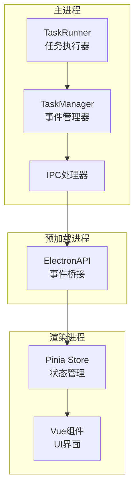
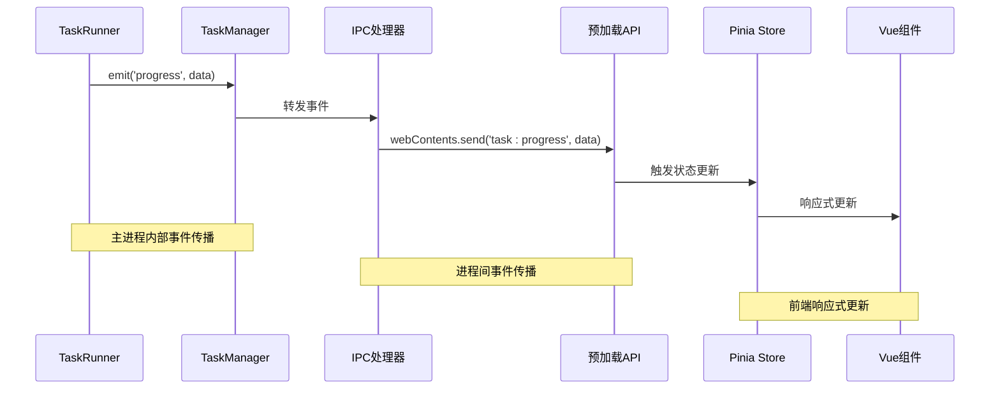
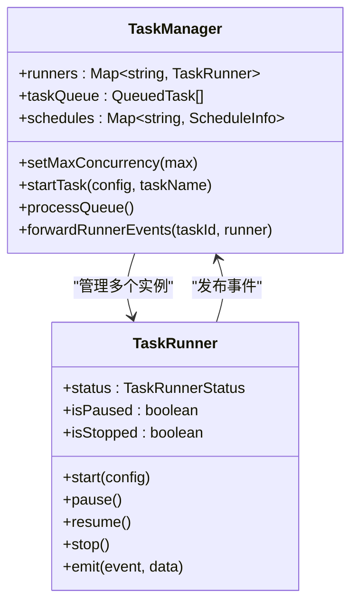
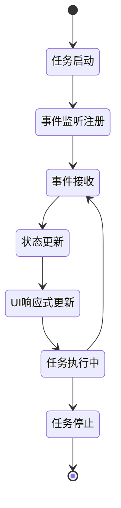

# 观察者模式实现

<cite>
**本文档引用的文件**
- [task-runner.ts](file://src/main/service/task-runner.ts)
- [task-manager.ts](file://src/main/service/task-manager.ts)
- [task.ts](file://src/main/ipc/task.ts)
- [index.ts](file://src/preload/index.ts)
- [task.ts](file://src/renderer/src/stores/task.ts)
- [app.ts](file://src/renderer/src/stores/app.ts)
- [StatusBar.vue](file://src/renderer/src/components/layout/StatusBar.vue)
- [platform.ts](file://src/shared/platform.ts)
- [task.ts](file://src/shared/task.ts)
</cite>

## 目录
1. [简介](#简介)
2. [项目结构](#项目结构)
3. [核心组件](#核心组件)
4. [架构概览](#架构概览)
5. [详细组件分析](#详细组件分析)
6. [依赖关系分析](#依赖关系分析)
7. [性能考虑](#性能考虑)
8. [故障排除指南](#故障排除指南)
9. [结论](#结论)

## 简介

AutoOps项目采用观察者模式实现了完整的任务执行监控系统。该系统通过EventEmitter在主进程中的TaskRunner和TaskManager之间建立松耦合的事件通信机制，实现了任务执行过程中的实时状态监控和进度反馈。

系统的核心观察者模式体现在三个层面：
- **主进程内部**：TaskRunner继承EventEmitter，向TaskManager发布任务状态事件
- **进程间通信**：TaskManager通过IPC事件向渲染进程广播任务状态
- **前端响应式**：Vue组件通过Pinia Store订阅应用状态变化

## 项目结构

AutoOps采用Electron架构，分为主进程(main)、预加载(preload)和渲染进程(renderer)三层：



**图表来源**
- [task-runner.ts:25-50](file://src/main/service/task-runner.ts#L25-L50)
- [task-manager.ts:47-60](file://src/main/service/task-manager.ts#L47-L60)
- [task.ts:130-234](file://src/preload/index.ts#L130-L234)

**章节来源**
- [task-runner.ts:1-760](file://src/main/service/task-runner.ts#L1-L760)
- [task-manager.ts:1-515](file://src/main/service/task-manager.ts#L1-L515)
- [task.ts:1-243](file://src/main/ipc/task.ts#L1-L243)

## 核心组件

### TaskRunner - 任务执行器

TaskRunner是观察者模式的核心实现者，继承自Node.js的EventEmitter，负责实际的任务执行并将状态变化通知给观察者。

**主要职责**：
- 任务生命周期管理（启动、暂停、恢复、停止）
- 任务执行过程中的状态监控
- 事件发布（progress、action、paused、resumed、stopped）

**关键特性**：
- 使用`emit()`方法发布事件
- 维护任务状态（running、paused、stopped、completed、failed）
- 提供异步任务执行能力

**章节来源**
- [task-runner.ts:25-50](file://src/main/service/task-runner.ts#L25-L50)
- [task-runner.ts:55-113](file://src/main/service/task-runner.ts#L55-L113)

### TaskManager - 事件协调器

TaskManager作为TaskRunner的观察者，负责协调多个任务实例，并将任务状态转换为IPC事件。

**主要职责**：
- 任务队列管理
- 并发控制
- 事件转发和聚合
- 浏览器上下文管理

**关键特性**：
- 继承EventEmitter，可发布任务级事件
- 管理多个TaskRunner实例
- 实现任务调度和队列处理

**章节来源**
- [task-manager.ts:47-60](file://src/main/service/task-manager.ts#L47-L60)
- [task-manager.ts:178-230](file://src/main/service/task-manager.ts#L178-L230)

### IPC事件处理器

IPC层负责在主进程和渲染进程之间传输事件，实现跨进程的观察者模式。

**主要职责**：
- 将TaskManager事件转换为IPC消息
- 向所有窗口广播事件
- 提供事件监听器注册接口

**关键特性**：
- 使用`BrowserWindow.getAllWindows()`广播到所有窗口
- 支持多种事件类型的转发
- 实现事件数据的标准化

**章节来源**
- [task.ts:21-77](file://src/main/ipc/task.ts#L21-L77)
- [task.ts:81-240](file://src/main/ipc/task.ts#L81-L240)

## 架构概览

AutoOps的观察者模式架构采用分层设计，实现了从底层任务执行到上层UI显示的完整事件链路：



**图表来源**
- [task-runner.ts:63](file://src/main/service/task-runner.ts#L63)
- [task-manager.ts:389-402](file://src/main/service/task-manager.ts#L389-L402)
- [task.ts:22-27](file://src/main/ipc/task.ts#L22-L27)

## 详细组件分析

### TaskRunner事件机制

TaskRunner实现了完整的任务生命周期事件系统：

#### 进度事件(progress)
- **触发时机**：任务启动、状态变更、执行过程中的关键节点
- **数据结构**：包含message、timestamp、taskId等字段
- **用途**：提供任务执行的实时进度反馈

#### 动作事件(action)
- **触发时机**：任务执行成功完成某项操作时
- **数据结构**：包含videoId、action、success、taskId等字段
- **用途**：记录具体的操作结果和状态

#### 控制事件(pause/resume/stop)
- **触发时机**：任务状态发生重大变化时
- **数据结构**：包含taskId、timestamp等字段
- **用途**：同步任务的暂停、恢复和停止状态

**章节来源**
- [task-runner.ts:63](file://src/main/service/task-runner.ts#L63)
- [task-runner.ts:185-202](file://src/main/service/task-runner.ts#L185-L202)
- [task-runner.ts:339](file://src/main/service/task-runner.ts#L339)

### TaskManager事件协调

TaskManager作为中间层，负责将TaskRunner的事件转换为TaskManager级别的事件：



**图表来源**
- [task-manager.ts:47-60](file://src/main/service/task-manager.ts#L47-L60)
- [task-manager.ts:206-230](file://src/main/service/task-manager.ts#L206-L230)

**章节来源**
- [task-manager.ts:389-402](file://src/main/service/task-manager.ts#L389-L402)
- [task-manager.ts:361-384](file://src/main/service/task-manager.ts#L361-L384)

### IPC事件转发机制

IPC层实现了事件的跨进程传播：

```mermaid
flowchart TD
A[TaskManager事件] --> B[IPC处理器]
B --> C[BrowserWindow.getAllWindows()]
C --> D[webContents.send]
D --> E[预加载API]
E --> F[createIPCListener]
F --> G[window.api.task.onXxx]
G --> H[Pinia Store更新]
H --> I[Vue组件响应式更新]
```

**图表来源**
- [task.ts:22-77](file://src/main/ipc/task.ts#L22-L77)
- [index.ts:124-128](file://src/preload/index.ts#L124-L128)

**章节来源**
- [task.ts:21-77](file://src/main/ipc/task.ts#L21-L77)
- [index.ts:153-160](file://src/preload/index.ts#L153-L160)

### Vue组件响应式更新

渲染进程中的Vue组件通过Pinia Store实现响应式状态管理：



**图表来源**
- [task.ts:162-200](file://src/renderer/src/stores/task.ts#L162-L200)
- [app.ts:18-51](file://src/renderer/src/stores/app.ts#L18-L51)

**章节来源**
- [task.ts:138-201](file://src/renderer/src/stores/task.ts#L138-L201)
- [app.ts:18-51](file://src/renderer/src/stores/app.ts#L18-L51)

## 依赖关系分析

AutoOps的观察者模式实现涉及多个层次的依赖关系：

```mermaid
graph TB
subgraph "事件源"
TR[TaskRunner]
TM[TaskManager]
end
subgraph "事件处理"
IPC[IPC处理器]
API[预加载API]
end
subgraph "事件消费者"
Store[Pinia Store]
Vue[Vue组件]
end
TR --> TM
TM --> IPC
IPC --> API
API --> Store
Store --> Vue
TR -.->|"emit('progress')"|.->TM
TM -.->|"emit('taskStarted')"|.->IPC
IPC -.->|"webContents.send"|.->API
API -.->|"createIPCListener"|.->Store
Store -.->|"响应式更新"|.->Vue
```

**图表来源**
- [task-runner.ts:25](file://src/main/service/task-runner.ts#L25)
- [task-manager.ts:47](file://src/main/service/task-manager.ts#L47)
- [task.ts:21](file://src/main/ipc/task.ts#L21)

**章节来源**
- [platform.ts:1-260](file://src/shared/platform.ts#L1-L260)
- [task.ts:12-31](file://src/shared/task.ts#L12-L31)

## 性能考虑

### 事件频率优化
- **批量事件处理**：对于高频事件（如进度更新），建议合并处理以减少UI重绘开销
- **事件去抖**：对连续的相似事件进行去抖处理，避免过度更新

### 内存管理
- **事件监听器清理**：确保在组件卸载时清理所有事件监听器
- **弱引用使用**：避免形成循环引用导致内存泄漏

### 并发控制
- **任务队列管理**：通过TaskManager的并发控制机制避免资源竞争
- **浏览器上下文复用**：共享BrowserContext减少内存占用

## 故障排除指南

### 常见问题及解决方案

#### 事件监听器未清理
**症状**：组件卸载后仍接收事件，出现内存泄漏
**解决方案**：在组件的onUnmounted钩子中调用cleanupListeners()

#### 事件重复触发
**症状**：同一事件被多次处理
**解决方案**：检查事件监听器的注册逻辑，确保每个事件只注册一次

#### 任务状态不同步
**症状**：UI显示的任务状态与实际不符
**解决方案**：检查IPC事件的转发链路，确保事件在正确的时机触发

**章节来源**
- [task.ts:120-136](file://src/renderer/src/stores/task.ts#L120-L136)
- [task.ts:253-262](file://src/renderer/src/stores/task.ts#L253-L262)

## 结论

AutoOps项目的观察者模式实现展现了现代桌面应用中事件驱动架构的最佳实践。通过TaskRunner、TaskManager、IPC处理器和Vue组件的协同工作，系统实现了：

1. **松耦合的设计**：各组件通过事件进行通信，降低耦合度
2. **实时响应**：事件驱动的架构提供了即时的状态反馈
3. **可扩展性**：新的事件类型和处理逻辑可以轻松添加
4. **跨进程通信**：通过IPC实现了主进程和渲染进程的有效协作

该实现为类似的任务自动化系统提供了优秀的参考模型，特别是在需要复杂状态管理和实时反馈的应用场景中。